# 管理器儀錶板

了解如何從經理儀錶板視圖和跟蹤學習成果。

管理者在團隊的學習計劃中扮演著重要的角色角色。 為了更好地指南他們，學習平台為經理提供了一個儀錶板視圖，用於跟蹤其團隊中的學習情況。

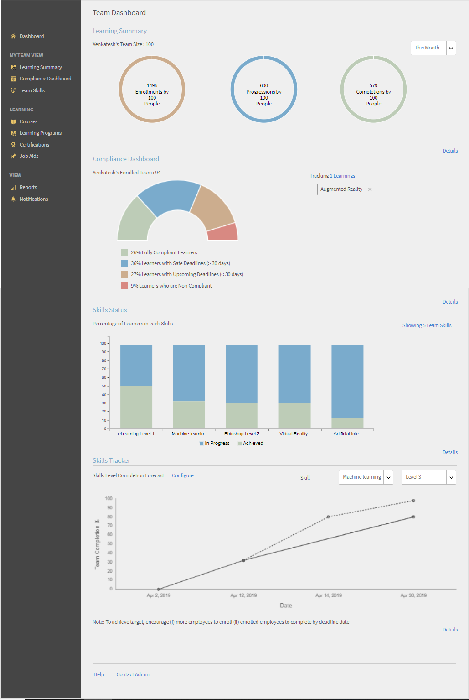

*經理的控制面板報表*

要視圖圖形的詳細信息，請按兩下該圖形或按兩下 **[!UICONTROL Details]** 超連結。

## 學習摘要 {#learningsummary}

经理可以在所選時段上視圖其團隊的學習活動摘要。 從下拉功能表中選擇月、季度或年。

“月”和“年”基於日曆年，而“季度”基於管理員在帳戶設置中配置的財政年度。

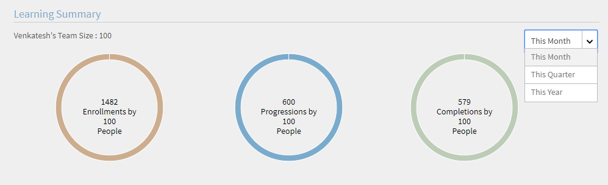

*檢視一段時間內的學習活動*

## 團隊視圖 {#teamview}

團隊檢視顯示團隊、其成員及其各自的學習對象的註冊、進度和完成情況。

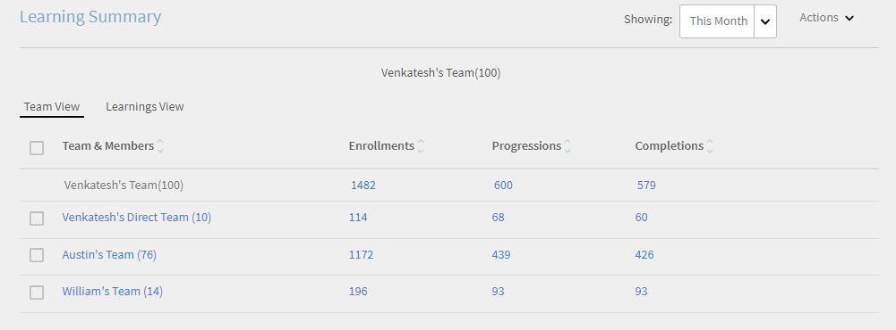

*團隊檢視顯示團隊、其成員及其各自的註冊*

單擊團隊名稱（例如，Venkatesh 的團隊）后，您可以視圖 Venkatesh 團隊中的成員以及學習對象的註冊、進度和完成總數。

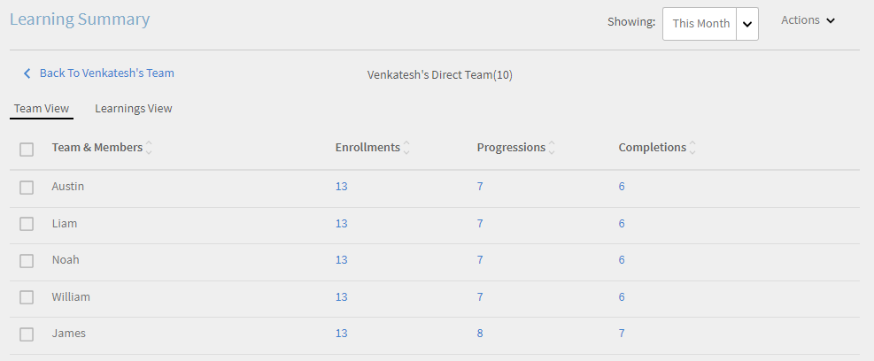

*选取團隊成員*

要視圖每個團隊成員的學習摘要，請按兩下相應列中與團隊管理器對應的數字。 將打開一個表，其中顯示學習物件的清單以及“註冊日期”、“截止日期”和“進度”資訊。

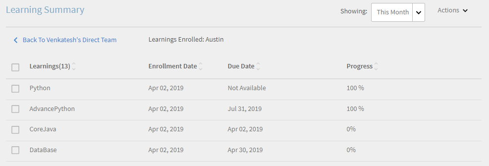

*選擇團隊經理*

同樣，您可以通過按兩下相應列下的值來視圖學習物件以及註冊數、進度數或完成數。

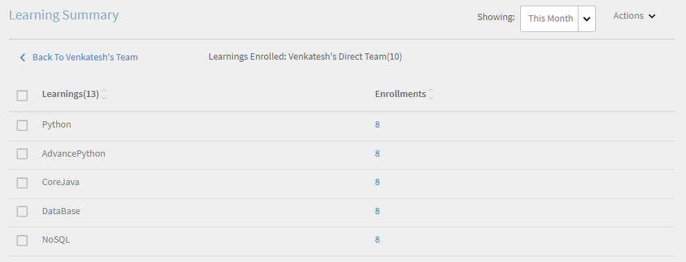

*檢視課程和學習總結*

進一步按下每個學習的註冊數、進度數或完成次數時，您可以視圖以下詳細信息：人員、註冊/完成日期、截止日期和進度。

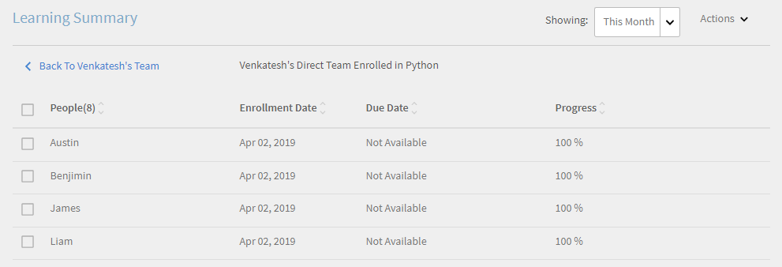

*檢視註冊/完成日期、截止日期和進度*

## 學習檢視 {#learningsview}

學習檢視顯示學習對象的註冊、進度和完成次數。

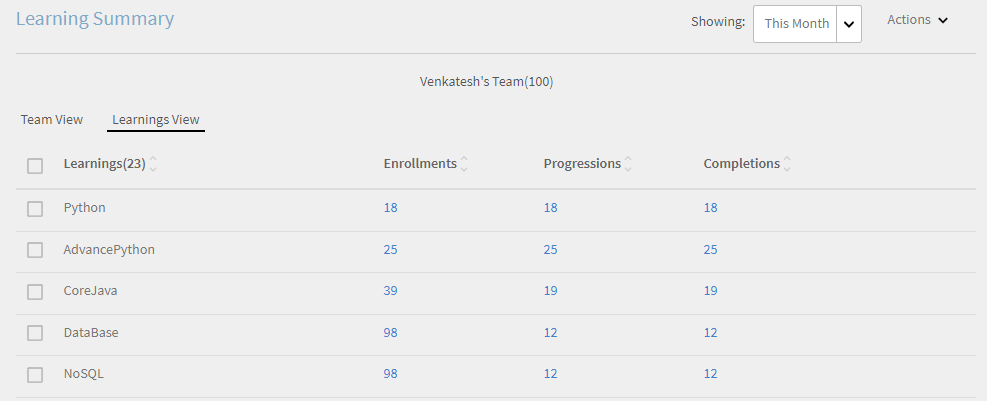

若要視圖詳細資訊，包括相應學習對象的人員、註冊日期、截止日期和進度，請按兩下「註冊」、“進度”和“完成”列中的相應值。

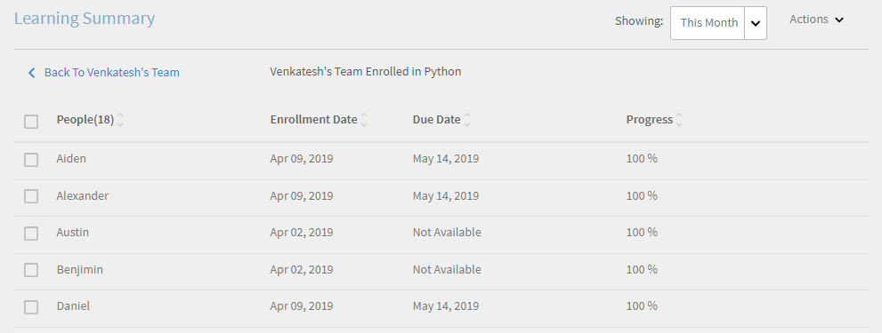

*學習視圖*

## 匯出報表 {#exportreport}

要產生 Excel 報表，請選擇 **[!UICONTROL Actions]>[!UICONTROL Report]**

## 合規性狀態 {#compliancestatus}

在合規性儀錶板中，經理可以視圖團隊的整體合規性狀態，以便跨特定類別（例如，銷售、行銷和法律）配置學習。 管理員可以創建包含合規性課程、學習路徑或認證的儀錶板，並與經理共用。 管理員可以在其實例中視圖管理員共享的儀錶板。

### 檢視控制面板

若要視圖儀錶板，請從管理器應用中進行選擇 **[!UICONTROL Compliance Dashboard]** 。

_合規性儀錶板 - 管理器應用_

合規性儀錶板包括以下合規性狀態：

* **[!UICONTROL Non-compliant Learners]**：顯示錯過截止日期的學習者人數。
* **[!UICONTROL Learners approaching deadlines]**：顯示截止日期在30天內的學習者人數。
* **[!UICONTROL Learners with safe deadlines]**：顯示截止日期較遠（超過30天）的學習者計數。
* **[!UICONTROL Fully compliant Learners]**：顯示完全合規的學習者計數。
* **[!UICONTROL Learners not enrolled anywhere]**：顯示未註冊任何課程、學習路徑或認證的學習者計數。

### 電子郵件管理員和學習者

**管理多個團隊**

如果您管理多個團隊，則可以通過選擇 **[!UICONTROL Email Managers]** 部分中 **[!UICONTROL Team view]** 可用的選項來通知經理其團隊成員的學習狀態。

_電子郵件管理員_

提供 **[!UICONTROL Email Managers]** 下列選項：

* **[!UICONTROL Email Managers of Non-compliant Learners]**：通知團隊成員錯過最後期限的經理。
* **[!UICONTROL Email Managers of Learners Approaching Deadlines]**：通知團隊成員截止日期即將到來的經理。

**管理單一團隊**

如果您管理單個團隊，則可以通過選擇 **[!UICONTROL Email Learners]** 該 **[!UICONTROL Team view]** 部分中可用的選項來通知學習者其學習狀態。

_電子郵件學習者_

這個 **[!UICONTROL Email Learners]** 選項提供以下選項：

* **[!UICONTROL Email Non-compliant Learners]**：通知錯過截止日期的學習者。
* **[!UICONTROL Email Learners Approaching Deadlines]**：通知截止日期即將到來的學習者。

### 下載報表

若要下載報表，追隨以下步驟：

1. 在管理員應用中，轉到 **[!UICONTROL Compliance Dashboard]** > **[!UICONTROL Team view]**。
1. 選取可將 **[!UICONTROL Download report]** 控制面板另存為報表。這使您可以跟蹤團隊的整體學習進度。

_下載報表_

<!--On this dashboard, managers can also view the learners who are compliant, in a safe deadline, approaching deadline, and non-compliant for a selected learning object. 

Learning Objects with completion deadlines can be configured in compliance dashboard for tracking. 

**Compliant**: Displays the number of learners who have completed the learning object within completion deadline.

**Safe deadline**: Displays the number of learners who have less than 30 days available to complete a learning object.

**Upcoming Deadline**: Displays the number of learners with more than 30 days available to complete a learning object.

**Non-compliant**: Displays the number of learners who did not complete the learning object within the completion deadline.

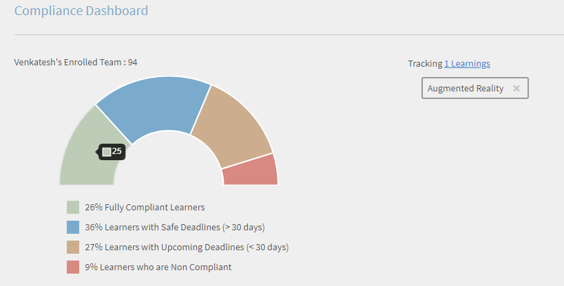

*View compliance dashboard*

## Team View {#TeamView-1}

Displays the compliance status of a course for respective teams. Compliant, Safe Deadline, Upcoming Deadline, and Non-Compliant are columns in the Team View table.

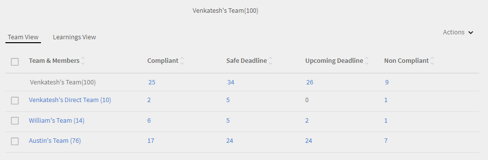

*compliance status of a course for respective teams*

To display names of the members in a team and the individual number of courses for which their status is Compliant, in Safe Deadline, reaching Upcoming Deadline, and Non Compliant, click the corresponding values in the table.

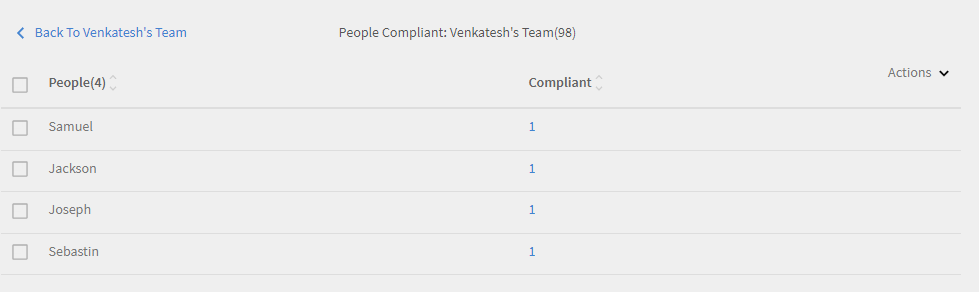

*Select individual teams*

On further clicking the values in the compliant, safe deadline, upcoming deadline, and non-compliant column, the corresponding course details are displayed: Learning object name, enrollment/ completion date, due date, and progress in percentage.

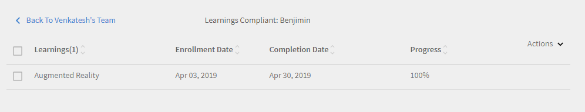 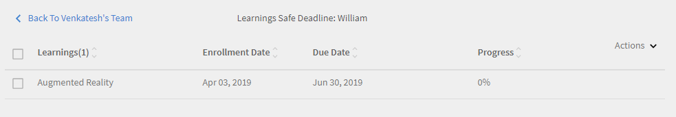

*View progress of courses*

## Learnings View {#LearningsView-1}

In the Compliance Status Learnings View, the list of Learning Objects and the corresponding number of team members that are Compliant, within a Safe Deadline, have an Upcoming Deadline, or are Non Compliant is displayed.

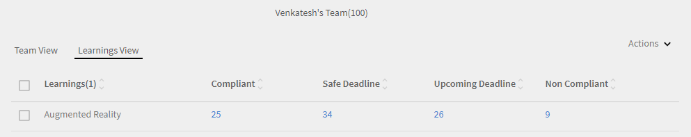

*View deadline and compliance status*

On further clicking the values in the compliant, safe deadline, upcoming deadline, and non compliant columns, the following data is displayed: People, Enrollment Date, Completion date, and Progress.

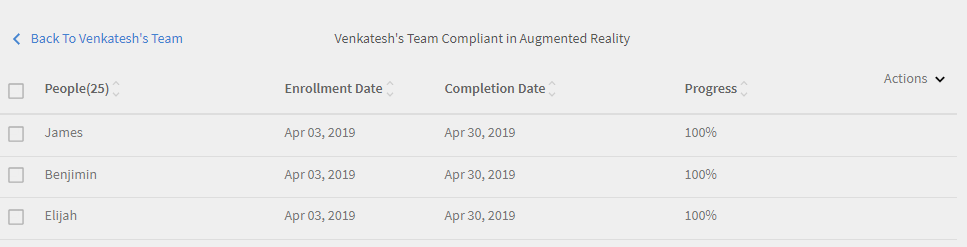

*View details of compliance*

## Export data & send emails {#exportdataampsendemails}

* To export the compliance status for team and learnings view, click **[!UICONTROL Actions]** > **[!UICONTROL Export]**.

* To send an email to team members, click **[!UICONTROL Actions]** > **[!UICONTROL Send Email]**.

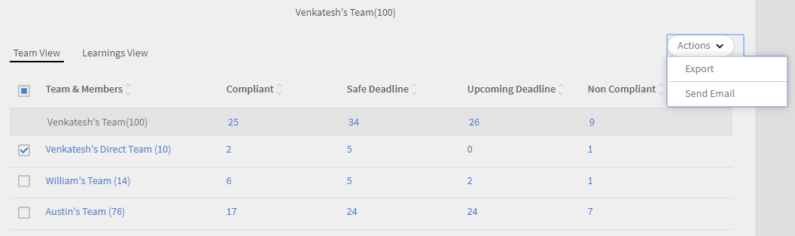

*Export and email data*-->

## 團隊技能 {#teamskills}

經理可以視圖技能完成圖，並在不同級別配置技能完成預測。 技能下拉式清單包括五項技能。 经理了解團隊成員獲得的專業知識，並確定某些技能的強大人才。

经理還可以通過設定目標並預測在時間表内實現特定百分比的團隊技能所需的時間，團隊中推動某些技能。

此預測基於系統計算，該計算為該特定技能的進步提供了未來的視圖。

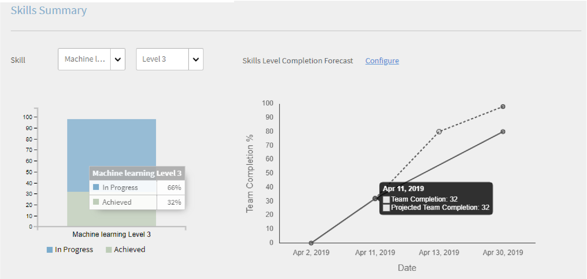

*檢視技能預測*

要視圖團隊的技能狀態，追隨以下步驟：

1. **[!UICONTROL Team Skills]**&#x200B;從左窗格中按兩下「我的團隊檢視」部分下。
1. 要視圖顯示的技能，請按兩下技能篩選器，然後從下拉清單中選擇一個技能。
1. 要選擇級別（級別 1、級別 2 或級別 3），請按下拉功能表。
1. 根據所選的技能和等級，將顯示一個包含其技能狀態的圖表。 將滑鼠懸停在圖表上時，您可以視圖技能狀態的以下百分比： **進行中** 和 **已實現**。

   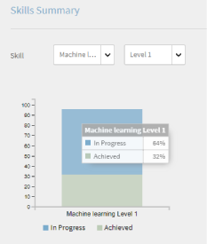

   *檢視技能狀態的百分比*

## 如何預測技能的團隊完成百分比 {#howtoforecasttheteamcompletionforaskill}

要預測技能的團隊完成百分比，追隨以下步驟：

1. 要顯示配置跟蹤器，請按下配置超連結。

   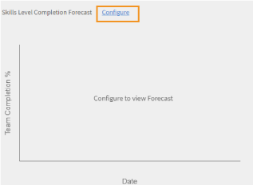

   *選擇「配置」超連結*

1. 在配置彈出對話框中，對於要配置的技能，在“ **Target完成百分比** ”欄位中輸入百分比值，並在“ **Target日期** ”字段中輸入要實現目標完成百分比的日期。

   

   *輸入目標完成百分比*

1. 要視圖預測的輸出，請按兩下 **估計** 按鈕。 輸出如下所示按讚螢幕擷圖。

   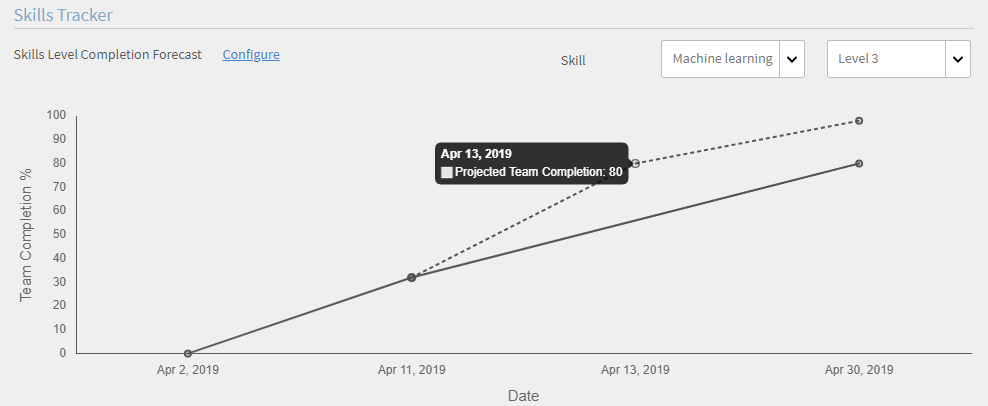

   *檢視技能追蹤輸出*

## 技能水平完成預測 {#skilllevelcompletionforecast}

團隊的經理可以根據技能跟踪器中提供的目標完成百分比和日期時間，視圖和配置特定時段技能的團隊完成百分比。

在預測圖中，有兩種類型的線（實線和虛線），每種線有三個頂點。

在實線上，第一個點顯示技能級別的首次註冊日期。

*檢視技能級別的首次註冊*

第二點顯示技能的當前日期和團隊完成百分比級別。

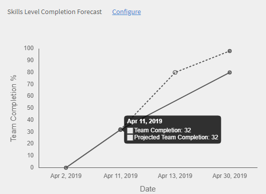

*檢視技能的當前日期團隊完成百分比級別*

該行上的第三個點顯示預期的目標完成百分比和目標完成日期。

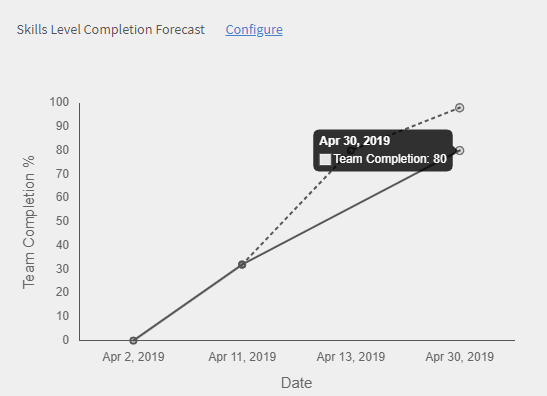

*檢視預計目標完成百分比和目標完成日期*

## 預測線 {#forecastline}

虛線是根據給定時段中技能的當前團隊完成百分比顯示預測的預測線。

虛線上的第一個點表示該日期技能的團隊完成百分比和預計團隊完成百分比。

*檢視他團隊技能的完成百分比和預計團隊完成百分比*

第二個點顯示實現技能的預計團隊完成百分比的日期。

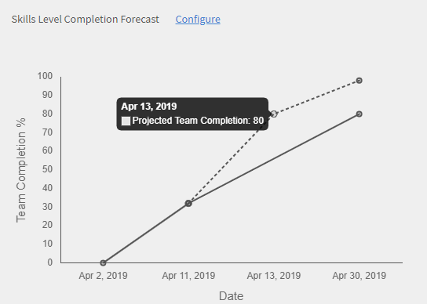

*檢視實現技能預計團隊完成百分比的日期*

預測行中的第三個點顯示在技能跟蹤器中提供的目標日期實現的團隊完成百分比。

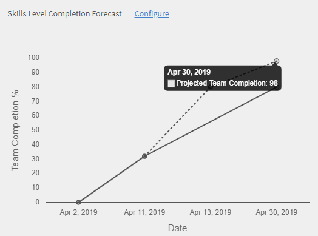

*檢視技能跟踪器中提供的目標日期達到的團隊完成百分比*

在圖表下方，將顯示一個表格，其中包含團隊的視圖以及已註冊、已實現和正在進行的技能數。 如果學習有完成日期，則也會顯示預期完成日期。

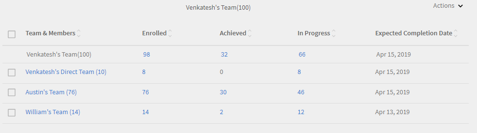

*包含團隊視圖以及已註冊、已實現和正在進行的技能數量的表格*

按兩下團隊名稱時，將顯示註冊技能的成員清單、技能狀態和完成日期。

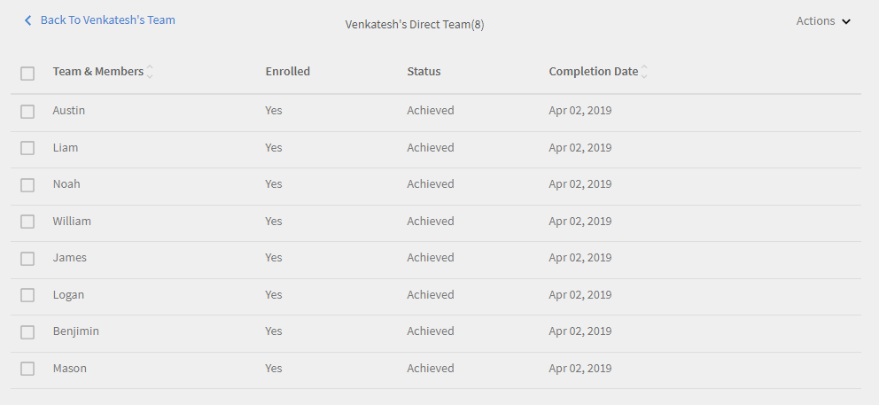

*成員檢視 清單*

按兩下團隊後，可以視圖其中的成員以及所選技能按讚（如果已註冊）、狀態（正在進行中還是已實現）和完成日期（如果已設置）的相應詳細資訊。

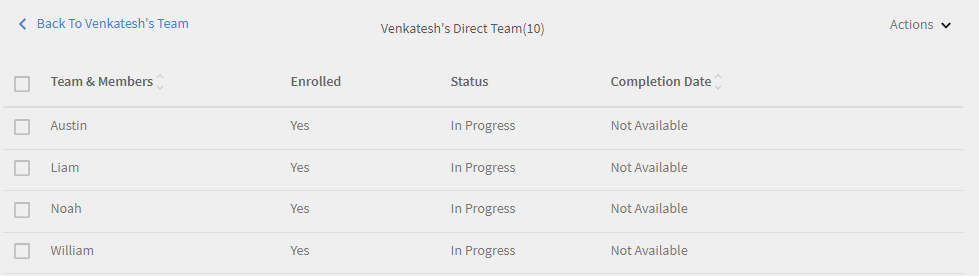

*會員檢視技能*

在「註冊」、「已實現」和「正在進行」列下選擇團隊值時，可以視圖已註冊技能的用戶數。 您還可以視圖用戶註冊技能的日期、狀態和完成日期（如果技能已由用戶完成）。

<!--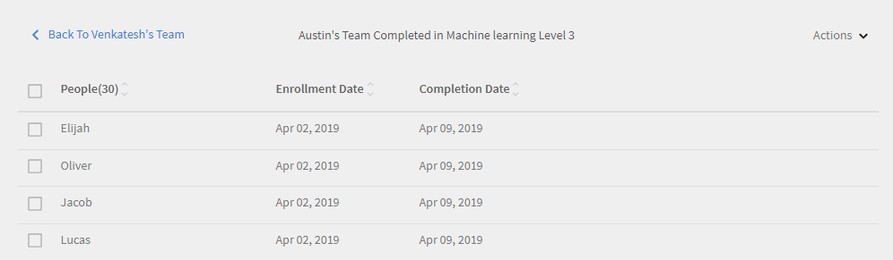 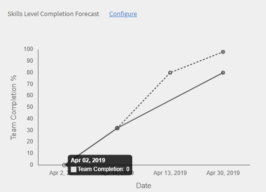-->

## 匯出報表 {#Exportreport-1}

* 按兩下 **[!UICONTROL Actions]** > **[!UICONTROL Export]** 將數據匯出為 Excel 檔案。

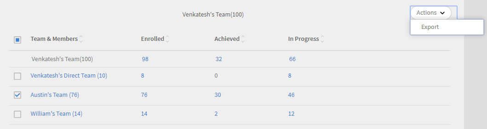

*匯出數據*
