# 經理儀表板

學習如何從經理儀表板查看與追蹤學習成果。

經理在團隊的學習計畫中扮演重要角色。 為了更好地引導他們，學習平台為經理提供儀表板視圖，以追蹤團隊中的學習進度。

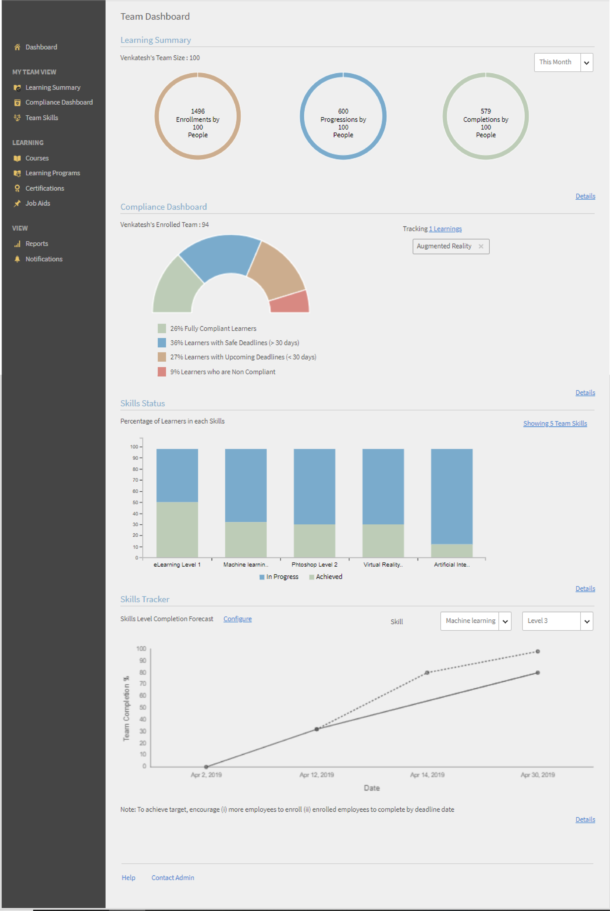

*Manager 儀表板報告*

要查看圖表的詳細資訊，請點擊圖表或點擊 **[!UICONTROL Details]** 超連結。

經理人也能查看下一級經理團隊的儀表板。 例如，使用者A是使用者B、使用者C、使用者D和使用者E的管理者。使用者B和使用者C分別是各自團隊的管理者。 使用者 A 可以查看其直接下屬（使用者 B、使用者 C、使用者 D 和使用者 E）以及由使用者 B 和使用者 C 管理的團隊報告。

## 學習摘要 {#learningsummary}

經理可以查看團隊在特定期間內的學習活動摘要。 從下拉選單選擇月份、季度或年份。

「月份」和「年度」是基於曆年，而「季度」則是管理員在帳戶設定中設定的財務年度。

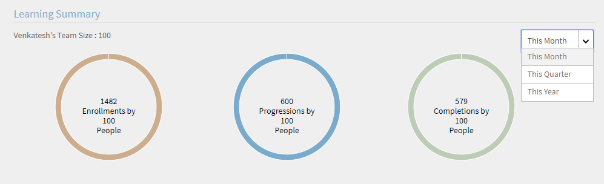

*檢視時間上的學習活動*

## 團隊視角 {#teamview}

團隊視圖顯示團隊、成員，以及他們各自的註冊、進度和學習對象的完成度。

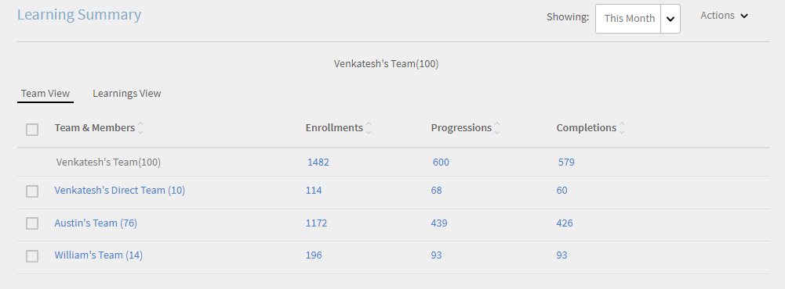

*團隊檢視顯示隊伍、成員及其相關註冊狀況*

點擊團隊名稱，例如「Venkatesh&#39;s Team」，你可以查看 Venkatesh 團隊成員，以及該學習物件的總報名數、進度和完成度。

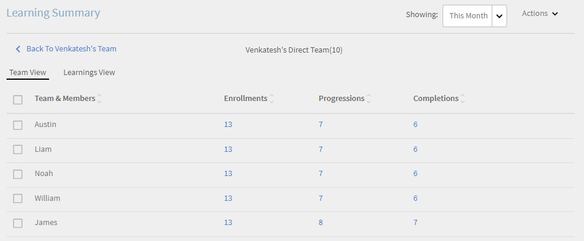

*選擇團隊成員*

要查看每位團隊成員的學習摘要，請點擊對應團隊經理欄位中的數字。 會開啟一張表格，顯示學習物件清單及註冊日期、截止日期及進度資訊。

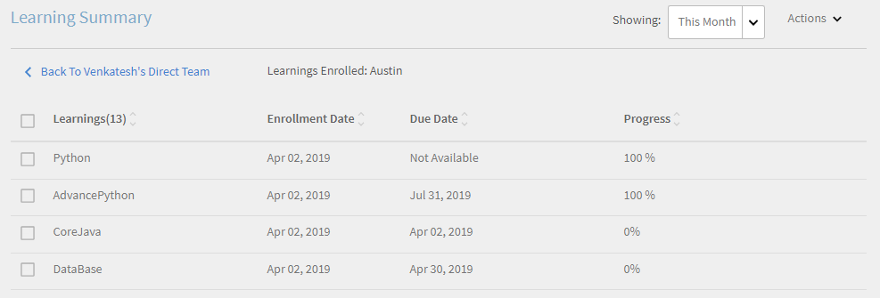

*選擇團隊經理*

同樣地，你也可以點擊對應欄位下的數值，查看學習對象以及註冊次數、進度或完成次數。

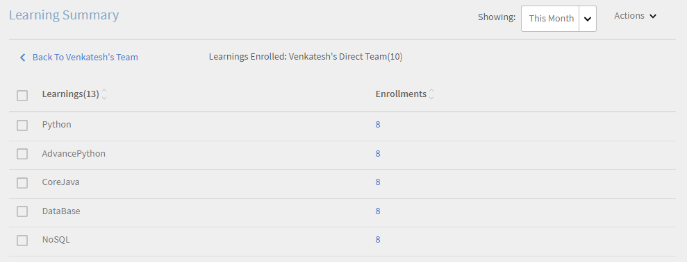

*查看課程與學習摘要*

進一步點擊每項學習的註冊次數、進度或完成次數，您可以查看以下細節：人員、註冊/完成日期、截止日期及進度。

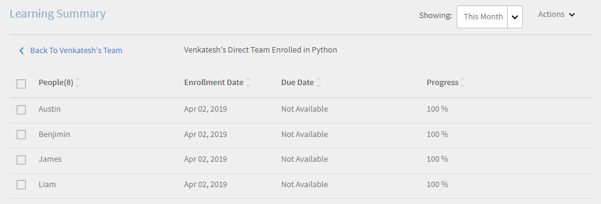

*查看報名/完成日期、截止日期及進度*

## 學習檢視 {#learningsview}

學習檢視顯示學習物件的註冊數量、進度數及完成數。

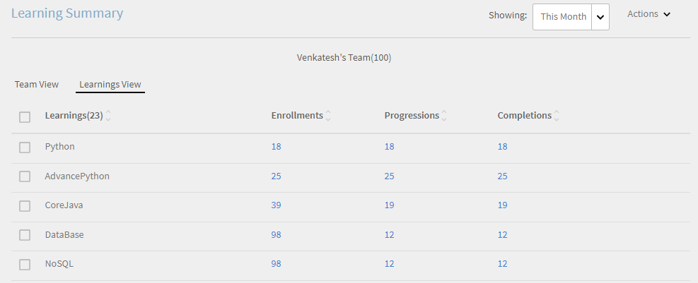

若要查看相關學習對象的人員、註冊日期、截止日期及進度，請點擊註冊、進度及完成欄位中的相應數值。

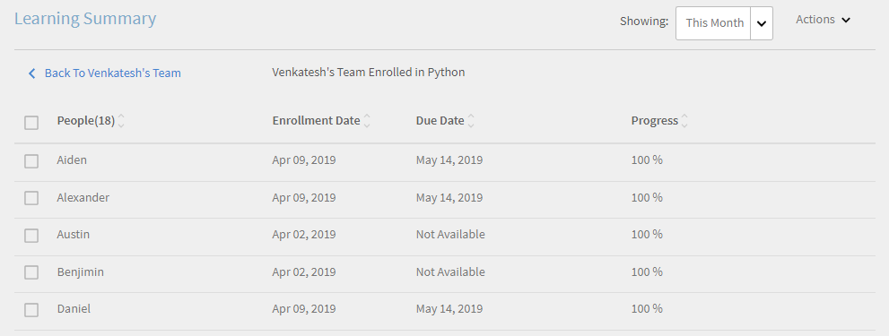

*學習視角*

## 出口報告 {#exportreport}

要產生 Excel 報告，請選擇 **[!UICONTROL Actions]>[!UICONTROL Report]**

## 合規狀態 {#compliancestatus}

在合規儀表板中，經理可查看團隊在特定類別（例如銷售、行銷及法律）配置學習的整體合規狀態。 管理員可以建立包含合規課程、學習路徑或認證的儀表板，並與經理分享。 經理可以在他們的實例中查看管理員分享的儀表板。

### 查看儀表板

要查看儀表板，請從管理器應用程式中選擇 **[!UICONTROL Compliance Dashboard]** 。

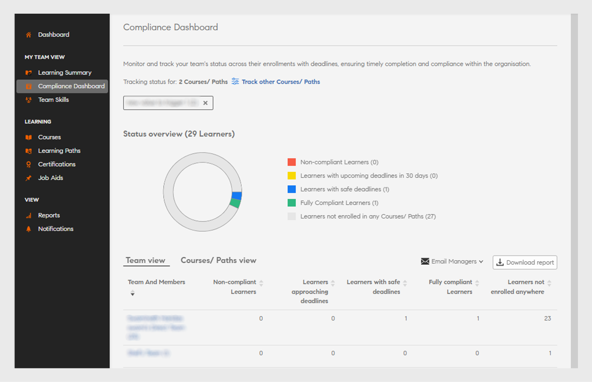
_Compliance dashboard-Manager 應用程式_

合規儀表板包含以下合規狀態：

* **[!UICONTROL Non-compliant Learners]**&#x200B;顯示錯過截止日期的學習人數。
* **[!UICONTROL Learners approaching deadlines]**：顯示30天內截止日期的學習者人數。
* **[!UICONTROL Learners with safe deadlines]**：顯示截止日期較早（超過30天）的學習人數。
* **[!UICONTROL Fully compliant Learners]**&#x200B;顯示完全合規的學習者數量。
* **[!UICONTROL Learners not enrolled anywhere]**：顯示未修讀任何課程、學習路徑或證照的學習者人數。

### 電子郵件管理者與學習者

**管理多支團隊**

如果您管理多個團隊，您可以透過區塊中選項&#x200B;**[!UICONTROL Email Managers]****[!UICONTROL Team view]**&#x200B;通知經理團隊成員的學習狀態。

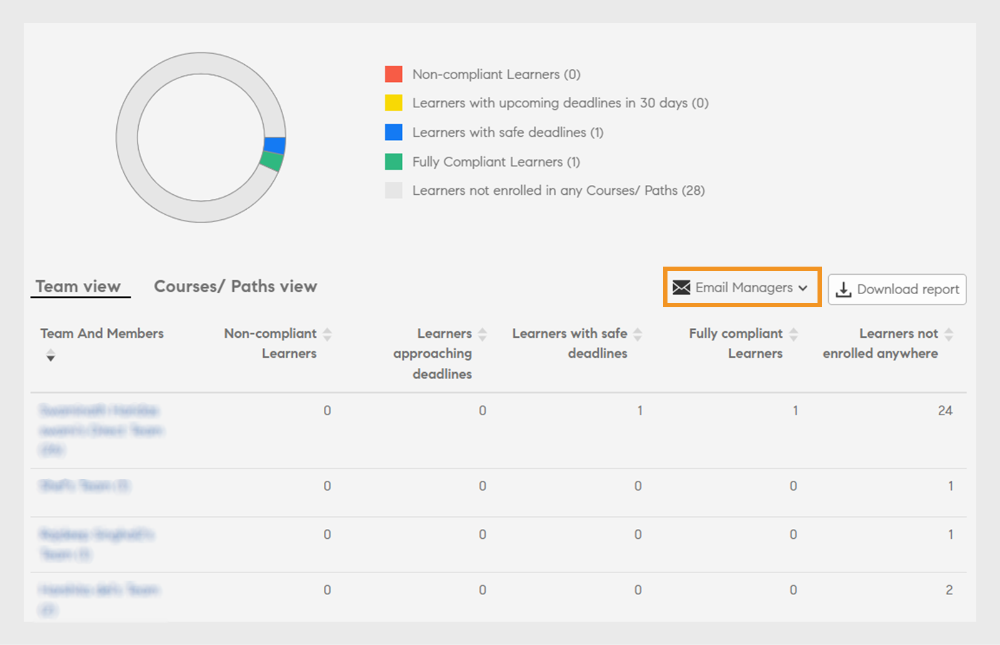
_電子郵件管理員_

它 **[!UICONTROL Email Managers]** 提供您以下選項：

* **[!UICONTROL Email Managers of Non-compliant Learners]**&#x200B;通知團隊成員錯過截止日期的經理。
* **[!UICONTROL Email Managers of Learners Approaching Deadlines]**&#x200B;通知團隊成員即將截止的經理。

**管理單一球隊**

如果您管理單一團隊，您可以透過區塊中提供的&#x200B;**[!UICONTROL Email Learners]****[!UICONTROL Team view]**&#x200B;選項通知學習者他們的學習狀態。

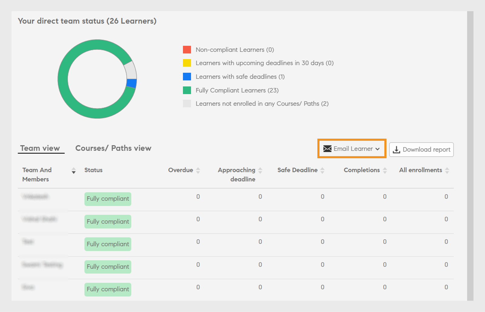
_電子郵件學習者_

這個 **[!UICONTROL Email Learners]** 選項提供以下幾項：

* **[!UICONTROL Email Non-compliant Learners]**&#x200B;通知錯過截止日期的學習者。
* **[!UICONTROL Email Learners Approaching Deadlines]**&#x200B;通知即將截止日期的學習者。

### 下載報告

要下載報告，請依照以下步驟操作：

1. 在經理應用程式中，請前往 **[!UICONTROL Compliance Dashboard]** > **[!UICONTROL Team view]**。
1. 選擇 **[!UICONTROL Download report]** 將儀表板儲存為報告。
這能讓你追蹤團隊整體的學習進度。

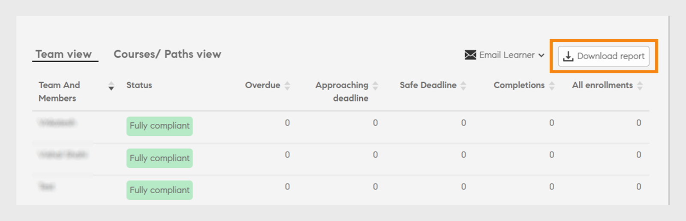
_下載報告_

<!--
On this dashboard, managers can also view the learners who are compliant, in a safe deadline, approaching deadline, and non-compliant for a selected learning object. 

Learning Objects with completion deadlines can be configured in compliance dashboard for tracking. 

**Compliant**: Displays the number of learners who have completed the learning object within completion deadline.

**Safe deadline**: Displays the number of learners who have less than 30 days available to complete a learning object.

**Upcoming Deadline**: Displays the number of learners with more than 30 days available to complete a learning object.

**Non-compliant**: Displays the number of learners who did not complete the learning object within the completion deadline.

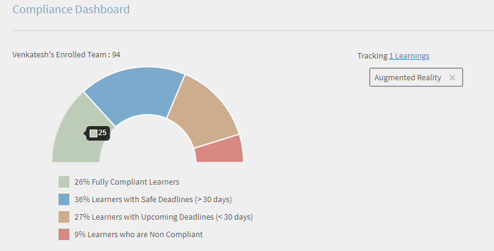

*View compliance dashboard*

## Team View {#TeamView-1}

Displays the compliance status of a course for respective teams. Compliant, Safe Deadline, Upcoming Deadline, and Non-Compliant are columns in the Team View table.

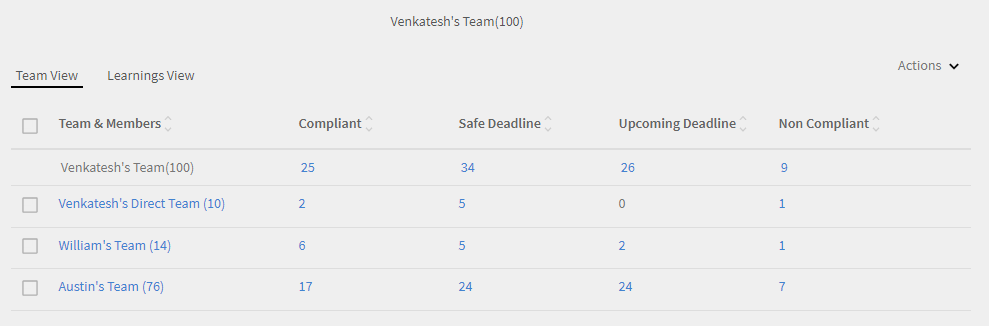

*compliance status of a course for respective teams*

To display names of the members in a team and the individual number of courses for which their status is Compliant, in Safe Deadline, reaching Upcoming Deadline, and Non Compliant, click the corresponding values in the table.

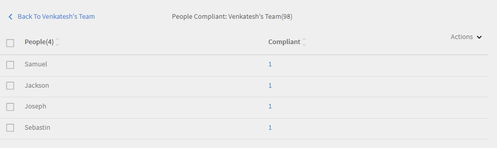

*Select individual teams*

On further clicking the values in the compliant, safe deadline, upcoming deadline, and non-compliant column, the corresponding course details are displayed: Learning object name, enrollment/ completion date, due date, and progress in percentage.

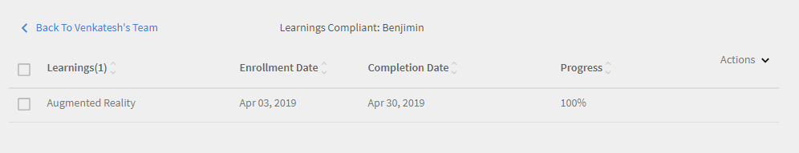 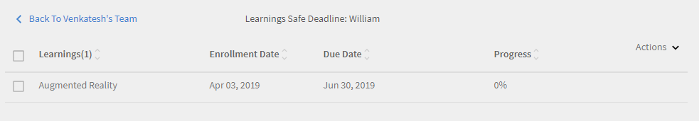

*View progress of courses*

## Learnings View {#LearningsView-1}

In the Compliance Status Learnings View, the list of Learning Objects and the corresponding number of team members that are Compliant, within a Safe Deadline, have an Upcoming Deadline, or are Non Compliant is displayed.

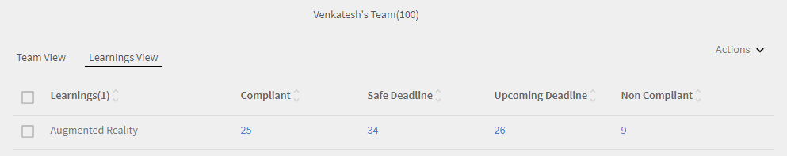

*View deadline and compliance status*

On further clicking the values in the compliant, safe deadline, upcoming deadline, and non compliant columns, the following data is displayed: People, Enrollment Date, Completion date, and Progress.

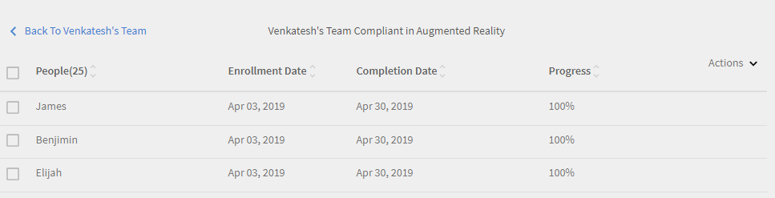

*View details of compliance*

## Export data & send emails {#exportdataampsendemails}

* To export the compliance status for team and learnings view, click **[!UICONTROL Actions]** > **[!UICONTROL Export]**.

* To send an email to team members, click **[!UICONTROL Actions]** > **[!UICONTROL Send Email]**.

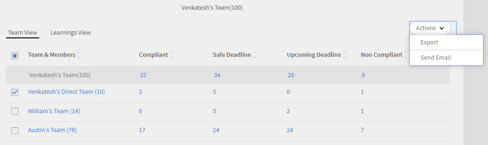

*Export and email data*
-->

## 團隊技巧 {#teamskills}

經理人可以查看技能完成圖表，並在不同層級設定技能完成預測。 技能下拉選單包含五個技能。 經理會了解團隊成員所獲得的專業知識，並發掘出在某些技能上的強項。

經理人也能透過設定目標並預測在時間軸內，特定比例團隊達成某項技能所需的時間來推動團隊的某些技能。

這種預測是基於系統計算，能對該技能未來的進展提供前瞻性。

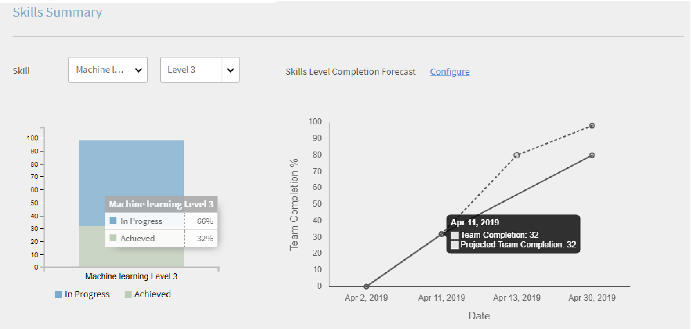

*查看技能預測*

要查看球隊的技能狀態，請遵循以下步驟：

1. 從左側窗格的「我的團隊檢視」區塊點擊 **[!UICONTROL Team Skills]** 。
1. 要查看顯示的技能，請點擊技能篩選器，從下拉選單中選擇一項。
1. 要選擇關卡（Level 1、Level 2 或 Level 3），請點擊關卡下拉選單。
1. 根據所選技能與等級，會顯示技能狀態圖表。 將滑鼠移到圖表上，你可以看到以下技能狀態的百分比：**進行中**（進行中）和&#x200B;**已達成（Attad）。**

   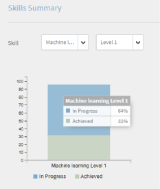

   *查看技能狀態百分比*

## 如何預測某項技能的團隊完成率 {#howtoforecasttheteamcompletionforaskill}

要預測某項技能的團隊完成率，請依照以下步驟操作：

1. 要顯示配置追蹤器，請點擊配置超連結。

   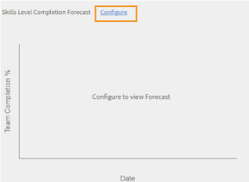

   *選擇「配置」超連結*

1. 在「設定」對話框中，針對你想設定的技能，在目標完成百分比&#x200B;**欄位輸入百分比**&#x200B;值，目標日期&#x200B;**欄位輸入你想達成目標完成百分比**&#x200B;的日期。****

   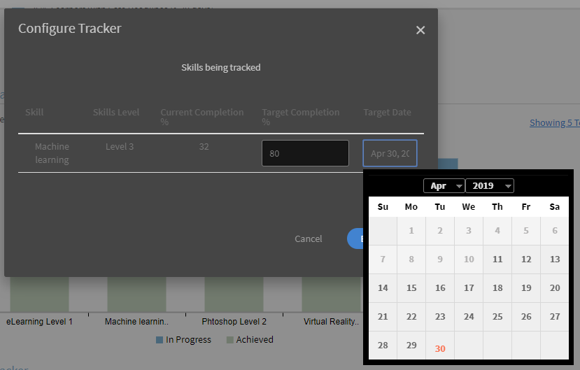

   *進入目標完成率*

1. 要查看預測結果，請點擊 **「估計** 」按鈕。 輸出看起來像下面的截圖。

   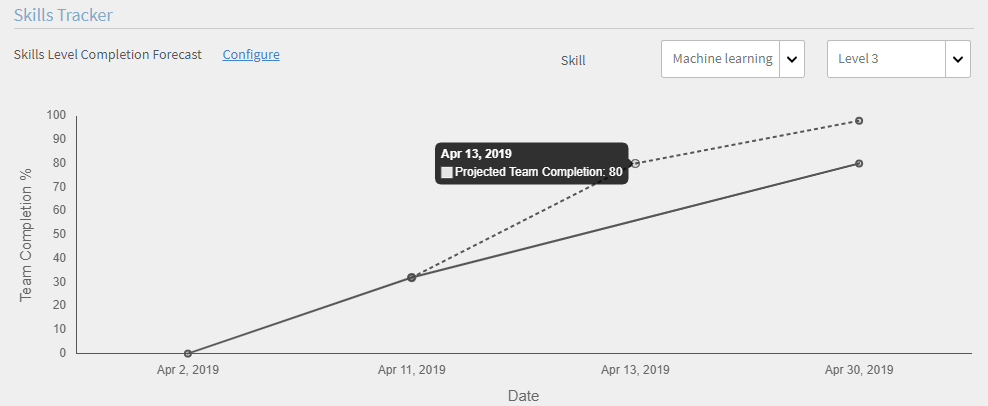

   *查看技能 tracxker 輸出*

## 技能等級完成預測 {#skilllevelcompletionforecast}

團隊經理可根據技能追蹤器中提供的目標完成率與日期時間，查看並設定特定期間內團隊完成率。

在預測圖中，有兩種線條（實線和虛線），各有三個頂點。

實線上，第一個點顯示技能等級首次註冊的日期。

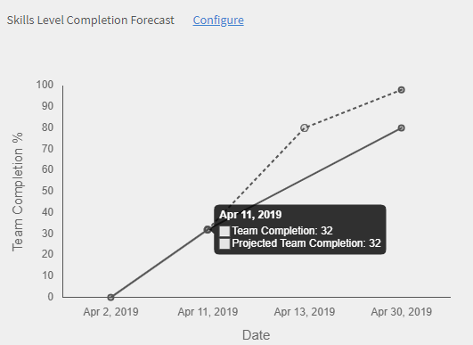

*查看技能等級的首次報名*

第二點顯示當前日期及團隊完成率。

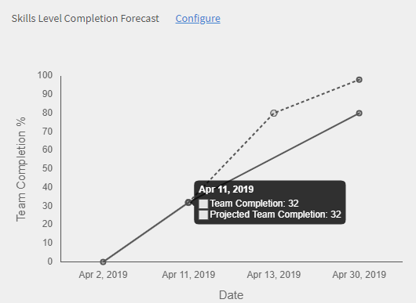

*查看當前日期及團隊完成率技能等級*

線上第三點顯示預期完成率及完成日期。

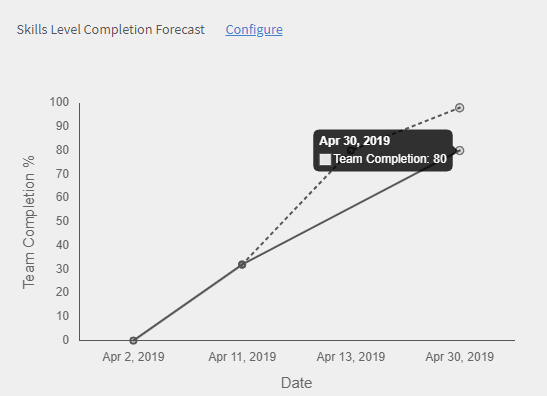

*查看預期完成率及目標完成日期*

## 預報線 {#forecastline}

虛線是預測線，根據特定時間內該技能的當前隊伍完成率，顯示預測結果。

虛線上的第一點代表該天該技能的團隊完成率及預期完成率。

*查看某項技能的團隊完成率與預測完成率*

第二點顯示該技能達成預期團隊完成率的日期。

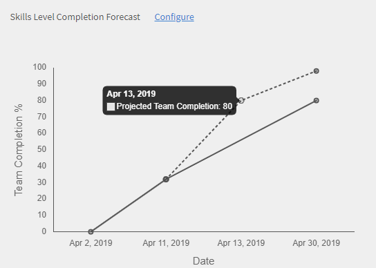

*查看某項技能達成預期團隊完成率的日期*

預測線的第三點顯示技能追蹤器中目標日期內達成的團隊完成率百分比。

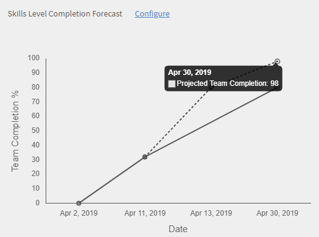

*查看技能追蹤器中提供的目標日期內團隊完成率*

圖表下方顯示一張表格，顯示隊伍視角及已註冊、達成及進行中的技能數量。 若學習有完成日期，則預期完成日期也會顯示。

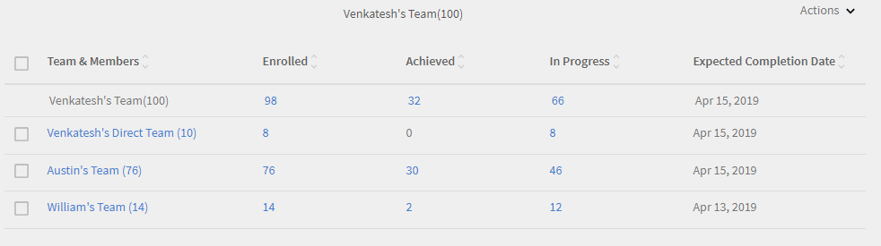

*表格中包含團隊觀點及已註冊、達成及進行中的技能數量*

點擊隊伍名稱後，會顯示已報名該技能的成員名單、技能狀態及完成日期。

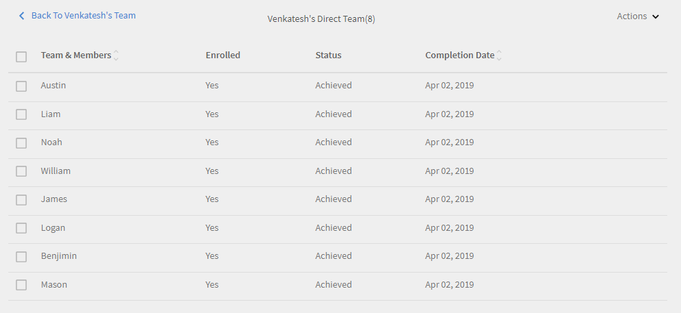

*查看成員名單*

點擊隊伍後，你可以查看隊員及所選技能的相關細節，如是否已註冊、狀態（進行中或已達成）、以及完成日期（若設定）。

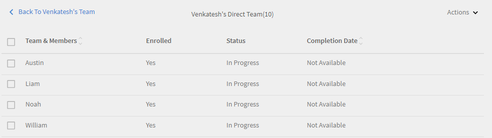

*查看成員技能*

在「註冊、達成、進行中」欄位中選擇隊伍數值時，您可以查看已註冊該技能的用戶人數。 您也可以查看使用者註冊該技能的日期、狀態，以及完成日期（如果是使用者完成的）。

<!--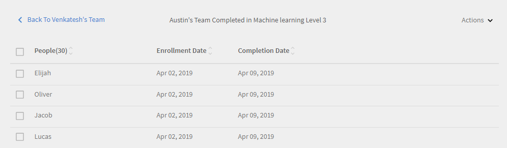 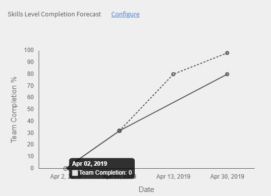-->

## 出口報告 {#Exportreport-1}

* 點擊 **[!UICONTROL Actions]** > **[!UICONTROL Export]** 可匯出資料成 Excel 檔案。

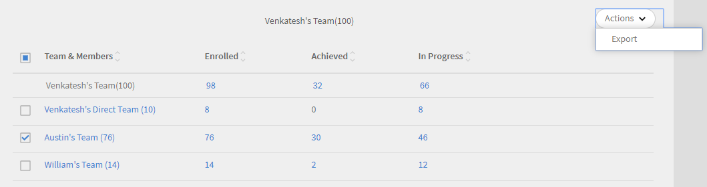

*匯出資料*
