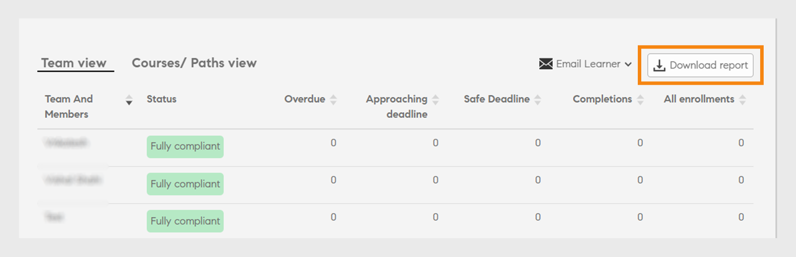

# 管理員儀表板

瞭解如何從經理控制面板檢視及追蹤學習專案。

在團隊的學習活動中，經理扮演著重要的角色。 為了提供更好的指引，學習平台為經理提供儀表板檢視，以追蹤其團隊中的學習。

管理員的&#x200B;*儀表板報告*

若要檢檢視形的詳細資料，請按一下圖形或按一下&#x200B;**[!UICONTROL Details]**&#x200B;超連結。

## 學習摘要 {#learningsummary}

經理可以檢視團隊在選定時段內的學習活動摘要。 從下拉式選單中選取月、季或年。

「月」和「年」是以行事曆年為基礎，而「季」是以管理員在帳戶設定中設定的財政年度為基礎。

*檢視一段時間的學習活動*

## 團隊檢視 {#teamview}

「專案團隊檢視」會顯示專案團隊、專案團隊成員，以及學習物件的個別註冊、進度與完成。

*團隊檢視會顯示團隊、團隊成員及各自的註冊*

按一下專案團隊名稱（例如Venkatesh的專案團隊）後，您可以檢視Venkatesh專案團隊中的成員以及學習物件的註冊、進度及完成總數。

*選取團隊成員*

若要檢視每個團隊成員的「學習摘要」，請按一下與團隊經理對應之欄中的數字。 隨即開啟一個表格，其中顯示學習物件清單及「註冊日期」、「到期日」和「進度」資訊。

*選取團隊經理*

同樣地，您可以按一下對應欄下的值，檢視學習物件以及註冊、進度或完成的數量。

*檢視課程與學習摘要*

進一步按一下每項學習的註冊、進度或完成數，即可檢視下列詳細資料：人員、註冊/完成日期、到期日以及進度。

*檢視註冊/完成日期、到期日和進度*

## 學習檢視 {#learningsview}

學習檢視顯示學習物件的註冊、進度及完成數目。

若要檢視個別學習物件的詳細資訊，包括人員、註冊日期、到期日及進度，請按一下註冊、進度及完成欄中的對應值。

*學習檢視*

## 匯出報告 {#exportreport}

若要產生Excel報表，請選取&#x200B;**[!UICONTROL Actions]>[!UICONTROL Report]**

## 合規狀態 {#compliancestatus}

在合規性儀表板中，經理可以檢視團隊針對跨特定類別（例如銷售、行銷和法律）之已設定學習的整體合規性狀態。 管理員可以建立包含合規性課程、學習路徑或認證的控制面板，並與經理分享。 管理員可以在其執行個體中檢視管理員共用的控制面板。

使用者A是使用者B、使用者C、使用者D和使用者E的管理者。使用者B和使用者C是其各自團隊的管理者。

使用者A可以檢視其直接報告（使用者B、使用者C、使用者D和使用者E）的報告，以及由使用者B和使用者C管理的團隊。

### 檢視控制面板

若要檢視儀表板，請從管理員應用程式中選取&#x200B;**[!UICONTROL Compliance Dashboard]**。

_合規性儀表板管理員應用程式_

合規性控制面板包含下列合規性狀態：

* **[!UICONTROL Non-compliant Learners]**：顯示錯過截止日期的學習者人數。
* **[!UICONTROL Learners approaching deadlines]**：顯示截止日期少於30天的學習者人數。
* **[!UICONTROL Learners with safe deadlines]**：顯示截止日期已過（超過30天）的學習者人數。
* **[!UICONTROL Fully compliant Learners]**：顯示完全相容的學習者數。
* **[!UICONTROL Learners not enrolled anywhere]**：顯示未註冊任何課程、學習路徑或認證的學習者人數。

### 電子郵件管理員和學習者

**管理多個團隊**

如果您管理多個團隊，您可以選取&#x200B;**[!UICONTROL Team view]**&#x200B;區段中可用的&#x200B;**[!UICONTROL Email Managers]**&#x200B;選項，將團隊成員的學習狀態通知給您的經理。

_電子郵件管理員_

**[!UICONTROL Email Managers]**&#x200B;提供您下列選項：

* **[!UICONTROL Email Managers of Non-compliant Learners]**：通知其團隊成員已錯過截止日期的管理員。
* **[!UICONTROL Email Managers of Learners Approaching Deadlines]**：通知其團隊成員截止日期即將到來的經理。

**管理單一團隊**

如果您管理單一團隊，您可以選取&#x200B;**[!UICONTROL Team view]**&#x200B;區段中可用的&#x200B;**[!UICONTROL Email Learners]**&#x200B;選項，通知學習者其學習狀態。

_傳送電子郵件給學習者_

**[!UICONTROL Email Learners]**&#x200B;選項提供您下列選項：

* **[!UICONTROL Email Non-compliant Learners]**：通知錯過截止日期的學習者。
* **[!UICONTROL Email Learners Approaching Deadlines]**：通知臨近截止日期的學習者。

### 下載報表

若要下載報表，請遵循下列步驟：

1. 在管理員應用程式中，移至&#x200B;**[!UICONTROL Compliance Dashboard]** > **[!UICONTROL Team view]**。
1. 選取「**[!UICONTROL Download report]**」以將您的儀表板儲存為報告。
這可讓您追蹤團隊的整體學習進度。

_下載報表_

<!--On this dashboard, managers can also view the learners who are compliant, in a safe deadline, approaching deadline, and non-compliant for a selected learning object. 

Learning Objects with completion deadlines can be configured in compliance dashboard for tracking. 

**Compliant**: Displays the number of learners who have completed the learning object within completion deadline.

**Safe deadline**: Displays the number of learners who have less than 30 days available to complete a learning object.

**Upcoming Deadline**: Displays the number of learners with more than 30 days available to complete a learning object.

**Non-compliant**: Displays the number of learners who did not complete the learning object within the completion deadline.

*View compliance dashboard*

## Team View {#TeamView-1}

Displays the compliance status of a course for respective teams. Compliant, Safe Deadline, Upcoming Deadline, and Non-Compliant are columns in the Team View table.

*compliance status of a course for respective teams*

To display names of the members in a team and the individual number of courses for which their status is Compliant, in Safe Deadline, reaching Upcoming Deadline, and Non Compliant, click the corresponding values in the table.

*Select individual teams*

On further clicking the values in the compliant, safe deadline, upcoming deadline, and non-compliant column, the corresponding course details are displayed: Learning object name, enrollment/ completion date, due date, and progress in percentage.

 

*View progress of courses*

## Learnings View {#LearningsView-1}

In the Compliance Status Learnings View, the list of Learning Objects and the corresponding number of team members that are Compliant, within a Safe Deadline, have an Upcoming Deadline, or are Non Compliant is displayed.

*View deadline and compliance status*

On further clicking the values in the compliant, safe deadline, upcoming deadline, and non compliant columns, the following data is displayed: People, Enrollment Date, Completion date, and Progress.

*View details of compliance*

## Export data & send emails {#exportdataampsendemails}

* To export the compliance status for team and learnings view, click **[!UICONTROL Actions]** > **[!UICONTROL Export]**.

* To send an email to team members, click **[!UICONTROL Actions]** > **[!UICONTROL Send Email]**.

*Export and email data*-->

## 團隊技能 {#teamskills}

經理可以檢視技能完成圖，並在不同層次設定技能完成預測。 技能下拉式清單包含五種技能。 經理可瞭解團隊成員獲得的專業知識，並識別某些技能方面的優秀人才。

經理也可以透過設定目標並預測在時間軸內為特定百分比的團隊實現特定技能所需的時間，來推動團隊中的特定技能。

此預測是以系統計算為基礎，可提供該特定技能未來進度的檢視。

*檢視技能預測*

若要檢視團隊的技能狀態，請遵循下列步驟：

1. 按一下[我的團隊檢視]區段下左窗格中的&#x200B;**[!UICONTROL Team Skills]**。
1. 若要檢視顯示的技能，請按一下技能篩選器，然後從下拉式清單中選取一個篩選器。
1. 若要選取層級（層級1、層級2或層級3），請按一下層級下拉式功能表。
1. 系統會根據所選的技能與等級，顯示具有其技能狀態的圖表。 將游標暫留在圖形上時，您可以檢視下列技能狀態的百分比： **進行中**&#x200B;和&#x200B;**已達成**。

   

   *檢視技能狀態的百分比*

## 如何預測技能的團隊完成百分比 {#howtoforecasttheteamcompletionforaskill}

若要預測某技能的團隊完成百分比，請遵循下列步驟：

1. 若要顯示設定追蹤器，請按一下設定超連結。

   

   *選取設定超連結*

1. 在設定快顯對話方塊中，針對您要設定的技能，在&#x200B;**目標完成%**&#x200B;欄位中輸入百分比值，並在&#x200B;**目標日期**&#x200B;欄位中輸入您想要達到目標完成%的日期。****

   

   *輸入目標完成百分比*

1. 若要檢視預測的輸出，請按一下&#x200B;**預估**&#x200B;按鈕。 輸出內容看起來像下面的熒幕擷圖。

   

   *檢視技能追蹤器輸出*

## 技能層級完成預測 {#skilllevelcompletionforecast}

團隊經理可以根據技能追蹤器提供的目標完成百分比和日期時間，檢視和設定特定時段內技能的團隊完成百分比。

在預測圖表中，有兩種線型（實線和虛線），各有三個頂點。

在實線上，第一個點顯示技能層級的第一個註冊日期。

*檢視技能層級的第一個註冊*

第二個點顯示目前日期和團隊完成技能的%等級。

*檢視目前日期和團隊完成%技能等級*

線上的第三個點顯示預期目標完成百分比和目標完成日期。

*檢視預期目標完成百分比和目標完成日期*

## 預測行 {#forecastline}

虛線是根據指定期間內某技能的目前小組完成百分比而顯示預測的預測行。

虛線上的第一個點代表該日期某技能的團隊完成百分比和預計團隊完成百分比。

*檢視某項技能的團隊完成百分比和預計團隊完成百分比*

第二個點顯示某個技能達到專案團隊完成百分比的日期。

*檢視技能達到專案團隊完成百分比的日期*

預測明細中的第三個點會顯示於技能追蹤器提供的目標日期所完成的小組完成百分比。

*檢視在技能追蹤器*&#x200B;中提供的目標日期完成的團隊完成%

在圖形下，會顯示一個表格，其中包含團隊的檢視以及已註冊、已習得及進行中的技能數目。 如果學習有完成日期，則也會顯示預期完成日期。

*包含團隊檢視和已註冊、已習得及進行中技能數量的表格*

按一下專案團隊名稱時，會顯示已註冊技能、技能狀態和完成日期的成員清單。

*檢視成員清單*

按一下專案團隊時，您可以檢視其中成員以及所選技能的對應詳細資訊，例如，如果註冊、狀態（無論是進行中還是已達成）以及完成日期（如果設定）。

*檢視成員的技能*

在「註冊」、「已獲得」和「進行中」欄下選取團隊的值時，您可以檢視已註冊該技能的使用者人數。 您也可以檢視使用者已註冊技能的日期、狀態和完成日期（如果使用者已完成技能）。

<!-- -->

## 匯出報告 {#Exportreport-1}

* 按一下「**[!UICONTROL Actions]** > **[!UICONTROL Export]**」，將資料匯出為Excel檔案。

*匯出資料*
