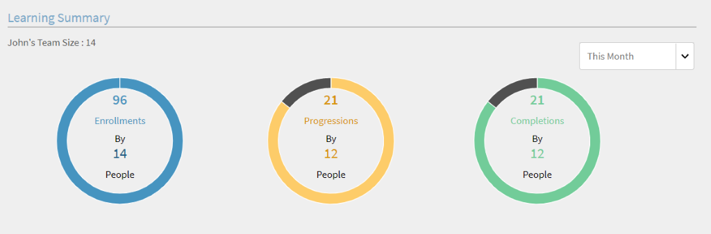
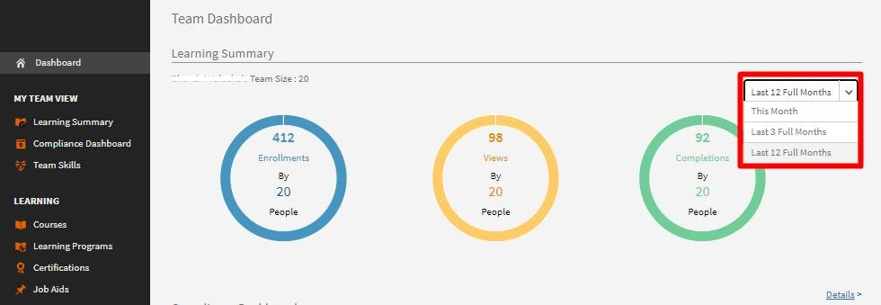
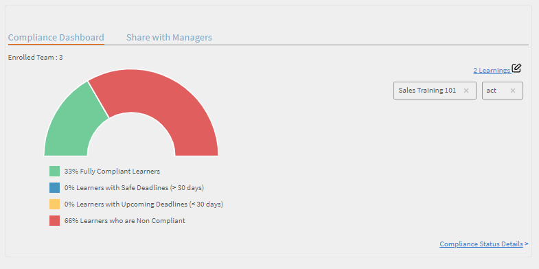
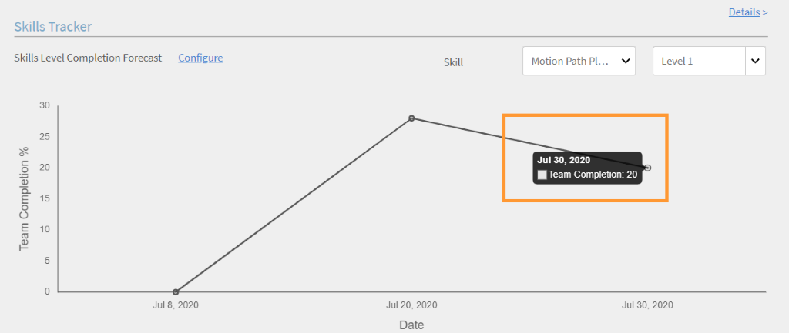
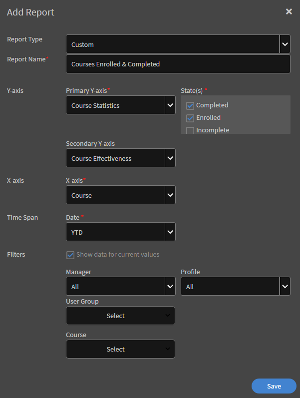
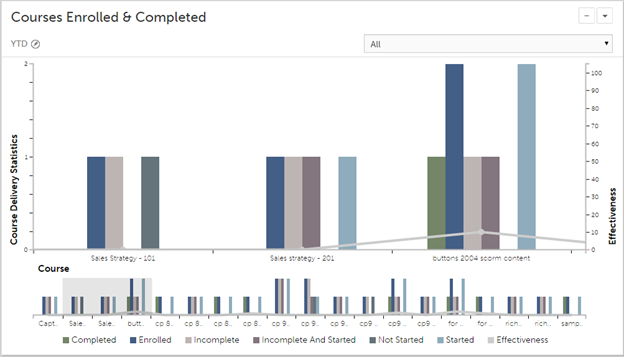
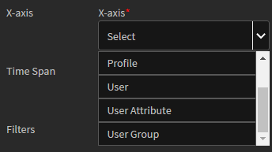
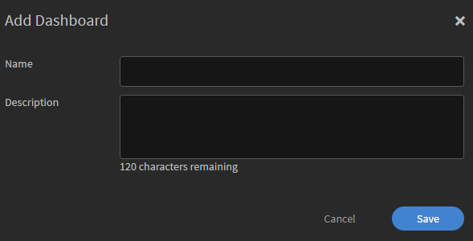
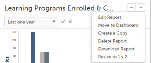

# 報表

建立和管理管理員的報告。

Adobe Learning Manager可讓您建立各種報告，以追蹤、監控及控制學習者活動。 系統會自動追蹤學習者活動並擷取至資料庫中。 管理員和管理員報告會從資料庫產生。

## 概觀 {#overview}

管理員和Manager的報表產生程式相同。 管理員可檢視與其下屬對應的報表，而管理員則可檢視所有組織範圍報表。

報表會在控制面板中彙總。 報表必須存在於控制面板中。 報表頁面中預設存在&#x200B;**預設儀表板**。 您新增的任何報表都會移至此預設儀表板。 若要新增報表至個別儀表板，請使用下拉式箭頭並選擇「新增報表」 。 如需建立控制面板的詳細資訊，請參閱本頁面的控制面板區段。

## 管理員儀表板 {#manager-dashboards}

經理可以摘要形式檢視其直接或間接團隊的相關資訊。

經理可以接著根據範圍（例如，季度、本月、過去三個完整月和過去12個月）來篩選報表。

## 學習摘要 {#learningsummary}

*檢視學習摘要*

*依日期篩選學習摘要*

## 合規性控制面板 {#compliancedashboard}

檢視您團隊的合規性，以及哪個團隊成員接近不合規性。 選擇學習物件並檢視每個物件的狀態。

*檢視規範儀表板*

## 技能狀態 {#skillsstatus}

檢視每項技能的學習者百分比。 選擇最多五個您想讓學習者檢視其技能的技能。 視覺效果採用棧疊長條圖的形式。 當您將滑鼠移到每個橫條上時，您會看到該技能的狀態劃分。

*檢視學習者的技能狀態*

## 技能追蹤器 {#skilstracker}

檢視團隊中技能完成的投影。 選擇技能的目標完成百分比和日期。

根據歷史資料，您可以看到所選日期技能完成預測的圖形表示。

*檢視技能完成預估*

## 建立報告 {#creatingreports}

1. 按一下左窗格中的「報表」 。 報告摘要頁面隨即顯示。\
   **附註**
依預設，報告摘要頁面中至少會顯示三個範例報告。 您只能檢視這些範例報表，以瞭解如何建立和自訂這些報表。

1. 在報告摘要頁面上，按一下「新增」 。 報告建立對話方塊隨即顯示。
1. 按一下儲存，即可完成報表的建立。 報表範例顯示於下方，以供參考。

*新增報告對話方塊*

在「報表型別」中，您可以選擇預先定義的報表集或選擇自訂。 您可以檢視下列報表作為預先定義報表集的一部分：

* 已指派和已習得的技能
* 已註冊及完成的課程
* 課程的成效
* 已註冊和已完成的學習計畫
* 每個課程花費的學習時間
* 每季花費的學習時間

您可以使用上述報告型別來產生300多種變體的報告。

報表名稱輸入報表的標題。

**主要Y軸**&#x200B;從下拉式選項中選擇報告的第一/主要條件。 對於某些選取的條件，您可以選擇從相鄰的「狀態」下拉式方塊中選擇一或多個狀態。 例如，對於課程註冊統計主要標準，狀態可以是已完成、不完整、已註冊等。 主要範圍資料在報表中以長條圖表示。

**次要Y軸**&#x200B;從下拉式選項中選擇報告的次要Y軸條件/範圍。 例如，在學習計畫註冊選項中，從相鄰的「狀態」下拉式選單中選擇一或多個狀態。 次要範圍資料會以折線圖的形式呈現。

**X軸**&#x200B;從下拉式選項中為您的報告選擇適當的x軸條件。 如果選擇X軸作為日期，則可選擇依日、月、季和年將X軸條件分組。

**日期**&#x200B;從下拉式清單中選擇適當的選項。 選項：上個月、季度、年度、QTD （過去90天）、YTD （過去365天）以及日期範圍。 如果您選擇日期範圍，請依照下列方式提供「起始」與「終止」日期：

**從**&#x200B;選擇您要檢視報告的開始日期。

**到**&#x200B;選擇報告的結束日期。

## 篩選器 {#filters}

篩選器會根據您選擇的報告型別，顯示在底部的「新增報告」對話方塊中。 以下列出一些顯著的篩選器。

**管理員**&#x200B;您可以根據階層選擇任一管理員。 對於某些經理而言，可能會有下屬經理與向每個下屬經理報告的多個員工。

**設定檔**&#x200B;選擇您員工的指定。 它有助於根據員工的設定檔/指定來檢視員工報表。 例如，電腦科學家、工程師等。

**使用者群組**&#x200B;選擇您要依據其篩選報表的使用者群組。 Learning Manager會從使用者功能中擷取為您的帳戶定義的使用者群組。

**課程**&#x200B;您可以從下拉式清單中選擇課程，根據任何課程篩選報告。

*檢視已註冊和已完成的課程圖形*

>[!NOTE]
>
>在圖形的圖例上方，您可以檢視縮放方塊。 您可以將游標移到它上，按一下，然後拖曳橫杆到您要放大之縮放方塊區域的任何部分。

您可以橫跨圖形條以直線的形式檢視次要Y軸值。 例如，在上述範例中，您可以看到整個圖形的灰線效果值。

## 使用者群組報表 {#user-group-reporting}

追蹤使用者群組（例如，部門、外部合作夥伴和角色）與其他使用者群組或其他學習目標的比較結果。

### 使用者群組 {#usergroups}

若要根據使用者群組產生報表，請從下列熒幕擷取畫面所示的下拉式選項清單中選擇X軸的&#x200B;**使用者群組**。

*產生使用者群組報告*

另一個&#x200B;**選取**&#x200B;下拉式清單會出現在X軸旁，其中包含您的帳戶可用的使用者群組清單。 在此下拉式清單中，您可以選取一或多個使用者群組。

儲存並產生此報告後，如果您選取多個使用者群組，則會產生報告，且所有使用者群組均以X軸相鄰的長條圖表示。

此使用者群組報表可讓您比較一個部門/部門/角色的績效與另一個部門/部門/角色的績效，以評估其學習成就。

### 自訂使用者群組/使用者屬性 {#customusergroupsuserattributes}

您也可以使用Learning Manager的新增使用者/使用者群組功能來建立自訂的使用者群組。 建立使用者群組之後，您可以利用位置、分支等屬性清單，為這些自訂使用者群組產生報表。

在X軸中，選擇使用者屬性選項，並從其旁邊的&#x200B;**選取**&#x200B;下拉式清單中選取屬性。 若要根據這些屬性建立自訂的使用者群組報表，您還需要在篩選中選擇適當的使用者群組。

經理只能為自己的學習者團隊成員建立使用者群組報表。

## 報表型別 {#typesofreports}

* 學習者的課程傳遞統計資料
* 課程報表的成效
* 學習者技能型報告
* 學習者的學習計畫註冊統計資料
* 學習者花費的學習時間
* 認證完成

## 我的報告 {#myreports}

控制面板是報表的集合。 依據您的選擇，可將報告分組到儀表板中。

**範例報告**

按一下此索引標籤，即可檢視一些以範例資料點為基礎的指示性報表。 探索這些報告，瞭解您可以使用帳戶資料產生的不同型別的功能豐富報告。

**我的報告**

按一下此展示板標籤可檢視您建立的所有展示板。 從檢視面板下拉式清單中，您可以選取預設面板或任何您建立的儀表板。

**新增儀表板**

1. 按一下頁面右側的「新增儀表板」 ，開始建立您自己的儀表板。

   

   *建立您自己的展示板*

1. 提供儀表板的名稱和描述，然後按一下&#x200B;**[!UICONTROL Save]**。

您可以在「我的儀表板」清單中檢視最近建立的儀表板。

若要新增報表至展示板，請按一下展示板視窗右上角的下拉式清單，然後按一下「新增報表」 。 您以此方式建立的報告會關聯至您的儀表板。

>[!NOTE]
>
>按一下「報表」頁面右上角的「新增」所建立的報告，會新增至您的預設儀表板。

**共用報告**

共用報表是組織內其他使用者與您共用的報表集合。 如果您有許可權，可以下載或複製共用報表。 請聯絡貴組織的管理員，以取得共用報告的下載/複製存取權。

**訂閱的報告**

您可以在這裡提供您的電子郵件ID，訂閱您最愛的報告。 您訂閱的報告會透過電子郵件傳送給您。

從報告清單按一下報告名稱右角的&#x200B;**編輯**&#x200B;圖示，隨時修改您的訂閱。

## 檢視報表 {#viewingreports}

在報告摘要頁面上，您可以檢視所有報告。 您可以按一下每個報表右上角的減號(-)圖示，將每個報表最小化。 按一下+圖示以再次檢視您的報表。

**具有不同日期的快速檢視**

您用來檢視報表的日期值是暫時的。 選擇下載選項時，不會下載此報表的此檢視。 這只是暫時的檢視。

您可以變更任何報告的日期範圍/值，並快速檢視不同的日期，而不需要修改和儲存報告。 按一下日期範圍旁的編輯圖示（如下方快照中的箭頭所示），例如QTD、上一年等等。 從下拉式選單中選擇新值，然後按一下勾號以確認變更。 您可以按一下X標籤來取消變更。

**不同管理員的快速檢視**

如果有多個管理員向您報告，您可以快速檢視每個管理員的報告。 從下拉式清單中選擇管理員名稱，以顯示每個管理員的唯一報告。
**編輯/移至儀表板/建立複製/刪除/重新調整報表大小**&#x200B;按一下每個報表右上角的下拉箭頭，以檢視下拉式選項，例如「編輯/移至儀表板/建立複製/刪除/調整大小」。

<!---->

**編輯**&#x200B;修改資料時，若要返回初始值，請按一下[重設]。 修改值後，按一下「儲存」 。

**移至儀表板**&#x200B;您可以將目前的報告移至另一個儀表板，該儀表板是從儀表板清單中選取的。

**建立復本**&#x200B;您可以將報告複製到相同或另一個儀表板（從儀表板清單中選擇）。

**刪除**&#x200B;按一下[刪除]以移除報表。 刪除報表前，系統會顯示警告/確認訊息。

**調整大小**&#x200B;您可以重新調整報表大小，大小分別為1×1 （中）和2×2 （大）。

## 電子郵件訂閱 {#emailsubscriptions}

訂閱報告即可透過電子郵件取得您最愛的報告。

在「報表」頁面中，按一下頁面右上角「新增」按鈕旁的「電子郵件訂閱」 。 報表訂閱頁面隨即顯示。

開始在報表欄位中輸入報表名稱，從下拉式清單中選取報表名稱。 根據您的選擇，選擇每日、每週、每月的電子郵件頻率，新增電子郵件主題，然後按一下「新增」進行訂閱。

按一下編輯以修改訂閱。 按一下移除以刪除訂閱。
