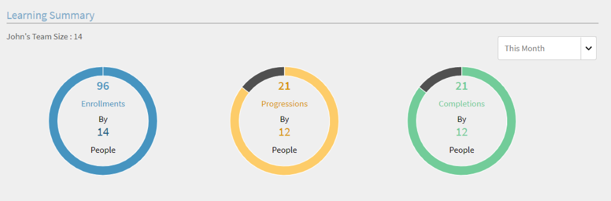
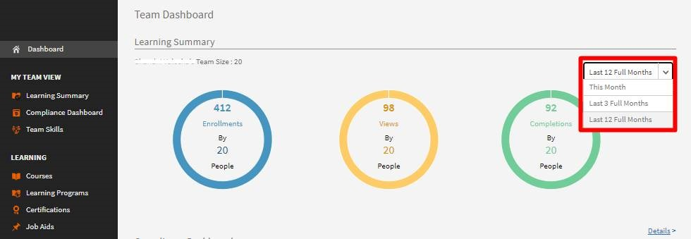
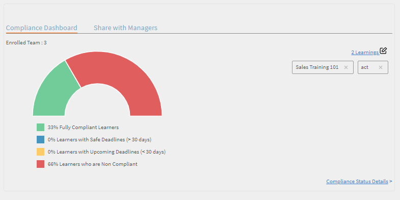
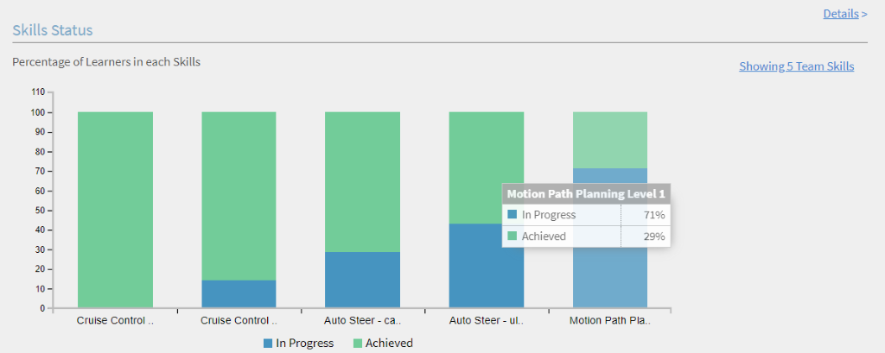
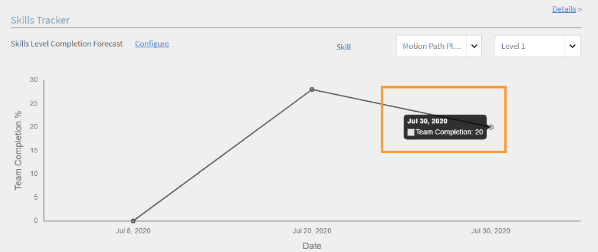
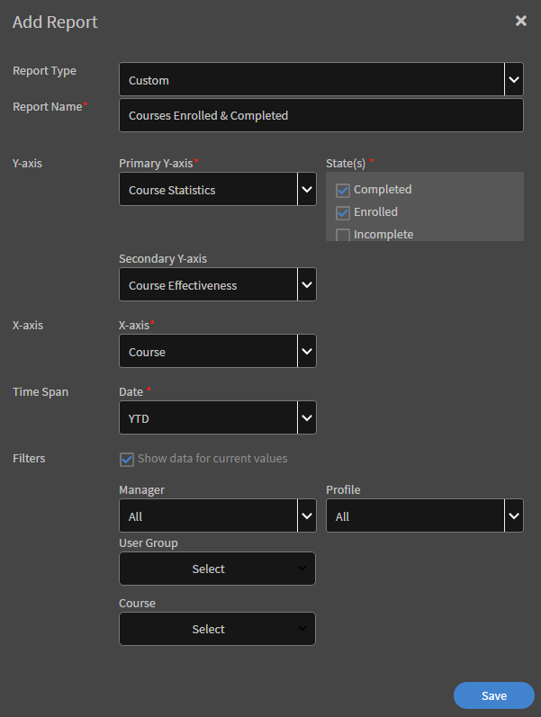
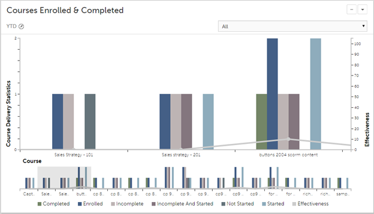
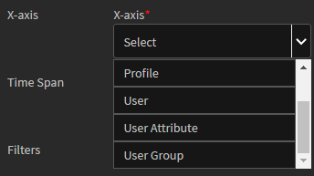
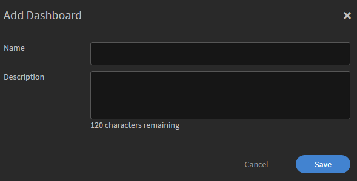
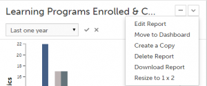

# 報表

為經理建立和管理報告。

Adobe Learning Manager 讓您能建立多樣化的報告，以追蹤、監控及控制學習者的活動。 學習者的活動會被追蹤並自動記錄到資料庫中。 經理與管理員報告則由資料庫產生。

## 概觀 {#overview}

管理員與經理的報告產生流程相同。 經理可查看與下屬相關的報告，而管理員則可查看所有全組織的報告。

報告會被整合在儀表板中。 報告必須存在於儀表板中。 報告頁面預設存在 **預設儀表板** 。 你新增的任何報告都會進入這個預設儀表板。 若要將報表加入個別儀表板，請使用下拉選單箭頭並選擇新增報表。 欲了解更多關於建立儀表板的資訊，請參閱本頁的儀表板章節。

## 經理儀表板 {#manager-dashboards}

經理可以查看其直接或間接團隊的資訊，作為摘要。

經理接著可以依據像是季度、本月、過去三個月和過去12個月等範圍來篩選報告。

## 學習摘要 {#learningsummary}

*查看學習摘要*

*依日期篩選學習摘要*

## 合規儀表板 {#compliancedashboard}

查看你團隊的合規狀況，以及哪位成員接近不合規。 選擇學習物件並查看每個物件的狀態。

*查看合規儀表板*

## 技能狀況 {#skillsstatus}

查看各項技能的學習百分比。 最多選擇五個你想看到學習者技能的技能。 視覺化以堆疊條狀圖的形式呈現。 當你滑鼠移到每條條上時，可以看到該技能狀態的分割。

*查看學習者技能狀態*

## Skils 追蹤器 {#skilstracker}

查看全隊技能完成度的預測。 選擇目標完成率和技能的日期。

根據歷史資料，你可以看到選定日期技能完成預測的圖形化表示。

*查看技能完成預測*

## 建立報告 {#creatingreports}

1. 點選左側窗格的「報告」。 報告摘要頁面會出現。\
   **註**&#x200B;預設情況下，報告摘要頁面中至少會出現三個範例報告。 你只能查看這些範例報告，了解如何建立和客製化它們。

1. 在報告摘要頁面，點擊新增。 報告建立對話框會跳出來。
1. 點擊儲存以完成報告建立。 以下為一份範例報告供參考。

*新增檢舉對話框*

在報表類型中，你可以選擇預先定義的報表集合或自訂。 您可以將以下報告視為預先定義的報告集的一部分：

* 分配與完成的技能
* 已報名與完成的課程
* 課程的效能
* 已註冊及完成的學習課程
* 每門課程所花費的學習時間
* 每學季學習時間

你可以利用上述報告類型產生 300+ 變體的報告。

報告名稱 為你的報告輸入標題。

**主要 Y軸** 從下拉選單中選擇報告的第一或主要標準。 對於部分選定條件，你可以從相鄰州的下拉選單中選擇一個或多個州。 例如，課程註冊統計的主要標準可以是州，可以是完成、未完成、已註冊等等。 主要範圍資料以長條圖形式呈現於報告中。

**次要 Y 軸** 從下拉選單中選擇報告的次要 Y 軸條件/範圍。 例如，在學習計畫註冊選項中，從相鄰州的下拉選單中選擇一個或多個州。 次要範圍資料以折線圖形式表示。

**X 軸** 從下拉選單中選擇報告所需的 X 軸條件。 若選擇 x 軸作為日期，則可依日、月、季及年將 x 軸準則分組。

**日期** 從下拉選單中選擇合適的選項。 選項包括：過去一個月、一季、年度、QTD（過去90天）、年初至今（過去365天）以及日期範圍。 如果你選擇日期範圍，請提供以下日期：

**從 選擇** 你希望查看報告的起始日期。

**選擇** 報告的結束日期。

## 濾鏡 {#filters}

篩選器會根據您選擇的報告類型，出現在底部的「新增報告」對話框中。 以下列出一些主要的過濾器。

**經理** ：你可以根據階級選擇任何一位經理。 有些經理可能會有下屬經理，且每位下屬經理下有多名員工。

**個人資料** 選擇您員工的職稱。 這會幫助你根據員工的個人資料或職稱查看報告。 例如，電腦科學家、工程師等等。

**使用者群組** 選擇你想篩選報告的使用者群組。 Learning Manager 會從使用者功能取得你帳號定義的使用者群組。

**課程** 你可以從下拉選單中選擇任何課程來篩選報告。

*查看已註冊及完成課程的圖表*

>[!NOTE]
>
>在圖例上方，可以看到一個縮放框。 你可以將游標移到它上，點擊，然後拖曳橫桿到你想放大的縮放框區域的任何部分。

你可以以橫跨圖表條的線條來查看次要的 y 軸值。 例如，在上述範例中，你可以在圖表的灰線中看到效能值。

## 使用者群組報告 {#user-group-reporting}

追蹤使用者群組如部門、外部合作夥伴及角色的表現，與其他使用者群組或相對於其他學習目標的比較。

### 使用者群組 {#usergroups}

要根據使用者群組產生報告，請從下方截圖所示的下拉選單中選擇 **X 軸的「使用者群組** 」。

*產生使用者群組報告*

另一個 **選擇** 下拉選單會在 X 軸旁顯示，列出你帳號可用的使用者群組。 在這個下拉選單中，你可以選擇一個或多個使用者群組。

儲存並產生此報告後，若選擇多個使用者群組，報告會以橫條圖形式呈現，並以橫向相鄰的橫條圖呈現。

這份用戶群組報告讓你能比較一個部門/部門/角色的表現，以評估他們的學習成果。

### 自訂使用者群組/使用者屬性 {#customusergroupsuserattributes}

你也可以利用學習管理員中的新增使用者/使用者群組功能來建立自訂的使用者群組。 建立使用者群組後，你可以利用屬性清單（如位置、分支等）產生這些自訂用戶群組的報告。

在 X 軸中，選擇使用者屬性選項，並在旁邊的「從 **選取** 」下拉選單中選擇屬性。 要根據這些屬性建立自訂的使用者群組報告，你也需要在篩選器中選擇適當的使用者群組。

管理者只能為自己的團隊成員建立使用者群組報告。

## 報告類型 {#typesofreports}

* 學習者課程授課統計
* 課程成效報告
* 學習者技能導向報告
* 學習計畫註冊統計資料
* 學習者花費的學習時間
* 認證完成

## 我的報告 {#myreports}

儀表板是一組報告的集合。 報告可以依照你的喜好分組到儀表板中。

**範例報告**

點擊此標籤可查看基於樣本數據點的指示性報告。 探索這些報告，了解你可以利用帳戶資料產生不同類型的功能豐富報告。

**我的報告**

點擊此看板分頁查看您所建立的所有看板。 從檢視板下拉選單中，你可以選擇預設板或任何你建立的儀表板。

**新增儀表板**

1. 點擊頁面右側的新增儀表板，開始建立你自己的看板。

   

   *建立你自己的看板*

1. 提供儀表板名稱與描述，然後點擊 **[!UICONTROL Save]**。

你可以在「我的儀表板」清單中查看最近建立的板子。

要將報告加入你的看板，請點擊看板視窗右上角的下拉選單，然後點選「新增檢舉」。 你用這種方式建立的報告會綁定到你的儀表板。

>[!NOTE]
>
>你在報告頁面右上角點擊新增所建立的報告，會被加入你的預設儀表板。

**共享報告**

共享報告是組織內其他使用者與你分享的報告集合。 如果你有權限，可以下載或複製共享報告。 請聯絡你組織的管理員，取得共享報告的下載/複製存取權限。

**訂閱報導**

你可以在這裡提供你的電子郵件帳號訂閱你喜愛的報導。 您訂閱的報告會透過電子郵件寄送給您。

點擊 **報告名稱右上角的編輯** 圖示，隨時修改訂閱。

## 收視報告 {#viewingreports}

在報告摘要頁面，您可以查看所有報告。 你可以點擊每份報告右上角的減號（-）圖示來最小化每份報告。 點擊+圖示以再次查看您的報告。

**快速檢視與不同日期**

你用來查看報告的日期值是臨時的。 選擇下載選項時，此報告視圖不會被下載。 這只是暫時的觀景。

你可以更改任何報告的日期範圍/值，並快速查看不同日期，無需修改或儲存報告。 點擊與日期範圍相鄰的編輯圖示（如下方快照中以箭頭顯示），如 QTD、過去一年等等。 從下拉選單選擇新值，並點選勾選以確認變更。 你可以點擊 X 標記來取消變更。

**與不同經理的快速檢視**

如果有多位經理同時向你報告，你可以快速查看每位經理的報告。 從下拉選單中選擇經理名稱，以顯示每位經理的獨特報告。
**編輯/移動到看板/建立複製/刪除/調整報表**&#x200B;大小 點擊每份報告右上角的下拉箭頭，可查看下拉選單選項，如編輯/移動至儀表板/建立複製/刪除/調整大小。

<!---->

**編輯：** 在修改資料時，要回到初始值，請點擊重置。 修改數值後點選儲存。

**移至儀表板** 你可以將目前的報告移到另一個儀表板，該儀表板是從儀表板列表中選擇的。

**建立一份副本** 你可以將報告複製到相同或另一個儀表板，該儀表板會從儀表板列表中選擇。

**刪除** 點擊刪除即可移除檢舉。 在刪除檢舉前，會先跳出警告/確認訊息。

**調整大小** 你可以將報告調整為1×1（中）和2×2（大）大小。

## 電子郵件訂閱 {#emailsubscriptions}

訂閱後，您可以透過電子郵件取得您喜愛的報告。

在報告頁面，點擊右上角「新增」按鈕旁的電子郵件訂閱。 報告訂閱頁面會出現。

請在「報告」欄位輸入報告名稱，從下拉選單中選擇報告名稱。 依您喜好選擇每日、每週、每月的電子郵件頻率，新增電子郵件主題並點擊新增以訂閱。

點擊編輯以修改訂閱。 點擊「移除」即可刪除訂閱。
