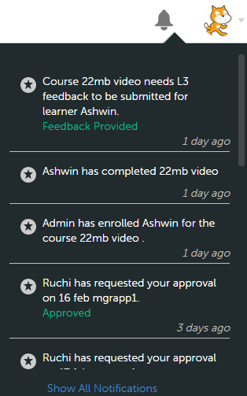
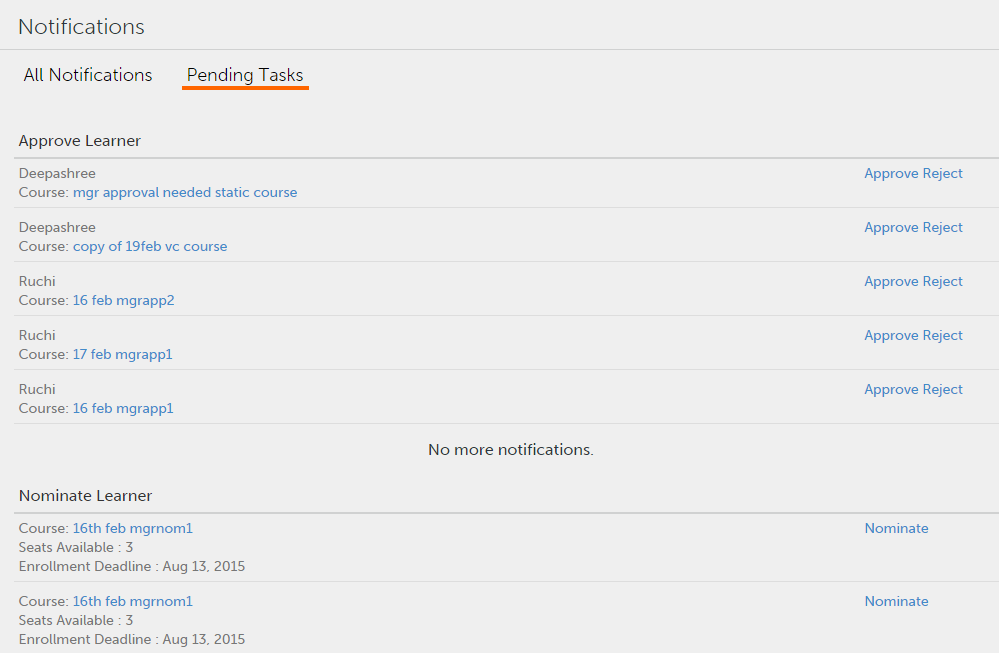

# 使用者通知

設定管理員的使用者通知。

通知功能適用於Adobe Learning Manager 1.0的所有使用者。但是，每個使用者根據其角色在不同情況下會獲得不同種類的通知。 所有給使用者的警報和通知都會透過通知快顯對話方塊顯示。

## 存取通知 {#accessnotifications}

使用者按一下視窗右上角的通知圖示即可檢視通知。 在Manager登入中，您也可以按一下左窗格中的「通知」來存取這些通知。

範例管理員通知快照：

*檢視所有通知*

此快顯視窗會顯示所有通知的醒目提示，以及卷軸出現的時間。 若要檢視關於所有通知的詳細資訊，請按一下快顯視窗底部的顯示所有通知。 「通知」頁面便會顯示。

管理員可以在通知頁面上的標籤式表單中檢視待處理任務和所有通知。 待處理任務通知會根據核准、提名等進行分類。 若要檢視所有通知，請按一下 **[!UICONTROL All Notifications]** 標籤。 在所有通知標籤中，通知會根據日期和時間排序並列出。

*檢視所有擱置中的任務*

您可以透過通知圖示上方醒目提示的數字來瞭解最新通知的數量。 例如，如果在您上次登入後有五個最新的通知，您會看到通知圖示上方顯示五個最新通知。 讀取所有最新通知後，這些數字就會消失。

## 指派課程學習者 {#nominatelearnersforcourses}

在通知視窗中（如上面的快照所示），按一下「指派」連結。 隨即顯示快顯對話方塊。 按一下「指派」。

*指派課程學習者*

**經理的通知型別**

當下列事件觸發時，經理可以取得通知：

1. 學習者註冊課程或學習計畫
1. 學習者完成課程或學習計畫
1. 管理員會將學習者註冊至課程或學習計畫
1. 需要經理為學習者提供L3意見回饋
1. 經理必須將學習者指派至課程
1. 需要經理核准課程的學習者。
1. 需要管理員核准學習者上傳的認證證明檔案
1. 學習者即使在截止日期後也不會完成課程。 （只有在課程執行個體的通知提醒設為學習者經理的向上呈報層級時，才會觸發此事件）

>[!NOTE]
>
>經理也可以在扮演學習者角色時收到通知。 如需詳細資訊，請參閱學習者通知。

## 提供意見回饋 {#providefeedback}

如上述快照所示，經理可以按一下「提供意見回饋」 ，為每門課程或學習計畫的學習者提供L3意見回饋。

>[!NOTE]
>
>只有當管理員針對特定課程啟用意見回饋選項時，學習者和經理才能取得課程的意見回饋選項。
