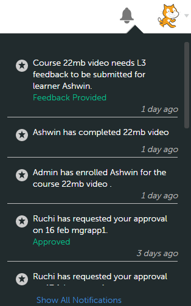
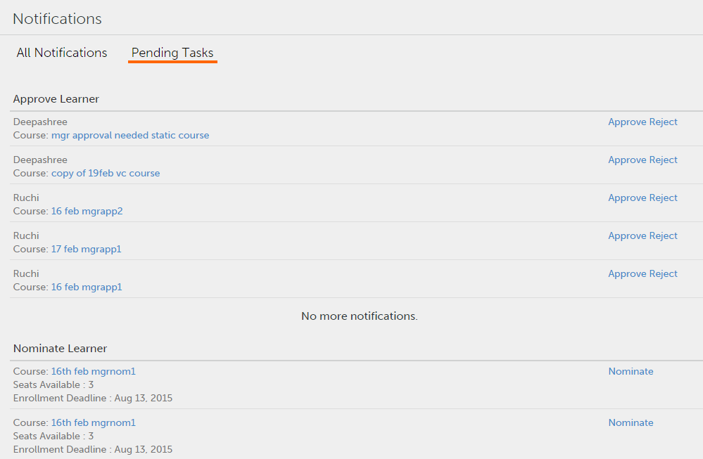
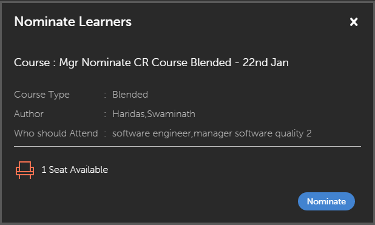

# 使用者通知

為管理者設定用戶通知。

通知功能適用於所有 Adobe Learning Manager 1.0 使用者。 但每個使用者根據其角色在不同情境下會收到不同類型的通知。 所有通知與通知都會透過通知彈出視窗顯示。

## 存取通知 {#accessnotifications}

使用者可點擊視窗右上角的通知圖示查看通知。 在管理員登入時，你也可以點選左側窗格的通知來查看這些通知。

範例管理器通知快照：

*查看所有通知*

這個彈出視窗會顯示所有通知的重點和發生時間，並附上滾動條。 欲查看所有通知的更多資訊，請點擊彈出視窗底部的「顯示所有通知」。 通知頁面會出現。

經理可以在通知頁面的分頁表單中看到待處理任務及所有通知。 待處理任務通知會依據審核、提名等分類。 要查看所有通知，請點擊 **[!UICONTROL All Notifications]** 分頁鍵。 在所有通知標籤中，通知會依日期和時間排序並列出。

*查看所有待處理任務*

你可以透過通知圖示上方高亮的數字來查詢最新通知的數量。 例如，如果你上次登入後有五個最新通知，你可以看到通知圖示上方顯示的數字是五。 這些數字在你看完所有最新通知後就會消失。

## 提名學習者參加課程 {#nominatelearnersforcourses}

在通知視窗中，如上方快照所示，點擊「提名」連結。 彈出視窗視窗。 點擊提名。

*提名學習者參加課程*

**管理人員通知的類型**

當以下事件觸發時，經理可收到通知：

1. 學習者報名參加課程或學習計畫
1. 學習者完成課程或學習計畫
1. 管理員為學習者報名課程或學習計畫
1. 管理者必須向學習者提供第三語言回饋
1. 經理必須提名學習者參加課程
1. 經理必須批准學習者參加課程。
1. 管理者必須批准學習者上傳的認證證明文件
1. 學員即使過了截止日期，也未完成課程。 （此事件僅在課程實例通知提醒設定為升級等級至學習者經理時觸發）

>[!NOTE]
>
>當經理扮演學習者角色時，也能收到通知。 更多資訊請參閱學習者通知。

## 提供回饋 {#providefeedback}

如上圖快照所示，經理可點擊「提供回饋」，為各課程或學習計畫的學習者提供三級回饋。

>[!NOTE]
>
>學習者與管理者只有在管理員啟用特定課程時，才能獲得課程回饋選項。
