# Adobe Learning Manager中的Recommendations

Adobe Learning Manager已推出全新及改版的課程推薦系統。 此建議功能使用AI演演算法和使用者的興趣（例如產品、角色和等級）來提供個人化內容建議。

新的推薦系統可讓您建立自訂引數，讓學習者可選取這些引數以接收個人化推薦。 這些建議將顯示為課程、學習路徑和認證，以供學習者在其首頁資訊源中檢視。

若要開始使用此功能，您必須在管理應用程式中啟用此功能。

## 啟用和設定建議

1. 上傳課程和使用者資料（選用）。
1. 即時進行變更。
1. 啟用並設定建議後，請將資料上傳至AdobeLearning Manager以供建議開始運作。 此資料包含：

   * 課程資料
   * 使用者資料（選擇性）

## 課程排名演演算法

建議引擎的核心是由Learning Manager的新功能所驅動 **[!UICONTROL Course Ranking Algorithm]**. 演演算法會使用5000萬資料點以及跨越數百萬使用者的五年彙總學習資料，根據他們的註冊可能性來排名課程。 此排名可確保大部分可註冊的課程會先顯示給學習者。

## 主要條款

Learning Manager的全新AI型推薦引擎為學習領導者提供可設定的引數型推薦系統，供學習者打造個人化體驗。

引數為 —  **產品/主題**， **角色**、和 **層級**. 此外，這些引數可重新命名以符合您的需求。 因此，「產品」可以成為「主題」，「角色」可以成為「地區」。

## 設定建議系統

Adobe Learning Manager的新推薦引擎簡化了設定個人化推薦所涉及的管理工作流程，因為管理員通常可以取得與客戶/合作夥伴相關聯的產品和角色相關資料（例如從購買記錄中取得）。

設定新建議引擎主要涉及三個工作流程：

* 管理員
* 作者
* 學習者

管理員會設定帳戶的產品、角色和層級引數值。 例如，以銀行為主要客戶群的IT解決方案提供者可設定「Product」引數為具有如Payment Gateway、Secure Cloud Storage、Fraud Detection System、Trading Platform等值，而設定「Role」引數為具有如Integration Specialist、Network Administrator、Risk Analyst、Compliance Offer等值。

在Learning Manager中，管理員可獲得引導式工作流程，以便最佳地設定建議引擎，並根據帳戶的使用案例自訂引擎。 此外，管理員也可以選擇透過一次性CSV上傳設定PRL建議。

1. 選取 **[!UICONTROL Recommendations]** 在「管理員」應用程式上。

   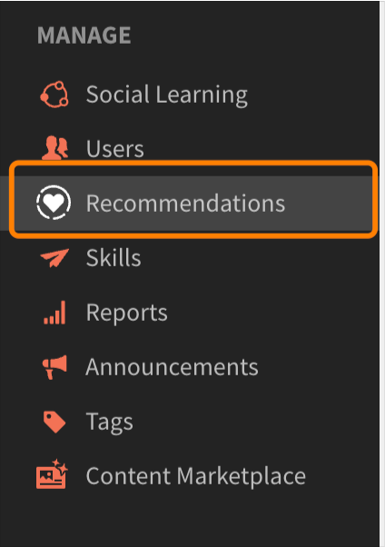

   *選取Recommendations選項*

1. 按一下 **[!UICONTROL Upgrade]**.

   

   *選取升級選項*

1. 按一下 **[!UICONTROL Proceed]** 升級至新的推薦系統。

   
   *選取繼續按鈕*

1. 建立「產品」和「角色」的建議引數。

   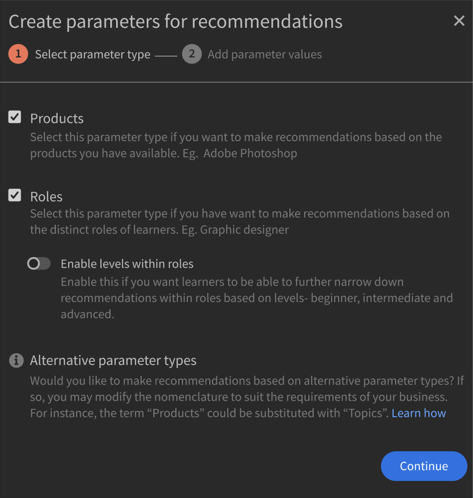
   *建立建議的引數*

1. 按一下 **[!UICONTROL Add more values]**.
1. 新增產品。 輸入產品名稱，然後按一下Enter。

   您必須至少新增兩個產品才能開始使用。

   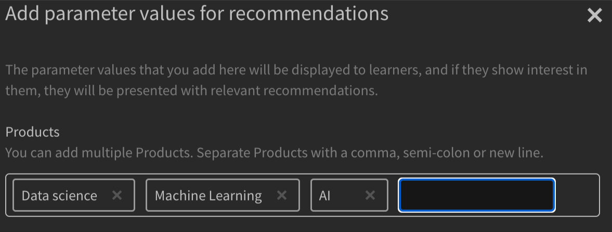
   *新增產品*

1. 新增角色。 輸入角色名稱，然後按一下Enter。

   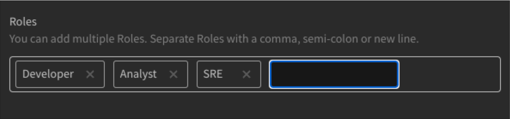
   *新增角色*

1. 按一下 **[!UICONTROL Continue]**.

   「產品」和「角色」現在會出現在引數清單中。

   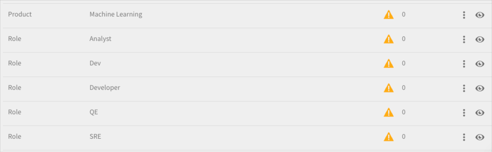
   *產品和角色清單*

## 資料準備

必須上傳使用者興趣資料、產品、角色和層級，建議才能正常運作。

**上傳資料選項**

Recommendations功能可供設定。 因此，您可以使用主題/角色/層級，而不是產品/角色/層級，或者選擇以下任一選項：僅限產品/主題、僅限角色、僅限產品/主題與角色、僅限角色層級或僅限產品層級。

根據您選擇的建議設定，相應地修改資料表。

下節將說明使用產品、角色與層級的最廣泛選項。

管理員必須以預先決定的格式上傳使用者資料。 上傳的資料會傳入Recommendation演演算法，因此學習者會根據其角色和層級收到正確課程的建議。

**必要條件**

若要上傳資料讓建議發揮作用，請在使用者和RecommendationLO CSV中填入產品、角色和層級。

在資料準備練習中，我們會提供兩個CSV範本：

**RecUser.csv**

* 使用者ID
* 產品
* 角色
* 層次（初級、中級或進階）

以下是csv中的記錄範例：

| 使用者ID | 產品 | 角色 | 層級 |
|--- |--- |--- |--- |
| 123 | 資料科學 | 分析人員 | 分析人員：中級 |
| 456 | 航空引擎 | 技術人員 | 技術人員：進階 |

**RecLO.csv**

* 培訓
* 訓練型別
* 訓練名稱
* 產品
* 角色
* 層級
* 標籤
* 技能

以下是csv中的記錄範例：

| 訓練ID | 訓練型別 | 訓練名稱 | 產品 | 角色 | 層級 | 標籤 | 技能 |
|---|---|---|---|---|---|---|---|
| 111 | 課程 | Python 101 | 資料科學 | 分析人員 | 分析人員：中級 | 資料 | 一般 |
| 222 | 課程 | Julia 101 | 資料科學 | 分析人員 | 分析人員：進階 | 資料 | 一般 |

填入這些CSV並和您的客戶成功團隊聯絡，以下載格式並上傳這些CSV。

## 讓建議上線

上傳兩個CSV後，按一下「上線」。 學習者將可看見此新建議系統。

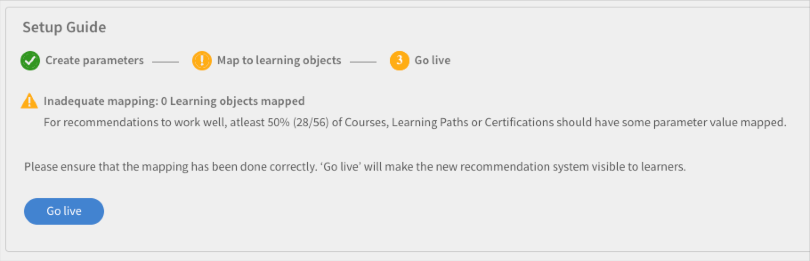
*讓建議上線*

您的學習者現在可以使用推薦系統。

## 編輯引數

1. 在引數清單中，選取三個點的圖示，然後選取 **[!UICONTROL Edit parameter name]**.

   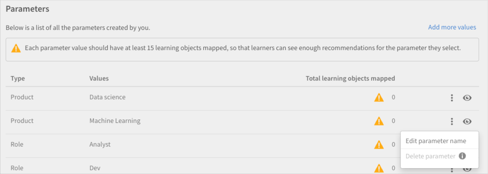

1. 變更引數名稱，然後按一下 **[!UICONTROL Save]**.

   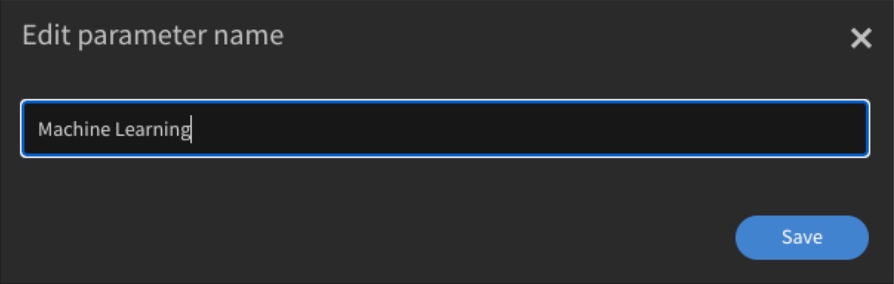
   *編輯引數*

## 刪除引數

1. 在引數清單中，選取三個點的圖示，然後選取 **[!UICONTROL Delete parameter]**.

*刪除引數*

## 課程設定頁面

在課程的設定頁面中，會列出產品和角色的建議。 如果學習者對這些產品和角色有興趣，我們會建議他們參加此課程。

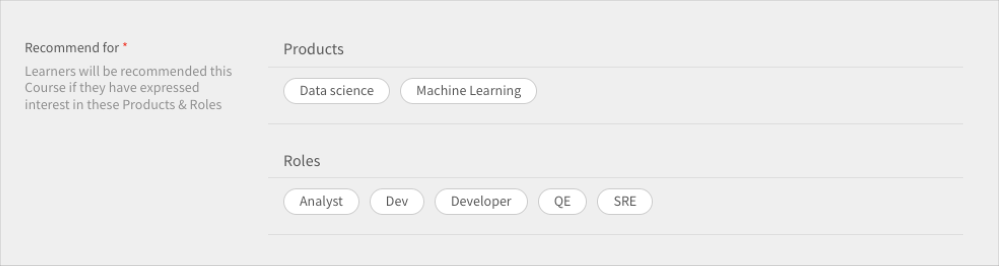
*課程設定頁面*

## 學習者檢視

針對已設定PRL型建議的帳戶，當學習者登入學習平台時，引導式工作流程可協助學習者根據其產品、角色和層級偏好設定建議。 這會建立學習者設定檔，以供建議引擎分析。

帳戶中已切換至新建議系統的學習者可以檢視建議的課程和訓練。

學習者可看到下列內容：

* 產品、角色 — 層級：系統會提示學習者先選取產品、角色，然後為每個選取的角色選取層級
* 產品 — 層級：系統會提示您先選取產品，然後為每個選取的產品選取層級
* 角色 — 層級：系統會提示學習者為每個選取的角色先選擇角色，然後選擇層級。
* 產品和角色：系統會提示您先選擇產品，然後選擇角色。
* 產品：系統會提示學習者僅選取產品。
* 角色：系統會提示學習者僅選擇角色。

在左側面板上選取Recommendations後，學習者會看到快顯視窗以設定建議。

*學習者設定建議*

按一下「設定Recommendations」 ，系統會將學習者導向產品選擇快顯視窗。

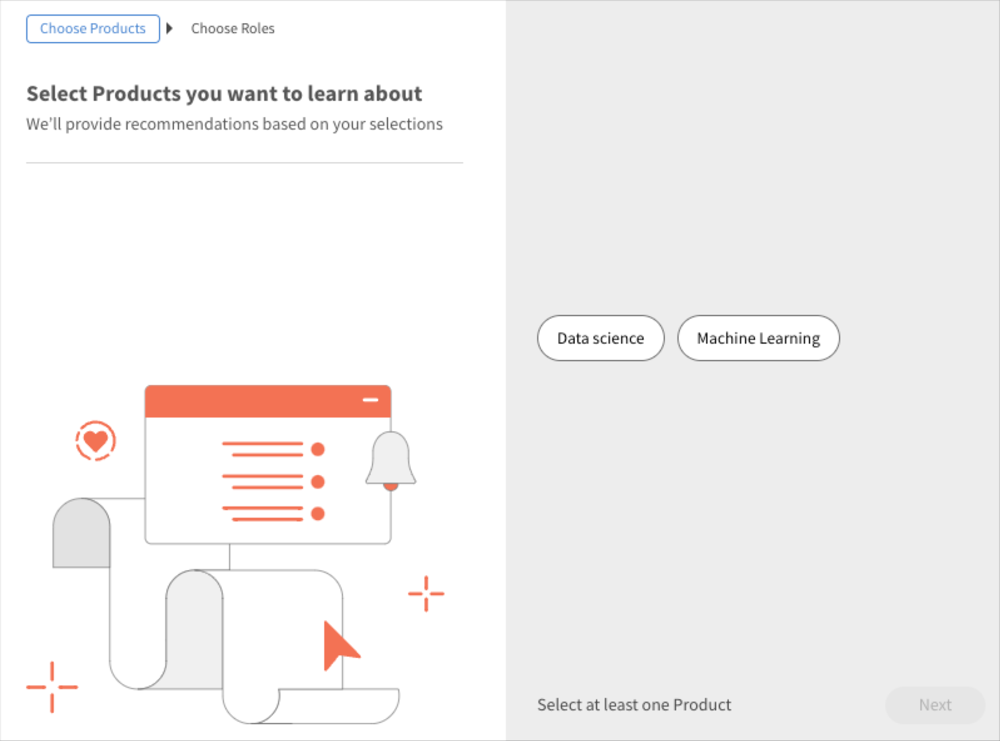
*選取產品*

然後在下一個快顯視窗中，學習者可以選取角色。

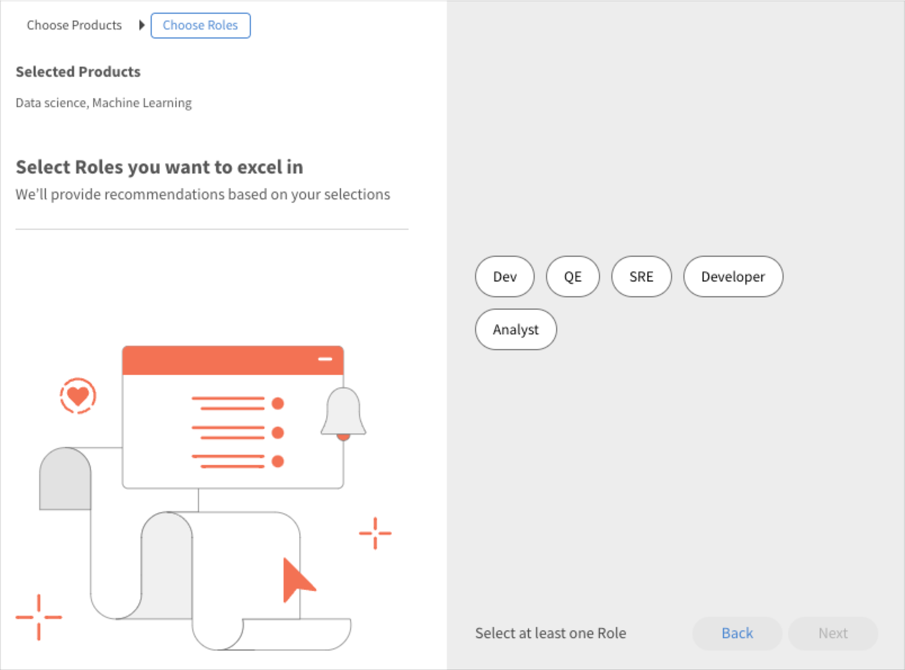
*選取角色*

然後，學習者可以新增層級。

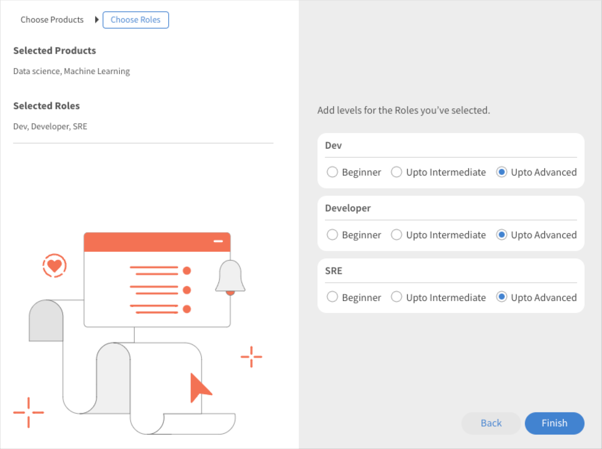
*選取層級*

## 學習者應用程式上的學習條

學習者可在應用程式上看到下列長條：

* 我的學習長條
* 使用行事曆、社交和遊戲化Widget移除
* 由我儲存的分段
* 超相關長條
* 產品條 — 1
* 產品條 — 2
* 探索長條
* 管理員建議刪除線
* 依目錄列瀏覽

### 我的學習帶上的卡片

*學習帶上的卡片*

每個卡片都有「評等」、「卡片影像」、「標題」、「技能」、「發佈日期」、「作者」、「持續時間」、「進度列」以及「繼續」或「探索」按鈕。

### 由我分段儲存的卡片

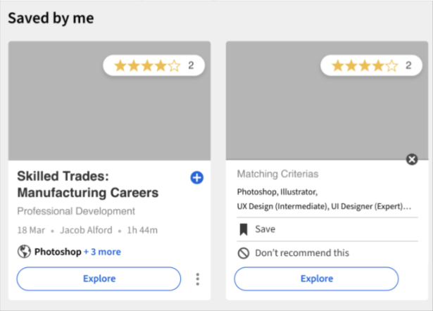
*已儲存的卡片*

每個卡片都有「評等」、「卡片影像」、「標題」、「技能」、「發佈日期」、「作者」、「持續時間」、「進度列」以及「開始」、「探索」、「繼續」或「重新造訪」按鈕。

學習者開始課程後，卡片上沒有進度列。 學習者也可以取消儲存課程。

### 超級相關區段上的卡片

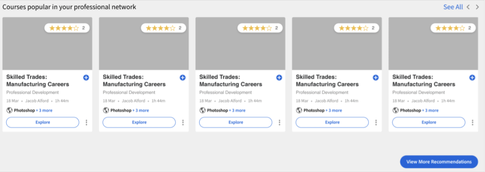
*相關卡片*

每個卡片都有「評等」、「卡片影像」、「標題」、「技能」、「發佈日期」、「作者」、「持續時間」、「進度列」以及「開始」、「探索」、「繼續」或「重新造訪」按鈕。

學習者開始課程後，卡片上沒有進度列。

功能表中有兩個選項， **[!UICONTROL Save]** 和 **[!UICONTROL Don't recommend this]**. 如果學習者點按 **[!UICONTROL Save]**，此課程會儲存至「由我儲存」區段。 如果學習者點按 **[!UICONTROL Don't recommend this]**，則建議的培訓會從清單中移除。
