# Adobe Learning Manager 中的建議

Adobe Learning Manager 推出了全新且全新設計的課程推薦系統。 此推薦功能利用 AI 演算法與用戶興趣（如產品、角色與等級）提供個人化內容推薦。 管理員可以根據產品、角色和等級來設定帳號。

新的推薦系統允許你建立自訂參數，讓學習者選擇以獲得個人化推薦。 這些推薦將以課程、學習路徑及證照的形式，在學習者的首頁動態中顯示。

要開始使用此功能，您必須在管理應用程式中啟用此功能。

## 啟用並設定建議

1. 上傳課程及使用者資料（可選）。
1. 讓改變現場完成。
1. 啟用並設定推薦後，將資料上傳至 Adobe Learning Manager 以啟動建議。 這些資料包括：

   * 課程資料
   * 使用者資料（可選）

## 課程排名演算法

推薦引擎的核心由 Learning Manager 的新 **[!UICONTROL Course Ranking Algorithm]**. 該演算法利用五千萬個數據點及五年累積的數百萬用戶學習數據，根據選課的可能性進行排名。 此排名確保大多數可選修課程會直接顯示給學習者。

## 關鍵術語

Learning Manager 全新的基於 AI 的推薦引擎，為學習領導者提供一套可配置的參數式推薦系統，打造個人化學習體驗。

參數包括： **產品/主題**、 **角色**&#x200B;與 **層級**。 此外，這些參數也可以根據你的需求重新命名。 因此，「產品」可以變成「主題」，或「角色」可以變成「區域」。

## 建立推薦系統

Adobe Learning Manager 的新推薦引擎簡化了管理員設定個人化推薦的工作流程，因為關於客戶/合作夥伴的產品與角色資料通常可供管理員取得（例如購買紀錄）。

建立新推薦引擎主要涉及三種工作流程：

* 行政
* 作者
* 學習者

管理員負責設定帳號的產品、角色和等級參數值。 例如，一家以銀行為主要客戶的 IT 解決方案供應商，可能會將「產品」參數設定為支付閘道、安全雲端儲存、詐欺偵測系統、交易平台等數值，而「角色」參數則設定為整合專家、網路管理員、風險分析師、合規專員等。

管理員在學習管理員中獲得引導工作流程，以最佳化設定推薦引擎並根據帳號使用情境自訂引擎。 此外，管理員還可選擇一次性上傳 CSV 來設定 PRL 推薦。

1. 在管理應用程式中選擇 **[!UICONTROL Recommendations]** 。

   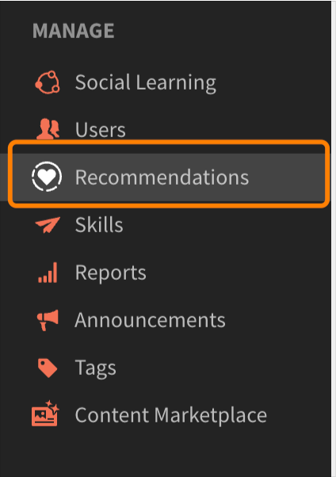

   *選擇「推薦」選項*

1. 點擊 **[!UICONTROL Upgrade]**。

   

   *選擇升級選項*

1. 點擊 **[!UICONTROL Proceed]** 升級至新的推薦系統。

   <!--
   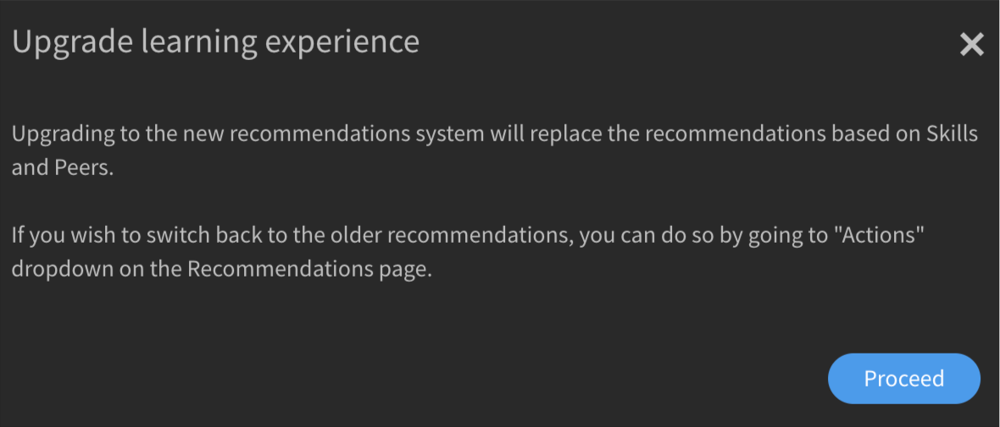
   *Select the Proceed button*
   -->

1. 建立產品與角色的推薦參數。

   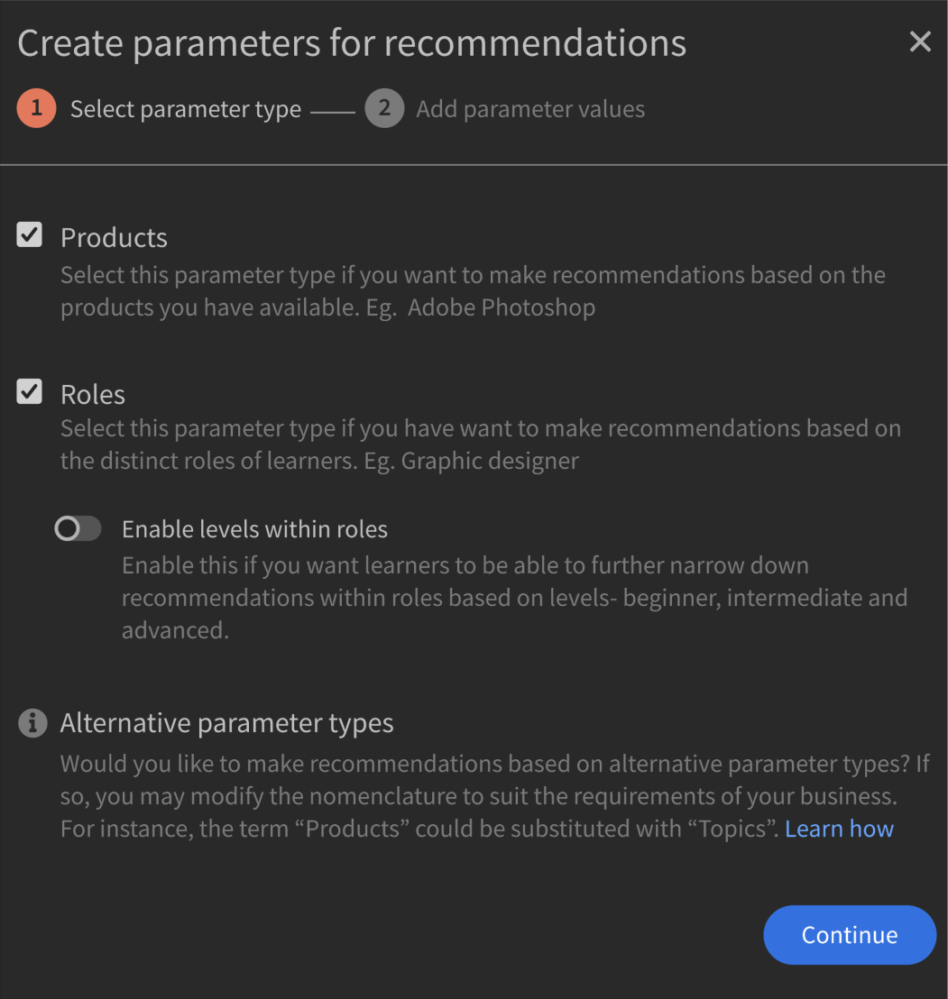
   *建立推薦參數*

1. 點擊 **[!UICONTROL Add more values]**。
1. 加入產品。 輸入產品名稱並按下 Enter。

   你必須至少加入兩種產品才能開始使用。

   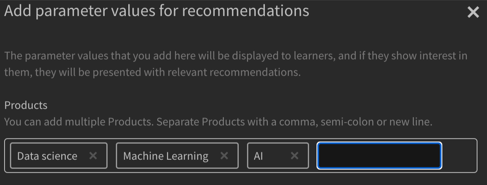
   *新增產品*

1. 加入角色。 輸入角色名稱並按下 Enter 鍵。

   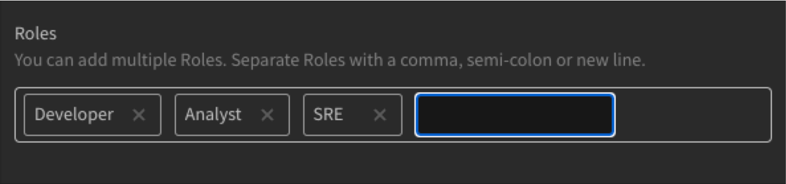
   *新增角色*

1. 點擊 **[!UICONTROL Continue]**。

   產品與角色現已出現在參數清單中。

   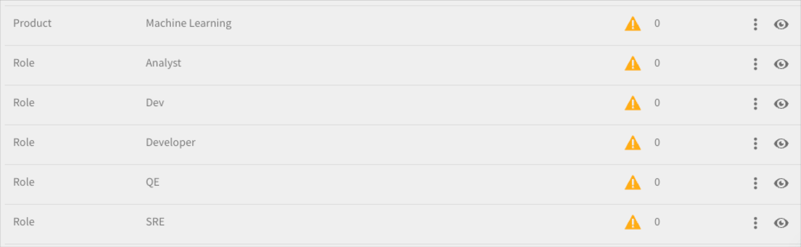
   *產品與角色列表*

## 資料準備

用戶興趣資料、產品、角色及等級必須上傳，推薦才能正常運作。

**上傳資料選項**

推薦功能是可設定的。 所以你可以選擇主題/角色/等級，或選擇以下任一選項：僅產品/主題、僅角色、產品/主題與角色僅、僅角色層級或僅產品層級。

根據你選擇的建議配置，相應地修改你的資料表。

以下章節將說明使用產品、角色與等級的最廣泛選項。

管理員必須以預先設定的格式上傳使用者資料。 上傳的資料會輸入推薦演算法，讓學習者根據其角色與程度獲得正確課程的推薦。

**先決條件**

要上傳推薦資料以讓推薦有效，請在使用者與推薦LO的CSV中填入產品、角色與等級。

作為資料準備工作的一部分，我們提供兩個 CSV 範本：

**RecUser.csv**

* 使用者 ID
* 產品
* 角色
* 等級（初級、中級或進階）

以下是 CSV 中記錄的範例：

| 使用者 ID | 產品 | 角色 | 關卡 |
|--- |--- |--- |--- |
| 123 | 資料科學 | 分析師 | 分析師：中級 |
| 456 | 航空航太工程 | 技術員 | 技術員：進階 |

**RecLO.csv**

* 訓練
* 訓練類型
* 訓練名稱
* 產品
* 角色
* 關卡
* 標記
* 技能

以下是 CSV 中記錄的範例：

| 訓練識別碼 | 訓練類型 | 訓練名稱 | 產品 | 角色 | 關卡 | 標記 | 技能 |
|---|---|---|---|---|---|---|---|
| 111 | 河道 | Python 101 | 資料科學 | 分析師 | 分析師：中級 | 資料 | 一般 |
| 222 | 河道 | 茱莉亞101 | 資料科學 | 分析師 | 分析師：進階 | 資料 | 一般 |

請填寫這些 CSV，並聯絡您的客戶成功團隊，下載格式並上傳這些 CSV。

## 讓推薦內容即時發布

兩個 CSV 上傳完成後，點擊「啟動」。 這將使新的推薦系統對學習者可見。

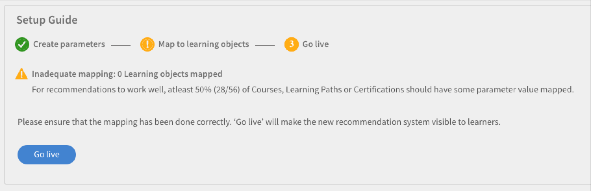
*讓推薦內容即時發布*

推薦系統現已提供給您的學習者使用。

## 編輯參數

1. 在參數列表中，選擇三點圖示，然後選擇 **[!UICONTROL Edit parameter name]**。

   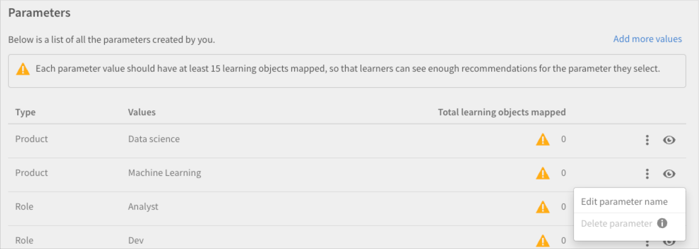

1. 更改參數名稱並點選 **[!UICONTROL Save]**。

   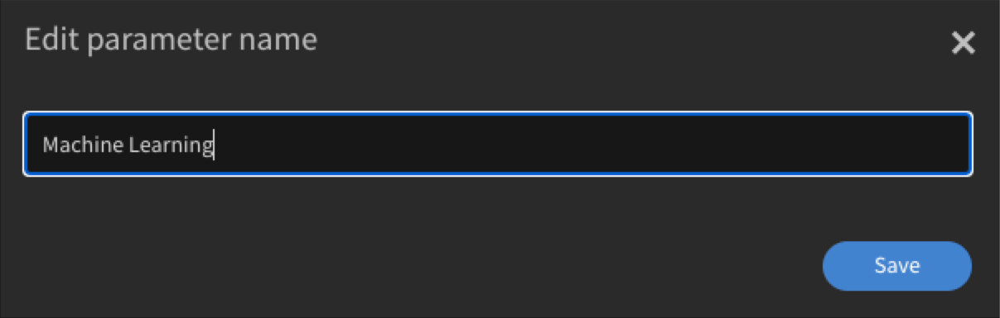
   *編輯參數*

## 刪除參數

管理員可點擊三點圖示並選擇 **[!UICONTROL Delete Parameter]**&#x200B;來刪除參數。 管理員可以刪除參數，如果該參數沒有連結到學習物件。 如果是連結的，他們只能隱藏參數。 然而，他們無法隱藏最後兩個參數，因為建議至少需要兩個參數才能有效。

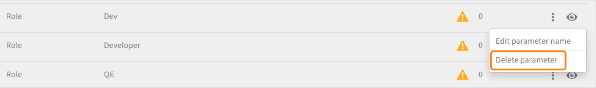
*刪除參數*

## 球場設定頁面

在課程的設定頁面中，會列出產品與角色的推薦。 若學習者對這些產品與角色表達興趣，將被推薦參加此課程。

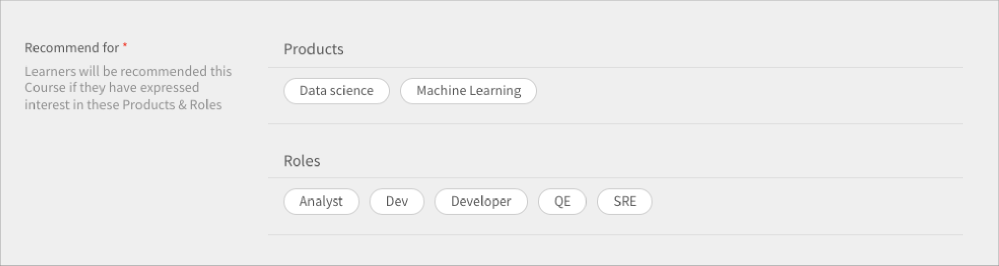
*球場設定頁面*

## 學習者視角

對於設定基於PRL推薦的帳號，當學習者登入學習平台時，導引式工作流程會協助學習者根據其產品、角色及層級偏好設定推薦。 這會建立學習者輪廓，供推薦引擎分析。

已切換至新推薦系統帳號的學習者可查看推薦課程與培訓內容。

學習者可以看到以下內容：

* 產品、角色 - 等級：學習者會被提示先選擇產品、角色，然後是每個選擇角色的等級
* 產品 - 等級：學習者會先選擇產品，然後為每個選擇的等級
* 角色 - 等級：學習者會先選擇角色，然後為每個選擇的角色選擇等級。
* 產品與角色：學習者會先選擇產品，再選擇角色。
* 產品：學習者被提示只選擇產品。
* 角色：學習者被提示只選擇角色。

在左側面板選擇「推薦」後，學習者會看到一個彈出視窗來設定推薦。

*學習者設定推薦*

點擊「設定建議」會帶學習者跳出產品選擇視窗。

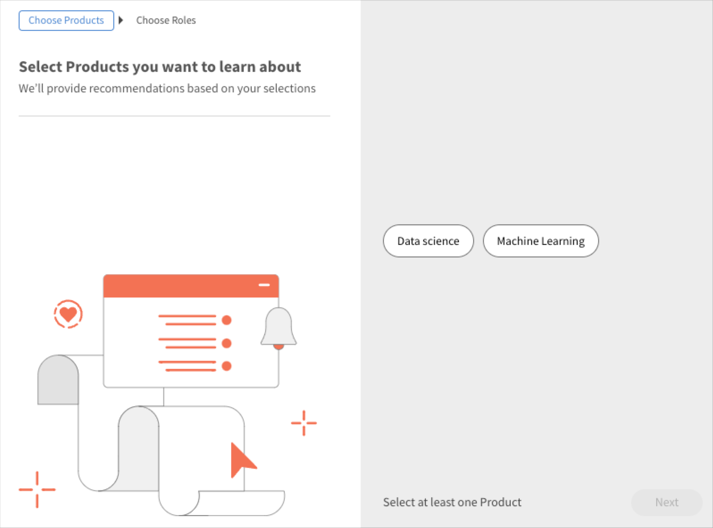
*精選產品*

接著在下一個彈出視窗中，學習者可以選擇該角色。

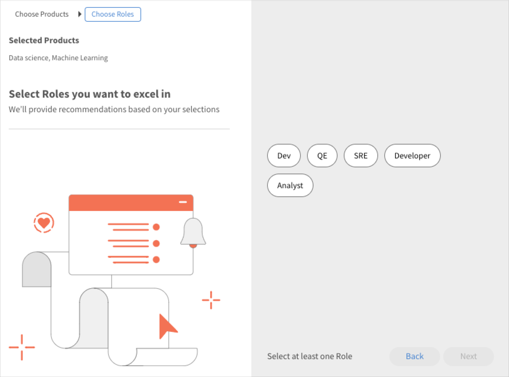
*精選角色*

學習者接著可以將等級相加。

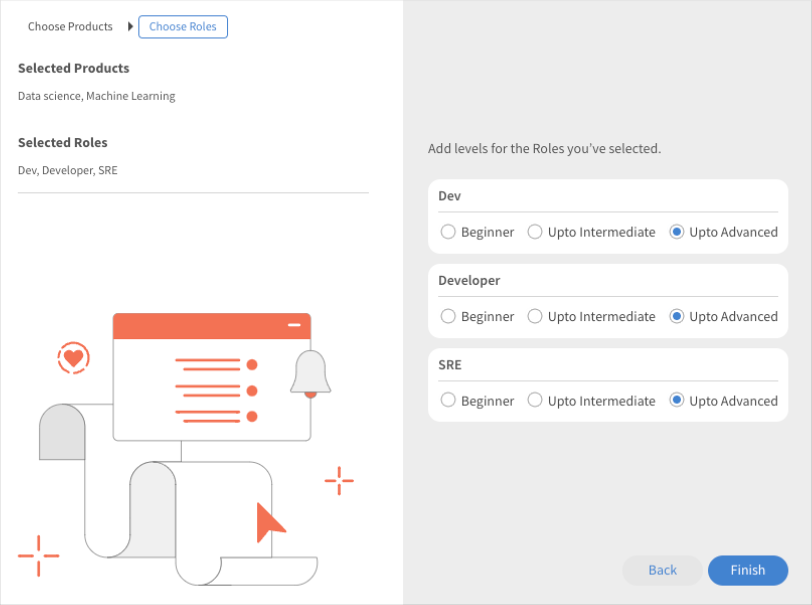
*部分關卡*

## 學習者應用程式上的學習條

學習者可以在應用程式上看到以下條紋：

* 我的學習漫畫
* 帶有行事曆、社交與遊戲化小工具的條紋
* 我救了 脫衣
* 超相關的條帶
* 產品條 - 1
* 產品條 - 2
* 探索帶
* 管理員建議的脫衣
* 依目錄條瀏覽

### 我的學習條帶上的卡片

*學習紙條上的卡片*

每張卡片都有評分、卡片圖片、標題、技能、發行日期、作者、持續時間、進度條，以及繼續或探索按鈕。

### 卡片在 Saved by me 條帶上

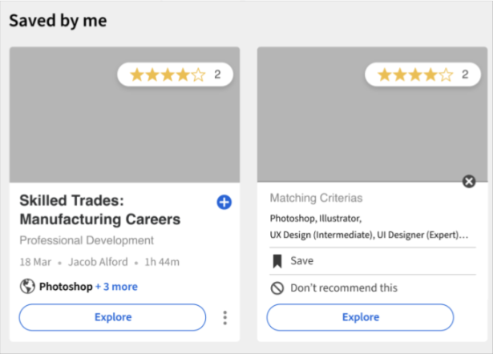
*已存牌*

每張卡片都有評分、卡片圖片、標題、技能、發佈日期、作者、持續時間、進度條，以及開始、探索、繼續或重訪按鈕。

學習者開始課程後，卡片上不會有進度條。 學習者也可以取消儲存課程。

### 超相關的牌

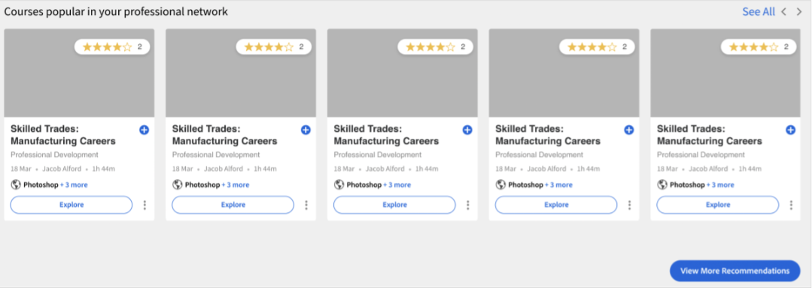
*相關卡牌*

每張卡片都有評分、卡片圖片、標題、技能、發佈日期、作者、持續時間、進度條，以及開始、探索、繼續或重訪按鈕。

學習者開始課程後，卡片上不會有進度條。

選單中有兩個選項，和 **[!UICONTROL Save]** **[!UICONTROL Don't recommend this]**。 如果學習者點擊 **[!UICONTROL Save]**，課程會被儲存到「由我儲存」條帶中。 若學習者點擊 **[!UICONTROL Don't recommend this]**，推薦的訓練將從列表中移除。
