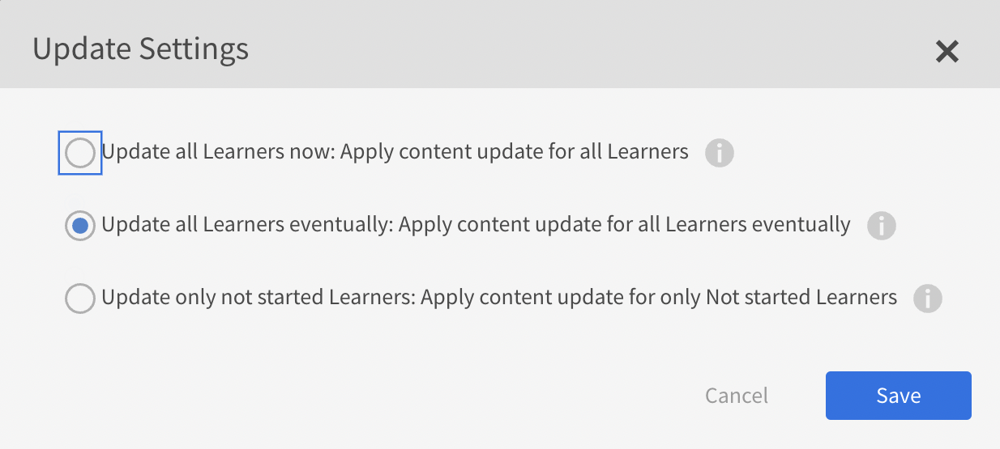
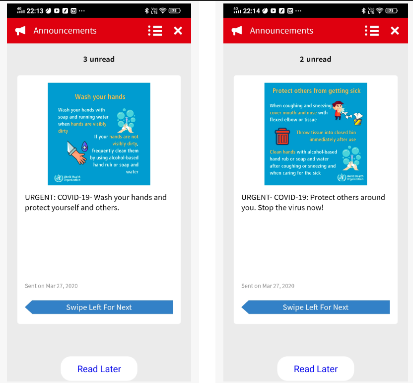
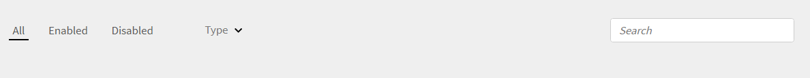
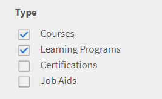

# Adobe Learning Manager發行說明

<!--<table>
 <tbody>
  <tr>
   <td></td>
   <td>
    
<a href="https://business.adobe.com/products/learning-manager/adobe-learning-manager.html">Adobe Learning Manager</a> was launched in August 2015. As part of our continuous improvement efforts to enhance the product, we have been rolling out regular updates. Read on to know the features enhanced/issues fixed in update releases. 
</td>
  </tr>
 </tbody>
</table>-->

+++更新101： 2025年7月發行的Adobe Learning Manager

## 角色型電子郵件範本

### 對象

管理電子郵件範本的管理員和作者

### 概觀

您（管理員或作者）可以根據收件者的角色、學習者、經理或講師啟用或停用電子郵件範本。 它可讓您更深入控制與學習者通訊的型別和頻率。

### 使用案例

* 管理員和作者需傳送電子郵件給學習者，而不通知管理員（例如學習者註冊）。
* 為特定角色大量啟用或停用電子郵件的選項（例如，停用給管理員的所有郵件）。

### 現有的工作流程

如果目的是要傳送電子郵件給學習者而非管理員（例如課程註冊），則目前的範本會傳送電子郵件給所有角色。

### 新增功能

* 電子郵件範本UI上的角色型切換。
* 大量啟用/停用特定角色。
* 每個範本的角色可見性。

如需詳細資訊，請參閱此[文章](/help/migrated/administrators/feature-summary/email-templates.md#enable-or-disable-email-at-a-role-level)。

## 改善已完成課程學習者的內容版本控制

### 概觀

當已完成課程的內容模組更新至更新版本時，已完成課程的學習者仍在背景中收到更新的模組版本。 這會導致他們嘗試重新造訪課程時出現意外行為，因為更新內容不適合他們。

### 現有行為

當作者將課程內容更新至新版本，並選擇僅套用至尚未開始課程的學習者時，Adobe Learning Manager仍會為已完成課程的學習者更新模組版本。 因此，這些學習者無法如預期存取原始內容。

此增強功能可確保當課程模組更新並設定為僅套用至尚未開始的學習者時，已完成課程的學習者仍可不間斷地存取原始版本。

### 變更內容

Adobe Learning Manager現在為作者提供更清楚的選項來管理內容更新。 作者可以更新課程中已有的內容。 新增新版本時，版本編號會顯示在內容旁。

管理員造訪更新內容的課程時，會在新版本旁邊看到「更新」按鈕。 管理員也會看到清除更新選項，以便選擇如何將新內容版本套用至學習者。

| 學習者狀態 | 立即更新 | 最終更新 | 更新未開始 |
|---|---|---|---|
| 未註冊 | V2 | V2 | V2 |
| 尚未開始 | V2 | V2 | V2 |
| 進行中 | V2 * | V1→V2 * | V1 |
| 已完成 | V2 * | V2 * | V1 （保留） |

(*)表示更新版本時將會重設模組。

更新未開始的情況下，已完成課程的學習者會繼續看見原始內容版本(V1)。 這麼做可避免發生非預期的播放問題，並確保回訪已完成課程的學習者獲得一致的體驗。

### 內容更新選項

當管理員按一下&#x200B;**[!UICONTROL Update]**&#x200B;時，他們可以從以下選項中選擇：

* **[!UICONTROL Update all Learners now]**：立即為所有學習者套用內容更新。 未開始、進行中和完成的學習者會立即移至新版本。
* **[!UICONTROL Update all Learners eventually]**：分階段為所有學習者套用更新。 「未開始」和「已完成」的學習者現在會收到新版本。 進行中：學習者完成目前的版本後，就會取得更新。
* **[!UICONTROL Update only not started Learners]**：僅將更新套用至尚未開始課程的學習者。 進行中及完成的學習者仍維持原始版本。

### 使用者介面變更

| 舊標籤 | 新選項 |
|---|---|
| 將內容更新套用至所有學習者 | 立即更新所有學習者：為所有學習者套用內容更新 |
| 將更新套用至尚未開始的學習者 | 僅更新未啟動學習者：僅對未啟動學習者套用內容更新 |
| 進行中的學習者完成之後會收到更新 | 最終更新所有學習者：最終為所有學習者套用內容更新 |

<!--
_Content update options_-->

請參閱此[文章](/help/migrated/authors/feature-summary/content-library.md#content-version-control-for-learners-who-have-completed-a-course)，瞭解內容庫的詳細資訊。

## 流體播放器中的增強功能

此發行版本為Adobe Learning Manager提供全新流體播放器，具有現代外觀和更直覺的學習體驗。 更新後的播放器具備更乾淨的介面、改良的導覽控制項，以及桌上型電腦和行動裝置間的一致設計。 學習者可以透過任何熒幕模式輕鬆存取內容並與內容互動，包括直向、橫向、全熒幕或標準檢視。

* **已重新整理流體播放器外觀**：具有更新的UI元素的現代化外觀。
* **改善的導覽控制項**：更順暢、更直覺的導覽，讓學習者獲得更好的體驗。
* **最佳化設計**：透過桌上型電腦和行動裝置，增強外觀和可用性，支援直向、橫向、全熒幕和標準熒幕模式。

所有透過Adobe Learning Manager存取內容的學習者（不論使用原生或Headless體驗），都會自動看見這些新的UI和導覽改良功能。 學習者可能會注意到與播放器的互動方式因更新版面和控制項而略有變更。

>[!NOTE]
>
>此增強功能僅適用於靜態內容。

請參閱此[文章](/help/migrated/learners/feature-summary/fluidic-player.md)以取得流體播放器的詳細資訊。

## 此版本中的錯誤已修正

* 修正內容模組更新為新版本後，完成課程的學習者重新造訪此課程時，看到白色畫面的問題。

此外，如需Adobe Learning Manager近期變更的詳細資訊，請參閱此[文章](https://experienceleague.adobe.com/zh-hant/docs/learning-manager/using/introduction/upcoming-changes-in-adobe-learning-manager)。

+++

+++更新100： 2025年5月發行的Adobe Learning Manager

**發行日期**：2025年5月10日

## 此版本的新增功能

檢視[Adobe Learning Manager的新功能](/help/migrated/whats-new.md)以取得詳細資訊。
+++

+++更新99： 2025年2月發行的Adobe Learning Manager

## 透過SAML設定介面語言

Adobe Learning Manager (ALM)現在接受語言的SAML屬性。 然後此屬性會對映至使用者的介面和內容語言設定，確保與LMS以他們偏好的語言順利互動。 這些語言設定的組態是透過Identity and Access Management (IAM)平台管理，並利用SAML進行單一登入(SSO)。 這同時支援服務提供者(SP)起始和身分提供者(IdP)起始的登入，讓使用者能夠檢視使用他們所選語言的介面和內容。

如需詳細資訊，請參閱此[文章](/help/migrated/administrators/feature-summary/set-up-interface-language-through-saml.md)。

## 移轉API的增強功能

先前，具有外部連結的活動模組已使用API （`GET /bulkimport/cansync`和`POST /bulkimport/startrun`）移轉，在存取連結後不會為學習者顯示&#x200B;**[!UICONTROL Mark as Complete]**&#x200B;選項。 此問題已解決。 現在，具有透過API移轉的外部連結的活動模組將為學習者正確顯示&#x200B;**[!UICONTROL Mark as Complete]**&#x200B;選項。

## 學習者應用程式中的排序功能

學習者應用程式中的排序功能可根據內容和介面語言提供個人化課程推薦。&#x200B;URL 此增強功能可簡化學習者以偏好語言尋找課程的程式，並運用更多智慧型排序選項。

如需詳細資訊，請參閱此[文章](/help/migrated/learners/feature-summary/catalogs.md#sorting-functionality-in-the-learner-app)。

+++

+++更新98： 2024年11月發行的Adobe Learning Manager

**發行日期**： 2024年11月16日

## 此版本的新增功能

檢視[Adobe Learning Manager的新功能](/help/migrated/whats-new-nov-24.md)以取得詳細資訊。
+++

+++更新97： 2024年7月發行的Adobe Learning Manager

**發行日期：** 2024年7月13日

## 此版本的新增功能

檢視[Adobe Learning Manager的新功能](/help/migrated/whats-new-july-2024.md)以取得詳細資訊。
+++

+++更新96： 2024年3月發行的Adobe Learning Manager

**發行日期：** 2024年3月16日

## 此版本的新增功能

檢視[Adobe Learning Manager的新功能](/help/migrated/whats-new-march-2024.md)以取得詳細資訊。
+++

+++更新95： 2023年11月發行的Adobe Learning Manager

**發行日期：** 2023年11月18日

## 此版本的新增功能

檢視[Adobe Learning Manager的新功能](/help/migrated/whats-new-november-2023.md)以取得詳細資訊。
+++

+++更新94

**發行日期：** 2023年8月23日

## 此更新的新增功能

* 選取播放器的齒輪圖示以變更視訊品質。
* 變更社交視訊的品質和速度。
+++

+++更新93： 2023年7月發行的Adobe Learning Manager

**發行日期：** 2023年7月10日

此版本的新增功能

### 已改善的建議

Adobe Learning Manager已推出全新及改版後的課程推薦系統。 此建議功能使用AI演演算法和使用者的興趣（例如產品、角色和等級）來提供個人化內容建議。

### 多重註冊

在此版本的Adobe Learning Manager中，我們將為學習者推出多重註冊，允許學習者在一個或不同時段註冊多個課程例項。

### 淘汰Exavault聯結器

此版本的Adobe Learning Manager將包含新的聯結器，該聯結器將使用AWS傳輸系列的SFTP通訊協定。

如需詳細資訊，請參閱[Adobe Learning Manager 2023年7月版本的新增功能](/help/migrated/whats-new-2023-july.md)。
+++

+++更新： 92

**發行日期：** 2023年6月23日

此更新中修正了&#x200B;**個錯誤**

* 完成模組後，不會自動觸發等級API，導致綠色勾號無法如預期顯示在使用者介面上。
* 在學習路徑或認證中完成幾個模組後，表示成功完成的綠色勾號無法如預期顯示。
* 上傳欄位不正確的使用者CSV後，Adobe Learning Manager未如預期啟動。
* 有關如何聯絡管理員的警告快顯視窗也會顯示其他電子郵件地址。
* 學習者獲得的所有徽章都不會顯示在回應中。
* 使用者註冊期間，必須接受使用者名稱為「 」。

#### 播放器

* 新增功能表以選取播放視訊時的熒幕解析度。
+++

+++更新91

**發行日期：** 2023年6月1日

### 聯結器

* Adobe Connect聯結器需要API才能傳送CSRF權杖。 如需詳細資訊，請參閱增強Adobe Connect帳戶安全性。

### 字串變更

* 我們已重新命名「評等此培訓」字串，以根據學習者接受的培訓評等此課程、評等此學習路徑或評等此認證。 根據培訓型別，學習者會據此看到字串。

### 此更新中修正的錯誤

* Play Store的Adobe Learning Manager行動應用程式說明錯誤地指出學習者可以將課程設為離線。
* 將內容（module_version.csv和course_module.csv）從LinkedIn移轉至Adobe Learning Manager時發生問題。
* 如果帳戶處於非使用中狀態，且是在三年多前建立，則無論使用者的狀態為何，帳戶的所有使用者都會遭到GDPR刪除。
* 在講師應用程式中，當您在工作階段中將輪候表限制設為零，並儲存工作階段時，使用者介面會錯誤地顯示「不適用」而不是零。
* 產生Power BI聯結器的學習者成績單時，訓練或模組持續時間（分鐘）欄會顯示特定教室或VC模組的Null值。
* 在執行個體或多個執行個體中將學習者標籤為完成後，課程中的所有學習者都會被標籤為完成，而不僅僅是目前執行個體中的學習者。
+++

+++更新90

**發行日期：** 2023年4月4日

### 此更新中修正的錯誤

如果SSO登入URL包含entity_id，則SAML登入會失敗。
+++

+++更新89： 2023年3月發行的Adobe Learning Manager

**發行日期：** 2023年4月1日

### 此更新的新增功能

**增強講師授課訓練(ILT)體驗**

針對講師引導式訓練(ILT)體驗進行了幾項增強。 主要增強功能包括：可依位置篩選教室課程、可在不損失進度的情況下切換例項(VILT)、新增「排程小幫手」以管理預約講師和教室中的衝突、可依講師附加「技能」及依技能選擇講師。

**改善觀察檢查清單**：

作者現在可以選擇「管理員」和「商店管理員」作為檢查清單的觀察者。 管理員可以在Manager介面中檢視並完成核取清單，而無需將角色切換到講師。 當檢查清單指派給經理時，系統會將通知傳送給經理。

**使用任何App/Smartphone相機掃描Learning Manager二維碼**

學習者現在可以使用任何二維碼掃描應用程式或其智慧型手機攝影機，掃描Learning Manager產生的二維碼，以取得課程註冊、完成等資訊。

**報告增強功能**

新的「講師使用率」報告、「培訓重新造訪」報告、「工作輔助」報告及其他報告增強功能。

**支援&#39;Hybrid&#39;工作階段**

Adobe Learning Manager現在可支援建立「混合」講師引導式訓練(ILT)課程。 虛擬ILT工作階段可透過選用的位置資訊建立，讓學習者可以親自參加工作階段（如果可以在位置找到）。

**教室和虛擬ILT的進度追蹤更佳**

教室和虛擬ILT模組現在可報告學習者的測驗狀態（通過或失敗）以及出席狀態。 因此，出勤和測驗成功都可以視為學習者進度的決定性因素。

適用於Microsoft Teams的&#x200B;**Adobe Learning Manager應用程式**

Microsoft Teams上新的Adobe Learning Manager應用程式旨在促進工作流程中的學習並促進社交學習。 學習者無需切換至瀏覽器，即可在Microsoft Teams平台中存取學習內容。 請聯絡您的CSAM，以取得MS Teams上Adobe Learning Manager應用程式的測試版。

### 此更新中修正的錯誤

**課程**

* 當課程處於「UNDER_CONSTRUCTION」狀態時，自訂作者無法預覽模組。 回應顯示錯誤404。
* 當課程標題超過特定字元限制時，作者應用程式的課程/新增頁面上的課程標題會溢位。

**作者**

* 在作者應用程式中，建立課程時，課程的標題（如果冗長）超過頁面界限。
* 有時候，即使未選取作者，仍會新增課程。

**儀表板報告**

* 當介面語言為英文時，工具提示會顯示得很好，但當介面語言不同時，會擲回主控台錯誤。
* 在學習者控制面板中將「必要」重新命名為「必要」。

**講師應用程式**

* 講師應用程式中的時間格式與其他應用程式不一致。

**社交**

* 對於某些型別的貼文，在張貼後，社交展示板未按預期開啟。

**管理員**

* 預覽課程時，具有自訂角色的使用者無法下載資源。

**電子郵件範本**

* 當學習者取消註冊包含教室/VC課程的學習計畫時，他/她未收到任何取消電子郵件。

**工作輔助**

* 您無法在工作輔助Widget上看到課程名稱。

**正在發佈**

* 在ALM中發佈模組時，在Adobe Captivate中新增的模組說明在Learning Manager中不可見。

**作用中的欄位**

* 處理含有大量記錄的CSV時，需要相當長的時間，在這段時間內，如果使用者登入並輸入其中一個屬性的值，可能會建立新的使用者群組，而這可能導致CSV錯誤。 若要修正此問題，當匯入CSV進行中時， 「作用中欄位」屬性快顯訊息會停用，並在CSV上傳完成時重新啟用。
* 如果使用者csv檔案中的欄與外部使用者活動欄位同名，則csv上傳會失敗。

**API相關修正**

* learningObjects回應中缺少書籤屬性。
* 在為已刪除的使用者產生OAuth重新整理權杖時，會建立存取專案。
* LO API傳回不正確的loFormat，因為計算課程型別以及核心內容時會考慮前期工作模組。

**此更新中的已知問題**

* 學習者目錄上的「共用」按鈕在Safari瀏覽器、Mobile和iPad MS Teams應用程式上無法如預期運作。
* 應用程式於其他電腦移除後，通知不會顯示在Activity索引標籤中。
當您在iPhone 14上按一下應用程式的「活動」標籤中的通知時，不會有任何反應。
* 在MS Teams應用程式上，Learning Manager通知（已完成、已註冊、截止日期和過期）不會在「活動」索引標籤中顯示課程狀態和名稱。
* 當整合管理員未核准MS Teams應用程式時，畫面會顯示包含XML內容的快顯視窗。
* 語言變更時，MS Teams上Adobe Learning Manager應用程式上的使用者介面語言有時不會像預期般變更。
* 當焦點在Iframe內（「首頁」和「目錄」標籤）時，您無法與第一個通知互動。

**Adobe Learning Manager行動應用程式的限制**

* 檢視離線內容。
* 「目錄/我的學習」頁面上的「格線/清單」檢視。
* 多次嘗試參加課程。
* 課程卡的註冊截止日期。
* 在iOS裝置上，當應用程式於前景時，推播通知不會顯示。
* 推播通知中的深層連結不會重新導向至預期的登陸頁面。
* 按一下「註冊興趣」按鈕將重新導向至網路。
* 在社交學習中回覆或評論時，您將無法附加檔案。
* 您將無法登入LinkedIn學習版。
+++

+++更新88

**發行日期：** 2023年3月7日

### 此版本中的效能改善

執行大量學習者註冊時，不會為每個學習者產生任何記錄檔。
我們已最佳化大型客戶的學習計畫處理。 這麼做可避免任何搜尋問題或延遲。
+++

+++更新87

**發行日期：** 2023年3月1日

## 此更新中修正的錯誤

* 如果CR/VC模組從註冊的課程中移除，則學習者不會收到工作階段取消電子郵件。
* 將GetNotificationData從GET變更為POST。 原始實作產生錯誤&#x200B;**IllegalArgumentException：要求標頭太大**，導致通知失敗。
+++

+++更新： 86

**發行日期：** 2023年2月17日

### 此版本中已修正的錯誤

在學習者應用程式中，搜尋使用者和使用者群組失敗，因為地區設定出現一些問題。
+++

+++更新85

**發行日期：** 2023年2月13日

### 此更新變更的內容

新增對GET learningmanagerapi/v2/learningObjects中篩選語言時四個字母語言代碼的支援。

### 此更新中修正的錯誤

對於某些地區設定，搜尋會傳回不正確的結果。
當課程有多個相同地區設定的變體時，課程中繼資料會被覆寫。
+++

+++更新84

**發行日期：** 2023年2月2日

### 此更新變更的內容

**工作輔助報告**

此更新包含新的「工作輔助」報告，列出帳戶中的所有工作輔助。

**版本控制**

在建立課程時新增資源時，我們新增了資源的版本控制。

**嘗試報告**

您可以檢視學習者每次訓練的所有重新嘗試和修訂的報告。

**模組重設API**

管理員現在可以使用模組重設API來重設模組。 如需詳細資訊，請參閱[Adobe Learning Manager API參考](https://captivateprime.adobe.com/docs/primeapi/v2/)。

**電子郵件範本**

對於一些電子郵件範本，您現在可以將先決條件新增到範本。

**其他變更**

* 您可以新增經理核准的課程作為先決條件。
* 重新整理學習摘要儀表板時效能提高。
* 電子郵件ID和帳戶ID會在傳送退回報告之前驗證。

### 此更新中修正的錯誤

* 重複的作者名稱顯示在課程總覽頁面上。
* 帳戶建立頁面上的超連結導致錯誤404。
* 捷克語地區設定未如預期反映在播放器設定中。
* 在某些情況下，對於進行中且未開始的學習者，技能會顯示為未定義。
* 跨多天的逗留時間顯示在學習者成績單和註冊報表中的不同逗留時間。
* 在「課程> L2測驗分數>依問題標籤」和「出勤與分數」中，「上一步」按鈕對「管理員」和「經理」設定檔無回應。
* 對於少數地區設定，在電子郵件範本中，電子郵件內文中的某些內容遺失，且範本中的語言翻譯不一致。
+++

+++更新83

**發行日期：** 2023年1月18日

### 此更新變更的內容

**新資料行**

新欄&#x200B;**unenrollmentAllowed**&#x200B;已新增至course.xlsx。 從此手冊下載檔案。

**Linkedin學習聯結器**

針對學習聯結器中的「已連結」，學習者可在「篩選器」頁面上取消註冊新核取方塊。 如需詳細資訊，請參閱[LinkedIn學習聯結器](/help/migrated/integration-admin/feature-summary/connectors.md)。

### 此更新中修正的錯誤

* 當滑鼠停留在長條圖上時，控制面板報表工具提示會如預期般顯示。
* 在「使用者活動」下的「報表」中，「學習逗留時間」報表會顯示每日/每月資料的不正確資料。
* 在某些情況下，測驗分數圖表會顯示不正確的值。
* 在含有設定了多次嘗試的SCORM內容的課程中，當學習者嘗試該課程時，重新造訪按鈕會停用。
* 在某些情況下，將學習者註冊到課程並下載電子郵件稽核記錄後，會傳送電子郵件，但不會顯示在記錄中。
* 講師的行事曆邀請必須包含主旨中的文字講師。
* 培訓卡圖示不會反映相關課程建議，以及課程概觀頁面上顯示的學習路徑卡。
* 在學習者首頁設定上，新增「由我儲存」區段。
* 對於某些帳戶，系統會提示使用者針對需要Adobe ID的帳戶進行SSO登入。
* 在有日光節約時間的時區中，「start_time」欄位是根據目前的時間差異計算，而不是根據實際開始日期和時間的時間差異。 這會導致邀請的時間不正確。
* 每當認證遞回時，基礎課程的復本都會在資料庫內部建立。 這些課程隨後出現在搜尋中，與預期行為相反。
* 上傳CSV失敗時，您沒有收到任何電子郵件通知。
* 如果「作用中」欄位的名稱很長，拖放時這些名稱就會消失。 之後，儲存按鈕也無法如預期運作。
* 如果報表中的第一個使用者在活動等級表格中有記錄，且註解為Null，則不會透過課程的出勤與評分頁面匯出工作階段報表。
* 使用管理員帳戶擷取徽章時，清單可依預期排序。 但當您對學習者執行相同作業時，結果不會排序。
* 如果您從搜尋結果中選擇課程，然後嘗試使用「上一步」按鈕返回搜尋結果，則搜尋結果會消失。
* 並非所有使用者都會作為工作階段中的講師新增到使用者群組。
* 如果範本中有多個使用者範本，則其主旨會被某些值覆寫。
+++

+++更新82

**發行日期：** 2022年12月15日

* GET LO API現在包含定價資訊（若有）。
* 新欄「完成者」會新增至LT報表。 這有助於管理員識別學習課程的完成來源。
* 我們已新增新的ILT模組，可記錄學習者通過/失敗狀態以及出席情況。 講師現在可將學習者標示為已出席且通過或出席且未通過選項。
* 管理員現在可以要求學習者完成並通過再使用下一個模組/課程。 這適用於先決條件、訂購課程與學習方案。

**錯誤修正**

* 側邊欄和頁尾的沈浸式行動體驗中的Bahasa語言問題。
* 和模組預覽相關的沈浸式檢視修正。
* 在「管理員與作者」中搜尋課程時，傳回的地區設定與輸入地區設定不同的結果。
* 編輯後未儲存對歡迎電子郵件範本的變更。
* 具有不同電子郵件ID和Adobe ID的使用者無法登入行動應用程式。
* 加入Zoom / BJ VC工作階段時未正確識別使用者。
+++

+++更新81 - 2022年11月版本的Adobe Learning Manager

**發行日期：** 2022年11月5日

**注意：**&#x200B;在此版本的Adobe Learning Manager中，擁有非作用中帳戶的使用者無法再使用子網域存取其帳戶。 您可以使用帳戶ID或使用acapindex.html頁面並輸入電子郵件ID來存取帳戶。

### 此版本的新增功能

2022年11月發行的Adobe Learning Manager包含下列專案：

* 多個SSO設定
* 非登入功能支援
* 訓練概觀頁面增強功能
* 播放器自訂
* 學習者和經理的模擬

**注意：**&#x200B;在2022年11月發行的Adobe Learning Manager中，Zoom將在2023年6月前淘汰[JWT驗證](https://marketplace.zoom.us/docs/guides/auth/jwt/)。 因此，在提及日期之前，具有JWT的Zoom聯結器將繼續運作，但我們建議使用者建立伺服器對伺服器OAuth應用程式，以取代其帳戶中的功能。 依預設，任何新連線都會進行Zoom OAuth驗證。

### 此更新中修正的錯誤

* 作為學習者，當您嘗試在行動裝置上存取包含10個以上課程的學習計畫時，會顯示錯誤訊息。
* 如果課程設定了在錯過截止日期後n天傳送提醒，則電子郵件會如預期在n天后傳送，但錯過截止日期的天數是n-1，而非n。
* 如果在學習者應用程式中為課程啟用L1意見回饋，並且使用者只有學習者角色，則影片不會載入播放器。
* 完成提醒電子郵件未如預期顯示使用者時區的時間。
* 透過儀表板報告產生的學習者成績單不會遵循篩選器並顯示超出要求的更多資訊。
* 您無法選取未將介面語言新增為內容語言的內容。
* 第二次自我註冊課程時，出現的URL不正確。
* 當講師從VC工作階段中移除時，他們不會收到任何郵件通知他們工作階段已取消。
* 學習者訓練頁面上圖磚上的「分鐘」文字沒有如預期翻譯為Bahasa印尼文。
* 合規性儀表板對不合規的學習者顯示不正確的資料。
* 新增報表時，您無法選取介面語言未新增內容語言的課程或目錄。
* 我們已在此版本中新增下列內容語言：
   * 保加利亞文
   * 佛蘭芒文
   * 葡萄牙文（巴西）

### 此更新中的已知問題

* 在某些情況下，測驗分數圖表未按預期顯示。 當您調整圖形大小時，開頭會出現一個空格。 此外，並非所有問題都會出現，而且不正確的資料會間歇性顯示。
+++

+++更新80

**發行日期：** 2022年9月20日

* iOS上行動應用程式的登入問題現已修正。
* 修正電子郵件退回的問題。
* 甚至在學習者提交內容之前，就錯誤地通知了講師。
* 即使學習者未提交活動，講師仍會收到電子郵件通知。
* 在MS Teams或Adobe Connect上建立VC工作階段後，講師不會收到工作階段邀請。
* 學習路徑中的狀態不正確。
* 提升應用程式的效能。
+++

+++更新79

**發行日期：** 2022年8月18日

* 行事曆邀請確認ILT / VILT工作階段現在可搭配Google行事曆使用。
* 商店管理員現在可以看到其下使用者的通知，即使他們作為人員管理員被移除。
* 在某些情況下，課程註冊會失敗，並顯示錯誤500。
* 在某些情況下，您無法修改Teams的虛擬課程執行個體。
* 管理員和講師可以為未參加ILT / VILT工作階段的使用者新增註解。
* 改善下載大型報表時的效能。
* 當使用者的電子郵件被退回時，管理員會收到電子郵件通知。 電子郵件包含連結，按一下連結時，會下載包含電子郵件遭退回之使用者清單的CSV。 然後，管理員可以採取必要行動。
   * 電子郵件跳出或捨棄時會觸發電子郵件。
   * 電子郵件每天會觸發一次給新增至清單中的所有管理員。
   * 連結會在七天後過期。
* 嘗試將已整合的Adobe Connect帳戶與其他Learning Manager帳戶整合時，系統會顯示錯誤訊息。
+++

+++更新78

**發行日期：** 2022年8月4日

### 此更新中修正的錯誤

* 如果您的課程包含具有預覽的模組，然後使用API從課程中擷取資源，則回應將不會包含位置、contentZipUrl和contentStructureInfoUrl的任何資料。
* 從Swagger檔案（網域名稱為learningmanager）傳送XAPI請求後的回應不正確。
* 在/boards/{id}/posts API回應中，「post.attributes.myPoll」屬性會顯示為空白物件。
* 在某些情況下，對於未登入的使用者，某些課程或學習路徑的「加入購物車」按鈕會停用。
* 品牌頁面上的子網域URL不正確。
+++

+++更新77

**發行日期：** 2022年5月24日

**此更新中修正的問題：**

* 新課程不遵循Salesforce應用程式中的順序。 如果您變更序列，課程將無法以預期的序列顯示。
* 在您修改傳統首頁中的設定並儲存後，變更不會如預期儲存。 這會間歇性地發生。
* HTML程式碼會在學習者檢查其通知時顯示，而這對體驗會有不良影響。
* 在儀表板上，學習逗留時間錯誤地顯示為零小時。

## 更新： Adobe Learning Manager將更名為Adobe Learning Manager

這是即將進行的變更的更新資訊，可協助您為此做好準備。

**Adobe Learning Manager as a product將於2022年7月更名為Adobe Learning Manager**。 這是一項策略性工作，旨在更準確地反映產品與特定業務優先順序的一致性。

產品團隊會採取一切步驟，確保不會影響到您使用平台。 您可以繼續照常使用產品。 7月時，平台的管理員可能會注意到某些畫面中的新品牌名稱。

在此變更中，Learning Manager的存取URL會受到影響。

例如，如果帳戶的存取URL是`https://learningmanager.adobe.com/XYZ`，則新的URL將是`https://learningmanager.adobe.com/XYZ`。

所有現有的URL都能繼續運作。

若要完成此動作，請與貴組織的IT部門合作。 如需詳細資訊，請連絡我們： `learningmanagersupport@adobe.com`。
+++

+++更新76

**發行日期：** 2022年4月20日

* 修正一些控制面板報表的產品術語。
* 端點URL中的雙斜線(「//」)導致驗證錯誤。
* 重新整理頁面後，完成百分比和上次造訪的欄位會顯示不正確的資訊。
* 我們變更了憑證值或學習計畫的計算方式。
* 自訂管理員可將所有使用者新增為講師，即使他/她僅獲准新增一名使用者。
* 在徽章PDF上，顯示的完成日期不正確。
+++

+++更新75

**發行日期：** 2022年3月29日

* 在某些帳戶中，在FTP位置中複製原始CSV後，使用者匯入不會如預期發生，且會有多個錯誤通知。
* 在舊版Learning Manager中，若要設定Zoom聯結器，必須先設定Exavault FTP來複製csv檔案。 在此版本中，FTP聯結器不再用於csv檔案，因此，您不需要先設定FTP。
+++

+++更新74： Learning Manager AWS印度執行個體

**發行日期：** 2022年2月15日

### 概觀

Learning Manager的[執行個體](https://learningmanagerapac.adobe.com/acapindex.html)現在會在孟買的AWS上託管(ap-south-1)。 對於使用此印度例項的客戶，其使用者的個人識別資訊(PII)和使用者學習記錄只會儲存在印度區域。

### 支援的內容

Adobe Learning Manager印度執行個體在功能能力方面與歐盟和美國區域等其他執行個體不相上下。 印度執行個體不支援幾項功能。 這些功能包括：

* 購買名額的信用卡付款
* Creative Cloud內容目錄
* Slack應用程式
* **&#42;**&#x200B;正在等候符合SOC2的認證

### 常見問題

**在孟買的這個執行個體與其他僅限AWS的環境有何不同？**

沒有差異。 孟買的執行個體與[AWS US](http://learningmanager.adobe.com/)或[AWS EU](http://learningmanagereu.adobe.com/)執行個體相同。 此例項在印度託管，所有學習記錄和使用者資料都保留在印度。 印度執行個體不支援下列功能：

* 購買名額的信用卡付款
* Creative Cloud內容目錄
* Slack應用程式
* **&#42;**&#x200B;正在等候符合SOC2的認證

**此環境是否符合Common Controls Framework (CCF)標準？**

是。 新執行個體符合Common Control Framework (CCF)。
+++

+++更新73

發行日期： 2022年2月5日

* 現在提供內容語言（包括匈牙利文和芬蘭文）的電子郵件範本支援。
+++

+++更新72 - 2022年1月發行的Learning Manager

發行日期： 2022年1月15日

### 新增功能與變更內容

* 新增教室位置
* gamification變更
* Microsoft Teams聯結器
* API變更
* 行動沈浸式網頁變更

<!--
For more information, see What's new in the [**January 2022 release of Adobe Learning Manager**](../whats-new.md).
-->

### 此版本中修正的錯誤

**內容庫**

* 在私人內容資料夾中搜尋內容檔案，無法供具有自訂角色許可權的使用者使用。 此問題現在已修正。

**個課程**

* 如果課程或學習路徑與學習計畫有歷史關聯，則無法刪除課程或學習路徑。 此問題現在已修正。 使用者現在可以刪除課程或學習路徑（如果他們目前與學習計畫無關）。
* 預覽課程或學習路徑時，如果資源檔案的名稱很長，但沒有空格，則檔案名稱不會如預期自動換行，並溢到下一行。 此問題已修正。
* 若是虛擬教室，先前您不需要在新的執行個體VC URL中選取任何VC會議系統即可建立模組。 現在，在模組建立階段會出現錯誤訊息，要求您在儲存模組之前指定VC會議系統，以避免發生這種情況。
* 輪候表頁面在註冊使用者上顯示誤導性橫幅訊息，該訊息現已移除。
* 大量取消註冊課程時，不會顯示輸入電子郵件ID的快顯視窗，此問題現已修正。
* 從「管理員」和「講師」應用程式的「出勤與評分」索引標籤傳送電子郵件給學習者的選項，並未排除執行選取所有作業後未勾選的學習者。 因此，Learning Manager傳送電子郵件給所有學習者。 此問題現已修正。
* 即使學習者已完成課程，註冊報表仍會顯示為「未開始」。

**SSO**

* 在SSO設定中，如果實體ID有任何前導或訓練空格，然後登入設定就無法運作，目前這項修正便已一併處理。

**公告**

* 身為管理員，如果介面和內容語言設為Deutsch/Español，系統不會儲存宣告的開始和結束日期。 此問題現已修正。

**電子郵件範本**

* 有些電子郵件使用者端會封鎖跨越數天且邀請未反映正確資訊的工作階段邀請。 此問題現在已修正。
* 德文地區設定中學習者的「近期工作階段提醒」電子郵件範本中缺少「地點名稱」變數。 現在已新增此專案。
* 在歡迎使用者的電子郵件中建立帳戶的連結並未考慮使用者地區設定，現在已修正該問題。

**電子郵件提醒**

* 如果學習者透過學習計畫註冊了培訓，則系統會根據對相同學習計畫的完成日期進行編輯的次數，多次傳送完成提醒電子郵件。 此問題現已修正。

**使用者**

* 當使用者的帳戶處於非使用中/暫停狀態時向其顯示的訊息已得到改善，表示聯絡其管理員以重新啟用其帳戶。

**活動**

* 如果提交檔案名稱中包含特殊字元，則講師無法檢視學習者提交。 此問題現在已修正。

**報告**

* 如果課程註冊報表含有透過彈性學習路徑間接註冊此課程的學習者，但尚需在學習路徑中選擇此課程的執行個體，管理員無法下載此課程註冊報表。 此問題現已修正。
* 在報表控制面板中重新排列管理員和經理角色的報表時，無法保留報表順序的狀態。 此問題現已修正。

**內容**

* 由於瀏覽器自動播放原則，訓練內容中的音訊未在學習者模式下以預覽模式自動播放。 除了Safari之外，現已針對支援的瀏覽器修正此問題。

**Gamification**

* 如果外部學習者在同一帳戶中轉換為內部學習者，則他/她無法存取學習者應用程式中的gamification排行榜。 此問題現已修正。

**播放器**

* 當使用者嘗試跳到具有AICC模組型別的有序課程中的模組時，播放器未顯示警告訊息。 此問題現在已修正。
* 針對Headless LMS案例播放中含有視訊模組的某些已習得課程，無法用於某些使用者。 此問題已立即修正。

**管理員儀表板**

* 經理無法從經理儀表板的團隊技能頁面匯出其直接團隊的報告。 此問題現已修正。

**發佈**

* 在Learning Manager的歐洲執行個體中，直接從Adobe Captivate發佈到Adobe Learning Manager的內容預設會以德語地區設定發佈。 此問題現在已修正。

**API**

* 持續時間欄位現在已新增到工作輔助模型。
* 對於建議API，有時GET請求會傳回錯誤500。
* 當您透過Exavault移轉培訓時，如果文字包含非英文字元，則會以文字中的垃圾字元更新。 此問題現已修正。

**本地化**

* `NormalTextRun  BCX0 SCXW38820519 For the`管理員、作者和學習者應用程式，部分德文內容未如預期顯示。

## 此版本中的已知問題

* 在「社交學習」頁面上，建立貼文時，您無法在點選麥克風按鈕後錄製音訊或上傳音訊。 這是瀏覽器的限制。
* 在iOS中，行動瀏覽器不支援H264和WMA音訊檔案。
* 電子郵件地址中包含+的學習者不會標籤進度。 這是在他們參加Microsoft Teams的VC課程之後。
* 在Safari Mobile瀏覽器中，學習者將無法在Social Learning中上傳超過200 mb的檔案。 這是瀏覽器限制。
+++

+++更新71

發行日期： 2021年11月17日

### 與經理分享訓練

Learning Manager為所有管理員和管理員提供合規性控制面板。 經理發現，追蹤團隊成員對特定培訓的合規性非常有用。 同時，管理員希望所有管理員能在其儀表板中新增合規性培訓並加以追蹤。

在Learning Manager中，**與管理員共用**&#x200B;工作流程可讓管理員與管理員共用訓練，以便他們可新增到管理員的合規儀表板。 因此，管理員不需要採取任何動作，可以立即開始追蹤合規性。

如需詳細資訊，請參閱&#x200B;[**與管理員共用訓練**](../administrators/feature-summary/reports.md#share_training_managers)。

### 此更新中修正的錯誤

* 如果有兩個帳戶，且已停用增強型學習路徑功能，且第一個帳戶與另一個帳戶間有共用目錄，則第二個帳戶中的學習路徑在課程頁面中有重複區段。
* 除了sftp://和http://以外，自訂FTP現在也支援https://
* Exavault聯結器現在使用V2 API。
* 在某些情況下，影片品質並不理想。 問題現已修正。
* 即使學習者完成必修課程並經經理核准後，認證仍維持在「未決核准」狀態。
* 如果作者名稱包含重音字元，課程移轉將會失敗。
* 如果作用中欄位有大寫值，則作用中欄位不會如預期儲存。
* 無法根據技能篩選學習路徑。
* 當管理員建立執行個體並新增工作階段時，講師未收到工作階段邀請電子郵件。 Zoom VC課程中會發生此問題。
+++

+++更新70

發行日期： 2021年10月28日

### 此更新中修正的錯誤

* 在某些情況下，學習者成績單不會反映學習路徑的相關資訊。
* **標籤完成**&#x200B;對話方塊內的文字已更新，以反映作業不可復原。
* 學習物件API在某些情況下會傳回中繼資料錯誤。
+++

+++更新69 - 2021年10月發行的Learning Manager

**發行日期：** 2021年10月9日

### 學習路徑

Adobe Learning Manager **的** 2021年10月版本引進了學習路徑的概念。

>[!NOTE]
>
>「**設定>一般**」頁面有一個新選項，可啟用學習路徑的延伸功能。 如果已啟用此選項，您可以將學習路徑新增到其他學習路徑中。 選項一經啟用即無法變更。

學習路徑會取代我們現有的學習計畫功能。 想像一下學習計畫在不捨棄任何現有功能的情況下獲得強大的增強功能。 此外，該功能會被標示為「學習路徑」。

如需詳細資訊，請參閱&#x200B;[***學習路徑***](../administrators/feature-summary/learning-paths.md)。

### 其他變更

* 新的Salesforce應用程式
* Content Hub
* 報告變更
* 工作階段摘要報告
* 播放器目錄變更
* API變更
* 聯結器相關的變更

如需詳細資訊，請參閱&#x200B;[***Learning Manager 2021年10月版本的新增功能***](../whats-new.md)。

### 此更新中修正的錯誤

* 電子郵件範本（例如「課程取消註冊」、「學習計畫取消註冊」或「認證取消註冊」）不會反映csv中定義的最新產品術語。 現在，電子郵件範本中的預設文字將支援自訂術語。
* 發佈至Learning Manager工作流程不支援Learning Manager中的使用者語言。 如果使用者語言不同，則會以英文發佈至Learning Manager。
* 如果您將許多目錄新增至自訂角色，則更新角色時會發生錯誤。 現在，目錄數量限制已增加到最多50個目錄。
* 在某些情況下，已刪除的培訓仍會顯示在目錄中。 此問題僅發生在管理員應用程式中，且現已修正。
* 當管理員角色從一個使用者變更為另一個使用者時，先前使用者的管理員角色仍會反映在UI中。 此問題現在已修正。 此問題僅存在於外部使用者，而不存在於內部使用者。
* 在某些特定情況下，當大量使用者透過使用者csv匯入時，匯入會失敗。 此問題已立即修正。
* 如果在建立外部憑證後新增強制課程，且使用者註冊了外部憑證，則學習成績單不會顯示外部憑證的完成日期。 此問題現在已修正。
* 憑證未如預期顯示學習者的本地化名稱。 此問題現在已修正。
* 若是Zoom VC工作階段，講師並不一定都會收到工作階段的邀請。 此問題現在已修正。 講師現在會收到所需的通訊。
* 如果課程層級範本已啟用但帳戶層級範本已停用，則學習者不會收到工作階段的邀請。 此問題現在已修正。
* 對於特定時區，電子郵件提醒的傳送時間比預期晚一天。 此問題現在已修正。
* 如果停用某些電子郵件範本，學習者不會收到工作階段通知電子郵件。
* 如果BlueJeans會議由作者、管理員更新，BJ會議URL會變得無法使用。 此問題現在已修正。
* 在某些情況下執行GET /LO API時，學習計畫中的課程不會傳回。
* 如果學習者嘗試上傳名稱有空白字元的內容，則會發生內部伺服器錯誤。
* 針對學習者產生的徽章PDF在非英文地區設定產生時會發生格式問題。 這類問題現已修正。
+++

+++更新68

發行日期： 2021年9月28日

### 此更新中修正的錯誤

* 在行動瀏覽器上，已為下列專案啟用深層連結：

   * 所有展示板
   * 公開展示板和張貼
   * 具有存取權的私人展示板和貼文
   * 無法存取的私人展示板和貼文
   * 受限制的展示板和貼文
   * 對文章發表評論
   * 回複評論
   * 社交使用者設定檔

* 若為使用自訂網域的帳戶，學習者應用程式不會顯示Favicon。
* 在AEM上，Learning Manager元件會刪除其他元件的設定。
* AEM元件的說明頁面會重新導向到錯誤的位置。
* 外部化取得和儲存使用者電子郵件/權杖，以便使用者可以實作自己的儲存後端，而不是使用AEM使用者節點。
* 在課程、學習計畫、憑證和工作輔助中編輯純文字說明時，系統會顯示警告訊息。
* 當使用者同時具有自訂和管理員角色時，不會下載來自管理員控制面板的報告。
* 電子郵件摘要顯示培訓活動的值不正確。
* 某些情況下，當您從「內容市集」移至「學習者」頁面時，Learning Manager會採取意料之外的行動。
* 在Social應用程式上，篩選器在清單檢視中無法如預期運作。
* 外部使用者也會收到內部使用者收到的歡迎電子郵件。
* 在AEM的頁面範本中新增Learning Manager Widget。
* 如果您想在移除課程後重新發佈憑證，則無法這麼做。
* 學習者不會收到包含工作階段詳細資訊的電子郵件。
+++

+++更新67 - Azure的更新

此更新會引入新的Azure執行個體。

>[!NOTE]
>
>執行個體不支援下列專案：
>
>* [自訂網域](../custom-domain.md)
>* [信用卡購買](../administrators/feature-summary/billing-management.md)
>* [內容目錄](../administrators/feature-summary/content-catalogs.md)

+++

+++更新66 - 2021年8月發行的Learning Manager

Adobe Learning Manager **的** 2021年8月&#x200B;**&#x200B;**&#x200B;版本著重於改善學習者體驗、報告及管理工作流程。 其中一些重點包括：

* **內容市集：** Learning Manager現在提供超過70000門課程，來自不同的網域，例如技術、管理、領導力等。
* **增強的協助工具支援：**&#x200B;對學習者角色的協助工具支援，透過增強的鍵盤導覽、熒幕助讀程式功能和對比率相容性，來增強協助工具。
* **RTF格式：** Learning Manager現在提供RTF編輯功能，以編輯課程、方案、憑證和工作輔助的說明。 這可讓作者以RTF文字指定說明，包括超連結、影像和其他文字格式選項，而非純文字。
* **星級評等：**&#x200B;學習者現在可以以5分評等為課程評分。 管理員可以在現有的有效性評等或5星級評等之間選取。
* **Badgr整合：**&#x200B;學習者現在可以授權Learning Manager自動將其在Learning Manager中取得的徽章推送至其Badgr帳戶，以便在其社交網路中共用徽章。
* **將學習事件匯出至Salesforce：** Learning Manager現在可匯出Learning Manager中的一些特定事件，例如新使用者的加入、註冊和完成至Salesforce租使用者，並可將這些事件與Salesforce中的適當使用者物件或連絡人物件連結。

如需詳細資訊，請參閱&#x200B;[***Learning Manager 2021年8月發行版本的新增功能和變更***](../whats-new.md)。

**發行日期：** 2021年8月7日

### 此更新中修正的錯誤

**學習者體驗**

* 將學習者新增至兩個使用者群組並新增學習計畫後，學習者會註冊相同課程的不同執行個體。
* 在某些情況下，在註冊和開始課程後，該課程無法按預期播放。
* 課程說明會顯示HTML標籤，此問題現已修正。
* 如果您在跨越多行的社交討論區中註解貼文，註解會以單行顯示。 此問題現在已修正。

**製作**

* 在使用自動註冊的情況下，學習者會收到多封註冊電子郵件。

**報告**

* 當介面設定為幾個非英文地區設定時，學習者成績單無法如預期產生。
* 能夠在學習計畫和認證中重設課程進度。
* 如果CSV包含具有相同名稱但區分大小寫不同的作用中欄位，CSV會產生例外狀況。

**其他**

* 若未選取任何學習者，或未標籤所選學習者的出勤率，則必須停用編輯分數和評論的選項。
* 即使使用者先前已新增大寫的值，作用中欄位的值也會在「編輯使用者」對話方塊中顯示為小寫。
* 管理員和管理層可檢視課程的未決核准。 這可讓管理層確保管理員可追蹤員工的學習與訓練，也可讓Learning Manager管理員視需要核准課程註冊。
* 具有作者或自訂管理員/作者許可權的使用者無法編輯其他使用者建立的工作輔助。
* 從管理員角色，當使用者導覽到課程>執行個體並為任何執行個體選取「已註冊的學習者」時，它較早曾顯示來自「預設執行個體」的學習者。 管理員需要手動從下拉式清單變更執行個體。 現在，Learning Manager會正確地將使用者導覽至已選取正確執行個體的學習者頁面。

**裝置應用程式**

* 在Android和iPhone裝置上，學習者無法隨機啟動課程模組。 這樣做會導致錯誤401未獲授權。
* 學習者可以掃描兩個二維碼，但掃描第三個二維碼時，會顯示錯誤訊息。
* 在某些Android和iOS裝置上，部分下載課程的檔案未如預期開啟。
* 嘗試開啟工作輔助會顯示錯誤訊息。
* 離線使用學習程式時，裝置應用程式行為異常。
* 當學習者重新上線並開啟應用程式時，應用程式卡在啟動畫面上。
* 有時，當使用者重新上線時，應用程式會切換為傳統檢視。
* 離線使用課程時，有時不會儲存進度。
* 有時候，課程名稱很冗長時，就不會如預期般顯示課程名稱。
* 在目錄頁面上，課程未按預期排序。
+++

+++更新65

發行日期： 2021年7月

### 此更新中修正的錯誤

* 使用者登入問題。
* 如果將變數新增至範本，經理的課程註冊電子郵件範本不會顯示課程完成期限。
* TLS 1.0和TLS 1.1已淘汰。
* 使用者的GDPR資料刪除問題。
+++

+++更新64

發行日期： 2021年7月

### 此更新中修正的錯誤

* 已註冊課程的學習者會收到註冊通知。
* 產生自訂憑證做為徽章時，德文不支援日期格式。
+++

+++更新63

發行日期： 2021年6月

### 此更新中修正的錯誤

* 您可以在csv中建立具有空白名稱的使用者。
* 如果作用中欄位中有「/」字元，則在建立下載user.csv的工作後，該工作的狀態不會從「已提交」變更為「已完成」。
* 排序的模組不遵循順序。
* 刪除外部作者時，該作者建立的課程將不再可用。
* 搜尋超過一項技能的學習物件會產生非預期的結果。
+++

+++更新62

發行日期： 2021年6月

### 此更新中修正的錯誤

* 當帳戶已起始SP登入時，無法登入應用程式。
* Brightcove的影片未如預期般轉譯。
* 在任何應用程式中造訪學習計畫時，userGroupInfo API不可見。
* 建立控制面板報告時，無法搜尋已淘汰的學習計畫和認證。
* 作者無法編輯或更新由其他作者建立的工作輔助。
* 用於檔案提交的API在EU叢集中無法如預期運作。
+++

+++更新61

發行日期： 2021年5月

### 此更新中修正的錯誤

* userGroupInfo呼叫的效能改善。
* 啟用新的Brightcove設定檔後，Learning Manager會透過視訊與音訊模組支援內容。
* 如果選取較窄的日期範圍，學習成績單將無法擷取資料。
* 系統會針對所有工作階段傳送工作階段邀請給已註冊學習者，即使僅新增一個工作階段亦然。
* 音訊模組未如預期上傳。
+++

+++更新60

發行日期： 2021年4月

### 此更新中修正的錯誤

**報告**

* 建立報告後，如果您搜尋已淘汰的課程，便無法搜尋。
* 一個報表中的錯誤會傳播到其他報表。 因此，這些報告會導致錯誤。

**工作輔助**

* 下載工作輔助後，您無法刪除工作輔助。

**播放器**

* WebVTT註解未如預期顯示。

**學習者應用程式**

* 在認證總覽頁面上，外部認證不顯示作者新增的持續時間。
* 在技能篩選中新增選項&#x200B;**全部**。
* 學習者收到多封摘要電子郵件。
* 選取的列數沒有反映為頁面上的預期值。

**AEM元件**

* 頁面重新整理後，Widget未如預期更新。

**本地化**

* 部分德文字串未如預期本地化。
* 如果學習者未選取介面和內容語言，字串的翻譯會預設為英文。

**認證**

* 若未強制執行必要條件，則可略過模組的排序。

**瀏覽器**

* 作者、管理員或學習者應用程式在IE 11中無法如預期顯示。

**Gamification**

* gamification點數無法如預期兌換。

**內容庫**

* 內容試用應用程式課程無法如預期運作。

**播放器**

* 播放器只會載入含有Widget的空間中。
* Captivate模組內的影片無法如預期播放。

**聯結器**

* 在某些情況下，檔案會從FTP/Box聯結器中刪除。
* 如果檔案以相同名稱更新，則會從ftp刪除檔案。
* BlueJeans事件支援事件數大於100的分頁。

**行動應用程式更新3.3 - 2021年3月**

發行日期： 2021年3月26日

### 新增功能與變更內容 {#whatsnewandchanged}

Captivate Learning Manager行動應用程式3.3版推出全新的首頁，支援刊頭和AI型訓練建議。 此首頁適用於針對新「沈浸式配置」選項設定的所有帳戶。 使用Classic Layout設定的帳戶會繼續顯示傳統/舊版首頁。 他們不應在首頁中看到任何變更。

此外，此更新也可讓學習者下載其徽章為PDF和影像。 此更新也引進了意見回饋發佈，讓學習者可匿名提供有關應用程式的意見回饋。

如需詳細資訊，請參閱[Learning Manager裝置應用程式](../learners/feature-summary/ipad-android-tablet-users.md)。

請閱讀以瞭解更多。

#### 新首頁

對於啟用「沈浸式配置」選項的所有帳戶，都有全新的首頁可支援「沈浸式配置」。

#### 意見反應評等

在此版本中，Learning Manager會提示使用者提供有關行動應用程式體驗的反饋。

#### 下載徽章

此更新可讓學習者以PDF和影像格式下載其徽章。

<!--## Previous update releases {#previousupdatereleases}-->
+++

+++更新60 - 2021年2月發行的Learning Manager

發行日期： 2021年2月20日

### 新增功能與變更內容 {#Whatsnewandchanged-1}

* 社交中的展示板檢視。
* 自訂社交橫幅。
* 學習者應用程式中的目錄篩選器。
* 取消訓練註冊。
* 從Salesforce連絡人匯入使用者。
* ...還有更多。

如需詳細資訊，請參閱Learning Manager [ 2021年2月更新](../whats-new.md)的新增功能。

### 此更新中修正的錯誤 {#bug-fixes}

**認證**

* 在某些情況下，學習者無法重新嘗試課程，這是認證的一部分，即使課程的最大嘗試次數設定為無限。 此問題現已修正。
* 在某些情況下，學習者無法註冊到認證，因為&#x200B;**註冊**&#x200B;按鈕未按預期顯示。

**內容庫**

* **新增內容**&#x200B;頁面上的說明URL不正確。 已更新正確的URL。

**課程**

* 為AICC內容模組下載的L2測驗分數報表會在「使用者總分數/測驗分數」欄下顯示錯誤分數。 此問題已修正。
* 如果學習者無權存取用來建立重複課程的原始課程，則從課程下載資源無法運作（如果從其他課程重複）。
* 當課程處於草稿狀態時，作者移除時未刪除的橫幅影像。 此問題已修正。

**AEM**

* 在AEM中插入Learning Manager元件後，頁面需要很長時間載入，導致無法存取其他元件。 此問題已修正。

**管理員**

* 已淘汰的課程未如預期出現在搜尋結果中。 此問題已修正。
* 管理員無法在&#x200B;**管理員應用程式** -> **自訂報表** -> **Excel報表** -> **課程報表**&#x200B;中搜尋已淘汰的課程，此問題現已修正。

* 如果檔案中的學習者內容更新前後均已參加過相關培訓，則無法以Excel格式下載測驗報表。 此問題已修正。
* 如果作用中欄位包含特殊字元，CSV上傳會失敗。 此問題已修正。
* 在少數情況下，當學習者參加在Captivate中建立的測驗時，回答不會如預期方式擷取。
* 建立訂閱並嘗試編輯訂閱後，**儲存**&#x200B;和&#x200B;**取消**&#x200B;按鈕未如預期顯示。 此問題已修正。

**播放器**

* 針對SCORM-2004的特定內容型別，繼續案例無法運作。 因此，學習者必須導覽至他們中斷的地方。 此問題現在已修正。 內容現在應該從先前離開的位置繼續。
* 某些情況下，註冊課程後，內容無法如預期播放。 此問題已修正。

**取消註冊**

* 註冊報表只會列出20個未註冊的學習者，即使有更多的學習者未註冊課程/認證。 此問題已修正。
* 在某些情況下，匯出註冊報表中未註冊學習者清單時發生問題。 此問題現在已修正。

**學習計畫**

* 針對彈性學習計畫，如果學習者僅註冊了一個課程例項，則按一下其他課程（其例項未選取）的課程連結時，會開啟一個空白頁面。

**學習者**

* 使用者名稱中有特殊字元的少數學習者並未如預期收到電子郵件通知。
* 在沈浸式檢視中，某些情況下，行事曆Widget不會如預期顯示即將舉行的VC工作階段。
* 在學習者應用程式中，**技能**&#x200B;篩選器未如預期運作。 此問題已修正。

**搜尋**

* 在特定案例中，管理員之前無法搜尋管理員的使用者群組。 此問題現在已針對管理員角色修正。

**使用者群組**

* 匯出具有超過500名使用者的使用者群組報表時，報表中的資料值和欄標題不相符，這點現在已經修正。
* 當管理員在電子郵件範本中編輯電子郵件簽名並新增多行時，他以前只在管理員介面中看到html標籤。 此問題已立即修正。
* 在&#x200B;**管理應用程式>目錄>搜尋目錄**&#x200B;中，您無法搜尋。

**位使用者**

* 已刪除一些作用中的外部使用者。 我們已進行一些變更，而問題現在已修正。

**匯入**

* 如果csv標頭包含尾端空白字元或使用者的電子郵件包含重音或變音字元，匯入csv會失敗。

**活動提交**

* 在「講師應用程式 — 活動提交」頁面中，提交日期值過去與檔案名稱重疊（如果時間過長），此UI問題現在已解決。

**講師**

* 即使僅新增新的工作階段，講師仍會收到其所有工作階段的工作階段邀請。 此問題已修正。

**SCORM**

* 針對特定SCORM內容，錄製測驗分數時瀏覽器相關問題少、播放器導覽問題少、不一致。 這些問題已修正。

**SAML和SSO**

* 我們已更新您在SSO憑證過期時看到的錯誤訊息。

**Learning Manager API**

* 由於快取中的問題，getlearningObject API傳回錯誤的註冊資料。 此問題已修正。
* VC工作階段現在會在會議邀請的[位置]欄位中顯示會議URL。
* 如果您已設定多個VC提供者整合，且其中任何一項無法如預期運作，則VC選取下拉式清單會顯示空白清單。 此問題現在已修正。 現在會正確列出剩餘的VC整合。
* 當講師加入工作階段時，連線VC範本未如預期載入。
* 移轉module_version csv檔案中含有持續時間的模組後，UI中顯示的持續期間不正確。
* 對於某些帳戶，更新使用者時無法如預期運作。 此問題已修正。

### 此更新中的已知問題 {#known-issues}

* 在學習者應用程式中使用&#x200B;**持續時間**&#x200B;篩選器時，如果學習者使用其他內容地區設定，且就註冊而言不是預設執行個體的一部分，則內容和篩選器可能不同步。

>[!NOTE]
>
>訓練&#39;**Duration**&#39;和&#39;**Format**&#39;篩選器是根據預設執行個體和帳戶偏好地區設定的可用訓練內容來識別。

+++

+++更新59

## 更新59

發行日期： 2020年12月18日

### BlueJeans事件聯結器 {#bluejeanseventconnector}

BlueJeans Events聯結器會連線Learning Manager和BlueJeans系統，以自動化資料同步。 使用此聯結器，您可以：

* **使用BlueJeans事件設定虛擬工作階段：**&#x200B;在BlueJeans中設定新事件，並透過選取適當的BlueJeans事件在Learning Manager中設定VC工作階段。 從BlueJeans事件自動挑選日期和時間詳細資訊。
* **自動使用者完成同步：**&#x200B;自動使用者完成同步處理可讓Learning Manager管理員自動擷取BlueJeans事件的完成記錄。

此新聯結器需要一組單獨的認證才能設定聯結器。

如需詳細資訊，請參閱&#x200B;[***BlueJeans事件聯結器***](../integration-admin/feature-summary/connectors.md#bj-events)。

+++

+++更新2020年12月58日發行的Learning Manager

## 更新Learning Manager 2020年12月58日發行版本

發行日期： 2020年12月5日

### 新增功能與變更內容 {#Whatsnewandchanged-2}

此版本專注於：

* 全新的學習者首頁體驗
* 學習者角色的行動網路回應式佈局
* 針對學習者的AI型推薦
* 每週摘要電子郵件
* 檢查清單
* Marketo engage整合
* 自訂網域
* 從Adobe Connect匯入測驗分數
* 學習者目錄的深層連結
* LinkedIn學習增強功能
* ...還有更多

如需詳細資訊，請參閱&#x200B;[***Adobe Learning Manager 2020年12月版本的新增功能***](../whats-new.md)。

### 行動沈浸式體驗中不支援的功能 {#unsupportedfeaturesinmobileimmersiveexperience}

不支援下列功能：

* 社交應用程式：如果學習者按一下首頁上的Social Widget，系統會將學習者重新導向至傳統體驗
* 設定檔設定/編輯設定檔
* 檢視徽章/技能
* 排行榜：如果學習者按一下首頁上的排行榜Widget，則會重新導向至傳統體驗
* 正在下載工作輔助。
* 搜尋中的篩選選項。

### 此更新中修正的錯誤 {#bug-fixes-1}

* 如果內容資料夾包含已刪除的內容，則您無法刪除內容資料夾。
* 學習方案可讓管理員設定包含自動執行個體的課程。 針對具有活動提交模組的課程，先前未正確設定講師資訊。 現在Learning Manager會自動將講師從預設執行個體指派給此自動執行個體。
* 含有含有空格目錄標籤的自訂徽章無法讓pdf如預期般下載。
* 從儀表板下載的報告，與針對儀表板報告收到的訂閱電子郵件不同。
* 學習者成績單沒有更新的資料以提供循環認證。
* 開始課程後，如果您讓課程逾時，則嘗試次數不會如預期顯示。 此外，您多次嘗試課程時有時會出現空白熒幕。
* 上傳模組後發生錯誤5xx。
* 所有學習者都無法看到私人社交討論區。

### 此更新中的已知問題 {#known-issues-1}

完成課程或認證後，您不會立即看到意見回饋快顯。 只有當您在沈浸式UI中參加課程時，才會發生此問題。 如果您使用傳統UI參加課程，您可以看到意見快顯視窗如預期般顯示。

+++

+++更新57

## 更新57

發行日期： 2020年9月23日

**內容庫**

* 在內容庫中，淘汰內容不會移除&#x200B;**已發佈**&#x200B;索引標籤中的內容。 當您重新整理頁面時，已淘汰的內容不再顯示。
* 建立內容資料夾時，**Name**&#x200B;欄位未標示為必要欄位，這實際上是必要欄位。

**客戶請求**

* 若要識別每位學習者已註冊的所有課程以及他們是否已完成該課程，請在儀表板「訂閱報表」中納入下列欄位：

   * UUID
   * 電子郵件地址

**學習者成績單**

* 在印尼地區設定中產生學習者成績單會產生錯誤。

**搜尋**

* 您無法搜尋特定課程。 此問題已修正。

+++

+++更新56 — 行動應用程式

發行日期： 2020年8月25日

### 從LinkedIn Learning學習課程 {#takecoursesfromlinkedinlearning}

Learning Manager已可支援該學習平台中的LinkedIn學習課程。 現在，學習者可以在Learning Manager行動應用程式中參加這類LinkedIn學習課程。 在裝置應用程式中，搜尋課程，然後開始課程。

如需詳細資訊，請參閱從&#x200B;[***LinkedIn學習課程***](../learners/feature-summary/ipad-android-tablet-users.md#linkedin)&#x200B;參加課程。

### 管理員註冊的推播通知 {#pushnotificationforadminenrollments}

當管理員將學習者註冊到培訓時，學習者將收到有關註冊的通知。

推播通知現在也支援公告。

### 強制L1意見反應 {#mandatoryl1feedback}

在最新的2020年8月發行版本中，Learning Manager可讓管理員設定L1意見回饋，讓所有問題都成為必答問題。 行動應用程式現在從學習者的角度支援相同做法。

### 使用者介面增強功能 {#userinterfaceenhancements}

**頁尾連結**

管理員可以在網頁上的「管理員」檢視中設定多個頁尾連結。 學習者現在可以點選漢堡圖示和說明圖示來存取這些連結。

預設會有兩個連結，管理員可以新增另外三個將出現在應用程式中的連結（透過網頁上的管理員檢視）。

學習物件的&#x200B;**卡片檢視**

依預設，在應用程式的「我的學習」和「目錄」區段中，培訓會顯示為卡片而非清單。 這是學習者的變更，因為先前的預設檢視為「清單檢視」。

不過，學習者可以在清單檢視和卡片檢視之間切換檢視。

+++

+++更新55- 2020年8月發行的Learning Manager

發行日期： 2020年8月23日

### 新增功能與變更內容 {#Whatsnewandchanged-3}

此版本專注於：

* 報告增強功能
* 私人內容資料夾
* 自訂FTP
* 視訊的註解支援
* Power BI增強功能
* 意見回饋增強功能
* 新增和變更的API
* 資料保留原則變更
* ...還有更多

如需詳細資訊，請參閱&#x200B;[***2020年8月發行的Adobe Learning Manager的新增功能***](../whats-new.md)。

### 有關此版本的注意事項 {#notes}

* 製作學習者成績單(~1 GB)只需不到15分鐘。
* 在舊版Learning Manager中，學習者成績單欄測驗分數和最高測驗分數是用來提供分數和最高分數（25/100格式）。 為了支援更好的可讀性和分析，測驗分數現在也會匯出為個別欄 — **測驗分數、測驗分數最大值、最高測驗分數和最高測驗分數最大值**。 這些功能可讓管理員進行快速計算和分析。

### 此更新中修正的錯誤 {#bug-fixes-2}

**聯結器**

* 學習者無法同時參與由兩個不同作者建立的兩個不同會議。
* 按一下管理來自Adobe Connect的連線卡選項會導覽至FTP連線頁面。
* 已排程的FTP同步因例外狀況而結束。
* 連線到Exavault時出現密碼相關問題。

**課程**

* 您不需選取任何會議系統即可建立VC模組。 由於副作用，建立課程的程式擲回錯誤500。
* 學習者已註冊課程（重複），但無法下載資源。
* 以學習者身分預覽課程時，除非已註冊課程，否則管理員或作者無法下載資源。

**裝置應用程式**

* 在特定註冊案例中， 「我的擱置中學習」下方的環形圖會顯示從瀏覽器到行動應用程式的學習者應用程式不同值。

**認證**

* 嘗試下載認證的儀表板報告時，報告篩選器「狀態」無法如預期運作。

**搜尋**

* 在學習者目錄頁面上，當您嘗試依備註搜尋課程時，不會出現搜尋結果。

**SCORM**

* 對於某些內容，SCORM播放器會顯示空白畫面。
* 如果發佈的Storyline專案包含指向發佈的Captivate輸出的Web物件，則Storyline內容會識別為Captivate內容。
* 由於URL不正確，SCORM內容無法啟動。

**自訂角色**

* 在某些情況下，自訂管理員無法檢視學習物件的完整清單。
* 自訂管理員無法在控制面板報告中搜尋學習計畫或認證。
* 自訂管理員無法在儀表板中搜尋管理員。
* 學習者自訂管理員產生的成績單未包含已刪除使用者的資料。
* 自訂作者或自訂管理員無法複製學習計畫、課程或認證。

**報告**

* 如果學習者未註冊該認證，則「學習者成績單」中的「型別」欄會將值顯示為屬於認證一部分的課程的課程。

**技能**

* 新增課程的技能時，搜尋技能時出現一些問題。

**Gamification**

* 如果許多使用者都是機密使用者，則按一下Edge和網際網路範例上的機密學習者索引標籤時，瀏覽器的行為會出乎意料。
* 變更條件的頻率時，使用舊頻率計算的點會新增到目前的計算。

**管理員**

* 如果對應至學習計畫的課程例項發生變更，則無法將學習者標籤為已參加。

**電子郵件範本**

* 針對學習方案和認證，缺少電子郵件範本中的切換按鈕。

**內容庫**

* 由於URL不正確，SCORM內容未如預期啟動。

**學習者成績單**

* .產生學習者成績單時，如果您在「選取學習者」輸入方塊中新增已刪除的學習者，然後在「進階」中啟用「包含已刪除學習者的資料」選項，頁面將會出現意外行為。

**搜尋**

* 您無法使用課程附註來搜尋課程。

**Excel報表**

* 如果由於資料較大或處理速度緩慢而下載使用者稽核軌跡報告需要超過一小時，則連線會逾時，並且報告永遠不會下載。
* 在學習者成績單中，如果學習者未註冊認證，則屬於認證一部分的課程的「型別」欄會顯示為「課程」而非「認證」。

**學習者應用程式**

* 學習者可透過取消註冊電子郵件或取消註冊通知來存取課程，以取消註冊的方式參加已訂購課程。
* 學習者未如預期收到工作階段提醒電子郵件。
* 如果缺少特定模組，課程就無法如預期啟動。

**公告**

* 如果宣告包含標籤`<a>`，則宣告不會如預期般建立。

**帳戶**

* 在某些情況下，即使帳戶具有有效的採購單，帳戶也會被停用。

**API**

* 如果您按一下Adobe Connect卡片中的「管理連線」 ，系統會將您重新導向至「FTP連線」頁面。
* 在某些情況下，連線管理員會收到不正確的警報。
* LinkedIn學習移轉會產生一些錯誤。

### 此更新中的已知問題 {#known-issues-2}

**儀表板報告**

* 刪除學習計畫認證後，即使該學習計畫或認證沒有任何註冊，「進行中培訓」報表仍會顯示該學習計畫或認證中存在的課程。

+++

+++更新54 — 行動應用程式

## 更新54 — 行動應用程式

發行日期： 2020年4月16日

若要取得最新功能、更新及更好的體驗，建議您將裝置應用程式更新至最新版本。 更新為&#x200B;**必要**。

### 新功能和增強功能 {#newandenhancedfeatures}

管理員可以將重要資訊傳達給應用程式的所有使用者。 公告可以是視訊或影像型別，或簡單文字訊息。 透過此裝置應用程式版本，我們現在支援裝置應用程式中的公告。 應用程式一啟動，就會立即顯示新公告，協助學習者不會遺漏管理員傳送的任何重要通訊。 學習者可立即閱讀或造訪&#x200B;**公告**&#x200B;索引標籤於稍後閱讀。

當有任何公告或多個公告時，您可以在&#x200B;**公告**&#x200B;區段中看到公告。

若要檢視公告，請點選&#x200B;**公告**。 最新的公告會顯示在畫面上。

若要檢視下一個宣告，請點選&#x200B;**向左撥動以取得下一個**。

### 公告 {#announcements}

若您目前不想閱讀宣告，您可以隨時選擇稍後再閱讀宣告。 在宣告上點選&#x200B;**稍後閱讀**，宣告會回到未閱讀狀態。

### 此更新中修正的錯誤 {#bugsfixedinthisupdate}

* 在iOS上，當熒幕鎖定時，播客會停止播放。 問題已修正，即使熒幕已鎖定，音訊仍可播放。
* 如果您在裝置應用程式上參加課程，結果幻燈片有時會顯示為空白。 此問題已在此更新中修正。

+++

+++更新53 - 2020年4月發行的Learning Manager

發行日期： 2020年4月4日

2020年4月發行的Learning Manager著重於下列專案：

* [效能增強功能](../whats-new.md#performance)
* [教室培訓](../whats-new.md#classroom)
* [經理工作流程](../whats-new.md#manager)
* [社交學習](../whats-new.md#social)
* [報告](../whats-new.md#reporting)
* [學習者體驗](../whats-new.md#learner)
* [API層級變更](../whats-new.md#api)

如需詳細資訊，請參閱&#x200B;[***Learning Manager 2020年4月發行版本的新增功能***](../whats-new.md)。

+++

+++更新52 — 行動應用程式

## 更新52 — 行動應用程式

發行日期： 2019年12月20日

### 新功能和增強功能 {#Newandenhancedfeatures-1}

#### 公司品牌標誌 {#companybrandinglogo}

根據管理員設定的設定，應用程式現在能在裝置應用程式中顯示品牌名稱或品牌標誌，或兩者皆顯示。

#### 深層連結 {#deeplinks}

Learning Manager現在會在您按一下Learning Manager支援的連結/URL時，立即啟動裝置應用程式。 若應用程式未安裝在裝置上，URL會在瀏覽器中開啟。

以下是此更新將支援的一些使用案例。

* 按一下電子郵件中收到的訓練URL。
* 電子郵件範本中顯示的預設訓練URL。
* 出現在電子郵件範本中的帳戶URL。
* 我的學習和目錄go-URL。

此外，任何網域為&#x200B;*learningmanager.adobe.com*&#x200B;的URL都會在裝置應用程式中開啟。

#### 上傳外部憑證中的資產作為完成證明 {#uploadassetsinexternalcertificateasproofofcompletion}

在此更新中，學習者可以上傳資產作為外部憑證的完成證明。

學習者可開啟外部憑證並上傳資產，例如pdf、文字或影像檔案。

如需詳細資訊，請參閱&#x200B;[***上傳外部憑證中的資產***](../learners/feature-summary/ipad-android-tablet-users.md#externalcert)。**&#x200B;**

### 此版本中修正的問題 {#issuesfixedinthisrelease}

* 如果電子郵件包含特殊字元，則使用者無法登入裝置應用程式。
* 捲動時，當您處於清單檢視時，「學習物件」圖示會閃爍。
* 您現在無需點選向下箭頭按鈕，即可檢視所有推播通知，並可一次檢視訊息。
* 若按一下已接受或拒絕組織之貼文的通知，應用程式中會開啟空白頁面。 在此更新中，展示板頁面隨即開啟。

+++

+++更新51

在此更新中，您也可以變更學習物件的橫幅影像。

您也可以自訂「社交學習」頁面中的橫幅。

## 更新51

發行日期： 2019年12月17日

### 新功能和增強功能 {#Newandenhancedfeatures-2}

### 由可設定角色界定的學習計畫 {#learningplansscopedbyconfigurableroles}

您可以建立學習計畫的自訂角色，以設定使用者和學習物件的範圍。 換言之，您可以使用衍生自自訂管理員角色範圍的有限範圍來建立學習計畫。

現在，管理員可以在授與學習計畫管理存取權時定義或限制範圍。

如需詳細資訊，請參閱&#x200B;[***可設定角色範圍的學習計畫***](../administrators/feature-summary/custom-role.md#scopeconfigure)。

### 限制報告中的作用中欄位 {#restrictactivefieldsinreports}

針對使用中欄位，我們已新增兩個新選項 — **可報告**&#x200B;和&#x200B;**可報告**。

對於CSV欄位和手動新增欄位，如果作用中欄位標示為&#x200B;**可報告**，則作用中欄位在儀表板報表內的篩選器中將變成可搜尋。

如需詳細資訊，請參閱&#x200B;[***限制報表中的作用中欄位***](../administrators/feature-summary/add-users-user-groups.md#restrictactivefields)***。***

### 檢視內容模組的說明 {#viewdescriptionofcontentmodule}

身為作者，將模組新增至課程時，您可以看到模組的說明。

建立模組時，請新增其說明。 若要進一步瞭解如何建立課程，請參閱&#x200B;[***建立課程***](../authors/feature-summary/courses.md)。

### 顯示課程和工作階段名稱 {#displaycourseandsessionnames}

身為講師，您可以在「出席」檢視中看到工作階段和課程名稱。 您可以追蹤正在修改的工作階段。

### 學習者公告 {#announcementforlearners}

學習者現在可以以完整檢視檢視檢視宣告，而非清單檢視。 當學習者有一個未讀取的宣告時，就會發生這種情況。 這可增強學習者檢視公告的體驗。

Adobe Learning Manager現在可讓您自訂帳戶，為使用者提供更豐富的體驗。 以下是可自訂的元素清單。 請連絡[Learning Manager支援](mailto:learningmanagersupport@adobe.com)以進行這些變更。

* 訓練卡片顏色。
* 進度圖示
* 滑鼠指標影像
* 字型

如需詳細資訊，請參閱&#x200B;[***自訂您的帳戶***](../administrators/feature-summary/themes.md#customize)。

### 上傳橫幅影像 {#uploadbannerimages}

在此更新中，您也可以變更學習物件的橫幅影像。

您也可以自訂「社交學習」頁面中的橫幅。

### API支援 {#apisupport}

此Learning Manager更新包含用於下列作業的API：

**下載徽章PDF**

此更新包含學習者API，可允許下載徽章的PDF。

**下載學習者成績單**

此更新包含學習者API，可允許下載學習者成績單。

**下載測驗報告**

此更新包含管理員API，可下載測驗報告。

**分頁的gamification**

學習者API現在允許擷取學習者範圍內的所有學習者和gamification點。 這有助於建立gamification排行榜。

**API：** `GET /users`

**要求：** `GET\\ users?page[offset]=0&page[limit]=10&sort=id&filter=gamification`

**回應：** *回應將包含按gamification點排序的使用者。*

**請勿打擾**

目前只有管理員可以透過UI將使用者新增到「請勿打擾」清單。 在此版本後，學習者將能夠透過API為自己設定這些許可權，前提是管理員已啟用此API。 為帳戶啟用此API需要後端設定。 此API可讓學習者編輯以下與電子郵件相關的許可權。

* 直接傳送電子郵件給學習者
* 給學習者經理的向上呈報電子郵件
* 關於直接下屬
* 關於略過層級報表

### 此版本中修正的問題 {#Issuesfixedinthisrelease-1}

* 只有屬於特定使用者群組的使用者才能收到適合他們的宣告。 其他使用者不得收到宣告。
* 播放器會在內容顯示之前顯示載入進度環圖。
* 報表中的使用者中繼資料造成Null指標例外狀況。
* 為Connect VC課程的預設執行個體新增講師時，管理應用程式的[課程執行個體]頁面中會顯示訊息&#x200B;*「此模組沒有工作階段」*。

* 匯出學習者成績單會在FTP傳輸期間導致意外行為。
* 學習計畫的課程中無法正確顯示作者姓名。
* 工作輔助的產品術語變更未如預期反映。
* 如果模組名稱很長，且在行動直向模式下檢視，則模組名稱會遭到截斷。
* 使用舊版Connect實作更新預設執行個體後，無法為舊版Connect課程建立執行個體。
* 講師甚至在課程發佈前都會收到行事曆邀請。

+++

+++更新50

## 更新50

發行日期： 2019年10月24日

### 新功能和增強功能 {#Newandenhancedfeatures-3}

#### 建立具有多個目錄範圍的自訂角色 {#createcustomrolewithmultiplecatalogscopes}

身為管理員，您可以根據目錄和使用者群組來限制自訂角色。 屬於這類角色的所有使用者只能看見其範圍中目錄中的學習物件。 這些使用者只能執行在其使用者群組範圍內定義的動作。

目前在Learning Manager中，自訂角色可以設定具有完整許可權之單一使用者群組多個目錄的範圍。

在此次Learning Manager更新中，您可以建立自訂角色，使其涵蓋多個目錄，並將每個目錄授予不同許可權集。 如需詳細資訊，請參閱&#x200B;[***在多個類別目錄上設定自訂角色範圍***](../administrators/feature-summary/custom-role.md#multi-scope)。

### 搜尋的增強功能 {#enhancementstosearch}

**學習方案**

在管理員和作者的「學習方案」頁面上，現在有一個搜尋列，可用來搜尋任何學習方案。

**系統管理員與作者應用程式**

在這個Learning Manager更新中，作為管理員或作者，除了執行預先輸入搜尋之外，您還可以執行免費搜尋以搜尋任何學習物件。

### 搜尋篩選器已保留 {#searchfilterispreserved}

這僅適用於學習者設定檔。

在&#x200B;**目錄**&#x200B;和&#x200B;**我的學習**&#x200B;頁面上，學習者可以在左側面板上套用篩選器，例如&#x200B;**課程**&#x200B;或&#x200B;**學習計畫**，然後按一下課程或目錄專案。

當學習者使用瀏覽器返回按鈕返回&#x200B;**目錄**&#x200B;或&#x200B;**我的學習**&#x200B;頁面時，篩選器會保留。 學習者先前套用的篩選器不會再重設。

### 控制搜尋篩選的可見度 {#controlvisibilityofsearchfilters}

在舊版Learning Manager中，管理員無法控制目錄篩選器的可見性選項，因此學習者看不到技能和標籤。 在此版本的Learning Manager中，管理員可以篩選目錄的型別、技能和標籤。

在&#x200B;**設定**&#x200B;頁面中，針對「顯示篩選面板」類別，當您按一下「**[!UICONTROL Edit]**」時，您可以看到下列選項。 這些選項會決定學習者可見的篩選器面板，讓學習者可以微調搜尋結果。

如需詳細資訊，請參閱&#x200B;[***顯示篩選面板***](../administrators/feature-summary/settings.md#filter-panels)。

### 從管理員應用程式下載QR碼 {#downloadqrcodefromadministratorapp}

在先前的Learning Manager更新中，自訂管理員在下載二維碼時遇到問題。 在此更新中，具有&#x200B;**所有學習者**&#x200B;存取許可權及&#x200B;**課程註冊**&#x200B;許可權的自訂管理員可以下載二維碼。

如果自訂角色使用者擁有有限使用者範圍的許可權，自訂角色使用者仍無法使用QR碼。

### 註冊學習者時新增註解 {#addcommentswhileenrollinglearners}

身為管理員或經理，您可以在註冊課程學習者時新增註解。 您可以提及關於已註冊使用者同類群組的其他資訊。 此資料會匯出至課程報表。

如需詳細資訊，請參閱&#x200B;[***註冊學習者時新增註解***](../administrators/feature-summary/courses.md#enroll-comments)。

### 支援Adobe Connect永久會議室 {#supportforadobeconnectpersistentmeetingroom}

在Adobe Connect中，客戶會使用已在Connect中建立的現有會議室。 「連線」中的所有會議室都是永久性的，會議室範本經過精心設定，為每個永久性的會議室提供統一的體驗。

在此版本的Learning Manager中，與Adobe Connect的整合現在已獲得增強，以支援永久聊天室。 這表示您現在可以使用Adobe Connect中已建立的其中一個聊天室來建立虛擬教室工作階段。

Learning Manager現在也可讓學習者使用SSO驗證進入虛擬工作階段的連線室。

如需詳細資訊，請參閱&#x200B;[***Adobe Connect中的永久會議室支援***](../integration-admin/feature-summary/connectors.md#persistent)。

### 如果工作階段期間為零，在標示出席之前發出警告 {#warningbeforemarkingattendanceifthesessiondurationiszero}

作者或管理員可建立持續時間為0的工作階段。 出現下列情況時是可能的：

* 開始日期和/或結束日期是空的。
* 開始時間和/或結束時間是空的。

在此更新中，會向管理員、管理員或講師顯示&#x200B;**警告訊息，指出工作階段的持續時間為零**。

### 如果建立教室模組時未新增工作階段資料，則發出警告 {#warningifaclassroommoduleiscreatedwithoutaddingsessiondata}

如果作者透過新增Classroom或VC模組來建立課程，作者可以選擇：

* 不要新增開始/結束日期和開始/結束時間。
* 新增日期，但不新增開始/結束時間。
* 新增日期和開始時間。

在上述所有情況中，當管理員、管理員或講師標籤出勤或完成時，工作階段開始日期與工作階段結束日期的值會相等，這表示在學習者成績單中，「學習時間」值會顯示為零。

在此更新中，會向作者顯示&#x200B;**警告訊息，指出工作階段資料不完整**。

### 此版本中修正的問題 {#Issuesfixedinthisrelease-2}

**學習者應用程式**

* 如果課程是由外部作者建立，則學習者無法檢視學習計畫中的課程。
* 如果管理員將貼文新增到外部展示板，組織請求將傳送給獲指派該技能的內部SME。
* 學習者在註冊LinkedIn課程後無法檢視「開始」或「繼續」按鈕。

**電子郵件**

* 當電子郵件DND清單中有大量使用者時，**設定**&#x200B;頁面的載入速度會非常慢。 在此更新中，分頁會新增至電子郵件DND清單中。
* 講師會收到他/她不屬於之工作階段的更新/郵件。 此更新已修正此問題。

**技能**

* 在學習者成績單中，技能的價值型別錯誤地顯示為文字。

**行動應用程式**

* 在行動應用程式中，學習者可以檢視並註冊學習計畫例項，這不是預期行為。 此更新已修正此問題。

**自訂角色**

* 身為自訂管理員，您無法在控制面板報表中搜尋管理員。

**多次嘗試**

* 在某些情況下，某些課程模組不會向學習者顯示。

**外部註冊**

* 如果熱門設定檔的座位已滿，您就無法變更使用者的外部設定檔。

### 此版本中的已知問題 {#knownissuesinthisrelease}

* 在下面提到的瀏覽器上，當您將滑鼠移到左窗格上時，文字會在稍微延遲之後顯示。

   * Edge 42.17134.1.0
   * Edge 44.17763.1.0
   * Internet Explorer 11.1006
   * Internet Explorer 11.615

* 學習者可在工作階段前後進入Connect會議室。

+++

+++更新49

## 更新49

發行日期： 2019年8月26日

### 新功能和增強功能 {#Newandenhancedfeatures-4}

**效能增強功能**

* 與舊版相比，在系統中匯入使用者更快。 匯入大型使用者資料時，會有顯著改善。
* 針對管理員與管理員，已修改「報表組態」下拉式清單中的選項，以隨選載入資料。
* API效能已改善。 許多API現在都應該有更短的回應時間。
* 改善產生學習者成績單所需的時間。
* 列出內部和外部學習者的頁面不會出現延遲，尤其是當使用者人數很多時。

**特殊使用者許可權**

管理員可以將特殊許可權授與使用者群組，使用群組的成員可以參與所有面板。 在「範圍設定」區段中設定的任何限制，都會被特殊使用者群組略過。 如需詳細資訊，請參閱&#x200B;[***特殊使用者許可權***](../administrators/feature-summary/social-learning-configurations-as-an-admin.md#privilege)。

**使用者介面變更**

* 在&#x200B;**新增報表**&#x200B;對話方塊中，**時間範圍**&#x200B;和&#x200B;**篩選器**&#x200B;選取器預設為摺疊狀態的個別區段。 如需詳細資訊，請參閱&#x200B;[***建立報告***](../administrators/feature-summary/reports.md#report)。

* 在&#x200B;**新增報表**&#x200B;對話方塊中，對於使用者群組，您可以使用預先輸入搜尋來選擇單一或多個使用者群組。 如需詳細資訊，請參閱&#x200B;[***使用者群組報表***](../administrators/feature-summary/reports.md#user-group-reporting)。

**時間資料行中的值變更**

在學習者成績單中，在時間欄中，分鐘會四捨五入至最接近的分鐘，而秒的值為00。 如需詳細資訊，請參閱&#x200B;[***時間欄***](../administrators/feature-summary/learner-transcripts.md#datetime)。

### 此版本中修正的問題 {#Issuesfixedinthisrelease-3}

**學習者儀表板**

* 即使經理尚未核准註冊，學習行事曆也會顯示狀態&#x200B;**已註冊工作階段**。 現在會向學習者顯示正確的狀態&#x200B;**擱置中**，直到管理員核准註冊為止。

* 在特殊情況下，對於工作階段，學習行事曆會顯示狀態&#x200B;**已註冊**，即使學習者已完成課程亦然。

**管理員儀表板**

* 如果團隊成員透過「學習計畫」註冊，經理將無法追蹤團隊的合規性培訓。

**搜尋**

* 在「講師」檢視中，您無法搜尋學習者。

**使用者介面**

* 對於已套用分類變更的帳戶，這些變更在通知中未如預期反映出來。

### 此版本中的已知問題 {#Knownissuesinthisrelease-1}

* 使用搜尋列時，您無法在外部使用者清單中搜尋已刪除的使用者。 作為因應措施，向下捲動以檢視所有使用者的清單，並手動尋找所需使用者。
* 如果特殊使用者在外部展示板上張貼，則其範圍中的SME會收到組織請求。

+++

+++更新48

## 更新48

發行日期： 2019年8月02日

### 新功能和增強功能 {#Newandenhancedfeatures-5}

**內部和外部使用者在社交學習中的範圍分離**&#x200B;管理員可以為內部和外部學習者定義不同的範圍。 有兩個適用於內部和外部使用者的新區段。 在這兩個區段中，您都可以定義學習者群組的範圍。 對於內部使用者，您可以定義「使用者特性」的值。 對於外部使用者，您可以定義外部設定檔，學習者可以在其中共用相同的社交空間。 如需詳細資訊，請參閱&#x200B;[***範圍設定***](../administrators/feature-summary/social-learning-configurations-as-an-admin.md#scopesettings)。  **社交限制建立社交看板**&#x200B;若要限制所有學習者建立看板並有效稽核看板，管理員可以將建立看板的許可權授予選取的使用者群組。 管理員可將討論區的建立限製為僅限選定群組，而非所有參與社交學習的學習者。 如需詳細資訊，請參閱&#x200B;[***展示板建立許可權***](../administrators/feature-summary/social-learning-configurations-as-an-admin.md#permission)。  **僅向學習者顯示空白的[作用中]欄位**&#x200B;管理員可以選擇顯示[作用中]欄位，或在填入值後隱藏欄位。 如需詳細資訊，請參閱&#x200B;[***使用者顯示區***](../administrators/feature-summary/add-users-user-groups.md#activefields)。  **內部使用者在指定的閒置期間被刪除**&#x200B;管理員可以設定內部學習者若在指定的閒置期間被刪除，則內部學習者會遭到刪除的持續時間（以天為單位）。 如需詳細資訊，請參閱&#x200B;***[自動刪除使用者](../administrators/feature-summary/settings.md#autodelete)***。  **自訂頁尾的連結**&#x200B;管理員可以新增和自訂頁尾的連結。 您也可以針對各種地區設定自訂連結。 現有的在頁尾新增連絡人管理員連結的方法也可在&#x200B;**頁尾連結**&#x200B;區段中取得。 如需詳細資訊，請參閱&#x200B;[***自訂頁尾連結***](../administrators/feature-summary/settings.md#footer)。

### 此版本中的已知問題 {#Knownissuesinthisrelease-2}

* 整合管理員角色不會出現自訂頁尾連結。

+++

+++更新47 — 行動應用程式

## 更新47 — 行動應用程式

發行日期： 2019年7月24日

Android使用者：

此更新也支援必要的變更，以遵守Google修訂後的建議，實施推播通知。 因此，如果您使用版本2.7.4或更舊版本，則不會再收到&#x200B;**通知**。

若要接收通知，建議您升級至2.8版。

### 新功能和增強功能 {#Newandenhancedfeatures-6}

**社交學習**

以使用者產生的內容形式（張貼在主題討論區上），與同業分享您的專業知識。 其他對類似技能感興趣的學習者可以按照這些面板來學習，甚至貢獻主題，類似於社群媒體平台。

在非正式環境中分享想法和有意義的見解。 喜歡、不喜歡貼文、上傳內容和對貼文發表評論。 如需詳細資訊，請參閱行動應用程式中的&#x200B;[***社交學習***](../learners/feature-summary/ipad-android-tablet-users.md#socialmobile)。

**在展示板中共用媒體**

將圖片、檔案、音訊或視訊檔案分享至任何展示板，讓其他展示板成員可以檢視您的貼文並開始互動。  如需詳細資訊，請參閱&#x200B;[***分享貼文***](../learners/feature-summary/ipad-android-tablet-users.md#socialmobile)。

**提交教室和活動模組的檔案**

向您的教師提交課程完成證明檔案。 然後，講師可以根據檔案內容核准或拒絕您的提交。 如需詳細資訊，請參閱&#x200B;[***提交檔案以供核准***](../learners/feature-summary/ipad-android-tablet-users.md#submitfile)。

**已更新平台支援**

Learning Manager行動應用程式現在可在具有Android 7及更高版本和iOS 10及更高版本的裝置上支援。 如需詳細資訊，請參閱&#x200B;[***系統需求***](../system-requirements.md)。

### 此版本中的已知問題 {#Knownissuesinthisrelease-3}

1. 在Android上，您無法在貼文、評論或回複評論時上傳GIF檔案。
1. 身為任何展示板的版主，您無法刪除使用者的貼文、評論或回覆。 不過，您可以從網頁應用程式執行相同的動作。
1. 在應用程式中，您無法標籤問題型別。
1. 在應用程式上啟用社交學習後，請重新啟動應用程式以檢視標籤&#x200B;**社交學習**。 如果您沒有看到Social Learning，請終止應用程式，然後重新啟動應用程式。 會顯示「社交學習」標籤。

+++

+++更新46

### 新功能和增強功能 {#Newandenhancedfeatures-7}

## 更新46

發行日期： 2019年6月20日

**自動組織內容**

社交學習可透過兩種方式組織學習者張貼的內容，即&#x200B;**無組織**&#x200B;和&#x200B;**手動組織**。 在此版本中，Adobe Learning Manager透過提供啟用AI的自動組織功能，來增強社交學習。 在內容張貼後，系統會分析內容以識別內容是否屬於張貼內容時所用的技能。 根據信賴分數，內容會即時張貼或傳送以進行手動組織。 如需詳細資訊，請參閱&#x200B;*[**&#x200B;自動協助組織&#x200B;**](../administrators/feature-summary/social-learning-configurations-as-an-admin.md#autocuration)**。***

**對應具有技能網域的技能**

將您帳戶中的技能與Learning Manager LMS中的技能網域對應起來。 這有助於將您的帳戶技能與Learning Manager支援的自動協助管理的技能網域連結。 如需詳細資訊，請參閱&#x200B;[***對應網域技能***](../administrators/feature-summary/curation-skills.md)。

**CSV規格和範例CSV**

更新可用於對應現有LMS移轉資料的CSV規格。 使用最新可下載的csv規格和sample-csv zip檔案來瞭解要輸入的資料指定格式。 如需詳細資訊，請參閱&#x200B;[***移轉手冊***.](../integration-admin/feature-summary/migration-manual.md)

### 此版本中修正的問題 {#Issuesfixedinthisrelease-4}

**Learning Manager API**

* 當使用API *externalProfile*&#x200B;的POST方法新增外部設定檔時，未顯示歡迎郵件。

**管理員儀表板**

* 當經理選取選項&#x200B;**本季**&#x200B;時，學習物件的註冊、進度及完成詳細資訊未顯示。 在此版本中，這些詳細資料現在會如預期般顯示。

**輪候學習者**

* 在舊版Learning Manager中，當經理為學習者註冊後，當講師想要檢查輪候學習者時，系統會顯示錯誤訊息。 在此版本中，講師可瀏覽輪候學習者清單，而不會遇到任何錯誤訊息。

**認證概述**

* 在作者建立包含說明和概觀內容的課程和認證後，當學習者進入課程頁面時，概觀內容未按預期顯示。 但是，內容會顯示在「管理員」和「作者」應用程式的學習者預覽頁面上。 在這個版本中，概觀內容會如預期般顯示在學習者應用程式中。

**目錄**

* 對於每個目錄，學習者都可以檢視所有學習物件。 在舊版中，如果有任何目錄未包含學習物件，該目錄仍會顯示在其他目錄的開頭。 在此版本中，所有不含學習物件的目錄都會顯示在目錄底部。

+++

+++更新45

發行日期： 2019年5月30日

**新功能和增強功能**

* 在學習物件的學習者區段中，為已註冊學習者整合所有例項的搜尋。 使用預先輸入搜尋功能，在學習物件的學習者區段中搜尋已註冊的使用者。 如需詳細資訊，請參閱&#x200B;[***搜尋已註冊的使用者***](../administrators/feature-summary/courses.md#searchforusers)。
* 透過共用目錄取得的學習物件的完整編輯功能。 如需詳細資訊，請參閱&#x200B;[***共用目錄控制項***](../administrators/feature-summary/shared-catalog-full-control.md)。 若要啟用此功能，請聯絡Learning Manager支援。
* 講師現在可以輕鬆識別含有擱置稽核的工作階段和模組。 如需詳細資訊，請參閱&#x200B;[***擱置的評論***](../instructors/feature-summary/learners.md#pending)。

* 技能現在支援以小數格式獎勵學分值。 如此一來，作者便可授予特定課程的小數點數點數值。 如需詳細資訊，請參閱&#x200B;[***小數支援***](../administrators/feature-summary/skills-levels.md#decimal)。
* 自動建立自訂角色。 如需詳細資訊，請參閱&#x200B;[***透過csv檔案設定角色***](../integration-admin/feature-summary/configure-role-csv-files.md)。
* 外部認證和活動模組所需的提交內容現在是選用專案。 如此可讓經理和講師在不提交的情況下進行評估。 如需詳細資訊，請參閱&#x200B;[***選擇性提交***](../managers/feature-summary/learning-objects.md#optional)。
* 下載已刪除使用者的學習者成績單。 如需詳細資訊，請參閱&#x200B;[***學習者成績單***](../administrators/feature-summary/learner-transcripts.md)。
* 支援下列語言：

   * 韓文
   * 土耳其文
   * 荷蘭文
   * 波蘭文

**已知問題**

* 技能積分中的小數點支援僅支援英文。
* 對於韓文、日文和俄文，工作階段時間子午線的值未按預期顯示。

**此版本中修正的問題**

* 系統不會針對「學習計畫」或「出席情況」及「評分」標籤上的「認證」儲存測驗分數。
* 管理員或管理員無法將外部認證標示為完成。
* 在學習者成績單對話方塊上，如果語言設為葡萄牙文或西班牙文，管理員無法選取自訂日期範圍。
* 當設定檔語言為法文時，管理員無法建立外部設定檔。
* 如果語言環境使用除英文以外的任何其他語言，則「編輯使用者」對話方塊中不會顯示「使用中欄位」。

+++

+++更新44 — 行動應用程式

發行日期： 2019年4月26日

* **使用者介面變更：**&#x200B;應用程式上，和選項現在會顯示在頂端。

* **掃描QR碼以註冊：** QR碼功能已增強。 除了支援使用QR碼標示出勤率外，現在也支援註冊課程，也就是使用QR碼完成課程。

若要註冊課程並完成課程，您可以掃描管理員提供的二維碼。 如需在Learning Manager網頁版本中掃描QR碼的詳細資訊，請參閱&#x200B;[***掃描QR碼***](<https://helpx.adobe.com/captivate-Learning>Manager/whats-new.html#QRcodetoenrollcompleteenrollcompleteacourse)。

* **多次嘗試課程：** Learning Manager應用程式允許學習者使用已啟用多次嘗試的課程。 如需設定多次嘗試的詳細資訊，請參閱&#x200B;[***多次嘗試***](<https://helpx.adobe.com/captivate-Learning>Manager/authors/feature-summary/courses.html#Multiattempts)。

+++

+++更新43

## 更新43

發行日期： 2019年1月28日

* 若將出席情況標籤為多次，學習者在模組上所花費的學習時間可能會計算多次。 此問題已修正。
* 在數天工作階段中標籤學習物件的出席情況，可能會在學習成績單中顯示學習者的錯誤工作階段開始日期。 此問題已修正。
* 當課程新增至已完成的學習計畫或認證時，使用者可能無法檢視課程。 此問題已修正。
* 將使用者移出使用者群組時，使用者註冊可能會發生錯誤。 此問題已修正。
* 在講師應用程式中變更工作階段詳細資訊時，學習者和講師可能不會收到電子郵件。 此問題已修正。
* 當URL的結尾提供「/」時，Adobe Connect URL可能無法正常運作。 此問題已修正。
* 為已發佈的課程選擇至少一個必要模組時可能會顯示錯誤訊息。 此問題已修正。
* 當學習者完成課程且後者被作者標籤為強制時，則課程的完成可能不會標籤為完成。 此問題已修正。
* 已選取模組的重複課程檢查值可能不會立即顯示。 只有在重新整理頁面時，它才會顯示為重複的課程。 此問題已修正。
* 發佈課程後，所有模組在編輯模式中都將顯示為未勾選。 頁面需要重新整理才能檢視變更。 此問題已修正。
* 可能已為訂購課程選擇了強制模組，但原本不該選擇。 此問題已修正。
* 強制模組在編輯課程時即使移除，也會繼續出現在下拉式核取方塊中。 此問題已修正。
* 預設可能會強制標示預先處理和測試模組。 此問題已修正。
* 按一下電子郵件中的L3意見連結時，意見回應強制回應視窗可能不會開啟。 此問題已修正。
* 控制面板報告下拉式清單中缺少認證，不過它會顯示於管理員應用程式和資料API清單中。 此問題已修正。
* 雖然共用目錄與Learning Manager帳戶無關，但由於缺少許可權，管理員僅能淘汰少數學習物件。 此問題已修正。

+++

+++更新42

更新42

發行日期： 2019年1月11日。

* 插入使用者通知可能會隨機失敗，導致關聯的電子郵件無法傳送。 此問題已修正。
* `If a Learner is enrolled in Learning Program 1 and a Course in Learning Program 2, when the Learning Transcript is downloaded for a user group or more than one individual, the Learning Transcript may have missing data. This issue is fixed.`

+++

+++更新41

更新41發行日期： 2018年12月1日。

* 管理員可以控制授予學習者的許可權，讓他們可以在學習者成績單中檢視測驗分數。 您可從「設定」頁面啟用/停用此設定。
* 插入使用者通知可能會隨機失敗，導致關聯的電子郵件無法傳送。 此問題已修正。
* 學習時間花費資料可能不會出現在學習者成績單和控制面板報告中。 此問題已修正。
* 管理員下載的學習者成績單中，可能不會顯示註冊/完成等活動的相關資訊。 此問題已修正。
* 仍在進行中的課程一部分模組可能會在學習者成績單中顯示為已完成。 此問題已修正。
* 學習者成績單可能不會依選取的日期範圍顯示下載的資料。 此問題已修正。
* 對於僅指派了作者角色的使用者，可能不會顯示目錄。 此問題已修正。
* 當自訂角色管理員下載學習者成績單時，下載的報表不會包含僅屬於預設目錄之學習者的相關資訊。 此問題已修正。
* 使用者總數與「使用者群組」頁面中的使用者清單可能會不相符。 此問題已修正。
* 學習計畫快顯視窗可能不會出現，即使啟用使用者可能被重新導向到學習對象頁面。 此問題已修正。
* 當輪候表已清除且學習者已註冊課程時，管理員可能會收到電子郵件通知，告知他們已提及的姓名，而非學習者的姓名。 此問題已修正。
* 透過POST使用者API新增的使用者姓氏可能不會顯示在UI上。 此問題已修正。

+++

+++更新40

更新40

發行日期： 2018年9月。

效能增強

* 使用者在下載大量學習者成績單時，可能會遇到逾時問題。 此問題已修正。
* 使用者在下載大型註冊報告（其中記錄了學習者的測驗分數）時可能會遇到延遲。 此問題已修正。
* 下載大量測驗分數報表所需的時間可能比平常長。 此問題已修正。
* 當學習者完成學習計畫時，L1意見表單可能不會自動快顯，即使管理員啟用了自動快顯功能亦然。 此問題已修正。
* 在下載的使用者稽核軌跡和內容稽核軌跡報表中，依使用者名稱修改和依使用者電子郵件修改的欄可能會未記錄。 報表會顯示此類例項中的系統。 這已更新為標籤為未知。

+++

+++更新39

發行日期： 2018年5月19日。

* 此版本的Adobe Learning Manager推出新功能和增強功能。 它使您能夠建立自訂角色、新增目錄標籤、清除使用者的容量、管理標籤、重新命名學習物件、Slack整合、新聯結器整合、支援xAPI等等。 如需新功能和增強功能的詳細資訊，請參閱[新功能的摘要](../whats-new.md#main-pars_text)。

* Learning Manager符合GDPR。 如需詳細資訊，請參閱[Learning Manager與GDPR的相容性](/help/migrated/kb/prime-gdpr.md)。

## 已知問題 {#knownissue}

* 標籤模組中課程和認證數量的超連結包括影子課程和遞回認證。 當您按一下超連結時，這些課程和認證可能不會列出，導致數字不一致。

+++

+++更新38

* 處於擱置狀態或等待接受的學習者皆被標籤為完成。 此問題已修正。
* 當講師搜尋並選擇所有學習者時，選擇的學習者數量及顯示的數量會有差異。 此問題已修正。
* 當您搜尋及選取任何學習者並標籤出席率時，Learning Manager會標籤所有學習者的出席率。 此問題已修正。
* Learning Manager會在電子郵件中以24小時格式顯示時間。 此問題已修正。 時間現在以12小時格式顯示。
* 當經理使用通知頁面中的提名按鈕為課程學習者提名時，未載入提名強制回應視窗。 此問題已修正。
* 在匯出的Excel報表中，截止日期（應為註冊日期+完成自動執行個體中設定的值天數）會顯示錯誤。 此問題已修正。

* 若搜尋的群組中沒有使用者，則使用者搜尋結果會顯示為空白。 此問題現在已修正。
* 即使沒有直接報告，也無法刪除管理員。 此問題已修正。 現在可刪除管理員。
* 重設模組進度功能可能會停止運作。 此問題現在已修正。
* 已刪除的認證可能會顯示在學習者的Widget中。 此問題已修正。
* 課程效果計算的問題已解決。

* 已修正整合新連線帳戶的問題。
* 若在非預設執行個體中啟用L1意見反應自動快顯，則可能不會顯示。 問題已修正。
* 當課程屬於學習計畫/認證之一部分時，講師可能無法標籤所有使用者的出勤率。 此問題已修正。

+++

+++更新37

發行日期： 2018年3月25日

2018年3月版本的Adobe Learning Manager推出令人興奮的新功能和增強功能。 它為您提供產生使用者稽核軌跡報表和登入/存取報表，讓學習者能夠選擇課程例項、改良教室和虛擬教室等內容。 此版本也會提供錯誤修正和效能增強功能。

若要閱讀此版本的所有新增功能，請參閱[Adobe Learning Manager的新增功能](../whats-new.md)。

### 已知問題 {#KnownIssue-1}

**問題：**&#x200B;使用Internet Explorer v11.1478.10586.0存取一些特定學習物件可能會導致Learning Manager當機。

**因應措施：**&#x200B;請連絡貴組織的IT團隊，將Internet Explorer 11瀏覽器更新為最新版本。

+++

+++更新36

發行日期： 2018年1月22日。

### 已修正的問題 {#issuesfixed}

* 在電子郵件範本設定中進行任何變更都可能導致電子郵件橫幅消失。 此問題已修正。
* 學習者可能無法新增/啟動私人工作輔助。 此問題已修正。
* 在新增/編輯報表強制回應視窗的使用者群組欄位下，可能不會列出帳戶中存在的自訂使用者群組。 此問題已修正。
* 如果徽章影像的名稱有空格，首頁的學習者可能無法看到。
* 從課程中刪除已註冊的使用者時，可能不會為該特定課程產生課程報告和測驗報告。 此問題已修正。
* 如果管理員變更經理的提名席位數，則從不同位置開啟提名請求時，計數可能會顯示錯誤。 此問題已修正。
* 將外部使用者轉換為內部使用者時，該使用者可能無法新增至所有內部學習者群組。 此問題已修正。
* 如果您搜尋個別學習者、選取他們並執行取消註冊動作，可能會導致取消註冊該群組中的所有學習者，而非僅註冊選取的學習者。 此問題已修正。
* 身為管理員，您可能無法使用此核取方塊來選取認證內的學習者。 此問題已修正。
* 建立及更新具有超過600個個別使用者的使用者群組可能會失敗。 此問題已修正。 您現在可以建立包含超過600名個別使用者的使用者群組。
* 如果您刪除屬於另一個自訂使用者群組的自訂使用者群組，交集規則可能會將使用者編號捲動至更高的群組。 此問題已修正。
* 當預設目錄停用並建立新目錄時，如果管理員擁有此新建立目錄的存取權，他可能無法搜尋該目錄下的任何課程。 此問題已修正。
* 行動應用程式使用者可能不會收到L1意見反應作為推播通知。 此問題已修正。

+++

+++更新35

發行日期： 2018年1月7日。

此版本的Learning Manager為您帶來最佳化效能，旨在改善擴充性、效能和安全性。

### 增強功能 {#enhancements}

* 在搜尋所有應用程式的課程和使用者時，體驗彈性搜尋。 這包括課程、使用者和使用者群組搜尋。
* 支援使用Box聯結器將Learning Manager與外部系統整合，以自動化資料同步。 如需詳細資訊，請參閱[方塊聯結器](../integration-admin/feature-summary/connectors.md#main-pars_header_302653946)。
* 更新可用於對應現有LMS移轉資料的CSV規格。 使用最新可下載的csv規格和sample-csv zip檔案來瞭解要輸入的資料指定格式。 如需詳細資訊，請參閱[移轉手冊。](../integration-admin/feature-summary/migration-manual.md)

+++

+++更新34

### 已修正的問題 {#IssuesFixed-1}

* 使用者人數多時，公告可能會失敗。 此問題已解決。
* 使用歐盟子網域URL存取Learning Manager帳戶時，可能會將使用者重新導向至其他頁面。 此問題已解決。
* 訂購LP時，學習者應該只能以指定的順序使用LP。 學習者能夠使用課程超連結消費未先列出的課程。 此問題已修正。 學習者必須先完成前一個課程，才能開始課程。

* 不支援的瀏覽器版本錯誤訊息可能不會顯示在不支援的Internet Explorer版本（ IE 7、IE 8、IE 9和IE 10）以及Safari （版本7、8和9）中。 此問題已修正。

+++

+++更新33

發行日期： 2017年10月5日。

### 已修正的問題 {#IssuesFixed-2}

* 如果原始帳戶中的作者自動儲存課程，對共用課程所做的變更可能不會傳播到共用帳戶。 此問題已修正。
* 有時候，針對特定Learning Manager專案，內容會凍結在流體播放器中。 此問題已修正。

* 學習者控制面板中學習行事曆小工具底下的行事曆清單可能會以隨機順序顯示。 此問題已修正。 清單現在會依序顯示。
* 使用「全選」選項來標示出席情況時，系統會針對相同作業的所有學習物件，將學習者標示為已出席。 此問題已修正。
* 在某些高解析度畫面中，從Learning Manager收到的電子郵件在橫幅影像和文字上對齊和截斷時發生問題。 此問題已修正。
* 不會觸發來自Learning Manager的特定電子郵件，例如沒有任何通知資料的電子郵件傳送給使用者。 範例 — 建立及啟用外部設定檔時收到的電子郵件，以及設定連線帳戶時收到的電子郵件。 此問題已修正。
* 當您建立LP、設定提醒、註冊使用者，然後變更執行個體的截止日期時，變更的截止日期可能不會反映在提醒中。 此問題已修正。 提醒現在會包含變更的截止日期。
* 在某些情況下，對於使用Adobe Presenter建立的內容，流體播放器的總計和經過時間與內容不同步。 此問題已修正。
* 在某些情況下，將學習方案新增至目錄後，新增選項可能仍會啟用。 此問題已修正。
* 在裝置瀏覽器中開啟Learning Manager時，系統會顯示可在裝置應用程式上體驗Learning Manager的選項。 若未安裝應用程式，按一下「是」即會啟動Play Store (Android)，若已安裝，則啟動應用程式(在Android和iOS中)。 此工作流程發生問題，已修正。

+++

+++更新32

發行日期： 2017年8月17日

### 已修正的問題 {#IssuesFixed-3}

**含有多個模組版本的課程在刪除動作時復原到先前的版本。**

當課程有多個特定模組的模組版本專案時，在刪除模組時，它會復原到先前的版本，而不會完全刪除。 此問題已修正。

**如果共用課程是透過在索引標籤間移動來自動儲存，則對共用課程的變更不會傳播。**

如果父系帳戶中的作者透過移至下一個索引標籤來自動儲存課程，則共用課程的變更可能不會傳播到租使用者帳戶。 此問題已修正。

**使用者無法變更僅活動課程的執行個體的截止日期。**

使用者無法變更活動課程中執行個體的截止日期，因為這會回復到先前的截止日期。 此問題已修正。

**從學習物件移除後，即無法使用唯一識別碼。**

當您為課程指派唯一ID並移除時，您可能無法再次使用該ID。 此問題已修正。

**已註冊為某學習計畫事件一部分的學習計畫，可能會再次顯示為學習者應用程式中其他事件的一部分。**

如果學習計畫已註冊為學習計畫事件的一部分，它可能會再次顯示為學習者應用程式中另一個事件的一部分。 此問題已修正。

**學習者收到期限日期/工作階段時間指定不正確的提醒電子郵件。**

由於時區修正，學習者經常會收到期限提醒/工作階段時間提醒不正確的電子郵件。 此問題已修正。

如果外部學習者從外部學習者轉換為內部學習者，**Gamification排行榜時間表會顯示外部學習者。**

當外部學習者從外部學習者轉換為內部學習者時，內部學習者的gamification排行榜時間表可能會顯示外部學習者。 此問題已修正。

以啟用UUID的帳戶建立單一和CSV使用者時，學習者的&#x200B;**UUID欄位會以可編輯的格式顯示。**

即使管理員已為單一和CSV使用者提供UUID，在學習者完成其設定檔時，仍會向學習者顯示UUID欄位。 此問題已修正。

**在某些情況下，報告未擷取花費的學習時間。**

學習者花費的學習時間資料未顯示在學習者的報告中，

* 如果系統自動標示他/她的出席情況，供連線模組使用。
* 使用Learning Manager裝置應用程式掃描CR和VC模組的QR碼時。

**此版本的Learning Manager也推出了與裝置播放器相關的增強功能和錯誤修正。**

* 關於完成活動模組的問題。 此問題已修正。
* 當學習者以直向模式播放視訊時，+10和–10按鈕可能無法運作。 此問題已修正
* 改善某些範例專案在Android裝置（行動裝置和索引標籤）上播放時的播放體驗，這些裝置會較早閃爍。
* 新增新的附註時，附註面板應關閉，播放器中應繼續播放。 在某些情況下，可能不會發生這種情況。 此問題已修正。
* 當您開啟新增至模組的附註時，可能不會顯示關閉按鈕。 此問題已修正。
* 當學習者使用「註記」標籤開啟註記面板時，可能需要按兩下「註記」圖示才能關閉面板。
* 按一下內容表時，可能不會自動收合，且需要手動關閉才能檢視內容。 此問題已修正。
* 課程有一個包含多種語言的模組，可能無法顯示所有可用的語言，因為卷軸可能無法相應地縮放。 此問題已修正。
* 當您以橫向模式在播放器中開啟協力廠商活動課程模組時，文字方向可能無法調整，導致捲動困難。 此問題已修正。
* 線上上和離線模式中，增加播放器關閉按鈕的點選區域。
* 裝置方向變更時，目錄不會自動關閉。 此問題已修正。
* 已修正與使用者介面相關的一些次要問題，例如播放按鈕、選項按鈕對齊以及橫向和縱向模式的其他設定。

* 修正即使取消勾選內容中的「顯示播放」控制選項，仍顯示搜尋列的問題。
* 裝置方向變更時，某些專案看不到播放器的關閉按鈕。 此問題已修正。
* 已修正裝置播放器上以橫向模式截斷模組的TOC區段的問題。 在某些情況下，裝置播放器中的內容不會顯示TOC。 此錯誤已修正。

**此版本的Learning Manager也針對裝置應用程式**&#x200B;引進了下列增強功能和修正。

* 在特定裝置上可能無法傳遞與完成截止日期相關的推播通知。 此問題已解決。
* 我們現在也支援裝置應用程式上的學習物件生命週期。 學習者現在可以存取學習物件中的最新內容（如果作者已編輯它們）。

* Learning Manager應用程式的應用程式方向問題（包括預設方向 — 直向模式）已修正。
* 當使用者從離線模式轉換為線上模式時，可能沒有選項來更新內容。
* 裝置應用程式中的課程現在支援線上上模式下的模組訂購。

* 如果使用者未下載任何工作輔助，則在離線模式下按一下「我的工作輔助」索引標籤時，可能會導致IOS中的應用程式當機，並顯示訊息，指出在android中載入資料時發生錯誤。 此問題已解決。
* 如果我們在關閉網際網路後立即存取課程（即使課程已下載），Learning Manager應用程式也會關閉或擲回錯誤。 此問題現已修正。
* 掃描二維碼時，有時會顯示先前二維碼掃描的擷取影像。 此錯誤已修正。
* 嘗試移除已在某些情況下從我的「工作輔助」標籤新增的工作輔助時，會顯示錯誤訊息。 此問題已修正。

+++

+++更新31

發行日期： 2017年7月16日

### 增強功能 {#Enhancements-1}

**Gamification**

此發行版本增強了gamification的範圍。 外部使用者現在可以參與Gamification。 身為管理員，您可以透過變更範圍設定來定義gamification的範圍。 您可以在類似的設定檔使用者、群組或位置中選擇性地啟用gamification。

**外部使用者增強功能**

透過這項增強功能，您可以設定時間範圍，過了這段時間，使用者就會自動被刪除。 此增強功能也可讓管理員針對自動刪除和手動刪除的學習者，將使用者重新新增為外部學習者。

**工作輔助、公告和取消註冊報告**

工作輔助是學習者無需註冊任何特定學習物件（例如課程或學習計畫）即可存取的培訓內容。 透過此增強功能，管理員可以擷取及下載工作輔助報告。 身為管理員，您也可以產生您已傳送之所有公告的報告。 管理員和經理也可以擷取已取消註冊學習者的報表。

**Learning Manager聯結器**

您現在可以使用「資料匯出」選項，將使用者技能匯出至FTP位置，以便與任何協力廠商系統整合。 您可以指定整合的「連線名稱」，並選擇是否要匯入內部使用者，或藉由設定使用者或依需求擷取以匯出使用者技能。

**複製課程執行個體**

您現在可以按一下執行個體右上角的下拉箭頭，以複製執行個體URL。

### 已修正的問題 {#IssuesFixed-4}

**註冊學習計畫時未收到行事曆邀請的使用者**

使用者在註冊學習計畫、攜帶教室和連線工作階段的憑證時，有時未收到行事曆邀請(.ics)檔案邀請。 此問題已修正。 使用者現在將取得.ics檔案作為附件，其中提及工作階段詳細資訊以及註冊電子郵件。

**即使是以多種語言提供活動說明，仍會以英文顯示**

內容語言偏好設定設為非英文的使用者仍可以看到英文版的活動模組說明。 此問題已修正。

+++

+++更新30

發行日期： 2017年6月30日

### 增強功能 {#Enhancements-2}

**學習計畫中支援多個學習物件**

身為管理員或作者，您現在可以將多個學習物件指派給學習計畫。 如果任何學習物件的例項退休或過期，系統就會自動停用整個學習計畫。 透過此增強功能，您也可以使用學習物件的唯一ID來搜尋&#x200B;**[!UICONTROL Completed Learning]**&#x200B;和&#x200B;**[!UICONTROL Assign Learning]**&#x200B;欄位。

**協助工具**

透過此更新，Learning Manager學習者體驗現在支援協助工具的第508節標準。 Learning Manager也與最新版本的&#x200B;**[!UICONTROL JAWS]**&#x200B;相容。 僅學習者應用程式支援此功能。 使用Internet Explorer 11、Windows Chrome或macOS Safari存取此功能。

### 已修正的問題 {#IssuesFixed-5}

**某些時區中的資訊不正確**

期限提醒針對特定時區的學習者不正確地提及剩餘天數。 此問題已修正。

**計畫執行個體過期時學習計畫發生問題**

如果計畫例項過期，從學習計畫啟動模組時發生問題。 這會導致擴充模組無法運作，且學習者無法啟動播放器及造訪內容。 此問題已修正。

學習者應用程式中有&#x200B;**個翻譯問題**

Learning Manager使用者在學習者應用程式中遇到某些翻譯問題。 這些問題已修正。

**關於訂閱技能的問題**

在某些情況下，學習者無法訂閱新技能。 此問題已修正。

+++

+++更新29

發行日期： 2017年4月9日

### 新功能 {#newfeatures}

如需Learning Manager四月版本的新功能和增強功能清單，請參閱[新增功能。](../whats-new.md)

**Widget型學習者應用程式**

使用首頁上的Widget來管理您的課程、技能和成就。 使用搜尋列可在您的整個LMS中執行搜尋，該搜尋範圍涵蓋所有學習物件、目錄、技能、備註及討論

如需新首頁的詳細資訊，請參閱[Learning Manager中的學習者首頁](../learners/feature-summary/getting-started-learner.md)。

學習者儀表板的&#x200B;**管理員設定**

身為管理員，您可以透過啟用和停用不同的Widget來控制學習者的首頁。

**適用於學習者的Learning Manager行動應用程式**

新的Learning Manager行動應用程式可讓學習者使用該應用程式註冊及參加課程。 此應用程式也可用來管理控制面板。

若要進一步瞭解如何在行動裝置中使用Learning Manager，請參閱[適用於行動裝置的Learning Manager精簡應用程式](../learners/feature-summary/ipad-android-tablet-users.md#main-pars_header_1451175907)。

**使用QR碼標示出勤率**

使用QR掃描程式碼來標籤使用行動裝置進行教室工作階段的出席情況。

**講師角色**

Learning Manager現在推出模組講師。 講師可以管理模組課程，包括指派給他們的模組的時間、地點和座位限制。

若要檢視講師的詳細資訊，請參閱Learning Manager中的[講師](../instructors/feature-summary/getting-started.md#main-pars_header)。

**對等帳戶**

如果您是管理員，可以建立配對帳戶，與共用您購買的座位。

若要瞭解如何建立和管理對等帳戶，請參閱[對等帳戶](../administrators/feature-summary/peer-account.md#main-pars_text)。

**課程對等方案**

新增模組或課程時，請使用&#x200B;**[!UICONTROL Add New Language]**&#x200B;選項，讓模組或課程以多種語言和格式提供。

**學習者成績單**

Learning Manager讓經理和管理員能夠下載成績單資料，以追蹤個人和團隊的學習記錄。

**與其他內容提供者整合**

Learning Manager在此版本中引進了三個新聯結器，讓學習者可以存取和使用來自下列內容提供者的課程： Lynda.com、getAbstract和Harvard ManageMentor。

若要瞭解如何設定及使用這些聯結器，請參閱[聯結器](../integration-admin/feature-summary/connectors.md#main-pars_header)。

學習物件的&#x200B;**唯一ID**

建立學習物件時，作者和管理員現在可以為課程、學習計畫或認證指定唯一ID。 如果您想在建立學習物件時啟用唯一ID，請按一下「設定>一般」。 選取「獨特學習物件ID」選項旁的「啟用」核取方塊。

學習者的&#x200B;**討論區**

在課程中使用「討論區」與同行和講師互動。 作為學習者，您可以檢視課程的所有貼文。 不過，您也可以只刪除您輸入的貼文。 如需討論區的詳細資訊，請參閱[檢視及參與討論](../learners/feature-summary/courses.md#main-pars_header_1772461149)。

### 增強功能 {#Enhancements-3}

**X個課程（共Y個）**

您可以設定學習物件（例如課程、認證和學習計畫）的完成條件，讓學習者只需完成Y個模組或課程中的X個。 作者也可以以類似方式設定認證和學習計畫的完成條件。

如需此功能的詳細資訊，請參閱[課程完成條件](../learners/feature-summary/courses.md#main-pars_image_1164377098)。

**課程稽核**

管理員現在會在作者編輯或更新模組及重新發佈課程時收到通知。

**用於重設模組的系統管理員設定**

現在，管理員可以設定「重設模組」選項，讓學習者重設失敗或不完整的課程。

**報表目錄**

在Learning Manager中建立報表時，現在可以為目錄產生報表和圖形。

**學習方案增強功能**

管理員現在可以在日期建立型別的學習計畫。 使用「日期學習計畫」，管理員可指定事件名稱、選擇事件日期，以及選取事件所屬的使用者群組。

**課程特定註冊訊息**

管理員現在可以設定課程特定註冊訊息，並透過電子郵件傳送給學習者。

**粘性宣告**

作為管理員，您現在可以為公告啟用粘性功能。

**支援公告中的URL**

您可以在HTML中新增URL，以將URL新增為公告。

**新增傳遞型別（課程）**

Adobe Learning Manager現在可讓您新增課程的傳送型別。

**作者角色增強功能**

先前的作者只能建立模組和課程。 現在，作者也能為學習者建立認證和學習計畫。

**外部使用者的作者角色**

作為管理員，您現在可以將作者角色指派給外部使用者。

**多位作者**

Learning Manager現在可讓多位作者同時編輯相同的內容群組。

**Adobe Connect增強功能**

您現在可以使用多個Adobe Connect帳戶來設定單一Learning Manager URL。

**支援新語言**

本版本提供日文、巴西葡萄牙文、義大利文的支援。

+++

+++更新28

發行日期： 2017年1月30日

### 已修正的問題 {#IssuesFixed-6}

#### 帳戶設定 {#accountsettings}

作為管理員，當您按一下「外部設定檔」並選擇「動作>變更設定檔」時，所有設定檔都不會列出。 此問題現已修正。

#### 課程生命週期 {#courselifecycle}

* 當您啟動使用商務資料庫電子學習工具建立的課程時，「繼續」動作無法運作。 此問題已修正。
* 有些使用者無法使用公告中的課程連結在iPad中啟動課程。 此問題現在已修正。
* 按一下學習者方案中的「繼續」按鈕時，您無法依順序存取課程。 此問題現在已修正。
* 學習者計畫中的課程概述標籤先前放置的位置有誤。 此問題現已修正。

#### 學習者應用程式 {#learnerapp}

* 在裝置中，如果您以全熒幕模式開啟宣告影像，則無法返回應用程式。 此問題現在已修正。
* 從Captivate上傳的Tincan內容不會在Android和iOS作業系統中以線上模式播放。 此問題已修正。

#### 課程報告 {#coursereports}

當課程有多個模組版本時，Learning Manager會產生不正確的學習者成績單報告。 此問題現在已修正。

#### API層 {#apilayer}

當您嘗試使用AP/課程/{coursesid}擷取模組版本資訊時，就會發生錯誤。 此問題現已修正。

+++

+++更新27

發行日期： 2016年12月23日。

### 新功能 {#Newfeatures-1}

Adobe可讓企業將其組織的培訓資料和培訓內容從現有的學習管理系統(LMS)移轉至Learning Manager LMS應用程式。

Learning Manager提供必要的工具和範本，好讓貴組織的整合管理員可以設定及執行移轉工作。

如需移轉功能的詳細資訊，請參閱[移轉手動說明](../integration-admin/feature-summary/migration-manual.md)

### 增強功能 {#Enhancements-4}

**使用者註冊**

作為管理員，您現在可以在新增外部使用者時新增特定網域名稱。 當學習者註冊帳戶時，只能輸入這些網域名稱的電子郵件地址。

您也可以在使用者註冊該帳戶時，將電子郵件驗證連結傳送至使用者的電子郵件。 如需此增強功能的詳細資訊，請參閱[新增使用者/使用者群組](../administrators/feature-summary/add-users-user-groups.md#main-pars_header_1217981931)。

**流體播放器**

流體播放器現在可讓您修改播放速度。 您可以從五種可用的速度變體中進行選擇。 Fluidic Player也可讓您在參加課程時控制音量設定。

身為學習者，您也可以使用Fluidic Player播放按鈕兩側的新圖示向前或向後跳過10秒。 如需這些增強功能的詳細資訊，請參閱[流體播放器](../learners/feature-summary/fluidic-player.md)。

Fluidic Player增強功能僅適用於視訊。

+++

+++更新26

發行日期： 2016年12月6日。

### 增強功能 {#enhancement}

在此更新中，Learning Manager會提供端點[PATCH/users/{id}]&#x200B;(<https://learningmanager.adobe.com/docs/Learning>Managerapi/v1/#！/user/patch_users_id)更新應用程式中的使用者。 您可以在管理員角色中存取此API端點。 使用&#x200B;**&#x200B;**&#x200B;端點，您可以更新Learning Manager使用者的下列資訊：

* 名稱
* 電子郵件
* 個人資料
* 角色
* 經理

### 問題已修正 {#issuefixed}

**流體播放器**

當您使用使用`code cpQuizInfoStudentName`變數在Captivate中開發的課程時，學生名稱未如預期顯示。 此問題已修正。

+++

+++更新25

發行日期： 2016年11月17日。

### 增強功能 {#Enhancements-5}

**共用目錄**

「共用目錄」功能可讓帳戶間的管理員共用或取得學習物件的目錄。 作為此共用目錄功能的擴充功能，我們支援向學習物件（例如「徽章」、「技能」、「模組」、「課程」、「學習計畫」、「認證」及「工作輔助」等）傳播更新。

如需有關此功能的詳細資訊，請參閱[共用目錄說明](../administrators/feature-summary/catalogs.md#propagation)

**L1與L3意見反應**

* 學習者完成課程使用後，L1意見回饋對話方塊就會顯示。 此外，學習者會收到關於L1意見完成的通知。
* L1和L3意見反應功能中已提供新增描述性問題的選項。 管理員可以將這些描述性問題新增給學習者。 除了Learning Manager提供的預設問題集外，此布建還額外提供。 您可以針對L1意見新增兩個描述性問題，並針對L3意見新增一個描述性問題。\
  如需有關此功能的詳細資訊，請參閱[L1與L3意見描述性問題說明](../administrators/feature-summary/courses.md#descriptive)

**匯出使用者**

* 根據某些大型企業使用者的要求，提供新選項，可選擇下載Learning Manager帳戶中的所有使用者清單。 在管理員登入中，按一下左窗格上的&#x200B;**[!UICONTROL Users]**，然後按一下&#x200B;**[!UICONTROL Export user data]**，將使用者清單下載為Excel工作表。

### 已修正的問題 {#Issuesfixed-1}

**課程註冊**

* 在某些情況下，當管理員嘗試使用學習者索引標籤檢視課程註冊時，某些已註冊的學習者名稱未出現。 此問題已修正。

**新增課程**

* 將技能新增到課程時，如果作者新增的技能名稱結尾有空格，則會發生錯誤且未儲存課程。 此問題已修正。

**使用課程**

* 在順序課程中，由於模組未標示為已完成，部分學習者無法在使用課程時從一個模組移至另一個模組。 此問題已修正。
* 在順序課程中，學習者無法在正常和重新造訪模式期間於目錄內的模組之間導覽。 此問題已修正。

**流體播放器**

* 在某些情況下，當使用者上傳包含隱藏框架/幻燈片的模組內容時，左側窗格中的目錄用於顯示隱藏的框架/幻燈片。 此問題已修正。

**報告**

* 在Learning Manager的最新更新中，載入報表所花的時間較長。 此問題已修正。

+++

+++更新24

發行日期： 2016年10月12日。

### 增強功能 {#Enhancements-6}

**課程報告**

* 針對已啟用通用唯一識別碼(UUID)的Learning Manager帳戶，UUID會出現在課程註冊報表、學習者成績單及測驗分數報表中。

### 已修正的問題 {#Issuesfixed-2}

**工作輔助**

* 在某些情況下，當學習者嘗試從「學習>工作輔助」瀏覽到「學習>課程」索引標籤時，課程未如預期在「學習>課程」索引標籤中載入。 此問題已修正。

**新增使用者**

* 在某些情況下，當單一使用者新增到Learning Manager應用程式時，使用者不會收到電子郵件通知。 此問題已修正。
* 如果CSV上傳程式失敗，管理員無法下載CSV檔案。 此問題已修正，即使CSV上傳程式失敗，管理員也可以下載最新的CSV。
* 如果在修改混有大小寫字母的自註冊使用者資訊後匯入CSV，則自註冊使用者詳細資訊不會顯示在管理員使用者介面中。 此問題已修正。

**課程報告**

* 在某些情況下，即使分數出現在學習者成績單中，課程也不會顯示測驗分數。 此問題已修正。

**註冊報告**

* 在某些情況下，學習者的註冊Excel報表並未針對學習物件下載。 此問題常發生在學習物件名稱中使用非ASCII或特殊字元時。 此問題已修正。

**使用者登入**

* 在註冊期間或重設期間設定密碼時，即使輸入的密碼不符合密碼原則，也不會出現錯誤訊息。 此問題已修正。

**課程成效**

* 在學習者角色中，課程效果會顯示為&#x200B;**排序依據**&#x200B;篩選選項之一，即使管理員已停用學習者的課程效果。 此問題已修正。

**認證**

* 當管理員從循環認證中移除學習者時，將會發生錯誤且會掛斷Learning Manager應用程式。 此問題已修正。

**報告**

* 當管理員嘗試產生&#x200B;**截止日期**&#x200B;作為選項的認證報告時，非作用中的使用者未顯示在報告中。 此問題已修正。
* 當管理員按一下「報告> MyReports」標籤中的「課程報告」連結時，會出現一個沒有「關閉」按鈕的快顯對話方塊。 此問題已修正。

**流體播放器**

* 以管理員或作者身分預覽課程時，當使用者在流體播放器中選擇全熒幕模式時，畫面顯示為空白。 此問題已修正。

**多語言支援**

* 回應使用者的API呼叫時，用來顯示問號字元而非中文字元。 此問題已修正。

**API層**

* 每當使用者嘗試使用get/catalog/catalog ID API擷取預設目錄ID時，就會發生錯誤。 預設目錄ID可類似於「970_default」。 此問題已修正。

**使用者介面**

* 學習者角色的Learning Manager應用程式使用者介面中已修正一些輕微錯字。

+++

+++更新23

發行日期： 2016年9月19日。

### 已修正的問題 {#Issuesfixed-3}

**學習者成績單**

* 在某些情況下，如果帳戶中有超過二十個非作用中/已刪除的學習者，則超過二十個非作用中的學習者不會顯示在學習者成績單對話方塊的搜尋下拉式清單中。 此問題已修正。
* 如果外部使用者帳戶過期，則其學習者不會列在產生的學習者成績單中。 此問題已修正。

**目錄**

* 有些客戶在目錄中顯示使用者群組時遇到問題。 即使目錄中有二十個以上的使用者群組，也只會顯示20個使用者群組。 我們已在一個頁面中顯示200個使用者群組來修正此問題。

+++

+++更新22

發行日期： 2016年9月13日。

在此更新版本中，我們已修正部分產品工程後端問題，以改善客戶體驗。

### 已修正的問題 {#Issuesfixed-4}

* 學習者成績單中的模組資料匯出發生問題，導致匯出資料不正確。 此問題已修正。
* 如果使用者使用超過四個字元的電子郵件ID副檔名，則不受支援。 例如，如果電子郵件ID為<abcd@company.world>，則不支援它，因為擴充功能世界超過四個字元。 我們已修正此錯誤，以支援超過四個字元的擴充功能。

+++

+++更新21

發行日期： 2016年9月1日。

### 增強功能 {#Enhancements-7}

**課程成效**

現在，管理員可以自訂課程或學習計畫效果功能，以隱藏效果分數，不讓學習者檢視。

**新增外部使用者**

Learning Manager已將外部自助註冊的限制上限提高至5位數。

**報告**

所有學習物件的所有下載報表和學習者清單現在都會顯示已刪除的使用者，並為已刪除的使用者劃定清楚界線。

### 已修正的問題 {#Issuesfixed-5}

**課程生命週期**

在某些情況下，當作者編輯共用課程以更新已修改的模組資訊時，會出現警告訊息，當處理先前的變更時，使用者無法編輯。 此問題已修正。

**多語言支援**

在Learning Manager使用者介面的部分功能中，訊息未翻譯並以適當的地區設定句子顯示給使用者。 此問題已修正。

**新增使用者**

* 將已刪除的使用者新增回單一使用者時，預設不會將該使用者新增到「所有使用者」使用者群組。 此問題已修正。
* 用於出現在外部註冊和自助註冊設定檔變更對話方塊中的設定檔數量有限。 分頁現已實施。

**工作輔助**

每當學習者存取學習者帳戶中的工作輔助索引標籤時，載入內容之前會顯示一則錯誤消息，以前會顯示為「此工作輔助已不存在於您的清單中」。 此問題已修正。

**目錄**

在建立目錄期間，將課程作為內容新增到目錄時，「排序依據」篩選器未按預期運作。 此問題已修正。

**設定**

在帳戶設定中，當管理員使用已由其他帳戶使用的子網域時，未向管理員顯示錯誤訊息。 此問題已修正。

**API層**

* 擷取使用者時使用包含管理員時，會擷取完整的管理員階層，而非使用者的即時管理員。 此問題已修正。
* 當具有學習者範圍授權許可權的使用者嘗試新增使用者時，會出現一般錯誤訊息。 此問題已修正，學習者現在會看到「未獲授權存取」訊息。
* 當使用者嘗試刪除使用者群組中最後一個現有的使用者時，使用者會看到204錯誤訊息。 此問題現在已透過向使用者顯示相關錯誤訊息來修正，該訊息指出群組應至少有一名使用者。
* 如果名稱開頭有空格，在GET/users API中顯示使用者名稱時會截斷該空格。 此問題現在已修正。
* 管理員嘗試擷取所有課程時，也會傳回課程草稿作為回應。這些課程草稿應該是作者私有。 此問題已修正，課程草稿目前未傳回。

**Adobe Connect整合**

* 在Adobe Connect虛擬教室工作階段的某些情況下，工作階段結束後不會自動標示出席次數。 此問題過去只會在教師使用登入ID而非電子郵件ID登入時發生。 現在已修正。
* 在某些情況下，在建立Adobe Connect虛擬教室模組期間，講師名稱通常會在「講師」下拉式清單中出現多次。 此問題已修正。

+++

+++更新20

發行日期： 2016年8月22日。

### 增強功能 {#Enhancements-8}

**API層**

在這次更新中，我們新增了以下新的API來滿足我們的一些客戶需求：

1. POST使用者
1. DELETE使用者
1. GET使用者群組
1. GET使用者群組/{id}
1. DELETE使用者群組/{id}/使用者
1. POST使用者群組/{id}/使用者
1. GET /users/userId/userGroups

我們還藉由下列新增專案增強現有使用者模型：

1. 管理員模型已新增為與使用者模型的關係
1. userGroupId已新增為GetUsers的新引數

**學習者成績單**

當使用者為學習者產生學習者成績單時，快顯對話方塊只會出現很短時間，並且會在不提示使用者動作的情況下消失。 我們提供了快顯視窗，可暫停並提示使用者按一下「確定」，以強化使用者體驗。

**Adobe Connect整合**

登入ID是Adobe Connect整合設定中新的選用欄位，可供未使用電子郵件ID登入的使用者使用。

### 已修正的問題 {#Issuesfixed-6}

**課程報告**

* 當課程模組包含開放型別問題或僅調查問題時，匯出時就會顯示空白的測驗分數報告。 此問題已修正。
* 在某些情況下，使用者使用「匯出測驗分數」連結時，測驗分數報表並未下載。 此問題已修正。

**建立課程**

管理員淘汰與課程相關的技能時，「作者」角色中的「課程設定」頁面不會顯示。 此問題已修正。

**智慧型註冊器**

搜尋欄位不支援特殊字元作為輸入，因此不會顯示搜尋結果。 此問題已修正。

+++

+++更新19

發行日期： 2016年8月11日。

### 增強功能 {#Enhancements-9}

**智慧型註冊器**

搜尋引擎效能已增強，為使用者提供更準確的搜尋結果。

**Adobe Connect整合**

Learning Manager應用程式中已增強整合要求驗證/驗證程式。

### 已修正的問題 {#Issuesfixed-7}

**新增使用者**

* 當有大量Learning Manager使用者時，載入使用者和使用者群組頁面會有延遲。 此問題已修正。
* 管理員完成上傳具有新使用者的CSV檔案後，在重新整理頁面之前，頁面中的使用者清單不會更新為新使用者。 此問題已修正。
* 有時在使用CSV匯入使用者後，頁面中的使用者ID值會取代為電子郵件ID。 此問題已修正。

**建立使用者群組**

在某些情況下，使用者計數未顯示在Learning Manager的預設使用者群組頁面中。 此問題已修正。

**學習者成績單**

學習者認證成績單中有效欄位的屬性值顯示不正確。 此問題已修正。

**多重帳戶共用**

在帳戶管理員與接收者共用課程目錄並在稍後更新測試或預工作模組的案例中，預工作或測試用於為接收者播放內容模組中的模組內容。 此問題已修正。

**主題與品牌**

當管理員使用即時預覽Widget將主題變更為應用程式並切換其角色時，即時預覽Widget在新角色中無法如預期運作。 此問題已修正。

**多語言支援**

當管理員將應用程式的地區設定變更為簡體中文或西班牙文時，左窗格中的某些功能表內容、線上指示和快顯訊息不會以有意義的字詞或句子顯示。 此問題已修正。

**流體播放器**

* 當作者使用AICC或罐裝內容建立課程並嘗試預覽內容時，內容未播放。 此問題已修正。
* 建立課程或由作者編輯課程時，模組預覽無法運作。 此問題已修正。

**目錄**

當學習者嘗試直接在瀏覽器中存取目錄/學習計畫URL時，過去會重新導向至課程。 此問題已修正。

**Salesforce整合**

* 建立Salesforce或FTP連線後，對應屬性頁面中的IE、Edge和Safari瀏覽器不會顯示欄位的下拉式箭頭。 此外，部分快顯訊息未顯示在工作流程中。 此問題已修正。
* 在某些情況下，當管理員嘗試同步FTP聯結器中的.csv匯入資料時，同步會因復寫專案而失敗。 此問題已修正。

**API層**

* 當管理員使用OAuth驗證來授權外部學習者時，有時外部學習者無法登入應用程式。 此問題已修正。
* 有時，當學習者工作輔助有API呼叫時，會顯示未經授權的存取錯誤。 此問題已修正。

**設定**

在資料來源頁面中，當設定並儲存自動排程時間時，有時它會回覆為舊狀態。 此問題已修正。

**使用者群組報告**

選擇報告型別為自訂時，篩選器中的使用者群組值未填入。 此問題已修正。

**Adobe Connect整合**

成功完成連線後，用於Adobe Connect整合的標題出現不當。 頁面標題文字已更正。

**報告**

有時候，即使選取「顯示目前值的資料」選項，最新的資料也不會顯示在報表中。 此問題已修正。

+++

+++更新18

發行日期： 2016年7月31日。

## 新功能和增強功能 {#newfeaturesandenhancements}

如需Learning Manager 7月版本的新功能和增強功能清單，請參閱[新增功能](../whats-new.md)。

以下列出一些增強功能供您參考。

**學習者成績單**

Learning Manager提供您為組織的Learning Manager學習者產生成績單的功能。 如需詳細資訊，請參閱[學習者成績單功能說明內容](../administrators/feature-summary/learner-transcripts.md)。

**將徽章匯出為PDF**

Learning Manager可讓您將徽章匯出為PDF檔案。 如需詳細資訊，請參閱[徽章功能內容](../administrators/feature-summary/badges.md)。

**模組的測驗分數**

您可以新增教室、虛擬教室和活動模組的測驗分數。

**新增使用者**

* 您可以將學習者從一個自我註冊群組移至另一個群組。
* 您可以將使用者從一個外部群組移動到另一個外部群組。
* 您可以將外部群組的使用者設為相同外部群組的管理員。
* 將外部使用者群組新增至Learning Manager後，您也可以暫停外部使用者註冊程式。 您可以隨時選擇「繼續」選項來撤銷封鎖（暫停）。
* 現在，您可以編輯學習者的名稱和電子郵件ID。

**自助註冊**

學習者也可以自行取消學習物件（例如課程、學習計畫或認證）的註冊。 然而，學習者完成學習物件後無法從學習物件取消註冊。

**使用學習物件**

現在，管理員可以將學習者的學習活動標籤為完成。

**報告**

* 您可以訂閱課程、學習計畫或憑證報告。 您也可以訂閱個別課程報告，瞭解測驗分數和學習者狀態等資料。 訂閱將會傳送至您在Learning Manager帳戶中註冊的電子郵件ID。 您也可以變更此電子郵件識別碼。
* 當您匯出認證註冊報告時，也會匯出名為&#x200B;**到期日**&#x200B;的新欄。 此欄資料可讓管理員知道哪些學習者錯過了學習物件消耗截止日期。

**電子郵件範本**

現在，您可以編輯電子郵件範本的標題。

+++

+++更新17

發行日期： 2016年6月15日。

### 已修正的問題 {#Issuesfixed-8}

**新增使用者**

當有大量Learning Manager使用者時，載入使用者和使用者群組頁面會有延遲。 此問題已修正。

**建立使用者群組**

在某些情況下，使用者計數未顯示在Learning Manager的預設使用者群組頁面中。 此問題已修正。

+++

+++更新16

發行日期： 2016年6月10日。

## 問題已修正 {#Issuefixed-1}

有些客戶在Learning Manager中使用單一登入功能時遇到問題。 將Learning Manager的entityId反向連結至URL (<https://learningmanager.adobe.com>)而非關鍵字，已修正此問題。 Learning Manager符合SAML 2.0規格。

+++

+++更新15

發行日期： 2016年5月25日

### 增強功能 {#Enhancements-10}

**認證/學習計畫**

* 認證和學習計畫的學習者註冊清單會顯示學習者的全名（名字和姓氏）。 過去，只顯示學習者的名字。
* 具有最高層級學分的技能會從認證/學習計畫中的課程清單中考慮，並作為認證/學習計畫技能顯示在卡片上。 如果有多個課程具有相同的學分值，則會按照字母順序擷取它們。 之前，認證/學習計畫的技能名稱是從個別課程的清單中隨機考量。

**匯入CSV**

針對使用FTP的CSV自動上傳功能，如果CSV上傳發生任何失敗，管理員會收到電子郵件通知。

**新增外部合作夥伴**

當外部學習者使用外部設定檔URL造訪註冊頁面時，外部設定檔的名稱會顯示在註冊頁面中，以便更有效識別。

### 已修正的問題 {#Issuesfixed-9}

**預覽和發佈課程**

* 在作者角色中，當您預覽從Captivate以SCORM+SWF內容（包含`code $$cpQuizInfoStudentName$$`變數）上傳的課程時，變數顯示null值。 此問題已修正。
* 在Learning Manager中發佈並檢視標題包含撇號(&#39;)的「簡報者」課程時，會在目錄中出現問號(???)。 此問題已修正。

**認證**

* 如果憑證與目錄相關聯，且憑證遞回時，則會出現在所有關聯的目錄中。 之前，使用者有時無法檢視其目錄中的循環認證。
* 建立認證時，如果管理員輸入的&#x200B;**天完成**&#x200B;值大於或等於認證的有效期間，則會出現警告訊息。 之前，系統不會向管理員顯示警告訊息。
* 憑證&#x200B;**有效性**&#x200B;會以月為單位顯示給使用者。 過去，基底值是以年為單位出現。

**定義學習計畫**

預設學習計畫執行個體的截止日期未顯示。 較早、用來出現的預先定義截止日期，可能與使用者無關。

**使用模組建立課程**

* 當作者更新混合課程的模組時，出勤頁面未出現在管理員角色中。 此問題已修正。
* 當課程執行個體名稱包含冒號(：)時，學習者清單的匯出動作會失敗。 此問題已修正。

+++

+++更新14

發行日期： 2016年5月4日

### 增強功能 {#Enhancements-11}

**目錄**

當學習者存取目錄時，預設焦點會根據學習物件的可用性，依下列順序在標籤之間移動：1. 課程2. 方案3. 認證與4. 工作輔助。 例如，如果該學習者的「課程」標籤中沒有課程，焦點會移至下一個學習物件「計畫」（如果有學習計畫）。

**帳戶設定**

管理員選擇停用帳戶時，帳戶停用確認對話方塊中會提供意見回饋選項。

### 已修正的問題 {#Issuesfixed-10}

**匯出報告**

* 匯出學習者清單時，若有一大群使用者註冊了學習計畫，曾一度會失敗。 此問題已修正。
* 當課程有兩個名稱相同的例證，且例證名稱很長時，匯出的Excel檔案中不會建立兩個工作表。 此問題已修正。

**大量註冊**

當大量學習者註冊學習物件（例如學習計畫、課程、認證、工作輔助和學習計畫）時，註冊曾經失敗。 此問題已修正。

+++

+++更新13

發行日期： 2016年4月20日

### 已修正的問題 {#Issuesfixed-11}

**使用模組建立課程**

上傳檔案名稱較長的模組內容時，按鈕外觀發生問題。 此外，模組上傳和刪除選項也並未如預期運作。 此問題已修正。

**匯入CSV**

根據美國客戶的請求，FTP CSV自動上傳時間已從GMT午夜變更為PST午夜。

**匯出報告**

如果其中一個已註冊學習者在消費課程後遭刪除，匯出曾使用過的註冊資料會失敗。 此問題已修正。

**電子郵件範本**

* 用來代表外部群組的字詞&#x200B;**合作夥伴** **&#x200B;**&#x200B;已&#x200B;**&#x200B;**&#x200B;從電子郵件範本內文和標題中移除。 外部群組不一定稱為合作夥伴。\
  **注意：**&#x200B;如果已修改預設範本，則不會顯示此更新的範本。 若要檢視更新的範本，請在&#x200B;**範本預覽**&#x200B;對話方塊中按一下&#x200B;**還原為原始**。

* 管理員收到的電子郵件中，每當&#x200B;**建立的設定檔（自我註冊）**&#x200B;和&#x200B;**建立的設定檔（外部/合作夥伴）**&#x200B;電子郵件範本編輯時，URL都無法點選。 此問題已修正。

+++

+++更新12

發行日期： 2016年4月7日

### 增強功能 {#Enhancements-12}

**工作輔助**

使用URL建立工作輔助。 如果您想要使用任何現有的線上內容作為工作輔助，只需在工作輔助建立工作流程中提及URL名稱，即可建立工作輔助。

**新增學習者**

允許編輯單一使用者的資料，例如姓名、電子郵件、設定檔和經理姓名。 所有對應的使用者群組都會更新為最新的使用者資料。

**匯出報告**

經理名稱、學習物件名稱和CSV中使用者定義的非唯一值欄會新增至學習物件的匯出學習者清單中。 過去，只會顯示學習者的基本資料，例如姓名、日期、電子郵件和狀態。

**新增外部合作夥伴**

Learning Manager應用程式不允許外部學習者在帳戶過期後登入應用程式。 外部合作夥伴可以在應用程式中檢視其帳戶狀態。

**認證**

您可以提及&#x200B;**有效性**&#x200B;欄位中的值，以月為單位更新認證。 之前，認證續約僅允許使用年數。

### 已修正的問題 {#Issuesfixed-12}

**公告**

在管理員登入中，分頁無法在「公告」頁面運作。 此問題已修正。

**學習方案與計畫**

* 當學習者嘗試略過學習計畫中的預定課程模組時，未顯示錯誤訊息。 此問題已立即修正。 出現錯誤訊息&#x200B;**無法略過模組**。
* 當課程清單使用分頁時，課程未新增到學習計畫。 此問題已修正。
* **已淘汰的**&#x200B;索引標籤在學習方案>執行個體中出現兩次。 此問題已修正。

**工作輔助**

* 當學習者從&#x200B;**學習**&#x200B;索引標籤移除工作輔助時，**名稱**&#x200B;排序在重新整理頁面之前無法如預期運作。 此問題已修正。

* 如果工作輔助是多個課程的一部分，這些課程不會顯示在工作輔助清單中。 此問題已修正。
* 如果學習者放大或縮小瀏覽器，工作輔助清單的分頁功能未按預期運作。 此問題已修正。

**正在上課**

* 如果學習者將瀏覽器放大或縮小，課程分頁功能會無法如預期運作。 此問題已修正。

**建立技能**

在學習者登入中，**技能圖**&#x200B;中的技能名稱工具提示未顯示全名。 此問題已修正。

**新增外部合作夥伴**

* 外部使用者註冊頁面已加入文字訊息，因為&#x200B;**使用者必須先註冊，並建立後續登入的使用者名稱密碼**。

**使用者通知**

* 當外部學習者按一下重新造訪課程電子郵件通知中的&#x200B;**開啟附註**&#x200B;連結時，播放器會開啟，但附註面板無法運作。 此問題已修正。
* 當外部學習者嘗試使用重新造訪課程電子郵件通知中的&#x200B;**開啟附註**&#x200B;連結來開啟預先工作或測試模組時，附註內容未顯示。 此問題已修正。

**使用模組建立課程**

當管理員嘗試將學習者註冊到包含過期教室模組的混合課程時，註冊對話方塊未開啟。 此問題已修正。

**匯出報告**

如果問題文字包含超過255個字元並啟用SCORM 1.2格式，則此類問題的測驗報告無法運作。 此問題已修正。

+++

+++更新11

發行日期： 2016年3月15日

### 已修正的問題 {#Issuesfixed-13}

**建立含模組的課程**

* 在管理員登入中，當您嘗試從&#x200B;**已淘汰**&#x200B;索引標籤建立課程的新執行個體時，常會發生錯誤。 此問題已修正。
* 在管理員登入本地化內容時，當學習者註冊課程例項時，動作和註冊熒幕版面配置將會扭曲。 此問題已修正。
* 當作者建立教室或虛擬教室模組時，日期行事曆的預設月份以前會顯示為2015年1月。 此問題已修正，依預設會反映目前日期。
* 當課程例項名稱由正斜線或反斜線組成時，學習者清單的匯出動作會失敗。 此問題已修正。

**公告**

當學習者將滑鼠游標暫留在視訊宣告上時，游標未如預期般變更為尖狀手指。 此問題已修正。

**使用者通知**

當外部學習者按一下重新造訪課程電子郵件通知中的&#x200B;**開啟附註**&#x200B;連結時，無法運作。 此問題已立即修正。 此連結會開啟含有附註的播放器，即使使用者未登入Learning Manager亦然。

**法文和德文語言支援**

CSV上傳中的說明URL功能已周遊至英文說明內容。 此問題已修正。

**預覽和發佈課程**

在作者登入中，當您預覽Presenter 10和11 TinCan API (SWF/HTML)內容時，內容無法運作。 此問題已修正。

**可自訂的電子郵件**

電子郵件範本中的標題名稱不適當。 這些範本標題的內容會隨之更新，以便閱讀。

**工作輔助**

在Internet Explorer 11瀏覽器中，工作輔助名稱和圖示在作者和管理員預覽中顯示為扭曲。 此問題已修正。

+++

+++更新10

發行日期： 2016年2月28日。

## 新功能 {#Newfeatures-2}

### 工作輔助

工作輔助是訓練內容的存放庫，可供沒有任何註冊或完成條件的學習者存取。 學習者可以參考這些工作輔助，以獲得在組織中執行任何活動或任務的協助。 管理員可以追蹤每個工作輔助的下載次數。

如需有關此功能的詳細資訊，請參閱[工作輔助說明](../learners/feature-summary/job-aids.md)。

### 公告

公告是多媒體訊息（文字、影像或視訊），管理員可製作公告並廣播給定義的使用者集合。 使用公告來激勵學習者參加培訓，從而建立學習文化。

如需有關此功能的詳細資訊，請參閱[公告說明](../learners/feature-summary/announcements.md)。

### Tin Can API支援

Adobe Learning Manager支援Tin Can API （也稱為Experience API或xAPI）規格。 您可以上傳及追蹤與Tin Can API相容的內容，其方式與追蹤SCORM和AICC內容類似。

如需詳細資訊，請聯絡Adobe支援團隊。

### 課程排序

您可以自動指派後續課程或任何學習活動，以建立學習路徑。

學習方案活動已更新。 新增了一些新活動。 如需詳細資訊，請參閱[學習方案](../learners/feature-summary/learning-programs.md)。

### 附註提醒

如果您在消費課程時記下任何筆記，Learning Manager會在15天後傳送通知提醒您檢閱筆記。

### 群組層級gamification

管理員可以透過變更範圍設定來定義gamification的範圍。 您可以在類似的設定檔使用者、群組或位置中選擇性地啟用gamification。 如需詳細資訊，請參閱[Gamification](../learners/feature-summary/gamification.md)功能。

### 法文和德文語言支援

Learning Manager應用程式提供法文和德文版。 您可以自訂語言以提供意見回饋、課程例項和通訊。

### 增強功能 {#Enhancements-13}

Learning Manager的現有功能有重大增強功能。 一些主要的增強功能如下：

### 匯入CSV

如果您刪除使用者，則無法使用單一使用者新增將相同的使用者再次新增回應用程式。 不過，您可以使用CSV上傳程式將已刪除的使用者新增回來。 CSV上傳功能中的強制欄位限制有重大變更。 如需詳細資訊，請參閱CSV[上的](/help/migrated/administrators/feature-summary/add-users-user-groups.md#bulk-upload-internal-users)常見問題集。

### 課程清單檢視

依預設，您可以卡片形式檢視課程。 此發行版本已引入清單檢視。 您可以按一下搜尋欄位旁的三重列圖示來變更檢視。

### 刪除課程

現在您可以刪除草稿和已淘汰階段的課程。 如需詳細資訊，請參閱[課程](../administrators/feature-summary/courses.md)功能。 如果刪除學習物件，則會一併刪除其所有報表資料。 如果課程被刪除，而且是任何其他學習物件的一部分，則會向使用者顯示適當的訊息。

**學習方案與計畫**

您可以強制實施學習者可以在學習計畫內參加課程的順序。 您可以刪除處於草稿和已淘汰階段的學習計畫。 如果刪除學習物件，則會一併刪除其所有報表資料。

**認證**

您可以刪除草稿和已淘汰階段中的證明。 如果刪除學習物件，則會一併刪除其所有報表資料。

**課程效果評等**

在管理員登入中，您可以匯出任何課程的L1和L3意見資料。

**建立含模組的課程**

您可以強制學習者在參加課程前先完成必要條件。

**使用者通知**

學習者只要自行註冊學習計畫，就會收到通知。

**教室模組(ILT)**

您可以建立過去日期的教室課程。 此功能可讓公司管理員將較舊的教室課程資訊也提供給Learning Manager並產生報表。

**匯出報告**

已增強學習者報告。 您可以在報表中檢視名稱、電子郵件、學習物件的狀態、註冊條件、註冊日期、完成日期和開始日期。

**新增外部合作夥伴**

將外部學習者註冊至Learning Manager帳戶後，您也可以視需要縮減學習者人數。 不過，您不可將學習者縮減到超過已使用的名額數。 暫行解決方法是先刪除已註冊的學習者，然後再重新註冊所需名額。

### 已修正的問題 {#Issuesfixed-14}

**個學習者出席情況**

「管理員」檢視中的出勤表會顯示員工的完整名稱（如果有的話）。 過去，只會顯示學習者的名字。

**學習方案與計畫**

學習計畫中的所有課程都會以預期順序顯示。 之前，學習計畫中的課程排序出現問題。 此問題已修正。

**新增學習者**

如果現有的自行註冊使用者嘗試使用自行註冊程式再次註冊，則會出現適當的訊息。 訊息的格式和內容已修正。

**報告**

若要讓內容識別使用者在內容消費上所花費的時間，您可以使用變數`code cmi.core.session_time`加以識別。 變數先前未設定。 此問題已修正。

**建立含模組的課程**

每當現有課程模組被其他模組取代時，就會產生新版本的課程模組。 如果匯出此新模組的測驗，則會發生例外狀況，且不會產生測驗報告。 此問題已立即修正。

**電子郵件範本**

已修正電子郵件範本中的拼寫錯誤。

+++

+++更新9

發行日期： 2016年2月9日。

## 登出行為已更新 {#signoutbehaviorupdated}

當使用者在Learning Manager中按一下&#x200B;**[!UICONTROL Sign Out]**&#x200B;時，他們現在會登出Learning Manager應用程式，也會登出他們的Adobe ID。

+++

+++更新8

發行日期： 2016年1月20日。

### 增強功能 {#Enhancements-14}

**可自訂的電子郵件**

* 使用者可以修改電子郵件範本的頁尾區段。 您可以使用您選擇的文字來自訂電子郵件範本中的頁尾。 自訂頁尾會自動套用至所有型別的電子郵件範本。

**正在上課**

* 課程預覽模式下的資源物件會以新行逐一列出。 過去，課程中的資源會以一行並排顯示。

**學習物件的直接連結**

* 您可以使用直接URL來存取學習物件（認證除外）。 **[!UICONTROL Copy url]**&#x200B;選項會顯示在學習物件的圖磚上。 使用者可以按一下「**[!UICONTROL Copy url]**」，並將連結貼到個別的瀏覽器頁面中，以直接存取學習物件。

**使用模組建立課程**

* 建立課程時，作者可依任何順序安排必修課程。 之前，此選項無法在Learning Manager中使用。

* 作者可以在已發佈的課程中新增或刪除必要課程。 之前，此功能僅供草稿課程使用。

**使用者註冊**

* 如果使用者的Adobe ID與Learning Manager電子郵件ID相符，則使用者可登入Learning Manager，無需任何額外的URL驗證。 將使用者新增至帳戶時，組織的管理員會提供Learning Manager電子郵件ID。

**建立目錄**

* 在管理員角色中，使用&#x200B;**新增學習物件**&#x200B;對話方塊建立目錄時，已淘汰的課程不會出現在課程清單中。

**其他修正**

* 在管理員角色中，**學習者**&#x200B;索引標籤中會顯示學習者的全名。 過去，只會顯示學習者的名字。

+++

+++更新7

發行日期： 2016年1月13日。

### 已修正的問題 {#Issuesfixed-15}

**正在上課**

* 存取課程內容時，內容播放列會一律顯示在畫面上。 內容播放列先前發生問題，原因為會斷斷續續地從畫面消失。
* 存取課程內容時，如果內容出現快顯對話方塊，提示使用者是否真的要結束或停留在頁面上，則點選「停留在此類對話方塊」可讓使用者返回內容。 在某些情況下，按一下停留按鈕用於將使用者從課程內容中取出。

**其他修正**

* 解決了幾項與內容播放相關的問題。

+++

+++更新6

發行日期： 2015年12月22日

### 增強功能 {#Enhancements-15}

**個人儀表板**

* 以管理員和作者角色存取課程、目錄和學習計畫時，索引標籤的順序已變更為&#x200B;**已發佈 — 草稿 — 全部 — 已淘汰**。 預設選擇為&#x200B;**已發佈。**

### 已修正的問題 {#Issuesfixed-16}

**正在上課**

* 在您消費課程的學習者角色中，如果使用者是使用瀏覽器的返回按鈕或鍵盤上的退格鍵關閉，則課程所花費的學習時間會記錄於報表中。 在某些情況下，會出現未在報表中記錄此持續時間的問題。

**使用者註冊**

* 如果使用者使用啟用SSO的自助註冊來註冊Learning Manager帳戶，使用者清單中的使用者名稱會根據記錄正確顯示。 在某些情況下，使用者名稱會顯示不正確。

**使用模組建立課程**

* 當作者複製課程時，可移除或更新複製課程的資源檔案。 在某些情況下，使用者在更新或移除重複課程中的資源時遇到問題。

**建立使用者群組的自訂目錄**

* 在管理員角色中使用&#x200B;**新增學習物件**&#x200B;對話方塊時，您可以篩選課程、選擇課程，並使用對話方塊底部的&#x200B;**新增**&#x200B;按鈕進行新增。 在某些執行個體中，**新增**&#x200B;按鈕未顯示給某些使用者。

+++

+++更新5

發行日期： 2015年12月11日

### 已修正的問題 {#Issuesfixed-17}

**使用者登入**

* 當使用者嘗試在不使用啟動連結的情況下登入Learning Manager應用程式時，錯誤訊息以錯誤的格式出現。 此問題已修正。

**適用於平板電腦的應用程式**

* 在Android或iPhone平板電腦中安裝Learning Manager後，瀏覽器相容性訊息未出現。 之前，使用者會看到瀏覽器相容性訊息。 此問題已修正。

+++

+++更新4

發行日期： 2015年12月9日

### 增強功能 {#Enhancements-16}

**新增使用者**

* 在管理員角色中，當管理員註冊使用者或完成新增單一使用者時，會出現一則訊息，指示成功完成工作流程以及要遵循的後續步驟。
* 當使用者嘗試直接登入Learning Manager應用程式而不使用使用者啟用連結時，會出現錯誤訊息，提示使用者使用啟用連結。

**支援的瀏覽器**

* 如果有任何使用者在不支援的瀏覽器中存取Learning Manager應用程式，使用者會收到包含已加入白名單瀏覽器清單的警報。

### 已修正的問題 {#Issuesfixed-18}

**報告**

* 在管理員或管理員角色中，當您建立具有次要軸作為學習時間的報告、套用管理員篩選器和儲存報告時，使用者無法下載此類報告。 您可以下載所有型別的報表。

**新增使用者**

* 以管理員角色啟用外部學習者時，警示訊息中會顯示一些拼字。 問題已修正。
* 在管理員角色中，如果在新增單一使用者期間未正確選取Manager欄位，則會顯示適當的錯誤訊息。

**使用者註冊**

* 新使用者收到的歡迎電子郵件著重說明將Adobe ID連結至Learning Manager ID以成功登入的重要性。

**可自訂的電子郵件**

* 將多位學習者新增至含有工作階段作為附件的教室課程時，部分學習者未收到電子郵件通知。 此問題已修正。
* 有關學習物件註冊及其他事件的電子郵件會寄給學習者，其中電子郵件主題包含特定學習物件名稱。

**其他修正**

* 已修正電子郵件範本中URL連結的相關問題。
* 為提供的支援

   * 發佈至Learning Manager
   * CP 8版本更快速的內容上傳支援（需要CP803修補程式）

+++

+++更新3

發行日期： 2015年10月26日。

### 增強功能 {#Enhancements-17}

**新增使用者**

* 「新增使用者> CSV上傳」對話方塊中提供的線上說明連結，有助於在上傳CSV檔案時更好地瞭解使用者。

**流體播放器**

* 當您上傳大小超過500 MB的Captivate課程內容時，該內容未在流體播放器中播放。 此限制已移除。 目前，大小限制已變更為2 GB。

**帳單**

* 在管理員角色中，當使用者輸入學習者數目並按一下&#x200B;**下訂單，**&#x200B;會出現一個對話方塊，其中包含每個使用者每月和每年訂閱費用的詳細資訊。

### 已修正的問題 {#Issuesfixed-19}

**使用模組建立課程**

* 使用活動模組建立課程時，即使外部URL在URL中包含資料夾路徑，作者也可以選擇有效的外部URL。 之前，系統不支援包含資料夾路徑的URL。 此問題已修正。
* 如果課程內容是使用Learning Manager中的zip檔案上傳的專案，且該zip檔案包含檔案夾路徑（如Zip>folder>內容），則不支援此型別的內容。 此問題已修正。

**適用於平板電腦的應用程式**

* 當使用者嘗試在Learning Manager Android應用程式中下載課程的資源檔案時，無法下載資源檔案。 此問題已修正。
* 使用流體播放器消費課程時，當使用者記錄備註並嘗試稍後從課程下載時，該課程無法下載。 此問題已修正。

+++

+++更新2

發行日期： 2015年9月28日

### 增強功能 {#Enhancements-18}

**使用模組建立課程**

* 即使manifest.xml檔案中未提及版本，Learning Manager應用程式仍支援上傳SCORM內容。 依預設，版本會視為1.2。
* 當您上傳大小超過500 MB的Captivate課程內容時，該內容未在流體播放器中播放。 在Update 2中，大小限制已變更為800 MB。

**帳單**

* 在管理員角色中，使用信用卡購買訂閱時，使用者可以從10個學習者開始選擇第一份訂單。 第一次訂購需要的學習者下限已從100人減少到10人。

**使用者註冊**

* 學習者註冊後收到的歡迎電子郵件中已提供建立Adobe ID的URL連結。

**新增使用者**

* 在管理員角色中，使用CSV上傳選項直接從Exavault帳戶新增使用者時，部分客戶無法正常運作。 此問題已修正。

### 已修正的問題 {#Issuesfixed-20}

**學習方案與計畫**

* 學習者可自動註冊同一項學習計畫，成為多項學習計畫的一部分。 之前，此工作流程有一些例外情況。 此問題已修正。

**檢視排行榜和徽章**

* 在學習者角色中，使用包含徽章的課程後，徽章影像不會顯示在學習者儀表板的徽章地圖和下載的檔案中。 此問題已修正。

**適用於平板電腦的應用程式**

* 在Android裝置上的瀏覽器中開啟學習者應用程式URL時，系統會隨即顯示快顯視窗，指出學習者應用程式可用性。

**其他修正**

* 由於Akamai網路儲存支援所造成的使用者帳戶建立問題已解決。
* 與SCORM 1.2內容上傳包含具有多個資料夾的zip檔案相關的問題已解決。

+++
