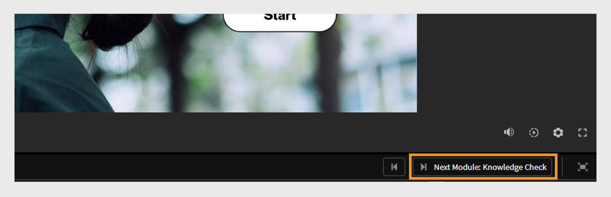
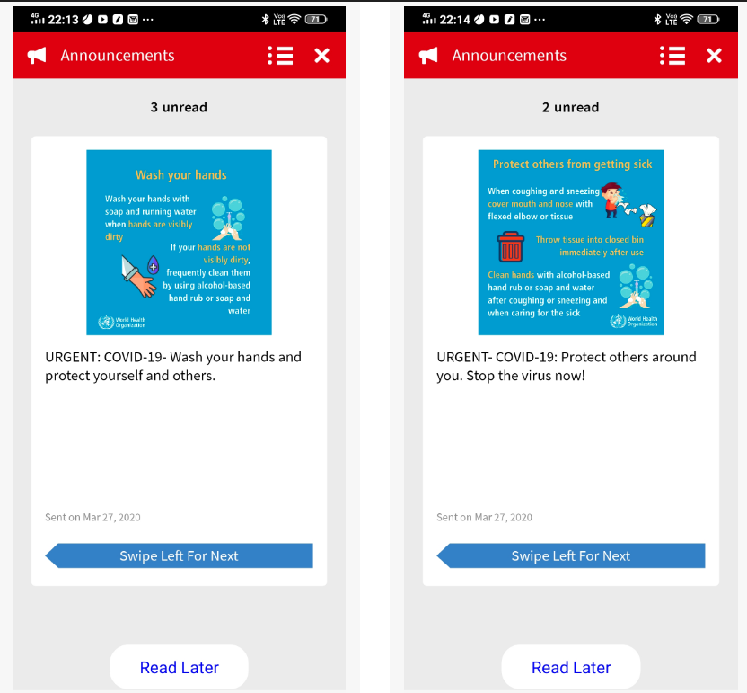
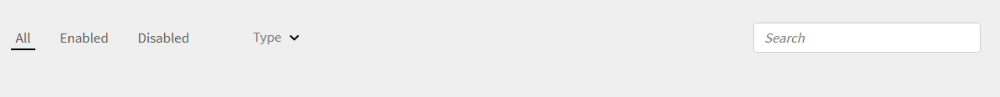
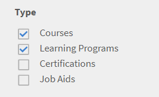

# Adobe Learning Manager 發布說明

<!--
<table>
 <tbody>
  <tr>
   <td></td>
   <td>
    
<a href="https://business.adobe.com/tw/products/learning-manager/adobe-learning-manager.html">Adobe Learning Manager</a> was launched in August 2015. As part of our continuous improvement efforts to enhance the product, we have been rolling out regular updates. Read on to know the features enhanced/issues fixed in update releases. 
</td>
  </tr>
 </tbody>
</table>
-->

+++更新 103：Adobe Learning Manager 2025 年 11 月版本

發行日期：2025年11月25日

## 這次發布有什麼新意

### 體驗建構器

Experience Builder 現已適用於所有 Adobe Learning Manager 帳號，讓客戶能利用低程式碼元件與彈性版面打造完整品牌化的學習體驗。 Experience Builder 允許管理員建立完全行動響應式的客製化學習入口與頁面。

對於現有帳號，經驗建構器更新會自動推出。 經驗建構器功能不適用於仍使用舊版 UI 或經典版 UI 的帳號。

欲了解更多資訊，請參閱 [體驗建樑](/help/migrated/administrators/feature-summary/experience-builder/overview.md) 。

### Adobe Learning Manager 行動網頁介面

行動網頁介面已基於現代程式碼基礎重建，以提供更快的載入時間、提升的響應速度，以及跨裝置更直覺的學習體驗。

所有新帳號預設已啟用更新的行動網頁體驗。 現有帳號也會自動升級，除非啟用了社交學習。 在這些情況下，先前的行動體驗將持續運作，直到社會學習遷移到新的相容框架。

>[!NOTE]
>
>新的 Adobe Learning Manager 行動網頁介面不支援社交學習。

### 流體球員增強

過去，流體玩家的「下一」按鈕不會顯示即將推出的模組名稱，這讓學習者難以預測學習旅程的下一步。

透過這項改進，「下一」按鈕現在包含下一個模組的標題，讓學習者能夠：

* 在他們繼續之前，先了解接下來會有哪些內容。
* 以更清晰且自信的方式導航模組。
* 在整個課程流程中保持更好的上下文。

_流體播放器現在會顯示下一個按鈕，上面有即將推出模組的標題_

### L1 反饋形式

L1 回饋只能在個別學習物件中設定，這限制了彈性，也讓管理員無法在目錄中使用不同的表單。 管理員現在可以建立並使用多個 L1 回饋表單，每個回饋表單都能分配給特定課程、學習路徑及認證。 該表單現在支援多種題型，包括課程效能、NPS、李克特量表及自由文本題。

回饋表單可以翻譯成其他語言，同時在所有地區保持相同的問題結構。 報告現在包含回饋表單名稱與回饋表單版本，以協助辨識每項回應的表單。

**使用案例**

* 為不同的培訓計畫分配量身訂做的回饋表單。 例如，銷售課程可以使用以NPS為主題的問題，而合規課程則可以使用課程效能與李克特量表問題來衡量清晰度與政策理解度。
* 根據學習模組使用不同的回饋表單。 例如，混合模組、自學模組和教室模組有三種不同形式。

欲了解更多資訊，請參閱 [L1回饋表](/help/migrated/administrators/feature-summary/l1-feedback-form.md) 單。

+++

+++更新 102：Adobe Learning Manager 2025 年 10 月發布

**上映日期**：2025年10月12日

## 這次發布有什麼新意

欲了解更多資訊，請參閱 [Adobe Learning Manager 2025 年 10 月版本](/help/migrated/whats-new.md) 的新內容。
+++

+++更新 101：2025 年 7 月 Adobe Learning Manager 發布

## 基於角色的電子郵件範本

### 客群

管理員與作者管理電子郵件範本

### 概觀

你（管理員或作者）可以根據收件人的角色、學習者、經理或講師來啟用或停用電子郵件範本。 它讓你能更好地掌控與學習者溝通的類型與頻率。

### 使用情境

* 管理員和作者需要在不通知管理者的情況下，透過電子郵件通知學習者（例如學習者註冊）。
* 有個選項可以針對特定角色批量啟用或停用電子郵件（例如，停用所有寄給經理的郵件）。

### 現有工作流程

如果目的是寄信給學習者但不寄給經理（例如課程報名），目前的範本會寄信給所有職務。

### 有什麼新鮮事

* 電子郵件範本介面上的基於角色的切換功能。
* 針對特定角色進行批量啟用或停用。
* 依範本可視化角色。

更多資訊請參閱本文[&#128279;](/help/migrated/administrators/feature-summary/email-templates.md#enable-or-disable-email-at-a-role-level)。

## 為已完成課程的學習者提供更佳的內容版本控制

### 概觀

當已完成課程的內容模組更新到新版本時，已完成課程的學習者仍會在背景接收更新後的模組版本。 這導致他們嘗試重溫賽道時出現意外的狀況，因為更新的內容並非為他們設計。

### 現有行為

當作者更新課程內容到新版本，並選擇只套用給尚未開始課程的學習者時，Adobe Learning Manager 仍會更新已完成課程的學習者版本。 因此，這些學習者無法如預期般存取原始內容。

此強化確保當課程模組更新並設定僅適用於尚未開始的學習者時，已完成課程的學習者仍可不間斷地存取原始版本。

### 改變了什麼

Adobe Learning Manager 現在為作者提供更清晰的內容更新管理選項。 作者可以更新課程中已有的內容。 新增版本時，版本號會顯示在內容旁。

當管理員造訪內容更新的課程時，他們會在新版本旁看到一個更新按鈕。 管理員也會看到清晰的更新選項，以選擇新內容版本如何套用給學習者。

| 學習者狀態 | 現在更新 | 更新 最終 | 更新尚未開始 |
|---|---|---|---|
| 未註冊 | V2 | V2 | V2 |
| 尚未開始 | V2 | V2 | V2 |
| 進行中 | V2 * | V1 → V2 * | V1 |
| 完成 | V2 * | V2 * | V1（保存） |

(*)表示模組在版本更新時會被重置。

在「更新未開始」時，已完成課程的學習者仍可繼續看到原始內容版本（V1）。 這避免了意外的回放問題，並確保學習者重溫已完成課程時能有一致的體驗。

### 內容更新選項

當管理員點擊 **[!UICONTROL Update]**&#x200B;時，他們可以從以下選項中選擇：

* **[!UICONTROL Update all Learners now]**：立即將內容更新套用於所有學習者。 未開始、進行中及已完成的學習者會立即切換到新版本。
* **[!UICONTROL Update all Learners eventually]**：將更新分階段應用給所有學習者。 未開始與完成的學習者現在會收到新版本。 進行中學習者完成當前版本後會收到更新。
* **[!UICONTROL Update only not started Learners]**：僅將更新應用於尚未開始課程的學習者。 進行中及已完成的學習者仍保留原始版本。

### 使用者介面變更

| 舊唱片公司 | 新選項 |
|---|---|
| 將內容更新應用給所有學習者 | 立即更新所有學習者:Apply 所有學習者的內容更新 |
| 申請更新給尚未開始的學習者 | 僅更新：僅未開始的學習者：適用於尚未開始的學習者 |
| 在學中學習者完成後會收到最新消息 | 最終更新所有學習者：最終為所有學習者應用內容更新 |

<!--

_Content update options_
-->

欲了解更多內容庫資訊，請參閱此 [條目](/help/migrated/authors/feature-summary/content-library.md#content-version-control-for-learners-who-have-completed-a-course) 。

## 流體演奏者的改良

此版本為 Adobe Learning Manager 帶來全新流體播放器，外觀現代化，學習體驗更直覺。 更新後的播放器介面更乾淨、導航控制更精良，以及桌面與行動裝置間統一的設計。 學習者可以輕鬆存取並互動任何螢幕模式，包括直向、橫向、全螢幕或標準視圖。

* **全新流暢的玩家皮膚**：現代化外觀，UI元素更新。
* **優化的導航控制**：更流暢且直覺的導航，提升學習體驗。
* **優化設計**：在桌面與行動裝置間提升外觀與可用性，支援直向、橫向、全螢幕及標準螢幕模式。

所有透過 Adobe Learning Manager 存取內容的學習者，不論使用 Native 或 Headless 體驗，都會自動看到這些新的介面與導航改進。 學習者可能會注意到，因為版面與操作的更新，與玩家互動的方式有些微改變。

>[!NOTE]
>
>此增強功能僅適用於靜態內容。

有關流體演奏者的更多資訊，請參閱本文[&#128279;](/help/migrated/learners/feature-summary/fluidic-player.md)。

## 本版本修正了錯誤

* 修正了完成課程的學習者在內容模組更新到新版本後重看時看到白畫面的問題。

此外，關於 Adobe Learning Manager 即將更新的細節，請參閱本文[&#128279;](https://experienceleague.adobe.com/zh-hant/docs/learning-manager/using/introduction/upcoming-changes-in-adobe-learning-manager)。

+++

+++更新 100：Adobe Learning Manager 2025 年 5 月版本

**上映日期**：2025年5月10日

## 這次發布有什麼新意

查看 [Adobe Learning Manager](/help/migrated/whats-new-may-2025.md) 中的新功能以獲取更多資訊。
+++

+++更新 99：Adobe Learning Manager 於 2025 年 2 月發布

## 透過 SAML 建立介面語言

Adobe Learning Manager （ALM） 現在接受語言的 SAML 屬性。 此屬性隨後會映射到使用者的介面與內容語言設定，確保以偏好語言與 LMS 順暢互動。 這些語言設定的配置透過身份與存取管理（IAM）平台管理，採用 SAML 進行單點登入（SSO）。 這支援由服務提供者（SP）發起的登入，也支援身份提供者（IdP）發起的登入，讓使用者能以自己選擇的語言查看介面與內容。

欲了解更多資訊，請參閱本文[&#128279;](/help/migrated/administrators/feature-summary/set-up-interface-language-through-saml.md)。

## 遷移 API 的強化

過去，透過 API`GET /bulkimport/cansync` 遷移的帶有外部連結的活動模組（和 `POST /bulkimport/startrun`）在存取連結後不會顯示給學習者這個 **[!UICONTROL Mark as Complete]** 選項。 這個問題已經解決了。 現在，透過 API 遷移外部連結的活動模組，學習者會正確顯示該 **[!UICONTROL Mark as Complete]** 選項。

## Learner 應用程式中的排序功能

學習者應用程式的排序功能會根據內容和介面語言提供個人化課程推薦。 此改進簡化了學習者尋找偏好語言課程及更智慧排序選項的過程。

欲了解更多資訊，請參閱本文[&#128279;](/help/migrated/learners/feature-summary/catalogs.md#sorting-functionality-in-the-learner-app)。

+++

+++更新 98：Adobe Learning Manager 於 2024 年 11 月發布

**上映日期**：2024年11月16日

## 這次發布有什麼新意

查看 [Adobe Learning Manager](/help/migrated/whats-new-nov-24.md) 中的新功能以獲取更多資訊。
+++

+++更新 97：Adobe Learning Manager 2024 年 7 月版本

**上映日期：** 2024年7月13日

## 這次發布有什麼新意

查看 [Adobe Learning Manager](/help/migrated/whats-new-july-2024.md) 中的新功能以獲取更多資訊。
+++

+++更新 96：Adobe Learning Manager 2024 年 3 月發布

**上映日期：** 2024年3月16日

## 這次發布有什麼新意

查看 [Adobe Learning Manager](/help/migrated/whats-new-march-2024.md) 中的新功能以獲取更多資訊。
+++

+++更新 95：Adobe Learning Manager 於 2023 年 11 月發布

**上映日期：** 2023年11月18日

## 這次發布有什麼新意

查看 [Adobe Learning Manager](/help/migrated/whats-new-november-2023.md) 中的新功能以獲取更多資訊。
+++

+++更新 94

**發行日期：** 2023年8月23日

## 這次更新有什麼新意

* 選擇播放器的齒輪圖示以改變影片品質。
* 在社群媒體上改變影片的品質和速度。
+++

+++更新 93：2023 年 7 月 Adobe Learning Manager 發布

**發行日期：** 2023年7月10日

這次發布有什麼新意

### 改進建議

Adobe Learning Manager 推出了全新且全新設計的課程推薦系統。 此推薦功能利用 AI 演算法與用戶興趣（如產品、角色與等級）提供個人化內容推薦。

### 多重註冊

在本次 Adobe Learning Manager 版本中，我們引入了多重註冊功能，允許學習者在一個或不同時間段註冊多個課程實例。

### Exavault 連接器的退役

這次 Adobe Learning Manager 版本將包含一個新的連接器，該連接器將使用 AWS Transfer 家族的 SFTP 協定。

欲了解更多資訊，請參閱 [2023 年 7 月版 Adobe Learning Manager](/help/migrated/whats-new-2023-july.md) 的新內容。
+++

+++更新：92

**上映日期：** 2023年6月23日

**本次更新修正的錯誤**

* 完成模組後，成績 API 不會自動觸發，導致綠色勾選標記在使用者介面上顯示不正常。
* 完成學習路徑或認證中的幾個模組後，綠色勾勾（表示成功完成）不會如預期顯示。
* Adobe Learning Manager 在上傳包含錯誤欄位的使用者 CSV 後，無法如預期啟動。
* 關於如何聯絡管理員的警告彈窗也會顯示其他電子郵件地址。
* 所有學習者獲得的徽章不會顯示在回覆中。
* 用戶註冊時，必須接受帶有「」的使用者名稱。

#### 球員生涯

* 新增一個選單，讓播放影片時可以選擇螢幕解析度。
+++

+++更新91

**發行日期：** 2023年6月1日

### 連接器

* Adobe Connect 連接器需要 API 來傳送 CSRF 令牌。 欲了解更多資訊，請參閱提升 Adobe Connect 帳號安全。

### 換弦

* 我們將「評分此訓練」字串重新命名為「評分此課程」、「評分此學習路徑」或「評分此認證」，依照學習者所接受的訓練內容。 根據訓練類型，學習者會相應地看到繩索。

### 本次更新修正的錯誤

* Play 商店的 Adobe Learning Manager 行動應用程式描述錯誤地說學習者可以離線修課。
* 在從 LinkedIn 遷移內容（module_version.csv 和 course_module.csv）到 Adobe Learning Manager 時遇到了一些問題。
* 如果帳號處於非活躍狀態且創建超過三年，那麼該帳號的所有使用者都會根據 GDPR 刪除，不論使用者的狀態如何。
* 在 Instructor 應用程式中，當你在課程中將候補名單限制設為零並儲存課程時，使用者介面錯誤地顯示「不適用」而不是「零」。
* 在為 Power BI 連接器產生學習者逐字稿時，訓練或模組時長（分鐘）欄位會顯示某些教室或虛擬課程模組的空值。
* 當你在一個實例或多個實例中標記課程為完成後，課程中所有學習者都會被標記為完成，而不僅僅是目前實例中的學習者。
+++

+++更新90

**上映日期：** 2023年4月4日

### 本次更新修正的錯誤

如果 SSO 登入 URL 包含 entity_id，則 SAML 登入失敗。
+++

+++更新 89：2023 年 3 月 Adobe Learning Manager 發布

**上映日期：** 2023年4月1日

### 這次更新有什麼新意

**教官主導訓練（ILT）體驗的提升**

教官主導訓練（ILT）體驗進行了多項提升。 主要增強功能包括——能依地點篩選教室課程、可切換實例（VILT）而不失去進度、新增「排程助理」以管理教師與教室預約衝突、能將「技能」附加給教師並依技能選擇教師的能力。

**觀察檢查清單**&#x200B;的改進：

作者現在可以選擇「經理」和「商店經理」作為檢查清單的觀察者。 經理可在管理員介面中查看並完成檢查清單，無需切換角色為講師。 當檢查清單被分配給經理時，通知會發送給他/她。

**使用任何應用程式或智慧型手機相機掃描學習管理員的 QR 碼**

學習者現在可以使用任何 QR 碼掃描應用程式或智慧型手機相機，掃描學習管理員產生的 QR 碼，以完成課程報名、完成等操作。

**報告強化**

新的講師使用報告、訓練回顧報告、工作輔助報告及其他報告改進。

**支援「混合」會議**

Adobe Learning Manager 現在支援建立「混合」講師主導訓練（ILT）課程的功能。 虛擬 ILT 課程可透過選擇性地點資訊建立，若學習者在場可選，也能親自參加課程。

**更佳的課堂與虛擬學習學習進度追蹤**

教室與虛擬 ILT 模組現在提供報告學習者測驗狀態（通過或不通過）及出席狀況的功能。 因此，出席率與小考成功率均可作為決定學習進度的考量。

**Microsoft Teams 的 Adobe Learning Manager 應用程式**

Microsoft Teams 上全新的 Adobe Learning Manager 應用程式旨在促進工作流程中的學習並促進社交學習。 學習者將能在 Microsoft Teams 平台內存取學習內容，無需切換到瀏覽器。 請聯絡您的 CSAM，了解 MS Teams 上 Adobe Learning Manager 應用程式的測試版。

### 本次更新修正的錯誤

**河道**

* 自訂作者在課程處於「UNDER_CONSTRUCTION」狀態時無法預覽模組。 回應顯示錯誤 404。
* 作者應用程式的課程/新增頁面上的課程標題在超過某個字數限制時會溢出。

**作者**

* 在作者應用程式中，課程標題（如果很長）在建立課程時會超過頁面邊界。
* 有時候，課程會被新增，即使沒有被選中作者。

**儀表板報告**

* 當介面語言為英文時，工具提示顯示正常，但介面語言不同時會跳出主控台錯誤。
* 在學習者儀表板中將「強制」改名為「必需」。

**講師應用程式**

* 講師應用程式的時間格式與其他應用程式不一致。

**社會**

* 對於某些類型的貼文，發文後社群板不會如預期開啟。

**行政**

* 自訂角色的使用者在預覽課程時無法下載資源。

**電子郵件範本**

* 當學習者從包含教室/虛擬課程的學習計畫退選時，他/她不會收到任何取消郵件。

**工作輔助工具**

* 你無法在工作輔助工具中看到課程名稱。

**出版**

* Adobe Captivate 新增的模組描述在 ALM 發布時，在 Learning Manager 中無法看到。

**活躍場域**

* 當一個包含大量紀錄的 CSV 正在處理時，會花費相當長的時間，在此期間，如果使用者登入並輸入某個屬性的值，可能會產生新的使用者群組，導致 CSV 錯誤。 為了解決這個問題，當 CSV 匯入進行中，Active Fields 屬性彈窗訊息會被停用，CSV 上傳完成後才會重新啟用。
* 如果 Users csv 檔案中的欄位名稱與外部使用者的活動欄位相同，CSV 上傳將失敗。

**API 相關修正**

* 在 learningObjects 回應函中，缺少 bookmark 屬性。
* 在產生被刪除用戶的 OUuAuth 刷新令牌時，會建立一個存取條目。
* LO API 回傳錯誤的 loFormat，因為在計算課程類型及核心內容時，考慮了預習模組。

**本次更新中已知的問題**

* 學習者目錄中的分享按鈕在 Safari 瀏覽器、行動裝置及 iPad MS Teams 應用程式上無法如預期運作。
* 在其他機器移除應用程式後，通知不會顯示在活動標籤中。
在 iPhone 14 的應用程式活動分頁點擊通知時，什麼都沒發生。
* 在 MS Teams 應用程式中，學習管理員的通知（已完成、已註冊、截止日期和逾期）在活動標籤中不會顯示課程的狀態和名稱。
* 當整合管理員未批准 MS Teams 應用程式時，會跳出包含 XML 內容的視窗。
* Microsoft Teams 的 Adobe Learning Manager 應用程式中的使用者介面語言，有時候在更改語言時不會如預期般改變。
* 當焦點在 Iframe（首頁和目錄分頁）時，你無法與第一個通知互動。

**Adobe Learning Manager 行動應用程式的限制**

* 離線內容的觀看。
* 目錄/我的學習頁面上的格子/清單視圖。
* 多次嘗試修課。
* 課程卡上的報名截止日期。
* 在 iOS 裝置上，當應用程式置於前景時，推播通知不會出現。
* 推播通知中的深度連結不會導向預期的登陸頁面。
* 點擊「登記興趣」按鈕將導向至網頁。
* 在 Social Learning 中回覆或留言時，你將無法附加檔案。
* 您將無法登入 LinkedIn Learning。
+++

+++更新88

**發行日期：** 2023年3月7日

### 本版本的效能改進

當進行大量學習者登記時，不會為每位學習者產生任何日誌檔案。
我們已優化大型帳戶學習計畫的處理方式。 這樣做可以避免搜尋問題或延遲。
+++

+++更新 87

**上映日期：** 2023年3月1日

## 本次更新修正的錯誤

* 若CR/VC模組從已註冊課程中移除，學習者將不會收到課程取消的電子郵件。
* 將 GetNotificationData 從 GET 改為 POST。 原始實作產生錯誤 **IllegalArgumentException：Request 標頭過大**，導致通知失敗。
+++

+++更新：86

**上映日期：** 2023年2月17日

### 本版本修正了錯誤

在學習者應用程式中，搜尋使用者和使用者群組因區域設定問題而失敗。
+++

+++更新85

**上映日期：** 2023年2月13日

### 這次更新的改變

在 GET learningmanagerapi/v2/learningObjects 中過濾語言時，新增了四字母語言程式碼的支援。

### 本次更新修正的錯誤

對某些地點，搜尋結果會錯誤。
當課程中有多個相同地點的變體時，課程的元資料會被覆蓋。
+++

+++更新84

**發行日期：** 2023年2月2日

### 這次更新的改變

**就業援助報告**

此更新新增一份工作援助報告，列出帳戶中所有工作輔助工具。

**版本控制**

我們在建立課程時新增資源時，也加入了版本控制。

**嘗試報告**

你可以查看每位學員每次訓練中所有重試與重訪的報告。

**模組重置 API**

管理員現在可以透過模組重置 API 來重置模組。 欲了解更多資訊，請參閱 [Adobe Learning Manager API 參考資料](https://captivateprime.adobe.com/docs/primeapi/v2/)。

**電子郵件範本**

對於某些電子郵件範本，你現在可以在範本中加入先決條件。

**其他變動**

* 你可以將經理核准的課程列為先修課程。
* 刷新學習摘要儀表板時的效能提升。
* 電子郵件帳號和帳號帳號在寄送退信報告前都會經過驗證。

### 本次更新修正了錯誤

* 課程總覽頁面會出現重複的作者姓名。
* 帳號建立頁面上的一個超連結指向錯誤 404。
* 捷克場景在玩家設定中並未反映出預期的效果。
* 在某些情況下，技能會顯示為未定義，顯示為進行中且未開始學習的學生。
* 多天時間顯示學習者成績單與註冊報告中所花費的時間不同。
* 在課程> L2 測驗分數>題目分頁及出席與評分中，管理員與經理檔案的返回按鈕無法回應。
* 在某些地區，電子郵件範本中缺少部分內容，且範本中的語言翻譯不一致。
+++

+++更新83

**上映日期：** 2023年1月18日

### 這次更新的改變

**新柱**

新增一個欄位 **unenrollmentAllowed**，並加入course.xlsx。 從這本手冊下載檔案。

**Linkedin Learning 連接器**

在 Linked in Learning 連接器中，篩選器頁面新增了一個「學習者可取消註冊」的勾選框。 欲了解更多資訊，請參閱 [LinkedIn Learning 連結器](/help/migrated/integration-admin/feature-summary/connectors.md)。

### 本次更新修正的錯誤

* 當滑鼠移到長條圖上時，儀表板報告工具提示會如預期般出現。
* 在「使用者活動」下的報告中，學習時間報告顯示的每日/月數據資料不正確。
* 在某些情況下，測驗分數圖表顯示錯誤的數值。
* 在有 SCORM 內容且設定多次嘗試的課程中，當學習者嘗試該課程時，重訪按鈕會被關閉。
* 在某些情況下，學習者註冊課程並下載電子郵件審核日誌後，郵件會送達，但不會出現在日誌中。
* 授課日曆邀請函必須包含該主題的文本授課老師。
* 培訓卡圖示不會反映在課程總覽頁面上的相關課程推薦及學習路徑卡上。
* 在學習者首頁設定中，新增「由我儲存」區塊。
* 對於某些帳號，使用者會被要求使用 Adobe ID 的帳號進行單點登入。
* 在有夏令時間的時區，「start_time」欄位是根據目前的時差計算，而非實際開始日期和時間的時差。 這導致邀請時間不正確。
* 每當認證重複發放時，底層課程的副本會在資料庫內部建立。 這些路徑隨後會與預期行為相反地出現在搜尋中。
* 當 CSV 上傳失敗時，你不會收到任何電子郵件通知。
* 若活動欄位名稱較長，拖曳時名稱會消失。 之後，儲存按鈕也無法如預期運作。
* 如果報告中第一個使用者在活動評分表中有註解為空的紀錄，則該課程報告不會透過課程的出席與評分頁面匯出。
* 當你用管理員帳號取回徽章時，清單就能如預期般排序。 但當你對學習者做同樣的測試時，結果卻無法排序。
* 如果你從搜尋結果中選擇課程，然後嘗試用返回按鈕返回搜尋結果，搜尋結果就會消失。
* 並非所有使用者都會被加入一個使用者群組，作為課程中的講師。
* 包含多個使用者範本的範本，其主題會被某些值覆蓋。
+++

+++更新82

**上映日期：** 2022年12月15日

* GET LO API 現在也包含價格資訊（如有）。
* 在LT報告中新增一欄「完成者」。 這有助於管理員識別 LO 的完成來源。
* 我們新增了一個 ILT 模組，可以記錄學習者的通過/不通過狀態以及出勤情況。 講師現在可以將學習者標記為已就讀（pass）或未通過（fail）選項。
* 管理員現在可以要求學習者完成並通過後，才能修讀下一模組或課程。 這適用於先修課程、已訂購的課程及 LP。

**錯誤修正**

* 沉浸式行動體驗的印尼語問題，請見側邊欄和頁腳。
* 沉浸式檢視與模組預覽相關的修正。
* 在管理員與作者搜尋中，結果顯示的地點與輸入結果不同。
* 歡迎電子郵件範本的變更在編輯後無法保存。
* 擁有不同電子郵件 ID 與 Adobe ID 的用戶無法登入行動應用程式。
* 用戶在加入 Zoom / BJ 視訊會議時被錯誤識別。
+++

+++更新 81 - 2022 年 11 月 Adobe Learning Manager 版本

**發行日期：** 2022年11月5日

**注意：** 隨著本次 Adobe Learning Manager 版本，非活躍帳號的使用者將無法再使用子網域存取他們的帳號。 帳戶可透過帳號 ID 或acapindex.html頁面輸入電子郵件 ID 存取。

### 這次發布有什麼新意

2022 年 11 月發布的 Adobe Learning Manager 包含以下內容：

* 多重單點單點設定
* 非登入功能支援
* 訓練總覽頁面的增強功能
* 玩家自訂
* 學員與經理的模仿

**注意：**&#x200B;隨著 Adobe Learning Manager 於 2022 年 11 月發布，Zoom 將於 2023[&#128279;](https://marketplace.zoom.us/docs/guides/auth/jwt/) 年 6 月前棄用 JWT 認證。因此，與 JWT 的 Zoom 連接器將持續使用直到指定日期，但我們建議用戶建立伺服器對伺服器的 OAuth 應用程式，以取代帳號中的此功能。 任何新連線預設都會有 Zoom OAuth 認證。

### 本次更新修正的錯誤

* 作為學習者，當你嘗試在行動裝置上存取包含超過 10 門課程的學習程式時，會出現錯誤訊息。
* 如果課程設定了提醒要在錯過截止日期後 n 天發送，郵件會如預期在 n 天後發送，但錯過截止日期的天數是 n-1 天數，而不是 n。
* 若學習者應用程式中課程啟用 L1 回饋，且使用者僅有學習者角色，影片不會在播放器中載入。
* 完成提醒郵件並未如預期顯示使用者時區的時間。
* 透過儀表板報告產生的學習者成績單不會遵守篩選條件，且顯示超出必要的資訊。
* 你無法選擇介面語言未被加入為內容語言的內容。
* 當我第二次自行註冊課程時，出現的網址是錯誤的。
* 當講師被移除VC課程時，他們不會收到任何取消課程通知的郵件。
* 學習者訓練頁面上磁磚上的「minute」字樣並未如預期被翻譯成印尼語。
* 合規儀表板顯示不合規學習者的錯誤資料。
* 在新增報告時，你無法選擇介面語言未加入內容語言的課程或目錄。
* 我們在此版本中新增了以下內容語言：
   * 保加利亞
   * 佛蘭芒語
   * 葡萄牙語（巴西）

### 本次更新中已知的問題

* 在某些情況下，測驗分數圖表顯示時並未如預期。 當你調整圖表大小時，開頭會出現一個空白。 此外，並非所有問題都會出現，錯誤資料也會間歇性顯示。
+++

+++更新80

**上映日期：** 2022年9月20日

* iOS 行動應用程式的登入問題現在已經修正。
* 已修正退信問題。
* 講師在學習者提交申請前就被錯誤通知。
* 即使學習者尚未提交活動，講師仍會收到電子郵件通知。
* 在 MS Teams 或 Adobe Connect 建立 VC 課程後，講師不會收到課程邀請。
* 學習路徑中的錯誤狀態。
* 提升了應用程式的效能。
+++

+++更新79

**上映日期：** 2022年8月18日

* ILT / VILT 會議的日曆邀請確認功能現在可以搭配 Google 行事曆運作。
* 即使員工被移除，店經理現在仍能看到其下方的用戶通知。
* 在某些情況下，課程註冊失敗，顯示錯誤 500。
* 有時你無法修改 Teams 的虛擬課程實例。
* 管理員和講師可以為未參加 ILT / VILT 課程的用戶添加評論。
* 下載大型報表時效能提升。
* 當使用者的電子郵件退信時，管理員會收到電子郵件通知。 郵件中包含一個連結，點擊後會下載一份包含郵件退信用戶名單的 CSV 文件。 管理員接著可以採取必要的行動。
   * 當郵件退信或掉落時，郵件會被觸發。
   * 這封郵件每天會觸發一次，發送給所有被加入名單的管理員。
   * 連結將在七天後到期。
* 嘗試將已整合的 Adobe Connect 帳號與另一個 Learning Manager 帳號整合時，會跳出錯誤訊息。
+++

+++更新78

**發行日期：** 2022年8月4日

### 本次更新修正的錯誤

* 如果你的課程包含包含預覽模組，然後用 API 從課程中取得資源，那麼回應中不會包含 location、contentZipUrl 和 contentStructureInfoUrl 的資料。
* 在從 Swagger 文件發送 XAPI 請求後，該文件的網域名稱是 learningmanager，回覆不正確。
* 在 /boards/{id}/posts API 回應中，「post.attributes.myPoll」屬性顯示為空物件。
* 在某些情況下，對於未登入的使用者，某些課程或學習路徑的「加入購物車」按鈕會被停用。
* 品牌頁面上的子網域網址錯誤。
+++

+++更新77

**上映日期：** 2022年5月24日

**本次更新已修正的問題：**

* 新課程在 Salesforce 應用程式中不承認這個序列。 如果你改變了順序，賽道就無法依預期順序顯示。
* 在 Classic 首頁修改設定並儲存後，這些變更並不會如預期般被儲存。 這種情況是間歇性的。
* 當學習者查看通知時，HTML 程式碼會顯示，這會對體驗產生負面影響。
* 在儀表板上，學習時間錯誤地顯示為零小時。

## 更新：Adobe Learning Manager 將重新命名為 Adobe Learning Manager

這是關於即將到來的變更更新，幫助你做好準備。

**Adobe Learning Manager 產品將於 2022** 年 7 月重新命名為 Adobe Learning Manager。 這是為了更準確反映產品與某些業務優先事項的對齊度而進行的策略性努力。

產品團隊正採取一切措施，確保不會影響您使用平台。 你可以照常使用這個產品。 平台管理員可能會在七月的某些畫面中注意到新品牌名稱。

作為此變更的一部分，Learning Manager 的存取網址也會受到影響。

例如，如果你帳號的存取網址是 `https://learningmanager.adobe.com/XYZ`，那麼新的 URL 將會是 `https://learningmanager.adobe.com/XYZ`。

所有現有的網址都會繼續正常運作。

要完成此步驟，請與你組織的資訊部門合作。 欲了解更多資訊，請聯絡我們。`learningmanagersupport@adobe.com`
+++

+++更新76

**發行日期：** 2022年4月20日

* 修正了幾個儀表板報告中的產品術語。
* 端點網址中的雙斜線（「//」）會導致驗證錯誤。
* 刷新頁面後，完成率和最近造訪欄位顯示錯誤資訊。
* 我們對價值證書或學習計畫的計算方式做了一些調整。
* 自訂管理員即使只被允許新增一位使用者，也能將所有使用者新增為講師。
* 在徽章 PDF 上，顯示的完成日期錯誤。
+++

+++更新75

**發行日期：** 2022年3月29日

* 在某些帳號中，複製原始 csv 到 FTP 位置後，使用者匯入並未如預期進行，且會有多次錯誤通知。
* 在先前的 Learning Manager 版本中，要設定 Zoom 連接器，必須先設定 Exavault FTP 來複製 csv 檔案。 在此版本中，將不再使用 FTP 連接器來傳送 csv 檔案，因此你不必先設定 FTP。
+++

+++更新 74：Learning Manager AWS India 實例

**發行日期：** 2022年2月15日

### 概觀

[Learning Manager 的實例](https://learningmanagerapac.adobe.com/acapindex.html)現在將架設在孟買的 AWS（ap-south-1）。使用印度實例的客戶，其用戶的個人識別資訊（PII）及學習記錄僅儲存在印度區域。

### 支援內容

Adobe Learning Manager 印度實例在功能能力上與歐盟和美國區域的實例相當。 有些功能在 India 實例中不支援。 這些包括：

* 購買座位需用信用卡付款
* Creative Cloud 內容目錄
* Slack 應用程式
* **&#42;** 等待 SOC2 合規認證

### 常見問題

**孟買的這個實例與其他僅支援 AWS 的環境有什麼不同？**

兩者沒有差別。 孟買的實例與 [美國](http://learningmanager.adobe.com/) AWS 或 [歐盟](http://learningmanagereu.adobe.com/) 的實例相同。 此實例託管於印度，所有學習紀錄與使用者資料均保存在印度。 以下功能在 India 實例中未被支援：

* 購買座位需用信用卡付款
* Creative Cloud 內容目錄
* Slack 應用程式
* **&#42;** 等待 SOC2 合規認證

**這個環境會符合共同控制框架（CCF）標準嗎？**

是的。 新實例符合通用控制框架（CCF）標準。
+++

+++更新 73

發行日期：2022年2月5日

* 電子郵件範本支援現已支援內容語言，包括匈牙利語和芬蘭語。
+++

+++更新 72 - 2022 年 1 月 學習管理器發布

上映日期：2022年1月15日

### 有什麼新變化

* 新增教室地點
* 遊戲化變革
* Microsoft Teams 連接器
* API 變更
* 行動沉浸式網頁變革

<!--
For more information, see What's new in the [**January 2022 release of Adobe Learning Manager**](../whats-new.md).

-->

### 本版本已修正錯誤

**內容庫**

* 對於擁有自訂角色權限的使用者，搜尋私有內容資料夾中的內容檔案無法正常運作。 這問題現在已經解決了。

**課程**

* 如果課程或學習路徑與學習計畫有歷史關聯，則無法刪除。 這問題現在已經解決了。 使用者現在可以刪除課程或學習路徑，若他們目前沒有與學習計畫相關聯。
* 在預覽課程或學習路徑時，如果資源檔名稱較長且無空格，檔名就不會如預期般包裹，而是溢位到下一行。 這個問題已經解決了。
* 以虛擬教室為例，過去你可以在不選擇任何虛擬音頻會議系統的情況下建立模組，因為在新實例中虛擬音頻的 URL 沒有所需資訊。 現在模組建立階段會跳出錯誤訊息，要求你先指定 VC 會議系統才能存檔，避免了這個問題。
* 候補名單頁面曾顯示註冊用戶誤導性的橫幅訊息，現已移除。
* 在課程大規模退選的情況下，輸入電子郵件 ID 的跳出視窗沒出現，現在已經修正了。
* 在管理員和講師應用程式中，從出席與評分標籤發送電子郵件給學習者，並未排除執行全選操作後未被勾選的學習者。 因此 Learning Manager 會向所有學習者發送電子郵件。 這個問題現在已經解決了。
* 註冊報告顯示「未開始」，即使學員已完成課程。

**SSO**

* 在 SSO 設定中，如果實體 ID 有任何領先或訓練空間，代表登入設定無法運作，現在這部分已作為修正的一部分處理。

**公告**

* 作為管理員，如果介面與內容語言設為德語/西班牙語，公告的開始和結束日期就不會被儲存。 這個問題現在已經解決了。

**電子郵件範本**

* 跨越多天的會話邀請，且邀請日期未反映正確資訊，會在部分電子郵件客戶端中被封鎖。 這問題現在已經解決了。
* 「場地名稱」變數在德國學習者的「即將上課提醒」電子郵件範本中缺少。 這部分現在被加入了。
* 歡迎信中建立帳號的連結沒有考慮使用者所在地，現在已經修正。

**電子郵件提醒**

* 若學習者是透過學習計畫註冊訓練，則完成提醒郵件會根據同一學習計畫完成日期的編輯次數多次發送。 這個問題現在已經解決了。

**使用者**

* 當用戶帳號處於非活躍或暫停狀態時，顯示的訊息已經改進，提示你聯絡管理員重新啟用帳號。

**活動**

* 如果提交檔案名稱中有特殊字元，教師無法查看學習者的提交。 這問題現在已經解決了。

**賽事報導**

* 如果課程註冊報告中包含透過彈性學習路徑間接註冊的學習者，但尚未選擇該課程的實例，管理員無法下載該課程註冊報告。 這個問題現在已經解決了。
* 在報告儀表板中重新排列報告以符合管理員和經理角色，並沒有保留報告順序的狀態。 這個問題現在已經解決了。

**內容**

* 由於瀏覽器自動播放政策，訓練內容中的音訊在學習者模式的預覽中無法自動播放。 目前支援瀏覽器（Safari除外）已修正此問題。

**遊戲化**

* 如果外部學習者在同一帳號中被轉換成內部學習者，則無法進入學習者應用程式中的遊戲化排行榜。 這個問題現在已經解決了。

**球員生涯**

* 當使用者嘗試跳過有序航線的 AICC 模組時，玩家不會顯示警告訊息。 這問題現在已經解決了。
* 對於某些已取得的課程，將影片模組放在無頭 LMS 機殼播放中，對某些使用者來說無法正常運作。 這個問題現在已經解決了。

**經理儀表板**

* 一位經理無法從 Manager Dashboard 的團隊技能頁面匯出其直屬團隊的報告。 這個問題現在已經解決了。

**發佈**

* 在歐洲的 Learning Manager 案例中，直接從 Adobe Captivate 發佈到 Adobe Learning Manager 的內容，預設是以德文本地發佈。 這問題現在已經解決了。

**API**

* 工作援助模型中新增了期限欄位。
* 對於推薦 API，有時 GET 請求會回傳錯誤 500。
* 當你透過 Exavault 遷移訓練內容，且文本中有非英文字元時，過去會被更新成垃圾字元。 這個問題現在已經解決了。

**本地化**

* `NormalTextRun  BCX0 SCXW38820519 For the`管理員、作者和學習者應用程式，部分德語內容顯示不如預期。

## 本版本已知問題

* 在社交學習頁面，當你建立貼文時，點擊麥克風按鈕後無法錄製音訊或上傳音訊。 這是瀏覽器的限制。
* 在 iOS 中，行動瀏覽器不支援 H264 和 WMA 音訊檔案。
* 電子郵件地址中帶有 + 的學習者，其進度不會被標記。 這是在他們參加 Microsoft Teams 的創投課程之後。
* 在 Safari 行動瀏覽器中，學習者在社交學習中無法上傳超過 200 MB 的檔案。 這是瀏覽器的限制。
+++

+++更新71

發行日期：2021年11月17日

### 與經理分享訓練

Learning Manager 為所有管理員與經理提供合規儀表板。 經理們發現追蹤團隊成員在特定培訓中的遵從情況非常有幫助。 同時，管理者希望所有經理能將合規訓練加入儀表板並進行追蹤。

在學習管理工具中， **與經理** 共享流程允許管理員與經理分享訓練內容，以便將訓練加入管理者的合規儀表板。 因此，管理者無需採取任何行動，即可立即開始追蹤合規。

欲了解更多資訊，請參閱  [**與經理**](../administrators/feature-summary/reports.md#share_training_managers)&#x200B;分享培訓。

### 本次更新修正的錯誤

* 如果有兩個帳號且啟用強化學習路徑功能，且第一個帳號有共享目錄到另一個帳號，那麼第二個帳號的學習路徑在課程頁面中會有重複的區塊。
* 自訂 FTP 現在除了 http:// 和 https:// 外，還支援 sftp://
* Exavault 連接器現在使用 V2 API。
* 有些影片品質甚至不理想。 問題現在已經解決了。
* 即使學員完成強制課程並經經理批准，該認證仍維持在待核准狀態。
* 若作者姓名帶有重音符號，課程遷移失敗。
* 若活動欄位值為大寫，則該活動欄位不會如預期被儲存。
* 無法根據技能篩選學習路徑。
* 當管理員建立實例並新增課程時，講師不會收到課程邀請郵件。 這個問題發生在 Zoom VC 課程中。
+++

+++更新70

發行日期：2021年10月28日

### 本次更新修正的錯誤

* 在某些情況下，學習路徑的資訊不會反映在學習者成績單中。
* 標記補全&#x200B;**對話框內**&#x200B;的文字會更新，反映該操作是不可逆的。
* Learning Objects API 在某些情況下會回傳元資料錯誤。
+++

+++更新 69 - 2021 年 10 月 學習管理員發布

**上映日期：** 2021年10月9日

### 學習路徑

**2021 年 10 月的 Adobe Learning Manager** 版本引入了學習路徑（Learning Paths）的概念。

>[!NOTE]
>
>**設定>一般**&#x200B;頁面新增了一個選項，可以啟用學習路徑的擴展功能。如果啟用此選項，你可以在另一個學習路徑中新增學習路徑。 啟用後你就無法更改這個選項。

學習路徑取代了我們現有的學習程式功能。 想像一下學習程式能獲得強大的增強，卻不犧牲任何現有功能。 此外，這個功能也被稱為學習路徑。

欲了解更多資訊，請參閱 [***學習路徑***](../administrators/feature-summary/learning-paths.md)。

### 其他變動

* 全新 Salesforce 應用程式
* 內容中心
* 報告變更
* 會期總結報告
* 球員目錄變更
* API 變更
* 連接器相關變更

欲了解更多資訊，請參閱 [***2021 年 10 月版 Learning Manager***](../whats-new.md) 中的新功能。

### 本次更新修正的錯誤

* 電子郵件範本，如課程退選、學習計畫退選或認證退選，並不反映csv中定義的最新產品術語。 現在電子郵件範本中的預設文字將支援自訂術語。
* Learning Manager 中的使用者語言不支援於發佈至 Learning Manager 工作流程中。 如果使用者語言不同，發佈到學習管理器則是以英文進行。
* 如果你在自訂角色中新增許多目錄，更新角色時會發生錯誤。 現在目錄數量上限提高至50個。
* 在某些情況下，刪除的訓練仍可在目錄中可見。 這個問題只發生在管理員應用程式，現在已經修復了。
* 當管理者角色從一位使用者切換到另一位時，前一位使用者的管理者角色仍會反映在使用者介面中。 這問題現在已經解決了。 此問題僅出現在外部使用者身上，內部用戶則未受影響。
* 在某些特定情境中，大量使用者透過 user CSV 匯入時，匯入失敗了。 這個問題現在已經解決了。
* 若外部證書建立後新增強制課程，且使用者已註冊該證書，學習成績單不會顯示該證書的完成日期。 這問題現在已經解決了。
* 證書不會如預期顯示學習者的在地姓名。 這問題現在已經解決了。
* 在 Zoom VC 課程中，講師不一定會收到該課程的邀請。 這問題現在已經解決了。 講師現在收到所需的溝通。
* 若啟用課程層級範本但關閉帳號層級範本，學習者不會收到課程邀請。 這問題現在已經解決了。
* 針對特定時區，電子郵件提醒會比預期晚一天送達。 這問題現在已經解決了。
* 若某些電子郵件範本被停用，學習者將不會收到課程通知郵件。
* 如果 BlueJeans 會議被作者、管理員更新，BJ 會議網址就無法使用了。 這問題現在已經解決了。
* 執行 GET /LO API 時，有時學習計畫中的課程不會被回傳。
* 若學習者嘗試上傳名稱為空白的內容，則會遇到內部伺服器錯誤。
* 為學習者製作的徽章 PDF 在非英語地區產生時，存在格式問題。 這些問題現在都已經解決了。
+++

+++更新 68

上映日期：2021年9月28日

### 本次更新修正的錯誤

* 在行動瀏覽器中，已啟用以下深度連結：

   * 全板
   * 公共委員會與分會
   * 私人公告板與職位，並有存取權
   * 私人公告板與無存取權的貼文
   * 限制委員會與職位
   * 留言於貼文
   * 回覆留言
   * 社群使用者檔案

* 對於使用自訂網域的帳號，Learner 應用程式不會顯示 favicon。
* 在 AEM 中，學習管理員元件會刪除其他元件的設定。
* AEM 元件的說明頁面被導向錯誤的位置。
* 外部化取得和儲存使用者電子郵件/代幣，讓使用者能自行實作儲存後端，而不必使用 AEM 使用者節點。
* 在編輯課程、學習計畫、證書及工作輔助工具中的純文字描述時，會顯示警告訊息。
* 當使用者同時擁有自訂角色和管理者角色時，管理者儀表板的報告不會被下載。
* 電子郵件摘要顯示的訓練活動數值不正確。
* 在某些情況下，當你從內容市集移到學習者頁面時，學習管理員的行為會出乎意料。
* 在 Social 應用程式中，篩選器的清單檢視功能不如預期。
* 內部用戶收到的歡迎電子郵件也會被外部用戶接收。
* 在 AEM 的頁面範本中新增學習管理員小工具。
* 如果你想在移除課程後重新發布證書，你是無法做到的。
* 學習者不會收到包含課程細節的郵件。
+++

+++Update 67 - Azure 更新

這次更新引入了一個新的 Azure 實例。

>[!NOTE]
>
>以下內容在本例中不被支援：
>
>* [自訂網域](../custom-domain.md)
>* [信用卡購買](../administrators/feature-summary/billing-management.md)
>* [內容目錄](../administrators/feature-summary/content-catalogs.md)

+++

+++更新 66 - 2021 年 8 月 學習管理員發布

**2021**&#x200B;**年 8 月的 Adobe Learning Manager** 版本著重於提升學習者體驗、報告及行政工作流程。部分亮點包括：

* **內容市場：** Learning Manager 現提供超過 70,000 門來自科技、管理、領導力等多元領域的課程。
* **強化無障礙支援：** 學習者角色的無障礙支援透過強化鍵盤導航、螢幕閱讀器功能及對比度相容性。
* **富文本格式：** Learning Manager 現在提供課程、課程、證書及工作輔助工具中描述的富文本編輯功能。 這讓作者能以富文字指定描述，包括超連結、圖片及其他文字格式選項，而非純文字。
* **星級評分：** 學習者現在可以用5分制評分課程。 管理員可以選擇現有的效能評分或五星評分。
* **Badgr 整合：** 學習者現在可以授權 Learning Manager 自動將他們在 Learning Manager 中獲得的徽章推送到 Badgr 帳號，從那裡他們可以在社交網路分享徽章。
* **將學習事件匯出至 Salesforce：** Learning Manager 現在提供匯出特定事件的能力，例如新增使用者、註冊及完成至 Salesforce 租戶，並能將這些事件與 Salesforce 中的適當使用者物件或聯絡物件連結。

欲了解更多資訊，請參閱 [***2021 年 8 月版 Learning Manager***](../whats-new.md) 中的「新增與變更」。

**上映日期：** 2021年8月7日

### 本次更新修正的錯誤

**學習者體驗**

* 當學習者被加入兩個使用者群組並新增學習計畫後，學習者會被註冊到同一課程的不同實例。
* 在某些情況下，註冊並開始課程後，課程的運作方式並不如預期。
* 課程說明顯示HTML標籤，這點現在已經修正。
* 如果你在社群論壇上對跨多行的貼文留言，留言會顯示在一行內。 這問題現在已經解決了。

**著作**

* 在某些情況下，自動註冊會讓學習者收到多封報名電子郵件。

**報導**

* 當介面設定為少數非英語地區時，學習者文字記錄的產生方式不如預期。
* 能夠在學習計畫與認證中重置課程進度。
* 如果 CSV 包含相同名稱但大小寫敏感度不同的活躍欄位，CSV 會產生例外。

**其他**

* 當未被選中學習者或未標記出勤時，必須關閉編輯分數與評論的選項。
* 即使使用者先前已加入大寫值，活躍欄位中的值仍顯示在編輯使用者對話框中以小寫顯示。
* 管理員與管理層可查看課程待審核。 這讓管理層能確保管理者追蹤員工的學習與訓練，並允許學習經理管理者視需要核准課程註冊。
* 擁有作者或自訂管理員/作者權限的使用者，無法編輯由其他使用者建立的工作輔助工具。
* 從管理員角色中，當使用者導覽到課程 > 實例並選擇任何實例的「已註冊學習者」時，之前會顯示「預設實例」中的學習者。 管理員需要手動從下拉選單更改實例。 現在 Learning Manager 會正確引導使用者進入學習者頁面，並選擇正確的實例。

**裝置應用程式**

* 在 Android 和 iPhone 裝置上，學習者無法隨機啟動課程模組。 這樣做會產生錯誤 401 未授權。
* 學習者可以掃描兩個 QR 碼，但掃描第三個時會顯示錯誤訊息。
* 在某些 Android 和 iOS 裝置上，某些已下載課程的檔案無法如預期開啟。
* 嘗試開啟工作援助時會顯示錯誤訊息。
* 當離線使用學習程式時，裝置應用程式的行為會出乎意料。
* 當學習者重新上線並打開應用程式時，應用程式會卡在啟動畫面。
* 有時候，當使用者重新上線時，應用程式會切換到經典檢視模式。
* 有時候，當課程離線使用時，進度無法被保存。
* 有時候，當名稱過長時，課程名稱並未如預期一開始所示。
* 在目錄頁面上，課程的排序並不如預期。
+++

+++更新 65

發行日期：2021年7月

### 本次更新修正的錯誤

* 使用者登入時出現問題。
* 如果變數加入模板，Manager的課程報名電子郵件範本不會顯示課程完成截止日期。
* TLS 1.0 和 TLS 1.1 已經被棄用。
* 使用者使用 GDPR 資料刪除的問題。
+++

+++更新 64

發行日期：2021年7月

### 本次更新修正的錯誤

* 報名通知會發送給已註冊課程的學習者。
* 當產生自訂憑證作為徽章時，德語中不支援日期格式。
+++

+++更新 63

發行日期：2021年6月

### 本次更新修正的錯誤

* 你可以用 csv 建立一個空白名稱的使用者。
* 如果活動欄位中有 &#39;/&#39; 字元，且在建立下載user.csv的工作後，工作狀態不會從「提交」變成「完成」。
* 有序模不尊重該序列。
* 當外部作者被刪除時，該作者所創建的課程將不再可用。
* 用多種技能搜尋學習對象會產生意想不到的結果。
+++

+++更新 62

發行日期：2021年6月

### 本次更新修正的錯誤

* 當帳號啟動 SP 登入時，無法登入應用程式。
* 影片沒有像預期那樣從 Brightcove 渲染出來。
* 在任何應用程式中造訪學習程式時，userGroupInfo API 都看不到。
* 在建立儀表板報告時無法搜尋已退休的學習計畫與認證。
* 作者無法編輯或更新由其他作者建立的工作輔助工具。
* 檔案提交的 API 在歐盟叢集中無法如預期運作。
+++

+++更新 61

發行日期：2021年5月

### 本次更新修正的錯誤

* 用戶群組資訊呼叫的效能提升。
* 啟用新的 Brightcove 設定檔後，學習管理員支援包含影片與音訊模組的內容。
* 若選擇狹窄的日期範圍，學習成績單將無法捕捉資料。
* 即使只新增一個課程，也會向已註冊學習者發送所有課程的邀請函。
* 音訊模組沒有如預期上傳。
+++

+++更新 60

發行日期：2021年4月

### 本次更新修正的錯誤

**賽事報導**

* 建立報告後，如果你搜尋已退休課程，卻無法做到。
* 一份報告中的錯誤會傳到其他報告。 結果，這些報導導致了錯誤。

**工作輔助工具**

* 下載工作協助後，您無法刪除該工作說明。

**球員生涯**

* WebVTT 的字幕顯示與預期不符。

**學習器應用程式**

* 在認證概覽頁面，外部認證不會顯示作者所加的時長。
* 在技能篩選中新增「全部」**選項**。
* 學習者收到多封摘要郵件。
* 所選列數不反映頁面上的實際顯示。

**AEM 組件**

* 小工具在頁面刷新後不會如預期更新。

**本地化**

* 有些德語字串沒有如預期在地化。
* 若學習者未選擇介面與內容語言，字串的翻譯會自動切換為英文。

**認證**

* 若未強制執行先修條件，模組排序可被跳過。

**瀏覽器**

* 作者、管理或學習者應用程式在 IE 11 中不會如預期顯示。

**遊戲化**

* 遊戲化點數並沒有如預期被兌換。

**內容庫**

* 內容試用應用程式課程無法如預期運作。

**球員生涯**

* 播放器只會在小工具所在的空間載入。
* Captivate 模組內的影片無法如預期播放。

**連接器**

* 有些情況下，檔案會從 FTP/Box 連接器被刪除。
* 如果檔案名稱相同，檔案就會從 ftp 中刪除。
* BlueJeans 活動支持分頁，且賽事數量超過 100 次。

**行動應用程式更新 3.3 - 2021 年 3 月**

發行日期：2021年3月26日

### 有什麼新變化 {#whatsnewandchanged}

Captivate Learning Manager 行動應用程式 3.3 更新引入全新首頁，支援報頭及基於 AI 的訓練建議。 此首頁對所有已設定新沉浸式版面選項的帳號開放。 設定為經典版面版的帳號仍會看到經典/舊版首頁。 他們不應該觀察到首頁有任何變動。

此外，此更新還允許學習者下載徽章的PDF及圖片。 這次更新還引入了回饋 po-pup，讓學習者能匿名對應用程式提出回饋。

欲了解更多資訊，請參閱  [學習管理員裝置應用程式](../learners/feature-summary/ipad-android-tablet-users.md)。

繼續閱讀以了解更多。

#### 新首頁

對於所有啟用沉浸式版面配置的帳號，都有全新的首頁支援沉浸式版面配置。

#### 回饋評分

在此版本中，學習管理器會提示使用者對行動應用程式的使用體驗提供回饋。

#### 下載徽章

此更新允許學習者下載PDF及圖片格式的徽章。

<!--## Previous update releases {#previousupdatereleases}-->
+++

+++更新 60 - 2021 年 2 月 學習管理員發布

發行日期：2021年2月20日

### 有什麼新變化 {#Whatsnewandchanged-1}

* 社群媒體的董事會視圖。
* 自訂社交橫幅。
* Learner 應用程式中的目錄篩選器。
* 退學訓練。
* 從 Salesforce 聯絡人匯入使用者。
* ...還有更多。

欲了解更多資訊，請參閱 2021 年 2 月學習管理員[&#128279;](../whats-new.md)更新中的「最新資訊」。

### 本次更新修正的錯誤 {#bug-fixes}

**認證**

* 在某些情況下，學習者無法重修課程，這是認證的一部分，儘管課程的最大嘗試次數設定為無限次。 這個問題現在已經解決了。
* 在某些情況下，學習者因報名&#x200B;**按鈕未如預期顯示而無法註冊**&#x200B;認證。

**內容庫**

* 新增內容&#x200B;**頁面上的**&#x200B;幫助網址錯誤。正確的網址已更新。

**河道**

* 下載的 AICC 內容模組 L2 測驗分數報告在「總用戶分數/測驗分數」欄位顯示分數錯誤。 這個問題已經修正了。
* 如果學習者無法存取原本用來建立重複課程的課程，則從課程下載資源時無法使用。
* 當作者在課程處於草稿狀態時移除橫幅圖片，它們不會被刪除。 這個問題已經修正了。

**AEM**

* 在 AEM 中插入學習管理器元件後，頁面載入時間過長，導致無法存取其他元件。 這個問題已經修正了。

**行政**

* 已退休的課程不會如預期般出現在搜尋結果中。 這個問題已經修正了。
* 管理員無法在 **管理員應用程式** 中搜尋已退休課程 -> **自訂報告** -> **Excel 報告** -> **課程報告**，但現在已經修正了。

* 若檔案中包含在內容更新前後已完成訓練的學習者，下載測驗報告以 Excel 格式下載是無法運作的。 這個問題已經修正了。
* 若 CSV 上傳中有特殊字元，則 CSV 上傳失敗。 這問題已經修正了。
* 在少數情況下，當學習者在 Captivate 中完成測驗時，答案並未如預期般被捕捉。
* 建立訂閱並嘗試編輯訂閱後， **儲存** 和 **取消** 按鈕並未如預期出現。 這問題已經修正了。

**球員生涯**

* 針對SCORM-2004特定內容，履歷情境無法運作。 因此，學習者必須回到上次停下的地方。 這問題現在已經解決了。 內容現在應該會從先前使用過的離開點繼續。
* 註冊課程後，有時內容會如預期般播放。 這個問題已經修正了。

**退學**

* 註冊報告只列出20名未註冊學習者，即使有更多未註冊的學習者。 這個問題已經修正了。
* 在某些情況下，匯出未註冊學習者名單時會出現問題。 這問題現在已經解決了。

**學習計畫**

* 對於彈性學習計畫，若學習者只註冊其中一門課程實例，點擊未選中其他實例的課程連結時，會開啟一頁空白頁面。

**學習者**

* 少數使用者名稱帶有特殊字元，並未如預期收到電子郵件通知。
* 在沉浸式視圖中，有些情況下，行事曆小工具並未如預期顯示即將到來的虛擬客戶會議。
* 在學習者應用程式中，**&#x200B;**&#x200B;技能篩選器沒有如預期般運作。這個問題已經修正了。

**搜尋**

* 在特定情境中，管理者無法先前搜尋管理員的使用者群組。 這個問題現在已經在經理職位上修正了。

**使用者群組**

* 當匯出超過 500 名使用者的用戶群組報告時，報告中的資料值與欄位標頭不符，現在已修正。
* 當管理員在電子郵件範本中編輯電子郵件簽名並新增多行時，過去他只會在管理員介面看到 HTML 標籤。 這個問題現在已經解決了。
* 在 **管理應用程式>目錄>搜尋目錄**&#x200B;時，無法搜尋。

**使用者**

* 有幾個活躍的外部用戶被刪除了。 我們做了一些調整，問題現在已經解決。

**進口**

* 若 csv 標頭後方有空白，或使用者的電子郵件中有重音符號或變音符號，匯入 CSV 就會失敗。

**活動提交**

* 在 Instructor 應用程式的活動提交頁面，如果檔案很長，提交日期值會和檔名重疊，這個 UI 問題現在已經解決了。

**講師**

* 即使只新增一堂課，講師仍會收到所有課程的邀請。 這個問題已經修正了。

**SCORM**

* 對於某些 SCORM 內容，瀏覽器相關問題、玩家導航問題以及測驗分數記錄不一致的情況較少。 這些問題已經被修正。

**SAML 與 SSO**

* 我們已更新 SSO 憑證過期時的錯誤訊息。

**學習管理器 API**

* getlearningObject API 因快取問題而回傳錯誤的註冊資料。 這個問題已經修正了。
* VC 會議現在會在會議邀請的地點欄位顯示會議網址。
* 如果你設定了多個風險投資提供者整合，且其中任何一個都無法正常運作，風險投資選擇下拉選單過去會顯示空白清單。 這問題現在已經解決了。 剩下的 VC 整合現在會正確列出。
* 當講師加入課程時，Connect VC 範本不會如預期載入。
* 在遷移 csv 檔案中長度的模組後，介面會顯示錯誤的時長module_version。
* 對某些帳號來說，更新使用者並未如預期般運作。 這問題已經修正了。

### 本次更新中已知的問題 {#known-issues}

* 在學習者應用程式中使用 **時長**&#x200B;過濾器時，若學習者使用其他內容地點且非預設註冊實例的一部分，內容與過濾器可能不同步。

>[!NOTE]
>
>**訓練「持續時間**」與「**格式**」篩選器會根據預設實例及帳戶偏好所在地的訓練內容來識別。

+++

+++更新 59

## 更新 59

發行日期：2020年12月18日

### BlueJeans 活動連接器 {#bluejeanseventconnector}

BlueJeans Events 連接器連接 Learning Manager 與 BlueJeans 系統，以自動化資料同步。 使用這個連接器，你可以：

* **使用 BlueJeans 活動設置虛擬會議：** 在 BlueJeans 中設定新活動，並在 Learning Manager 中選擇相應的 BlueJeans 活動來設定虛擬會議。 日期與時間細節由 BlueJeans 活動自動決定。
* **自動使用者完成同步：** 自動化使用者完成同步流程允許學習管理員管理員自動取得 BlueJeans 事件的完成紀錄。

這個新連接器需要一套獨立的憑證來設定連接器。

更多資訊請參閱 [***BlueJeans 活動連接器***](../integration-admin/feature-summary/connectors.md#bj-events)。

+++

+++更新 58 - 2020 年 12 月 學習管理員發布

## 更新 58 - 2020 年 12 月 學習管理員發布

發行日期：2020年12月5日

### 有什麼新變化 {#Whatsnewandchanged-2}

本次發布重點涵蓋以下內容：

* 全新學習者首頁體驗
* 學習者角色的行動網頁響應式版面
* 基於 AI 的學習者建議
* 每週摘要郵件
* 檢查清單
* Marketo engage integration
* 自訂網域
* 從 Adobe Connect 匯入測驗分數
* 學習者目錄深度連結
* LinkedIn 學習強化
* ...以及更多

欲了解更多資訊，請參閱  [***Adobe Learning Manager***](../whats-new.md) 2020 年 12 月版本中的新內容。

### 行動沉浸式體驗中未支援的功能 {#unsupportedfeaturesinmobileimmersiveexperience}

以下功能不支援：

* 社交應用程式：學習者點擊首頁的社交小工具時，會被導向經典體驗
* 設定檔設定/編輯設定檔
* 查看徽章/技能
* 排行榜：若學習者點擊首頁的排行榜小工具，將被導向至經典體驗
* 下載工作輔助工具。
* 搜尋中的篩選選項。

### 本次更新修正的錯誤 {#bug-fixes-1}

* 如果內容資料夾包含已刪除的內容，你就無法刪除該資料夾。
* 學習計畫允許管理員以自動實例設定課程。 對於包含活動提交模組的課程，講師資訊之前設定不正確。 現在 Learning Manager 會自動將 Instructor 從預設實例指派到這個自動實例。
* 帶有空格目錄標籤的自訂徽章無法如預期下載PDF。
* 從儀表板下載的報告與訂閱後收到的報告是不同的。
* 學習者成績單不會有更新的重複認證資料。
* 開始課程後，如果讓課程逾時，嘗試次數就會如預期顯示。 而且當你多次嘗試同一路線時，有時會出現空白畫面。
* 上傳模組後會出現錯誤 5xx。
* 私人社交板並非所有學習者都能看到。

### 本次更新中已知的問題 {#known-issues-1}

完成課程或認證後，你不會立刻看到回饋彈出視窗。 這個問題只會在你選擇沉浸式介面時發生。 如果你在經典介面上課，可以看到回饋彈出視窗，如預期般出現。

+++

+++更新 57

## 更新 57

發行日期：2020年9月23日

**內容庫**

* 在內容庫中，退休內容並不會移除已發佈&#x200B;**標籤中的內容**。當你重新整理頁面時，已退休的內容就不再顯示了。
* 建立內容資料夾時， **名稱**&#x200B;欄位不會被標記為強制，事實上這是必須欄位。

**客戶需求**

* 為了識別每位學習者所修讀的所有課程及其是否已完成，請在儀表板訂閱報告中加入以下欄位：

   * UUID
   * 電子郵件地址

**學習者成績單**

* 在印尼地區產生學習者文字記錄時，產生錯誤。

**搜尋**

* 你無法搜尋特定課程。 這問題已經修正了。

+++

+++更新 56 - 行動應用程式

發行日期：2020年8月25日

### 從 LinkedIn Learning 修課 {#takecoursesfromlinkedinlearning}

Learning Manager 已經在學習平台上支援 LinkedIn Learning 課程。 現在，學習者可以在 Learning Manager 行動應用程式中修習這類 LinkedIn Learning 課程。 在裝置應用程式中搜尋課程，然後開始課程。

欲了解更多資訊，請參閱「從 LinkedIn Learning ***[&#128279;](../learners/feature-summary/ipad-android-tablet-users.md#linkedin)修課***」。

### 管理員註冊的推播通知 {#pushnotificationforadminenrollments}

當管理員為學員報名訓練時，學員會收到報名通知。

現在也支援推播通知來發送公告。

### 強制性的 L1 回饋 {#mandatoryl1feedback}

在最新的 2020 年 8 月版本中，Learning Manager 允許管理員設定 L1 回饋，使所有問題成為必答。 現在，行動應用程式也支援學習者的視角。

### 使用者介面的提升 {#userinterfaceenhancements}

**頁腳連結**

管理員可以在網頁管理員檢視中設定多個頁腳連結。 學習者現在可以透過點擊漢堡圖示和幫助圖示來存取這些連結。

預設情況下，會有兩個連結，管理員可以透過網頁管理員檢視新增另外三個連結，這些連結會出現在應用程式中。

**學習物件的卡片檢視**

預設情況下，在應用程式的「我的學習」和「目錄」區塊中，培訓會以卡片形式呈現，而非清單。 這是對學習者而言的改變，因為過去預設的視圖是「清單檢視」。

不過，學習者可以在清單檢視與卡片檢視之間切換檢視。

+++

+++更新 55 - 2020 年 8 月 學習管理員發布

發行日期：2020年8月23日

### 有什麼新變化 {#Whatsnewandchanged-3}

本次發布重點涵蓋以下內容：

* 報告強化
* 私人內容資料夾
* 自訂 FTP
* 影片字幕支援
* Power BI 的增強功能
* 回饋增強
* 新增與變更的 API
* 資料保留政策變更
* ...以及更多

欲了解更多資訊，請參閱  [***2020 年 8 月版 Adobe Learning Manager***](../whats-new.md) 的新內容。

### 關於本次發行的備註 {#notes}

* 產生學習者逐字稿（~1 GB）不到15分鐘。
* 在早期版本的學習管理工具中，學習者成績單欄位「測驗分數」和「最高測驗分數」曾用來提供分數及最高分數，格式為25/100。 為了提升閱讀性與分析性，測驗分數現在也匯出為獨立欄位——Quiz_score **、Quiz_score_max、Highest_Quiz_score和Highest_Quiz_score_max**。 這些功能讓管理員能快速進行計算和分析。

### 本次更新修正的錯誤 {#bug-fixes-2}

**連接器**

* 學習者無法同時參加由兩位不同作者創建的兩個會議。
* 點擊 Adobe Connect 卡中的「管理連線」選項，會導覽到 FTP 連線頁面。
* 排程的 FTP 同步會帶著例外退出。
* 連接 Exavault 時會遇到密碼相關的問題。

**河道**

* 你可以在不選擇任何會議系統的情況下建立虛擬音樂模組。 作為副作用，建立賽道的過程會產生錯誤 500。
* 即使學習者已註冊重複課程，仍無法下載資源。
* 作為學習者預覽課程時，管理員或作者若未註冊課程，無法下載資源。

**裝置應用程式**

* 在特定註冊案例中，「我的待處理學習」下的甜甜圈圖表會顯示瀏覽器與行動應用程式不同 Learner 應用程式的數值。

**認證**

* 當嘗試下載認證儀表板報告時，報告篩選器的狀態（Status）無法如預期運作。

**搜尋**

* 在學習者目錄頁面，當你嘗試依照課程筆記搜尋課程時，卻找不到任何搜尋結果。

**SCORM**

* 部分內容時，SCORM 播放器顯示空白畫面。
* 若已發佈的 Storyline 專案包含指向已發佈 Captivate 輸出的網頁物件，則該 Storyline 內容即被識別為 Captivate 內容。
* SCORM 內容因網址錯誤無法啟動。

**自訂角色**

* 在某些情況下，自訂管理員無法看到完整的學習物件清單。
* 自訂管理員無法在儀表板報告中搜尋學習計畫或認證。
* 自訂管理員無法在儀表板中搜尋管理員。
* 由自訂管理員產生的學習者逐字稿不包含被刪除使用者的資料。
* 自訂作者或自訂管理員無法複製學習計畫、課程或認證。

**報告**

* 學習者成績單中的類型欄位會顯示為課程的課程值，前提是學習者已退學於該認證。

**技能**

* 在為課程新增技能時，搜尋技能時會遇到幾個問題。

**遊戲化**

* 如果許多使用者被設定為機密，點擊 Edge 和 Internet 範例的機密學習者標籤時，瀏覽器的行為會出乎意料。
* 當某準則的頻率改變時，較舊頻率計算出的分數會加到目前計算中。

**行政長官**

* 若映射到學習程式的課程實例被更改，學習者將無法被標記為已出席。

**電子郵件範本**

* 在學習課程與證照中，電子郵件範本中的切換按鈕缺失。

**內容庫**

* SCORM 的內容因網址錯誤而無法如預期啟動。

**學習者成績單**

* .在產生學習者成績單時，如果你在「選擇學習者」輸入框新增已刪除的學習者，然後在進階模式啟用「包含已刪除學習者資料」的選項，該頁面的行為會出乎意料。

**搜尋**

* 你無法利用課程的筆記搜尋課程。

**Excel 報告**

* 如果使用者稽核追蹤報告因資料量大或處理緩慢而下載超過一小時，連線就會逾時，報告永遠無法下載。
* 在學習者成績單中，若學習者未註冊認證課程，類型欄位會顯示為「課程」而非「認證」，而非認證。

**學習器應用程式**

* 學習者可透過退選電子郵件或退選通知，以未排序方式修讀已訂購的課程。
* 學習者不會如預期般收到課程提醒郵件。
* 如果缺少某個模組，課程就無法如預期啟動。

**公告**

* 如果公告包含標籤 `<a>`，公告不會如預期般建立。

**帳號**

* 有時候，即使帳號有有效的採購單，帳號也會被停用。

**API**

* 如果你從 Adobe Connect 卡點擊「管理連線」，你會被導向 FTP 連線頁面。
* 在某些情況下，Connect 管理員會收到錯誤的警示。
* LinkedIn Learning 遷移會產生一些錯誤。

### 本次更新中已知的問題 {#known-issues-2}

**儀表板報告**

* 當認證學習計畫被刪除時，活躍訓練報告會顯示該學習計畫或認證中包含的課程，即使該學習計畫或認證本身並無註冊人數。

+++

+++更新 54 - 行動應用程式

## 更新 54 - 行動應用程式

發行日期：2020年4月16日

為了獲得最新功能、更新及更好的體驗，我們建議您將裝置應用程式更新至最新版本。 這次更新是 **必須**&#x200B;的。

### 新增與強化功能 {#newandenhancedfeatures}

管理員可以向所有應用程式使用者傳達重要資訊。 公告可以是影片、圖片或簡訊。 隨著這次裝置應用程式的發布，我們現在支援裝置應用程式內的公告。 應用程式一上線就會立即跳出新公告，讓學習者不會錯過管理員發送的重要訊息。 學習者可以立即閱讀，或稍後透過「 **公告** 」標籤閱讀。

若有任何公告或多則公告，您可以在公告&#x200B;**區查看**。

要查看公告，請點擊&#x200B;**「公告」。**&#x200B;螢幕上顯示最新的公告。

要查看下一則公告，請點擊 **「向左滑」以取得下一**&#x200B;則。

### 公告 {#announcements}

如果你當下不想閱讀公告，也可以選擇稍後再閱讀公告。 點擊 **「稍後** 閱讀」公告，公告會回到未讀狀態。

### 本次更新修正的錯誤 {#bugsfixedinthisupdate}

* 在 iOS 上，當螢幕鎖定時，播客會停止播放。 問題已經解決，即使螢幕鎖定，音訊也能播放。
* 如果你在裝置應用程式上修課，結果投影片有時會顯示空白。 這個問題在這次更新中已經修正。

+++

+++更新 53 - 2020 年 4 月學習管理員發布

發行日期：2020年4月4日

2020 年 4 月發布的 Learning Manager 聚焦於以下內容：

* [性能提升](../whats-new.md#performance)
* [課堂訓練](../whats-new.md#classroom)
* [經理工作流程](../whats-new.md#manager)
* [社會學習](../whats-new.md#social)
* [報導](../whats-new.md#reporting)
* [學習者體驗](../whats-new.md#learner)
* [API 層級變更](../whats-new.md#api)

欲了解更多資訊，請參閱 [***2020 年 4 月發布的 Learning Manager***](../whats-new.md) 新內容。

+++

+++更新 52 - 行動應用程式

## 更新 52 - 行動應用程式

發行日期：2019年12月20日

### 新增與強化功能 {#Newandenhancedfeatures-1}

#### 公司品牌標誌 {#companybrandinglogo}

應用程式現在能根據管理員設定的設定，在裝置應用程式內顯示品牌名稱、品牌標誌或兩者。

#### 深度連結 {#deeplinks}

Learning Manager 現在只要點擊 Learning Manager 支援的連結或網址，就會立即啟動裝置應用程式。 如果裝置上沒有安裝該應用程式，網址會在瀏覽器中開啟。

以下是幾個本次更新將支援的使用案例。

* 點擊收到的培訓網址。
* 預設的訓練網址會出現在電子郵件範本中。
* 帳號網址會出現在電子郵件範本中。
* 我的學習和目錄 go-URL。

此外，任何帶有網域 *learningmanager.adobe.com* 的 URL 都會在裝置應用程式中開啟。

#### 將資產上傳到外部證書作為完成證明 {#uploadassetsinexternalcertificateasproofofcompletion}

在此更新中，學習者可上傳資產作為外部證書的完成證明。

學習者可以開啟外部憑證並上傳資源，如 PDF、文字或圖片檔案。

欲了解更多資訊，請參閱  [***「在外部憑證***](../learners/feature-summary/ipad-android-tablet-users.md#externalcert)&#x200B;中上傳資產」。**&#x200B;**

### 本版本已修正的問題 {#issuesfixedinthisrelease}

* 若郵件中包含特殊字元，使用者將無法登入裝置應用程式。
* 當你在清單檢視中，捲動時學習物件圖示會閃爍。
* 你現在可以不按下箭頭按鈕查看所有推送通知，並一次查看一則訊息。
* 點擊被策展接受或拒絕的貼文通知後，應用程式會開啟一個空白頁面。 在這次更新中，公告板頁面會開啟。

+++

+++更新 51

在這次更新中，你也可以更改學習物件的橫幅圖片。

你也可以在社交學習頁面自訂橫幅。

## 更新 51

發行日期：2019年12月17日

### 新增與強化功能 {#Newandenhancedfeatures-2}

### 依可配置角色範圍的學習計畫 {#learningplansscopedbyconfigurableroles}

你可以為學習計畫建立自訂角色，允許對使用者和學習物件進行範圍限制。 換句話說，學習計畫可以建立有限的範圍，該範圍由自訂管理員的角色範圍衍生出來。

現在，管理員可以定義或限制範圍，同時授予學習計畫管理權限。

欲了解更多資訊，請參閱 [***依可配置角色***](../administrators/feature-summary/custom-role.md#scopeconfigure)&#x200B;範圍的學習計畫。

### 限制報告中的活動欄位 {#restrictactivefieldsinreports}

在活動欄位方面，我們新增了兩個選項—— **可移植** 和 **匯**&#x200B;出。

對於 CSV 欄位及手動新增欄位，若活動欄位被標記為 **可**&#x200B;報告，該活動欄位會在儀表板報告中的篩選器中可搜尋。

欲了解更多資訊，請參閱  [***報告***](../administrators/feature-summary/add-users-user-groups.md#restrictactivefields)&#x200B;中的限制活動欄位。***

### 查看內容模組說明 {#viewdescriptionofcontentmodule}

作為作者，你可以在將模組加入課程時看到模組的描述。

建立模組時，加入它的描述。 想了解更多關於建立課程的資訊，請參閱 [***「建立課程***](../authors/feature-summary/courses.md)」。

### 顯示課程名稱與場次名稱 {#displaycourseandsessionnames}

作為講師，您可以在出席檢視中看到課程和課程名稱。 你可以追蹤正在修改的會話。

### 給學習者的公告 {#announcementforlearners}

學習者現在可以完整檢視公告，而非清單檢視。 當學習者有一個未讀公告時，就會發生這種情況。 這提升了學習者觀看公告的體驗。

Adobe Learning Manager 現在允許你自訂帳號，為使用者提供更豐富的體驗。 以下是可自訂的元素清單。 請聯絡 [Learning Manager 客服](mailto:learningmanagersupport@adobe.com)以進行這些變更。

* 訓練卡顏色。
* 進步圖示
* 滑鼠指標圖片
* 洗禮盆

欲了解更多資訊，請參閱 [***「自訂您的帳戶***](../administrators/feature-summary/themes.md#customize)」。

### 上傳橫幅圖片 {#uploadbannerimages}

在這次更新中，你也可以更改學習物件的橫幅圖片。

你也可以在社交學習頁面自訂橫幅。

### API 支援 {#apisupport}

本次 Learning Manager 更新包含以下操作的 API：

**下載徽章 PDF**

此更新包含學習者 API，允許下載徽章的 PDF。

**下載學習者成績單**

此更新包含學習者 API，允許下載學習者成績單。

**下載測驗報告**

此更新包含管理員 API，允許下載測驗報告。

**分頁遊戲化**

Learner API 現在允許擷取學習者範圍內的所有學習者及遊戲化點數。 這有助於建立遊戲化排行榜。

**API：** `GET /users`

**請求：** `GET\\ users?page[offset]=0&page[limit]=10&sort=id&filter=gamification`

**回應：***回應將包含依遊戲化點數排序的用戶。*

**請勿打擾**

目前只有管理員能透過介面將使用者加入「請勿打擾」名單。 在此版本發布後，學習者將能透過 API 自行設定這些權限，前提是該 API 由管理員啟用。 啟用這個 API 需要後端設定。 此 API 允許學習者編輯以下與電子郵件相關的權限。

* 直接寄信給學習者
* 向學習者經理發送升級郵件
* 關於直屬下屬
* 關於跳過級報告

### 本版本已修正的問題 {#Issuesfixedinthisrelease-1}

* 只有屬於特定使用者群組的用戶必須收到針對他們的公告。 其他用戶不得接收公告。
* 播放器會在內容顯示前顯示一個載入旋轉器。
* 報告中的使用者元資料會導致空指標異常。
* 在為 Connect VC 課程的預設實例新增講師時，管理應用程式的課程實例頁面會出現「本模組&#x200B;*無任何課程」的訊息*。

* 匯出學習者成績單會導致 FTP 傳輸過程中出現意外行為。
* 作者姓名錯誤顯示在學習計畫課程中。
* 工作輔助工具產品術語的變化並未如預期反映。
* 若模組名稱過長且以行動直式模式觀看，則名稱會被截斷。
* 在更新預設實例並使用較舊的 Connect 實作後，無法為舊的 Connect 課程建立實例。
* 講師甚至在課程尚未出版前就已收到日曆邀請。

+++

+++更新 50

## 更新 50

上映日期：2019年10月24日

### 新增與強化功能 {#Newandenhancedfeatures-3}

#### 建立多個目錄範圍的自訂角色 {#createcustomrolewithmultiplecatalogscopes}

作為管理員，你可以根據目錄和使用者群組限制自訂角色。 所有屬於此類角色的使用者只能在其範圍內看到目錄中的學習物件。 這些使用者只能執行在其使用者群組範圍內定義的動作。

目前在 Learning Manager 中，自訂角色可以對單一使用者群組的多個目錄設定範圍，擁有完整權限。

在這次 Learning Manager 更新中，你可以建立一個自訂角色，涵蓋多個目錄，每個目錄會被賦予不同的權限。 欲了解更多資訊，請參閱 [***多目錄***](../administrators/feature-summary/custom-role.md#multi-scope)&#x200B;自訂角色範圍設定。

### 搜尋功能的增強 {#enhancementstosearch}

**學習計畫**

在管理員與作者的學習計畫頁面上，現在有一個搜尋欄，你可以用它搜尋任何學習計畫。

**管理員與作者應用程式**

在這次學習管理員更新中，作為管理員或作者，除了執行預先打字搜尋外，還能執行自由搜尋以搜尋任何學習物件。

### 搜尋篩選器被保留 {#searchfilterispreserved}

這只適用於學習者檔案。

在&#x200B;**目錄**&#x200B;和&#x200B;**我的學習**&#x200B;頁面，學習者可以在左側面板套用篩選器，例如&#x200B;**&#x200B;**&#x200B;課程或&#x200B;**學習計畫**，然後點擊課程或目錄項目。

當學習者透過瀏覽器返回按鈕回到 **目錄** 或 **我的學習** 頁面時，篩選器會保持保留。 學習者先前套用的過濾器不再被重置。

### 控制搜尋篩選器的可見性 {#controlvisibilityofsearchfilters}

在早期版本的學習管理員中，管理員無法控制目錄過濾器的可見性選項，因此學習者無法看到技能與標籤。 在此版本的學習管理器中，管理員可以篩選目錄的類型、技能與標籤。

在 **設定** 頁面的「顯示篩選面板」分類中，點擊 **[!UICONTROL Edit]**，可以看到以下選項。 這些選項決定了學習者可見的篩選面板，讓學習者能微調搜尋結果。

欲了解更多資訊，請參閱 [***「顯示濾鏡面板***](../administrators/feature-summary/settings.md#filter-panels)」。

### 從管理員應用程式下載 QR 碼 {#downloadqrcodefromadministratorapp}

在先前的學習管理員更新中，一位自訂管理員在下載QR碼時遇到問題。 在此更新中，擁有所有學習者&#x200B;**權限**&#x200B;並取得課程註冊&#x200B;**權限**&#x200B;的自訂管理員可以下載該 QR 碼。

自訂角色使用者仍無法取得 QR 碼，因為他們擁有有限的使用者權限。

### 註冊學習者時加入評論 {#addcommentswhileenrollinglearners}

作為管理員或經理，您可以在為學習者報名課程時新增評論。 你可以補充即將註冊的用戶群的額外資訊。 這些資料會匯出到課程報告中。

欲了解更多資訊，請參閱 [***「註冊學習者***](../administrators/feature-summary/courses.md#enroll-comments)&#x200B;時新增評論」。

### 支援 Adobe Connect 持續會議室 {#supportforadobeconnectpersistentmeetingroom}

在 Adobe Connect 中，客戶使用他們已在 Connect 中建立的現有會議室。 Connect 中的所有會議室皆為持久化，會議室範本也經過精心設計，以提供每個持久性會議室統一的體驗。

在本次 Learning Manager 版本中，與 Adobe Connect 的整合也加強，以支援持續存在的空間。 這表示你現在可以使用 Adobe Connect 中已建立的教室，建立虛擬教室課程。

Learning Manager 現在也允許學習者使用 SSO 認證進入 Connect 房間進行虛擬會話。

欲了解更多資訊，請參閱 [***Adobe Connect***](../integration-admin/feature-summary/connectors.md#persistent) 中的持續房間支援。

### 若課程時間為零，記入前請注意 {#warningbeforemarkingattendanceifthesessiondurationiszero}

作者或管理員可以建立一個時長為 0 的會話。 當以下情況可能發生：

* 開始日期和/或結束日期為空。
* 開始時間和/或結束時間為空。

在此更新中，會向管理員、經理或講師顯示一個 **警告訊息，說明課程時長為零**。

### 若未新增會話資料，若建立 Classroom 模組，請注意 {#warningifaclassroommoduleiscreatedwithoutaddingsessiondata}

若作者透過新增教室或虛擬課程模組建立課程，作者可選擇：

* 沒有新增開始/結束日期和開始/結束時間。
* 新增日期，但不要寫開始或結束時間。
* 新增日期和開始時間。

在上述所有情況下，當管理員、管理人員或講師標記出席或完成時，課程開始日期與結束日期的數值會相等，這表示在學習者逐字稿中，學習時間所花費的數值會顯示為零。

在此更新中，會向作者顯示一個 **警告訊息，說明會話資料不完整**。

### 本版本已修正的問題 {#Issuesfixedinthisrelease-2}

**學習器應用程式**

* 若課程由外部作者創建，學習者無法查看學習程式中的課程。
* 如果管理員將文章加入外部論壇，策展請求會交給內部的專家，該專家負責該技能。
* 學習者在註冊 LinkedIn 課程後，無法查看開始或繼續按鈕。

**電子郵件**

* 當電子郵件 DND 名單中有大量使用者時， **設定** 頁面會非常緩慢地載入。 在這次更新中，分頁被加入電子郵件DND清單。
* 講師會收到他/她未參與的課程更新或郵件。 這次更新中，這個問題已經修正。

**技能**

* 在學習者成績單中，技能的價值類型以文字形式顯示時會錯誤。

**行動應用程式**

* 在行動應用程式中，學習者可以查看並註冊學習計畫實例，這並非預期的行為。 這次更新中，這個問題已經修正。

**自訂角色**

* 作為自訂管理員，你無法在儀表板報告中搜尋管理員。

**多次嘗試**

* 在某些情況下，部分課程模組並未顯示給學習者。

**外部註冊**

* 如果頂尖帳號的位數已被填滿，你將無法更改使用者的外部個人檔案。

### 本版本已知問題 {#knownissuesinthisrelease}

* 在以下提到的瀏覽器中，當你滑鼠移到左側窗格時，文字會稍有延遲後才會出現。

   * Edge 42.17134.1.0
   * Edge 44.17763.1.0
   * Internet Explorer 11.1006
   * Internet Explorer 11.615

* 學習者可在會談前後進入 Connect 會議室。

+++

+++更新 49

## 更新 49

發行日期：2019年8月26日

### 新增與強化功能 {#Newandenhancedfeatures-4}

**性能提升**

* 系統中匯入使用者的速度比以往版本更快。 匯入大量使用者資料時，效能有顯著提升。
* 對於管理者與管理員，報表設定下拉選單中的選項已修改為按需載入資料。
* API 效能有所提升。 許多 API 現在應該有更好的回應時間。
* 產生學習者成績單所需的時間有所改善。
* 在列出內部與外部學習者的頁面上，尤其當使用者眾多時，沒有延遲。

**特殊使用者權限**

管理員可以授予使用者群組特殊權限，讓該群組成員能參與所有論壇。 在範圍設定區塊設定的任何限制都會被特殊使用者群組繞過。 欲了解更多資訊，請參閱 [***特殊使用者權限***](../administrators/feature-summary/social-learning-configurations-as-an-admin.md#privilege)。

**使用者介面的變更**

* 在新增報告&#x200B;**對話框中**，**時間跨度**&#x200B;與&#x200B;**篩選**&#x200B;器預設為獨立區塊，且處於摺疊狀態。欲了解更多資訊，請參閱 [***建立報告***](../administrators/feature-summary/reports.md#report)。

* 在 **新增報告** 對話框中，針對使用者群組，您可以使用預先打字搜尋來選擇單一或多個使用者群組。 欲了解更多資訊，請參閱 [***使用者群組報告***](../administrators/feature-summary/reports.md#user-group-reporting)。

**時間欄位中數值的變動**

在學習者成績單的時間欄中，分鐘會四捨五入到最接近的分鐘，秒值為00。 欲了解更多資訊，請參閱 [***《時間》***](/help/migrated/administrators/feature-summary/reports/learner-transcripts.md)&#x200B;專欄。

### 本版本已修正的問題 {#Issuesfixedinthisrelease-3}

**Learner dashboard**

* 學習行事曆會顯示「已&#x200B;**註冊」狀態**，即使經理尚未批准註冊。現在學習者會顯示正確的待處理&#x200B;**狀態**，直到經理批准註冊。

* 在特定情況下，學習行事曆 **顯示已註冊** 狀態，儘管學習者已完成課程。

**經理儀表板**

* 若團隊成員是透過學習計畫註冊，經理就無法追蹤團隊的合規訓練進度。

**搜尋**

* 在講師檢視中，你無法搜尋學習者。

**使用者介面**

* 對於套用分類法變更的帳戶，變更在通知中未如預期反映。

### 本版本已知問題 {#Knownissuesinthisrelease-1}

* 使用搜尋欄時，你無法在外部使用者清單中搜尋已刪除的使用者。 作為一個變通方法，往下滑查看所有使用者的名單，並手動找到所需的使用者。
* 若特殊使用者在外部論壇發文，該策展請求會被其範圍內的專家接收。

+++

+++更新 48

## 更新 48

發行日期：2019年8月2日

### 新增與強化功能 {#Newandenhancedfeatures-5}

**社會學習中內部與外部使用者**&#x200B;的範圍分離 管理員可以為內部與外部學習者定義獨立的範圍。 新增了兩個內部與外部使用者區塊。 在這兩個部分，你可以定義學習者群組的範圍。 對於內部使用者，你可以定義使用者特徵的值。 對於外部使用者，你可以定義外部設定檔，讓學習者共享相同的社交空間。 欲了解更多資訊，請參閱 [***範圍設定***](../administrators/feature-summary/social-learning-configurations-as-an-admin.md#scopesettings)。  **社交-限制社交板**&#x200B;的建立 為了限制所有學習者創建板並有效管理板，管理員可以授權特定用戶建立板。 管理員可限制委員會的成立僅限於特定群體，而非所有參與社會學習的學習者。 欲了解更多資訊，請參閱 [***董事會創建權限***](../administrators/feature-summary/social-learning-configurations-as-an-admin.md#permission)。  **僅顯示空的活動欄位給學習者**&#x200B;管理員可選擇顯示活動欄位或在填入數值後隱藏欄位。 欲了解更多資訊，請參閱 [***使用者顯示***](../administrators/feature-summary/add-users-user-groups.md#activefields)。  **內部使用者在指定不活躍**&#x200B;期間會被刪除。管理員可以設定若內部學習者在指定期間內保持不活躍，則該學習者會被刪除的時間（以天數計）。 欲了解更多資訊，請參閱 **&#x200B;**&#x200B;[&#x200B; 自動刪除使用者](../administrators/feature-summary/settings.md#autodelete)。  **在頁尾**&#x200B;自訂連結 管理員可以在頁尾新增和自訂連結。 連結也可依不同地點客製化。 現有在頁腳新增聯絡管理員連結的方法，也 **可在頁腳連結** 區找到。 欲了解更多資訊，請參閱 [***自訂頁腳連結***](../administrators/feature-summary/settings.md#footer)。

### 本版本已知問題 {#Knownissuesinthisrelease-2}

* 整合管理員角色不會顯示自訂頁尾連結。

+++

+++更新 47 - 行動應用程式

## 更新 47 - 行動應用程式

發行日期：2019年7月24日

Android 用戶：

此更新也支持必要的變更，以符合 Google 修訂後的推播通知建議。 因此，如果你使用版本 2.7.4 或更舊版本，將不再收到 **通知** 。

為了接收通知，我們建議升級至 2.8 版本。

### 新增與強化功能 {#Newandenhancedfeatures-6}

**社會學習**

透過用戶生成內容，在主題討論區分享你的專業知識。 其他對類似技能有興趣的學習者，可以追蹤這些看板學習，甚至像社群媒體平台一樣貢獻主題。

在非正式的環境中分享想法與有意義的見解。 按讚、按讚、上傳內容，以及留言。 欲了解更多資訊，請參閱 [***行動應用程式***](../learners/feature-summary/ipad-android-tablet-users.md#socialmobile)&#x200B;中的社交學習。

**在看板中分享媒體**

將照片、文件、音訊或影片檔案分享給任何版塊，讓其他版主能看到你的貼文並開始互動。  欲了解更多資訊，請參閱 [***分享文章***](../learners/feature-summary/ipad-android-tablet-users.md#socialmobile)。

**提交教室及活動模組檔案**

將課程完成的證明提交給你的講師。 指導老師可根據檔案內容批准或拒絕你的申請。 欲了解更多資訊，請參閱 [***提交檔案以待核准***](../learners/feature-summary/ipad-android-tablet-users.md#submitfile)。

**更新的平台支援**

Learning Manager 行動應用程式現已支援搭載 Android 7 及以上版本的裝置，以及 iOS 10 及以上版本。 欲了解更多資訊，請參閱 [***系統需求***](../system-requirements.md)。

### 本版本已知問題 {#Knownissuesinthisrelease-3}

1. 在 Android 上，你無法在貼文、留言或回覆留言時上傳 GIF 檔案。
1. 作為任何版主，你不能刪除用戶的貼文、留言或回覆。 不過，你也可以在網頁應用程式中完成同樣的操作。
1. 在應用程式中，你無法標記問題類型。
1. 啟用社交學習後，重新啟動應用程式以查看「社交學習&#x200B;**」分頁**。如果沒有看到社交學習，請關閉應用程式，然後重新啟動應用程式。 社交學習分頁會是可見的。

+++

+++更新 46

### 新增與強化功能 {#Newandenhancedfeatures-7}

## 更新 46

發行日期：2019年6月20日

**內容自動整理**

社群學習允許學習者發布的內容以兩種方式被策展，分別是 **無策展** 與 **手動策展**。 在本次版本中，Adobe Learning Manager 透過提供 AI 自動整理功能，強化了社交學習。 內容發布後，會分析內容是否屬於該技能。 根據信心分數，內容會即時發布或送交人工整理。 欲了解更多資訊，請參閱 *[**&#x200B;自動協助策展&#x200B;**](../administrators/feature-summary/social-learning-configurations-as-an-admin.md#autocuration)**。***

**地圖技能與技能領域**

將你帳號中的技能與學習管理管理系統（LMS）中顯示的技能領域對應。 這有助於將您的帳號技能與學習管理員支援的技能領域連結，以實現自動協助策展。 更多資訊請參見 [***「地圖技能與領域***](../administrators/feature-summary/curation-skills.md)」。

**CSV 規範與範例 CSV**

更新後的 CSV 規格，可用來映射現有的 LMS 遷移資料。 使用最新可下載的 csv-specifications 與範例-csvs 壓縮檔，了解資料的指定格式。 更多資訊請參閱  [***遷移手冊***。](../integration-admin/feature-summary/migration-manual.md)

### 本版本已修正的問題 {#Issuesfixedinthisrelease-4}

**學習管理器 API**

* 當使用 API *externalProfile* 的 POST 方法新增外部個人檔案時，歡迎郵件不會顯示。

**經理儀表板**

* 當經理選擇「本學季&#x200B;**」選項**&#x200B;時，學習物件的註冊、進度及完成細節並未顯示。在本版本中，這些細節如預期般顯示。

**候補學員**

* 在早期版本的學習管理員中，經理註冊學習者後，當講師想要檢查候補學習者時，會顯示錯誤訊息。 在此版本中，講師可瀏覽候補學習者名單，且不會遇到錯誤訊息。

**認證概述**

* 在作者建立包含說明與概覽內容的課程與認證後，當學習者進入課程頁面時，總覽內容並未如預期顯示。 不過，這些內容仍可在管理員與作者應用程式的學習者預覽頁面上看到。 在此版本中，總覽內容如預期般出現在 Learner 應用程式中。

**目錄**

* 每個目錄中，學習者都可以查看所有學習物件。 在早期版本中，如果任何目錄中沒有包含學習物件，該目錄仍會出現在其他目錄的開頭。 在此版本中，所有沒有學習物件的目錄都會出現在目錄底部。

+++

+++更新45

發行日期：2019年5月30日

**新增與強化功能**

* 在學習物件的學習者區塊中，對所有註冊學習者的綜合搜尋。 在學習物件的學習者區塊使用預先打字搜尋已註冊使用者。 欲了解更多資訊，請參閱 [***「已註冊使用者***](../administrators/feature-summary/courses.md#searchforusers)&#x200B;搜尋」。
* 透過共享目錄取得的學習物件的完整編輯功能。 欲了解更多資訊，請參閱 [***共享目錄控制***](../administrators/feature-summary/shared-catalog-full-control.md)。 要啟用此功能，請聯絡 Learning Manager 客服。
* 講師現在可以輕鬆辨識待審核的課程與模組。 更多資訊請參閱 [***待處理評論***](../instructors/feature-summary/learners.md#pending)。

* 技能課程現支援以十進位格式授予學分。 這讓作者可以為某門課程授予小數級學分。 欲了解更多資訊，請參閱&#x200B;[***十進位支持。***](../administrators/feature-summary/skills-levels.md#decimal)
* 自動化建立自訂角色。 欲了解更多資訊，請參閱 [***透過 csv 檔案***](../integration-admin/feature-summary/configure-role-csv-files.md)&#x200B;配置角色。
* 外部認證及活動模組的提交現已成為選擇性。 這讓管理者和講師能在不提交的情況下進行評估。 更多資訊請參閱 [***「可選提交***](../managers/feature-summary/learning-objects.md#optional)」。
* 下載已刪除用戶的學習者成績單。 欲了解更多資訊，請參閱 [***學習者成績單***](/help/migrated/administrators/feature-summary/reports/learner-transcripts.md)。
* 支援以下語言：

   * 韓語
   * 土耳其語
   * 荷蘭語
   * 波蘭語

**已知問題**

* 技能點數的十進位支援僅支援英文。
* 對於韓語、日語和俄語，會話時間子午線的數值顯示不符合預期。

**本版本已修正的問題**

* 測驗分數不會被儲存在出席與評分分頁中的學習計畫或認證。
* 管理員或經理無法將外部認證標記為完成。
* 在學習者成績單對話框中，若語言設定為葡萄牙語或西班牙語，管理員無法選擇自訂日期範圍。
* 當外部設定檔語言為法語時，管理員無法建立外部設定檔。
* 若地點語言非英語，則在編輯使用者對話框中不會顯示活躍欄位。

+++

+++更新 44 - 行動應用程式

發行日期：2019年4月26日

* **使用者介面變更：** 在應用程式中，選項     和 現在顯示在最上方。

* **註冊時掃描 QR 碼：** QR 碼功能增強。 除了支援使用 QR 碼進行出勤評分外，現在也支援註冊課程，並使用 QR 碼完成課程。

  要註冊課程並完成課程，您可以掃描管理員提供的 QR 碼。 <!-- For more information on scanning QR codes in the web version of Learning Manager, see  [***Scan QR code***](https://helpx.adobe.com/captivate-Learning>Manager/whats-new.html#QRcodetoenrollcompleteenrollcompleteacourse) -->.

* **多次嘗試課程：** 學習管理員應用程式允許學習者在啟用多次嘗試的情況下學習課程。 <!-- For more information on setting up multiple attempts, see  [***Multiple attempts***](<https://helpx.adobe.com/captivate-Learning>Manager/authors/feature-summary/courses.html#Multiattempts). -->

<!-- NOTE TO AUTHORS: Above URLs are 404s -->

+++

+++更新 43

## 更新 43

發行日期：2019年1月28日

* 學習者在某模組上所花費的學習時間，可能會被多次計入出勤記錄。 這個問題已經解決了。
* 在多日課程中標記學習物件的出席，可能會在學習逐字稿中顯示錯誤的課程開始日期。 這個問題已經解決了。
* 當課程加入已完成的學習計畫或認證時，使用者可能無法查看該課程。 這個問題已經解決了。
* 當使用者被移出使用者群組時，註冊可能會錯誤進行。 這個問題已經解決了。
* 當講師應用程式中課程細節變更時，學員與講師可能不會收到電子郵件。 這個問題已經解決了。
* 當 URL 末尾標示 &#39;/&#39; 時，Adobe Connect URL 可能無法正常運作。 這個問題已經解決了。
* 在已出版課程中選擇至少一個必修模組時，可能會顯示錯誤訊息。 這個問題已經解決了。
* 當學習者已完成課程，且作者標記為強制修課時，該課程的完成可能不會被視為已完成。 這個問題已經解決了。
* 重複課程所選模組的檢查值可能不會立即顯示。 只有在頁面刷新時，它才會顯示為重複課程。 這個問題已經解決了。
* 課程發布後，所有模組在編輯模式下都會顯示為未勾選。 頁面需要重新整理才能看到變更。 這個問題已經解決了。
* 在規定課程中，可能有必修模組的選擇權，但本不該如此。 這個問題已經解決了。
* 即使在編輯課程時移除必修模組，下拉選單仍持續顯示該模組。 這個問題已經解決了。
* 預備和測試模組可能預設是必修。 這個問題已經解決了。
* 點擊電子郵件中的 L3 回饋連結後，回饋模式可能無法開啟。 這個問題已經解決了。
* 儀表板報告下拉選單缺少認證，但在管理應用程式和資料 API 清單中可見。 這個問題已經解決了。
* 由於缺乏權限，管理員無法退休少數學習物件，儘管共享目錄獨立於學習管理器帳號。 這個問題已經解決了。

+++

+++更新 42

更新 42

發行日期：2019年1月11日。

* 用戶通知的插入可能會隨機失敗，導致相關郵件無法送達。 這個問題已經解決了。
* `If a Learner is enrolled in Learning Program 1 and a Course in Learning Program 2, when the Learning Transcript is downloaded for a user group or more than one individual, the Learning Transcript may have missing data. This issue is fixed.`

+++

+++更新41

更新 41 發行日期：2018年12月1日。

* 管理員可控制學習者查看學習者成績單中測驗分數的權限。 這個功能可以在設定頁面中啟用或停用。
* 用戶通知的插入可能會隨機失敗，導致相關郵件無法送達。 這個問題已經解決了。
* 學習時間所花費資料可能不會出現在學習者逐字稿與儀表板報告中。 這個問題已經解決了。
* 關於活動的報名/完成資訊，可能不會出現在由經理下載的學習者成績單中。 這已經修正了。
* 仍在進行中的課程模組，可能會在學習者成績單中顯示為已完成。 這個問題已經解決了。
* 學習者成績單可能不會顯示所選日期範圍內下載的資料。 這個問題已經解決了。
* 對於僅被指派為作者角色的使用者，目錄可能不會出現。 這個問題已經解決了。
* 當自訂角色管理員下載學習者成績單時，下載的報告不會包含僅包含預設目錄的 LO 資訊。 這個問題已經解決了。
* 使用者總數與使用者群組頁面的使用者列表可能會不符。 這已經修正了。
* 學習程式彈出視窗即使啟用也可能不會出現，使用者可能會被導向 LO 頁面。 這個問題已經解決了。
* 當候補名單清空且學習者註冊課程時，管理員可能會收到電子郵件通知，並以學習者姓名取代學習者姓名。 這個問題已經解決了。
* 透過 POST 使用者 API 新增的使用者，姓氏可能不會出現在使用者介面上。 這個問題已經解決了。

+++

+++更新 40

更新 40

發行日期：2018年9月。

效能提升

* 使用者在下載大量學習者成績單時可能會遇到逾時問題。 這個問題已經解決了。
* 使用者在下載大量註冊報告（記錄學習者測驗分數）時可能會遇到延遲。 這個問題已經解決了。
* 下載大量測驗分數報告可能會比平常花更長時間。 這已經修正了。
* 當學習者完成學習程式時，即使管理員啟用自動彈出，L1 回饋表單也可能不會自動跳出。 這個問題已經解決了。
* 在下載的用戶稽核追蹤與內容稽核報告中，依使用者名稱及電子郵件修改的欄位可能未被記錄。 報告中顯示系統在此類情況下。 此資料已更新為「未知」。

+++

+++更新39

發行日期：2018年5月19日。

* 此版本的 Adobe Learning Manager 推出了新功能與增強功能。 它讓你能建立自訂角色、新增目錄標籤、清除使用者、管理標籤、重命名學習物件、Slack 整合、新的連接器整合、支援 xAPI 等等。 欲了解更多新功能與強化資訊，請參閱  [新功能摘要](../whats-new.md#main-pars_text)。

* Learning Manager 符合 GDPR 規範。 欲了解更多資訊，請參閱 [學習管理軟體對GDPR](/help/migrated/kb/prime-gdpr.md)的合規說明。

## 已知問題 {#knownissue}

* 標籤模式中課程與證照數量的連結包括影子課程與定期證照。 點擊超連結時，這些課程和證照可能未被列出，導致數量不一致。

+++

+++更新 38

* 處於待定狀態或等待錄取狀態的學習者則被標記為已完成。 這個問題已經解決了。
* 當教師搜尋並選擇所有學習者時，所選學習者的數量與顯示的人數存在差異。 這個問題已經解決了。
* 當你搜尋並選擇任何學習者並標記出席時，學習管理員可以為所有學習者標記出席。 這已經修正了。
* 學習管理器會在電子郵件中以24小時格式顯示時間。 這問題已經修正了。 時間現以12小時格式顯示。
* 當經理透過通知頁面的提名按鈕提名學習者時，提名模式不會載入。 這問題已經修正了。
* 在匯出的 Excel 報告中，截止日期（應該是註冊日期 + 完成數值天數）會顯示錯誤。 這個問題已經解決了。

* 當搜尋群組中沒有使用者時，使用者搜尋結果會顯示為空白。 這問題現在已經解決了。
* 即使沒有直接下屬，經理也不能被刪除。 這個問題已經解決了。 經理人現在可以被刪除。
* 重置模組進度功能可能會停止運作。 這問題現在已經解決了。
* 刪除的認證可能會顯示在學習者的小工具中。 這個問題已經解決了。
* 計算過程效能的問題已解決。

* 整合新 Connect 帳號的問題已修正。
* 如果在非預設實例啟用 L1 反饋自動彈出，可能不會出現。 問題已經修復。
* 講師可能無法一次標記所有使用者的出席，這些課程屬於學習計畫或認證的一部分。 這已經修正了。

+++

+++更新 37

發行日期：2018年3月25日

2018 年 3 月版本的 Adobe Learning Manager 推出了令人興奮的新功能與增強功能。 它為您帶來使用者稽核追蹤報告的產生與登入/存取報告，讓學習者能夠選擇課程實例、教室與虛擬教室的強化功能，以及更多功能。 此版本同時帶來錯誤修正與效能提升。

想閱讀本次版本的所有新功能，請參閱  [Adobe Learning Manager](../whats-new.md) 的新內容。

### 已知問題 {#KnownIssue-1}

**問題：** 使用 Internet Explorer v11.1478.10586.0 存取幾個特定的學習物件可能會導致學習管理員當機。

**變通方法：** 透過聯繫組織的 IT 團隊，將您的 Internet Explorer 11 瀏覽器更新到最新版本。

+++

+++更新 36

發行日期：2018年1月22日。

### 問題已修正 {#issuesfixed}

* 對電子郵件範本設定做任何更改都可能導致電子郵件橫幅消失。 這個問題已經解決了。
* 學習者可能無法新增或啟動私人工作輔助工具。 這已經修正了。
* 帳號中存在的自訂使用者群組可能不會在新增/編輯報告模式的使用者群組欄位中列出。 這個問題已經解決了。
* 如果徽章圖片名稱中有空格，學習者可能無法在首頁看到。
* 當已註冊的使用者被刪除課程時，該課程的報告和測驗報告可能不會產生。 這個問題已經解決了。
* 如果管理員更改了某位經理的提名席次數，從不同地方開啟提名請求時，計票可能會顯示錯誤。 這個問題已經解決了。
* 當將外部使用者轉換為內部使用者時，該使用者可能無法加入「所有內部學習者」群組。 這個問題已經解決了。
* 如果你搜尋某位學習者，選擇他們，然後執行退選操作，可能會導致該群組中的所有學習者都被取消，而非只取消被選中的那一位。 這個問題已經解決了。
* 作為管理員，你可能無法在認證中使用勾選框來選擇學習者。 這個問題已經解決了。
* 建立和更新超過 600 名個人使用者的使用者群組可能會失敗。 這個問題已經解決了。 你現在可以建立超過 600 名個人使用者的使用者群組。
* 如果你刪除了屬於另一個自訂使用者群組的自訂使用者群組，交叉規則可能會將使用者編號轉移到較高的群組。 這個問題已經解決了。
* 當預設目錄被停用，然後建立新目錄，且經理有該目錄的存取權時，他可能無法在該目錄下搜尋任何課程。 這個問題已經解決了。
* 行動應用程式使用者可能無法以推播通知的形式收到 L1 回饋。 這問題已經修正了。

+++

+++更新 35

發行日期：2018年1月7日。

本次 Learning Manager 版本帶來效能優化，旨在提升可擴展性、效能與安全性。

### 強化 {#enhancements}

* 在尋找課程和使用者時，體驗彈性搜尋，涵蓋所有應用程式。 這包括課程、使用者及使用者群組搜尋。
* 支援使用 Box 連接器將學習管理員與外部系統整合，以自動化資料同步。 更多資訊請參見 [盒子連接器](../integration-admin/feature-summary/connectors.md#main-pars_header_302653946)。
* 更新後的 CSV 規格，可用來映射現有的 LMS 遷移資料。 使用最新可下載的 csv-specifications 與範例-csvs 壓縮檔，了解資料的指定格式。 更多資訊請參閱 [遷移手冊。](../integration-admin/feature-summary/migration-manual.md)

+++

+++更新 34

### 問題已修正 {#IssuesFixed-1}

* 當用戶數量過多時，公告可能會失敗。 這個問題已經解決了。
* 在歐盟使用子網域 URL 存取 Learning Manager 帳號可能會將使用者導向到其他頁面。 這個問題已經解決了。
* 當 LP 被排序時，學習者應該只能依照指定的順序消費 LP。 學習者可透過課程連結選擇未列在首位的課程。 這個問題已經解決了。 學習者必須完成前一門課程後才能開始。

* 不支援的瀏覽器版本錯誤訊息可能不會出現在不支援的 Internet Explorer（IE 7、IE 8、IE 9 和 IE 10）和 Safari（版本 7、8 和 9）中。 這個問題已經解決了。

+++

+++更新 33

發行日期：2017年10月5日。

### 問題已修正 {#IssuesFixed-2}

* 如果作者在 Origin 帳號自動儲存課程，共享課程的變更可能不會被傳入共享帳號。 這個問題已經解決了。
* 有時候，針對特定的學習管理專案，流體播放器中的內容會凍結。 這個問題已經解決了。

* 學習者儀表板中學習行事曆小工具下的行事曆列表可能會以隨機順序出現。 這個問題已經解決了。 該列表將以有序的方式出現。
* 使用全選選項標記出席時，學習者會被標記為同一課程中所有學習對象的已出席。 這個問題已經解決了。
* 在某些高解析度螢幕中，來自 Learning Manager 的郵件中，橫幅圖片與文字存在對齊與截斷問題。 這問題已經修正了。
* Learning Manager 的某些郵件，例如沒有任何通知資料的郵件，卻無法觸發給使用者。 舉例來說——建立並啟用外部個人檔案時收到的電子郵件，以及設定 Connect 帳戶時收到的電子郵件。 這個問題已經修正了。
* 當你建立 LP、設定提醒、註冊使用者，然後更改實例的截止日期時，變更的截止日期可能不會反映在提醒上。 這已經修正了。 提醒事項將包含變更後的截止日期。
* 在某些情況下，使用 Adobe Presenter 製作的內容，流體播放器中的總和經過時間與內容不同步。 這個問題已經解決了。
* 在某些情況下，將學習程式加入目錄後，新增選項仍可能被啟用。 這個問題已經修正了。
* 在裝置瀏覽器中開啟學習管理員時，會顯示一個可以在裝置應用程式中體驗學習管理員的選項。 如果沒有安裝應用程式，點擊「是」應該會啟動 Play 商店（Android），或在 Android 和 iOS 上安裝了就會啟動該應用程式。 這個工作流程曾經有問題，但已經被修正了。

+++

+++更新 32

發行日期：2017年8月17日

### 問題已修正 {#IssuesFixed-3}

**課程中多個模組版本在刪除操作時會被回滾回先前版本。**

當一門課有多個特定模組的版本條目時，刪除該模組後，該模組會回滾回先前版本，不會完全刪除。 這個問題已經修正了。

**如果透過跨分頁自動儲存，共享課程的變更不會被傳遞。**

如果父帳戶的作者透過移動到下一個分頁自動儲存課程，共享課程的變更可能不會被傳遞到租戶帳號。 這個問題已經修正了。

**使用者無法更改純活動課程的實例截止日期。**

使用者無法更改活動課程中實例的截止日期，因為它會回復到先前的截止日期。 這個問題已經修正了。

**無法使用唯一從學習物件移除的 ID。**

當你為課程指派了唯一 ID 並移除它，你就無法再使用該 ID。 這個問題已經修正了。

**一個已註冊為學習計畫事件一部分的學習程式，可能會在學習者應用程式中再次出現在另一個活動中。**

如果一個學習計畫已經作為一個學習計畫事件的一部分註冊，它可能會在學習者應用程式中再次出現在另一個事件中。 這個問題已經修正了。

**學員收到的提醒郵件中，截止日期/課程時間的標示錯誤。**

學習者經常收到因時區修正而導致截止日期或課程時間提醒錯誤的電子郵件。 這個問題已經修正了。

**遊戲化排行榜時間軸會顯示外部學習者是否從外部學習者轉為內部學習者。**

內部學習者的遊戲化排行榜時間軸可能會顯示外部學習者從外部學習者轉換成內部學習者。 這個問題已經修正了。

**在啟用 UUID 的帳號中建立單一及 CSV 使用者時，學習者的 UUID 欄位會以可編輯格式顯示。**

即使管理員已提供單一及 CSV 用戶的 UUID，學習者填寫個人資料時仍會顯示 UUID 欄位。 這個問題已經解決了。

**在某些情況下，學習時間並未被記錄在報告中。**

學習時間、花費時間的數據並未在學習者的報告中顯示，

* 如果系統自動標記了他/她的出席，以連結模組。
* 當使用 Learning Manager 裝置應用程式掃描 QR 碼以支援 CR 和 VC 模組時，

**此版本的學習管理器也引入了與裝置播放器相關的增強與錯誤修正。**

* 關於活動模組完成的問題。 這問題已經修正了。
* 當學習者以直式模式播放影片時，+10 和 -10 按鈕可能無法使用。 這問題已經修正
* 改善了某些樣本專案在 Android 裝置（手機和 Tab）播放時的播放體驗，因為之前會閃爍。
* 當你新增一個音符時，筆記面板應該會關閉，播放器的播放應該會恢復。 在某些情況下，這可能不會發生。 這問題已經修正了。
* 當你打開新增到模組的筆記時，關閉按鈕可能不會顯示。 這個問題已經修正了。
* 當學習者用筆記標記開啟筆記面板時，可能需要點擊兩次筆記圖示才能關閉面板。
* 點擊目錄時，目錄可能不會自動收合，且需要手動關閉才能查看內容。 這個問題已經解決了。
* 課程中包含多種語言的模組，可能不會顯示所有可用語言，因為滾動條可能無法相應縮放。 這問題已經修正了。
* 當你在橫向模式下用播放器開啟第三方活動課程模組時，文字方向可能無法調整，導致捲動變得困難。 這問題已經修正了。
* 增加了玩家在線上和離線模式下關閉按鈕的點擊範圍。
* 當裝置方向改變時，TOC 不會自動關閉。 這問題已經修正了。
* 與使用者介面相關的一些小問題，例如橫向和直立模式下播放按鈕、單選鍵及其他設定的對齊，已被修正。

* 即使內容中未勾選播放控制選項，搜尋條仍會顯示的問題已被修正。
* 當裝置方向改變時，某些專案播放器的關閉按鈕會看不到。 這問題已經修正了。
* 關於模組中 TOC 區段在裝置播放器橫向模式下截斷的問題已經修正。 在某些情況下，裝置播放器中的內容目錄（TOC）無法顯示。 這點也已經修正。

**此版本的學習管理員同時也為裝置應用程式**&#x200B;引入了以下列出的增強與修正。

* 與完成截止日期相關的推播通知可能無法在某些裝置上送達。 這個問題已經解決了。
* 我們現在也支援裝置應用程式的學習物件生命週期。 學習者現在可以在作者編輯後存取學習物件中的最新內容。

* Learning Manager 應用程式的應用程式方向問題（包括預設方向-直式模式）已修正。
* 使用者從離線切換到線上模式時，可能沒有更新內容的選項。
* 現已支援線上裝置應用課程的模組訂購。

* 如果使用者沒有下載任何工作輔助工具，那麼在離線模式下點擊「我的工作輔助工具」分頁，可能會在 iOS 上當機，並顯示 Android 中資料載入錯誤的訊息。 這問題已經解決了。
* 如果我們在關閉網路後立即進入課程，即使課程已下載，學習管理員應用程式也會關閉或跳脫錯誤。 這個問題現在已經解決了。
* 有時候掃描 QR 碼時，會顯示上一次掃描的截圖。 此問題已被更正。
* 在某些情況下，嘗試移除已從工作輔助標籤中新增的工作援助時，會跳出錯誤訊息。 這個問題已經修正了。

+++

+++更新 31

發行日期：2017年7月16日

### 強化 {#Enhancements-1}

**遊戲化**

這次釋出擴大了遊戲化的範圍。 外部用戶現在也能參與遊戲化。 作為管理員，你可以透過更改範圍設定來定義遊戲化的範圍。 你可以選擇性地在相似的個人檔案使用者、群組或地點間啟用遊戲化。

**外部使用者增強功能**

透過這項強化，你可以設定一個時間範圍，使用者在非活動期結束後會自動被刪除。 這項增強功能也允許管理員重新將使用者新增為外部學習者，無論是自動刪除的學習者還是手動刪除的學習者。

**工作協助、公告與退學報告**

工作輔助工具是學習者無需註冊特定學習對象（如課程或學習計畫）即可取得的培訓內容。 透過這項功能，管理員可以擷取並下載工作輔助報告。 作為管理員，你也可以產生一份報告，記錄你所發送的所有公告。 管理者和管理者也能取得已退學學習者的報告。

**學習管理工具連結器**

你現在可以透過資料匯出選項，將使用者技能匯出到 FTP 位置，與任何第三方系統整合。 你可以指定整合的連線名稱，並選擇是匯入內部使用者，或是透過設定或按需擷取來匯出使用者技能。

**複製課程實例**

你現在可以透過點擊實例右上角的下拉箭頭來複製實例網址。

### 問題已修正 {#IssuesFixed-4}

**註冊學習計畫的使用者無法收到行事曆邀請**

使用者在註冊學習程式、包含 Classroom 和 Connect 課程的憑證時，有時無法收到行事曆邀請（.ics）檔案邀請。 這個問題已經修正了。 用戶現在會收到.ics檔案作為附件，附有會議細節及報名電子郵件。

**即使活動描述以多種語言提供，仍會以英文呈現**

若使用者將內容語言偏好設定為非英語，仍能看到英文版的活動模組描述。 這個問題已經修正了。

+++

+++更新 30

發行日期：2017年6月30日

### 強化 {#Enhancements-2}

**學習計畫中的多重學習物件支援**

作為管理員或作者，你現在可以將多個學習物件指派到學習計畫中。 如果學習物件的任何實例退休或過期，整個學習計畫會自動被停用。 有了這項功能，你也可以使用學習物件的獨特 ID 來搜尋 **[!UICONTROL Completed Learning]** 和 **[!UICONTROL Assign Learning]** 欄位。

**交通便利性**

透過此更新，學習管理員學習體驗現已支援第508節無障礙標準。 學習管理器也相容於最新版本。**[!UICONTROL JAWS]**&#x200B;此功能僅支援學習者應用程式。 請使用Internet Explorer 11、Windows Chrome或macOS Safari來存取此功能。

### 問題已修正 {#IssuesFixed-5}

**某些時區的錯誤資訊**

截止日期提醒錯誤地標示了某些時區學習者的剩餘天數。 這個問題已經修正了。

**程式實例過期時的學習程式問題**

如果 Learning Program 實例過期，啟動模組時會有問題。 這導致模組擴充無法運作，學習者無法啟動玩家並造訪內容。 這個問題已經修正了。

**學習者應用程式中的翻譯問題**

Learning Manager 使用者在 Learner 應用程式中遇到某些翻譯問題。 這些問題已經被修正。

**關於技能訂閱的問題**

在某些情況下，學習者無法訂閱新技能。 這個問題已經修正了。

+++

+++更新 29

發行日期：2017年4月9日

### 新功能 {#newfeatures}

關於 Learning Manager 四月版本的新功能與增強清單，請參閱 [「新增內容」。](../whats-new.md)

**基於小工具的學習器應用程式**

在首頁使用小工具管理課程、技能與成就。 使用搜尋欄在整個 LMS 中搜尋，涵蓋所有學習物件、目錄、技能、筆記和討論

欲了解新首頁的詳細資訊，請參閱  [學習管理員](../learners/feature-summary/getting-started-learner.md)中的學習者首頁。

**學習者儀表板管理員設定**

作為管理員，你可以透過啟用或停用不同的小工具來控制學習者的首頁。

**學習者用 Learning Manager 行動應用程式**

新的 Learning Manager 行動應用程式讓學習者能透過應用程式註冊並修讀課程。 該應用程式也可用來管理儀表板。

想了解更多關於在行動裝置中使用 Learning Manager 的資訊，請參閱  [Learning Manager 的行動裝置精簡應用程式](../learners/feature-summary/ipad-android-tablet-users.md#main-pars_header_1451175907)。

**使用 QR 碼標記出勤**

使用QR掃描碼，透過行動裝置標記你的課堂出席情況。

**講師角色**

Learning Manager 現在為各模組引入講師。 講師可以管理模組課程，包括分配給他們的模組的時間、場地及座位限制。

欲查看有關教師的詳細資訊，請參閱  [學習管理中的](../instructors/feature-summary/getting-started.md#main-pars_header)教師。

**同儕帳號**

如果你是管理員，可以建立同儕帳號，與他們分享你購買的座位。

想了解如何建立和管理同儕帳號，請參閱  [「同儕帳號](../administrators/feature-summary/peer-account.md#main-pars_text)」。

**課程同等學歷課程**

新增模組或課程時，使用 **[!UICONTROL Add New Language]** 選項讓它以多種語言和格式提供。

**學習者成績單**

學習管理員讓管理者能下載成績單資料，以追蹤個人及團隊的學習歷史。

**與其他內容提供者的整合**

Learning Manager 在本版本中新增了三個連結器，讓學習者能夠存取並使用以下內容提供者的課程：Lynda.com、getAbstract 和 Harvard ManageMentor。

想了解如何配置和使用這些連接器，請參見  [連接器](../integration-admin/feature-summary/connectors.md#main-pars_header)。

**學習物件的唯一識別碼**

在建立學習物件時，作者與管理員現在可以為課程、學習計畫或認證指定獨特的 ID。 如果你想在建立學習物件時啟用唯一 ID，請點選「設定」>「一般」。 請在「獨特學習物件 ID」選項旁勾選「啟用」選項。

**學習者討論區**

在課程中使用討論區與同儕及講師互動。 作為學習者，你可以查看所有課程的貼文。 不過，你也可以只刪除你輸入的貼文。 欲了解更多討論區資訊，請參閱[「瀏覽與參與討論」。](../learners/feature-summary/courses.md#main-pars_header_1772461149)

### 強化 {#Enhancements-3}

**X 來自 Y 課程**

學習對象如課程、證照及學習計畫的完成標準可設定為學習者只需完成Y模組或課程中的X個。 作者同樣可以設定認證與學習計畫的完成標準。

欲了解更多此功能資訊，請參閱  [課程完成標準](../learners/feature-summary/courses.md#main-pars_image_1164377098)。

**課程管理**

管理員現在只要作者編輯或更新模組並重新發布課程，管理員就會收到通知。

**管理員設定以重設模組**

現在，管理員可以設定重置模組選項，讓學習者重設失敗或未完成的課程。

**報告目錄**

當你在 Learning Manager 建立報告時，現在就可以為目錄產生報告和圖表。

**學習計畫的強化**

管理員現在可以建立「約會」類型的學習計畫。 透過 On Date 學習計畫，管理員可以指定活動名稱、選擇活動日期，並選擇活動所屬的使用者群組。

**課程專屬報名訊息**

管理員現在可以透過電子郵件設定並發送課程專屬的報名訊息給學習者。

**置頂公告**

作為管理員，你現在可以啟用置頂功能來發布公告。

**公告中支援網址**

你可以透過 HTML 加入網址作為公告。

**新增配送類型（課程）**

Adobe Learning Manager 現在允許你為課程新增交付類型。

**作者角色強化**

早期作者只能創建模組和課程。 現在，作者也能為學習者設計認證與學習計畫。

**作者角色對外部使用者**

作為管理員，你現在可以將作者角色指派給外部使用者。

**多位作者**

Learning Manager 現在允許多位作者同時編輯同一個內容群組。

**Adobe Connect 增強功能**

你現在可以用多個 Learning Manager 帳號設定一個 Adobe Connect URL。

**支援新語言**

本版本支援日語、巴西葡萄牙語及義大利語。

+++

+++更新 28

發行日期：2017年1月30日

### 問題已修正 {#IssuesFixed-6}

#### 帳號設定 {#accountsettings}

作為管理員，當你點選外部設定檔並選擇動作>變更設定檔時，所有設定檔都沒有列出。 這個問題現在已經解決了。

#### 賽道生命週期 {#courselifecycle}

* 當你啟動使用 Biz 圖書館線上學習工具建立的課程時，「履歷」動作無法運作。 這個問題已經解決了。
* 部分使用者無法透過公告中的課程連結在 iPad 上啟動課程。 這問題現在已經解決了。
* 當你點擊學習者計畫中的「繼續」按鈕時，無法依序進入課程。 這問題現在已經解決了。
* 學習者課程課程的「課程總覽」標籤先前遺失。 這個問題現在已經解決了。

#### 學習器應用程式 {#learnerapp}

* 在你的裝置中，如果你以全螢幕模式開啟公告圖片，你無法回到應用程式。 這問題現在已經修正了。
* 從 Captivate 上傳的 Tincan 內容在 Android 和 iOS 作業系統中無法以線上模式播放。 這個問題已經解決了。

#### 課程報告 {#coursereports}

當課程包含多個模組版本時，學習管理員會產生錯誤的學習者成績單報告。 這問題現在已經解決了。

#### API 層 {#apilayer}

每當你嘗試用 AP/courses{coursesid}/ 取得模組版本資訊時，都會遇到錯誤。 這問題現在已經修正。

+++

+++更新 27

發行日期：2016年12月23日。

### 新功能 {#Newfeatures-1}

Adobe 讓企業能將組織的訓練資料與訓練內容從現有的學習管理系統（LMS）遷移到 Learning Manager LMS 應用程式。

學習管理員提供必要的工具與範本，讓組織的整合管理員能設定並執行遷移任務。

欲了解更多遷移功能資訊，請參閱  [遷移手冊說明](../integration-admin/feature-summary/migration-manual.md)

### 強化 {#Enhancements-4}

**使用者註冊**

作為管理員，你現在可以在新增外部使用者的同時，新增特定網域名稱。 當學習者註冊帳號時，只能輸入來自這些網域名稱的電子郵件地址。

你也可以在用戶註冊帳號時，將驗證連結寄送到使用者的電子郵件。 欲了解更多此功能增強，請參閱  [新增使用者/使用者群組](../administrators/feature-summary/add-users-user-groups.md#main-pars_header_1217981931)。

**流體演奏者**

Fluidic Player 現在允許你調整播放速度。 你可以從五種速度變體中選擇。 Fluidic Player 也允許你在上課時控制音量設定。

作為學習者，你也可以利用流體播放器中播放按鈕兩側的新圖示，快進或倒退10秒。 欲了解更多強化資訊，請參見  [流體播放器](../learners/feature-summary/fluidic-player.md)。

流體球員的增強功能僅適用於影片。

+++

+++更新 26

發行日期：2016年12月6日。

### 強化 {#enhancement}

作為這次更新的一部分，Learning Manager 提供了一個終點 <!-- [PATCH/users/{id}](<https://learningmanager.adobe.com/docs/Learning>Managerapi/v1/#!/user/patch_users_id) --> 來更新應用程式中的使用者。 你可以在管理員角色中存取這個 API 端點。 利用這個終端點，你可以更新 Learning Manager 使用者的以下資訊：

* 名稱
* 電子郵件
* 簡介
* 角色
* 經理

### 問題已解決 {#issuefixed}

**流體演奏者**

當你使用一門用  `code cpQuizInfoStudentName` Captivate 變數開發的課程時，學生名稱並沒有如預期出現。 這個問題已經解決了。

+++

+++更新 25

發行日期：2016年11月17日。

### 強化 {#Enhancements-5}

**共享目錄**

共享目錄功能允許跨帳號管理員與學習物件共享或取得目錄。 作為此共享目錄功能的延伸，我們支援更新至學習對象，如徽章、技能、模組、課程、學習計畫、認證及工作輔助工具。

欲了解更多此功能資訊，請參閱  [共享目錄說明](../administrators/feature-summary/catalogs.md#propagation)

**L1 與 L3 反饋**

* 學習者完成課程使用後，L1 反饋對話框立即出現。 此外，學習者會收到有關 L1 回饋完成的通知。
* L1 和 L3 回饋功能中提供了新增描述性問題的選項。 管理者可以將這些描述性問題加入學習者。 此規定是 Learning Manager 預設問題集的補充。 你可以新增兩個描述性問題給第一語言回饋，一個描述性問題給第三語言回饋。\
  欲了解更多此功能資訊，請參閱 [L1 與 L3 回饋描述性問題 幫助](../administrators/feature-summary/courses.md#descriptive)

**匯出使用者**

* 根據部分大型企業用戶的需求，新增了下載學習管理帳戶所有使用者清單的新選項。 在管理員登入中，點擊 **[!UICONTROL Users]** 左側窗格，點擊 **[!UICONTROL Export user data]** 下載使用者清單作為 Excel 表格。

### 問題已解決 {#Issuesfixed-1}

**課程註冊**

* 在某些情況下，管理員嘗試使用學習者標籤查看課程註冊時，部分已註冊的學習者名稱未顯示。 這個問題已經解決了。

**新增課程**

* 在新增技能時，若作者新增技能名稱後方有空白，則會發生錯誤，該課程未被儲存。 這個問題已經解決了。

**消費課程**

* 在有序課程中，有些學習者無法在課程中從一個模組移動到另一個模組，因為模組未被標記為已完成。 這個問題已經解決了。
* 在有序課程中，學習者無法在一般模式和重訪模式中於 TOC 內的模組間導航。 這個問題已經解決了。

**流體演奏者**

* 在某些情況下，當使用者上傳帶有隱藏框架/幻燈片的模組內容時，左側窗格的目錄會顯示隱藏框架/幻燈片。 這個問題已經解決了。

**報告**

* 最新 Learning Manager 更新中載入報告所需的時間更長。 這個問題已經解決了。

+++

+++更新 24

上映日期：2016年10月12日。

### 強化 {#Enhancements-6}

**課程報告**

* 對於支援通用唯一識別碼（UUID）的學習管理帳戶，UUID 會出現在課程註冊報告、學習者成績單及測驗成績報告中。

### 問題已解決 {#Issuesfixed-2}

**工作輔助工具**

* 在某些情況下，當學習者嘗試從學習>工作輔助工具（LearningJob Aids）切換到學習>課程分頁時，課程未如>預期載入。 這個問題已經解決了。

**新增使用者**

* 在某些情況下，當新增單一使用者到學習管理器應用程式時，該使用者不會收到電子郵件通知。 這個問題已經解決了。
* 如果 CSV 上傳過程失敗，管理員無法下載 CSV 檔案。 這個問題已經修復，管理員即使上傳過程失敗，也能下載最新的 CSV。
* 若 CSV 在修改自註冊用戶資訊並混合大小寫字母後匯入，則管理員介面中不會顯示自註冊用戶資料。 這個問題已經解決了。

**課程報告**

* 在某些情況下，雖然測驗成績會出現在學習者成績單中，但課程的測驗成績卻未顯示。 這個問題已經解決了。

**招生報告**

* 在某些情況下，學習者的註冊 Excel 報告並未被下載到學習物件。 過去只要在學習物件名稱中使用非 ASCII 或特殊字元時，就會發生這個問題。 這個問題已經解決了。

**使用者登入**

* 在註冊或重設密碼時，即使輸入的密碼未遵守密碼政策，錯誤訊息也未出現。 這個問題已經解決了。

**課程效能**

* 在學習者角色中，課程效能仍會顯示為 **排序** 篩選選項之一，即使管理員已停用課程效能。 這個問題已經解決了。

**認證**

* 當管理員從定期認證中移除學習者時，會發生錯誤，導致學習管理軟體掛斷。 這個問題已經解決了。

**報告**

* 當管理員嘗試產生包含 **「截止日期**」選項的認證報告時，報告中並未顯示非活躍使用者。 這個問題已經解決了。
* 當管理員在 Reports>MyReports 分頁點擊課程報告連結時，過去會出現一個彈出視窗，但沒有關閉按鈕。 這個問題已經解決了。

**流體演奏者**

* 當使用者以管理員或作者身份預覽課程時，當使用者選擇 Fluidic 播放器的全螢幕模式時，畫面會顯示為空白。 這個問題已經解決了。

**多語言支援**

* 過去在使用者呼叫 API 時，會以問號取代中文字符。 這個問題已經解決了。

**API 層**

* 過去每當使用者嘗試使用 get/catalog/catalog ID API 取得預設目錄 ID 時，都會發生錯誤。 預設目錄 ID 可以類似於「970_default」。 這個問題已經解決了。

**使用者介面**

* 學習管理員應用程式的使用者介面中針對學習者角色修正了一些小錯字。

+++

+++更新23

發行日期：2016年9月19日。

### 問題已解決 {#Issuesfixed-3}

**學習者成績單**

* 在某些情況下，若帳號中有超過二十名非活躍或刪除學習者，超過二十名的非活躍學習者並未顯示在學習者成績單對話框的搜尋下拉選單中。 這個問題已經解決了。
* 若外部使用者帳號已過期，則其學習者未被列入產生的學習者成績單中。 這個問題已經解決了。

**目錄**

* 部分客戶在目錄中顯示使用者群組時遇到問題。 即使目錄中有超過二十個使用者群組，也只會顯示 20 個使用者群組。 我們透過在一個頁面顯示 200 個使用者群組來解決這個問題。

+++

+++更新 22

發行日期：2016年9月13日。

在這次更新中，我們修正了一些產品工程後端的問題，以提升客戶體驗。

### 問題已解決 {#Issuesfixed-4}

* 學習者成績單中模組資料匯出時出現問題，導致匯出資料不正確。 這個問題已經解決了。
* 若使用者使用超過四個字元的電子郵件 ID 副檔名，則不支援。 例如，如果電子郵件 ID 是 <abcd@company.world> ，因為擴充功能世界超過 4 個字元，因此不支援。 我們已修正以支援超過四個字元的擴充。

+++

+++更新21

發行日期：2016年9月1日。

### 強化 {#Enhancements-7}

**課程效能**

現在，管理員可以自訂課程或學習計畫的效能功能，將成效分數隱藏於學習者視線之外。

**新增外部使用者**

Learning Manager 已將外部自註冊的最大上限提升至 5 位數。

**報告**

所有下載的報告和學習對象的學習者清單現在都顯示已刪除的使用者，並明確劃分已刪除的使用者。

### 問題已解決 {#Issuesfixed-5}

**賽道生命週期**

在某些情況下，當作者編輯共享課程以更新修改過的模組資訊時，會出現警告訊息，表示使用者無法編輯，因為先前的變更正在處理中。 這個問題已經解決了。

**多語言支援**

在 Learning Manager 使用者介面的某些功能中，訊息未被翻譯並以適當的區域句子顯示給使用者。 這個問題已經解決了。

**新增使用者**

* 當刪除的使用者被重新加入為單一使用者時，該使用者預設不會加入「所有使用者」使用者群組。 這個問題已經解決了。
* 過去有限數量的個人資料會出現在外部註冊和自我註冊個人資料變更對話框中。 分頁功能現已實施。

**工作輔助工具**

每當學習者在學習者帳號中進入工作輔助工具分頁時，在載入內容前，會出現錯誤訊息為「此工作輔助工具已不存在於您的清單中」。 這個問題已經解決了。

**目錄**

在目錄建立過程中，當將課程作為內容加入目錄時，排序篩選器並未如預期運作。 這個問題已經解決了。

**場景設定**

在帳號設定中，當管理員使用已被其他帳號使用的子網域時，管理員不會收到錯誤訊息。 這個問題已經解決了。

**API 層**

* 當在擷取使用者時使用 include manager，擷取的是完整的管理者階層，而非使用者的直接管理者。 這個問題已經解決了。
* 當擁有學習者範圍授權權限的使用者嘗試新增使用者時，過去會出現一個通用錯誤訊息。 這個問題已經解決，學習者現在會跳出未授權存取訊息。
* 當使用者嘗試刪除某個使用者群組中最後一個已存在的使用者時，使用者會跳出 204 錯誤訊息。 現在這個問題會透過顯示相關錯誤訊息給使用者，說明該群組至少應該有一位使用者來解決。
* 如果在名稱開頭的空格存在，則在 GET/users API 顯示使用者名稱時會被修剪。 這問題現在已經修正了。
* 當管理員嘗試取回所有課程時，草稿課程也會被回傳。這些草稿課程應該是作者私下進行的。 這個問題已經修正，選秀課程現在不會再回來了。

**Adobe Connect 整合**

* 在某些基於 Adobe Connect 的虛擬教室課程中，出席並未在課程結束後自動標記。 這個問題過去只在講師使用登入 ID 而非電子郵件 ID 登入時發生。 現在已經修好了。
* 在某些情況下，在建立基於 Adobe Connect 的虛擬教室模組時，教師名稱會多次出現在教師下拉選單中。 這個問題已經解決了。

+++

+++更新 20

發行日期：2016年8月22日。

### 強化 {#Enhancements-8}

**API 層**

作為這次更新的一部分，我們新增了以下 API，以滿足部分客戶需求：

1. POST 使用者
1. 刪除使用者
1. GET 使用者群組
1. 取得使用者群組 /{id}
1. 刪除使用者群組 /{id}/使用者
1. POST 用戶群組 /{id}/使用者
1. 取得 /users/userId/userGroups

我們也透過以下新增功能強化現有用戶模型：

1. 管理器模型作為與使用者模型的關聯被加入
1. userGroupID 作為 GetUsers 的新參數加入

**學習者成績單**

當使用者為學習者產生學習者逐字稿時，彈出對話框過去會短暫出現後消失，且不會提示使用者操作。 我們透過提供一個暫停並提示用戶點擊確定的彈窗，提升了使用者體驗。

**Adobe Connect 整合**

登入 ID 作為 Adobe Connect 整合設定中的新選填欄位，供不使用 email ID 登入的使用者使用。

### 問題已解決 {#Issuesfixed-6}

**課程報告**

* 當課程模組包含開放式題目或僅有調查題時，匯出時會顯示空白測驗分數報告。 這個問題已經解決了。
* 在某些情況下，使用者使用匯出測驗分數連結時，測驗分數報告無法下載。 這個問題已經解決了。

**建立課程**

當管理員退休該課程相關的技能時，作者角色中的課程設定頁面不會顯示。 這個問題已經解決了。

**智慧入學者**

搜尋欄位不支援特殊字元作為輸入，結果無法顯示。 這個問題已經解決了。

+++

+++更新 19

發行日期：2016年8月11日。

### 強化 {#Enhancements-9}

**智慧入學者**

搜尋引擎效能已提升，能為使用者提供更準確的搜尋結果。

**Adobe Connect 整合**

Learning Manager 應用程式中，整合請求驗證/認證流程已加強。

### 問題已解決 {#Issuesfixed-7}

**新增使用者**

* 當 Learning Manager 使用者數量眾多時，載入使用者和使用者群組頁面會延遲。 這個問題已經解決了。
* 管理員完成新使用者的 CSV 上傳後，頁面中的使用者名單不會更新為新使用者，直到頁面重新整理。 這個問題已經解決了。
* 有時候，在用 CSV 匯入使用者後，頁面上的使用者 ID 值會被電子郵件 ID 取代。 這個問題已經解決了。

**建立使用者群組**

在某些情況下，學習管理員的預設使用者群組頁面中並未顯示使用者數量。 這個問題已經解決了。

**學習者成績單**

認證學習者成績單中，活躍欄位的屬性值顯示錯誤。 這個問題已經解決了。

**多帳號共享**

若帳戶管理員與接收者分享課程目錄，並稍後更新測試或預習模組，則接收者將用於內容模組的預習或測試模組內容。 這個問題已經解決了。

**主題與品牌**

當管理員使用 Live 預覽元件更改應用程式主題並更換角色時，Live 預覽元件在新角色中並未如預期運作。 這個問題已經解決了。

**多語言支援**

當管理員將應用程式的地點改為中文簡體或西班牙文時，左側窗格的部分選單內容、線上指示及彈出訊息並未以有意義的字句顯示。 這個問題已經解決了。

**流體演奏者**

* 當作者建立包含AICC或Tin Can內容的課程並嘗試預覽內容時，該內容並未被播放。 這個問題已經解決了。
* 在建立課程或由作者編輯課程時，模組預覽功能無法運作。 這個問題已經解決了。

**目錄**

當學習者嘗試直接在瀏覽器中存取目錄或學習程式的網址時，過去會被導向課程。 這個問題已經解決了。

**Salesforce 整合**

* 建立 Salesforce 或 FTP 連線後，在 Map 屬性頁面中，IE、Edge 和 Safari 瀏覽器中欄位的下拉箭頭並未顯示。 此外，有些彈出訊息並未在工作流程中顯示。 這個問題已經解決了。
* 在某些情況下，管理員嘗試在 FTP 連接器中同步匯入.csv資料時，過去同步會因重複輸入而失敗。 這個問題已經解決了。

**API 層**

* 當管理員使用 OAuth 認證授權外部學習者時，有時外部學習者無法登入應用程式。 這個問題已經解決了。
* 有時候，當有學習者工作輔助工具的 API 呼叫時，會出現未經授權存取錯誤。 這個問題已經解決了。

**場景設定**

在資料來源頁面，當設定並儲存自動排程時間時，有時會回復到舊狀態。 這個問題已經解決了。

**使用者群組報告**

當選擇報告類型為自訂時，過濾器中的使用者群組值未被填入。 這個問題已經解決了。

**Adobe Connect 整合**

過去在成功完成連線後，Adobe Connect 整合時會出現不適當的標題標題。 頁首文字已修正。

**報告**

有時候，即使選擇了「顯示當前值的資料」選項，報告中仍未顯示最新資料。 這個問題已經解決了。

+++

+++更新18

發行日期：2016年7月31日。

## 新功能與強化 {#newfeaturesandenhancements}

關於 Learning Manager 七月版本的新功能與增強列表，請參閱 [「最新](../whats-new.md)內容」。

以下列出部分增強功能供參考。

**學習者成績單**

Learning Manager 提供一個功能，讓你能為組織的學習者產生成績單。 欲了解更多資訊，請參閱  [學習者成績單功能說明內容](/help/migrated/administrators/feature-summary/reports/learner-transcripts.md)。

**匯出徽章為 PDF**

學習管理員允許你匯出徽章成 PDF 檔案。 欲了解更多資訊，請參閱  [徽章特色內容](../administrators/feature-summary/badges.md)。

**模組測驗分數**

你可以新增課堂、虛擬教室及活動模組的小考分數。

**新增使用者**

* 你可以將學習者從一個自我註冊群組移到另一個群組。
* 你可以將使用者從一個外部群組移到另一個外部群組。
* 你可以將外部群組的使用者設為同一外部群組的管理員。
* 在 Learning Manager 新增外部使用者群組後，你也可以暫停外部使用者註冊流程。 在任何時候，你都可以選擇「繼續」選項來解除阻塞（暫停）。
* 現在，你可以編輯學習者的姓名和電子郵件帳號。

**自我報名**

學習者也可將自己從課程、學習計畫或證照等學習對象中退名。 然而，學習者在完成學習對象後無法取消註冊。

**消費學習對象**

現在，管理員可以將學習者的學習活動標記為完成。

**報告**

* 您可以訂閱課程、學習計畫或證書報告。 你也可以訂閱個別課程報告，以獲取測驗分數和學習者狀態等資訊。 訂閱會寄送到你在 Learning Manager 帳戶註冊的電子郵件 ID。 你也可以更改這個電子郵件帳號。
* 當您匯出認證註冊報告時，也會匯出一個名為 **「截止日期** 」的新欄位。 此欄位資料讓管理員能知道錯過學習物件消費截止日期的學習者。

**電子郵件範本**

現在，你可以編輯電子郵件範本的標頭。

+++

+++更新 17

發行日期：2016年6月15日。

### 問題已解決 {#Issuesfixed-8}

**新增使用者**

當 Learning Manager 使用者數量眾多時，載入使用者和使用者群組頁面會延遲。 這個問題已經解決了。

**建立使用者群組**

在某些情況下，學習管理員的預設使用者群組頁面中並未顯示使用者數量。 這個問題已經解決了。

+++

+++更新 16

發行日期：2016年6月10日。

## 問題已解決 {#Issuefixed-1}

部分客戶在使用 Learning Manager 的單點登入功能時遇到問題。 此問題已透過將 Learning Manager 的 entityId 以 URL （<https://learningmanager.adobe.com>） 而非關鍵字來修正。 學習管理工具符合 SAML 2.0 規範。

+++

+++更新 15

發行日期：2016年5月25日

### 強化 {#Enhancements-10}

**認證/學習課程**

* 在認證與學習課程的學習者報名名單中，會顯示學習者的全名（名字與姓氏）。 早期，學習者的名字只會顯示。
* 擁有最高學分的技能會從認證/學習計畫的課程列表中被考量，並以認證/學習計畫技能的形式顯示在卡片上。 如果有多門課學分相同，則會依字母順序選修。 過去，認證或學習計畫的技能名稱是從相關課程列表中隨機決定的。

**匯入 CSV**

若使用 FTP 自動上傳 CSV 功能，管理員會在上傳失敗時收到電子郵件通知。

**新增外部合作夥伴**

當外部學習者使用外部個人檔案網址造訪註冊頁面時，外部使用者檔案名稱會顯示在註冊頁面中以便更易識別。

### 問題已解決 {#Issuesfixed-9}

**預覽與發布課程**

* 在作者角色中，當你預覽從 Captivate 上傳的課程，作為 SCORM+SWF 內容並帶有 `code $$cpQuizInfoStudentName$$` 變數時，變數會顯示空值。 這個問題已經解決了。
* 當標題包含撇號（&#39;）的 Presenter 課程在學習管理員中發布並瀏覽時，問號（???） 曾出現在《TOC》中。 這個問題已經解決了。

**認證**

* 如果認證與目錄相關聯且該認證重複出現，該認證會出現在所有相關目錄中。 早期曾有使用者無法查看目錄中反覆出現的認證的情況。
* 在建立認證時，若管理員輸入 **完成價值超過或等於認證有效期的天數** ，則會出現警告訊息。 先前，警告訊息並未顯示給管理員。
* 認證 **有效期** 以月份為單位顯示給用戶。 早期基準值是以年為單位。

**定義學習計畫**

預設學習程式實例中不會顯示截止日期。 過去會出現一個預先設定的截止日期，但這些期限可能對使用者無關。

**使用模組創建課程**

* 當作者更新混合課程的模組時，出席頁面不會以管理員身份出現。 這個問題已經解決了。
* 當課程實例名稱包含冒號（:)時，學習者清單的匯出動作失敗。 這個問題已經解決了。

+++

+++更新 14

發行日期：2016年5月4日

### 強化 {#Enhancements-11}

**目錄**

當學習者存取目錄時，預設焦點會根據學習物件的可用性在分頁間切換，順序如下：1. 課程 2. 課程 3. 認證，以及4. 職業輔助工具。 例如，如果該學習者在課程分頁中沒有課程，焦點會轉移到下一個學習對象，也就是如果有學習程式的話，就是程式。

**帳號設定**

當管理員選擇停用帳號時，會在確認帳號停用的對話框中提供回饋選項。

### 問題已解決 {#Issuesfixed-10}

**出口報告**

* 過去當大量使用者註冊學習程式時，學習者清單匯出會失敗。 這個問題已經解決了。
* 當課程中有兩個同名實例且實例名稱較長時，匯出的 Excel 檔案中並未建立兩個工作表。 這個問題已經解決了。

**大眾登記**

當大量學習者註冊學習對象，如學習計畫、課程、認證、就業輔助工具和學習計畫時，報名往往失敗。 這個問題已經解決了。

+++

+++更新13

發行日期：2016年4月20日

### 問題已解決 {#Issuesfixed-11}

**使用模組創建課程**

當上傳長檔名的模組內容時，按鈕的外觀會出現問題。 另外，模組上傳和刪除選項也沒有如預期運作。 這個問題已經解決了。

**匯入 CSV**

根據美國客戶的要求，FTP CSV 自動上傳時間已從 GMT 午夜改為 PST 午夜。

**出口報告**

若其中一位已註冊學習者在修完課程後被刪除，則匯出註冊資料會失敗。 這個問題已經解決了。

**電子郵件範本**

* 原本用來代表外部團體的「夥伴」一詞&#x200B;**，已**&#x200B;**&#x200B;**&#x200B;**從電子郵件範本的正文和標題中移除。**&#x200B;外部團體不一定稱為夥伴。\
  **注意：** 若預設範本已被修改，此更新範本不會出現。 要查看更新後的範本，請在範本預覽對話框中點擊&#x200B;**「還原為原始**&#x200B;**」。**

* 管理員 **在編輯個人檔案建立（自我註冊）**&#x200B;及&#x200B;**個人資料建立（外部/合作夥伴** ）電子郵件範本時，該網址無法被點擊。 這個問題已經解決了。

+++

+++更新 12

發行日期：2016年4月7日

### 強化 {#Enhancements-12}

**工作輔助工具**

使用網址建立工作輔助工具。 你可以在工作援助建立工作流程中只提到一個網址名稱，然後如果想使用任何現有的線上內容作為工作輔助工具，就可以建立工作援助。

**新增學習者**

允許編輯單一使用者的資料，如姓名、電子郵件、個人資料及經理人姓名。 所有對應的使用者群組都會更新最新用戶資料。

**出口報告**

管理器名稱、學習物件名稱，以及來自 CSV 的使用者定義非唯一值欄位，會被加入學習物件的匯出學習者清單中。 過去，只有學習者的基本資料，如姓名、日期、電子郵件和狀態。

**新增外部合作夥伴**

學習管理員應用程式不允許外部學習者在帳號過期後登入該應用程式。 外部合作夥伴可在應用程式中查看其帳戶狀態。

**認證**

你可以在「有效度&#x200B;**」欄位註明數值**，以月份為單位續期認證。過去，認證續期僅以年限為單位。

### 問題已解決 {#Issuesfixed-12}

**公告**

在管理員登入時，公告頁面的分頁功能無法運作。 這個問題已經解決了。

**學習計畫與計畫**

* 當學習者嘗試跳過學習程式中已排序的課程模組時，錯誤訊息並未顯示。 這個問題現在已經解決了。 會出現「無法跳過模組&#x200B;**」的錯誤訊息**。
* 每當課程列表中使用分頁時，課程並不會被加入學習程式。 這個問題已經解決了。
* **退休**&#x200B;分頁在學習程式>實例中出現兩次。 這個問題已經解決了。

**工作輔助工具**

* 當學習者從學習&#x200B;**標籤移除工作輔助**&#x200B;工具時，**名稱**&#x200B;排序在頁面重新整理前無法如預期運作。這個問題已經解決了。

* 若工作輔助涵蓋多個課程，該課程不會顯示在職業輔助清單中。 這個問題已經解決了。
* 如果學習者將瀏覽器放大或縮小，工作輔助工具列表的分頁功能就沒有如預期般運作。 這個問題已經解決了。

**選課**

* 如果學習者將瀏覽器放大或縮小，代表課程分頁功能無法如預期運作。 這個問題已經解決了。

**創造技能**

在學習者登入時，技能地圖&#x200B;**的**&#x200B;技能名稱提示沒有顯示完整名稱。這個問題已經解決了。

**新增外部合作夥伴**

* 外部使用者註冊頁面包含簡訊，使用者 **必須先註冊並建立使用者名稱密碼以便後續登入**。

**使用者通知**

* 當外部學習者點擊 **「重訪課程」電子郵件通知中的「開啟筆記**」連結時，玩家會打開，但筆記面板卻無法運作。 這個問題已經解決了。
* 當外部學習者嘗試透過 **Re-visit 課程電子郵件通知中的 Open Notes** 連結開啟預習或考試模組時，筆記內容並未顯示。 這個問題已經解決了。

**使用模組創建課程**

當管理員嘗試為學生註冊包含過期課堂模組的混合課程時，報名對話框未開啟。 這個問題已經解決了。

**出口報告**

若題目文字超過 255 字元且支援 SCORM 1.2 格式，則該題目無法進行測驗報告。 這個問題已經解決了。

+++

+++更新11

發行日期：2016年3月15日

### 問題已解決 {#Issuesfixed-13}

**建立包含模組的課程**

* 在管理員登入時，當你嘗試從 **退休**&#x200B;分頁建立新課程實例時，曾經發生錯誤。 這個問題已經解決了。
* 在管理員登入本地化內容時，當學生註冊到課程實例時，操作和註冊畫面的版面會被扭曲。 這個問題已經解決了。
* 當作者在創建教室或虛擬教室模組時，日期曆的預設月份過去顯示為 2015 年 1 月。 此問題已修正為預設顯示當前日期。
* 當課程實例名稱包含正斜線或斜線時，學習者列表的匯出操作會失敗。 這個問題已經解決了。

**公告**

當學習者將滑鼠懸停在影片公告上時，游標並未如預期變成指向的手指。 這個問題已經解決了。

**使用者通知**

當外部學習者點擊 **「重訪課程」電子郵件通知中的「開啟筆記**」連結時，顯示該郵件無法運作。 這個問題現在已經解決了。 這個連結即使使用者未登入學習管理員，也能開啟帶有筆記的播放器。

**法語與德語支援**

CSV 上傳功能的說明網址會跳轉到英文說明內容。 這個問題已經解決了。

**預覽與發佈課程**

在作者登入時，當你預覽 Presenter 10 和 11 的 TinCan API（SWF/HTML）內容時，內容無法正常運作。 這個問題已經解決了。

**可自訂電子郵件**

電子郵件範本中的標題名稱不合適。 這些範本標題的內容會更新，使其易於閱讀。

**工作輔助工具**

在 Internet Explorer 11 瀏覽器中，Job Aid 名稱和圖示在作者與管理員預覽中呈現扭曲。 這個問題已經解決了。

+++

+++更新10

發行日期：2016年2月28日。

## 新功能 {#Newfeatures-2}

### 工作輔助工具

工作輔助工具是一個培訓內容的資料庫，學習者無需註冊或完成標準即可取得。 學習者可以參考這些工作輔助工具，協助執行組織中的任何活動或任務。 管理員可以追蹤每個工作輔助工具的下載次數。

欲了解更多此功能資訊，請參閱  [工作輔助工具](../learners/feature-summary/job-aids.md)。

### 公告

公告是一種多媒體訊息（文字、圖片或影片），管理員可以製作並廣播給指定用戶群。 利用公告激勵學習者接受培訓，從而建立學習文化。

欲了解更多此功能資訊，請參閱  [公告說明](../learners/feature-summary/announcements.md)。

### 錫罐 API 支援

Adobe Learning Manager 支援 Tin Can API（亦稱為 Experience API 或 xAPI）規範。 你可以上傳並追蹤 Tin Can API 相容內容，類似追蹤 SCORM 和 AICC 的內容。

欲了解更多資訊，請聯絡 Adobe 客服團隊。

### 河道順序

你可以透過自動分配後續課程或任何學習活動來建立學習路徑。

學習計畫活動已更新。 新增了幾個活動。 更多資訊請參閱  [學習計畫](../learners/feature-summary/learning-programs.md) 。

### 備註提醒

如果你在課程中做筆記，學習管理員會在15天後發送通知提醒你檢視筆記。

### 群組層級遊戲化

管理員可以透過更改範圍設定來定義遊戲化的範圍。 你可以選擇性地在相似的個人檔案使用者、群組或地點間啟用遊戲化。 更多資訊請參閱  [遊戲化](../learners/feature-summary/gamification.md) 功能。

### 法語與德語支援

學習經理應用程式提供法語和德語版本。 你可以自訂語言以回應回饋、課程實例和溝通。

### 強化 {#Enhancements-13}

學習管理員現有功能有顯著的改進。 主要的增強措施如下：

### 匯入 CSV

如果你刪除使用者，就無法再用單一使用者加法把同樣的使用者重新加入應用程式。 不過，你可以用 CSV 上傳流程把被刪除的使用者加回去。 CSV 上傳功能中強制欄位限制有重大變更。 更多資訊請參閱  [CSV](/help/migrated/administrators/feature-summary/add-users-user-groups.md#bulk-upload-internal-users) 常見問題。

### 賽道列表檢視

預設情況下，你可以將球場視為卡片。 本版本引入了清單檢視功能。 你可以點擊搜尋欄旁的三重列圖示來更改視圖。

### 刪除課程

現在你可以在選秀和退休階段刪除課程。 [請參閱課程](../administrators/feature-summary/courses.md)功能以獲取更多資訊。如果學習對象被刪除，所有報告資料也會被刪除。 如果課程被刪除且屬於其他學習物件，使用者會收到相應訊息。

**學習計畫與計畫**

你可以強制執行學習者在學習計畫中修課的順序。 你可以刪除草稿和退休階段的學習程式。 如果學習對象被刪除，所有報告資料也會被刪除。

**認證**

你可以刪除草案和退休階段的認證。 如果學習對象被刪除，所有報告資料也會被刪除。

**球場效能評分**

在管理員登入時，你可以匯出任何課程的 L1 和 L3 回饋資料。

**建立包含模組的課程**

你可以強制學習者在修課前完成先修課程。

**使用者通知**

學習者在自我註冊學習計畫時會收到通知。

**教室模組（ILT）**

你可以為過去的日期建立教室課程。 此功能讓公司管理者能將舊課堂課程資訊也輸入學習管理器，並產生報告。

**出口報告**

學習者報告已獲得強化。 你可以在報告中查看名稱、電子郵件、學習物件狀態、註冊條件、註冊日期、完成日期及開始日期。

**新增外部合作夥伴**

在將外部學習者註冊到學習管理員帳戶後，若有需要，也可以縮小學習者人數。 不過，你不能將學習者數量縮減超過已使用座位數。 作為一個變通方法，你可以先刪除已註冊的學員，然後再以所需名額重新註冊。

### 問題已解決 {#Issuesfixed-14}

**學習者出席率**

管理員檢視的出勤表若有全名，會顯示該員工的全名。 早期只會顯示學習者的名字。

**學習計畫與計畫**

學習程式中的所有課程都會依預期順序顯示。 過去，學習計畫中課程的排序存在問題。 這個問題已經解決了。

**新增學習者**

若現有的自我註冊使用者嘗試透過自我註冊程序重新註冊，則會出現相應的訊息。 訊息的格式和內容是固定的。

**報告**

如果你想讓內容標示使用者消費內容的時間，可以用變數 `code cmi.core.session_time`來識別。 變數之前並未被設定。 這個問題已經解決了。

**建立包含模組的課程**

每當現有課程模組被其他模組取代時，會產生新版本的模組。 如果這個新模組的測驗被匯出，過去會發生例外，導致測驗報告不會產生。 這個問題現在已經解決了。

**電子郵件範本**

電子郵件範本中的錯字已修正。

+++

+++更新9

發行日期：2016年2月9日。

## 登出行為已更新 {#signoutbehaviorupdated}

當使用者點擊 **[!UICONTROL Sign Out]** 學習管理員時，他們會登出學習管理員應用程式，也登出 Adobe ID。

+++

+++更新8

發行日期：2016年1月20日。

### 強化 {#Enhancements-14}

**可自訂電子郵件**

* 使用者可以修改電子郵件範本的頁尾部分。 你可以在電子郵件範本中自訂頁腳，並選擇你喜歡的文字。 自訂頁尾會自動套用到所有類型的電子郵件範本。

**選課**

* 課程預覽模式下的資源物件會依序列在新一行中。 早期，課程中的資源會在同一行中相鄰出現。

**直接連結學習物件**

* 你可以直接用 URL 存取學習對象（認證除外）。 這個 **[!UICONTROL Copy url]** 選項會顯示在學習物件的圖塊上。 使用者可以點擊 **[!UICONTROL Copy url]** 並貼上連結到獨立瀏覽器頁面，直接存取學習對象。

**使用模組創建課程**

* 在建立課程時，作者可以依任意順序安排先修課程。 早期此選項在學習管理員中無法使用。

* 作者可以在已發表課程中新增或刪除先修課程。 早期此功能僅提供給選秀課程。

**使用者註冊**

* 若使用者的 Adobe ID 與 Learning Manager 電子郵件 ID 相符，即可無需額外 URL 驗證即可登入學習管理員。 在新增使用者到帳號時，組織管理員會提供學習管理員的電子郵件 ID。

**建立目錄**

* 在管理員角色中，使用 **新增學習物件** 對話框建立目錄時，已退休的課程不會出現在課程列表中。

**其他修正**

* 在管理員角色中，學習者的全名會顯示在 **學習者** 標籤中。 早期只會顯示學習者的名字。

+++

+++更新7

發行日期：2016年1月13日。

### 問題已解決 {#Issuesfixed-15}

**選課**

* 在存取球場內容時，內容列會一直顯示在螢幕上。 之前內容播放列有個問題，因為它會間歇性地從螢幕上消失。
* 在存取課程內容時，如果內容彈出視窗提示使用者是否真的要退出或留在頁面，點擊停留該對話框即可返回該內容。 在某些情況下，點擊停留按鈕會讓使用者退出課程內容。

**其他修正**

* 與內容播放相關的問題很少有解決。

+++

+++更新 6

發行日期：2015年12月22日

### 強化 {#Enhancements-15}

**個人儀表板**

* 在管理員和作者角色存取課程、目錄及學習程式時，分頁的排序會改為 **已發表 - 草稿 - 全部 - 退休**。 預設選擇為 **已發表。**

### 問題已解決 {#Issuesfixed-16}

**選課**

* 在學習者角色中，當你正在閱讀課程時，如果玩家是用瀏覽器的返回鍵或鍵盤的退格鍵關閉，課程所花的時間會被記錄在報告中。 在某些情況下，報告中未記錄此持續時間。

**使用者註冊**

* 若使用者使用 SSO 啟用的自我註冊學習管理員帳號，使用者列表中的使用者名稱會依記錄正確顯示。 有些情況使用者名稱會出現錯誤。

**使用模組創建課程**

* 當作者複製課程時，該課程的資源檔案可以被移除或更新。 在某些情況下，使用者在更新或移除重複課程中的資源時會遇到困難。

**為使用者群組建立自訂目錄**

* 在管理員角色中使用 **「新增學習物件** 」對話框時，你可以篩選課程、選擇課程，並使用 **對話框底部的「新增** 」按鈕新增課程。 有些使用者甚至無法 **顯示新增** 按鈕。

+++

+++更新5

上映日期：2015年12月11日

### 問題已解決 {#Issuesfixed-17}

**使用者登入**

* 當使用者嘗試在未使用啟用連結的情況下登入學習管理員應用程式時，錯誤訊息出現了錯誤格式。 這個問題已經解決了。

**平板電腦應用程式**

* 在 Android 或 iPhone 平板安裝 Learning Manager 後，瀏覽器相容性訊息不再出現。 早期，使用者會看到瀏覽器相容性訊息。 這個問題已經解決了。

+++

+++更新4

發行日期：2015年12月9日

### 強化 {#Enhancements-16}

**新增使用者**

* 在管理員角色中，當管理員註冊使用者或完成新增單一使用者時，會顯示一則訊息，表示工作流程已成功完成，並說明接下來的步驟。
* 當使用者嘗試直接登入 Learning Manager 應用程式而未使用使用者啟用連結時，會出現錯誤訊息提示使用者使用啟用連結。

**支援的瀏覽器**

* 若任何使用者在不支援的瀏覽器中存取學習管理員應用程式，該使用者會收到包含白名單瀏覽器清單的警示。

### 問題已解決 {#Issuesfixed-18}

**報告**

* 在管理員或管理者角色中，當你建立以次軸為學習時間的報告，套用管理器篩選器並儲存報告時，使用者無法下載這些報告。 你可以下載各種類型的報告。

**新增使用者**

* 啟用外部學習者為管理員角色時，警示訊息中出現了一些打字錯誤。 問題已經解決了。
* 在管理員角色中，當單一使用者新增時未正確選擇管理器欄位，會顯示適當的錯誤訊息。

**使用者註冊**

* 新用戶收到的歡迎電子郵件強調將 Adobe ID 與學習管理員 ID 連結以成功登入的重要性。

**可自訂電子郵件**

* 當你將多個學習者加入教室課程，且課程中會附加課程時，有些學習者無法收到電子郵件通知。 這個問題已經解決了。
* 寄給學習者關於學習對象、註冊及其他活動的電子郵件，主旨中會包含具體的學習對象名稱。

**其他修正**

* 電子郵件範本中 URL 連結相關問題已修正。
* 提供以下支援

   * 發佈至學習管理器
   * CP 8 版本提供更快速的內容上傳支援（需 CP803 補丁）

+++

+++更新3

發行日期：2015年10月26日。

### 強化 {#Enhancements-17}

**新增使用者**

* 在「新增使用者> CSV 上傳對話框中提供線上幫助連結，方便你更了解上傳 CSV 檔案時的使用者狀況。

**流體演奏者**

* 當你上傳超過 500 MB 的 Captivate 球場內容時，內容並沒有在 Fluidic 播放器中播放。 此限制已被取消。 目前容量限制已改為 2 GB。

**計費**

* 在管理員角色中，當使用者輸入學習者數量並點擊 **「下訂單」時，** 會出現一個關於每位用戶月費及年度訂閱費用細節的對話框。

### 問題已解決 {#Issuesfixed-19}

**使用模組創建課程**

* 在建立包含活動模組的課程時，作者可以選擇有效的外部 URL，即使該 URL 包含資料夾路徑。 早期不支援帶有資料夾路徑的網址。 這個問題已經解決了。
* 如果課程內容是專案，且以 Learning Manager 的壓縮檔上傳，且該壓縮檔包含資料夾路徑，如 Zip>folder>content，則不支援此類內容。 這個問題已經解決了。

**平板電腦應用程式**

* 當使用者嘗試在 Learning Manager Android 應用程式中下載課程的資源檔案時，資源檔案無法下載。 這個問題已經解決了。
* 使用者使用 Fluidic 播放器觀看賽道時，當使用者錄製 Note 並嘗試從賽道下載時，該筆記無法下載。 這個問題已經解決了。

+++

+++更新2

發行日期：2015年9月28日

### 強化 {#Enhancements-18}

**使用模組創建課程**

* 學習管理器應用程式支援上傳 SCORM 內容，即使檔案中未標明版本manifest.xml。 預設情況下，該版本被視為 1.2。
* 當你上傳超過 500 MB 的 Captivate 球場內容時，內容並沒有在 Fluidic 播放器中播放。 作為更新 2 的一部分，大小限制已改為 800 MB。

**計費**

* 在管理員角色中，使用者在使用信用卡購買訂閱時，可以選擇第一個訂單，從 10 位學習者開始。 第一級最低學習人數已從100人減少至10人。

**使用者註冊**

* 註冊後，學習者收到的歡迎電子郵件中已提供建立 Adobe ID 的網址連結。

**新增使用者**

* 在管理員角色中，部分客戶無法直接使用 Exavault 帳號的 CSV 上傳選項新增使用者。 這個問題已經解決了。

### 問題已解決 {#Issuesfixed-20}

**學習計畫與計畫**

* 學習者可以自動註冊到同一學習計畫，作為多個學習計畫的一部分。 過去此工作流程存在一些例外。 這個問題已經解決了。

**查看排行榜與徽章**

* 在學習者角色中，當我修完包含徽章的課程後，徽章圖片並未出現在學習者儀表板的徽章地圖和下載檔案中。 這個問題已經解決了。

**平板電腦應用程式**

* 當 Android 裝置的瀏覽器開啟學習者應用程式網址時，會出現彈出視窗顯示學習者應用程式的可用性。

**其他修正**

* 由於 Akamai 網路儲存支援，使用者帳號建立問題已解決。
* 關於 SCORM 1.2 內容上傳包含多個資料夾的壓縮檔問題已被解決。

+++
