# 從Adobe FTP管理員轉換

Adobe Learning Manager支援使用AWS傳輸系列的SFTP通訊協定的新聯結器。

您可以使用AdobeFTP管理員取代任何開放原始碼FTP使用者端。

[這裡](https://docs.aws.amazon.com/transfer/latest/userguide/transfer-file.html)列出了AWS建議的部分FTP使用者端：

* FileZilla (Windows、macOS和Linux)
* OpenSSH (macOS和Linux) — 注意：此使用者端僅適用於已啟用安全殼層(SSH)檔案傳輸通訊協定(SFTP)的伺服器。
* WinSCP (僅限Microsoft Windows)
* Cyberduck (Windows、macOS和Linux)

## 設定以AWS為基礎的FTP聯結器

您必須在整合管理員上設定新的AWS式FTP聯結器。

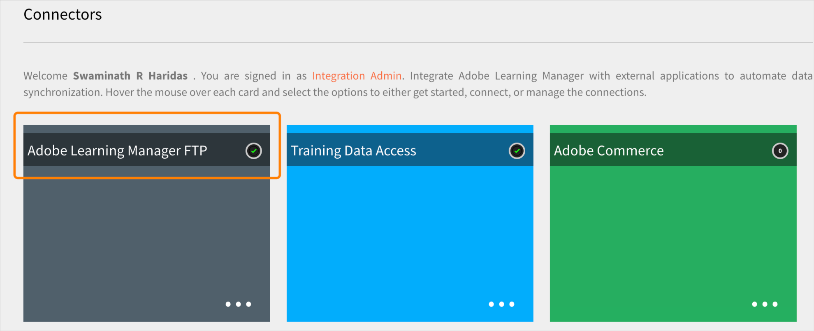
*選取FTP選項*

連線之後，您會看到「連線詳細資訊」頁面。

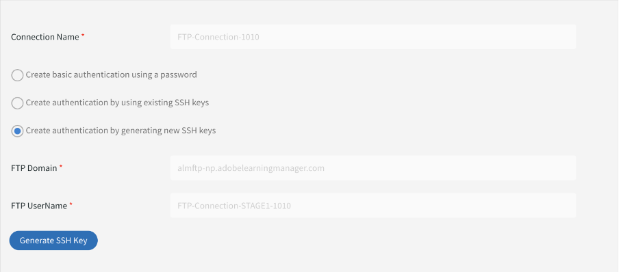
*檢視連線詳細資料頁面*

有三個驗證選項：

### 透過產生新的SSH金鑰建立驗證

如果您想在系統中產生SSH金鑰，可以先產生。 按一下「產生SSH金鑰」。

私密金鑰會下載到您的電腦，而公開金鑰會儲存在我們的服務中。 在您按一下「連線」後，會使用公開和私密金鑰建立FTP使用者作為驗證。

您已建立FTP連線。

### 使用現有SSH金鑰建立驗證

如果您已有SSH金鑰，請在&#x200B;**[!UICONTROL FTP Public Key]**&#x200B;欄位中貼上公開金鑰，然後按一下[連線]。

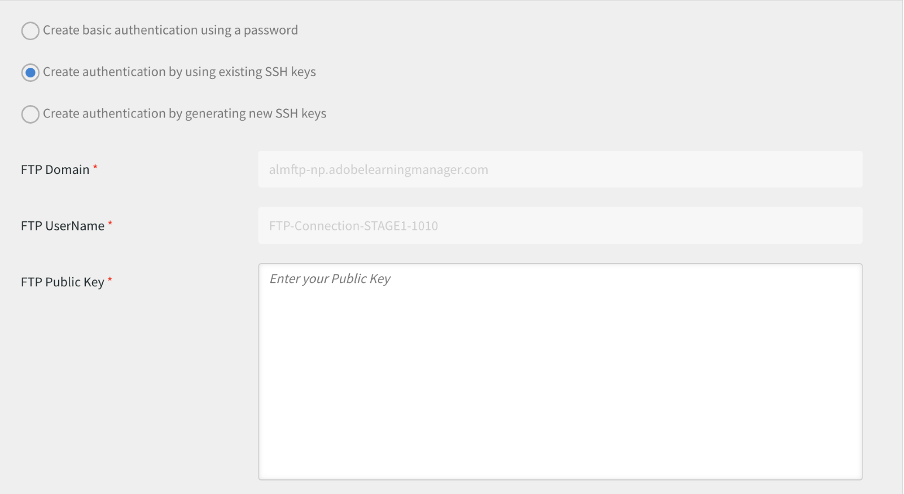
*貼上金鑰*

### 使用密碼建立基本驗證

這是基本的驗證機制。 選取第一個選項&#x200B;**[!UICONTROL Create basic authentication using a password]**。 輸入密碼，然後按一下&#x200B;**[!UICONTROL Connect]**。

這會建立連線。

## 下一步

### 設定FTP使用者端

使用已下載的金鑰或現有的金鑰或密碼，在FTP使用者端上設定連線（在前一節中建議）。

### 範例測試匯出

* 在FTP使用者端中，將ExaVault FTP的位置變更為新的FTP位置。 新網域為`http://almftp.adobelearningmanager.com/`。
* 您也必須將IP `18.195.107.67`加入白名單。
* 驗證後，您必須使用外部FTP使用者端或自動化指令碼，上傳一些範例檔案到新的FTP位置或從新FTP位置下載一些範例檔案。
* 您必須將資料從舊位置傳輸至新位置。
* 聯結器的資料保留原則維持不變。 除了官方原則以外，ExaVault也支援一些資料保留原則。 新聯結器將無法使用這類資料保留原則。 檢查您的聯結器是否使用官方支援原則以外的任何資料保留。

### 移轉專案有何變化

| 狀態 | 建議 |
|---|---|
| 新移轉 | 您無法從舊的FTP開始新的移轉。 新移轉必須使用新FTP。 如需此專案的更多支援，請聯絡客戶成功團隊。 |
| 移轉進行中 | 建立衝刺：您可以繼續使用舊的FTP，但建議您使用新的FTP。 如有任何現有的衝刺無法轉移，請聯絡客戶成功團隊。 |
| 已關閉的移轉 | 無動作。 |

## 使用Filezilla FTP使用者端連線至Adobe Learning Manager

1. 連線至新的ALM FTP聯結器。 按一下「連線」。

   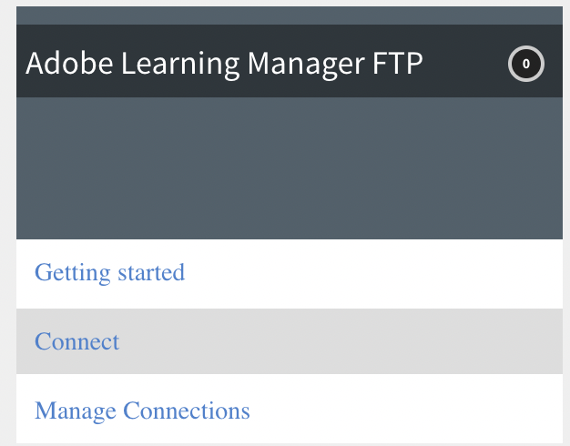
   *連線到新的ALM FTP聯結器*

1. 若要透過基本密碼驗證連線，請輸入網域名稱、FTP使用者名稱，並設定符合密碼驗證條件的密碼。 按一下「連線」。 新的FTP連線將會建立，並可透過任何SFTP使用者端存取。

   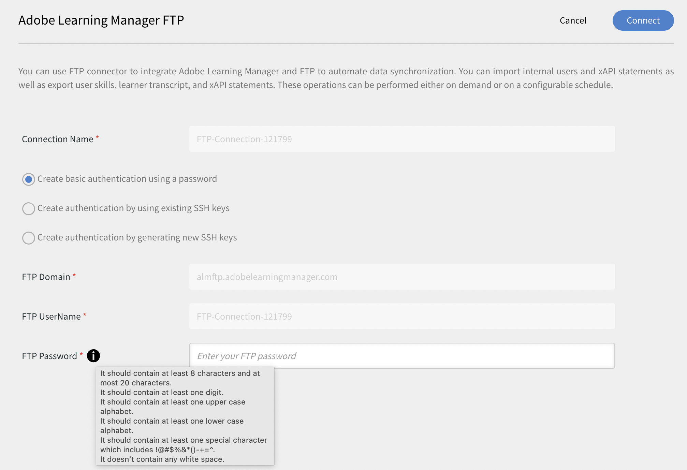
   *透過基本驗證透過密碼*

1. 安裝任何SFTP使用者端，例如File Zilla。 啟動「檔案Zilla」，然後按一下左上角的「開啟網站管理員」 。

   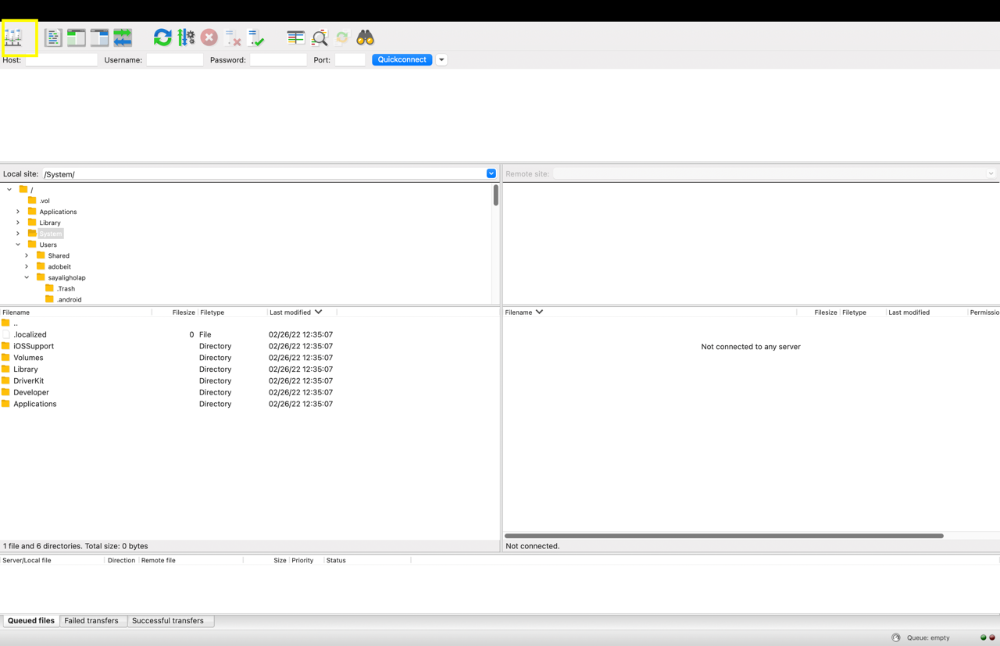
   *透過SFTP使用者端連線*

1. 按一下&#x200B;**[!UICONTROL New site]**&#x200B;以建立新網站。 視需要重新命名網站。

   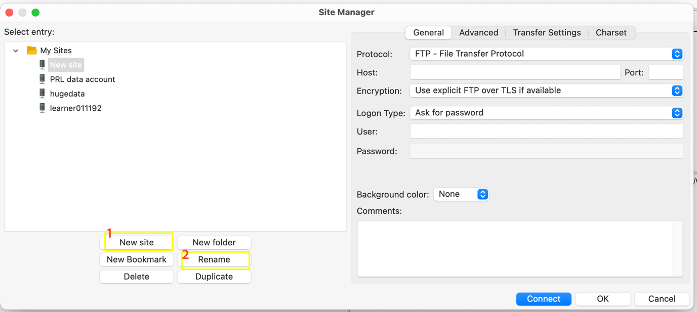
   *建立網站*

1. 從「聯結器證明資料」頁面對應詳細資訊。

   * 選取通訊協定作為「SFTP - SSH檔案傳輸通訊協定」
   * 以FTP網域形式代管
   * 登入型別為[要求密碼]
   * 使用者作為FTP使用者名稱

1. 按一下「連線」。

   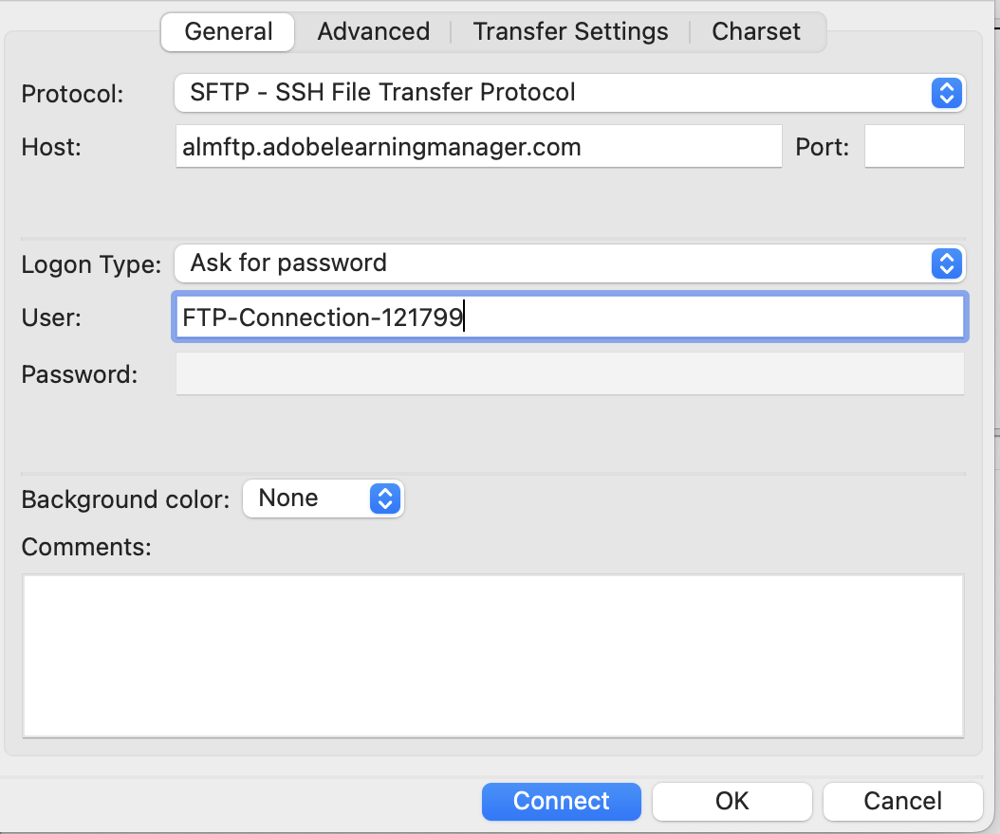
   *輸入認證*

   >[!NOTE]
   >
   >在「檔案Zilla」使用者端中執行此步驟。

1. 輸入密碼。

   （選擇性）選取「記住密碼」核取方塊以記住密碼。

   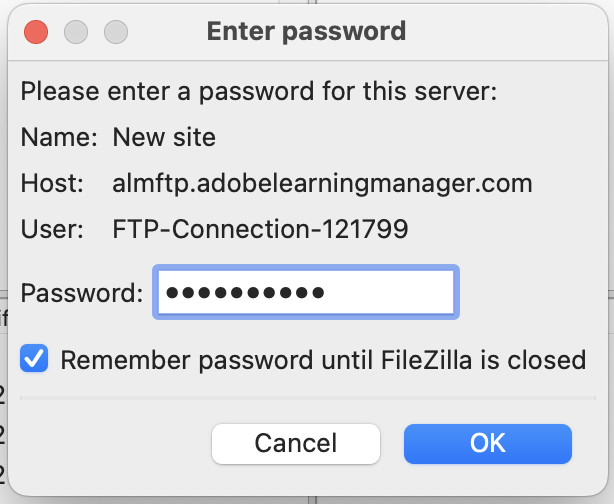
   *輸入密碼*

   （選擇性）選取&#x200B;**[!UICONTROL Always trust this host]**&#x200B;核取方塊以信任主機。

1. 按一下「確定」。

   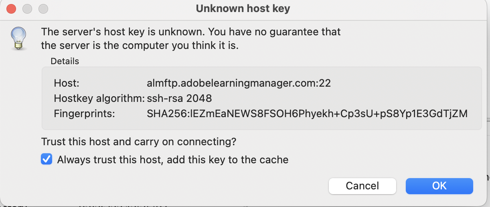
   *主機金鑰*

1. 檢查頂端的連線狀態和進度。

   左半是本機站台，右半是遠端站台。

   若要將檔案從本機移至遠端，反之亦然：

   * 您可以拖放檔案。
   * 按兩下檔案。

   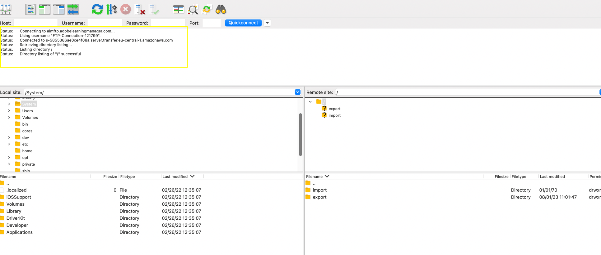
   *檢查連線狀態*

您隨時可以變更和更新驗證型別。

其他驗證方式是透過SSH金鑰：

將公開金鑰貼入文字方塊以使用現有的SSH金鑰。 按一下「連線/儲存」。

若要產生新的SSH金鑰，請按一下&#39;**[!UICONTROL Generate SSH Key]**&#39;按鈕。 將會下載私密金鑰。 按一下&#x200B;**[!UICONTROL Connect/Save]**。

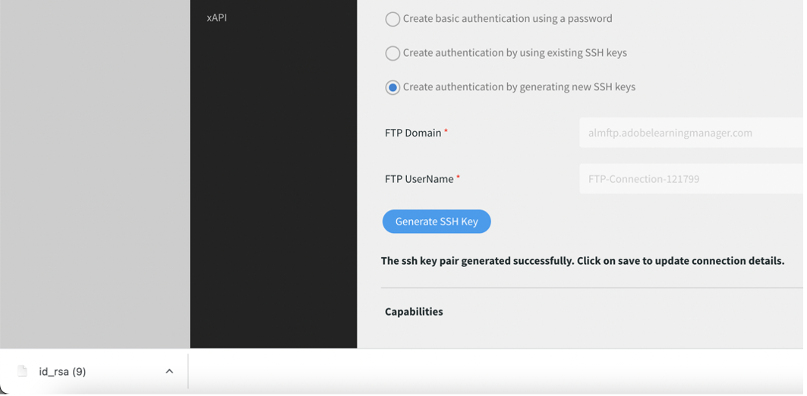
*產生SSH金鑰*

對應詳細資料。 選取登入型別作為金鑰檔。 選取私密金鑰檔案。

按一下&#x200B;**[!UICONTROL Connect]**。

## 淘汰ExaVault後會發生什麼事

棄用ExaVault後，所有進行中的現有移轉專案都會轉換為新的FTP作為來源位置。 接著，您必須設定新的FTP聯結器，並繼續移轉程式。

## Recommendations可移轉短跑

建立移轉專案時，Adobe建議您使用新的AWS SFTP聯結器建立專案，以避免在稍後階段從Exavault移轉至AWS。

如果正在進行移轉，請關閉目前使用Exavault作為資料來源的衝刺。 建立AWS SFTP連線、測試設定，然後聯絡客戶成功團隊以切換至新的AWS SFTP資料來源。 切換後，在相同移轉專案中建立新的衝刺。 衝刺資料夾會建立在新位置，您可以上傳移轉CSV以繼續活動。

**移轉專案無法關閉的情況**

* 課程ID對應是在從外部舊式系統移轉至Adobe Learning Manager的課程的目前專案中完成。 若要更新相同專案中的相同課程，您只能這麼做。 關閉專案後，您就無法修改其詳細資訊。
* 針對以API為基礎的移轉專案，您不得關閉專案。