# 從 Adobe FTP Manager 轉換

Adobe Learning Manager 支援使用 AWS Transfer 家族 SFTP 協定的新連接器。

你可以用 Adobe FTP Manager 取代任何開源 FTP 用戶端。

以下是[&#128279;](https://docs.aws.amazon.com/transfer/latest/userguide/transfer-file.html)部分 AWS 推薦的 FTP 用戶端：

* FileZilla（Windows、macOS 及 Linux）
* OpenSSH（macOS 與 Linux）- 注意：此用戶端僅支援啟用安全殼層（SSH）檔案傳輸協定（SFTP）的伺服器。
* WinSCP（僅限 Microsoft Windows）
* Cyberduck（Windows、macOS 及 Linux）

## 設定基於 AWS 的 FTP 連接器

您必須在整合管理頁面上設定新的基於 AWS 的 FTP 連接器。

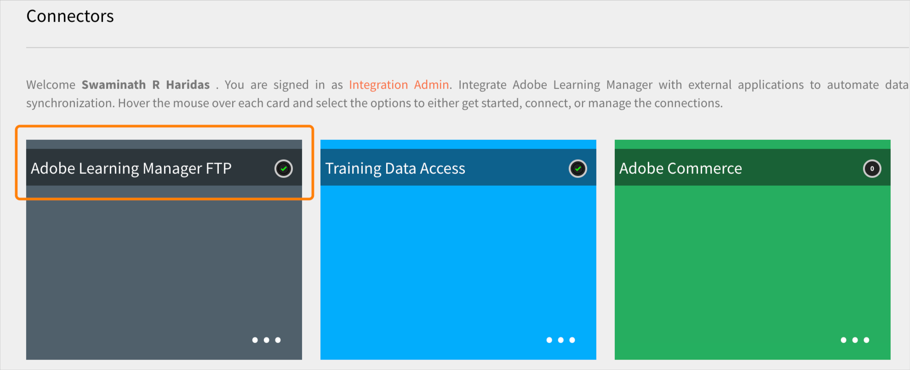
*選擇 FTP 選項*

一旦你連接，就能看到連線詳情頁面。

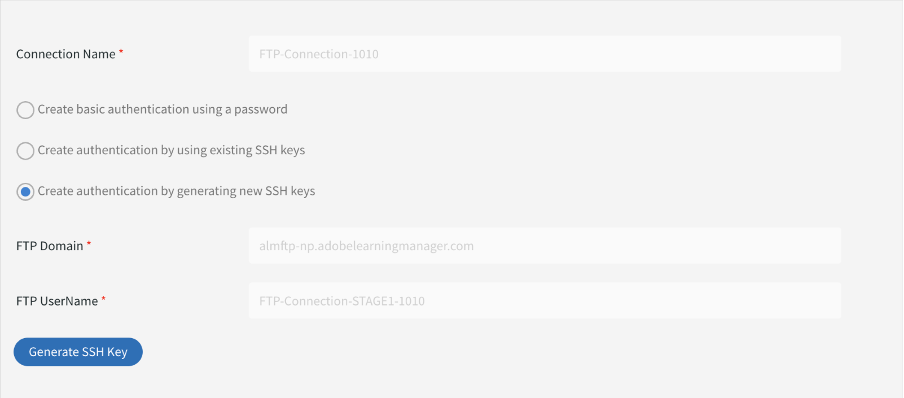
*查看轉機詳情頁面*

有三種認證選項：

### 透過產生新的 SSH 金鑰來建立認證

如果你想在系統本身產生 SSH 金鑰，也可以這麼做。 點擊產生 SSH 金鑰。

私鑰會下載到你的電腦，而公鑰則會儲存在我們的服務中。 點擊 Connect，FTP 使用者會以公鑰和私鑰作為認證建立。

你已經建立了 FTP 連線。

### 利用現有的 SSH 金鑰建立認證

如果你已經有 SSH 金鑰，請將公鑰貼上到 **[!UICONTROL FTP Public Key]** 欄位，然後點選 Connect。

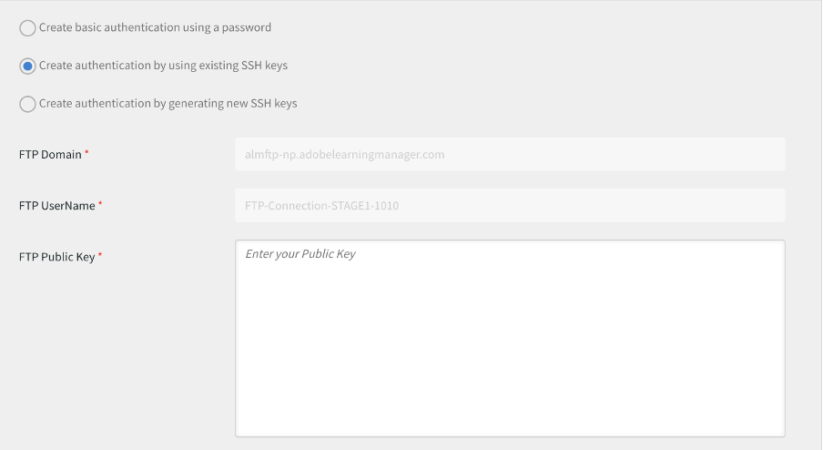
*貼上鑰匙*

### 使用密碼建立基本認證

這是基本的認證機制。 選擇第一個選項。 **[!UICONTROL Create basic authentication using a password]**&#x200B;輸入密碼後點選 **[!UICONTROL Connect]**。

這會產生連結。

## 接下來的計畫

### 設定 FTP 用戶端

用 FTP 用戶端（前面提到的推薦）設定連線，使用已下載的金鑰或現有的金鑰或密碼。

### 樣本測試匯出

* 在你的 FTP 用戶端中，將 ExaVault FTP 的位置改成新的 FTP 位置。 新的領域是 `http://almftp.adobelearningmanager.com/`。
* 你也必須將 IP 加入白名單。 `18.195.107.67`
* 認證完成後，您必須透過外部 FTP 用戶端或自動化腳本，將幾個範例檔案上傳並下載到新的 FTP 位置。
* 你必須將資料從舊位置轉移到新地點。
* 連接器的資料保留政策保持不變。 ExaVault 除了官方政策外，也支援部分資料保留政策。 此類資料保留政策將不適用於新連接器。 檢查你的連接器是否使用除了官方支援政策之外的資料保留。

### 遷移專案的後續發展

| 現況 | 推薦 |
|---|---|
| 新遷徙 | 你無法從舊 FTP 開始新的遷移。 你必須使用新的 FTP 來進行新的遷移。 如需更多支援，請聯繫客戶成功團隊。 |
| 正在進行的遷徙 | 建立衝刺：你可以繼續使用舊的 FTP，但我們建議改用新的 FTP。 如需任何無法調整的衝刺，請聯絡客戶成功團隊。 |
| 封閉遷移 | 沒有行動。 |

## 使用 Filezilla FTP 用戶端連接 Adobe Learning Manager

1. 連接到新的 ALM FTP 連接器。 點擊「連結」。

   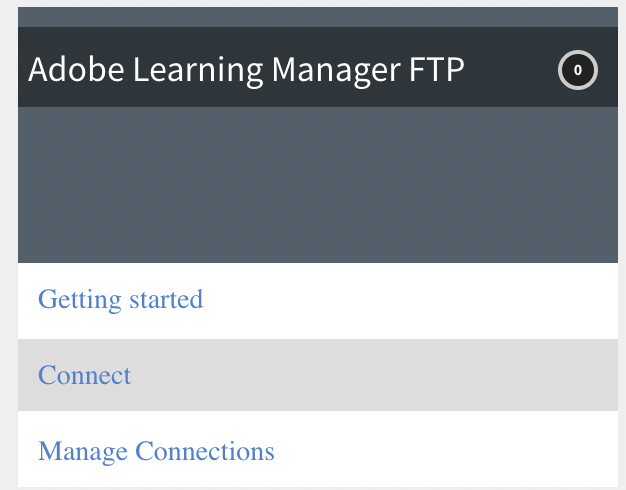
   *連接新的 ALM FTP 連接器*

1. 若要透過密碼進行基本驗證連線，請輸入網域名稱、FTP 使用者名稱，並設定符合密碼驗證標準的密碼。 點擊「連結」。 新的 FTP 連線將會建立，並可透過任何 SFTP 用戶端存取。

   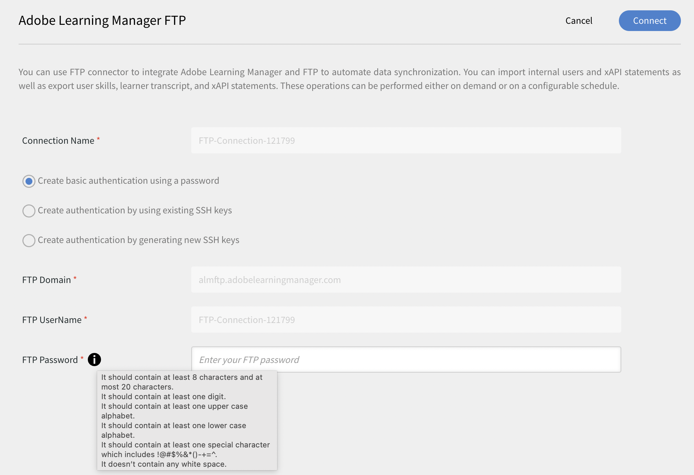
   *透過密碼基本認證*

1. 安裝任何 SFTP 用戶端，例如 File Zilla。 啟動 Zilla 檔案，然後點選左上角的「開啟網站管理員」。

   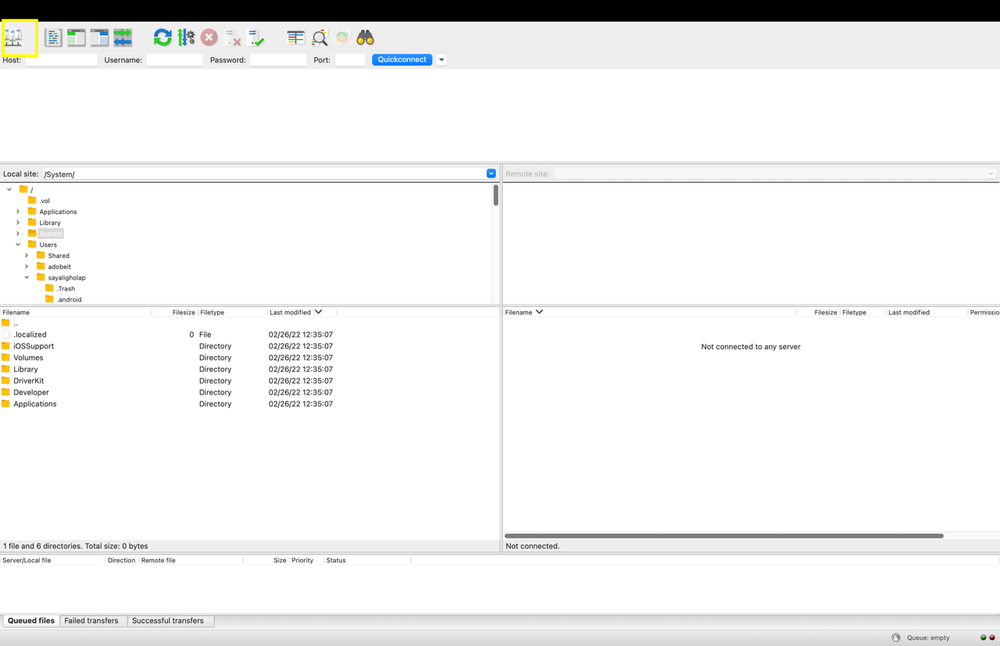
   *透過SFTP的連結*

1. 點擊 **[!UICONTROL New site]** 建立新網站。 視需要重新命名網站。

   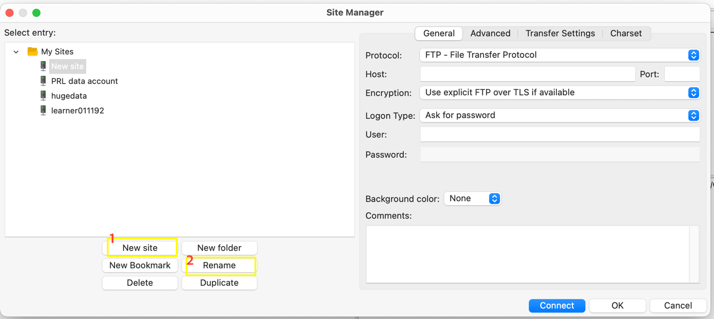
   *建立一個網站*

1. 從連接器憑證頁面繪製詳細資訊。

   * 選擇協定為「SFTP - SSH 檔案傳輸協定」
   * Host 作為 FTP 網域
   * 登入時輸入「詢問密碼」
   * 使用者作為 FTP 使用者名稱

1. 點擊「連結」。

   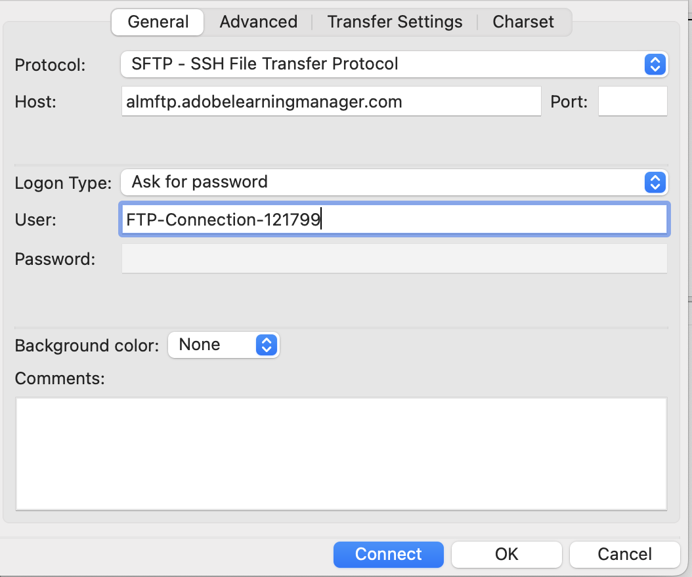
   *輸入憑證*

   >[!NOTE]
   >
   >在 File Zilla 用戶端執行此步驟。

1. 輸入密碼。

   （可選）選擇「記住密碼」勾選框以記住密碼。

   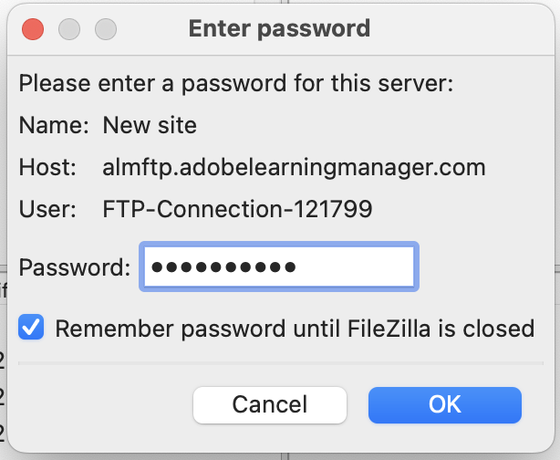
   *輸入密碼*

   （可選）選擇 **[!UICONTROL Always trust this host]** 勾選方塊以信任主機。

1. 點擊確定。

   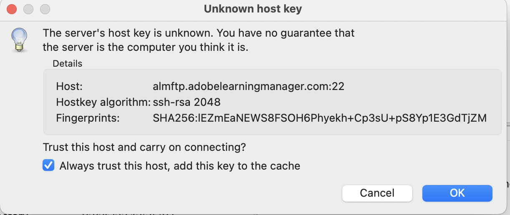
   *主機金鑰*

1. 請檢查連線的狀態與進度。

   左半部是本地站點，右半部是遠端站點。

   要將檔案從本地轉移到遠端，反之亦然：

   * 你可以拖放檔案。
   * 雙擊該檔案。

   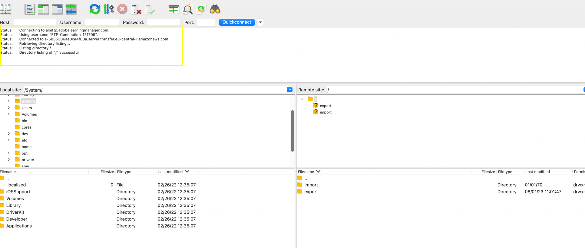
   *檢查連線狀態*

你隨時都可以更改或更新認證類型。

其他認證方式包括使用 SSH 金鑰：

把公鑰貼到文字框裡，使用現有的 SSH 金鑰。 點擊連接/儲存。

要產生新的 SSH 金鑰，請點擊「**[!UICONTROL Generate SSH Key]**」按鈕。 私鑰會被下載。 點擊 **[!UICONTROL Connect/Save]**。

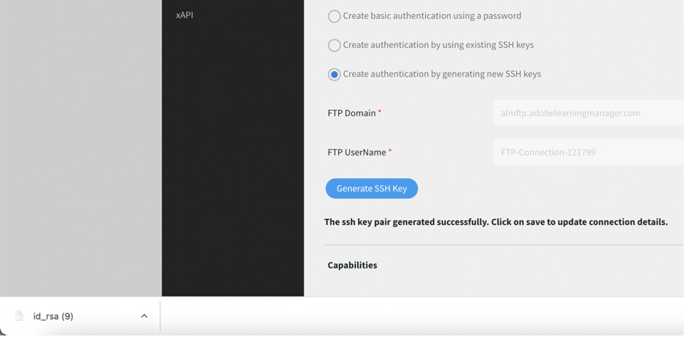
*產生 SSH 金鑰*

繪製細節圖。 選擇登入類型為金鑰檔案。 選擇私鑰檔案。

點擊 **[!UICONTROL Connect]**。

## ExaVault 被棄用後會發生什麼事

ExaVault 棄用後，所有正在進行中的現有遷移專案將轉移到新的 FTP 作為來源地點。 接著您必須設定新的 FTP 連接器並繼續遷移程序。

## 遷移衝刺的建議

在建立遷移專案時，Adobe 建議你使用新的 AWS SFTP 連接器來建立專案，以避免後期從 Exavault 遷移到 AWS 的衝刺。

如果正在遷移，關閉目前使用 Exavault 作為資料來源的衝刺。 建立 AWS SFTP 連線，測試設定，並聯絡客戶成功團隊切換到新的 AWS SFTP 資料來源。 切換後，在同一遷移專案中建立新的衝刺。 衝刺資料夾會在新位置建立，你可以上傳遷移 CSV 檔以繼續活動。

**遷移專案無法結束的情況**

* 目前專案中針對從外部舊有系統遷移到 Adobe Learning Manager 的課程，進行課程 ID 映射。 只有當你想更新同一專案的相同課程時，才能這麼做。 一旦你關閉專案，就無法修改其細節。
* 對於基於 API 的遷移專案，你必須關閉專案。
