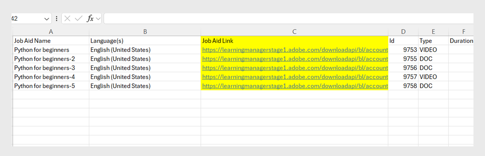
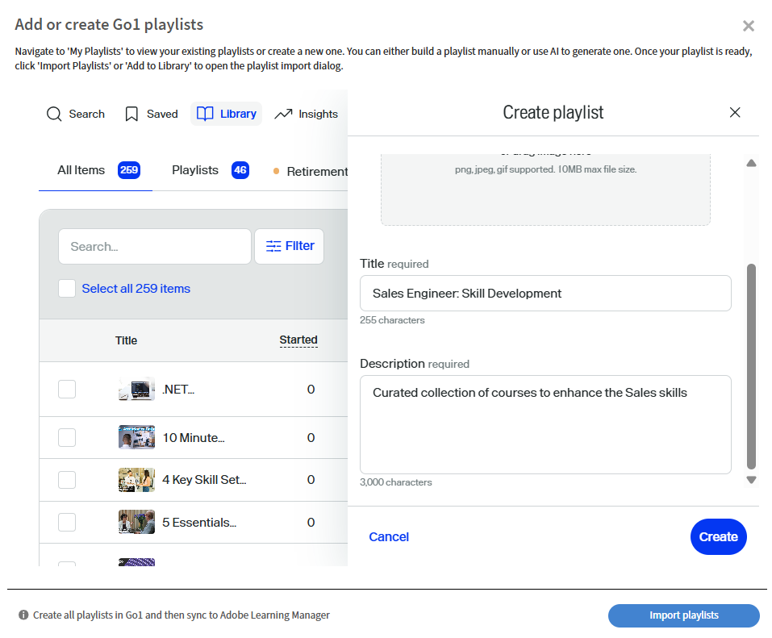

# Adobe Learning Manager近期變更

<!-- >>[!IMPORTANT]
>
>The Adobe Learning Manager October 2025 release is now live. View [What's New](/help/migrated/whats-new.md) for more information on the latest features and enhancements. This page will be updated with the new features and enhancements for the next release. Stay tuned for more updates. -->

## 版本總覽

2026年4月發行的Adobe Learning Manager引進了廣泛的改良功能，讓學習者能更順暢地學習、管理員能更輕鬆管理，以及講師能更靈活地學習，包括在Fluidic Player中更清楚的導覽（配備「下一模組」標籤和專用的「退出」按鈕）、支援多個並行Zoom工作階段，讓團隊能執行平行虛擬課程而不需要手動設定，以及在同儕帳戶中顯示真實作者而非「外部作者」，讓共用課程的可見度更高。 此更新也會顯示學習者API中的學習物件到期日，以協助LXP強調時效性訓練、為工作輔助新增多語言支援，以便一個工作輔助可以承載所有語言版本，並讓管理員透過定義對同類群組或定時程式有用的開始/結束視窗，來限制何時可以開始模組。

使用LTI的外部系統現在可以自動設定播放器語言，為學習者提供跨平台一致的語言體驗。 也有數個檢查清單升級送達，包括加權分數、多語言問題文字，以及提供更豐富意見回饋的可選稽核者評論。 ALM現在會擷取在SCORM內容內控制的多個測驗嘗試，並在L2報告中以簡潔的方式報告每個嘗試。 講師也可以自行產生QR碼，以便在面對面授課期間進行即時註冊和出勤追蹤，而Captivate內容則透過統一的目錄、投影片層級的完成勾選以及可靠的筆記匯出，以更簡潔的方式播放。 整體而言，此版本的重點在於清晰度、一致性、多語言整備、管理員效率，以及更彈性的培訓交付。

## 流體播放器導覽 — 顯示下一個模組的名稱

### 概觀

此增強功能已包含在2025年11月發行的Adobe Learning Manager中。

播放器中的「下一個」動作會透過顯示下一個模組或課程的名稱，以及當學習者即將退出播放器時發出的明確訊號，來指出按一下後會發生什麼情況。

### 新增功能

播放器&#x200B;**中的{ModuleName}「下一個模組：**」標籤

流體播放器中的下一個圖示現在會顯示課程中下一個模組的名稱。 例如，下一個模組：第2課 — 快速入門。

這適用於同一課程中學習者從一個模組移至下一個模組的任何時間。

**清除最後一個模組的退出動作**

當學習者位於課程的最後一個模組時，會出現一個新的「退出」動作按鈕，指出按一下該按鈕將會關閉播放器，並傳回課程內容。

**行動和PDF內容的回應式行為**

在較小的檢視區（例如，~320畫素寬度），下一個標籤可能會縮短或隱藏（只顯示圖示），以避免與PDF控制項重疊。

針對PDF模組，播放器會將控制項調整為個別行，使導覽標籤和PDF控制項不會互相干擾。

**已更新管理員>品牌>播放器預覽**

「管理員>品牌」中的播放器預覽現在會反映新標籤，例如下一個模組：第2課。 這可讓管理員檢視更新的導覽行為。

### 主要優點

學習者的&#x200B;**更清楚的導覽**

學習者不必再猜測選擇「下一步」後會發生什麼情況。 標籤會清楚指定後續內容，無論是模組或課程。 這種模糊性的減少有助於緩解猶豫和困惑，尤其是在許多學習者可能不熟悉LMS介面的大型客戶教育受眾中。

**較高的課程完成率**

清楚說明下一個步驟（下一個模組： {ModuleName}）並為最後一個模組新增不同的退出動作，可降低學習者放棄課程或忽略最後一個完成步驟的可能性。

**跨裝置的更可預測的使用者體驗**

更新的標籤會與案頭、平板電腦和行動裝置上的下一個或上一個行為及圖示對齊。 配置限制會在裝置和PDF流程之間執行，讓控制項保持可用並可供存取。

這對於將Fluidic Player內嵌在自訂學習體驗中的Headless實施尤其重要。

### 使用案例

**客戶與合作夥伴教育入口網站(Headless或AEM整合式)**

在完整Headless設定中使用Adobe Learning Manager的帳戶，引導來自外部行銷管道的學習者。 這些學習者：

* 經常以長序列使用視訊內容。

* 系統可清楚指出下一個集數/模組，提供課程式體驗。

在這些環境中，**下一個模組：{ModuleName}**&#x200B;標籤：

* 強化歷程的引導性質。

* 將模組之間的流失降至最低。

**包含已訂購模組的規範與認證課程**

在法規或法規要求嚴格的案例中：

* 學習者必須完成一系列嚴格的模組。

* 作者通常會停用TOC以避免跳過。

顯示&#x200B;**下一個模組：{ModuleName}**：

* 向學習者確認他們遵循正確的順序。

* 降低錯誤解讀下一個動作及提早結束的可能性。

**課程彼此跟隨的學習路徑**

其中學習路徑或同等專案會連結多個課程。 在為大型受眾建置課程式序列時，這會很有用。

**行動優先耗用**

主要使用手機或平板電腦的學習者：

* 更新標籤和回應式行為，確保無需依賴小型關閉圖示或隱藏控制項，即可持續瞭解導覽。

* 這對於客戶教育、臨時工或一線學習者非常重要，他們可能會在行動裝置上的短時間研討會中存取內容。

## 縮放聯結器 — 建立多個同時縮放工作階段

### 概觀

即將升級的Zoom Connector將大幅提升Adobe Learning Manager管理虛擬講師引導式培訓(VILT)的方式。 之前，使用者一次只能建立一個縮放工作階段。 透過新的更新，管理員和作者可以使用標準整合約時排程多個縮放工作階段。

### 新增功能

#### 透過聯結器支援多個同時縮放工作階段

* Zoom Connector現在允許從ALM建立多個在相同日期/時間的VILT工作階段。

* 排程邏輯不再在帳戶/聯結器層級強制執行「一次一個Zoom會議」限制。

* 管理員和作者可以設定重疊的VILT課程（例如，地區教室、平行曲目，或不同合作夥伴群組的重複課程），而不需要因應措施。

#### 會議是使用講師的Zoom身分建立（不是Zoom超級管理員）

為了安全地支援並行會議，已更新聯結器，以便：

* 縮放會議現在是使用講師的電子郵件地址來建立，而不是使用Zoom超級管理員電子郵件。

* 每個講師的Zoom帳戶都可以與其他講師同時主持自己的會議，但須受限於現有Zoom計畫的限制。

**附註**：

* 每個會議僅支援一位講師。

* 如果稍後在Adobe Learning Manager中更新了講師的電子郵件，現有的會議仍會與建立時使用的原始電子郵件相關聯。

#### 不再需要手動為並行工作階段貼上縮放URL

先前，當第二個或第三個縮放工作階段必須同時執行時：

* 作者必須在ALM外部手動建立Zoom會議，然後將該Zoom聯結URL貼到課程執行個體設定中。

* 這很容易發生錯誤，且無法從出席追蹤等聯結器功能中獲益。

使用更新的聯結器：

* 所有工作階段都可以使用Zoom Connector直接從ALM UI建立，即使它們在時間上重疊。

* 透過整合，繼續集中管理工作階段生命週期（建立/取消）。

### 主要優點

#### 更大規模的VILT排程

組織現在可以：

* 同時執行多個縮放式虛擬教室（例如，在虛擬高峰會上的平行追蹤、區域同類群組或個別的合作夥伴訓練課程）。

* 避免先前強制管理員序列化工作階段或依賴手動縮放管理的瓶頸。

#### 減少管理員和作者額外負荷

此增強功能可消除：

* 在Adobe Learning Manager外部手動建立Zoom會議。

* 針對重疊的工作階段，將縮放URL複製並貼到每個課程例項中。

* 連結設定錯誤、附加了錯誤的會議，或錯過出席追蹤的風險。

管理員和作者可以使用熟悉的工作流程，從Adobe Learning Manager管理所有縮放工作階段。

#### 與縮放布建和講師角色更協調

將會議連結至個別講師Zoom帳戶：

* 每位講師皆可在自己的Zoom授許可權制內操作。

* 組織可以使用其現有的縮放布建模式（每個培訓師、每個BU等各一個帳戶），同時仍可與Adobe Learning Manager完全整合。

* 這可避免針對所有工作階段使用共用超級管理員縮放使用者的單點瓶頸。

### 使用案例

#### 多軌虛擬活動和高峰

執行大型活動（例如產品訓練營、合作夥伴峰會或認證周）的客戶教育團隊可以：

* 在相同的時段內設定多個縮放式工作階段（針對不同的曲目或主題）。

* 在Adobe Learning Manager的課程和學習路徑下，以VILT模組形式管理所有課程。

* 當聯結器處理所有建立基礎的Zoom會議時，為學習者提供統一的體驗。

#### 全球合作夥伴與客戶訓練

跨地區培訓客戶和合作夥伴的組織可以：

* 在重疊的時間為EMEA、APAC和美洲執行個別的縮放工作階段，以符合當地的工作時間。

* 避免強制使用單一全域時段，或手動設定其他同類群組的縮放。

#### 內部啟用

內部啟用團隊（銷售、支援等）可以：

* 在ALM中安排平行上線研討會或角色型分組（例如，為開發人員、管理員和商務利害關係人安排個別的Zoom室）。

* 將所有工作階段保留在ALM的VILT模型內，以供報告和法規遵循之用，而不是部分轉換為非受管理的Zoom會議。

## 顯示同級帳戶中共用課程的原始作者

### 概觀

當透過目錄將課程分享至配對帳戶時，Adobe Learning Manager目前會在接收帳戶的學習者、管理員和作者檢視中，將作者標示為「外部作者」。 這可能會對學習者和管理員造成挑戰，尤其是在大型企業，因為當出現問題或問題時，很難識別和聯絡適當的內容所有者。

此增強功能可確保為同級帳戶中的共用課程保留及顯示作者資訊，而非由一般預留位置取代。

### 新增功能

顯示對等帳戶中共用課程的實際作者名稱

對於透過外部或同級目錄共用的課程，來源帳戶的原始作者名稱現在會顯示在接收帳戶中，而不是「外部作者」。

這適用於：

* 學習者應用程式（課程卡或課程詳細資料）。

* 管理員和作者在作為學習者預覽時檢視。

### 主要優點

#### 共用內容的直接所有者可見性

同級帳戶中的學習者和管理員現在可以：

* 檢視課程原創者，即使課程是透過共用目錄取得。

* 避免使用一般且沒有幫助的「外部作者」標籤。

#### 更一致的多租使用者和對等帳戶體驗

對於執行多租使用者或擴充企業情境的客戶：

* 會出現相同的課程，且各個帳戶中的作者品牌保持一致。

* 學習者體驗與主要帳戶的期望一致（例如，看到「Cloud Academy團隊」而不是「外部作者」）。

### 使用案例

#### 具有對等帳戶的大型企業

企業使用ALM時搭配使用：

* 擁有標準課程的主要帳戶，以及

* 透過共用目錄取得內容的對等帳戶。

同級帳戶的學習者需要知道哪個企業團隊已撰寫課程以正確提出問題或改善建議。

透過此增強功能：

* 共用的課程現在會在對等帳戶中顯示正確的企業作者名稱。

* 由於學習者和本機管理員知道要聯絡誰，因此企業的內部支援負載會降低。

#### 內部多BU共用

其中一個業務單位組織其他單位的學習：

* 可以在所有消費帳戶的作者欄位中識別擁有的BU。

* 本機L&amp;D管理員可快速檢視課程是由本機維護或由其他BU維護，並據此進行合作。

## 在學習者API中公開學習物件到期日（自動淘汰）日期

### 概觀

此增強功能直接透過Adobe Learning Manager的面向學習者的API，提供學習物件(LO)的自動淘汰日期。 當課程、學習路徑或認證設定到期或自動淘汰日期時，該資訊現在成為關鍵學習者端點傳回的學習對象資料的一部分。

### 新增功能

#### 學習者LO API中的新到期/自動淘汰欄位

* 學習者LO API （例如將學習物件傳回學習者體驗和外部平台的端點）現在包含LO到期日（為該學習物件設定的自動淘汰日期）。

* 此欄位會作為回應中的LO實體的一部分傳回，例如：

   * 取得學習物件（學習對象詳細資訊）。

   * 用於填入學習者首頁、目錄和搜尋結果的學習對象資料。

* 此欄位會補充執行處理層級中已存在的現有completionDeadline；新欄位專為LO層級的自動處分日期。

#### 搜尋支援的學習者體驗中的可用性

由於到期日是作為搜尋支援的LO表示的一部分而公開的，因此ALM或外部平台使用的任何地方現在都可以使用：

* 搜尋API或

* 搜尋導向的目錄和建構學習者檢視的建議。

**範圍和排除專案**

此增強功能僅適用於學習者API。

### 主要優點

#### 自訂LXP中的到期感知學習者體驗

對於大中型企業，他們的自訂LXP現在可以直接從ALM取得LO到期資訊，允許他們：

* 在課程卡片和詳細資訊頁面上顯示「將於{date}到期」或「即將到期」標籤。

* 透過更明確的緊急訊息溝通，讓學習者優先處理即將淘汰的訓練。

這對於規範遵循或有時限的產品訓練特別重要，因為這類訓練會定期更新學習物件，並淘汰舊版。

#### 對學習者進行哪些培訓的更有效指引

藉由公開LO到期日，學習者體驗可以：

* 標示仍然有效的課程與即將淘汰的課程。

* 協助學習者避免參加近期將無法取得或有效的培訓。

#### 與現有完成期限資料的一致性

之前，學習者API已公開執行個體層級completionDeadline，但未公開學習對象層級的自動淘汰日期。 進行此變更後：

訓練的下列方面可供使用：

* 「我必須在何時完成此執行個體？」 （完成期限）。

* 「此培訓何時提供？」 （自動淘汰/到期日）。

### 使用案例

#### 具備嚴格課程生命週期管理的全球企業

定期淘汰和更換課程（例如法規、產品或方法更新）的企業可以：

* 避免學習者混淆培訓是否正在逐步淘汰。

* 推動學習者使用最新的長期方案。

他們的自訂入口網站和內部工具現在可以透過學習者API直接從ALM讀取到期日。

#### 外部客戶或合作夥伴學院

對於客戶和合作夥伴的教育，行銷頁面和入口網站通常強調最新的培訓。

在LO API中具有到期日可讓Experience Builder：

* 隱藏或取消強調接近淘汰的內容。

* 建立「最後完成機會」行銷活動。

## 工作輔助的多語言支援

### 概觀

此增強功能將Adobe Learning Manager的本地化模式延伸至工作輔助，讓作者得以將每種語言的不同內容檔案附加至單一工作輔助。 現在，作者不必針對每種語言分別建立工作輔助，而是可以將所有本地化版本視為一個邏輯工作輔助來管理。

### 新增功能

#### 工作輔助的語言特定內容上傳

作者可依支援的語言將不同的檔案附加至單一工作輔助，例如課程和其他LO。

工作輔助建立/編輯體驗現在支援：

* 選取語言。

* 在同一工作輔助實體內上傳該語言的語言專屬檔案。

#### 播放器和學習者UI中的一致語言處理

已更新Fluidic Player，因此當學習者開啟工作輔助時，將會顯示與學習者語言對應的內容變體（如果可用）。

管理員和作者可以將工作輔助檢視為具有語言變體的單一物件，而不是依語言區分專案。

### 主要優點

#### 適用於所有語言的單一工作輔助

作者可避免針對每種語言分別建立工作輔助。

相同工作輔助的所有語言變體(例如程式、SOP、檢查清單PDF或參考指南)都可以在一個位置管理。

#### 為全球學習者提供更好的體驗

學習者會自動依照其偏好語言看到工作輔助，這表示：

* 減少開啟哪個版本的混淆。

* 存取超出地區設定或過時的副本的風險較低。

在多語言組織中，當相同的程式或產品檔案必須以多種語言提供時，這項功能特別有用。

### 使用案例

#### 參考內容在全域推出

企業需要為全球學習者提供數種語言的工作輔助，例如：

* 產品參考表。

* 處理檢查清單。

* 支援教戰手冊

他們可建立一個工作輔助，附加每種語言的本地化檔案，以及讓ALM根據語言設定為每位學習者提供正確版本，而不是建立個別的工作輔助，例如「產品快速入門 — EN」、「產品快速入門 — DE」、「產品快速入門 — JP」等。

#### 適用於多個市場的客戶或合作夥伴檔案

若為客戶和合作夥伴學院，工作輔助可能包括：

* 產品速查表

* 整合指南

* 支援工作流程

使用多語言工作輔助：

* 每個合作夥伴都能看到當地語系化版本，不必在語言特定專案之間選擇。

* 行銷與啟用團隊可以在所有地區設定中管理每個主題的一個工作輔助。

## 限制模組可以啟動的時間

### 概觀

此增強功能可讓Adobe Learning Manager中的作者和管理員定義允許學習者啟動模組的時間範圍。 在已設定的開始/結束視窗外，模組仍會顯示在課程結構中，但學習者無法將其啟動。

對於需要更嚴格控制特定內容何時可用或應停止啟動（例如在定時程式、同類群組訓練或時效性練習中）的使用者而言，此功能至關重要。

### 新增功能

作者現在可以在課程的模組層級設定開始日期/時間和結束日期/時間，以控管學習者何時可啟動該模組。 在此視窗中，模組會照常運作；在開始時間之前或結束時間之後，學習者可以看到課程大綱中的模組，但無法啟動。

此設定會顯示在課程編寫使用者介面中，作為特定模組型別（例如自學內容、測驗或活動）的額外排程控制項。 管理員可以使用這些控制項來建立分階段開啟的模組，或防止必須在定義的時間範圍內使用內容的程式延遲開始。

#### 主要優點

主要優點在於能夠控制何時可存取模組。 培訓團隊可將模組可用性與真實事件同步化，例如新產品推出、法規截止日期及內部計畫。 這可確保學習者先完成先決條件內容，之後才能存取後續模組。

例如，同類群組1僅可在第2週存取模組2，而模組3將持續鎖定至第3週，無需手動隱藏和取消隱藏內容或建立個別課程版本。

這加強了學習者體驗：學習者不會面對技術上可存取但此時不應存取（或應已完成）的模組，而是會看到課程結構，其中允許他們開始的模組明顯符合預期排程。

#### 使用案例

* **同類群組啟用方案**：在這個方案中，每週都會解除鎖定新的模組。 第1週的內容立即可用，而第2週可見，但直到指定日期才能開始。 第3週遵循相同的閘道程式。 學習者可以看到整個學習路徑，但系統控制他們實際開始每個步驟的時間。

* **有時限的產品或行銷活動訓練**：行銷或產品團隊可能會建立訓練模組，只有在行銷活動作用中或特定版本的產品仍然可用時，才應該存取該模組。 這個指定的開始視窗可確保學習者在指定的結束時間後，不會開始有關已終止產品版本的模組。

* **評量或測驗環境**：組織可以開啟模組（例如測驗），在定義良好的簡短視窗中（例如，「您可在指定日期9:00到12:00之間的任何時間開始測驗」）。 學習者無法在該視窗之外開始考試，該視窗支援跨時區和同類群組公平排程。

## 透過自訂LTI引數控制播放器語言

### 概觀

此增強功能可讓使用LTI （學習工具互通性）的外部平台在啟動時指定Adobe Learning Manager內容的語言。 LTI取用者可以透過自訂LTI引數傳送語言代碼，而不需依賴學習者來變更流體播放器中的語言。 Adobe Learning Manager將使用此程式碼來選取適當的語言變體。

### 新增功能

充當LTI消費者的外部平台現在可以在啟動ALM內容時傳遞自訂語言引數（及相關播放器設定）。 ALM會讀取此引數，並且：

* 相應地設定播放器語言。

* 設定多語言內容時，啟動模組的對應語言變體。

這表示在外部平台上選擇法文的新進學習者，將直接以法文看到ALM播放器和模組啟動，不必調整ALM內的任何內容。

此增強功能也適合外部平台將ALM視為Headless內容播放器的情況。 例如，它可讓您傳送其他自訂引數來調整特定使用者介面設定，以隱藏導覽元素和目錄(TOC)。 這些設定可與語言引數搭配使用，讓外部平台提供流暢的品牌體驗，同時仍利用ALM進行播放和追蹤。

### 主要優點

* **跨系統一致的語言體驗**：當學習者在外部入口網站選取語言時，該選擇會立即反映在ALM中。 這可確保學習者不會在入口網站語言和課程之間遇到任何不符的情況。 因此，他們不必在播放器中搜尋語言切換。

* **語言特定報告**：在其平台中，語言選擇與ALM一致，這提高了其分析和學習者追蹤的準確性。 此對齊方式也支援ALM的語言控制項在流體播放器中針對特定課程有意停用或隱藏的設定。 在這些情況下，外部平台可作為語言的單一信任來源。

### 使用案例

* 一個重要的使用案例涉及使用LTI式整合的大型企業。 學習者會先在平台上註冊及選取語言。 然後他們透過LTI啟動ALM訓練課程。 透過此增強功能，當學習者選取西班牙文時，ALM模組會自動開啟西班牙文。 這表示學習者不需要調整ALM中的語言設定。 此外，以語言為基礎的報告仍會與學習者在ALM中看到的和體驗一致。

* 另一個應用程式是在客戶或合作夥伴入口網站內提供Headless課程體驗。 在此設定中，入口網站可能會使用iframe內嵌ALM內容，而所有導覽和語言使用者體驗(UX)都在ALM之外管理。 透過使用自訂LTI引數，入口網站可確保ALM播放器以正確的語言顯示，並隱藏任何不必要的使用者介面元素（例如目錄和導覽按鈕）。 這可讓學習者感知單一的內聚式應用程式，而非雜亂無章的工具集合。

* 對於使用其他LMS或學習平台進行多種語言大規模培訓的組織來說，這是有益的。 他們可以標準化使用該平台來管理學習者設定檔、選取地區設定和簡報目錄。 同時，ALM也是一個可靠的內容和追蹤引擎，在每次啟動LTI時，都會遵循外部系統指定的語言偏好和使用者互動。

## 講師評估的檢查清單問題權重

### 概觀

此增強功能引進了加權檢查清單，可讓教師和管理人員使用分級標準和總分數來評估學習者，而不是將每個檢查清單問題視為相等。 目標在於透過實作問題的加權評估來促進檢查清單的建立，這允許在單一檢查清單中反映不同動作或技能的相對重要性。

### 新增功能

核取清單將支援以下型別：

1. 是/否
行為與今天相同：每個問題為「是/否」，且通過標準是根據「是」回應的數量而定。

2. 相同權重的問題

   * 問題會以數值刻度來評分（預設為0至10），其中：

      * 刻度上的最大/最小值可在檢查清單層級自訂。

      * 刻度現在可以從0開始（先前的最低分數為1）。

   * 所有問題的分數上限都相同，因此檢查清單會以每個問題的統一評分標準運作。

3. 不同權重的問題

   * 每個問題都有自己的最大分數（權重）。

   * 通過標準取決於學習者在檢查清單中達成的總可能分數百分比(例如「如果學習者達到≥總可用分數的70%則通過」)。

針對所有檢查清單型別：

* **檢閱者** （講師或經理）會根據設定的檢查清單型別評估學習者：

   * 選取是/否。

   * 根據定義的規模選擇分數。

* **檢查清單**&#x200B;報告已更新，針對不同權重的問題包含：

   * 每個問題的最高分數。

   * 每個學習者在該問題中取得的分數。

如此一來，您就可以根據預期的權重，分析整體效能和特定問題的效能。

### 主要優點

* **更豐富、更實際的評估**：教師可以賦予關鍵行為更多點數，而少點至次要行為點，同時仍使用符合觀察或實際任務的檢查清單工作流程，藉此反映真實世界的優先順序。

* **以總分為基礎的通過/失敗**：評估可以依據整體百分比分數，而不只是多少問題通過臨界值，更符合一般能力或評分方案。

* **更好的報告**：更新的檢查清單報告會顯示每個問題的最大分數和已實現的分數，讓方案所有者和品質團隊找出特定的弱點並改善訓練或評估指導。

### 使用案例

* **企業技能評估**：工程師會透過實用的案例檢查清單進行評估，其中某些診斷或通訊步驟必須比裝飾或低風險步驟更重要。 加權問題和總分及格標準讓這些評估對真實世界的效能更具可信度和預測性。

* **安全性和法規遵循觀察**：在醫療保健、製造或外勤服務中，可以給予關鍵安全步驟較高的最高分數，確保遺漏安全關鍵動作對總分的影響比遺漏次要程式步驟大。

* **輔導與校準**：透過報告中每個問題的最高分數與已習得的分數，管理員可以準確地知道學習者表現缺佳的位置，並校準如何一致獲得分數的講師。

## 檢查清單問題的多語言支援

### 概觀

增強功能引進了檢查清單問題的多語言支援，允許稽核者以他們偏好的語言評估檢查清單並進行評分。 此功能在多語言地區及全球部署中特別實用，因為它可讓作者針對每種支援的內容語言建立本地化的檢查清單問題，同時維護單一檢查清單模組及一致的評估流程。

在目前的Adobe Learning Manager中：

* 所有面向學習者的模組(SCORM、PDF、HTML等)均可使用多種內容語言提供，讓學習者可選擇喜歡的語言。

* 在檢查清單單元中，稽核者（指導者/經理）會根據該檢查清單中定義的問題來評估學習者。

### 新增功能

**製作**

* 作者現在可以使用課程層級選取的所有語言來新增檢查清單問題。

* 針對每個檢查清單：

   * 作者應以課程所在的每種內容語言提供對應的問題文字。

   * 作者有責任確保每個問題的意義在不同語言間是一致的。

**檢閱體驗**

* 檢閱者將以其選取的內容語言檢視檢查清單問題和評估UI。

* 以單一語言評估問題時：

   * 所有語言的評估（分數、是/否、狀態）在邏輯上是相同的。 這是包含多種語言檢視的單一檢查清單，而非每種語言個別的核查清單。

**報告**

檢查清單報告將以使用者的內容語言顯示問題文字：

* 以每種語言執行報告的管理員或檢閱者會看到該語言的本地化問題名稱。

* 基礎回應和分數維持不變；只會翻譯問題標籤。

### 主要優點

* **更好的檢閱者體驗**：檢閱者可以完全使用自己的語言，閱讀問題並錄製評估，不會出現語言障礙。

* **法規與政策一致**：在語言平等要求的地區（例如比利時的荷蘭文/法文），檢查清單現在可以符合與其他學習資料相同的標準，降低合規風險。

* **一致的評估邏輯**：雖然文字已本地化，但評估和評分會跨所有語言共用，確保結果具有可比較性和集中管理。

### 使用案例

* 以多種語言運作的多國特許經營可部署單一課程與檢查清單，同時仍提供各地區本地化的稽核者體驗。

* 任何擁有當地講師的全球企業（例如EMEA、LATAM、APAC）都可以讓檢閱者以當地語言工作，同時共用相同的全球檢查清單設計和報告。

## 具有稽核者評論功能的檢查清單

### 概觀

此增強功能引進了檢查清單評估的評論功能，可讓如教師和管理人員等稽核者除提供數值分數外，也能提供質化回饋。 學習者可視需要檢視此意見反應。

其目標是支援以檢查清單為基礎的評估，其中導師意見與數值結果一樣重要。 這包括強調特定優勢、需要改善的領域，或提供指定分數的內容。

現在，稽核者可以：

* 評估每個學習者的檢查清單，依問題進行。

* 檢視結果並重新評估失敗的學習者。

在真實世界中，例如航空，現場培訓師會評估現場代理和機場工作人員。 同樣地，中小型企業(SME)的講師和導師經常使用檢查清單來評估工作績效。 然而，這些核取清單通常不包含用於擷取與評估相關的敘述性意見回饋的結構化區段。

### 新增功能

#### 製作選項

作者可將每個檢查清單設定為：

* 啟用或停用稽核者的註解功能。

* 決定是否應向學習者顯示檢閱者名稱及評論。

這可讓組織根據自己的文化和隱私要求量身打造評論可見度。

#### 檢閱者體驗

啟用註解時：

* 檢閱者（講師/經理）可在評估檢查清單時新增可選註解。

* 他們可以根據檢查清單設定，選擇學習者是否看到註解。

如果他們重新評估學習者，他們可以更新或變更評論以反映最新的評估。

#### 報告和通知

* 「檢查清單」報告取得新的一欄，以取得稽核者註解，擷取評估期間提供的註解。

* 每當進行檢查清單評估時，學習者都會收到通知（平台內和電子郵件）。 這些通知包括：

   * 註解和

   * 檢閱者的名稱（如果已設定為可見）。

這可確保不僅儲存意見回饋，還可主動提供給學習者。

### 主要優點

* **更豐富的、類似教練的意見反應**：數值分數加上內容相關註解，讓檢查清單成為指導的更有效工具，而不只是合規性的工具。

* **可追蹤性和可稽核性**：組織會持續記錄評估對象、時間和內容的人員記錄，這在受監管的環境和重大風險角色中非常重要。

* **更好的學習者參與度**：學習者可獲得與特定評估相關聯的明確指引，這可改善他們對期望和後續步驟的瞭解。

### 使用案例

* 擁有受規管環境的組織可以使用註解來記錄臨床判斷或現場觀察的工作人員的程式性意見反應。

* 航空和地面處理組織可以附加有關營運績效、安全實務和客戶行為的詳細附註，將核對清單變成結構化的彙報工具。

* 在指導和SME評估中，講師可以擷取無法單獨放入分數的微妙觀察，例如「處理好問題上報，但需要改進時間管理」或「出色的疑難排解流程；錯過檔案步驟」。

## 內容層級的多次嘗試與測驗報告

### 概觀

目前，ALM透過多重測驗嘗試(MQA)功能支援LMS層級的多次嘗試：

* 作者可以在課程層級（套用至課程中所有含測驗的模組）或模組層級（每個測驗模組）設定嘗試。

* 嘗試可以是：

   * 特定數字（例如3次嘗試），或

   * 無限嘗試，在LMS層級控制。

* 當學習者透過Fluidic Player使用模組，然後關閉播放器或完成模組時，該工作階段會被視為單一LMS嘗試。

* 每次LMS嘗試都會在L2測驗報表中擷取為新的一列。

但是，如果內容檔案本身（例如「清楚表達SCORM測驗」）實作自己的多次嘗試邏輯，ALM的L2測驗報告目前就無法正確區分或追蹤這些內部嘗試。

此增強功能引進了測驗的內容層級多次嘗試追蹤，允許Adobe Learning Manager在L2測驗報表中準確擷取內容本身的每次嘗試。 它專為內容編寫工具（例如Articulate SCORM）獨立管理測驗嘗試的情況而設計。 有了此功能，ALM報表中就會正確顯示嘗試，而不依賴於LMS層級的多重測驗嘗試(MQA)設定。

### 新增功能

#### 內容層級嘗試的作者標幟

* 將內容上傳至「內容資料庫」時，作者現在可以指出特定內容檔案已內嵌多次嘗試。

* 這是每個內容的設定，可告知ALM將內容內定義的嘗試視為真實來源。

#### 課程/模組行為

當課程中使用這類內容時：

* 模組會從內容衍生其嘗試，而不是從LMS MQA。

* 學習者僅會看到一次LMS層級的嘗試：

   * 課程概述和模組檢視不會公開該模組的LMS「重新嘗試」按鈕。

   * 嘗試處理（例如，在測驗中重試）是由內容本身所控制。

#### 報告

L2測驗報告將會更新，以將每個內容層級的嘗試視為單獨的嘗試列：

* 在內容中設定的每個內部測驗嘗試在L2測驗報告中顯示為它自己的列，就像今天的LMS層級嘗試呈現方式。

* 每一列的格式與L2報告中現有的多次嘗試列相同（相同的欄、結構和語意）。

* 這可提供一致的報告體驗：

   * 無論嘗試是由LMS MQA還是由內容控制，L2測驗報表在每次嘗試時會顯示一列。

#### 主要優點

* SCORM測驗的精確嘗試歷史記錄，其中嘗試是由Articulate之類的工具進行內部控制，而不會強制頂端LMS層級MQA設定。

* 更乾淨的學習者體驗：對於內容控制的嘗試，學習者看到LMS層級的單一時段，而不需要與LMS重新嘗試控制互動；所有重新嘗試都在他們已知道的測驗UI中處理。

* 彈性的架構：使用者可以選擇ALM MQA或內容層級的嘗試是否應該驅動每個模組的行為，這取決於其內容的編寫方式以及他們偏好管理嘗試的方式。

* 一致的報表模型： L2測驗報表的下游消費者可將每一列視為「一次嘗試」，無論嘗試邏輯來自何處。

#### 使用案例

* 使用Articulate SCORM的組織可以在SCORM套件中保留獨立的測驗邏輯，同時在ALM中達成精確的嘗試層級報告，而不需要額外的LMS設定。

* 使用廠商提供的SCORM內容的組織可避免修改或實作其他嘗試，並透過LMS層級MQA重試邏輯。

## 例項註冊和工作階段出席的講師二維碼

### 概觀

此增強功能新增了講師自行產生QR碼的功能：

* 課程執行個體註冊、

* 工作階段出席情況，或

* 註冊+出席總和

在工作階段層級。 專為學習者進入實體或混合式教室而設計，需要快速、自助的選項，以二維碼註冊並記錄其出席情形。

### 新增功能

#### 講師產生的QR碼

* 講師可針對下列專案在工作階段層級產生QR碼：

   * 註冊執行個體：學習者會掃描以註冊包含目前工作階段的執行個體。

   * 標示工作階段出勤率：學習者會在工作階段期間/之後掃描，以記錄該特定工作階段的出勤率。

   * 註冊例項+標籤工作階段出勤率：適用於尚未註冊，且需要以一個步驟標籤出勤率的逐步瞭解的綜合QR。

* 講師可根據情境（註冊、出勤或兩者）匯出所需的QR碼。

#### QR碼封裝

匯出的QR碼PDF將包含：

* 課程名稱

* 執行個體名稱

* 工作階段名稱

這些功能可讓講師和協調員輕鬆找出並列印每個課程的正確QR碼。

### 主要優點

* **講師自主權**：講師不再需要等待管理員建立QR碼。 他們可直接為每個工作階段產生這些變數，提升靈活性並降低協調額外負荷。

* **更好的教室物流**：對於走進教室或現場的對象（例如現場工作人員、現場工作人員或外部與會者），講師可以使用二維碼管理現場的註冊和出勤情況。

* **減少管理員工作量**：管理員團隊可以專注於設定和治理，而不是處理每個工作階段的例行二維碼產生請求。

### 使用案例

* 進行大量現場課程（例如專業人員的產品培訓）的組織可讓講師列印特定課程的QR碼，只要掃描一次即可註冊並標籤出席情況。

* 在零售、製造及醫療訓練中，學習者通常直接從教室參加課程或不需要預先註冊，門口可放置「註冊+出席」二維碼。 這可讓學習者透過手機自助服務註冊與出席率。

* 針對合作夥伴或客戶的培訓活動可讓現場培訓師輕鬆適應室內的變化、其他課程或額外的出席者，而無需諮詢管理員以取得新的二維碼。

## Captivate和ALM播放器改良

### 概觀

此增強功能可改善在Adobe Learning Manager (ALM)播放器播放Adobe Captivate內容的體驗，尤其是最近變更Captivate架構後。 其目的是讓學習者可在ALM中以原生方式與Captivate模組互動，同時確保導覽、完成追蹤和記事過程清晰、一致且可靠。

### 新增功能

#### 統一的目錄體驗

* 只有ALM目錄會顯示在播放器的左側。

* 在ALM中播放模組時，Captivate自己的目錄將會隱藏。

* 這樣可移除重複專案、確保導覽的單一真實來源，並釋放熒幕空間。

#### 視覺化完成回饋

* ALM目錄將顯示綠色刻度標籤（或等同的視覺提示），指示幻燈片層級的完成。

* 當學習者逐步完成Captivate投影片時，ALM目錄會反映哪些投影片已完成，並符合學習者對現代課程玩家的期望。

#### 內容進度控制項

* 播放器控制項將根據幻燈片型別進行調整：

   * 對於視訊投影片：

      * 顯示時間進度列，反映視訊播放。

* 針對非視訊投影片：

   * 顯示幻燈片導覽控制項（下一張/上一張幻燈片等），而非無法運作的時間列。

      * 這可避免在特定幻燈片型別上顯示無關或無效的控制項。

#### 簡化導覽

* 獨立的模組導覽列(ALM)和課程導覽列將合併為單一直覺式列。

* 此統一導覽：

   * 清楚地區分穿過Captivate模組與返回課程/模組層級的過程。

   * 減少重疊目的之多個長條所導致的混淆。

#### 可靠的附註連結

* 附註將連結至幻燈片編號而非時間戳記。

* 此變更：

   * 修正因時間戳記遺失或不正確導致的匯出失敗。

   * 確保註記可以一致地匯出為PDF，並在註記與其所屬的幻燈片前後關聯之間建立可靠的對應。

### 主要優點

* 更乾淨、單一參與者的體驗：學習者只需使用一個目錄和一個導覽模型互動，減少困惑和認知負擔。

* 精確的完成和進度指示：幻燈片層級的勾選和情境式控制有助於學習者瞭解自己在哪裡，還剩下什麼。

* 更強大的筆記記錄和匯出功能：將筆記繫結至投影片而非脆弱的時間戳記，可讓使用者即使使用投影片型PDF內容，也能重新獲得可靠的筆記至Captivate工作流程。

* 保留的作者工作流程：作者保留了Captivate直接發佈至ALM的簡單功能，同時學習者獲得現代、整合的播放體驗，不會增加編寫負擔。

### 使用案例

* 若讓程式依賴Captivate進行互動式模擬，可將內容部署至ALM，確保導覽、完成追蹤和筆記對學習者而言運作一致。

* 使用Captivate作為主要內容製作工具的組織，可維持一鍵式發佈，避免讓學習者混淆雙重目錄和無法運作的控制項。

* 仰賴從ALM中Captivate內容匯出的附註（用於指導、合規性或記錄）的組織可以存取以下內容：

   * 附註正確連結至投影片。

   * PDF會如預期般產生。

## 學習者成績單的變更

### 概觀

Adobe Learning Manager在2026年4月版本中修訂了學習者成績單中學習時間的計算方式。 以前，如果學習者讓播放器開啟而沒有與內容互動，則報告邏輯可能會導致錯誤時間，從而導致差異。 新方法現在會根據使用者參與來追蹤作用中時間，尤其是當索引標籤成為焦點以及使用者活動時。 此變更可產生更準確的資料。

此更新可改善報告和儀表板，幫助管理員更好地確保合規性並追蹤學習者進度。 發佈後，請檢視學習者成績單以檢視這些增強功能。

更新的計算方法聚焦於實際參與，例如作用中標籤焦點及最近的使用者互動，藉此提高下列區域的時間報表準確度：

* 學習者成績單(UI)
* 管理員儀表板量度
* 課程註冊報告
* API和聯結器

### 變更內容

學習者成績單中的&#x200B;**學習時間**&#x200B;欄現在會使用改良的邏輯，以更準確地計算時間。 系統現在會根據使用者參與，區分使用中及閒置時段，而非單純追蹤播放器開啟/關閉時間。

* **作用中時間**：學習者主動參與的時間（例如，在正確的索引標籤上，執行捲動或觀看視訊等動作）。
* **閒置時間**：學習者未參與的時間（例如，切換索引標籤，無活動超過10分鐘），這排除在總計之外。

這適用於大部分的模組型別，但SCORM、Captivate和XAPI模組除外，這些模組會保留原始邏輯。

### 運作方式

新計算方式因模組型別而異：

* **視訊與音訊模組**：在播放內容時作用中，即使學習者切換到另一個索引標籤。 追蹤播放時間不需要定位鍵焦點。
* **靜態模組(PDF、PPT、Excel等)**：如果是在索引標籤上，並在過去10分鐘內執行活動（滑鼠移動、捲動、按一下、鍵盤輸入），則為作用中。 如果10分鐘沒有活動，就會切換為閒置。
* **SCORM和Captivate**&#x200B;會保留原始開啟/關閉邏輯。
* **xAPI**&#x200B;現在使用以索引標籤為基礎的作用中時間偵測，只有在索引標籤作用中時才會計算時間。 請注意，不支援AICC內容&#x200B;**&#x200B;**。
* **HTML、LTI和其他內容**：可能有所不同；請檢查學習者成績單是否正確。

減去閒置時間，確保只報告真正的參與時間。

### 摘要表格

| **模組型別** | **作用中時間（已計算）** | **閒置時間（已排除）** |
| --- | --- | --- |
| **視訊/音訊** | 播放時間 | 未開始；已結束；已暫停&#x200B;**\>10分鐘** |
| **靜態(PDF/PPT/DOC)** | 過去&#x200B;**10分鐘**&#x200B;內的Tab使用中&#x200B;**和**&#x200B;活動 | 無活動&#x200B;**\>10分鐘**；索引標籤非使用中 |
| **SCORM** | 內容執行階段報告的時間 | 無法偵測閒置 |
| **Captivate** | 投影片式計時 | 無法偵測閒置 |
| **xAPI** | 索引標籤作用中 | 索引標籤非使用中 |
| **HTML** | 索引標籤作用中的播放器開啟時間 | 索引標籤非使用中 |
| **LTI製作者/消費者** | 如果LTI內容是在ALM的播放器內播放（也就是說，ALM會使用由另一個擔任製作者的LMS託管的LTI內容），則適用此逗留時間邏輯。<br><br>但是，如果內容是在LMS之外播放（也就是說，內容是在ALM中託管，則ALM是製作者，但播放是在外部播放器中進行），則這部分時間計算邏輯不適用。  <br>**注意**： Adobe Learning Manager不支援LTI取用者。 | 索引標籤非使用中 |

**附註**：

* **修訂與平行工作階段**：當上述條件符合時，即計為作用中。
* **所有裝置、瀏覽器、語言**：已包含；離線行動使用已在同步後新增。

### 新計算的優點

* **正確的報告**：消除無人參與播放器膨脹的時間，提供逼真的學習期間。
* **更好的合規性**：支援對強制培訓的準確追蹤（例如，公司每月需要5小時）。
* **已改善儀表板**：使用者活動圖表和逗留時間報表現在會反映實際參與情形。
* **學習者深入分析**：協助管理員識別正版進度並解決未參與的學習者。

### 報告與分析影響

* **學習者成績單：**「學習時間」現在反映&#x200B;**實際參與**。
* **管理員儀表板：**&#x200B;包含時間的量度（例如「逗留時間」圖磚、趨勢）會在閒置時間先前已膨脹的情況下顯示&#x200B;**個較低但較實際的**&#x200B;個值。
* **課程註冊報告：**&#x200B;與時間相關的欄位在啟動後採用&#x200B;**新計算**。
* **比較性備註：**&#x200B;由於未重新計算歷史資料，因此跨越發行日期的時間序列分析可能會顯示&#x200B;**步驟變更**。 請考量分析工具中按日期的註解或細分。

### API和聯結器

* **沒有結構描述變更**&#x200B;到報告逗留時間的現有端點/欄位。
* **欄位語義**&#x200B;已更新，以反映功能啟動後&#x200B;_工作階段_&#x200B;的&#x200B;**作用中時間計算**。
* **使用逗留時間欄位的「聯結器」和「匯出」**&#x200B;將會自動接收未來的更新值。

### 向下相容性和資料移轉

* **歷史工作階段：**&#x200B;未重新計算。
* **新工作階段：**&#x200B;使用&#x200B;**新的**&#x200B;作用中時間計算。
* **混合期間：**&#x200B;對於稽核或縱向報告，請依&#x200B;**啟動前/啟動後**&#x200B;分段，以避免誤解。

### 已知限制

* **互動式內容** (SCORM/Captivate)繼續依賴內容提供的時間；內容內的閒置偵測無法使用。
* **以Iframe為基礎的內容** (HTML/xAPI)會限制偵測微調互動；請改用索引標籤焦點。

### 常見問題集

**此更新是否會變更歷史記錄？**

不適用。 這項變更僅適用於功能啟動後的工作階段。

**如何驗證變更？**

檢查學習者成績單是否有最近模組；將時間與預期持續時間進行比較。

**這是否會影響所有帳戶？**

是的，這是針對所有Adobe Learning Manager帳戶的全域更新。

**學習者需要執行動作嗎？**

不適用。 此變更對學習者而言是自動且透明的。

**如果學習者讓內容保持開啟狀態，該怎麼辦？**

閒置時間現已排除，以防止過度報告。

**當索引標籤停用時，視訊/音訊工作階段是否自動暫停？**

不適用。 播放行為未變更。 暫停超過10分鐘或未主動播放時會排除時間。

**是否會反映離線行動活動？**

是。 裝置同步時包含離線使用情況。

**如果儀表板現在顯示較低的平均值，怎麼辦？**

這是預期中的閒置時間先前已膨脹的結果。 為儀表板加上註釋，並視需要調整目標。

**是否有任何先決條件？**

無；變更是自動的。


<!-- See this [article](/help/migrated/administrators/feature-summary/reports/learner-transcripts.md) for more information on Learner Transcript report.

The downloaded Learner Transcript report contains the new column: Mark Completed Date (UTC TimeZone).


_Learner Transcript report displays a new column in yellow highlighting individual completion dates for each user_

## Enhanced User Report with extended data fields

**Overview**

The User Report now includes additional fields to improve user tracking and organizational mapping.

**What's new**

* Internal User ID column: Provides unique internal identifiers for smooth user tracking across different systems and API endpoints.
* Manager Email column: Includes direct manager contact information for organizational hierarchy tracking.

**Key benefits**

* Simplified user identification and eliminates issues when mapping users across multiple systems.
* Supports downstream user management workflows through integration capabilities.
* Improved organizational mapping and better understanding of reporting relationships.
* Maintains organizational boundaries and prevents accidental cross-communication.

### User Report with the new column

See this [article](/help/migrated/administrators/feature-summary/reports.md#user-activity-dashboards) to learn how to download the User Report. 

The downloaded User Report file contains the new columns: Internal User ID and Manager Email.

 
_User Reports highlighting internal user IDs and manager email addresses to streamline user management_

## FTP User Report with Internal User ID support

**Overview**

The FTP-based User Report now includes Internal User ID support, providing a unified approach to data export and integration for headless implementations.

**What's new**

* User Reports are now available through [Custom FTP](/help/migrated/integration-admin/feature-summary/connectors.md#custom-ftp) alongside existing reports (Gamification Transcripts, Learner Transcripts, Trainings Report).
* The Internal User ID column is now consistent across all export methods (FTP, Jobs API, and UI).

**Key benefits**

* Simplified data management with a single source for all necessary reports.
* Better data consistency by ensuring uniform user identification across reporting periods.
* Automated workflow support by enabling bulk operations and analytics workflows with consistent identifiers.
The User Report downloaded from FTP folder contains the new column, Internal User ID.

## Include suspended users in Learner Transcripts

**Overview**

Organizations can now include suspended users (those with disabled external profiles) in Learner Transcripts, ensuring comprehensive historical learning data retention.

**What's new**

* Configurable suspended user visibility with an account-level flag to include suspended users in the Learner Transcripts.
* Historical data retention even after deactivation of suspended external profiles.

**Implementation requirements**

* Contact your Customer Success Manager (CSM) to enable the account-level flag.

>[!NOTE]
>
>This flag is disabled by default for existing accounts and must be explicitly requested for new accounts.

## Scoped announcement permissions for custom administrators

**Overview**

Custom administrators can now create announcements, but only for their assigned user groups or catalogs. This prevents unintended communication across organizational boundaries.

**What's new**

* Custom administrators can only create announcements for users within their assigned scope.
* Announcements can be scoped to specific user groups or catalogs.
* Full administrators maintain visibility and control over all announcements, including those created by scoped custom administrators.

**Key benefits**

* Targeted communication ensuring announcements reach only relevant audiences.
* Reduced information overload by preventing irrelevant notifications from reaching unintended users.
* Maintains organizational boundaries and prevents accidental cross-communication.

**Important considerations**

* If a custom administrator's scope changes, affected announcements display a warning icon and require individual scope resets.
* Each announcement must be updated individually when scope changes occur.
* The Notification Announcement report shows only learners within the custom administrator's assigned scope.

**Use cases**

* Franchise organizations where regional managers need to communicate only with their franchisees.
* Large organizations with regional or departmental administrators targeting announcements to their teams.

### Create announcement for the assigned scope

A custom administrator can create announcements limited to their assigned user groups and catalogs, ensuring messages reach the right audience and preventing unnecessary notifications.

To create an announcement for the assigned scope:

1. Log in to Adobe Learning Manager as an administrator.
2. Select **[!UICONTROL Announcement]** in the left navigation pane.
3. Select **[!UICONTROL Add]**. 
   
   
   _Announcements page in Adobe Learning Manager, where administrators can create and manage announcements for targeted user groups_

4. Select the **[!UICONTROL Announcement Type]** from the dropdown menu.
        a. **[!UICONTROL As Notification]**
        b. **[!UICONTROL As Masthead]**
        c. **[!UICONTROL As Recommendation]**
        d. **[!UICONTROL As Email]**
5. Select **[!UICONTROL As Masthead]**. 
6. Select the language and upload an image for the masthead. 
7. Optionally, add a URL for the action button. 
   
   
   _Create Announcement screen allowing administrators to set announcement type, upload attachments, and add action buttons_

    The assigned scope is pre-selected in the **[!UICONTROL Scope]** section and cannot be modified by administrators.
    
    >[!NOTE]
    >
    >**[!UICONTROL For Notification]** and **[!UICONTROL Email]** announcements, they can include additional user groups and catalogs if these overlap with their assigned scope.

8. Select **[!UICONTROL Save]**.

Only learners within the custom administrator's scope will be able to view the announcement. See this [article](/help/migrated/administrators/feature-summary/announcements.md) to learn how to create multiple types of announcements. 

### Reset the scope by Custom administrators

Custom administrators can reset the scope of their published announcements if an administrator has changed the scope of them. Once the scope is reset, the updated scope will be applied to the announcement, and only learners within the new scope will be able to see the announcement.

To reset the scope:

1. Log in to Adobe Learning Manager as a custom administrator.
2. Select **[!UICONTROL Announcement]** in the left navigation pane.
3. Select **[!UICONTROL Published]** tab.
4. Select any announcement and then select setting icon. 
5. Select **[!UICONTROL Edit]**. 

   
   _Announcement screen showing the published announcements with edit, publish and other options_

6. Select **Reset**. 

   
   _Announcement showing a scope change notification, with an option for custom administrators to reset and update the scope selection to reflect new access permissions_

The scope will be updated, and only users within the updated scope will be able to view the announcement.

### Edit the announcement through administrator UI

Administrators can view announcements created by custom administrators through their interface. They have the ability to edit these announcements only by modifying or removing the assigned scope. If scope changes are not made, administrators cannot make further edits to the announcement.

To edit the announcement through administrator UI:

1. Log in to Adobe Learning Manager as an administrator.
2. Select **[!UICONTROL Announcement]** in the left navigation pane.
3. Select **[!UICONTROL Published]** tab.
4. Select any announcement and then select setting icon.
5. Select **[!UICONTROL Edit]**. 

   
   _Announcement screen showing the published announcements with edit, publish and other options_

6. Select **[!UICONTROL Remove]**. 
   
   
   _Announcement screen indicating that scope must be removed to allow administrators to edit announcements created for scoped user groups_

Administrator can edit the announcement after removing the scope.

## Tag users in social boards

**Overview**

Social learning boards now support user tagging functionality, enabling more targeted discussions and improved collaboration within learning communities. Learners can be tagged in social learning posts and comments through the learner app, APIs, and Adobe Learning Manager reference site.

**What's new**

* **@username tagging**: Users can tag other board members using the "@username" format.
* **Scope-restricted tagging**: Only users with access to the specific board can be tagged, ensuring privacy and relevance.
* **Multi-channel notifications**: Tagged users receive both in-app and email notifications with direct links to relevant posts or comments.

**Key features**

* Users outside the board's scope cannot be tagged, preventing unwanted notifications.
* If a tagged user is deleted from the system, their mention appears as "anonymous".
* Tagging user groups or "@all" is not permitted to prevent notification spam.

**Use cases**

* Healthcare professionals seeking input from specific colleagues on medical cases.
* Subject matter experts being consulted on specialized topics.
* Team discussions requiring input from specific stakeholders.
* Knowledge sharing sessions with targeted expert involvement.

### Tag users in social board posts

Learners can now tag specific board members in posts or comments using @username. Tagging is limited to members with access to that board.

To tag users in a social board:

1. Log in to Adobe Learning Manager as a learner. 
2. Select **[!UICONTROL Social Learning]** in the left navigation pane.
   
   
   _Enable collaborative learning by selecting Social Learning to access discussion boards, share insights, and tag users for interactive engagement_

3. Select **[!UICONTROL New Post]**.
   
   
   _Start a new discussion by selecting New Post in Social Learning to share knowledge with the tagged users_

4. Before tagging users, select the board from the **[!UICONTROL Post this to a Discussion Board]** option.

   
   _Select a discussion board to post and tag users, enabling targeted collaborative conversations in Social Learning_

5. Type your post details, then tag a user by entering the @ symbol followed by their name (for example, @andrew). When you type @ followed by the first three letters of the user's name, it displays a list of matching users.
 
   
   _Tag users in your discussion post by typing @ followed by the username to enable targeted collaboration within Social Learning boards_

6. Select the desired user from the list.
7. Select **[!UICONTROL Post]**. 

The tagged users receive both in-app and email notifications with a direct link to the post, making discussions more targeted and collaborative.

### Tag users based on the board's scope

Scope-restricted tagging allows users to tag only those learners who have permission to access a specific board. This helps maintain privacy by preventing tagging of users outside the scope. 

If you try tagging learners who are outside the board's scope, no suggestions will appear, and you won't be able to tag them. Refer to this [article](/help/migrated/administrators/feature-summary/social-learning-configurations-as-an-admin.md) to learn more about Social Learning Scope. 

## Tag deleted users in comments

If a user who has been deleted is tagged in a Social Learning post, their name will show as Anonymous in the post. The comment and tag remain visible for context, but profile link or details are not shown.

 
_Social Learning post highlighting how a deleted user appears as Anonymous when tagged_

## Job Aids report with direct access links

**Overview**

The Job Aids report has been enhanced to include direct download links to job aids, streamlining content management and audit processes for administrators and authors.

**What's new**

* Job Aid Link column: Direct access to job aid files and external URLs from within the report.
* Role-based access control: Link accessibility depends on user roles and catalog permissions.
* Deleted job aids remain accessible if still linked to active courses.

**Key benefits**

* Direct file downloads and URL access from within the report.
* Eliminates manual effort in locating and downloading job aids for compliance or accessibility audits. 

**Use cases**

* Authors or administrators conduct regular accessibility audits on job aids, as required by large organizations.
* Any scenario where quick, role-based access to job aid files is needed for review or compliance.

### Job Aids Report with the new column

See this [article](/help/migrated/administrators/feature-summary/reports.md#job-aids-report) to learn how to download Job Aids Report.

The Job Aids Report can be downloaded from the Reports section and now includes direct download links for each job aid.

 
_Job Aids Report displays direct download links, making it easy to access and download job aids in Adobe Learning Manager_

## API updates

### Learner API enhancements for quiz performance tracking

**Overview**

The `GET /loResourceGrades` API has been enhanced to provide detailed quiz performance data, enabling more sophisticated analytics and automated decision-making.

**What's new**

The API response now includes two additional fields:

* **[!UICONTROL highestScore]**: The best score achieved by a learner across all quiz attempts
* **[!UICONTROL maxScore]**: The total possible score for the quiz

**API response example**

```
{
    "links": {
        "self": "https://learningmanagerstage1.adobe.com/primeapi/v2/loResourceGrades/course:15067_30122_41715_1_3400468"
    },
    "data": {
        "id": "course:15067_30122_41715_1_3400468",
        "type": "learningObjectResourceGrade",
        "attributes": {
            "completed": false,
            "duration": 0,
            "hasPassed": false,
            "highestScore": 0,
            "maxScore": 0,. 
            "progressPercent": 0,
            "score": 0
        },
        "relationships": {
            "loResource": {
                "data": {
                    "id": "course:15067_30122_41715_1",
                    "type": "learningObjectResource"
                }
            }
        }
    }
}
```

In response, **course:15067_30122_41715_1_3400468** is the ID of the Learning Object resource grade for which the information is being requested. The `learningObjectResourceGrad`e id can be obtained from the `GET /enrollments/{id}` API.  

**Key benefits**

* Enables detailed quiz performance analysis for learning effectiveness measurement.
* Supports progression rules based on highest achievement rather than most recent attempts.
* Provides complete picture of learner quiz performance over time.

**How the API works**

1. A user attempts a quiz multiple times; each attempt is recorded.
2. The API provides both the highest score achieved and the maximum possible score for the quiz.
3. External systems can use this data to trigger automated actions, such as enrolling users in new courses based on their best performance.

**Use cases**

* Headless learning systems require automated enrollment decisions.
* Learning analytics platforms tracking learner achievement patterns.
* Compliance systems with performance-based progression requirements.

### Migration API enhancements

**Overview**
Adobe Learning Manager now supports the migration of various data objects into an account via the migration process. This process can be initiated via both APIs and the User Interface. When a migration fails, errors are available for download via the interface. These errors are useful in debugging migration errors and managing the migration runs. 

With this release, the error logs will also be available to download via the APIs for efficient, programmatic error tracking and debugging.

**API changes**

There is a new migration API, `runStatus`, which allows integration administrators to check the status of migration runs triggered via the API, something not possible in previous versions of Adobe Learning Manager. 

Additionally, `runStatus` API now provides a direct link to download error logs (CSV) for completed runs. Note that the link is valid for seven days only, and the logs are retained for one month.

The `startRun` API's response has been updated to include the migration project ID, sprint ID, and sprint run ID, which are required to query the new status endpoint. 

#### runStatus API

**Description**

Retrieves the status of an existing migration run.

**Endpoint**

```
GET /bulkimport/runStatus
```

**Parameters**

* **migrationProjectId**: (Required). A unique identifier for a migration project. A migration project is used to transfer data and content from an existing Learning Management System (LMS) to Adobe Learning Manager. Each migration project can consist of multiple sprints, which are smaller units of migration tasks.

* **sprintId**: (Required). A unique identifier for a sprint within a migration project. A sprint is a subset of migration tasks that includes specific learning items (e.g., courses, modules, learner records) to be migrated from an existing LMS to Adobe Learning Manager. Each sprint can be executed independently, allowing for phased migration.

* **sprintRunId**: (Required). A unique identifier used to track the execution of a specific sprint within a migration project. It's associated with the actual migration process for the items defined in a sprint. The sprintRunId helps in monitoring, troubleshooting, and managing the migration job.

**Response**

```
{
  "sprintId": 2510080,
  "sprintRunId": 2740845,
  "migrationProjectId": 2509173,
  "startTime": 1746524711052,
  "endTime": 1746524711052,
  [
    {
      "id": 2609923,
      "lastHeartbeatTime": 1746524711052,
      "objectName": "content",
      "jobState": "COMPLETED",
      "errorCsvLink": "",
      "errorLogLink": "migration/5830/2509173/2510080/2740845/content_err.csv",
      "sequenceNumber": 1
    },
    {
      "id": 2609922,
      "lastHeartbeatTime": 1746524713577,
      "objectName": "course",
      "jobState": "WAITING_IN_QUEUE",
      "errorCsvLink": "",
      "errorLogLink": null,
      "sequenceNumber": 2
    }
  ]
}
```

#### startRun API

The `startRun` API response was updated to include three additional fields- migrationProjectId, sprintId, and sprintRunId. These fields allow users to track and query the status of specific migration runs using the new runStatus API.

```
curl -X GET --header 'Accept: text/html' 'https://learningmanager.adobe.com/primeapi/v2/bulkimport/runStatus?migrationProjectId=001&sprintId=10001&sprintRunId=7'
```

Produces the following response. The response contains:

* migrationId
* sprintId
* sprintRunId

**Response**

```
{
  "status": "OK",
  "title": "BULKIMPORT_RUN_INITIATED_SUCCESSFULLY",
  "source": {
    "info": "Success",
    "migrationInfo": {
      "migrationProjectId": "001",
      "sprintId": "10001",
      "sprintRunId": "7"
    }
  }
}
```

### Social API changes (user tag, comments, and replies)

**Overview**

Adobe Learning Manager now supports @user tagging functionality in Social Learning boards, enabling learners to mention and notify peers within posts, comments, and replies. This feature enhances collaboration and content discovery across the platform.

This release introduces new API capabilities to support user mentions, including enhanced POST and GET endpoints, as well as a new search functionality for tagged users.

**API changes overview**

* Updated POST APIs for creating posts/comments/replies with user mentions
* Updated GET APIs with user mention data in responses

**Format of user mentions**

A user is mentioned using the format: @(user:userId)

#### Create post with mentions

**Endpoint**

```
POST /primeapi/v2/posts
```

**Description**

Create a new social learning post with user mentions.

**Request body**

```
{
  "data": {
    "type": "post",
    "attributes": {
      "boardId": 13282,
      "accountId": 11152,
      "text": "<p>This is a new post mentioning @[user:11257229]</p>",
      "createdByUserId": 11257228,
      "postType": "discussion"
    },
    "id": null
  }
}
```

**Response**

Standard post creation response with mention data included in the _userMentions_ relationship.

#### Create comment with mentions

**Endpoint**

```
POST /primeapi/v2/comments
```

**Description** 

Add a comment to a post with user mentions.

**Request body**

```
{
  "data": {
    "type": "comment",
    "attributes": {
      "postId": 20746,
      "accountId": 11152,
      "text": "<p>Test Comment @[user:11257229]</p>",
      "createdByUserId": 11257228,
      "commentLevel": 0
    },
    "id": null
  }
}
```

#### Create reply with mentions

**Endpoint**

```
POST /primeapi/v2/replies
```

**Description**

Reply to a comment with user mentions.

**Request body**

```
{
  "data": {
    "type": "reply",
    "attributes": {
      "postId": 20746,
      "accountId": 11152,
      "text": "<p>Thanks for the update @[user:11257229]</p>",
      "createdByUserId": 11257228,
      "commentLevel": 1,
      "parentCommentId": 55621
    },
    "id": null
  }
}
```

#### Retrieve posts with mentions

**Endpoint**

```
GET /primeapi/v2/posts/{id}
```

**Description**

Retrieve post details, including mentioned users.

**Response**

```
{
  "links": {
    "self": "https://learningmanager.adobe.com/primeapi/v2/posts/7522"
  },
  "data": {
    "id": "7522",
    "type": "post",
    "attributes": {
      "commentCount": 3,
      "dateCreated": "2025-06-10T11:33:29.000Z",
      "dateUpdated": "2025-06-25T14:52:04.000Z",
      "downVote": 0,
      "postingType": "DEFAULT",
      "richText": "<p>my updated fourth post @[user:14707776] second mention my first post</p>",
      "state": "ACTIVE",
      "text": "my updated fourth post @[user:14707776] second mention my first post",
      "upVote": 0,
      "viewsCount": 0
    },
    "relationships": {
      "createdBy": {
        "data": {
          "id": "14707776",
          "type": "user"
        }
      },
      "parent": {
        "data": {
          "id": "3971",
          "type": "board"
        }
      },
      "userMentions": {
        "data": [
          {
            "id": "14707776",
            "type": "user"
          }
        ]
      }
    }
  },
  "included": [
    {
      "id": "14707776",
      "type": "user",
      "attributes": {
        "avatarUrl": "https://cpcontents.adobe.com/public/images/default_user_avatar.svg",
        "binUserId": "45664b87-75a3-43ec-b0b7-5064958eac6f",
        "email": "user@example.com",
        "enrollOnClick": false,
        "fields": {
          "Location": "BLR"
        },
        "gamificationEnabled": true,
        "lastLoginDate": "2025-06-27T11:21:17.000Z",
        "name": "John Doe",
        "pointsEarned": 1690,
        "pointsRedeemed": 0,
        "preferredResolution": "AUTO",
        "profile": "admin",
        "roles": [
          "Learner",
          "Admin",
          "Author",
          "Instructor",
          "Integration Admin",
          "Manager"
        ],
        "state": "ACTIVE",
        "userType": "Internal"
      },
      "relationships": {
        "account": {
          "data": {
            "id": "9238",
            "type": "account"
          }
        }
      }
    }
  ]
}
```

### Social API changes (user search)

**Endpoint**

```
GET /primeapi/v2/users/search?q={searchTerm}&context=tagging
```

**Description**

Search for users available for tagging based on social scope settings.

**Request parameters**


* q (required): Search term (minimum 3 characters).
* context: Set to "tagging" to get users eligible for mentions.
* boardId (optional): Board ID to filter users based on access permissions.

**Response**

```
{
  "data": [
    {
      "id": "11257229",
      "type": "user",
      "attributes": {
        "name": "Jane Smith",
        "email": "jane.smith@example.com",
        "avatarUrl": "https://cpcontents.adobe.com/public/images/default_user_avatar.svg",
        "userType": "Internal",
        "state": "ACTIVE"
      }
    }
  ]
}
```

### Implementation guidelines

#### Character limits

* Posts: 4000-character limit applies, with each tagged user reducing available characters by a fixed amount.
* Comments: 1000-character limit.

#### Mention validation

* Users can only be tagged by username or email (not UUID).
* Internal users cannot tag external users and vice versa.
* Tagging availability follows existing social scope settings.
* Board permissions determine tagging eligibility (Public/Private).

#### Notifications

* Multiple mentions of the same user in one post result in a single notification.
* Original post owner receives notifications only when specifically tagged.

#### Error handling

* Invalid user IDs in mentions return validation errors.
* GDPR and soft-deleted users appear anonymous in tagged content.

### Language-based learner progress

Currently, learner progress is tracked only for the selected locale language, causing significant progress loss when switching languages/locales in the player. This limitation creates poor user experience where learners lose their learning progress when exploring content in different languages.

**Current issues**

* **Progress override**: The progress for each module in the player is tracked at both the user and module levels. This leads to a situation where a user's progress is overridden when they switch back to a previously used locale for the same module.
* **Progress reset**: For instance, if a learner achieves 75% progress in Locale A (English) and then switches to Locale B (Spanish), upon returning to Locale A, their progress resets to 0% instead of resuming from 75%.

To resolve these limitations, the API has been enhanced to support locale-specific progress tracking:

* **Locale-specific storage**: When a learner switches locales (for example, from Locale A to Locale B) within the player, the system now saves the progress state separately for each locale of the content.
* **Progress resumption**: When the user switches back to a previously used locale (from Locale B back to Locale A), the content resumes from where they left off in that specific locale.
* **Independent progress tracking**: Each locale maintains its own state of progress, allowing learners to explore content in multiple languages without losing their individual progress in each language.

#### API changes

The following APIs have been enhanced to support the new locale parameter:

* GET Player State API
* POST Player State API

#### GET Player State API

**Endpoint**

```
GET /primeapi/v2/users/{userId}/playerState
```

**Description**

Retrieves the current state of a learning object for a specific user and locale.

**Parameters**

|Parameter |Type |Location |Required |Description |
|---|---|---|---|---|
|userId |String |Path |Yes |Unique identifier of the user |
|loId |String |Query |Yes |Learning Object identifier in format lo:{id} |
|loResourceId |String |Query |Yes |Learning Object resource identifier in format course:{loId_loInstanceId_moduleId_moduleVersion}|
|csrf_token |String |Query |Yes |CSRF protection token |
|locale |String |Query |Optional |Locale identifier for language-specific progress (e.g., "en-US", "es-ES") |

**Example request**

```
GET /primeapi/v2/users/12345/playerState?loId=lo:67890&loResourceId=course:67890_1_mod123_v2&csrf_token=abc123&locale=en-US
```

**Response behavior**

* If the locale parameter is provided and a locale-specific state exists, the API returns the progress for that locale.
* If the locale parameter is provided but no locale-specific state exists, the API performs a fallback search for the default state.
* If the locale parameter is omitted, the API returns the default state (maintains backward compatibility).
* For headless requests where the locale is null, the API falls back to the default state lookup.

#### POST Player State API

**Endpoint**

POST /primeapi/v2/users/{userId}/playerState

**Description**

Updates or creates the current state of a learning object for a specific user and locale.

**Parameters**

|Parameter |Type |Location |Required |Description |
|---|---|---|---|---|
|userId |String |Path |Yes |Unique identifier of the user |
|loId |String |Query |Yes |Learning Object identifier in format lo:{id} |
|loResourceId |String |Query |Yes |Learning Object resource identifier in format course:{loId_loInstanceId_moduleId_moduleVersion} |
|csrf_token |String |Query |Yes |CSRF protection token |
|locale |String |Query |Optional |Locale identifier for language-sp|

**Request body**

The request body contains the Learning Object state data specific to the locale.

**Example request**

```
POST /primeapi/v2/users/12345/playerState?loId=lo:67890&loResourceId=course:67890_1_mod123_v2&csrf_token=abc123&locale=en-US
```

```
{
  "progress": 75,
  "completionStatus": "incomplete",
  "timeSpent": 1800,
  "lastAccessedPage": 5,
  // Additional state data
}
```

The API creates or updates the Learning Object state for the specified locale.

## Go1 integration enhancements

**Overview**

Go1 integration is enhanced to allow direct curation of Go1 courses for creating Learning Programs (LP) within Adobe Learning Manager. This update supports the inclusion of Go1 courses in recurring certifications and introduces a new version of the Go1 content hub experience, enabling more efficient course curation.

**What's new**

* Create and manage playlists directly within Go1 using AI chat assistance or manual selection.
* Include Go1 courses in recurring certification cycles with automatic progress reset.
* Upgraded content discovery interface for improved browsing and content curation.

**Key benefits**

* AI-assisted playlist creation significantly speeds content grouping and delivery.
* Enables use of Go1 content for recurring regulatory training requirements.
* Clear preview-and-purchase model supports informed content investment decisions.
* Improved discovery and curation tools for better content management.

**Important notes**

* All Go1 features require an active Go1 license.
* Previous free Go1 content will be decommissioned. Organizations must preview and purchase required content bundles.
* Administrators and authors can create and manage playlists; learners maintain view-only access.

**Use cases**

* Organizations requiring extensive external content libraries for comprehensive training programs.
* Compliance-focused training programs needing regular content updates and delivery cycles.
* Learning teams are seeking to reduce content curation overhead through AI assistance.

### Add Go1 playlist to a Learning Path

Administrators can create a learning path that includes a Go1 playlist, so learners can access selected third-party courses as part of their training.

To create a learning path:

1. Log in to Adobe Learning Manager as an administrator.
2. Select **[!UICONTROL Learning Paths]** in the left navigation pane. 
3. Select **[!UICONTROL Add]**. 

   
   _Select Add in the Learning Paths section to create and organize new structured training programs for your learners_

4. Type the required details and select **[!UICONTROL Save]**. See this [article](/help/migrated/administrators/feature-summary/learning-paths.md) for more information. 
5. Select **[!UICONTROL Add Go1 Courses]**.

   
   _Add Go1 courses to your Sales Engineers Skill Development playlist to expand learning options with curated third-party content_

6. In the **[!UICONTROL Library]**, search for and select **[!UICONTROL Create playlist]** and choose from one of the following:
    a. **[!UICONTROL with AI]**: Create a playlist with the help of AI.
    b. **[!UICONTROL by myself]**: Create a playlist by manually adding courses to it. 

**Create a playlist with AI**

Administrators can type the playlist description in the AI prompt. The AI will curate the related courses and create a playlist based on the requirements. AI generates playlists by interpreting the learning goal or prompt provided by the user. When creating a playlist, admins can select to curate content 'with AI' which allows the system to use large language models to understand the specified learning objectives and content preferences like duration and type. The AI then searches the content library for relevant learning objects that match these criteria.

To create a playlist with AI:

1. Select **[!UICONTROL Create playlist]** and then select **[!UICONTROL with AI]**.
   
   
   _Create curated playlists with AI, which enables automated course recommendations tailored to learner needs_

2. Type a short description about your playlist in the **[!UICONTROL Enter your learning goal]** text field.
3. Select **[!UICONTROL Next]**. 
   
   
   _Type your learning goal to create a custom playlist, helping Adobe Learning Manager recommend targeted courses tailored to your learners' needs_

4. Choose the skills from the list.
   
   
   _Choose the skills from the list to curate the courses for the Sales Engineer_
5. Select the course duration and type for your playlist.
6. Select **[!UICONTROL Generate playlist]**. The playlist is created with 10 courses, and administrators can use it to create a Learning Path.
   
   
   _Review your curated Sales Engineer Skills Enhancement Playlist in Adobe Learning Manager_
7. Select **[!UICONTROL Add to Library]**.
8. Select **Yes** in the confirmation prompt.
9. Select the playlist from the **[!UICONTROL Select playlist to import prompt]**. 

   
   _Select and import the Sales Engineer Skills Enhancement Playlist from the Go1 Library in Adobe Learning Manager_

10. Select **[!UICONTROL Add Playlists to Learning Path]** and then **[!UICONTROL Publish]**. 

The courses in the playlist will be added to the Learning Path. Administrators can then enroll learners, who can immediately begin taking the courses.

**Create a playlist manually**

Manually select courses that best match learners' requirements and curate additional relevant courses.

To create a playlist manually:

1. Select **[!UICONTROL Create playlist]** and then select **[!UICONTROL by myself]**.
   
   
   _Manually create a playlist giving administrators full control to curate courses based on specific learner needs_

2. Type the title and description of your playlist.
 
   
   _Add a title and description to your playlist in Adobe Learning Manager to clearly define its purpose and help guide learners toward targeted skill development_

3. Select **[!UICONTROL Create]**. 
4. Select **[!UICONTROL Add item]** to add the related courses. 
   
   
   _Add items to your Sales Engineers Skill Development playlist in Adobe Learning Manager to curate targeted courses_

5. Search and select the required courses. 

The playlist has been created with related courses, and administrators can use it to create a learning path. 

## Save player state progress for languages

**Overview**

The Fluidic Player now saves your progress separately for each language within a module. This means you can switch between languages and pick up exactly where you left off in each one, instead of losing your progress and starting over.

**Key benefits**

* Jump between languages and resume from your exact position in each one.
* Perfect for learners who need to access content in multiple languages during their learning journey.
* Complete the module in any language while maintaining progress in all languages you've accessed.

**Use cases**

* Global organizations with employees who speak multiple languages and may need to reference content in their native language and English.
* Compliance training where learners might start in one language but need to complete in another for certification purposes.
* Technical training programs where learners might understand concepts better in their native language but need English terminology for their work.

**Important notes**

* The Fluidic Player's language preference is retained within a session. If a learner changes the language and moves to another module, the new language is used for subsequent modules, as long as the player remains open.
* The grade (completion status) is still tracked at the module level, not per locale. The first locale in which the completion criteria are met will update the grade for the module. If a learner completes the module in one language and then switches to another, any further grade updates will be overwritten from the previous grade, but progress for each locale is still preserved.

## Custom roles import support in incremental user import

Adobe Learning Manager now supports custom role imports in the existing multi-incremental user import workflow (regular full user import + incremental enabled flow). This enhancement allows role.csv and user_role.csv files to be uploaded and processed incrementally, without requiring full data uploads each time.

Previously, role.csv and user_role.csv files could only be uploaded in full mode, meaning administrators had to include all previously added role definitions and assignments in every upload. With this new incremental support, only new or modified role data needs to be uploaded, reducing overheads and improving efficiency.

**What's new**

1. Incremental support for custom roles and role assignments:

    * role.csv  and  user_role.csv can now be processed incrementally in the multi-file incremental workflow.
    * No need to upload all existing role and user role data with every import.

2. Enhanced multi-incremental workflow implementation:

    * Create separate folders in FTP for each uploaded user import file.
    * Each folder contains:

        * The user import file- (File1.csv)
        * Corresponding role and role assignment files- (File1_role.csv, File1_user_role.csv)

    For example, user1.csv corresponds to user1_role.csv (custom roles) and user1_user_roles.csv (user-role mapping).

    **Example FTP structure before processing:**

    ```
    import/user/internal/  
         File1.csv  
         File2.csv  
        File3.csv  

    UserRole/  
        File1_role.csv  
        File1_user_role.csv  
        File2_role.csv  
        File2_user_role.csv  
        File3_role.csv  
        File3_user_role.csv  
    ```
 
3. Adobe Learning Manager also supports up to 20 incremental user CSVs and their corresponding custom roles CSVs, making it suitable for large-scale operations.

**Use cases**

* Global companies manage regional teams by uploading multiple incremental user files for each region (EU, America, Asia), allowing administrators to update users and assign new roles for each region in a single workflow.
* Large enterprises automate onboarding and permissions by regularly ingesting incremental user updates from HR systems. This supports seamless updates to user profiles and granular role assignments without manual intervention.

### New columns added to CSV files

Three new columns have been introduced to enhance the data captured in user, role, and user-role CSV exports/imports:

* **User Registration State (user.csv)**: Indicates the current registration status of the user.
* **Role State (role.csv)**: Indicates the current status of roles within the system.
* **User Role State (user_role.csv)**: Indicates the status of the user-role association. 

>[!NOTE]
>
>The above CSV changes apply only to the accounts that use incremental users.

Download the [sample CSVs](assets/sample-csv-Incremnetal.zip) here. 

## Reset recommendations in Salesforce app

**Overview**

Previously, learners using the Adobe Learning Manager Salesforce app could only select roles and recommendation preferences once. If their role changed, they were required to access the native Adobe Learning Manager app to update their profile and receive relevant course recommendations. This made the learning experience and contributed to lower engagement within the Salesforce environment.

**What's new**

Adobe Learning Manager now features a  **[!UICONTROL Reset Interests]** button within the Salesforce app. Learners can now reset their roles and learning preferences without needing to leave Salesforce or sign in into the native Adobe Learning Manager app. This enhancement streamlines access to personalized learning content, ensuring recommendations remain relevant as users' roles evolve.

**Use cases**

* Learners who change job roles, teams, or responsibilities can quickly reset their preferences to receive updated and relevant course recommendations all within the Salesforce app.
* By removing the need to switch to the native Adobe Learning Manager app, the learning journey is smoother, encouraging ongoing engagement and consumption of recommended content through Salesforce.
* Administrators benefit from higher rates of learning completion and better alignment between user roles and recommended content, without extra support or guidance on switching platforms.

### Reset interest in the Salesforce app

To reset the interests and recommendations from the Salesforce app:

1. Log in to Adobe Learning Manager app for Salesforce as a learner.
2. Select **[!UICONTROL Reset Interests]** option at the bottom.

The learner's recommendation or interest will be reset from the Adobe Learning Manager Salesforce app. 

## Create learning portals with Experience Builder

>[!IMPORTANT]
>
>We are excited to announce that Experience Builder, the innovative tool for creating customizable learning portals, will be available following the October 2025 release of Adobe Learning Manager.
>
>Stay tuned for more updates as we approach the release date. We look forward to seeing how you use Experience Builder to transform your learning portals.
>
>For any questions or additional information, contact your Customer Success Manager.

**Introduction**

Experience Builder is a no-code/low-code tool in Adobe Learning Manager that helps you create customized learning portals. It allows you to design branded, user-friendly learning portals without needing technical skills or extensive coding knowledge.
With Experience Builder, you can create new pages, menus, and widgets to deliver personalized learning experiences for your audience quickly and easily. With Experience Builder, you can quickly create new pages, menus, and widgets to deliver personalized learning experiences for your audience.

**Problem statement**

Before Experience Builder, organizations faced several challenges:

1. **Limited customization**: Portals had fixed designs with few options to reflect your brand. Administrators could only make basic changes, such as modifying headers, footers, or colors, which limited the ability to create unique experiences.
2. **Cost**: Building custom portals required expensive developers and long timelines, often taking 6 to 9 months to complete. This approach increased the total cost of ownership and delayed deployment.
3. **Generic experiences**: Everyone saw the same content, even if it wasn't relevant to their role or needs. This lack of personalization reduced learner engagement and satisfaction.
4. **Technical barriers**: Non-technical administrators struggled to create or update portals because they needed coding knowledge or external support.

Experience Builder solves these problems by providing a simple, no-code/low-code solution for creating personalized, branded portals.

It allows administrators to design portals that meet their organization's needs without relying on technical expertise or external developers.

**Key benefits**

**Easy customization**

* Design portals that match your brand with custom headers, footers, logos, and layouts.
* Use widgets to add dynamic content like courses, categories, and HTML elements.
* Create pages and menus tailored to specific audiences, ensuring learners see relevant content.

**No-code/low-code solution**

* Administrators can create and manage portals without coding knowledge, making it accessible to non-technical users.
* Drag-and-drop functionality simplifies the process of building pages and menus.

**Personalized learning**

* Configure pages and menus to display content relevant to specific user groups, such as sales teams, designers, or engineers.
* Use hidden pages to provide exclusive content accessible only through direct links.

**Global reach**

* Create multilingual pages to support learners around the world.
* Localize content to cater to diverse audiences and improve accessibility.

**Mobile-friendly**

* Learners can access content on any device, including phones and tablets.
* Preview pages in both desktop and mobile views to ensure a smooth experience.

**Real-world use cases**

**Branded portals**

* Create a learning portal that looks like your company's website, complete with logos, colors, and layouts.
* For example, a healthcare company can design a portal that matches its corporate branding while integrating learning content.

**Role-based learning**

* Build pages for specific roles, like engineers, sales teams, or designers.
* For instance, sales teams might see product training, while engineers access technical courses.

**Product training**

* Set up separate pages for different products, such as Photoshop, Illustrator, or other offerings.
* Each page can include widgets displaying courses, certifications, and resources related to the product.

**Employee and customer training**

* Use the portal for onboarding new employees, training external partners, or educating customers about your products.
* For example, a software company can create a portal for customer tutorials and troubleshooting guides.

**Localized content**

* Offer content in multiple languages for global learners.
* For instance, a multinational company can create pages in English, Spanish, and French to cater to its diverse workforce.

### Building blocks of Experience Builder

The main components and building blocks of Experience Builder are structured to provide flexibility, ease of use, and targeted learning experiences. Below is a detailed breakdown:

#### Pages

Pages are the foundation of building a learning portal in Experience Builder. Administrators can create new pages tailored to specific audiences or purposes. Additionally, administrators can:

* Create custom pages with flexible layouts (rows and columns).
* Add widgets to populate pages with content.
* Manage page lifecycle with draft and published states.
* Hide pages from menus while keeping them accessible via direct links.

For example, a page for sales training might include widgets displaying relevant courses, testimonials, and a calendar of upcoming sessions.

#### Menus

Menus organize pages into navigable structures for learners. Administrators can:

* Create custom menus to group pages for specific user groups.
* Add hierarchy and ordering to prioritize visibility for specific audiences.
* Include submenus for grouping related pages.

For example, a menu called Resources might include pages for eBooks, videos, and FAQs.

#### Widgets

Widgets allow administrators to add dynamic content and functionality to pages. The following widgets are available:

* Calendar
* Categories
* Compliance Status
* Courses & Paths
* Content Box
* Gamification
* HTML
* Iframe
* My Learning
* Social Learning

For example, a page might include a Courses & Paths widget to display recommended courses and a Calendar widget for upcoming training sessions.

#### Branding tools

Experience Builder provides tools to customize the appearance of the portal. Administrators can:

* Customize headers, footers, and layouts to match corporate branding.
* Use CSS and JavaScript for advanced styling.

For example, a healthcare company might use branding tools to create a portal that matches their corporate website's look and feel.

### Get started with Experience Builder

A software company wants to build a training portal for its customers. The portal will have pages for different products like Photoshop and Illustrator, organized in menus. It will include widgets that show courses, certifications, and upcoming training sessions.

#### Create a page

To create a page in Adobe Learning Manager:

1. Log in to Adobe Learning Manager as an administrator. 
2. Select **[!UICONTROL Branding]** in the left navigation pane. 
3. Select **[!UICONTROL Custom Pages]**.
4. Select **[!UICONTROL Create page]**.

   
   _Custom Pages screen showing the Create page option to design new custom learning experiences_

5. Type the **[!UICONTROL Page name]** (for example, Photoshop training).
6. Type the **[!UICONTROL Page description]** (for example, Learn how to use Photoshop effectively). 
7. Select the page type from the following:

    * **[!UICONTROL Build using ALM widgets]**: Administrator can create a page using the existing Adobe Learning Manager widgets.
    * **[!UICONTROL External page]**: The administrator can add a URL for the external page. If you select the page type as external, add the URL in the Page URL text field.

8. Select the **[!UICONTROL Change icon]** to change the page's icon.
 
   
   _Courses page creation screen displaying options to type the page name, description, type, and icon for a customized learner page_
9. Select **[!UICONTROL Add New Language]** to add the default language for the page. 
10. Select **[!UICONTROL Save]**. 

The page has been created and saved as a draft in the Custom Pages section. Administrators can edit and design the drafted pages using the widgets. 

#### Design page in Experience Builder

Adobe Learning Manager enables administrators to design pages tailored to their requirements using customizable widgets.
To design the page in Experience Builder:

1. Log in to Adobe Learning Manager as an administrator. 
2. Select **[!UICONTROL Branding]** in the left navigation pane. 
3. Select **[!UICONTROL Custom Pages]** and then select the required page. 
4. Select **[!UICONTROL Page Design]**.  
5. Select **[!UICONTROL Edit]**. 
 
   
   _Edit mode allows administrators to design course pages by organizing sections and adding widgets in their preferred language_

6. Choose the options from **[!UICONTROL Select section layout]** dropdown.
7. Select a section from the following based on the number and size of the widgets you want to add in the section:

    * **[!UICONTROL 1 column-Full section width]**: Content spans the entire section width for maximum space.
    * **[!UICONTROL 2 columns-1/2 section width each]**: Two equal-width columns split the section evenly.
    * **[!UICONTROL 2 columns-2/3 and 1/3 section width respectively]**: Main content takes two-thirds, side content one-third.
    * **[!UICONTROL 2 columns-1/3 and 2/3 section width respectively]**: Side content takes one-third, main content two-thirds.
    * **[!UICONTROL 3 columns-1/3 section width each]**: Three equal-width columns divide the section into thirds.
 
   
   _Section layout selection dialog allows administrators to choose single or multi-column widget arrangements for custom page design_

8. Select **[!UICONTROL Proceed]**.
9. Select **[!UICONTROL Add widget]**.
 
   
   _The page design screen allows administrators to select and add widgets to customize their course pages_

10. Choose the required widget and then select **[!UICONTROL Proceed]**. 
11. Configure the widget and select **[!UICONTROL Add widget]**. See this [section](#add-and-configure-widgets) for adding and configuring the widgets.
12. Select **[!UICONTROL Save]** and choose from the following options:

    * **[!UICONTROL Save as Draft]**: The page will be saved as a draft. The administrator can edit the page later.
    * **[!UICONTROL Save & Publish]**: The page will be published, and the administrator can add this page to the Menu. 
   
   
   _Save options allow administrators to choose between saving a page as a draft for future editing or publishing it for learner access_

The page can be saved as a draft or published. Administrators can edit drafts before publishing and can also update and republish published pages.

#### Add and configure widgets

**Calendar widget**

This widget visually presents courses and schedules in calendar format. It supports filters by catalog, enrollment status, location, product, and role. The responsive design adapts to various grid sizes.

To configure the Calendar widget:

1. Follow steps 1-9 from the [Design page in Experience Builder](#design-page-in-experience-builder). 
2. Select **[!UICONTROL Calendar]** and then select **[!UICONTROL Proceed]**.
 
   
   _Widget selection screen highlighting the Calendar widget option to display training sessions in a calendar_

3. Type a **[!UICONTROL Widget title]** and **[!UICONTROL Widget description]**.
 
   
   _Calendar widget customization screen, where administrators can set the widget title, description, and select catalogs_

4. Select a catalog by searching to display its courses and learning paths within the **[!UICONTROL Calendar]** widget.
5. Select **[!UICONTROL Add Widget]**.

The Calendar widget will be added to the page. Administrator can add other widgets and publish the page.

**Categories widget**

This widget displays categories (e.g., roles, catalogs) as tiles, leading to filtered views or specific pages.

To configure the Categories widget:

1. Follow steps 1-9 from the [Design page in Experience Builder](#design-page-in-experience-builder).  
2. Select **[!UICONTROL Categories]** and then select **[!UICONTROL Proceed]**. 
 
   
   _Widget selection screen highlighting the Categories widget option to organize learning content by catalog, product, or role for easy navigation_

3. Select the details to display on the category cards:

    * **[!UICONTROL Category Image]**
    * **[!UICONTROL Category Description]**

4. Type a **[!UICONTROL Widget title]** and **[!UICONTROL Widget description]**.
5. Search for and choose a catalog from the **[!UICONTROL Category source]**.
 
   
   _Configure Categories widget options to set widget title and description, and select the category source_

6. Select **[!UICONTROL Add Widget]**.

The Categories widget will be added to the page. Administrators can add other widgets and publish the page.

**Compliance widget**

This widget supports filtering similar to a calendar, but is focused on compliance-related learning objects. It allows learners to modify or remove compliance label filters dynamically.

To configure the Compliance widget:

1. Follow steps 1-9 from the [Design page in Experience Builder](#design-page-in-experience-builder).  
2. Select **[!UICONTROL Compliance Status]** and then select **[!UICONTROL Proceed]**.
 
   
   _Widget selection screen highlighting the Compliance Status widget used to display learner enrollments with deadlines and status indicators_

3. Type a **[!UICONTROL Widget title]** and **[!UICONTROL Widget description]**.
 
   
   _Compliance Status widget screen, where administrators can set the widget title and description to display enrollment deadlines and status for learners_

4. Select **[!UICONTROL Add widget]**.

The Compliance status widget will be added to the page. Administrators can add other widgets and publish the page.

**Courses and paths widget**

This widget displays a strip of course or path tiles, customizable to show different details. 

To configure the Courses and Paths widget:

1. Follow steps 1-9 from the [Design page in Experience Builder](#design-page-in-experience-builder). 
2. Select **[!UICONTROL Courses & Paths]**.
 
   
   _Widget selection screen highlighting the Courses & Paths widget for displaying courses, learning paths, certifications, and job aids as interactive cards for learners_

3. Select **[!UICONTROL Proceed]**. 
4. Type **[!UICONTROL Widget title]** and **[!UICONTROL Widget description]**. 
5. Select the catalogs or manually choose up to 25 courses to display.
    
   
   _Courses & Paths widget where administrators set the widget title, description, and select courses or learning paths to display as interactive cards_

6. Select **[!UICONTROL Add widget]**. 

The Courses & Paths widget will be added to the page. Administrators can add other widgets and publish the page.

**Content Box widget**

This widget allows creating sections with titles, descriptions, images, and CTAs. 

To configure Content Box widget:

1. Follow steps 1-9 from the [Design page in Experience Builder](#design-page-in-experience-builder).
2. Select **[!UICONTROL Content Box]** and then select **[!UICONTROL Proceed]**. 
 
   
   _Widget selection screen highlighting the Content Box widget for displaying custom images, text, and action buttons to enhance learner engagement_

3. Type the **[!UICONTROL Title]** and **[!UICONTROL Description]**.
4. Type the text into the **[!UICONTROL Action button label]** and provide a link. 
5. Select any of the options for Background fill:

    * **[!UICONTROL Color]**: Select the color from the color picker or type the color code in the text field.
    * **[!UICONTROL Image]**: Browse and upload a picture.

6. Adjust the box height using the **[!UICONTROL Content box height]** option. 
7. Select the text formatting options.
 
   
   _Content Box widget customization screen, where administrators can enter a title, description, action button label, and link_

8. Select **[!UICONTROL Add widgets]**. 

The Content Box widget will be added to the page. Administrators can add other widgets and publish the page.

**Gamification widget**

This widget shows gamification and points earned by learners in a leaderboard format. It has been updated for Experience Builder with a name, description, and localization customization.

To configure the Gamification widget:

1. Follow steps 1-9 from the [Design page in Experience Builder](#design-page-in-experience-builder).
2. Select **[!UICONTROL Gamification]** and then select **[!UICONTROL Proceed]**. 
 
   
   _Widget selection screen highlighting the Gamification widget used to display learning activities and achievements on the leaderboard_

3. Type the **[!UICONTROL Widget title]** and **[!UICONTROL Widget description]**. 
4. Select **[!UICONTROL Add widgets]**. 

The Gamification widget will be added to the page. Administrators can add other widgets and publish the page.

**HTML widget**

This widget allows custom HTML, CSS, and JS code to be embedded, providing flexibility for static content like testimonials. 

To configure the HTML widget:

1. Follow steps 1-9 from the [Design page in Experience Builder](#design-page-in-experience-builder).
2. Select **[!UICONTROL HTML]** and then select **[!UICONTROL Proceed]**. 
 
   
   _Widget selection screen highlighting the HTML widget for customizing pages using HTML, CSS, and JavaScript code_

3. Type your **[!UICONTROL HTML]**, **[!UICONTROL CSS]**, and **[!UICONTROL JavaScript]** code in the respective fields. 
4. Select **[!UICONTROL Add widget]**. 

The HTML widget will be added to the page. Administrators can add other widgets and publish the page.

**IFrame widget**

This widget allows embedding external web applications or webpages directly within the page. Includes options to name, describe, and localize the iframe content.

To configure the Iframe widget:

1. Follow steps 1-9 from the [Design page in Experience Builder](#design-page-in-experience-builder).
2. Select **[!UICONTROL Iframe]** and then select **[!UICONTROL Proceed]**. 
 
   
   _Widget selection screen highlighting the Iframe widget for embedding external applications or web pages within a selected section_

3. Type the URL in the **[!UICONTROL Page linked to Action button]** option.
4. Adjust the Iframe height using the **[!UICONTROL Iframe height]** option.     
 
   
   _Iframe widget customization screen, where administrators can enter a page URL and specify iframe height to embed external content_

5. Select **[!UICONTROL Add widget]**. 

The Iframe widget will be added to the page. Administrators can add other widgets and publish the page.

**My Learning widget**

This widget is similar to the Courses and Paths widget, but filters content specifically for each learner, showing their personalized set of enrolled learning objects.

To configure the My Learning widget:

1. Follow steps 1-9 from the [Design page in Experience Builder](#design-page-in-experience-builder). 
2. Select **[!UICONTROL My Learning]** and then select **[!UICONTROL Proceed]**. 
 
   
   _Widget selection screen, highlighting the My Learning widget used to display the learner's personalized list of enrolled courses_

3. Type the **[!UICONTROL Widget title]** and **[!UICONTROL Widget description]**.
4. Select **[!UICONTROL Add widget]**.

My Learning widget will be added to the page. Administrators can add other widgets and publish the page.

**Social Learning widget**

This widget enables social collaboration functionalities such as posts, comments, and user tagging within the platform. It is enhanced for Experience Builder with customization options, including name and localization.

To configure the Social Learning widget:

1. Follow steps 1-9 from the [Design page in Experience Builder](#design-page-in-experience-builder). 
2. Select **[!UICONTROL Social Learning]** and then select **[!UICONTROL Proceed]**. 
 
    
   _Widget selection screen highlighting the Social Learning widget for displaying a posts to encourage collaboration and engagement_

3. Type the **[!UICONTROL Widget title]** and **[!UICONTROL Widget description]**.
4. Select **[!UICONTROL Add widget]**. 

The Social Learning widget will be added to the page. Administrators can add other widgets and publish the page.

#### Organize pages into a menu

Menus help organize and link pages in Experience Builder, making it easy for learners to navigate your learning portal. Administrators can create menus, add pages to them, and customize which menus are shown to specific audiences. 

**Create a menu**

To create a menu:

1. Log in to Adobe Learning Manager as an administrator.
2. Select **[!UICONTROL Branding]** in the left navigation pane.
3. Select **[!UICONTROL Menu]** and then select **[!UICONTROL Create]**.
 
   
   _Menu screen showing options to view, organize, and create customized menus for different learner groups_

4. Type the **[!UICONTROL Menu name]** (for example, Product Training) and select the user group in the **[!UICONTROL Visible to]** option.
   
   
   _Create menu screen, where administrators can enter a menu name for internal use and specify user groups to control menu visibility_

5. Choose the custom page from the **[!UICONTROL Select pages]** option. 
 
   
   _Page selection screen, highlighting the option to include the custom page for user groups and customize the menu order_

6. Select **[!UICONTROL Preview menu]** to view the menu before saving it. 
7. Select **[!UICONTROL Save]**.

The created menu will be visible for the selected learners. They can access the custom pages through their Learner UI. 
 

_Learner UI displaying the custom page with featured training modules and easy navigation from the sidebar menu_

#### Manage pages lifecycle

Administrators can use the Custom Pages section to edit, delete, and duplicate the pages.

**Edit the page**

To edit the custom pages:

1. Log in to Adobe Learning Manager as an administrator.
2. Select **[!UICONTROL Branding]** in the left navigation pane.
3. Select **[!UICONTROL Custom Pages]**.
4. Select the required page and then select **[!UICONTROL Edit]**. 
5. Select **[!UICONTROL Save]**.

The page will be updated with the changes. 


_Edit the custom page, allowing administrators to update the page name, description, and type_

**Delete the page**

To delete the page:

1. Log in to Adobe Learning Manager as an administrator.
2. Select **[!UICONTROL Branding]** in the left navigation pane.
3. Select **[!UICONTROL Custom Pages]**.
4. Select the required page.
5. Select **[!UICONTROL Action]** and then select **[!UICONTROL Delete]**. 
 

_Custom Pages screen displaying options to delete custom pages created for product training_

**Duplicate the page**

To duplicate the page:

1. Log in to Adobe Learning Manager as an administrator.
2. Select **[!UICONTROL Branding]** in the left navigation pane.
3. Select **[!UICONTROL Custom Pages]**.
4. Select the required page.
5. Select **[!UICONTROL Action]** and then select **[!UICONTROL Duplicate]**. 
 

_Custom Pages screen displaying options to duplicate the custom pages created for product training_

#### Preview the pages

To preview the pages:

1. Log in to Adobe Learning Manager as an administrator.
2. Select **[!UICONTROL Branding]** in the left navigation pane.
3. Select **[!UICONTROL Custom Pages]**.
4. Select the required page and then select **[!UICONTROL Page Design]**
5. Select **[!UICONTROL Edit]** and then select **[!UICONTROL Preview page]** to view the portal's preview. 


_Page preview showing a custom page layout with a banner, featured courses_

#### Localize the pages

When an admin adds multiple languages to the custom pages, add the widget details for each language in the corresponding language tab next to the default language tab.

 
_Administrators can add widget details for additional languages, such as French, alongside the default language_

#### Set up hidden pages

The hide pages option allows administrators to keep the Learner UI clean by showing fewer pages. Administrators can hide pages from the menu so learners don't see them in learner UI, but learners can still reach those pages in other ways. For example, the Catalog page can be hidden from the menu but accessed through other navigation paths.
 

_Menu configuration screen showing hidden pages such as Catalog, Social Learning, Skills, and Badges_ -->


<!-- We're excited to share several important updates coming to Adobe Learning Manager with the upcoming releases. These enhancements aim to streamline admin workflows, improve data reporting accuracy, and strengthen role-based controls.

These changes are designed to reduce manual effort, support automation, and improve governance across training operations.

## Capture instructor-marked completions in Learner Transcript

### Audience  

Administrator and automation owners 

### Overview 

In Adobe Learning Manager, when using incremental Learner Transcripts (LT) for automation workflows, instructor-marked completions made after the session date are not captured. The completion timestamp reflects the original session end time (not the time the instructor marked the completion). Since these updates fall outside the one-day change window used for incremental LT generation, as a result, learners' attendance and completion data are excluded from reports, leading to inaccurate or incomplete downstream reporting and potential compliance gaps. 

### What has changed 

Learner Transcript (LT) reports include completions marked by instructors after the session date. This ensures that any delayed attendance marking is correctly reflected in the transcript export. 

Attendance states like "Attended with pass/fail" will appear automatically in incremental LT exports. 

### What's new 

* New column: Mark Completed Date (UTC TimeZone). 
* Completion Source is available at module level. 
* Compatible with connector-based or job API-generated LT reports. 


**Action required**

* If your automation depends on column positions, ensure logic accounts for the new column. 
* If using column names, no changes are required. 
* Retrofitted completions (manual imports) are not included. 

## Download links in Job Aids report

### Audience 

Administrator, custom administrator, and automation owners 

### Overview 

The Job Aids report includes a direct download link for each job aid, allowing quick access from the report itself. 

### What's new  

A new column, **[!UICONTROL Job Aid Link]**, has been added to the third position in the report. It links directly to the job aid if it's a file or shows the external URL provided by the author. 

Users with access (admin/authors and custom roles) can download the job aid using this link. 

 

### Action required 

* Review automated workflows using Job Aids reports (using Jobs API). 
* If the script is based on column position, update scripts accordingly. 
* No action is needed if using column names. 

## Internal User ID and Manager Email columns added to User Report

### Audience 

Administrators (and custom administrators) using the **[!UICONTROL User Report]** (**[!UICONTROL Admin]** > **[!UICONTROL Users]** > **[!UICONTROL Internal]** > **[!UICONTROL Export User data]**) downloaded from the administrator User Interface. 

### Overview 

To assist in user identification and integration workflows, two columns, **[!UICONTROL Internal User ID]** and **[!UICONTROL Manager Email]** have been added to the User report, exported via the User Interface. 

### What's new 

The User report includes a user's internal user ID and their manager's email address, to map them uniquely across different tools or API endpoints. 

### Action required 

* If using this report in automated flows, then this newly added column should be taken care of in automation.  
* No changes are needed if workflows are not impacted. 

## Scoped announcement permissions for custom administrators

### Audience 

Custom administrators 

### Overview 

Custom administrators can create announcements only for the user groups or catalogs within their defined scope. 

### What's new 

* Scoping rules allow custom administrators to create announcements for specific user groups or catalogs only. 
* When defining a custom role, administrators can assign announcement permissions with scope on user groups or catalogs. 
* Custom administrators are limited to creating announcements within their given scope. 
* The notification announcement report for custom administrators will display learners only within their assigned scope. 

### Action required 

* The format of the report will remain unchanged. If custom administrators download it from the User Interface, the content of the report will be subject to their scope. 
* No modifications are necessary if this report is not utilized in any automated or downstream workflow.

See the [Release notes](https://experienceleague.adobe.com/en/docs/learning-manager/using/introduction/release-notes) article for a cumulative list of new features and changes to Adobe Learning Manager.-->
