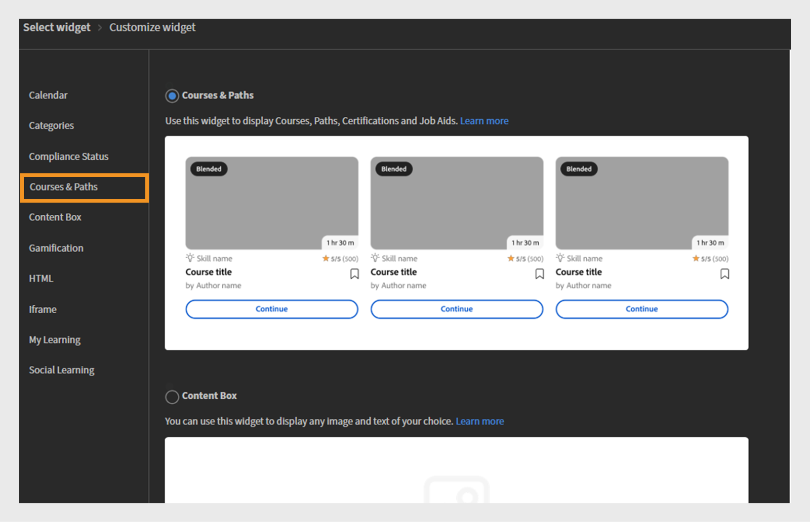
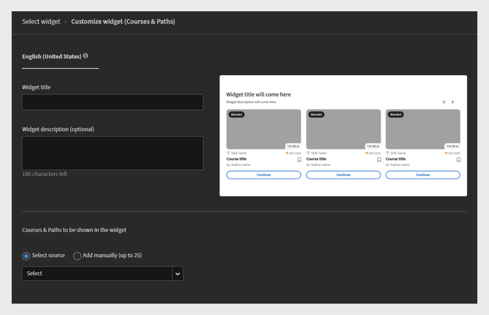
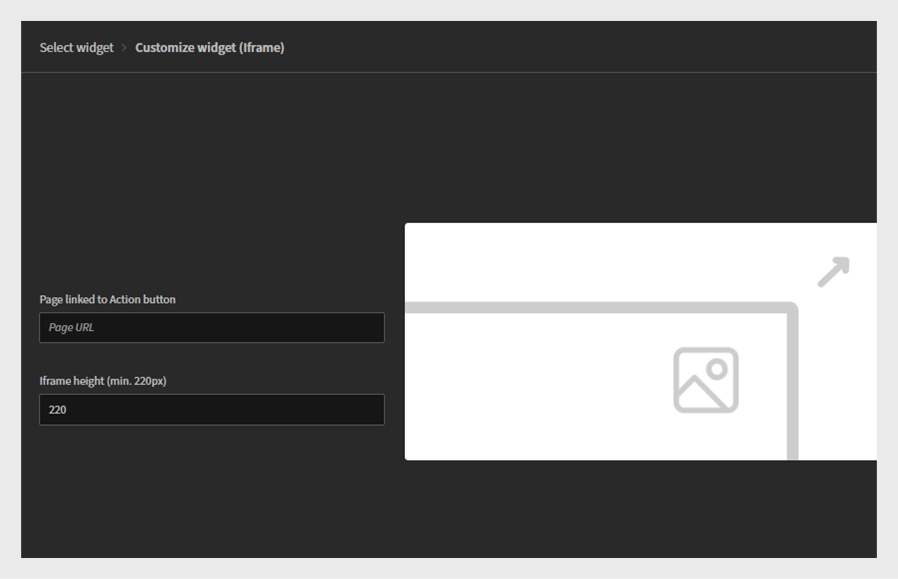

# Adobe Learning Manager 2025年10月版本的新增功能

>[!IMPORTANT]
>
>請注意，概述的功能為暫定功能，可能會有變動。 如需詳細資訊和確認，請洽詢您指定的客戶成功案例經理。 如果您發生任何問題，請透過[learningmanagersupport@adobe.com](mailto:learningmanagersupport@adobe.com)聯絡我們的客戶支援團隊。

## 版本總覽

2025年10月發行的Adobe Learning Manager引進了多項重要增強功能，旨在改善報表正確性、擴充整合功能，並增強管理員、作者和學習者的學習體驗。 重要改善包括提升學習者成績單功能，可準確擷取以講師為標籤的完成、擴充使用者報告（含其他識別欄位），以及工作輔助報告（含直接下載連結）。

此版本也引進自訂管理員的限定範圍公告許可權、社交學習面板中的使用者標籤功能，以及可跨不同區域設定保留學習者進度的語言型進度追蹤。 其他功能包括AI輔助播放清單建立的Go1整合增強功能、具有增量匯入支援的增強自訂角色管理，以及改善的API，以更好地進行測驗效能追蹤和移轉狀態監控。

## 學習者成績單中由講師標籤的完成

**總覽**

增量學習者成績單現在會擷取由講師標籤的完成，即使出席記錄是在工作階段日期之後。
此增強功能解決增量學習者成績單中的關鍵差距，即如果出席記錄是在原始工作階段日期之後，則先前會遺漏講師標籤的完成。

增量學習者成績單是排程報告，僅擷取指定期間內發生的變更（例如完成或進度更新），而不是提供完整的歷史資料傾印。 它們通常用於自動化、儀表板和整合，讓使用者能夠有效地追蹤最近的學習活動，而無需每次都處理整個成績單歷史記錄。

**新增功能**

* **標示完成日期（UTC時區）資料行**：新的時間戳記資料行，可擷取講師將工作階段或模組標示為完成的確切日期和時間。
* **增強的完成來源追蹤**：追蹤記錄完成的特定講師和模組（例如「教室」）。

這些變更可確保工作階段日期之後標籤的完成專案能正確反映在增量學習者成績單中。

**主要優點**

* 擷取增量報表中的所有完成，無論何時標示出勤率。
* 提供合規性和報告的明確稽核軌跡。
* 支援自動化和控制面板以符合法規要求。

**使用案例**

* 擁有教室工作階段的組織，其講師可在實際工作階段後標籤出席天數。
* 依賴增量學習者成績單的自動化系統或控制面板，以符合合規性或提供報告。

### 具有新欄的學習者成績單

請參閱此[文章](/help/migrated/administrators/feature-summary/learner-transcripts.md)以瞭解如何下載學習者成績單。

下載的學習者成績單報告包含新欄：標籤完成日期（UTC時區）。


_學習者成績單報告以黃色顯示新欄，醒目顯示每個使用者的個別完成日期_

## 具有延伸資料欄位的增強型使用者報告

**總覽**

使用者報表現在包含其他欄位，以改進使用者追蹤和組織對應。

**新增功能**

* 內部使用者ID欄：提供不重複的內部識別碼，以便跨不同系統和API端點順暢地追蹤使用者。
* 經理電子郵件欄：包含組織階層追蹤的直接經理聯絡資訊。

**主要優點**

* 簡化使用者識別功能，並免除將使用者對應至多個系統時發生的問題。
* 透過整合功能支援下游使用者管理工作流程。
* 改善組織對應功能，以及更清楚瞭解報表關係。
* 維護組織界限並防止意外的跨通訊。

### 具有新欄的使用者報告

請參閱此[文章](/help/migrated/administrators/feature-summary/reports.md#user-activity-dashboards)以瞭解如何下載使用者報告。

下載的使用者報告檔案包含新欄：內部使用者ID和管理員電子郵件。


_強調內部使用者ID和管理員電子郵件地址的使用者報告，以簡化使用者管理_

## 支援內部使用者ID的FTP使用者報表

**總覽**

FTP型使用者報表現在包含內部使用者ID支援，提供統一的方法匯出資料並整合Headless實作。

**新增功能**

* 使用者報告現在可透過[自訂FTP](/help/migrated/integration-admin/feature-summary/connectors.md#custom-ftp)與現有報告(Gamification成績單、學習者成績單、培訓報告)一併取得。
* 內部使用者ID欄現在在所有匯出方法（FTP、工作API和UI）上都是一致的。

**主要優點**

* 透過單一來源管理所有必要報表，以簡化資料管理。
* 透過確保跨報告期間的統一使用者識別來改善資料一致性。
* 啟用大量作業，並使用一致的識別碼分析工作流程，以支援自動化工作流程。
從FTP資料夾下載的使用者報告包含新欄「內部使用者ID」。

## 在學習者成績單中包含暫停的使用者

**總覽**

組織現在可以在學習者成績單中包含已暫停的使用者（具有停用外部設定檔的使用者），以確保完整的歷史學習資料保留。

**新增功能**

* 可設定的暫停使用者可見度具有帳戶層級的旗標，以在學習者成績單中包含暫停的使用者。
* 即使停用已暫停的外部設定檔後，仍會保留歷史資料。

**實作需求**

* 請聯絡您的客戶成功經理(CSM)以啟用帳戶層級標幟。

>[!NOTE]
>
>依預設，現有帳戶會停用此旗標，而且必須為新帳戶明確要求此旗標。

## 自訂管理員的限定範圍宣告許可權

**總覽**

自訂管理員現在可以建立公告，但僅限於其獲指派的使用者群組或目錄。 這可以防止跨組織界限的意外通訊。

**新增功能**

* 自訂管理員只能為其指派範圍內的使用者建立公告。
* 公告的範圍可設為特定使用者群組或目錄。
* 完整管理員可維護所有公告的可見度和控制權，包括由特定範圍自訂管理員建立的公告。

**主要優點**

* 鎖定目標的通訊，確保公告只會送達相關對象。
* 藉由防止無關的通知影響非預期的使用者，減少資訊過載。
* 維護組織界限並防止意外的跨通訊。

**重要考量**

* 如果自訂管理員的範圍變更，受影響的宣告會顯示警告圖示，並需要個別範圍重設。
* 每個宣告都必須在範圍變更時個別更新。
* 「通知公告」報告只會顯示自訂管理員指派範圍內的學習者。

**使用案例**

* 特許經營組織，地區經理只需與其特許經營人溝通。
* 大型組織，擁有區域或部門管理員，負責向團隊發佈公告。

### 為指派的範圍建立宣告

自訂管理員可建立限定於其指派使用者群組和目錄的公告，確保訊息送達正確的對象並防止不必要的通知。

若要為指派的範圍建立宣告：

1. 以管理員身分登入Adobe Learning Manager。
2. 在左側導覽窗格中選取&#x200B;**[!UICONTROL Announcement]**。
3. 選取&#x200B;**[!UICONTROL Add]**。

   
   在Adobe Learning Manager中的&#x200B;_公告頁面，管理員可以在其中建立和管理目標使用者群組的公告_

4. 從下拉式功能表中選取&#x200B;**[!UICONTROL Announcement Type]**。
a. **[!UICONTROL As Notification]**
b. **[!UICONTROL As Masthead]**
c. **[!UICONTROL As Recommendation]**
日期： **[!UICONTROL As Email]**
5. 選取&#x200B;**[!UICONTROL As Masthead]**。
6. 選取語言並上傳刊頭的影像。
7. 選擇性地為動作按鈕新增URL。

   
   _建立宣告畫面，讓系統管理員可以設定宣告型別、上傳附件，以及新增動作按鈕_

   指派的範圍已在&#x200B;**[!UICONTROL Scope]**&#x200B;區段中預先選取，管理員無法修改。

   >[!NOTE]
   >
   >**[!UICONTROL For Notification]**&#x200B;和&#x200B;**[!UICONTROL Email]**&#x200B;個宣告，如果這些宣告與其指派的範圍重疊，則可以包含其他使用者群組和目錄。

8. 選取&#x200B;**[!UICONTROL Save]**。

只有自訂管理員範圍內的學習者才能檢視宣告。 請參閱此[文章](/help/migrated/administrators/feature-summary/announcements.md)以瞭解如何建立多種型別的宣告。

### 由自訂管理員重設範圍

如果管理員已變更已發佈公告的範圍，自訂管理員可以重設其範圍。 範圍重設後，更新的範圍將套用至公告，只有新範圍內的學習者才能看到公告。

若要重設範圍：

1. 以自訂管理員身分登入Adobe Learning Manager。
2. 在左側導覽窗格中選取&#x200B;**[!UICONTROL Announcement]**。
3. 選取&#x200B;**[!UICONTROL Published]**&#x200B;標籤。
4. 選取任何宣告，然後選取設定圖示。
5. 選取&#x200B;**[!UICONTROL Edit]**。

   
   _顯示已發行公告的公告熒幕，其中包含編輯、發佈和其他選項_

6. 選取&#x200B;**重設**。

   
   _顯示範圍變更通知的宣告，其中包含自訂管理員重設和更新範圍選取以反映新存取許可權的選項_

範圍將會更新，只有更新範圍內的使用者才能檢視宣告。

### 透過管理員UI編輯宣告

管理員可透過其介面檢視自訂管理員建立的公告。 他們僅能透過修改或移除指派的範圍來編輯這些公告。 如果未變更範圍，則管理員無法進一步編輯宣告。

若要透過管理員UI編輯宣告：

1. 以管理員身分登入Adobe Learning Manager。
2. 在左側導覽窗格中選取&#x200B;**[!UICONTROL Announcement]**。
3. 選取&#x200B;**[!UICONTROL Published]**&#x200B;標籤。
4. 選取任何宣告，然後選取設定圖示。
5. 選取&#x200B;**[!UICONTROL Edit]**。

   
   _顯示已發行公告的公告熒幕，其中包含編輯、發佈和其他選項_

6. 選取&#x200B;**[!UICONTROL Remove]**。

   
   _宣告畫面，指出必須移除範圍，讓系統管理員可以編輯為範圍使用者群組建立的宣告_

移除範圍後，管理員可以編輯宣告。

## 在社交面板中標籤使用者

**總覽**

社交學習展示板現在支援使用者標籤功能，讓討論更有針對性，並改善學習社群內的共同作業。 學習者可以透過學習者應用程式、API和Adobe Learning Manager參考網站，在社交學習貼文和評論中受到標籤。

**新增功能**

* **@username標籤**：使用者可以使用「@username」格式標籤其他展示板成員。
* **範圍受限制的標籤**：只能標籤具有特定展示板存取許可權的使用者，以確保隱私權和關聯性。
* **多頻道通知**：標籤的使用者會同時收到應用程式內通知和電子郵件通知，其中包含相關貼文或評論的直接連結。

**主要功能**

* 無法標籤展示板範圍外的使用者，以防止不想要的通知。
* 如果從系統中刪除已標籤的使用者，他們的提及會顯示為「匿名」。
* 不允許標籤使用者群組或&quot;@all&quot;來防止通知垃圾訊息。

**使用案例**

* 尋求特定同事對醫療案例提供意見的醫療保健專業人員。
* 就專門主題諮詢主題專家。
* 需要特定利害關係人提供意見的團隊討論。
* 具有目標專家參與的知識分享課程。

### 在社交討論區貼文中標籤使用者

學習者現在可以使用標籤在貼文或評論中標籤特定討論區成員@username 標籤僅限可存取該展示板的成員使用。

若要在社交展示板中標籤使用者：

1. 以學習者身分登入Adobe Learning Manager。
2. 在左側導覽窗格中選取&#x200B;**[!UICONTROL Social Learning]**。

   
   _選取「社交學習」以存取討論區、分享見解和標籤互動式參與的使用者，以啟用合作學習_

3. 選取&#x200B;**[!UICONTROL New Post]**。

   
   _在社交學習中選取[新貼文]以開始新的討論，與標籤的使用者分享知識_

4. 在標籤使用者之前，請從&#x200B;**[!UICONTROL Post this to a Discussion Board]**&#x200B;選項中選取展示板。

   
   _選取討論區以張貼和標籤使用者，在社交學習中啟用目標合作對話_

5. 輸入您的貼文詳細資訊，然後輸入@符號後面接著使用者的名稱(例如@andrew)來標籤使用者。 當您輸入@，後面接著使用者名稱的前三個字母時，它會顯示相符使用者的清單。

   
   _在討論區貼文標籤使用者，方法是輸入@，接著輸入使用者名稱，以在Social Learning展示板上啟用目標式共同作業_

6. 從清單中選取所需的使用者。
7. 選取&#x200B;**[!UICONTROL Post]**。

標籤的使用者會收到應用程式內和電子郵件通知，其中包含貼文的直接連結，讓討論更具針對性和合作性。

### 根據展示板的範圍標籤使用者

範圍限制標籤可讓使用者僅標籤有權存取特定展示板的學習者。 這有助於防止在範圍外標籤使用者，進而維護隱私權。

如果您嘗試標籤討論區範圍外的學習者，將不會出現任何建議，而且您將無法標籤他們。 請參閱此[文章](/help/migrated/administrators/feature-summary/social-learning-configurations-as-an-admin.md)，深入瞭解社交學習範圍。

## 在評論中標籤已刪除的使用者

如果刪除的使用者在「社交學習」貼文中被標籤，其名稱將在貼文中顯示為「匿名」。 上下文的評論和標籤仍可見，但不顯示個人資料連結或詳細資訊。


_社交學習貼文，重點說明已刪除使用者在標籤時如何顯示為匿名_

## 具有直接存取連結的工作輔助報告

**總覽**

工作輔助報告已增強，包含工作輔助的直接下載連結，精簡管理員和作者的內容管理和稽核程式。

**新增功能**

* 工作輔助連結欄：從報表中直接存取工作輔助檔案和外部URL。
* 角色型存取控制：連結存取許可權取決於使用者角色和目錄許可權。
* 已刪除的工作輔助仍然可以存取，如果仍連結到使用中的課程。

**主要優點**

* 從報告內直接下載檔案和URL存取。
* 省去尋找及下載工作輔助工具的手動工作，以進行合規性或協助工具稽核。

**使用案例**

* 作者或管理員會根據大型組織的要求，定期對工作輔助進行協助工具稽核。
* 任何需要以角色為基礎快速存取工作輔助檔案的情境，以進行檢閱或法規遵循。

### 具有新欄的工作輔助報告

請參閱此[文章](/help/migrated/administrators/feature-summary/reports.md#job-aids-report)以瞭解如何下載工作輔助報告。

工作輔助報告可從「報告」區段下載，現在包含每個工作輔助的直接下載連結。


_工作輔助報告會顯示直接下載連結，讓您在Adobe Learning Manager中輕鬆存取及下載工作輔助_

## API更新

### 學習者API的測驗效能追蹤增強功能

**總覽**

`GET /loResourceGrades` API已增強，可提供詳細的測驗效能資料，進而啟用更複雜的分析和自動化決策。

**新增功能**

API回應現在包含兩個額外的欄位：

* **[!UICONTROL highestScore]**：學習者在所有測驗嘗試中取得的最佳分數
* **[!UICONTROL maxScore]**：測驗的總可能分數

**API回應範例**

```
{
    "links": {
        "self": "https://learningmanagerstage1.adobe.com/primeapi/v2/loResourceGrades/course:15067_30122_41715_1_3400468"
    },
    "data": {
        "id": "course:15067_30122_41715_1_3400468",
        "type": "learningObjectResourceGrade",
        "attributes": {
            "completed": false,
            "duration": 0,
            "hasPassed": false,
            "highestScore": 0,
            "maxScore": 0,. 
            "progressPercent": 0,
            "score": 0
        },
        "relationships": {
            "loResource": {
                "data": {
                    "id": "course:15067_30122_41715_1",
                    "type": "learningObjectResource"
                }
            }
        }
    }
}
```

回應時，**course:15067_30122_41715_1_3400468**&#x200B;是正在要求資訊的學習物件資源等級識別碼。 可從`learningObjectResourceGrad` API取得`GET /enrollments/{id}`e ID。

**主要優點**

* 啟用詳細的測驗效能分析，以進行學習效果測量。
* 支援以最高成就而非最近嘗試為基礎的進度規則。
* 提供一段時間內學習者測驗效能的完整圖片。

**API的運作方式**

1. 使用者嘗試進行測驗多次；每次嘗試都會記錄下來。
2. API提供測驗的最高分數和可能的最高分數。
3. 外部系統可使用此資料來觸發自動化動作，例如根據使用者的最佳表現將其註冊到新課程中。

**使用案例**

* Headless學習系統需要自動註冊決定。
* 學習分析平台追蹤學習者成就模式。
* 符合效能型進度需求的法規遵循系統。

### 移轉API增強功能

**總覽**
Adobe Learning Manager現在支援透過移轉程式，將各種資料物件移轉至帳戶。 此程式可以透過API和使用者介面來起始。 移轉失敗時，可透過介面下載錯誤。 這些錯誤對於偵錯移轉錯誤和管理移轉執行非常有用。

在此版本中，錯誤記錄檔也可透過API下載，以進行有效率的程式化錯誤追蹤和偵錯。

**API變更**

有一個新的移轉API `runStatus`，可讓整合管理員檢查透過API觸發的移轉執行狀態，這是舊版Adobe Learning Manager所無法做到的。

此外，`runStatus` API現在提供直接連結，可下載已完成執行的錯誤記錄檔(CSV)。 請注意，連結僅七天有效，而記錄會保留一個月。

`startRun` API的回應已更新，以包含查詢新狀態端點所需的移轉專案識別碼、衝刺ID和衝刺執行ID。

#### runStatus API

**描述**

擷取現有移轉回合的狀態。

**端點**

```
GET /bulkimport/runStatus
```

**引數**

* **migrationProjectId**： （必要）。 適用於移轉專案的唯一識別碼。 移轉專案用於將資料和內容從現有的學習管理系統(LMS)傳輸到Adobe Learning Manager。 每個移轉專案都可包含多個衝刺，這些是移轉任務的較小單位。

* **sprintId**： （必要）。 移轉專案中衝刺的唯一識別碼。 短期衝刺是移轉工作的子集，其中包括要從現有LMS移轉至Adobe Learning Manager的特定學習專案（例如課程、模組、學習者記錄）。 每個衝刺都可以獨立執行，允許分階段移轉。

* **sprintRunId**： （必要）。 用於追蹤移轉專案中特定衝刺執行的唯一識別碼。 它與衝刺中定義之專案的實際移轉程式相關聯。 sprintRunId有助於監視、疑難排解及管理移轉工作。

**回應**

```
{
  "sprintId": 2510080,
  "sprintRunId": 2740845,
  "migrationProjectId": 2509173,
  "startTime": 1746524711052,
  "endTime": 1746524711052,
  [
    {
      "id": 2609923,
      "lastHeartbeatTime": 1746524711052,
      "objectName": "content",
      "jobState": "COMPLETED",
      "errorCsvLink": "",
      "errorLogLink": "migration/5830/2509173/2510080/2740845/content_err.csv",
      "sequenceNumber": 1
    },
    {
      "id": 2609922,
      "lastHeartbeatTime": 1746524713577,
      "objectName": "course",
      "jobState": "WAITING_IN_QUEUE",
      "errorCsvLink": "",
      "errorLogLink": null,
      "sequenceNumber": 2
    }
  ]
}
```

#### startRun API

`startRun` API回應已更新為包含三個額外的欄位 — migrationProjectId、sprintId和sprintRunId。 這些欄位可讓使用者使用新的runStatus API追蹤及查詢特定移轉執行的狀態。

```
curl -X GET --header 'Accept: text/html' 'https://learningmanager.adobe.com/primeapi/v2/bulkimport/runStatus?migrationProjectId=001&sprintId=10001&sprintRunId=7'
```

產生下列回應。 回應包含：

* migrationId
* sprintId
* sprintRunId

**回應**

```
{
  "status": "OK",
  "title": "BULKIMPORT_RUN_INITIATED_SUCCESSFULLY",
  "source": {
    "info": "Success",
    "migrationInfo": {
      "migrationProjectId": "001",
      "sprintId": "10001",
      "sprintRunId": "7"
    }
  }
}
```

### 社交API變更（使用者標籤、評論和回覆）

**總覽**

Adobe Learning Manager現在支援在社交學習展示板中使用@user標籤功能，讓學習者能夠在貼文、評論和回覆中提及及通知同行。 此功能可加強整個平台的共同作業和內容探索。

此發行版本引進了新的API功能來支援使用者提及，包括增強的POST和GET端點，以及標籤使用者的新搜尋功能。

**API變更總覽**

* 更新建立包含使用者提及的貼文/評論/回覆的POST API
* 更新GET API，在回應中使用者提及資料

**使用者提及的格式**

使用下列格式提及使用者： @(user:userId)

#### 建立提及的貼文

**端點**

```
POST /primeapi/v2/posts
```

**描述**

建立包含使用者提及內容的新社交學習貼文。

**要求內文**

```
{
  "data": {
    "type": "post",
    "attributes": {
      "boardId": 13282,
      "accountId": 11152,
      "text": "<p>This is a new post mentioning @[user:11257229]</p>",
      "createdByUserId": 11257228,
      "postType": "discussion"
    },
    "id": null
  }
}
```

**回應**

含有&#x200B;_userMentions_&#x200B;關聯性中所包含提及資料的標準貼文建立回應。

#### 使用提及內容建立評論

**端點**

```
POST /primeapi/v2/comments
```

**描述**

新增註解至包含使用者提及的貼文。

**要求內文**

```
{
  "data": {
    "type": "comment",
    "attributes": {
      "postId": 20746,
      "accountId": 11152,
      "text": "<p>Test Comment @[user:11257229]</p>",
      "createdByUserId": 11257228,
      "commentLevel": 0
    },
    "id": null
  }
}
```

#### 建立提及的回覆

**端點**

```
POST /primeapi/v2/replies
```

**描述**

回覆含有使用者提及的評論。

**要求內文**

```
{
  "data": {
    "type": "reply",
    "attributes": {
      "postId": 20746,
      "accountId": 11152,
      "text": "<p>Thanks for the update @[user:11257229]</p>",
      "createdByUserId": 11257228,
      "commentLevel": 1,
      "parentCommentId": 55621
    },
    "id": null
  }
}
```

#### 擷取提及的貼文

**端點**

```
GET /primeapi/v2/posts/{id}
```

**描述**

擷取貼文詳細資料，包括提及的使用者。

**回應**

```
{
  "links": {
    "self": "https://learningmanager.adobe.com/primeapi/v2/posts/7522"
  },
  "data": {
    "id": "7522",
    "type": "post",
    "attributes": {
      "commentCount": 3,
      "dateCreated": "2025-06-10T11:33:29.000Z",
      "dateUpdated": "2025-06-25T14:52:04.000Z",
      "downVote": 0,
      "postingType": "DEFAULT",
      "richText": "<p>my updated fourth post @[user:14707776] second mention my first post</p>",
      "state": "ACTIVE",
      "text": "my updated fourth post @[user:14707776] second mention my first post",
      "upVote": 0,
      "viewsCount": 0
    },
    "relationships": {
      "createdBy": {
        "data": {
          "id": "14707776",
          "type": "user"
        }
      },
      "parent": {
        "data": {
          "id": "3971",
          "type": "board"
        }
      },
      "userMentions": {
        "data": [
          {
            "id": "14707776",
            "type": "user"
          }
        ]
      }
    }
  },
  "included": [
    {
      "id": "14707776",
      "type": "user",
      "attributes": {
        "avatarUrl": "https://cpcontents.adobe.com/public/images/default_user_avatar.svg",
        "binUserId": "45664b87-75a3-43ec-b0b7-5064958eac6f",
        "email": "user@example.com",
        "enrollOnClick": false,
        "fields": {
          "Location": "BLR"
        },
        "gamificationEnabled": true,
        "lastLoginDate": "2025-06-27T11:21:17.000Z",
        "name": "John Doe",
        "pointsEarned": 1690,
        "pointsRedeemed": 0,
        "preferredResolution": "AUTO",
        "profile": "admin",
        "roles": [
          "Learner",
          "Admin",
          "Author",
          "Instructor",
          "Integration Admin",
          "Manager"
        ],
        "state": "ACTIVE",
        "userType": "Internal"
      },
      "relationships": {
        "account": {
          "data": {
            "id": "9238",
            "type": "account"
          }
        }
      }
    }
  ]
}
```

### 社交API變更（使用者搜尋）

**端點**

```
GET /primeapi/v2/users/search?q={searchTerm}&context=tagging
```

**描述**

搜尋可根據社交範圍設定進行標籤的使用者。

**要求引數**


* q （必要）：搜尋字詞（至少3個字元）。
* 內容：設為「標籤」可讓使用者符合提及資格。
* 展示板ID （選用）：展示板ID，可根據存取許可權篩選使用者。

**回應**

```
{
  "data": [
    {
      "id": "11257229",
      "type": "user",
      "attributes": {
        "name": "Jane Smith",
        "email": "jane.smith@example.com",
        "avatarUrl": "https://cpcontents.adobe.com/public/images/default_user_avatar.svg",
        "userType": "Internal",
        "state": "ACTIVE"
      }
    }
  ]
}
```

### 實作指南

#### 字元限制

* 貼文：適用4000個字元的限制，每個標籤的使用者可將可用字元減少固定數量。
* 註解：1000個字元限制。

#### 提及驗證

* 使用者只能透過使用者名稱或電子郵件（非UUID）進行標籤。
* 內部使用者無法標籤外部使用者，反之亦然。
* 標籤可用性遵循現有的社交範圍設定。
* 展示板許可權會決定標籤資格（公開/私人）。

#### 通知

* 同一個貼文中多次提及同一個使用者，會產生單一通知。
* 原始貼文擁有者只有在特別標籤後才會收到通知。

#### 錯誤處理

* 提及中的無效使用者ID會傳回驗證錯誤。
* GDPR和已軟性刪除的使用者在標籤內容中會顯示為匿名。

### 語言型學習者進度

目前，系統僅會針對選取的地區設定語言追蹤學習者進度，導致在播放器中切換語言/地區設定時大幅失去進度。 此限制會導致學習者在探索不同語言的內容時失去學習進度，造成使用者體驗不佳。

**目前的問題**

* **進度覆寫**：在使用者與模組層級追蹤播放器中每個模組的進度。 這會導致在使用者切換回相同模組先前使用的地區設定時，覆寫使用者進度的情況。
* **進度重設**：例如，如果學習者在地區設定A （英文）中達到75%的進度，然後切換到地區設定B （西班牙文），當回到地區設定A時，其進度會重設為0%，而不是從75%恢復。

為了解決這些限制，已增強API以支援地區設定特定的進度追蹤：

* **地區設定專屬儲存**：當學習者切換播放器中的地區設定（例如，從地區設定A切換為地區設定B）時，系統現在會分別儲存內容的每個地區設定的進度狀態。
* **進度恢復**：當使用者切換回先前使用的地區設定（從地區設定B切換回地區設定A）時，內容會從該特定地區設定中他們中斷的地方繼續。
* **獨立的進度追蹤**：每個地區設定會維持自己的進度狀態，讓學習者能夠探索多種語言的內容，而不會失去他們每種語言的個別進度。

#### API變更

下列API已增強，可支援新的地區設定引數：

* GET Player State API
* POST播放器狀態API

#### GET Player State API

**端點**

```
GET /primeapi/v2/users/{userId}/playerState
```

**描述**

擷取特定使用者和地區設定的學習物件目前狀態。

**引數**

| 引數 | 型別 | 位置 | 必填 | 說明 |
|---|---|---|---|---|
| userId | 字串 | 路徑 | 是 | 使用者的唯一識別碼 |
| loId | 字串 | 查詢 | 是 | 學習物件識別碼，格式為lo：{id} |
| loResourceId | 字串 | 查詢 | 是 | 學習物件資源識別碼格式課程： {loId_loInstanceId_moduleId_moduleVersion} |
| csrf_token | 字串 | 查詢 | 是 | CSRF保護權杖 |
| 地區設定 | 字串 | 查詢 | 可選 | 語言特定進度的地區設定識別碼（例如「en-US」、「es-ES」） |

**範例要求**

```
GET /primeapi/v2/users/12345/playerState?loId=lo:67890&loResourceId=course:67890_1_mod123_v2&csrf_token=abc123&locale=en-US
```

**回應行為**

* 如果提供地區設定引數，且存在地區設定特定狀態，則API會傳回該地區設定的進度。
* 如果提供地區設定引數，但地區設定特定狀態不存在，則API會執行預設狀態的遞補搜尋。
* 如果省略locale引數，API會傳回預設狀態（維持回溯相容性）。
* 對於地區設定為Null的Headless請求，API會回覆為預設狀態查詢。

#### POST播放器狀態API

**端點**

POST /primeapi/v2/users/{userId}/playerState

**描述**

更新或建立特定使用者及地區設定的學習物件目前狀態。

**引數**

| 引數 | 型別 | 位置 | 必填 | 說明 |
|---|---|---|---|---|
| userId | 字串 | 路徑 | 是 | 使用者的唯一識別碼 |
| loId | 字串 | 查詢 | 是 | 學習物件識別碼，格式為lo：{id} |
| loResourceId | 字串 | 查詢 | 是 | 學習物件資源識別碼格式課程： {loId_loInstanceId_moduleId_moduleVersion} |
| csrf_token | 字串 | 查詢 | 是 | CSRF保護權杖 |
| 地區設定 | 字串 | 查詢 | 可選 | language-sp的區域設定識別碼 |

**要求內文**

請求內文包含地區設定專屬的學習物件狀態資料。

**範例要求**

```
POST /primeapi/v2/users/12345/playerState?loId=lo:67890&loResourceId=course:67890_1_mod123_v2&csrf_token=abc123&locale=en-US
```

```
{
  "progress": 75,
  "completionStatus": "incomplete",
  "timeSpent": 1800,
  "lastAccessedPage": 5,
  // Additional state data
}
```

API會建立或更新指定地區設定的「學習物件」狀態。

## Go1整合增強功能

**總覽**

Go1整合已增強，可讓您直接組織在Adobe Learning Manager中建立學習計畫(LP)的Go1課程。 此更新支援將Go1課程納入定期認證，並引進新版本的Go1內容中心體驗，實現更有效的課程策劃。

**新增功能**

* 使用AI聊天協助或手動選擇，直接在Go1中建立和管理播放清單。
* 在自動進度重設的循環認證週期中包含Go1課程。
* 升級內容探索介面，以改善瀏覽和內容管理。

**主要優點**

* AI輔助的播放清單建立可大幅加快內容分組和傳送速度。
* 允許使用Go1內容滿足週期性法規培訓需求。
* 清晰的預覽與購買模型可支援明智的內容投資決策。
* 改善探索和管理工具，以提升內容管理。

**重要備註**

* 所有Go1功能都需要有效的Go1授權。
* 先前免費的Go1內容將停止服務。 組織必須預覽和購買所需的內容組合。
* 管理員和作者可以建立和管理播放清單；學習者維持僅供檢視的存取權。

**使用案例**

* 具有下列需求的組織：需要廣泛的外部內容程式庫，以進行完整的訓練計畫。
* 以合規性為重點的培訓課程，需要定期內容更新和交付週期。
* 學習團隊正尋求透過AI協助來減少內容管理的經常性費用。

### 將Go1播放清單新增至學習路徑

管理員可建立包含Go1播放清單的學習路徑，讓學習者可存取選取的協力廠商課程作為培訓的一部分。

若要建立學習路徑：

1. 以管理員身分登入Adobe Learning Manager。
2. 在左側導覽窗格中選取&#x200B;**[!UICONTROL Learning Paths]**。
3. 選取&#x200B;**[!UICONTROL Add]**。

   
   _選取「學習路徑」區段中的「新增」，為學習者建立及組織新的結構化訓練計畫_

4. 輸入必要的詳細資料，並選取&#x200B;**[!UICONTROL Save]**。 如需詳細資訊，請參閱此[文章](/help/migrated/administrators/feature-summary/learning-paths.md)。
5. 選取&#x200B;**[!UICONTROL Add Go1 Courses]**。

   
   _將Go1課程新增至您的銷售工程師技能發展播放清單，以透過已組織的協力廠商內容擴充學習選項_

6. 在&#x200B;**[!UICONTROL Library]**&#x200B;中，搜尋並選取&#x200B;**[!UICONTROL Create playlist]**，然後選取下列其中一項：
a. **[!UICONTROL with AI]**：藉助AI建立播放清單。
b. **[!UICONTROL by myself]**：手動新增課程以建立播放清單。

**使用AI建立播放清單**

管理員可以在AI提示中輸入播放清單說明。 AI將會組織相關課程，並根據需求建立播放清單。 AI透過解譯學習目標或使用者提供的提示來產生播放清單。 建立播放清單時，管理員可以選擇使用AI組織內容，讓系統使用大型語言模型來瞭解指定的學習目標和內容偏好設定，例如持續時間和型別。 然後，AI會在內容庫中搜尋符合這些條件的相關學習物件。

若要使用AI建立播放清單：

1. 選取&#x200B;**[!UICONTROL Create playlist]**，然後選取&#x200B;**[!UICONTROL with AI]**。

   
   _使用AI建立已組織的播放清單，如此可啟用根據學習者需求量身打造的自動化課程推薦_

2. 在&#x200B;**[!UICONTROL Enter your learning goal]**&#x200B;文字欄位中輸入播放清單的簡短說明。
3. 選取&#x200B;**[!UICONTROL Next]**。

   
   _輸入您的學習目標以建立自訂播放清單，協助Adobe Learning Manager根據學習者的需求推薦目標課程_

4. 從清單中選擇技能。

   
   _從清單中選擇技能，為銷售工程師策劃課程_
5. 選取課程期間和播放清單型別。
6. 選取&#x200B;**[!UICONTROL Generate playlist]**。 播放清單是以10個課程建立的，管理員可使用此清單建立學習路徑。

   
   _檢閱您在Adobe Learning Manager中策劃的銷售工程師技能增強播放清單_
7. 選取&#x200B;**[!UICONTROL Add to Library]**。
8. 在確認提示中選取&#x200B;**是**。
9. 從&#x200B;**[!UICONTROL Select playlist to import prompt]**&#x200B;選取播放清單。

   
   _從Adobe Learning Manager的Go1資料庫中選取並匯入銷售工程師技能增強播放清單_

10. 選取&#x200B;**[!UICONTROL Add Playlists to Learning Path]**，然後選取&#x200B;**[!UICONTROL Publish]**。

播放清單中的課程將新增至學習路徑。 管理員隨後可註冊學習者，這些學習者可以立即開始參加課程。

**手動建立播放清單**

手動選取最符合學習者需求的課程，並組織其他相關課程。

若要手動建立播放清單：

1. 選取&#x200B;**[!UICONTROL Create playlist]**，然後選取&#x200B;**[!UICONTROL by myself]**。

   
   _手動建立播放清單，讓管理員完全根據特定學習者需求策劃課程_

2. 輸入播放清單的標題和說明。

   
   _在Adobe Learning Manager中新增標題和說明至您的播放清單，以清楚定義其用途，並幫助引導學習者進行目標性的技能發展_

3. 選取&#x200B;**[!UICONTROL Create]**。
4. 選取&#x200B;**[!UICONTROL Add item]**&#x200B;以新增相關課程。

   
   _在Adobe Learning Manager中將專案新增至您的銷售工程師技能發展播放清單，以組織目標課程_

5. 搜尋並選取所需課程。

播放清單已使用相關課程建立，管理員可使用此清單建立學習路徑。

## 儲存語言的播放器狀態進度

**總覽**

Fluidic Player現在會針對模組內的每種語言個別儲存進度。 這表示您可以在語言之間切換，並準確地擷取每個語言中的中斷位置，而不會失去進度並重新開始。

**主要優點**

* 在不同語言之間跳轉，並從每個語言的精確位置繼續。
* 最適合在學習歷程中需要存取多種語言內容的學習者。
* 以任何語言完成此單元，同時以您所存取的所有語言維持進度。

**使用案例**

* 員工會說多種語言且可能需要參考母語和英文內容的全球性組織。
* 合規性培訓，學習者可能一開始使用一種語言，但因認證目的而需要以另一種語言完成。
* 技術訓練計畫，讓學習者能更清楚掌握其母語概念，但需要英文術語才能完成工作。

**重要備註**

* Fluidic Player的語言偏好設定會保留在工作階段中。 如果學習者變更語言並移至另一個模組，只要播放器保持開啟，新語言就會用於後續模組。
* 系統仍會在模組層級追蹤等級（完成狀態），而不是根據地區設定追蹤。 滿足完成條件的第一個地區設定將更新模組的等級。 如果學習者以一種語言完成模組，然後切換到另一種語言，則任何更進一步的等級更新將會從先前的等級覆寫，但每個地區設定的進度仍會保留。

## 增量使用者匯入中的自訂角色匯入支援

Adobe Learning Manager現在支援在現有的多增量使用者匯入工作流程中進行自訂角色匯入（一般完整使用者匯入+增量啟用流程）。 此增強功能可讓role.csv和user_role.csv檔案以漸進方式上傳和處理，而不需每次都完全上傳資料。

之前，role.csv和user_role.csv檔案只能以完整模式上傳，這表示管理員必須在每次上傳時納入所有先前新增的角色定義和指派。 有了這項新的增量支援，只需要上傳新的或修改過的角色資料，就能減少間接成本並提升效率。

**新增功能**

1. 對自訂角色和角色指派的增量支援：

   * 現在可以在多檔案增量工作流程中逐步處理role.csv和user_role.csv。
   * 無需在每次匯入時上傳所有現有的角色和使用者角色資料。

2. 增強的多增量工作流程實作：

   * 為每個上傳的使用者匯入檔案在FTP中建立個別資料夾。
   * 每個資料夾都包含：

      * 使用者匯入檔案 — (File1.csv)
      * 對應的角色與角色指派檔案 — (File1_role.csv， File1_user_role.csv)

   例如，user1.csv對應至user1_role.csv （自訂角色）和user1_user_roles.csv （使用者 — 角色對應）。

   **處理前的FTP結構範例：**

   ```
   import/user/internal/  
        File1.csv  
        File2.csv  
       File3.csv  
   
   UserRole/  
       File1_role.csv  
       File1_user_role.csv  
       File2_role.csv  
       File2_user_role.csv  
       File3_role.csv  
       File3_user_role.csv  
   ```

3. Adobe Learning Manager也支援最多20個增量使用者CSV及其對應的自訂角色CSV，因此適合用於大規模作業。

**使用案例**

* 全球公司藉由上傳每個區域（歐盟、美洲、亞洲）的多個增量使用者檔案來管理區域團隊，讓管理員可在單一工作流程中更新使用者並為每個區域指派新角色。
* 大型企業會定期從HR系統擷取漸進式使用者更新，以自動化上線和許可權。 如此可支援使用者設定檔的順暢更新，以及精細角色指派，無需手動干預。

### 新欄已新增至CSV檔案

我們引進了三個新欄來增強在使用者、角色和使用者角色CSV匯出/匯入中擷取的資料：

* **使用者註冊狀態(user.csv)**：表示使用者目前的註冊狀態。
* **角色狀態(role.csv)**：表示系統內角色的目前狀態。
* **使用者角色狀態(user_role.csv)**：表示使用者 — 角色關聯的狀態。

在此處下載[範例CSV](assets/sample-csv-Incremnetal.zip)。


## 在Salesforce應用程式中重設建議

**總覽**

過去，使用Adobe Learning Manager Salesforce應用程式的學習者僅能選取角色和建議偏好設定一次。 如果變更角色，使用者必須存取原生Adobe Learning Manager應用程式，更新設定檔並接收相關課程建議。 這提供了學習體驗，並有助於降低Salesforce環境內的參與度。

**新增功能**

Adobe Learning Manager現在提供Salesforce應用程式中的&#x200B;**[!UICONTROL Reset Interests]**&#x200B;按鈕。 學習者現在無需離開Salesforce或登入原生Adobe Learning Manager應用程式，即可重設其角色和學習偏好設定。 此增強功能可簡化個人化學習內容的存取，確保隨著使用者角色的變化，建議仍可維持其相關性。

**使用案例**

* 變更工作角色、團隊或責任的學習者可快速重設其偏好設定，以接收更新且相關的課程建議，所有這一切都可在Salesforce應用程式中進行。
* 移除切換至原生Adobe Learning Manager應用程式的需求後，學習歷程就會更順暢，鼓勵透過Salesforce持續參與及使用建議內容。
* 管理員可受益於更高的學習完成率，以及使用者角色與建議內容之間更佳的協調，而無需在交換平台上獲得額外的支援或指導。

### 重設Salesforce應用程式中的興趣

若要從Salesforce應用程式重設興趣和建議：

1. 以學習者身分登入適用於Salesforce的Adobe Learning Manager應用程式。
2. 選取底部的&#x200B;**[!UICONTROL Reset Interests]**&#x200B;選項。

系統會從Adobe Learning Manager Salesforce應用程式重設學習者的建議或興趣。

## 使用Experience Builder建立學習入口

>[!IMPORTANT]
>
>我們很高興地宣佈，建立自訂學習入口網站的創新工具Experience Builder將在2025年10月Adobe Learning Manager發行後推出。
>
>臨近發行日期之際，請繼續關注更多更新消息。 我們期待瞭解您如何使用Experience Builder來轉換學習入口網站。
>
>如有疑問或需要其他資訊，請聯絡客戶成功案例經理。

**簡介**

Experience Builder是Adobe Learning Manager中的無程式碼/低程式碼工具，可協助您建立自訂的學習入口網站。 它可讓您設計品牌化、方便使用的學習入口網站，而不需要技術技能或廣泛的程式碼知識。
有了Experience Builder，您可以建立新頁面、功能表和Widget，輕鬆快速地為對象提供個人化學習體驗。 有了Experience Builder，您可以快速建立新頁面、功能表和Widget，為對象提供個人化的學習體驗。

**問題陳述式**

在Experience Builder之前，組織面臨幾個挑戰：

1. **有限的自訂**：入口網站已修正設計，但只有少數幾個選項可反映您的品牌。 管理員只能進行基本變更（例如修改頁首、頁尾或顏色），這會限制建立獨特體驗的能力。
2. **成本**：建置自訂入口網站需要昂貴的開發人員和漫長的時間，通常需要6到9個月才能完成。 此方法會增加總體擁有成本，並延遲部署。
3. **一般體驗**：每個人都看到相同的內容，即使內容與其角色或需求無關。 缺乏個人化降低了學習者的參與度和滿意度。
4. **技術障礙**：非技術管理員因需要編碼知識或外部支援而難以建立或更新入口網站。

Experience Builder提供簡單、無程式碼/低程式碼解決方案，用於建立個人化的品牌入口網站，藉此解決這些問題。

它可讓管理員設計符合組織需求的入口網站，而不需依賴技術專業知識或外部開發人員。

**主要優點**

**輕鬆自訂**

* 設計符合您品牌的自訂頁首、頁尾、標誌和版面配置的入口網站。
* 使用Widget新增動態內容，例如課程、類別和HTML元素。
* 建立為特定受眾量身打造的頁面和功能表，確保學習者看到相關內容。

**無程式碼/低程式碼解決方案**

* 管理員無需編碼知識即可建立和管理入口網站，讓非技術使用者也能存取。
* 拖放功能可簡化建立頁面和功能表的程式。

**個人化學習**

* 設定頁面和功能表，以顯示與特定使用者群組（例如銷售團隊、設計人員或工程師）相關的內容。
* 使用隱藏頁面來提供只能透過直接連結存取的專屬內容。

**全球範圍**

* 建立多語言頁面以支援全球的學習者。
* 將內容當地語系化，以迎合不同受眾並提升協助工具。

**支援行動裝置**

* 學習者可存取任何裝置上的內容，包括手機和平板電腦。
* 在案頭和行動檢視中預覽頁面，以確保順暢的體驗。

**真實使用案例**

**品牌入口網站**

* 建立學習入口網站，外觀類似貴公司網站，提供完整的標誌、顏色和版面配置。
* 例如，醫療保健公司可以設計入口網站，在整合學習內容的同時符合其企業品牌。

**角色型學習**

* 為工程師、銷售團隊或設計人員等特定角色建立頁面。
* 例如，銷售團隊可能會看到產品培訓，而工程師可能會存取技術課程。

**產品培訓**

* 為不同產品(例如Photoshop、Illustrator或其他產品)設定個別頁面。
* 每個頁面都可包含顯示與產品相關的課程、認證和資源的Widget。

**員工和客戶培訓**

* 使用入口網站引導新員工、培訓外部合作夥伴，或教育客戶您的產品。
* 例如，軟體公司可建立入口網站，供客戶教學課程和疑難排解指南使用。

**當地語系化內容**

* 為全球學習者提供多種語言的內容。
* 例如，跨國公司可以建立英文、西班牙文和法文頁面，以迎合其多樣化的員工需求。

### Experience Builder的建置區塊

Experience Builder的主要元件和建置區塊的結構化能提供彈性、易用性和針對性的學習體驗。 以下是詳細的劃分：

#### 頁面

頁面是在Experience Builder中建立學習入口網站的基礎。 管理員可建立針對特定對象或目的量身打造的新頁面。 此外，管理員可以：

* 建立具有彈性版面配置（列和欄）的自訂頁面。
* 新增Widget以使用內容填入頁面。
* 使用草稿和已發佈狀態管理頁面生命週期。
* 在功能表中隱藏頁面，同時透過直接連結保持頁面可存取。

例如，銷售訓練頁面可能包含顯示相關課程、口碑，以及近期課程行事曆的Widget。

#### 功能表

功能表會將頁面組織成學習者的可導覽結構。 管理員可以：

* 建立自訂功能表，將特定使用者群組的頁面分組。
* 新增階層與排序，以優先顯示特定對象的可見度。
* 包含用於分組相關頁面的子功能表。

例如，名為「資源」的功能表可能包含eBook、影片和常見問答集的頁面。

#### Widget

Widget可讓管理員將動態內容和功能新增至頁面。 可使用下列介面工具集：

* 行事曆
* 類別
* 合規狀態
* 課程與路徑
* 內容方塊
* gamification
* HTML
* Iframe
* 我的學習
* 社交學習

例如，頁面可包含課程與路徑Widget，以顯示建議課程和行事曆Widget，以供近期的訓練課程使用。

#### 品牌工具

Experience Builder提供工具來自訂入口網站的外觀。 管理員可以：

* 自訂頁首、頁尾和版面配置，以符合企業品牌。
* 使用CSS和JavaScript進行進階樣式設定。

例如，醫療保健公司可能會使用品牌化工具，建立符合其公司網站外觀和感覺的入口網站。

### 開始使用Experience Builder

一家軟體公司想要為客戶建立訓練入口網站。 該入口網站會提供不同產品(例如Photoshop和Illustrator)的頁面，並在功能表中進行整理。 其中包含Widget，顯示課程、認證和即將舉辦的培訓課程。

#### 建立頁面

若要在Adobe Learning Manager中建立頁面：

1. 以管理員身分登入Adobe Learning Manager。
2. 在左側導覽窗格中選取&#x200B;**[!UICONTROL Branding]**。
3. 選取&#x200B;**[!UICONTROL Custom Pages]**。
4. 選取&#x200B;**[!UICONTROL Create page]**。

   
   _自訂頁面畫面顯示[建立頁面]選項，用來設計新的自訂學習體驗_

5. 輸入&#x200B;**[!UICONTROL Page name]** (例如Photoshop培訓)。
6. 輸入&#x200B;**[!UICONTROL Page description]** (例如，瞭解如何有效使用Photoshop)。
7. 從下列專案選取頁面型別：

   * **[!UICONTROL Build using ALM widgets]**：管理員可以使用現有的Adobe Learning Manager Widget建立頁面。
   * **[!UICONTROL External page]**：管理員可以為外部頁面新增URL。 如果您選取頁面型別為外部，請在「頁面URL」文字欄位中新增URL。

8. 選取&#x200B;**[!UICONTROL Change icon]**&#x200B;以變更頁面的圖示。

   
   _課程頁面建立畫面會顯示輸入自訂學習者頁面的頁面名稱、說明、型別和圖示的選項_
9. 選取&#x200B;**[!UICONTROL Add New Language]**&#x200B;以新增頁面的預設語言。
10. 選取&#x200B;**[!UICONTROL Save]**。

已建立頁面，並將其儲存為自訂頁面區段中的草稿。 管理員可以使用介面工具來編輯和設計草擬的頁面。

請依照相同的步驟，為Illustrator等其他產品建立頁面。

#### Experience Builder中的設計頁面

Adobe Learning Manager可讓管理員使用可自訂的Widget，根據需求量身打造頁面。
若要在Experience Builder中設計頁面：

1. 以管理員身分登入Adobe Learning Manager。
2. 在左側導覽窗格中選取&#x200B;**[!UICONTROL Branding]**。
3. 選取&#x200B;**[!UICONTROL Custom Pages]**，然後選取所需的頁面。
4. 選取&#x200B;**[!UICONTROL Page Design]**。
5. 選取&#x200B;**[!UICONTROL Edit]**。

   
   _編輯模式可讓系統管理員透過組織區段並以偏好語言新增Widget來設計課程頁面_

6. 從&#x200B;**[!UICONTROL Select section layout]**&#x200B;下拉式清單中選擇選項。
7. 根據您要在區段中新增的Widget數目和大小，從下列選項中選取區段：

   * **[!UICONTROL 1 column-Full section width]**：內容橫跨整個區段寬度，達到空間上限。
   * **[!UICONTROL 2 columns-1/2 section width each]**：兩個等寬欄平均分割區段。
   * **[!UICONTROL 2 columns-2/3 and 1/3 section width respectively]**：主要內容需要三分之二，次要內容需要三分之一。
   * **[!UICONTROL 2 columns-1/3 and 2/3 section width respectively]**：次要內容需要三分之一，主要內容需要三分之二。
   * **[!UICONTROL 3 columns-1/3 section width each]**：三個等寬欄將區段分割為三分之一。

   
   _區段配置選擇對話方塊可讓系統管理員為自訂頁面設計選擇單一或多欄Widget配置_

8. 選取&#x200B;**[!UICONTROL Proceed]**。
9. 選取&#x200B;**[!UICONTROL Add widget]**。

   
   _頁面設計畫面可讓系統管理員選取並新增Widget，以自訂其課程頁面_

10. 選擇所需的Widget，然後選取&#x200B;**[!UICONTROL Proceed]**。
11. 設定Widget並選取&#x200B;**[!UICONTROL Add widget]**。 如需新增和設定Widget，請參閱此[區段](#add-and-configure-widgets)。
12. 選取&#x200B;**[!UICONTROL Save]**&#x200B;並從下列選項中選擇：

   * **[!UICONTROL Save as Draft]**：此頁面將儲存為草稿。 管理員稍後可以編輯頁面。
   * **[!UICONTROL Save & Publish]**：此頁面將發佈，管理員可以將此頁面新增到功能表。


_儲存選項可讓管理員選擇將頁面儲存為草稿以供日後編輯，還是發佈頁面以供學習者存取_

頁面可儲存為草稿或發佈。 管理員可以在發佈前編輯草稿，也可以更新並重新發佈已發佈的頁面。

#### 新增和設定Widget

**行事曆Widget**

此Widget會以視覺化方式呈現行事曆格式的課程與排程。 它支援依目錄、註冊狀態、位置、產品和角色篩選。 回應式設計會因應各種格線大小。

若要設定日曆Widget：

1. 請依照Experience Builder[中](#design-page-in-experience-builder)設計頁面的步驟1-9操作。
2. 選取&#x200B;**[!UICONTROL Calendar]**，然後選取&#x200B;**[!UICONTROL Proceed]**。

   
   _Widget選取畫面醒目提示[行事曆]Widget選項，以在行事曆中顯示訓練課程_

3. 輸入&#x200B;**[!UICONTROL Widget title]**&#x200B;和&#x200B;**[!UICONTROL Widget description]**。

   
   _行事曆Widget自訂畫面，管理員可以在其中設定Widget標題、說明，並選取目錄_

4. 在&#x200B;**[!UICONTROL Calendar]** Widget中搜尋以顯示其課程和學習路徑，以選取目錄。
5. 選取&#x200B;**[!UICONTROL Add Widget]**。

行事曆Widget將新增至頁面。 管理員可以新增其他Widget並發佈頁面。

**類別Widget**

此Widget將類別（例如角色、目錄）顯示為圖磚，以便產生篩選的檢視或特定頁面。

若要設定類別Widget：

1. 請依照Experience Builder[中](#design-page-in-experience-builder)設計頁面的步驟1-9操作。
2. 選取&#x200B;**[!UICONTROL Categories]**，然後選取&#x200B;**[!UICONTROL Proceed]**。

   
   _Widget選取畫面會醒目提示「類別」Widget選項，依目錄、產品或角色來組織學習內容，方便瀏覽_

3. 選取要顯示在類別卡上的詳細資料：

   * **[!UICONTROL Category Image]**
   * **[!UICONTROL Category Description]**

4. 輸入&#x200B;**[!UICONTROL Widget title]**&#x200B;和&#x200B;**[!UICONTROL Widget description]**。
5. 搜尋並從&#x200B;**[!UICONTROL Category source]**&#x200B;選擇目錄。

   
   _設定類別Widget選項以設定Widget標題和說明，並選取類別來源_

6. 選取&#x200B;**[!UICONTROL Add Widget]**。

類別Widget將會新增至頁面。 管理員可以新增其他Widget並發佈頁面。

**法規遵循Widget**

此Widget支援類似行事曆的篩選功能，但著重於與合規性相關的學習物件。 它可讓學習者動態修改或移除合規性標籤篩選器。

若要設定法規遵循Widget：

1. 請依照Experience Builder[中](#design-page-in-experience-builder)設計頁面的步驟1-9操作。
2. 選取&#x200B;**[!UICONTROL Compliance Status]**，然後選取&#x200B;**[!UICONTROL Proceed]**。

   
   _Widget選取畫面醒目顯示合規狀態Widget，用於顯示截止日期和狀態指示器的學習者註冊_

3. 輸入&#x200B;**[!UICONTROL Widget title]**&#x200B;和&#x200B;**[!UICONTROL Widget description]**。

   
   _法規遵循狀態Widget畫面，管理員可在此設定Widget標題和說明，以顯示學習者的註冊截止日期和狀態_

4. 選取&#x200B;**[!UICONTROL Add widget]**。

合規性狀態Widget將新增至頁面。 管理員可以新增其他Widget並發佈頁面。

**課程與路徑Widget**

此Widget會顯示課程或路徑圖磚的長條，可自訂以顯示不同的詳細資訊。

設定課程與路徑Widget：

1. 請依照Experience Builder[中](#design-page-in-experience-builder)設計頁面的步驟1-9操作。
2. 選取&#x200B;**[!UICONTROL Courses & Paths]**。

   
   _Widget選取畫面會醒目提示「課程與路徑」Widget，以將課程、學習路徑、認證和工作輔助顯示為學習者的互動式卡片_

3. 選取&#x200B;**[!UICONTROL Proceed]**。
4. 型別&#x200B;**[!UICONTROL Widget title]**&#x200B;和&#x200B;**[!UICONTROL Widget description]**。
5. 選取目錄，或手動選擇最多25個要顯示的課程。

   
   _管理員可設定課程與路徑Widget標題、說明，並選取要顯示為互動式卡片的課程或學習路徑_

6. 選取&#x200B;**[!UICONTROL Add widget]**。

課程與路徑Widget將會新增至頁面。 管理員可以新增其他Widget並發佈頁面。

**內容方塊Widget**

此Widget可讓您建立具有標題、說明、影像和CTA的區段。

若要設定內容方塊Widget：

1. 請依照Experience Builder[中](#design-page-in-experience-builder)設計頁面的步驟1-9操作。
2. 選取&#x200B;**[!UICONTROL Content Box]**，然後選取&#x200B;**[!UICONTROL Proceed]**。

   
   _Widget選取畫面醒目提示「內容方塊」Widget，以顯示自訂影像、文字和動作按鈕，以增強學習者參與度_

3. 輸入&#x200B;**[!UICONTROL Title]**&#x200B;和&#x200B;**[!UICONTROL Description]**。
4. 在&#x200B;**[!UICONTROL Action button label]**&#x200B;中輸入文字並提供連結。
5. 選取「背景」填色的任何選項：

   * **[!UICONTROL Color]**：從檢色器選取色彩，或在文字欄位中輸入色彩代碼。
   * **[!UICONTROL Image]**：瀏覽並上傳圖片。

6. 使用&#x200B;**[!UICONTROL Content box height]**&#x200B;選項調整方塊高度。
7. 選取文字格式選項。

   
   _Content Box Widget自訂畫面，管理員可在此輸入標題、說明、動作按鈕標籤和連結_

8. 選取&#x200B;**[!UICONTROL Add widgets]**。

內容方塊Widget將會新增至頁面。 管理員可以新增其他Widget並發佈頁面。

**Gamification Widget**

此Widget以排行榜格式顯示學習者的gamification和得分。 已針對Experience Builder完成更新，包含名稱、說明及本地化自訂。

若要設定Gamification Widget：

1. 請依照Experience Builder[中](#design-page-in-experience-builder)設計頁面的步驟1-9操作。
2. 選取&#x200B;**[!UICONTROL Gamification]**，然後選取&#x200B;**[!UICONTROL Proceed]**。

   
   _Widget選取畫面會反白標示用來在排行榜上顯示學習活動和成就的Gamification Widget_

3. 輸入&#x200B;**[!UICONTROL Widget title]**&#x200B;和&#x200B;**[!UICONTROL Widget description]**。
4. 選取&#x200B;**[!UICONTROL Add widgets]**。

gamification Widget將會新增至頁面。 管理員可以新增其他Widget並發佈頁面。

**HTML Widget**

此Widget可內嵌自訂HTML、CSS和JS程式碼，提供口碑等靜態內容的靈活性。

若要設定HTML Widget：

1. 請依照Experience Builder[中](#design-page-in-experience-builder)設計頁面的步驟1-9操作。
2. 選取&#x200B;**[!UICONTROL HTML]**，然後選取&#x200B;**[!UICONTROL Proceed]**。

   
   _Widget選取畫面會醒目顯示HTML Widget，以便使用HTML、CSS和JavaScript程式碼自訂頁面_

3. 在個別欄位中輸入您的&#x200B;**[!UICONTROL HTML]**、**[!UICONTROL CSS]**&#x200B;和&#x200B;**[!UICONTROL JavaScript]**&#x200B;程式碼。
4. 選取&#x200B;**[!UICONTROL Add widget]**。

HTML Widget將會新增至頁面。 管理員可以新增其他Widget並發佈頁面。

**IFrame Widget**

此Widget允許直接在頁面內嵌外部網頁應用程式或網頁。 包含為iframe內容命名、說明及本地化的選項。

若要設定Iframe Widget：

1. 請依照Experience Builder[中](#design-page-in-experience-builder)設計頁面的步驟1-9操作。
2. 選取&#x200B;**[!UICONTROL Iframe]**，然後選取&#x200B;**[!UICONTROL Proceed]**。

   
   _Widget選取畫面會醒目提示Iframe Widget，以便在選取的區段中內嵌外部應用程式或網頁_

3. 在&#x200B;**[!UICONTROL Page linked to Action button]**&#x200B;選項中輸入URL。
4. 使用&#x200B;**[!UICONTROL Iframe height]**&#x200B;選項調整Iframe高度。

   
   _Iframe Widget自訂畫面，管理員可在此輸入頁面URL並指定iframe高度以內嵌外部內容_

5. 選取&#x200B;**[!UICONTROL Add widget]**。

Iframe Widget將會新增至頁面。 管理員可以新增其他Widget並發佈頁面。

**我的學習Widget**

此Widget類似於「課程」和「路徑」Widget，但會針對每位學習者篩選內容，以顯示其已註冊學習物件的個人化集合。

設定我的學習Widget：

1. 請依照Experience Builder[中](#design-page-in-experience-builder)設計頁面的步驟1-9操作。
2. 選取&#x200B;**[!UICONTROL My Learning]**，然後選取&#x200B;**[!UICONTROL Proceed]**。

   
   _Widget選擇畫面，醒目提示「我的學習」Widget，用於顯示學習者已註冊課程的個人化清單_

3. 輸入&#x200B;**[!UICONTROL Widget title]**&#x200B;和&#x200B;**[!UICONTROL Widget description]**。
4. 選取&#x200B;**[!UICONTROL Add widget]**。

我的學習Widget將新增至頁面。 管理員可以新增其他Widget並發佈頁面。

**社交學習Widget**

此Widget可啟用社交合作功能，例如平台內的貼文、評論和使用者標籤。 它對Experience Builder進行了增強，提供自訂選項，包括名稱和本地化。

設定社交學習Widget：

1. 請依照Experience Builder[中](#design-page-in-experience-builder)設計頁面的步驟1-9操作。
2. 選取&#x200B;**[!UICONTROL Social Learning]**，然後選取&#x200B;**[!UICONTROL Proceed]**。

   
   _Widget選取畫面會醒目顯示社交學習Widget，以顯示貼文以鼓勵共同作業和參與_

3. 輸入&#x200B;**[!UICONTROL Widget title]**&#x200B;和&#x200B;**[!UICONTROL Widget description]**。
4. 選取&#x200B;**[!UICONTROL Add widget]**。

社交學習Widget將會新增至頁面。 管理員可以新增其他Widget並發佈頁面。

#### 將頁面組織到功能表中

功能表有助於在Experience Builder中組織和連結頁面，讓學習者可輕鬆導覽您的學習入口網站。 管理員可以建立功能表、將頁面新增至功能表，以及自訂哪些功能表要顯示給特定對象。

**建立功能表**

若要建立功能表：

1. 以管理員身分登入Adobe Learning Manager。
2. 在左側導覽窗格中選取&#x200B;**[!UICONTROL Branding]**。
3. 選取&#x200B;**[!UICONTROL Menu]**，然後選取&#x200B;**[!UICONTROL Create]**。

   
   _功能表畫面顯示可檢視、整理和建立不同學習者群組的自訂功能表的選項_

4. 輸入&#x200B;**[!UICONTROL Menu name]** （例如，產品培訓）並在&#x200B;**[!UICONTROL Visible to]**&#x200B;選項中選取使用者群組。

   
   _建立功能表畫面，管理員可在此輸入功能表名稱供內部使用，並指定使用者群組來控制功能表的可見性_

5. 從&#x200B;**[!UICONTROL Select pages]**&#x200B;選項中選擇自訂頁面。

   
   _頁面選取畫面，醒目顯示包含使用者群組自訂頁面和自訂功能表順序的選項_

6. 選取&#x200B;**[!UICONTROL Preview menu]**&#x200B;以在儲存之前檢視功能表。
7. 選取&#x200B;**[!UICONTROL Save]**。

選定的學習者可看見已建立的功能表。 他們可以透過其學習者UI存取自訂頁面。


_學習者UI顯示自訂頁面，其中包含精選訓練模組，以及從側邊欄功能表輕鬆導覽_

#### 管理頁面生命週期

管理員可以使用「自訂頁面」區段來編輯、刪除和複製頁面。

**編輯頁面**

若要編輯自訂頁面：

1. 以管理員身分登入Adobe Learning Manager。
2. 在左側導覽窗格中選取&#x200B;**[!UICONTROL Branding]**。
3. 選取&#x200B;**[!UICONTROL Custom Pages]**。
4. 選取必要頁面，然後選取&#x200B;**[!UICONTROL Edit]**。
5. 選取&#x200B;**[!UICONTROL Save]**。

此頁面將會更新變更。


_編輯自訂頁面，讓系統管理員可以更新頁面名稱、說明和型別_

**刪除頁面**

若要刪除頁面：

1. 以管理員身分登入Adobe Learning Manager。
2. 在左側導覽窗格中選取&#x200B;**[!UICONTROL Branding]**。
3. 選取&#x200B;**[!UICONTROL Custom Pages]**。
4. 選取所需的頁面。
5. 選取&#x200B;**[!UICONTROL Action]**，然後選取&#x200B;**[!UICONTROL Delete]**。


_自訂頁面畫面會顯示刪除為產品訓練建立之自訂頁面的選項_

**複製頁面**

若要複製頁面：

1. 以管理員身分登入Adobe Learning Manager。
2. 在左側導覽窗格中選取&#x200B;**[!UICONTROL Branding]**。
3. 選取&#x200B;**[!UICONTROL Custom Pages]**。
4. 選取所需的頁面。
5. 選取&#x200B;**[!UICONTROL Action]**，然後選取&#x200B;**[!UICONTROL Duplicate]**。


_自訂頁面畫面會顯示選項，用來復製為產品訓練建立的自訂頁面_

#### 預覽頁面

若要預覽頁面：

1. 以管理員身分登入Adobe Learning Manager。
2. 在左側導覽窗格中選取&#x200B;**[!UICONTROL Branding]**。
3. 選取&#x200B;**[!UICONTROL Custom Pages]**。
4. 選取必要頁面，然後選取&#x200B;**[!UICONTROL Page Design]**
5. 選取&#x200B;**[!UICONTROL Edit]**，然後選取&#x200B;**[!UICONTROL Preview page]**&#x200B;以檢視入口網站的預覽。


_頁面預覽，顯示具有橫幅的自訂頁面配置、精選課程_

#### 將頁面本地化

當管理員將多種語言新增到自訂頁面時，在預設語言標籤旁的對應語言標籤中新增每種語言的Widget詳細資訊。


_管理員可以新增其他語言的Widget詳細資訊，例如法文，以及預設語言_

#### 設定隱藏頁面

隱藏頁面選項可讓管理員透過顯示較少的頁面來保持學習者UI整齊。 管理員可從功能表隱藏頁面，讓學習者無法在學習者UI中看到頁面，但學習者仍能以其他方式存取這些頁面。 例如，「目錄」頁面可從功能表隱藏，但可透過其他導覽路徑存取。


_顯示隱藏頁面的功能表設定畫面，例如，目錄、社交學習、技能和徽章_


<!-- We're excited to share several important updates coming to Adobe Learning Manager with the upcoming releases. These enhancements aim to streamline admin workflows, improve data reporting accuracy, and strengthen role-based controls.

These changes are designed to reduce manual effort, support automation, and improve governance across training operations.

## Capture instructor-marked completions in Learner Transcript

### Audience  

Administrator and automation owners 

### Overview 

In Adobe Learning Manager, when using incremental Learner Transcripts (LT) for automation workflows, instructor-marked completions made after the session date are not captured. The completion timestamp reflects the original session end time (not the time the instructor marked the completion). Since these updates fall outside the one-day change window used for incremental LT generation, as a result, learners' attendance and completion data are excluded from reports, leading to inaccurate or incomplete downstream reporting and potential compliance gaps. 

### What has changed 

Learner Transcript (LT) reports include completions marked by instructors after the session date. This ensures that any delayed attendance marking is correctly reflected in the transcript export. 

Attendance states like "Attended with pass/fail" will appear automatically in incremental LT exports. 

### What's new 

* New column: Mark Completed Date (UTC TimeZone). 
* Completion Source is available at module level. 
* Compatible with connector-based or job API-generated LT reports. 


**Action required**

* If your automation depends on column positions, ensure logic accounts for the new column. 
* If using column names, no changes are required. 
* Retrofitted completions (manual imports) are not included. 

## Download links in Job Aids report

### Audience 

Administrator, custom administrator, and automation owners 

### Overview 

The Job Aids report includes a direct download link for each job aid, allowing quick access from the report itself. 

### What's new  

A new column, **[!UICONTROL Job Aid Link]**, has been added to the third position in the report. It links directly to the job aid if it's a file or shows the external URL provided by the author. 

Users with access (admin/authors and custom roles) can download the job aid using this link. 

 

### Action required 

* Review automated workflows using Job Aids reports (using Jobs API). 
* If the script is based on column position, update scripts accordingly. 
* No action is needed if using column names. 

## Internal User ID and Manager Email columns added to User Report

### Audience 

Administrators (and custom administrators) using the **[!UICONTROL User Report]** (**[!UICONTROL Admin]** > **[!UICONTROL Users]** > **[!UICONTROL Internal]** > **[!UICONTROL Export User data]**) downloaded from the administrator User Interface. 

### Overview 

To assist in user identification and integration workflows, two columns, **[!UICONTROL Internal User ID]** and **[!UICONTROL Manager Email]** have been added to the User report, exported via the User Interface. 

### What's new 

The User report includes a user's internal user ID and their manager's email address, to map them uniquely across different tools or API endpoints. 

### Action required 

* If using this report in automated flows, then this newly added column should be taken care of in automation.  
* No changes are needed if workflows are not impacted. 

## Scoped announcement permissions for custom administrators

### Audience 

Custom administrators 

### Overview 

Custom administrators can create announcements only for the user groups or catalogs within their defined scope. 

### What's new 

* Scoping rules allow custom administrators to create announcements for specific user groups or catalogs only. 
* When defining a custom role, administrators can assign announcement permissions with scope on user groups or catalogs. 
* Custom administrators are limited to creating announcements within their given scope. 
* The notification announcement report for custom administrators will display learners only within their assigned scope. 

### Action required 

* The format of the report will remain unchanged. If custom administrators download it from the User Interface, the content of the report will be subject to their scope. 
* No modifications are necessary if this report is not utilized in any automated or downstream workflow.

See the [Release notes](https://experienceleague.adobe.com/en/docs/learning-manager/using/introduction/release-notes) article for a cumulative list of new features and changes to Adobe Learning Manager.-->
