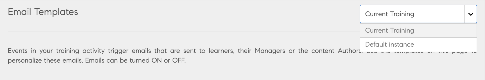
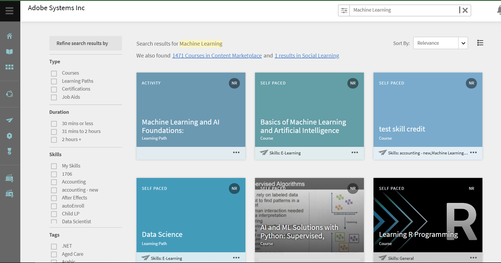
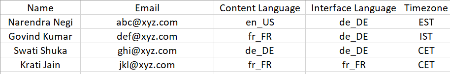

# 此版本的新增功能（2022年11月）

<!--
IN-PROGRESS

<https://helpx.adobe.com/learning-manager/whats-new-nov-2022.html>
-->

## 多個SSO設定

Adobe Learning Manager目前對內部使用者支援一種登入方法，對外部使用者支援一種登入方法。 這會在客戶將其員工和自己的客戶以及管道合作夥伴放在相同帳戶的情況下造成限制。

為了支援多種型別的使用者群組登入平台，Adobe Learning Manager現在透過多個SSO設定為內部和外部使用者支援多種登入方法。

如需詳細資訊，請參閱[多個SSO登入](/help/migrated/administrators/feature-summary/multiple-sso-logins.md)。

## 非登入功能支援

Adobe Learning Manager的原生入口網站現在支援以非登入方式存取培訓入口網站。

學習者現在可以探索及存取培訓網站、檢視各種可用的課程和內容，並決定登入以使用課程。

此功能可讓您更輕鬆地建立面對客戶的學習入口網站，讓學習者無需先登入即可瀏覽各種課程。

如需詳細資訊，請參閱學習者的[非登入體驗](/help/migrated/administrators/feature-summary/non-logged-in-experience-learners.md)。

## 訓練概觀頁面增強功能

訓練概觀頁面現在會提供更新的UI，讓學習者在使用課程時獲得更好的體驗。

其他增強功能包括：

* 為訓練建立書籤。
* 相關課程的建議。
* 課程和學習路徑的學習路徑資訊。
* 可點按的作者名稱。
* 階層連結讓導覽更輕鬆。

## 訓練概觀頁面增強功能

訓練概觀頁面現在會提供更新的UI，讓學習者在使用課程時獲得更好的體驗。

其他增強功能包括：

* 為訓練建立書籤。
* 相關課程的建議。
* 課程和學習路徑的學習路徑資訊。
* 可點按的作者名稱。
* 階層連結讓導覽更輕鬆。

## 作者設定檔頁面

作者設定檔頁面會顯示特定作者建立的所有培訓。

學習者可輕鬆找到作者專屬資訊，以及作者建立的所有培訓。

## 已建立書籤的培訓

學習者可以從課程圖磚或概觀頁面儲存（使用「儲存」按鈕）或將他們的訓練加入書籤。 所有書籤化課程都可在學習者首頁上取得。

## 播放器自訂

在此版本中，您可以自訂Fluidic Player以符合課程的品牌需求。

您可以根據內容需求顯示和隱藏各種播放器設定和選項，並根據內容型別向學習者授予控制權。 您可以將此變更同時套用至原生和Headless實作。

您可以變更的各種選項包括：

* 切換目錄
* 附註
* 語言
* 速度
* 註解
* 音量
* 播放控制項

## 學習者和經理的模擬

管理員可以啟動模擬工作階段，他們可在其學習者和管理員角色中，代表其帳戶中的任何使用者登入。

如需詳細資訊，請參閱[學習者與經理的模擬](/help/migrated/administrators/feature-summary/impersonation-learner-manager.md)。

## 其他增強功能

### 電子郵件的稽核記錄

管理員現在可以透過電子郵件稽核軌跡報告，存取從系統傳送的所有電子郵件記錄。

此記錄會擷取與過去30天內傳送的電子郵件相關的所有資料，並每天重新整理。 此外，報告還包含傳遞狀態、傳送者、接收者、主旨和內容中繼資料等資訊。

從報表>自訂報表> Excel報表>電子郵件報表下載報表。 系統會顯示通知，供您下載報表。

此報表包含下列欄位：

* 電子郵件觸發時間（UTC時區）
* 上次事件狀態時間（UTC時區）
* 傳遞狀態
* 接收者電子郵件
* 寄件者使用者ID
* 電子郵件主旨
* 實體型別
* 實體名稱
* 實體ID

### 輪候學習者通知

當作者新增執行個體時，作者會觸發電子郵件，通知輪候學習者其他執行個體。 學習者會收到變更的電子郵件。

### 執行個體層級電子郵件範本

您可以為培訓的每個例項自訂電子郵件。

在允許作者或管理員新增執行個體的地方，可以編輯個別執行個體的範本。

例如，如果課程有不同的對象型別，您可以據此變更電子郵件範本。



範本的優先順序如下：

1. 執行個體層級範本
2. 訓練層級範本
3. 帳戶層級範本

### 接受提交時講師評論

講師現在可以在接受學習者提交的同時新增註解。 在提交獲得講師核准後，學習者會收到電子郵件通知和應用程式內通知（如果已啟用）。 提交相關註解會顯示在學習者成績單中，以供管理員和學習者使用。

### 搜尋相關的增強功能

學習者的最近搜尋歷史記錄會顯示出來，以便他們檢視所有過去的搜尋。

所有正式和非正式學習（社交學習）的搜尋結果現在都是一致的。 其結果包括訓練、社交學習和內容市場比對。

搜尋更加聚焦且更具針對性，您可以在三個位置檢視搜尋結果：正式學習、社交學習以及內容市集。



#### 字詞導向搜尋

在此版本的Adobe Learning Manager中，我們已使用片語導向搜尋取代自動提示搜尋。

#### 最近的搜尋

學習者僅可在目前工作階段中檢視其最近的搜尋。

### 內容市集免費課程目錄

現成可用內容市集，提供一組精選高品質、免費的50種免費課程目錄，供學習者使用。

### 支援印尼語

Bahasa Indonesia現在已新增為學習者和管理員應用程式中的介面語言。

### 必填的作者欄位

建立課程時，「作者」欄位為必填欄位。

### 內容市集變更

* 新建立的試用帳戶將會在內容市集中列出50個免費課程的新目錄，以供使用者使用。
* 學習者現在可以檢視搜尋結果數量，以及重新導向至Content Marketplace的連結內嵌連結。

### 行動沈浸式變更

在此版本中，行動沈浸式網頁使用者可以執行任務，如下所示：

* 建立 — 輪詢帖子
* 編輯貼文 — 所有型別，RTE
* 電子商務工作流程。
* 預覽模組：學習者將以行動沈浸式體驗獲得模組預覽功能。 此變更可讓學習者在註冊課程前預覽模組。
* 複製URL。
* 刪除展示板。

### 縮放聯結器變更

JWT應用程式型別將在2023年6月被取代。 建議您建立伺服器對伺服器OAuth或OAuth應用程式，以取代帳戶中JWT應用程式的功能。

### 遊戲報告

在此版本中，您可以存取顯示已啟用遊戲化之各種課程的報告。

### 透過CSV匯入語言偏好設定

匯入CSV時，CSV包含介面語言、內容語言和時區作為欄位。

管理員也可以匯出包含上述相同欄位的報告。

* 介面語言
* 內容語言
* 時區

除了管理員以外，自訂管理員也可以匯出此報表。



#### 對本地化的影響

* 欄名稱無法本地化，且必須依原樣（介面語言、內容語言、時區）。
* 地區設定代碼不區分大小寫。
* 雖然提供國家/地區代碼沒有限制，但您只能指定語言代碼。 例如，&quot;it_IT&quot;和&quot;it&quot;都有效。
* 如果由於地區設定代碼不正確導致報告有任何差異，csv處理會照常繼續，不會影響csv中的其他記錄。 地區設定不正確之使用者的地區設定偏好設定不會更新。 其餘資料會更新。

## API變更和增強功能

### VC聯結器

如果使用管理員電子郵件ID來設定VC聯結器，則該特定管理員必須具有下列許可權：

* 建立會議
* 更新會議
* 擷取出席報告

在建立或更新VC會議時，講師必須在排定的會議結束時間後的30分鐘內結束會議。

### 書籤

新增下列API，用於將訓練概觀頁面上的課程加入書籤：

* 取得所有書籤： `primeapi/v2/bookmarks`
* 建立書籤： `primeapi/v2/learningObjects/{id}/bookmark`
* 刪除書籤： `primeapi/v2/learningObjects/{id}/bookmark`

### 透過移轉支援多地區設定的中繼資料和內容

針對平台支援的所有培訓型別（課程、學習路徑、模組、認證和工作輔助），現在可使用其他語言的額外欄，透過CSV檔案支援多語言移轉。

#### 必要條件

將移轉專案建立為整合管理員，然後與ALM支援團隊共用migrationProjectId，以便從後端啟用多語言環境標幟。

#### 多地區設定移轉物件的範圍

* 模組
* 課程
* 模組版本
* 認證
* 學習計畫
* 工作輔助
* 工作輔助版本

#### CSV規格

Adobe Learning Manager提供一組標準CSV規格，供啟用多地區設定的移轉之用。 最佳實務是在開始移轉程式前先通過這些CSV規格。 貴組織的整合管理員可以分析現有的資料格式，並對應這些格式以符合Learning Manager提供的CSV範本專案。

#### 支援多地區設定的變更

* module_version.csv和course_module.csv不支援module_version欄。
* 無法更新相同執行中的module_version （在相同執行中，無法以相同模組的兩個版本移轉模組）。
* 將內容或中繼資料更新視為來自module_version.csv的模組版本更新。
* 無法透過job_aid_version.csv支援Job_Aid_Version更新

### 撤銷驗證權杖和Cookie

Headless LMS應用程式在第一次登入時會保留refresh_token。 之後，refresh_token會用於為其使用者端應用程式產生access_token，以進行API呼叫。 同樣地，內容播放會使用oauth端點產生Cookie以管理涉及多個內容檔案的播放，以及這些檔案使用Cookie叫用的API呼叫。 oauth產生的Cookie與access_token的有效性相同，為7天。 產生Cookie後，就無法像一般的Web應用程式登出那樣將其清除。 Oauth Cookie和網頁應用程式Cookie是兩個不同的Cookie，而且彼此並不瞭解。

因此，為了清除Cookie，我們引進了新端點，它會撤銷refresh_token、Cookie以及Cookie和重新整理Token。

**詳細資料**

**端點**

`POST oauth/o/revoke`

**查詢引數**

* `cookie=true|false` — 表示需要撤銷Cookie
* `refresh_token=true|false` — 表示重新整理

**要求內文**

撤銷refresh_token或（refresh_token和Cookie）所需的內文

```
{
      "client_id": <>,
      "client_secret": <>,
      "refresh_token": <>
}
Body required for revoking oauth cookie only
{
      "access_token": <>
}
```

### API已設為公開

在此版本中，我們已公開一些API。

| API | 型別 | 說明 |
|---|---|---|
| /social/search | GET | 在社交中搜尋。 |
| /announcements | GET | 取得有關標題上指派給學習者的公告詳細資訊。 |
| /announcements/`{id}` | GET | 取得有關標題上指派給學習者的公告詳細資訊。 |
| /learningObjects/`{id}`/loResources/{loResourcesId} | GET | 需要提交檔案的resourceType &#39;Activity&#39;的loResource的上傳URL。 |
| /jobaid/`{jobAidId}`/jobAidDownloaded | GET | 設定工作輔助下載報告。 |
| /bulkimport/startrun | POST | 執行大量匯入。 |
| /bulkimport/cansync | GET | 同步處理大量匯入。 |
| /search | GET | DELETEMEBOB |
| /uploadInfo | GET | 取得內容更新相關資訊。 |
| /uploadSigner | GET | 取得to_sign內容的簽章。 |
| /avatar | POST | 以新影像更新學習者的顯示圖片影像。 |
| /avatar | DELETE | 刪除學習者的頭像影像。 |

### Salesforce應用程式

必須在Salesforce應用程式中啟用&#x200B;**忽略更高階學習課程**&#x200B;選項，以便同時檢視所有課程、學習計畫及憑證。

### 用於播放器自訂的API

在此版本中，我們已提供自訂播放器的API。 您可以：

* 啟動或載入播放器。
* 導覽至特定模組。
* 切換目錄。
* 變更語言。
* 關閉播放器。
* 播放、暫停、前進、後退、搜尋、變更音量或變更速度。
* 擷取從播放器發出的事件。

### 顯示學習者的輪候表位置

LO API底下的GET/enrollments/{id}/waitlistPosition API會擷取指定註冊之使用者的輪候表位置。

### 外部認證中的完成日期提交

/primeapi/v2/learningObjects/certification：xxxxx API將具有「completionDateSameAsApprovalDate」屬性，以表示憑證已針對學習者啟用「憑證完成日期」或未啟用，並附上true/false標幟。

### 取得學習對象預覽資料

已新增GET/preview/learningObjects/{id} API以取得學習物件的預覽資訊。

### 在設定檔中移動外部使用者

`PUT primeapi/v2/externalProfiles/{currentep}/users/{userid}?`呼叫可指定新的externalProfile ID，協助將使用者移至另一個外部設定檔。

### 將使用者新增至外部設定檔

`POST /externalProfiles/{id}/users`將外部使用者新增至外部設定檔。

## 發行說明

如需Learning Manager網頁應用程式和裝置應用程式目前和先前版本的詳細資訊，請參閱[發行說明](/help/migrated/release-note/release-notes.md)。

## 錯誤修正

若要檢視此更新中修正的錯誤，請參閱[錯誤修正清單](release-note/release-notes.md#bugs-fixed-in-this-release)。

## 系統需求

[Learning Manager系統需求](/help/migrated/system-requirements.md)
