# 此版本的新增功能（2023年4月）

## 適用於Microsoft Teams的Adobe Learning Manager應用程式

Microsoft Teams上新的Adobe Learning Manager應用程式旨在促進工作流程中的學習並促進社交學習。 學習者無需切換至瀏覽器，即可在Microsoft Teams平台中存取學習內容。 請聯絡您的CSAM，以取得MS Teams上Adobe Learning Manager應用程式的測試版。

如需詳細資訊，請參閱[Microsoft Teams的Adobe Learning Manager應用程式](/help/migrated/adobe-learning-manager-app-microsoft-teams.md)。

## 增強講師授課訓練(ILT)體驗

對講師引導培訓(ILT)體驗進行了幾項增強。 主要增強功能包括：根據位置篩選工作階段、切換執行個體(VILT)而不失去進度等功能、管理預約工作階段衝突的新「排程小幫手」、將「技能」附加至講師，以及根據技能選擇講師。

### 變更內容

* 「管理員」應用程式的「技能」頁面可讓您選擇上傳技能講師對應。
* 在「技能」頁面上，有一個新欄「講師」。 欄會顯示與技能相對的講師人數。 如果您按一下「講師」欄中的數字，您將會被重新導向快顯視窗，顯示指派給某項技能的講師人數。

如需詳細資訊，請參閱[指派技能給講師](/help/migrated/administrators/feature-summary/skills-levels.md#assign-skills-to-instructors)。

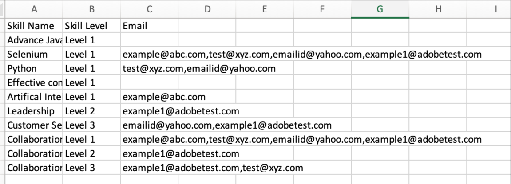

### 排程小幫手

管理預約講師和教室或虛擬教室中的衝突。 若您想在指派任何講師參加課程前，先瞭解講師可用的時間和日期，請使用「排程小幫手」。

作者、管理員和自訂管理員/作者可以使用「排程小幫手」。

如需詳細資訊，請參閱[排程小幫手](/help/migrated/authors/feature-summary/courses.md#scheduling-assistant)。

## 全新Adobe Learning Manager行動應用程式

適用於Android和iOS的全新Adobe Learning Manager行動應用程式，可讓學習者順暢地存取行動中的學習內容。 此應用程式可讓學習者使用行動裝置上的訓練，並於稍後在案頭上繼續進行。 行動應用程式支援通知、檔案上傳、輕鬆建立書籤和分享學習內容、社交學習等，為學習者提供額外彈性，並支援即時學習。

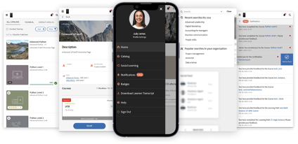

從Google Play商店和Apple App Store下載行動裝置。 系統會提示舊版應用程式的使用者下載並安裝新應用程式。

在此版本中，應用程式支援下列功能：

新的行動應用程式在此版本中支援下列主要功能：

* 增強型搜尋，包括顯示學習者最近的搜尋，以及在搜尋輸入方塊中顯示組織內的熱門搜尋。
* 可下載學習者成績單。
* 即興通知中心 — 以應用程式內通知的形式向學習者提供重要更新
* 排序及篩選「目錄/我的學習」頁面中學習物件的功能
* 將學習物件(LO)加入書籤的功能 — 已加入書籤的LO將可在學習者首頁的「由我儲存」區段中取得。
* 支援增強型LP
* 將行動介面語言變更為任何Adobe Learning Manager支援的語言的功能。
* 支援在外部認證、CR/VC工作階段和活動模組中進行檔案上傳。
* 可在應用程式內提交L1課程意見反應。
* 支援深層連結。
* 支援社交學習。
* 支援徽章。
* 支援外部使用者登入。

**此版本不支援的內容**

* 支援在行動應用程式內參加課程時，多次嘗試參加課程中的測驗模組。
* 可讓您指定搜尋引數的搜尋選項，例如課程中繼資料、標籤以及指定搜尋範圍的技能。
* 在行動應用程式中，以快顯視窗顯示給使用者的啟用管理員的自訂公告。
* 您無法在應用程式的技能頁面上新增技能。
* 離線時上課。

如需詳細資訊，請參閱[Adobe Learning Manager行動應用程式](/help/migrated/learners/feature-summary/ipad-android-tablet-users.md)。

## 使用任何二維碼掃描應用程式來掃描Learning Manager二維碼

Adobe Learning Manager現在透過原生相機應用程式，支援更符合使用者直覺的二維碼掃描方式，不必下載可掃描二維碼的應用程式。

為了支援先前的工作流程（您可以使用ALM應用程式的功能表掃描二維碼），在這個版本中，我們提供了有關如何切換至新工作流程的資訊。

QR程式碼工作流程已有改良，不再支援此版本之前產生的舊QR程式碼。 因此，如果您已使用舊版Learning Manager為在這個版本之後進行的教室或VC工作階段產生二維碼，則必須產生新的二維碼。

### 建議公告增強功能

在此版本中，我們已將建議從組織更新為根據使用者群組（學習者的一部分）的建議，以顯示學習者的相關課程。

管理員可以根據學習者的設定檔，將特定課程或培訓鎖定給學習者。 然後，學習者可以根據其所屬的設定檔來搜尋課程。

**變更的內容**

「公告」頁面上有一個選項，可顯示建議學員參加此課程或培訓的原因。

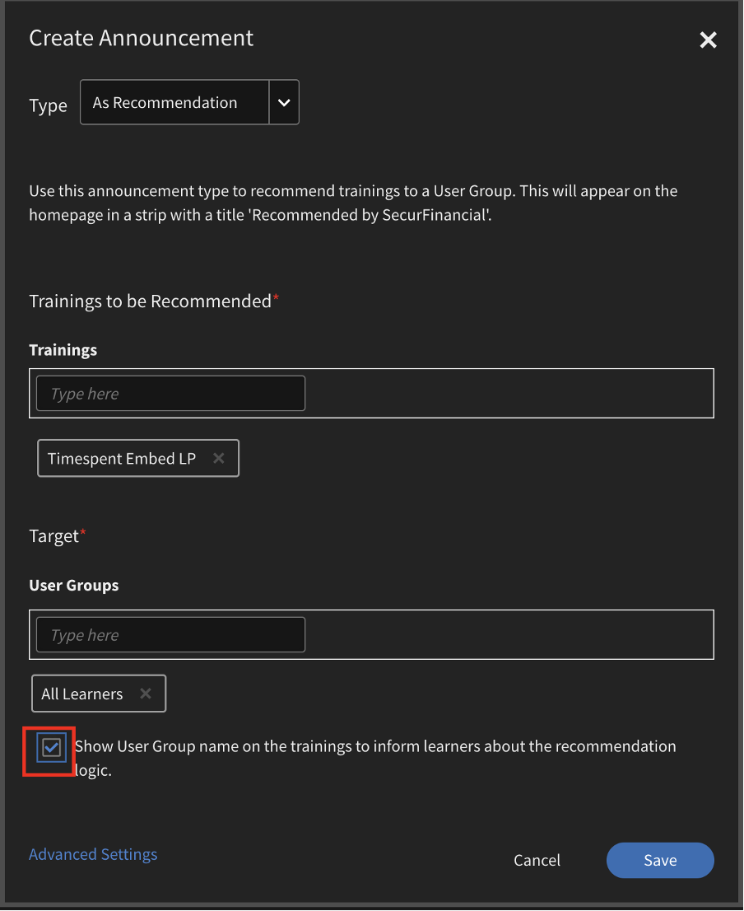

### 新的管理員設定

「管理員」在「設定>顯示篩選面板」中有一個名為「群組」的新選項。 群組啟用時，學習者首頁上會顯示群組篩選器。 然後，學習者可以選擇根據使用者群組顯示課程。

|   | 啟用選項時 | 停用選項時 |
|--- |--- |--- |
| 群組選項已啟用 | <ul><li> 在圖磚上顯示「使用者群組」以及目錄頁面的連結。</li><li> 「使用者群組」會顯示在目錄篩選器上。</li></ul> | <ul><li>圖磚上未顯示使用者群組的名稱。</li><li>該使用者群組未列在目錄篩選器中。</li></ul> |
| 群組選項已停用 | <ul><li>以純文字顯示課程圖磚上的使用者群組名稱。</li><li>該使用者群組未列在目錄篩選器中。</li></ul> | <ul><li>課程圖磚不會顯示文字或使用者群組的名稱。</li><li>該使用者群組未列在目錄篩選器中。</li></ul> |

**運作方式**

管理員可為任何使用者群組新增課程以建立公告並發佈。

學習者看到的是首頁上包含建議課程以及圖磚上課程連結的連結。

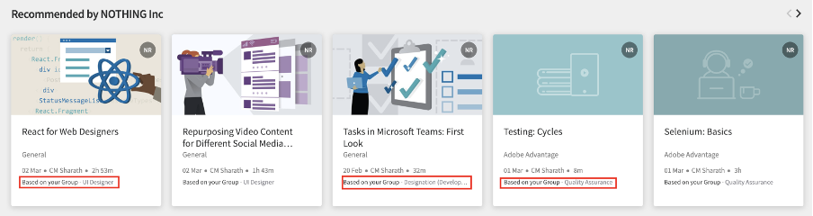

當學習者按一下連結或前往目錄按鈕時，學習者會重新導向至課程目錄頁面。 然後，學習者會檢視要根據目錄和「我的學習」頁面中的使用者群組進行篩選的使用者群組清單。

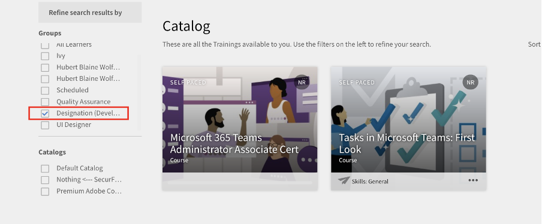

## 使用位置搜尋工作階段

### 管理教室位置

有時候，您會希望學習者根據位置在行事曆上篩選工作階段。 使用「教室位置」對話方塊或CSV檔案新增位置後，學習者即可進行篩選。

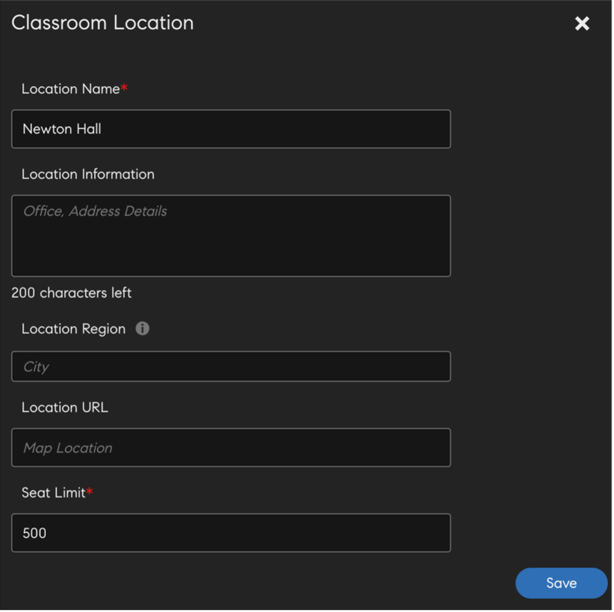

如需詳細資訊，請參閱[新增教室位置](/help/migrated/administrators/feature-summary/settings.md#classroom-locations)。

### 行事曆Widget

學習者可依位置篩選指派給您的工作階段。 前往行事曆Widget，選取「篩選工作階段」，然後選取位置。


行事曆上的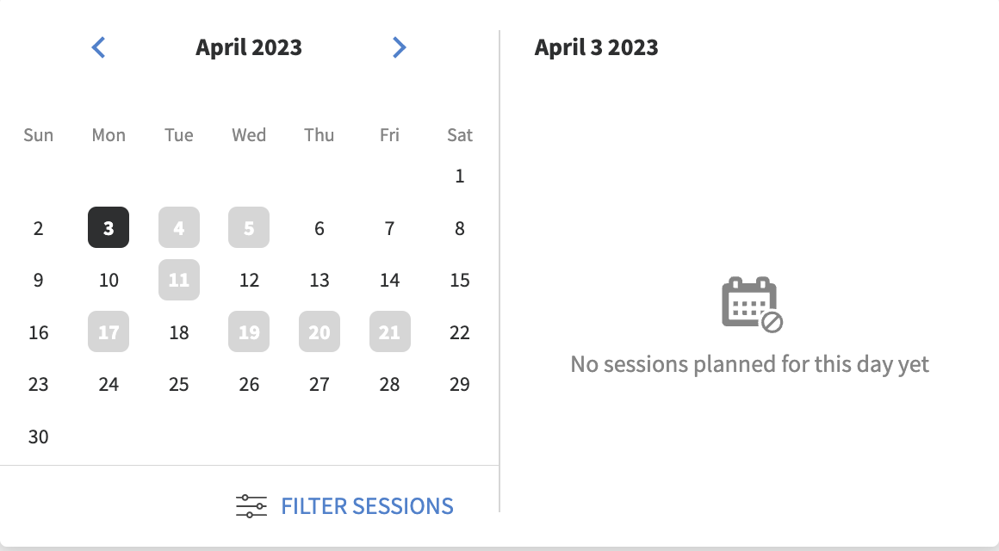

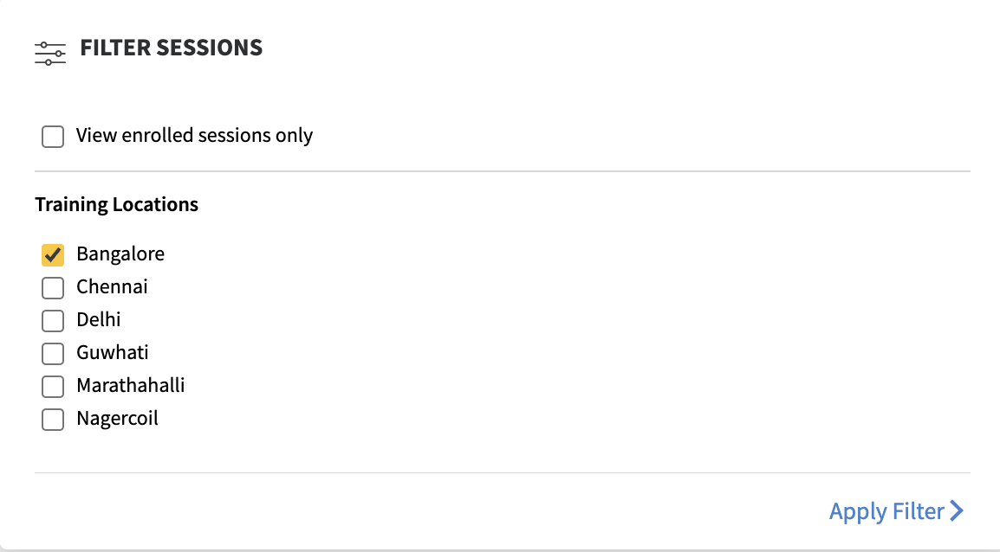的篩選器

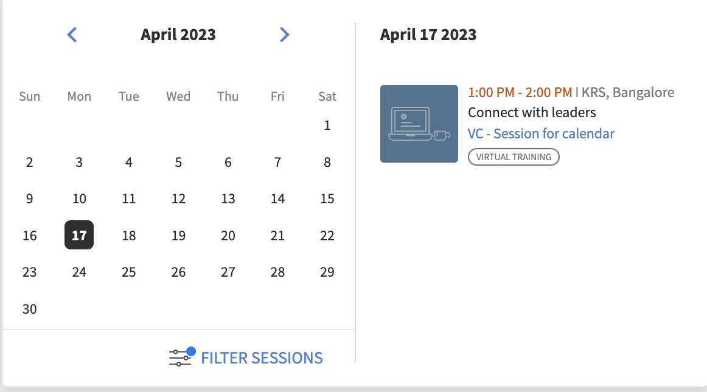

此外，如果作者在建立課程時新增了培訓位置，課程概觀頁面現在會顯示培訓位置。

### 管理員

身為管理員，您可以控制學習者是否可以根據位置篩選課程。 在「設定>一般」中，啟用或停用「培訓位置」。

如需詳細資訊，請參閱[系統管理員設定](/help/migrated/administrators/feature-summary/settings.md)。

## 試用體驗變更

建立試用帳戶後，內容市集中的課程會立即可供使用。

## 聊天機器人

使用聊天機器人與代理或多個代理聊天。 只有試用帳戶的管理員和自訂管理員可以使用此功能。

聊天機器人會：

* 歡迎您使用訊息。
* 提供產品資訊或產品示範的選項。
* 將聊天轉給即時代理程式。
* 保留您的聊天記錄。

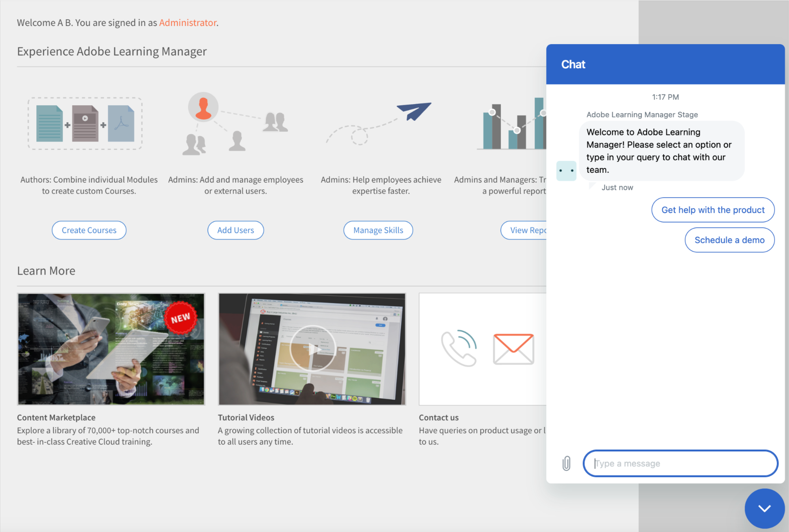

## 改善觀察檢查清單

作者現在可以選取「管理員」和「儲存/位置管理員」作為核取清單的稽核者。 管理員和商店/位置管理員（如果選取為稽核者）也可以檢視並完成其團隊的核取清單，而無需切換為講師角色。 講師會繼續檢閱檢查清單。 新的「稽核檢查清單」通知會傳送給執行個體的稽核者（指示者/經理），以取得註冊時的檢查清單。

如果管理員在檢查清單單元中新增為檢閱者，將可以在Manager應用程式中檢閱檢查清單。 講師應繼續依預期檢閱清單。

如需詳細資訊，請參閱[觀察檢查清單](/help/migrated/authors/feature-summary/courses.md#observation-checklist)。

## 其他增強功能

### 學習者搜尋

搜尋結果也分類為：

* Recent searches by you
* 您組織中的熱門搜尋

學習者的搜尋功能也得到改善。 學習者現在可以使用雙引號「……」、加號「+」和減號「 — 」運運算元，更快找到相關結果，並提供類似Google搜尋的體驗。

* 使用雙引號(「……」)搜尋包含精確短語或單字的課程。 例如，輸入「資料科學」會傳回以片語「資料科學」開頭的課程。
* 使用+運運算元，確保只顯示包含特定片語或字詞的結果。 例如，「電腦程式設計+python」只會顯示包含「python」一詞的電腦程式設計課程。
* 使用 — 運運算元，確保只顯示不包含特定片語或字詞的結果。 例如，電腦程式設計 — python會顯示所有電腦程式設計課程，但包含「python」一字的課程除外。

### 學習物件的衝突快顯視窗

當學習者有衝突的工作階段時，「概觀」頁面會顯示註冊快顯視窗。 如果從目錄頁面或概觀頁面註冊，且學習者已有衝突的工作階段，則會觸發具有衝突工作階段詳細資訊的衝突快顯。 即使學習者發生工作階段衝突，他們仍可註冊新的工作階段。

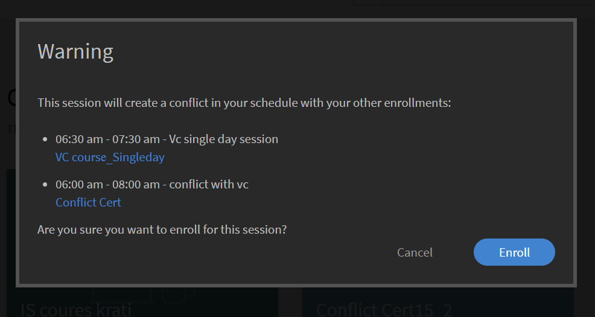

請注意，此訊息只是一個警告。 您仍可註冊課程。

### 建立範本

我們已新增名為「工作階段因取消註冊而取消」的新電子郵件範本。 當使用者取消註冊培訓時，他們會收到取消電子郵件。

### 課程的新定價功能

管理員現在可以在管理員設定>基本資訊區段中設定帳戶的貨幣。 管理員可同時指定符號和ISO貨幣代碼，例如USD、GBP等。 所有新帳戶的預設值為$。 此變更僅適用於非學習者應用程式。 管理員在作為學習者預覽課程時可以看到變更。 貨幣符號也會出現在學習者成績單和訓練報表中。

如需詳細資訊，請參閱[系統管理員設定](/help/migrated/administrators/feature-summary/settings.md)。

### 切換執行個體

已註冊特定課程執行個體的學習者，可檢視該課程所有可用執行個體清單，並切換至對其更適合的其他執行個體。 切換的原因可能是學習者錯過了前一個執行個體，或是新執行個體的工作階段時間更適合或是其他原因。

學習者在該課程中完成的任何進度、學習者測驗分數等，都會延續至新執行個體。 此功能主要用於教室和混合式課程，但我們應支援所有型別的課程，包括自訂進度課程。

無論執行個體切換設定為何，都會顯示「檢視所有執行個體」選項。 如果課程有一個以上的執行個體，學習者現在會檢視檢視所有執行個體的選項。

如果啟用「例項切換」選項，學習者可切換至各種例項，直到完成課程為止。 如果停用該選項，學習者將可檢視例項，但無法註冊課程。

當學習者選取&#x200B;**檢視所有執行個體**&#x200B;時，學習者可以看到所有課程執行個體。

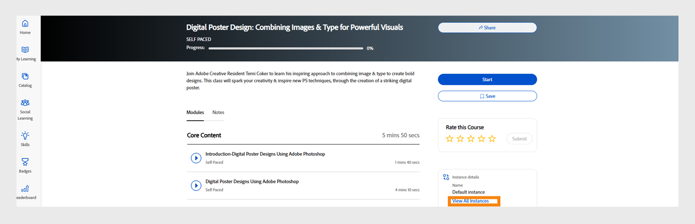

_從學習者主控台檢視所有執行個體頁面_

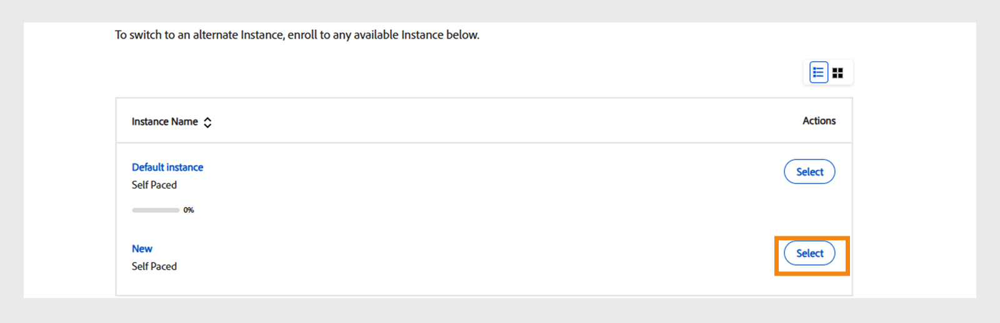
_從學習者頁面切換執行個體_

管理員可以切換學習者的例項。 從Admin Console選取課程，移至&#x200B;**[!UICONTROL Learners]**&#x200B;區段，選擇使用者，然後選取&#x200B;**[!UICONTROL Action]**&#x200B;按鈕。 然後，選取&#x200B;**[!UICONTROL Switch Instance]**&#x200B;並選擇所需的執行個體。

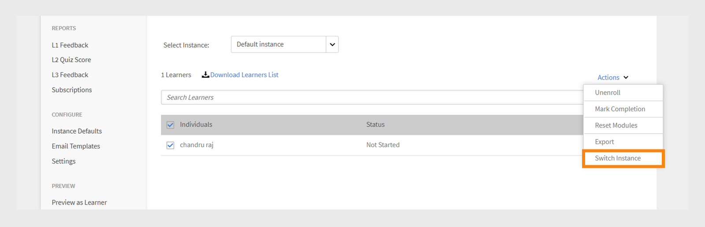
_從Admin Console切換執行個體_


_切換執行個體提示_

您必須從學習者或管理員應用程式完成課程的任何執行個體後，才能切換執行個體。

作者在建立課程時，可在啟用或停用「例項切換」之間切換。 執行個體切換器僅適用於免費課程。

如需詳細資訊，請參閱[執行個體組態](/help/migrated/authors/feature-summary/courses.md)。

**個學習者**

學習者可從輪候課程例項切換至其他例項。 他們也可以切換學習路徑或認證中的課程例項。

註冊學習路徑或認證後，他們可以在課程頁面上按一下「檢視執行個體」 ，然後切換執行個體。

>[!NOTE]
>
>Manager指派的註冊型別不支援執行個體切換設定。
>
>如果您要從Flex LP切換執行個體，進度將會傳送到另一個執行個體。

### 使用者稽核軌跡

「使用者稽核軌跡」報告將擷取切換執行個體（「從執行個體」切換至「到執行個體」）、依時間、日期等切換的學習者相關資訊。

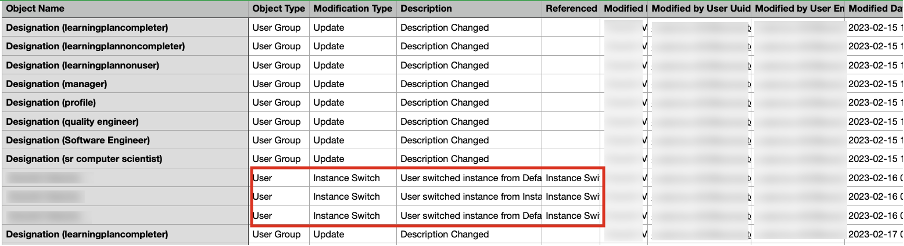

如需詳細資訊，請參閱[使用者稽核軌跡報告](/help/migrated/administrators/feature-summary/reports.md#useraudittrailreports)。

### 講師使用報告

此報表可擷取講師在授課指派工作階段時每天所花的時間（以分鐘為單位）。 報表可從選取的開始日期下載三個月。

如需詳細資訊，請參閱[講師使用報告](/help/migrated/administrators/feature-summary/reports.md#instructor-utilization-report)。

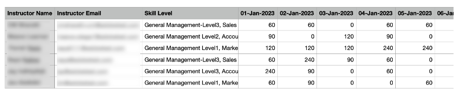

### 工作輔助報告

建立新報告，以追蹤帳戶中出現的工作輔助以及工作輔助的相關各種資訊，例如語言、型別、持續時間、作者、標籤等。

如需詳細資訊，請參閱[工作輔助註冊報告](/help/migrated/administrators/feature-summary/reports.md)。

### 向已註冊特定課程例項的學習者傳送目標隨選電子郵件

管理員和作者將能傳送目標性的隨選電子郵件通訊給已註冊特定課程執行個體的學習者。 已為「課程」和「學習計畫」新增傳送執行個體層級電子郵件的選項。


*傳送執行個體層級的電子郵件*

在「建立宣告」對話方塊中，預設會選取「型別」選項(Type as Email and Training)以及執行個體。 指定主旨、輸入訊息，然後按一下「儲存」。

如需詳細資訊，請參閱[執行個體層級的電子郵件](/help/migrated/administrators/feature-summary/courses.md#send-instance-level-emails)。

### 管理員透過公告向學習者傳送目標性的臨時電子郵件

對於管理員，已新增了新型別的公告 — 「作為電子郵件」。 這可用來傳送目標隨選電子郵件給所選使用者群組的學習者或註冊特定訓練的學習者。

如果自訂管理員和作者擁有必要的存取權，他們也可以在執行個體層級檢視此選項。

如需詳細資訊，請參閱[公告](/help/migrated/administrators/feature-summary/announcements.md#as-email)。

### 新電子郵件範本

在此版本中，我們已新增略過層級管理員的電子郵件範本。 這些範本適用於經理收到有關其第二級報告遺漏任何課程、學習路徑或認證截止日期的電子郵件時。 此外，當他們的第二層級報告接近這些課程、學習路徑或認證的任何完成截止日期時，他們將會收到電子郵件。

* 課程完成的略過層級提升 — 截止日期前
* 錯過的課程截止日期跳過層級提升
* 學習路徑完成的略過層級提升 — 截止日期前
* 錯過的學習路徑期限的略過層級提升
* 認證完成的略過層級提升 — 截止日期前
* 錯過的認證期限的略過層級提升

這些選項預設為啟用。

## 此版本中的API變更

### 新報告

我們已將新屬性jobType新增至jobs API。 屬性接受下列值：

* **generateInstructorUtilisationReport**：傳回講師的使用情況報告。
* **generateJobAidMetadataReport**：傳回工作輔助報告的中繼資料。

**端點**： POST /primeapi/v2/jobs

generateJobAidMetadataReport請求：

```javascript {line-numbers="true"}
{ 
    "data": { 
        "type": "job", 
            "attributes": { 
                "description": "description of your choice", 
                "jobType": "generateJobAidMetadataReport" 
            } 
    }
} 
```

generateJobAidMetadataReport回應：

```javascript {line-numbers="true"}
{ 
  "links": { 
    "self": "https://learningmanagerstage1.adobe.com/primeapi/v2/jobs" 
  }, 
  "data": { 
    "id": "31126", 
    "type": "job", 
    "attributes": { 
      "dateCreated": "2023-02-28T18:36:48.000Z", 
      "description": "description of your choice", 
      "jobType": "generateJobAidMetadataReport", 
      "status": { 
        "code": "Submitted" 
      } 
    } 
  } 
} 
```

generateInstructorUtilisationReport要求：

```javascript {line-numbers="true"}
{
    "data": { 
        "type": "job", 
            "attributes": { 
                "description": "description of your choice", 
                "jobType": "generateInstructorUtilisationReport", 
                "payload": { 
                    "year": "2023", 
                    "month": "2" 
                } 
            } 
    } 
}
```

generateInstructorUtilisationReport回應：

```javascript {line-numbers="true"}
{ 
  "links": { 
    "self": "https://learningmanagerstage1.adobe.com/primeapi/v2/jobs" 
  }, 
  "data": { 
    "id": "31130", 
    "type": "job", 
    "attributes": { 
      "dateCreated": "2023-02-28T18:43:43.000Z", 
      "description": "description of your choice", 
      "jobType": "generateInstructorUtilisationReport", 
      "payload": { 
        "month": "2", 
        "year": "2023" 
      }, 
      "status": { 
        "code": "Submitted" 
      } 
    } 
} 
} 
```

如需詳細資訊，請參閱[API參考檔案](https://captivateprime.adobe.com/docs/primeapi/v2/)。

### 學習者執行個體切換

註冊學習者API可讓您存取所有可用的執行個體，並切換至課程的不同執行個體。 新執行個體會繼承上一個課程的所有屬性。

我們已新增要求資訊的新查詢引數enrollmentID。

>[!NOTE]
>
>只有以下情況才需要內文：
>
>1. 彈性學習計畫
>1. 課程例項切換

### 帳戶

回應包含新屬性currencyCode。

**端點**： GET /primeapi/v2/account

### 講師的技能與技能層級關聯

我們引進了新功能，此功能可擷取講師的技能專業知識，即為每個講師維護其專業知識，並可用於搜尋和篩選等下游操作。

已新增下列屬性：

* 講師技能
* instructorSkillLevel

**端點**： GET /primeapi/v2/account /&lt;account_id>/instructorskill/search

### ILT變更

| 說明 | 新引數/回應 | 端點 |
|--- |--- |--- |
| 列出所有城市 | filter.cityName=true/false | GET /primeapi/v2/data |
| 搜尋和篩選城市 | filter.cityName=city_name<br>也支援以逗號分隔的城市清單 |
| GET /primeapi/v2/search |
| 回房詳細資料 | include=room | GET /primeapi/v2/users/`<id>`/calendar |
| 學習物件以篩選城市 | filter.cityName=city_name <br>也支援以逗號分隔的城市清單。 | GET /primeapi/v2/learningObjects |
| 新增城市面板 | 回應包含新屬性filterPanelSetting=true/false。 | GET /primeapi/v2/account |

### 有衝突的學習者工作階段

擷取執行個體所有衝突工作階段的清單。

我們已新增這些欄位：

* loID
* loInstanceId

**端點**： `GET /primeapi/v2/learningObjects/{loId}/instances/loInstanceId/conflictingSessions?page[offset]=0&page[limit]=10`

### VC中的教室

執行VC課程的位置型搜尋。 資源模型中會出現新的屬性roomLocation，以指出建立VC課程時提供的自由格式位置。

我們已進行下列變更：

**LO**

learningObjects API的新查詢引數filter.loFormat=Virtual Classroom。

**端點**： GET /primeapi/v2/learningObjects

**行事曆**

日曆API的新查詢引數filter.allSessions=false。 引數的預設值為false。 如果為true，則API會傳回學習者的所有日曆工作階段。

**端點**： `GET /primeapi/v2/users/<id>/calendar?filter.allSessions=false`

### 學習者搜尋記錄

**搜尋**

新的查詢引數persistSearchHistory。 預設值為true，會持續查詢以取得搜尋建議。

**端點**： GET /primeapi/v2/search？persistSearchHistory=true

**建議**

新的查詢引數suggestionType。 接受的值包括：

* learnerHistory （預設）
* accounthistory

**端點**： GET /primeapi/v2/search/suggestions/？suggestionType=learnerHistory

### 使用者群組篩選

學習物件和搜尋API將提供篩選器，透過指定的篩選器擷取屬於使用者群組的所有學習物件。 API支援篩選器為逗號分隔清單。

我們提供新的篩選器filter.lo.announcementGroups，可擷取屬於所提供之使用者群組篩選器的所有LO。

這可以是以逗號分隔的多值清單，以取得彈性，處理將依據多個群組之間的「OR」操作。 亦即，取得指定使用者群組下的所有LO。

### 自訂群組

您可以透過API在自訂群組新增及移除外部使用者。

**張貼內容**

POST /userGroups/{id}/users

**內文**

```javascript {line-numbers="true"}
"data": [ 
     { 
           "type": "user",  
           "id": "{id}"   
     }  
]  
```

**DELETE**

DELETE /userGroups/{id}/users

**內文**

```javascript {line-numbers="true"}
"data": [  
     {  
          "type": "user",  
           "id": "11218291"  
     }  
]   
```

### 在學習者應用程式中公告針對損失的使用者群組篩選

* GET /users/{userId}/userGroups API有新引數filter.announcedGroupsOnly，此引數採用布林值(true/false)。 這只會篩選管理員公佈的使用者群組。 此引數的預設值為false。
* GET /learningObjects API有一個新引數filter.announcedGroups，可接受宣告群組ID以篩選結果。
* GET /search API有一個新引數filter.announcedGroups ，此引數接受宣告群組ID以篩選結果。

下列範例回應：

```javascript {line-numbers="true"}
{
  "links": {
    "self": "https://learningmanagerstage1.adobe.com/primeapi/v2/recommendations?page[offset]=0&page[limit]=10&strip=1&filter.recType=announcement&filter.loTypes=course"
  },
  "data": [
    {
      "id": "course:5836866_10855885_recommendation",
      "type": "recommendation",
      "attributes": {
        "reason": [
          "Based on your Group - UGforAnnouncement"
        ],
        "reasonModel": [
          {
            "modelId": 1781592,
            "modelType": "userGroup",
            "modelValues": {
              "group_name": "UGforAnnouncement"
            },
            "template": "Based on your Group - {{group_name}}"
          }
        ]
      },
      "relationships": {
        "learningObject": {
          "data": {
            "id": "course:5836866",
            "type": "learningObject"
          }
        }
      }
    },
    {
      "id": "course:7013328_10855885_recommendation",
      "type": "recommendation",
      "attributes": {
        "reason": [
          "Based on your Group - All Learners"
        ],
        "reasonModel": [
          {
            "modelId": 1410724,
            "modelType": "userGroup",
            "modelValues": {
              "group_name": "All Learners"
            },
            "template": "Based on your Group - {{group_name}}"
          }
        ]
      },
      "relationships": {
        "learningObject": {
          "data": {
            "id": "course:7013328",
            "type": "learningObject"
          }
        }
      }
    },
    {
      "id": "course:6408989_10855885_recommendation",
      "type": "recommendation",
      "attributes": {},
      "relationships": {
        "learningObject": {
          "data": {
            "id": "course:6408989",
            "type": "learningObject"
          }
        }
      }
    },
    {
      "id": "course:6409761_10855885_recommendation",
      "type": "recommendation",
      "attributes": {},
      "relationships": {
        "learningObject": {
          "data": {
            "id": "course:6409761",
            "type": "learningObject"
          }
        }
      }
    },
    {
      "id": "course:6979586_10855885_recommendation",
      "type": "recommendation",
      "attributes": {},
      "relationships": {
        "learningObject": {
          "data": {
            "id": "course:6979586",
            "type": "learningObject"
          }
        }
      }
    }
  ]
}
```

## 發行說明

如需有關最新和舊版Learning Manager網頁應用程式和裝置應用程式的資訊，請參閱[發行說明](/help/migrated/release-note/release-notes.md)。

## 錯誤修正

若要檢視此更新中修正的錯誤，請參閱[錯誤修正清單](release-note/release-notes.md#bugs-fixed-in-this-release)。

## 系統需求

[Learning Manager系統需求](/help/migrated/system-requirements.md)
