# 本次發布（2023年4月）有什麼新內容

## Microsoft Teams 的 Adobe Learning Manager 應用程式

Microsoft Teams 上全新的 Adobe Learning Manager 應用程式旨在促進工作流程中的學習並促進社交學習。 學習者將能在 Microsoft Teams 平台內存取學習內容，無需切換到瀏覽器。 請聯絡您的 CSAM，了解 MS Teams 上 Adobe Learning Manager 應用程式的測試版。

欲了解更多資訊，請參閱 [Microsoft Teams](/help/migrated/adobe-learning-manager-app-microsoft-teams.md) 的 Adobe Learning Manager 應用程式。

## 教官主導訓練（ILT）體驗的提升

教官主導訓練（ILT）體驗進行了多項改進。 主要改進包括：依地點篩選課程、可切換實例（VILT）而不損失進度、新增「排程助理」以管理預約課程衝突、能將「技能」附加給講師，並依技能選擇講師。

### 改變了什麼

* 管理員應用程式的技能頁面有上傳技能-講師對應的選項。
* 在技能頁面上，新增了一個專欄「講師」。 該欄顯示該技能對比的教練人數。 如果你點擊「講師」欄位中的數字，會跳出一個視窗，顯示分配給某項技能的講師人數。

欲了解更多資訊，請參閱 [「指派技能給講師](/help/migrated/administrators/feature-summary/skills-levels.md#assign-skills-to-instructors)」。

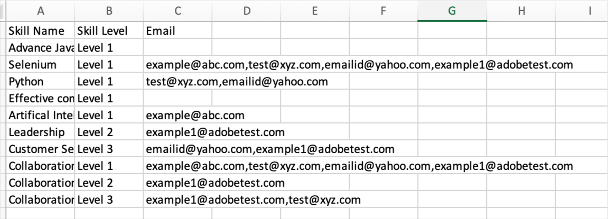

### 排程助理

處理安排教師與教室或虛擬教室的衝突。 如果你想知道任何講師在分配課程前的時間和日期，請使用排程助理。

作者、管理員及自訂管理員/作者皆可使用排程助理。

欲了解更多資訊，請參閱 [排程助理](/help/migrated/authors/feature-summary/courses.md#scheduling-assistant)。

## 全新 Adobe Learning Manager 行動應用程式

一款全新的 Adobe Learning Manager 行動應用程式，適用於 Android 和 iOS，讓學習者隨時隨地都能順利學習。 該應用程式讓學習者能在行動裝置上接受訓練，之後再在桌面端繼續進行。 支援通知、檔案上傳、輕鬆書籤與分享學習內容、社交學習等功能，為學習者提供更多彈性，並支援即時學習。

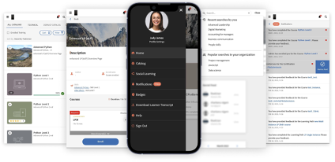

請從 Google Play 商店和 Apple App Store 下載手機。 舊版應用程式的使用者將被提示下載並安裝新應用程式。

在此版本中，應用程式支援以下功能：

新手機應用程式在此版本中支援以下關鍵功能：

* 強化搜尋，包括在搜尋輸入框中顯示學習者近期搜尋及組織內熱門搜尋。
* 能夠下載學習者成績單。
* 即興通知中心 - 在應用程式內以通知形式向學習者提供重要更新
* 能夠在目錄/我的學習頁面中排序和篩選學習物件
* 學習物件（LO）書籤功能 - 書籤的學習對象可在學習者首頁的「由我保存」區塊中提供。
* 強化版 LP 的支援
* 能夠將行動介面語言更改為任何 Adobe Learning Manager 支援的語言。
* 支援外部認證、CR/VC 會議及活動模組中的檔案上傳。
* 能在應用程式內提交 L1 課程回饋。
* 支援深度連結。
* 支持社會學習。
* 徽章支援。
* 支援外部使用者登入。

**本版本不支援的內容**

* 支援在行動應用程式內進行課程時，多次嘗試測驗模組。
* 搜尋選項允許你指定搜尋參數，例如課程元資料、標籤和技能，以指定搜尋範圍。
* 管理員啟用的自訂公告，會在行動應用程式中以彈出視窗顯示給使用者。
* 你不能在應用程式的技能頁面新增技能。
* 離線修課。

欲了解更多資訊，請參閱 [Adobe Learning Manager 行動應用程式](/help/migrated/learners/feature-summary/ipad-android-tablet-users.md)。

## 使用任何掃描 QR 碼的應用程式來掃描 Learning Manager 的 QR 碼

Adobe Learning Manager 現在支援一種更直覺的掃描方式，利用原生相機應用程式，無需下載掃描 QR 碼的應用程式。

為了支援先前的工作流程，即可透過 ALM 應用程式選單掃描 QR 碼，本版本中我們提供了如何切換到新工作流程的資訊。

隨著 QR 碼工作流程的改進，先前產生的舊 QR 碼將不再支援。 因此，如果你用舊版 Learning Manager 為本版本後的教室或虛擬化工作產生 QR 碼，那麼你必須產生新的 QR 碼。

### 推薦公告增強功能

在本版本中，我們將推薦條從組織更新為基於使用者群組的推薦，該使用者群體是學習者所屬，以顯示學習者相關的課程。

管理員可根據學習者的個人資料，針對特定課程或培訓對象。 學習者可以根據所屬的個人檔案搜尋課程。

**改變了什麼**

公告頁面有一個選項，會告訴學習者為何會推薦此課程或訓練。

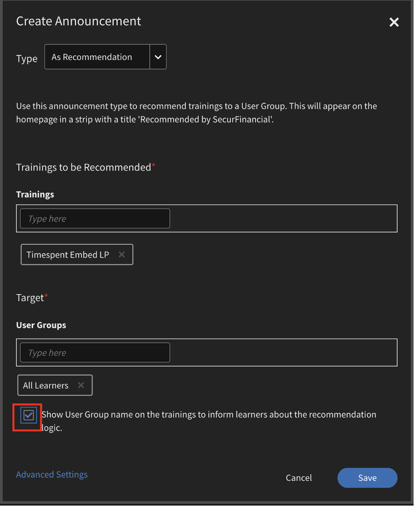

### 新管理員設定

管理員在設定中新增了一個叫做「群組」的選項，>顯示篩選面板。 啟用群組後，學習者首頁的群組篩選器會顯示。 學習者可依使用者群組選擇顯示課程內容。

|   | 當該選項啟用時 | 當該選項被關閉時 |
|--- |--- |--- |
| 群組選項已啟用 | <ul><li> 在磁貼上顯示使用者群組及目錄頁面連結。</li><li> 使用者群組會顯示在目錄篩選器上。</li></ul> | <ul><li>使用者群組名稱不會顯示在磁貼上。</li><li>使用者群組不會被列入目錄篩選器。</li></ul> |
| 群組選項已停用 | <ul><li>在課程磁磚上以純文字顯示使用者群組名稱。</li><li>使用者群組不會被列入目錄篩選器。</li></ul> | <ul><li>課程圖塊不會顯示使用者群組的文字或名稱。</li><li>使用者群組不會被列入目錄篩選器。</li></ul> |

**運作原理**

管理員會為任一使用者群組新增課程並發布公告。

學習者看到的是首頁上的推薦課程條帶，以及磁貼上的課程連結。

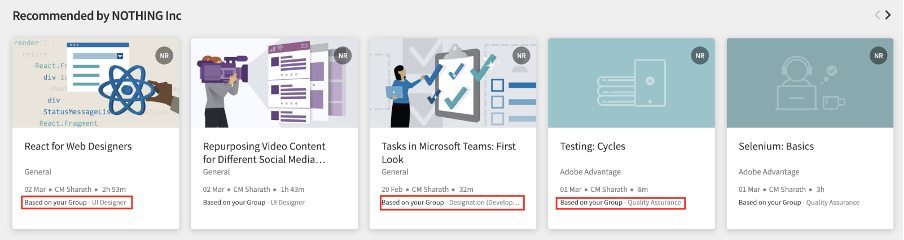

當學習者點擊連結或「前往目錄」按鈕時，學習者會被導向課程目錄頁面。 學習者接著查看目錄和「我的學習」頁面中使用者群組的篩選功能。

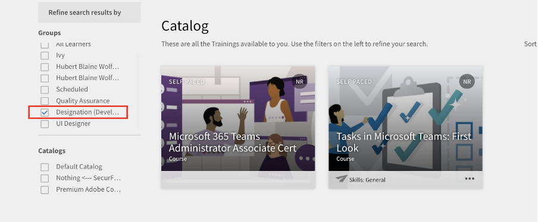

## 使用地點搜尋會話

### 管理教室地點

有時候，你會希望學習者根據地點在行事曆上篩選課程。 在使用教室位置對話框或 CSV 檔案新增地點後，學習者即可進行篩選。

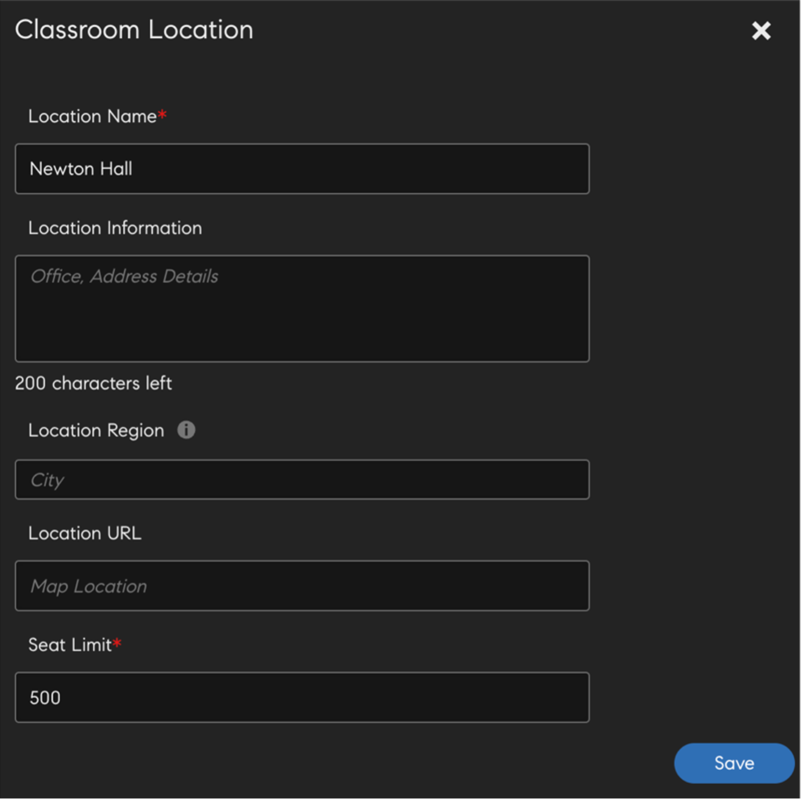

欲了解更多資訊，請參閱 [「新增教室地點](/help/migrated/administrators/feature-summary/settings.md#classroom-locations)」。

### 行事曆小工具

作為學習者，你可以依地點篩選分配給你的課程。 進入行事曆小工具，選擇篩選會話，並選擇地點。

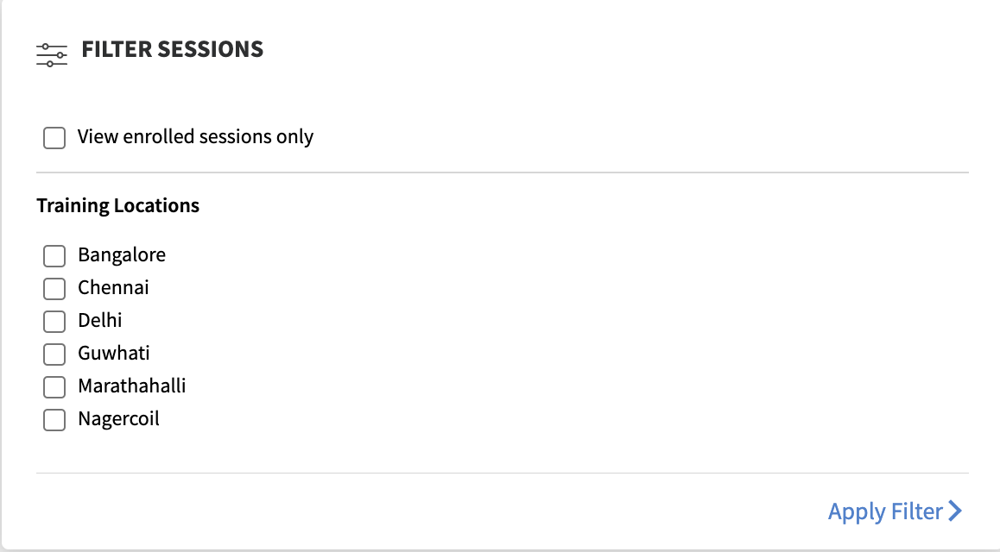

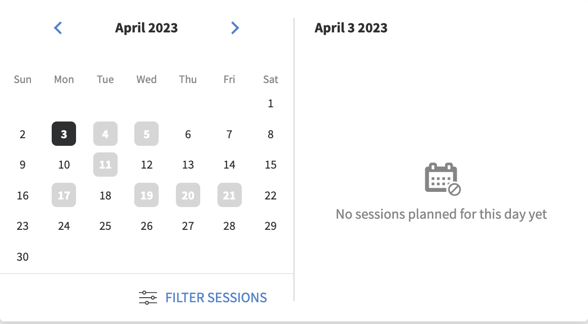

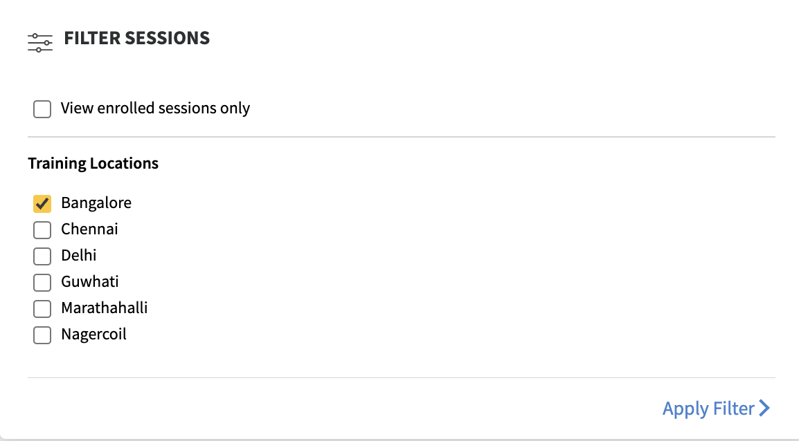

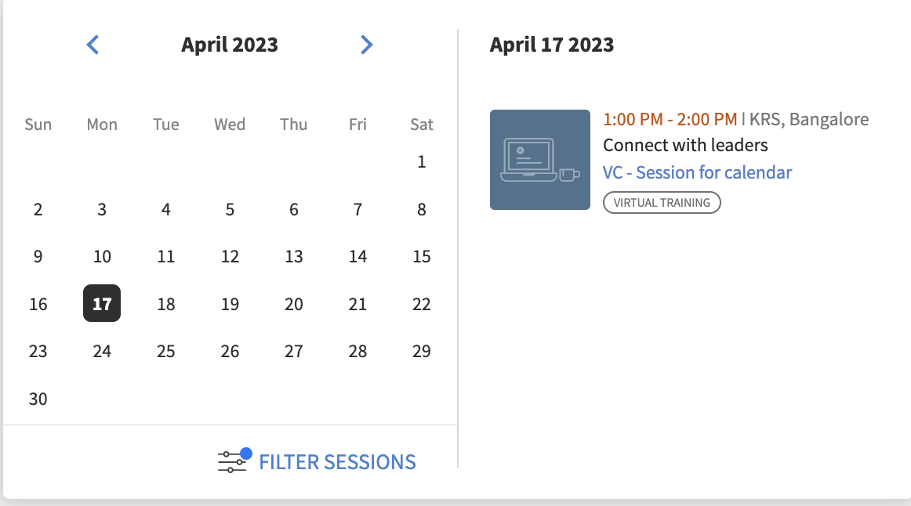

此外，如果作者在建立課程時新增了該地點，訓練地點現在也會顯示在課程總覽頁面上。

### 行政長官

作為管理員，你可以控制學習者是否能依地點篩選課程。 在設定>一般中，啟用或停用訓練地點。

欲了解更多資訊，請參閱 [管理員設定](/help/migrated/administrators/feature-summary/settings.md)。

## 審判經驗變更

試用帳號建立後，內容市集的課程會立即開放。

## 聊天機器人

使用聊天機器人與一位或多位客服人員聊天。 只有試用帳號的管理員及自訂管理員才能使用此功能。

聊天機器人將：

* 歡迎你，帶著一句話。
* 提供產品資訊或產品展示的選項。
* 把聊天轉接給真人客服。
* 保留你的聊天紀錄。

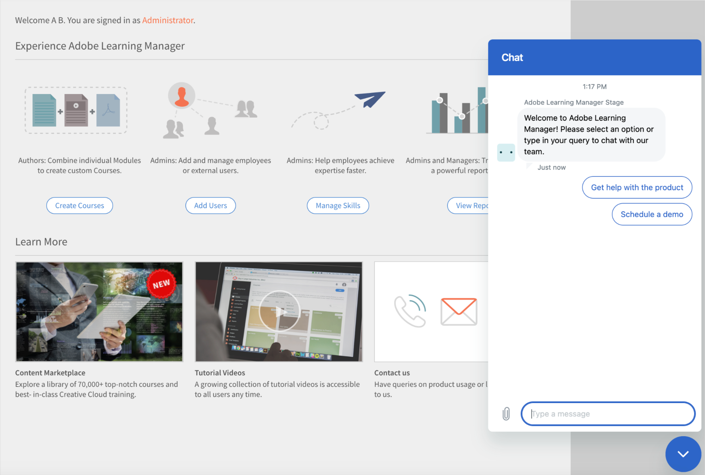

## 觀測檢查清單的改進

作者現在可以選擇經理和門市/地點經理作為檢查清單的審查員。 經理及門市/地點經理若被選為審查員，也能查看並完成團隊的檢查清單，而無需切換到講師角色。 講師持續檢視檢查清單。 一份新的「審查清單」通知會發送給註冊檢查清單實例的審查員（講師/經理）。

如果在檢查清單模組中新增經理為審查員，他們就能在管理員應用程式中檢視檢查清單。 講師應依預期持續檢視檢查清單。

欲了解更多資訊，請參閱 [觀察檢查表](/help/migrated/authors/feature-summary/courses.md#observation-checklist)。

## 其他強化

### 學習者搜尋

搜尋結果也依以下分類：

* Recent searches by you
* 貴組織中熱門搜尋

搜尋功能也為學習者提供了改進。 學習者現在可以使用雙引號「...」加上「+」和減「-」運算符，更快找到相關結果，並享有類似 Google 搜尋的體驗。

* 使用雙引號（「...」）搜尋包含該片語或單字的課程。 例如，輸入「資料科學」會回傳以「資料科學」開頭的課程。
* 使用+運算子確保只顯示包含特定片語或單字的結果。 例如，Computer Programming + Python 只會顯示包含「python」這個詞的電腦程式設計課程。
* 使用-操作符確保只顯示那些不含特定片語或單字的結果。 例如，Computer Programming -python 會顯示除包含「python」一詞外的所有電腦程式設計課程。

### 學習物件的衝突彈出視窗

當學習者有衝突的課程時，概覽頁面會顯示報名的彈出視窗。 如果從目錄頁面或總覽頁面註冊，且學習者已經有衝突的課程，則會觸發衝突的彈窗，包含衝突的課程細節。 即使學習者有衝突的課程，他們仍可註冊新的課程。

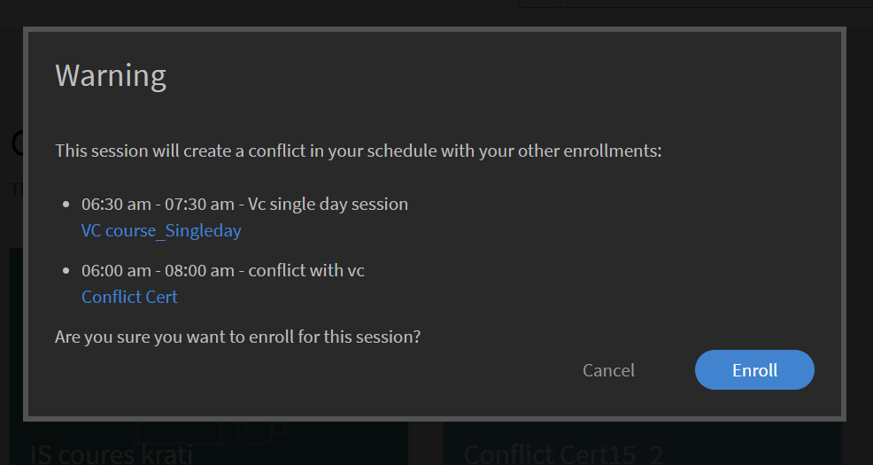

請注意，這則訊息只是警告。 你仍然可以報名修課。

### 新範本

我們新增了一個名為「因取消報名而取消的會次」電子郵件範本。 當使用者被取消註冊訓練時，會收到取消郵件。

### 課程新定價功能

管理員現在可以在管理員設定>基本資訊區塊中設定帳戶的貨幣。 管理員可以指定符號以及 ISO 貨幣代碼，例如美元、英鎊等。 所有新帳號的預設值都是 $。 此變更僅適用於非學習型應用程式。 管理員在預覽課程時可以看到這些變化。 貨幣符號也出現在學員成績單與訓練報告中。

欲了解更多資訊，請參閱 [管理員設定](/help/migrated/administrators/feature-summary/settings.md)。

### 交換實例

註冊在特定課程實例的學習者可以查看該課程所有可用實例的清單，並切換到更適合自己的實例。 切換的原因可能是學習者錯過了之前的實例，或是新實例的課程時間更合適，或是其他原因。

學習者在課程中取得的任何進展、學習者測驗分數等，都會帶入新的實例。 此功能主要針對教室與混合課程設計，但我們也會支援各類課程，包括自學進度的課程。

「檢視所有實例」這個選項不論實例切換設定如何都會出現。 學習者現在可以看到一個選項，可以查看所有實例，若同一課程有多個實例。

若啟用實例切換選項，學習者可切換至多個實例直到完成課程。 若該選項被停用，學習者可查看實例，但無法註冊課程。

當學習者選擇 **「檢視所有實例**」時，就能看到所有課程實例。


_從學習者主控台查看所有實例頁面_

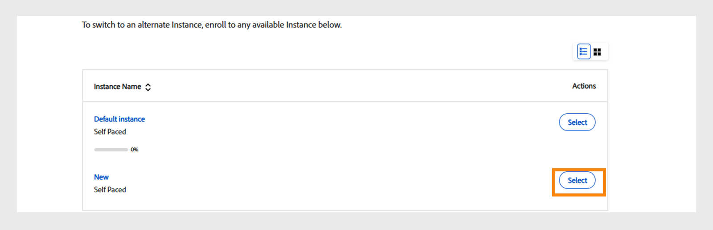
_從學習者頁面切換實例_

管理員可以為學習者切換實例。 從管理控制台選擇課程，進入該 **[!UICONTROL Learners]** 區塊，選擇使用者，然後點擊按鈕 **[!UICONTROL Action]** 。 然後，選擇 **[!UICONTROL Switch Instance]** 並選擇想要的實例。


_從管理控制台切換實例_


_切換實例提示_

在學習者或管理應用程式完成課程的任何實例之前，你無法切換實例。

作者在建立課程時可以切換啟用或停用「實例切換」。 實例切換僅適用於免費課程。

更多資訊請參見 [實例配置](/help/migrated/authors/feature-summary/courses.md)。

**學習者**

學習者可以從候補課程實例切換到其他實例。 他們也可以在學習路徑或認證中切換課程實例。

註冊學習路徑或認證後，在課程頁面上，他們可以點擊「檢視實例」，然後切換實例。

>[!NOTE]
>
>實例交換器設定不支援經理指定註冊類型。
>
>如果你是從 Flex LP 轉換實例，進度會被帶到另一個實例。

### 使用者稽核追蹤

使用者稽核追蹤報告將記錄學習者在「從實例」切換到「實例」的資訊，並依時間、日期等方式切換。

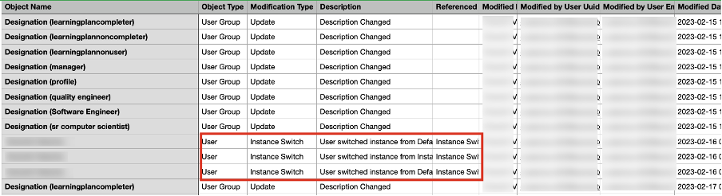

欲了解更多資訊，請參閱 [用戶稽核追蹤報告](/help/migrated/administrators/feature-summary/reports.md#useraudittrailreports)。

### 講師使用報告

本報告記錄了教師每日教授指定課程所花費的時間（以分鐘計）。 報告可於選定開始日期起三個月內下載。

欲了解更多資訊，請參閱 [講師利用報告](/help/migrated/administrators/feature-summary/reports.md#instructor-utilization-report)。

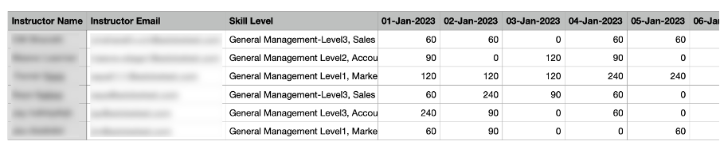

### 工作輔助報告

一個新報告用來追蹤帳戶中存在的工作輔助工具，以及關於這些輔助工具的各種資訊，例如語言、類型、長度、作者、標籤等等。

欲了解更多資訊，請參閱 [就業輔助工具登記報告](/help/migrated/administrators/feature-summary/reports.md)。

### 針對特定課程實例註冊的學習者發送針對性的臨時郵件

管理員與作者將能針對特定課程實例的學習者發送針對性的臨時電子郵件通訊。 課程與學習計畫新增了發送實例級電子郵件的選項。

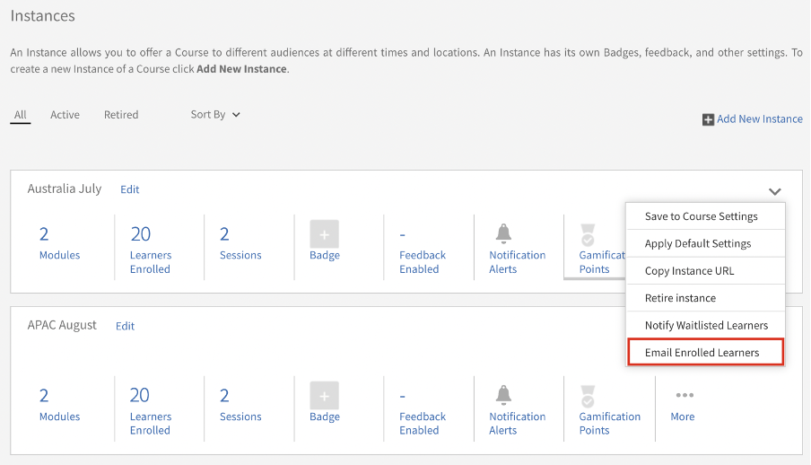

*發送實例層級電子郵件*

在建立公告對話框中，預設選擇「輸入為電子郵件」和「培訓」以及實例。 請指定主旨，輸入訊息，然後點擊儲存。

欲了解更多資訊，請參閱[實例層級電子郵件。](/help/migrated/administrators/feature-summary/courses.md#send-instance-level-emails)

### 管理員透過公告向學習者發送針對性的臨時郵件

對於管理員，新增了一種公告類型——「作為電子郵件」。 這可以用來向特定使用者群的學習者或已參加特定訓練的學習者發送針對性的臨時郵件。

自訂管理員和作者若有必要的權限，也可以在實例層級查看此選項。

更多資訊請參閱 [公告](/help/migrated/administrators/feature-summary/announcements.md#as-email)。

### 新的電子郵件範本

在本版本中，我們新增了給跳級主管的電子郵件範本。 這些範本是為了讓經理收到關於第二級報告缺少任何課程、學習路徑或認證截止日期的電子郵件時使用。 此外，當他們的第二級報告接近完成這些課程、學習路徑或證照的截止日期時，他們也會收到電子郵件。

* 跳過課程完成的升級階段 - 截止日前
* 錯過課程截止日的跳級升級
* 跳過層級升級以完成學習路徑 - 截止日前
* 跳過因錯過學習路徑截止日期而進行的升級
* 完成認證的跳過升級階段 - 截止日前
* 錯過認證截止日的升級

這些選項預設是啟用的。

## 本版本的 API 變更

### 新報告

我們在 jobs API 中新增了一個屬性 jobType。 屬性接受以下值：

* **生成教師利用報告**：回傳教師的使用報告。
* **生成JobAidMetadataReport**：回傳工作援助報告的元資料。

**Endpoint**： POST /primeapi/v2/jobs

生成JobAidMetadataReport 請求：

```javascript {line-numbers="true"}
{ 
    "data": { 
        "type": "job", 
            "attributes": { 
                "description": "description of your choice", 
                "jobType": "generateJobAidMetadataReport" 
            } 
    }
} 
```

生成JobAidMetadataReport 回應：

```javascript {line-numbers="true"}
{ 
  "links": { 
    "self": "https://learningmanagerstage1.adobe.com/primeapi/v2/jobs" 
  }, 
  "data": { 
    "id": "31126", 
    "type": "job", 
    "attributes": { 
      "dateCreated": "2023-02-28T18:36:48.000Z", 
      "description": "description of your choice", 
      "jobType": "generateJobAidMetadataReport", 
      "status": { 
        "code": "Submitted" 
      } 
    } 
  } 
} 
```

生成InstructorUtilisation報告請求：

```javascript {line-numbers="true"}
{
    "data": { 
        "type": "job", 
            "attributes": { 
                "description": "description of your choice", 
                "jobType": "generateInstructorUtilisationReport", 
                "payload": { 
                    "year": "2023", 
                    "month": "2" 
                } 
            } 
    } 
}
```

生成教師利用報告回應：

```javascript {line-numbers="true"}
{ 
  "links": { 
    "self": "https://learningmanagerstage1.adobe.com/primeapi/v2/jobs" 
  }, 
  "data": { 
    "id": "31130", 
    "type": "job", 
    "attributes": { 
      "dateCreated": "2023-02-28T18:43:43.000Z", 
      "description": "description of your choice", 
      "jobType": "generateInstructorUtilisationReport", 
      "payload": { 
        "month": "2", 
        "year": "2023" 
      }, 
      "status": { 
        "code": "Submitted" 
      } 
    } 
} 
} 
```

欲了解更多資訊，請參閱 [API 參考文件](https://captivateprime.adobe.com/docs/primeapi/v2/)。

### 學習者實例切換

註冊學習者 API 允許你存取所有可用的實例，並切換到課程的不同實例。 新實例繼承了前一門課程的所有性質。

我們新增了一個查詢參數 enrollmentID，正在請求相關資訊。

>[!NOTE]
>
>該遺體僅在以下情境下使用：
>
>1. 彈性學習計畫
>1. 賽道實例切換

### 帳目

回應包含一個新屬性 currencyCode。

**端點**：GET /primeapi/v2/account

### 教練的技能與技能等級協會

我們引入了一項新功能，能捕捉講師的專業能力，也就是說，每位講師的專業能力都會被保留，並可用於搜尋和篩選等下游操作。

新增以下屬性：

* 講師技能
* 講師技能水準

**端點**：取得 /primeapi/v2/account /&lt;account_id>/instructorskill/search&lt;/account_id>

### ILT 變更

| 說明 | 新參數/反應 | 終點 |
|--- |--- |--- |
| 列出所有城市 | filter.cityName=true/false | 取得 /primeapi/v2/data |
| 搜尋與篩選城市 | filter.cityName=city_name<br>也支援逗號分隔的城市列表 | 取得 /primeapi/v2/search |
| 回車房間詳情 | include=房間 | 取得 /primeapi/v2/users/`<id>`/calendar |
| 學習物件以篩選城市 | filter.cityName=city_name <br> 也支援逗號分隔的城市列表。 | 取得 /primeapi/v2/learningObjects |
| 新增城市面板 | 回應包含一個新屬性，filterPanelSetting=true/false。 | 取得 /primeapi/v2/account |

### 有衝突的學習者時段

取得該實例所有衝突會話的清單。

我們新增了以下欄位：

* loID
* loInstanceID

**終點**： `GET /primeapi/v2/learningObjects/{loId}/instances/loInstanceId/conflictingSessions?page[offset]=0&page[limit]=10`

### 維多利亞的教室

執行基於地點的VC課程搜尋。 資源模型中新增了 roomLocation 屬性，用以表示建立 VC 課程時提供的自由位置。

我們做了以下調整：

**LO**

新增查詢參數 filter.loFormat=Virtual Classroom，用於 learningObjects API。

**端點**：取得 /primeapi/v2/learningObjects

**賽程表**

新增一個查詢參數，filter.allSessions=false，用於行事曆 API。 參數的預設值為 false。 如果為真，則 API 會回傳學習者的所有行事曆會話。

**終點**： `GET /primeapi/v2/users/<id>/calendar?filter.allSessions=false`

### 學習者搜尋歷史

**搜尋**

新增查詢參數 persistSearchHistory。 預設值為 true，該值會持續執行搜尋建議的查詢。

**端點**：GET /primeapi/v2/search？persistSearchHistory=true

**建議**

新增一個查詢參數，建議類型。 接受的數值如下：

* learnerHistory（預設）
* 帳目歷史

**端點**：GET /primeapi/v2/search/suggestions/？suggestionType=learnerHistory

### 使用者群組篩選

學習物件與搜尋 API 會提供篩選器，透過指定的篩選器擷取屬於使用者群組的所有學習物件。 API 支援以逗號分隔的篩選列表。

我們提供了一個新的篩選器 filter.lo.announcementGroups，用來擷取所有屬於使用者群組篩選器的 LO。

這可以是一個多值逗號分隔的清單以增加彈性，處理則基於多組間的「OR」操作。 也就是說，取得所有屬於該使用者群組的 LO。

### 自訂群組

你可以透過 API 新增或移除外部使用者到自訂群組。

**後期**

發佈 /userGroups/{id}/users

**車身**

```javascript {line-numbers="true"}
"data": [ 
     { 
           "type": "user",  
           "id": "{id}"   
     }  
]  
```

**刪除**

刪除 /userGroups/{id}/users

**車身**

```javascript {line-numbers="true"}
"data": [  
     {  
          "type": "user",  
           "id": "11218291"  
     }  
]   
```

### 學習者應用程式中 LOS 的公告用戶群組過濾

* GET /users/{userId}/userGroups API 新增了一個參數 filter.announcedGroupsOnly，該參數會取一個布林值（true/false）。 這只會過濾管理員公告的使用者群組。 此參數的預設值為假。
* GET /learningObjects API 新增了一個參數 filter.announcedGroups，可接受公告群組 ID 來篩選結果。
* GET /search API 新增了一個參數 filter.announcedGroups，可接受公告群組 ID 來篩選結果。

以下是回應範例：

```javascript {line-numbers="true"}
{
  "links": {
    "self": "https://learningmanagerstage1.adobe.com/primeapi/v2/recommendations?page[offset]=0&page[limit]=10&strip=1&filter.recType=announcement&filter.loTypes=course"
  },
  "data": [
    {
      "id": "course:5836866_10855885_recommendation",
      "type": "recommendation",
      "attributes": {
        "reason": [
          "Based on your Group - UGforAnnouncement"
        ],
        "reasonModel": [
          {
            "modelId": 1781592,
            "modelType": "userGroup",
            "modelValues": {
              "group_name": "UGforAnnouncement"
            },
            "template": "Based on your Group - {{group_name}}"
          }
        ]
      },
      "relationships": {
        "learningObject": {
          "data": {
            "id": "course:5836866",
            "type": "learningObject"
          }
        }
      }
    },
    {
      "id": "course:7013328_10855885_recommendation",
      "type": "recommendation",
      "attributes": {
        "reason": [
          "Based on your Group - All Learners"
        ],
        "reasonModel": [
          {
            "modelId": 1410724,
            "modelType": "userGroup",
            "modelValues": {
              "group_name": "All Learners"
            },
            "template": "Based on your Group - {{group_name}}"
          }
        ]
      },
      "relationships": {
        "learningObject": {
          "data": {
            "id": "course:7013328",
            "type": "learningObject"
          }
        }
      }
    },
    {
      "id": "course:6408989_10855885_recommendation",
      "type": "recommendation",
      "attributes": {},
      "relationships": {
        "learningObject": {
          "data": {
            "id": "course:6408989",
            "type": "learningObject"
          }
        }
      }
    },
    {
      "id": "course:6409761_10855885_recommendation",
      "type": "recommendation",
      "attributes": {},
      "relationships": {
        "learningObject": {
          "data": {
            "id": "course:6409761",
            "type": "learningObject"
          }
        }
      }
    },
    {
      "id": "course:6979586_10855885_recommendation",
      "type": "recommendation",
      "attributes": {},
      "relationships": {
        "learningObject": {
          "data": {
            "id": "course:6979586",
            "type": "learningObject"
          }
        }
      }
    }
  ]
}
```

## 發行說明

有關 Learning Manager 網頁應用程式與裝置應用程式目前及先前版本的資訊，請參閱 [發佈說明](/help/migrated/release-note/release-notes.md)。

## 錯誤修正

想查看本次更新中修正的錯誤，請參閱 [修復錯誤清單](release-note/release-notes.md#bugs-fixed-in-this-release)。

## 系統需求

[學習管理器系統需求](/help/migrated/system-requirements.md)
