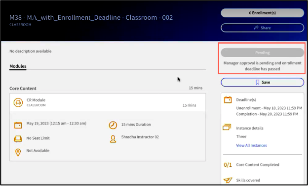
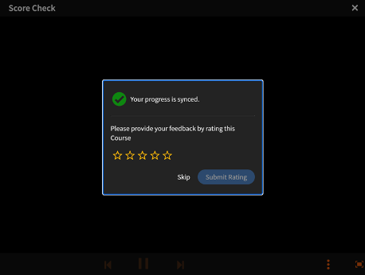
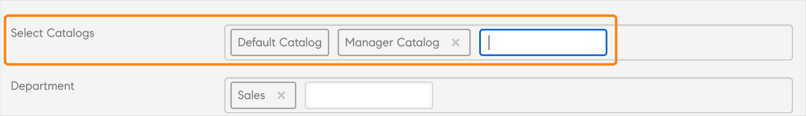

# 此版本的新增功能（2023年7月）

## 改善的建議

Adobe Learning Manager已推出全新及改版後的課程推薦系統。 此建議功能使用AI演演算法和使用者的興趣（例如產品、角色和等級）來提供個人化內容建議。

如需詳細資訊，請參閱[Adobe Learning Manager中的Recommendations](recommendations-adobe-learning-manager.md)。

## 多重註冊

在此版本的Adobe Learning Manager中，我們將為學習者推出多重註冊，允許學習者在一個或不同時段註冊多個課程例項。

如需詳細資訊，請參閱[多重註冊](/help/migrated/authors/feature-summary/courses.md)。

### 行動應用程式或沈浸式的多重註冊

學習者無法從行動應用程式/沈浸式影片中註冊多個例項。 行動應用程式和沈浸式行動網站不支援多重註冊。

>[!NOTE]
>
>啟用多註冊後，每個課程的「學習者成績單」報表會新增多列（每個例項各一列）。
>
>若您已將報表自動化設定為每門課程僅預期一列，則您必須對報表自動化進行必要的調整，才能啟用「多重註冊」功能。

### 多註冊例項中的徽章格式

若要支援多重註冊執行個體中的徽章，徽章格式已變更為`userId_badgeId_COURSE_courseId_courseInstanceId`。

### 使用Headless模式的多重註冊中的Launch播放器

在此版本中，我們已變更用來與Headless播放器通訊的資料庫。

在多重註冊中，您必須傳遞包裝在物件內的引數。

```
{{startplayer(argument_object) ,
where
argument_object=
{ loId = <loId>, accountId = <accountId>, userId =<userId>, accessToken = <accessToken>, domId = <elementId>, onModuleLoaded = fn(), isMultiEnrolled=<boolean>, instanceId=<instanceId> }
}}
```

## 棄用Exavault聯結器

此版本的Adobe Learning Manager將包含新的聯結器，該聯結器將使用AWS傳輸系列的SFTP通訊協定。

此變更也會取代ExaVault聯結器，新使用者將無法再使用它。 您可以使用任何開放原始碼FTP使用者端來取代ExaVault。 如需詳細資訊，請參閱[從AdobeFTP管理員轉換](transition-from-ftp-manager.md)。

## Outlook中教室和虛擬工作階段的提醒

從Adobe Learning Manager建立的教室和虛擬教室工作階段已新增至學習者的Outlook行事曆，現在可一致支援Outlook的提醒（類似於Outlook中的會議提醒）。

## 增強指派技能給課程

我們改良了作者的技能指派工作流程。 課程「設定」頁面上的「技能」建議清單現在包含預先輸入搜尋功能。 作者現在可以輸入前幾個字元來搜尋技能，建議會根據輸入顯示在「技能」下拉式清單中。 有了這項增強功能，作者不需要捲動完整清單來尋找及指派課程技能。

## 經理核准的課程工作流程改善

經理核准的課程現在為經理和學習者提供適當的錯誤資訊。



經理現在可以在無法核准課程註冊請求時，檢視包含資訊（例如註冊截止日期已過）的相關錯誤訊息。 學習者會看到錯誤和補救動作。

## 新的學習方案報告

管理員/自訂管理員現在可以匯出帳戶中所有學習計畫的清單和中繼資料，例如狀態、適用的使用者群組、觸發資訊、學習計畫中包含的課程/學習路徑以及提醒資訊。

## 追蹤即將淘汰之執行個體的報表

「培訓報告」包含額外的一欄，會顯示課程或學習路徑中出現之例項的完成截止日期，方便管理員和作者知道哪些例項將會淘汰及採取必要行動。

## 增強功能以從學習者擷取課程評分

當使用者完成課程中的最後一個模組時，就會顯示擷取課程星級評等的快顯視窗。



## 自訂電子郵件範本

Learning Manager中的電子郵件範本現在包含完全可編輯的區段，能根據訊息和品牌偏好設定提供更大的彈性來自訂電子郵件通訊。

如需詳細資訊，請參閱[自訂電子郵件範本](/help/migrated/administrators/feature-summary/email-templates.md#flexibility-in-customizing-the-templates)。

## 排程助理的增強功能

微調為教室或虛擬工作階段選取講師的程式。 「排程小幫手」的「講師」欄位已新增「使用者群組」篩選器。 作者現在可以根據「講師技能」和任何其他引數（例如位置、語言、指定等）來篩選講師。

如需詳細資訊，請參閱排程小幫手](/help/migrated/authors/feature-summary/courses.md#user-group-filter)中的[使用者群組篩選器。

## 增強學習物件淘汰工作流程

作者現在可以為課程提供&#x200B;**自動淘汰**&#x200B;日期。 這有助於防止目錄隨時間膨脹，以及需要返回並手動淘汰課程。

管理員也可以在帳戶層級決定存取「淘汰」的學習物件的性質。

訓練報表包含新欄&#x200B;**自動淘汰日期**，以顯示每個學習物件的淘汰日期（若有設定）。

## 依作者的目錄標籤值

作者現在可以在建立或編輯課程時，為目錄標籤新增其值。 管理員可以在帳戶層級啟用此功能。 作者新增目錄標籤值後，就會成為預先輸入搜尋的一部分。



## 增強管理員、作者和經理角色的課程搜尋功能

已針對管理員、作者及管理員角色進行搜尋增強功能。 他們現在可以使用關鍵字搜尋標題。 適用於課程、學習路徑及認證。

## 移轉失敗通知

如果在移轉期間或使用PowerBI、FTP、Box等資料聯結器時，有任何匯入或匯出作業失敗，整合管理員會透過電子郵件收到通知。

## 透過API進行多重管理員設定

新的API已新增至Managed Office API集，以支援多重管理員設定。

## 註冊API的增強功能

Enrollment API已進行增強功能，以支援和最佳化大規模大量註冊。

## 行動應用程式 — 離線內容檢視

學習者可以離線模式下載及使用內容。 離線檢視不支援巢狀和彈性的學習路徑。

*在這個版本中，僅英文內容支援離線內容檢視。*

## 協助工具

已實施多項改善專案來增強協助工具，包括透過熒幕助讀程式最佳化可讀性的增強功能。

## 行動應用程式支援

在下一個主要發行版本中，Adobe Learning Manager行動應用程式將僅支援三個最新的行動作業系統版本。

## linkedIn上的內容

linkedIn內容在Safari瀏覽器上的沈浸式應用程式中未如預期載入。 作為因應措施，請執行下列動作：

1. 在裝置上，選取&#x200B;**[!UICONTROL Settings]** > **[!UICONTROL Safari]**。
1. 停用&#x200B;**防止跨網站追蹤**。
1. 停用&#x200B;**封鎖所有Cookie**。
1. 登入沈浸式應用程式。
1. 播放內容。
1. 允許快顯。

## 其他增強功能

### 在MS Teams中切換執行個體

學習者可切換至不同的課程例項，直到完成並保留課程進度。

### MS Teams中的多重註冊支援

學習者可註冊另一個課程執行個體，無論先前任何執行個體的完成狀態為何。 如此一來，學習者便可在相同課程的多個例項中註冊。

### 課程附註支援MS Teams中的多重註冊

課程附註可在課程執行個體層級取得，以支援多重註冊。

## API變更

如需API變更的詳細資訊，請參閱[Adobe Learning Manager API參考](https://captivateprime.adobe.com/docs/primeapi/v2/)。

### 新建議的API支援

**GET/account**

如果啟用prlRecommendation，則會傳回。

**要求**

`https://learningmanagerstage1.adobe.com/primeapi/v2/account`

**GET/data？filter.recommendationCriteria=product**

傳回產品/主題清單。 結果取決於帳戶設定，該設定會確認學習者是否可看見所有產品，或產品/主題是否可看見目錄。

**要求**

`https://learningmanagerqe.adobe.com/primeapi/v2/data?filter.recommendationCriteria=product&filter.showAllRecommenda`

**`GET /data?filter.recommendationCriteria=role`**

傳回建議的角色清單。

**要求**

`https://learningmanagerqe.adobe.com/primeapi/v2/data?filter.recommendationCriteria=role&filter.showAllRecommendationCriteria=false`

**`GET /data?filter.recommendationCriteria=level`**

傳回建議的角色清單。

**要求**

`https://learningmanagerqe.adobe.com/primeapi/v2/data?filter.recommendationCriteria=level&filter.showAllRecommendationCriteria=false`

**POST/search/query**

搜尋也包含查詢中的產品和角色引數。 查詢和內文沒有變更。 我們將新增排序選項

**要求**

`https://learningmanagerstage1.adobe.com/primeapi/v2/search/query?...`

**GET/learningObjects**

如果PRL建議為即時，學習物件模型會傳回作者標籤的建議。

**要求URL**

`https://learningmanagerstage1.adobe.com/primeapi/v2/learningObjects?sort=recommendationScore&filter.recommendationProducts=...&filter.recommendationRoles=...&filter.excludeIgnoredRecommendations=true`

POST/learningObjects/query

查詢呼叫內文支援下列屬性：

```javascript {line-numbers="true"}
{
  "filter.announcedGroups": [
    "string"
  ],
  "filter.bookmarks": true,
  "filter.catalogIds": [
    "string"
  ],
  "filter.cityName": [
    "string"
  ],
  "filter.duration.range": [
    "string"
  ],
  "filter.effectiveModifiedDate.fromDate": "string",
  "filter.effectiveModifiedDate.toDate": "string",
  "filter.excludeIgnoredRecommendations": true,
  "filter.ignoreEnhancedLP": true,
  "filter.ignoreHigherOrderLOEnrollment": true,
  "filter.lang.subLOs": true,
  "filter.lang.twoLetterCode": true,
  "filter.learnerState": [
    "string"
  ],
  "filter.loFormat": [
    "string"
  ],
  "filter.loTypes": [
    "string"
  ],
  "filter.price": "string",
  "filter.priceRange": [
    "string"
  ],
  "filter.recommendationLevels": [
    "string"
  ],
  "filter.skill.level": [
    "string"
  ],
  "filter.skillName": [
    "string"
  ],
  "filter.tagName": [
    "string"
  ],
  "language": [
    "string"
  ],
  "preferredSortPartitionOrder": [
    "string"
  ],
  "showLoContentSource": true,
  "useCache": true,
  "filter.recommendationProducts": [
    {
      "levels": [
        "string"
      ],
      "name": "string"
    }
  ],
  "filter.recommendationRoles": [
    {
      "levels": [
        "string"
      ],
      "name": "string"
    }
  ]
}
```

**GET/recommendationProducts**

依recommendationProduct ID擷取PRL產品。

**要求URL**

`https://learningmanagerstage1.adobe.com/primeapi/v2/recommendationProducts`

GET/recommendationRoles

依recommendationProduct ID擷取PRL產品。 系統只會傳回（學習物件）的可見角色。

**要求URL**

`https://learningmanagerstage1.adobe.com/primeapi/v2/prlRecommendations/roles`

`POST /users/{id}/recommendationPreferences`

建立/重新建立（覆寫） PRL建議偏好設定。 裝載範例：

```javascript {line-numbers="true"}
{
    "data": {
        "id": "userRecommendationPreferences:14755328",
        "type": "userRecommendationPreferences",
        "attributes": {
            "products": [
                {
                    "id": "recommendationProduct:1",
                    "dateCreated": "2023-05-07T20:00:00.000Z"
                },
                {
                    "id": "recommendationProduct:37",
                    "dateCreated": "2023-05-07T21:00:00.000Z"
                }
            ],
            "roles": [
                {
                    "id": "recommendationRole:23",
                    "dateCreated": "2023-05-07'T'21:00:00.000'Z'"
                },
                {
                    "id": "recommendationRole:1",
                    "dateCreated": "2023-05-07'T'20:01:00.000'Z'"
                },
                {
                    "id": "recommendationRole:2",
                    "dateCreated": "2023-05-07'T'19:02:00.000'Z'"
                },
                 {
                    "id": "recommendationRole:3",
                    "dateCreated": "2023-05-07'T'18:02:00.000'Z'"
                },
                {
                    "id": "recommendationRole:20",
                    "dateCreated": "2023-05-07'T'17:02:00.000'Z'",
                    "levels": [
                        "INTERMEDIATE"
                    ]
                }
            ]
        }
    }
}
```

**`GET /users/{id}/recommendationPreferences`**

**要求URL**

`https://learningmanagerstage1.adobe.com/primeapi/v2//users/123/recommendationPreferences`

**`DELETE /users/{id}/recommendationPreferences`**

刪除產品或角色的PRL建議使用者偏好設定。

**要求URL**

`https://learningmanagerstage1.adobe.com/primeapi/v2/users/123/recommendationPreferences?ids=recommendationRole:123,recommendationRole:234`

引數：

Ids =要刪除的ID清單

**PATCH/users/{id}/recommendationPreferences**

部分新增/更新。 裝載範例：

```javascript {line-numbers="true"}
{
  "data": {
    "id": "userRecommendationPreferences:<USER_ID>",
    "type": "userRecommendationPreferences",
    "attributes": {
      "roles": [
        {
          "id": "recommendationRole:123",
          "type": "recommendationRole",
          "attributes": {
            "levels": [
              "INTERMEDIATE"
            ]
          }
        },
        {
          "id": "recommendationRole:123",
          "type": "recommendationRole",
          "attributes": {
            "levels": [
              "ADVANCED"
            ]
          }
        }
      ]
    }
  }
}
```

**POST/recommendationPreferences/learningObjects/{id}/ignore**

將記錄檔案新增至封鎖的建議。

**要求URL**

`https://learningmanagerstage1.adobe.com/primeapi/v2/recommendationPreferences/learningObjects/{id}/ignored`

**`DELETE /recommendationPreferences/learningObjects/{id}/ignore`**

從封鎖的建議刪除記錄檔。

**要求URL**

`https://learningmanagerstage1.adobe.com/primeapi/v2/recommendationPreferences/learningObjects/{id}/ignored`

**`GET /users/{id}/recommendationStrips`**

擷取所有要用來顯示PRL建議的色條

### API的多重註冊支援

**GET/primeapi/v2/account**

新增兩個新屬性：

* instanceSwitchEnable
* multiEnrollmentEnable

**GET/users/{userId}/userNotifications**

在新中繼資料屬性的通知中新增課程例項ID。

**GET/learningObjects**

註冊關係只會顯示主要註冊，即首次註冊或首次完成。

**`GET /learningObjects/{id}`**

註冊關係只會顯示主要註冊，即首次註冊或首次完成。

**`GET /learningObjects/{loId}/instances/{loInstanceId}`**

新的關係會新增至LO執行個體模型。

**`GET /enrollments/{id}`**

擷取多重註冊課程的註冊。

**`DELETE /enrollments/{id}`**

取消註冊特定學習物件例項。

**POST/enrollments**

支援不同執行個體的註冊。

**GET/enrollments**

取得學習物件的僅主要註冊。

**`GET /learningObjects/{id}/note`**

擷取課程的附註清單。

**`GET /learningObjects/{lo_id}/instances/{loi_id}/note`**

擷取課程和例項的附註清單。

**`GET /learningObjects/{id}/resources/{loResourceId}/note`**

擷取課程中資源的附註清單。

**`POST /learningObjects/{id}/resources/{loResourceId}/note`**

在模組中為特定課程新增備註。

**`DELETE /learningObjects/{id}/resources/{loResourceId}/note/{noteId}`**

針對特定執行個體（loResource ID的一部分），從指定模組刪除特定附註。

**`GET /learningObjects/{id}/resources/{loResourceId}/note/{noteId}`**

擷取課程中特定執行個體（loResourceId的一部分）模組的特定附註。

**`PATCH /learningObjects/{id}/resources/{loResourceId}/note/{noteId}`**

針對特定執行個體（loResource ID的一部分），更新指定模組的特定附註。

**管理API變更**

* GET/users/{id}/註冊
* POST/users/{id}/enrollings
* DELETE/users/{id}/enrollments/{enrollmentId}
* PATCH/users/{id}/enrollments/{enrollmentId}

### 端點的強制欄位

產品和角色僅在強制執行時載入。

範例請求

* GET`https://learningmanagerstage1.adobe.com/primeapi/v2/learningObjects/course%3A7418798?enforcedFields[learningObject]=products`
* GET`https://learningmanagerstage1.adobe.com/primeapi/v2/users/11255638/userBadges?include=model&page[offset]=0&page[limit]=10&sort=dateAchieved&enforcedFields[learningObject]=products,roles`

### 搜尋因實作而來的API變更（英文地區設定）

詞幹是指將單詞簡化為根形式的過程。 這可確保在搜尋期間字詞的變體相符。 例如，步行和步行可以內化為相同的根單詞：walk。 內嵌後，搜尋中出現的任一字詞會與另一個字詞相符。

在此版本中，我們新增了英文語言環境的詞幹，其中包括以下變體 — en_US、en_AU、en_GB。

如果搜尋結果中需要字乾屬性，則字乾屬性會提及。 此設定預設為False。

API查詢引數：

* matchType=phrase_and_match
* Stemmed=true

### 移除V1端點

V1 API在此版本中將停止運作。 如需詳細資訊，請參閱[開發人員手冊](/help/migrated/integration-admin/feature-summary/developer-manual.md)。

### 課程註冊或取消註冊的通知

此發行版本引入了對課程例項ID的支援，以及新中繼資料屬性中的通知。

### L1意見反應支援

讓學習者在多重註冊功能的每個執行個體層級提供意見回饋。

**API：** `POST /enrollments/{id}/l1Feedback`

### LO強制欄位清單

在這個版本中，您必須將區段、prequisiteConstraints、prerequisiteLOs、subLOs、supplementalResources、supplementalLOs、instances、catalogLabels明確傳送至learningObject。

例如，

`enforcedFields[learningObject]=prerequisiteLOs,instances`

### 下一個版本的淘汰通知

* 學習者API的覆寫標幟。
* 我們將變更highlightResults=false的預設值。 此外，我們也會變更snippetType=courseName的預設值。
* 我們將棄用搜尋端點中的matchType=bool。
* autoCompleteMode有[已棄用]標籤，為了提供與autoCompleteMode =false相同的功能，我們新增了一個名為Match的matchType。

### 多註冊之徽章ID格式

為了支援多重註冊的執行個體徽章，我們將課程徽章的格式從`userId_badgeId_COURSE_courseId to userId_badgeId_COURSE_courseId_courseInstanceId`變更為唯一識別徽章。

## 發行說明

如需Learning Manager網頁應用程式和裝置應用程式目前和先前版本的詳細資訊，請參閱[發行說明](/help/migrated/release-note/release-notes.md)。

## 此版本中的已知問題或限制

以下是此版本的限制：

### 在行動應用程式中檢視離線內容

在應用程式中檢視離線內容時，不支援下列專案：

* Flex課程、學習計畫或認證。
* 增強課程、學習計畫或認證。
* 多測驗啟用的課程、學習計畫或認證。
* Harvard Manage Mentor、Content Marketplace、GetAbstract或LinkedIn課程、學習計畫或認證。
* 已啟用先決條件的學習計畫和憑證。
* 已淘汰的課程、學習方案或認證。
* 截止日期已過期的課程、學習計畫或認證。
* 外部憑證。
* 啟用電子商務的課程、學習計畫或認證。

下列學習路徑、課程或認證與離線同步處理有一些問題：

* 所有學習路徑。
* 所有內部憑證。
* 具有POST呼叫的內容。

### Recommendations

新建議系統中的產品/角色/層級不支援下列專案：

* Adobe Experience Manager、團隊、SFDC和未登入。
* 行動應用程式不支援在Recommendation頁面上編輯產品和角色。
* 移轉期間無法進行對應。
* 自動標籤LinkedIn、內容市集和其他外部課程、學習計畫或認證。
* 上線後回覆為技能型或傳統型。
* 學習者應用程式上的產品和角色搜尋功能表。
* 在管理員應用程式上對課程、學習計畫或認證和使用者進行大量對應。

## 系統需求

[Learning Manager系統需求](/help/migrated/system-requirements.md)
