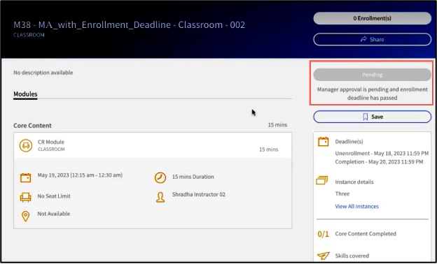
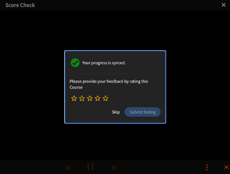
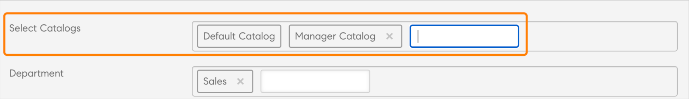

# 這次發布（2023年7月）有什麼新內容

## 改良建議

Adobe Learning Manager 推出了全新且全新設計的課程推薦系統。 此推薦功能利用 AI 演算法與用戶興趣（如產品、角色與等級）提供個人化內容推薦。

欲了解更多資訊，請參閱 [Adobe Learning Manager](recommendations-adobe-learning-manager.md) 中的建議。

## 多重註冊

在本次 Adobe Learning Manager 版本中，我們引入了多重註冊功能，允許學習者在一個或不同時間段註冊多個課程實例。

欲了解更多資訊，請參閱 [多重登記](/help/migrated/authors/feature-summary/courses.md)。

### 行動應用程式或沉浸式多重註冊

學習者無法從行動應用程式或沉浸式課程中同時註冊多個實例。 行動應用程式和沉浸式行動網頁不支援多重註冊。

>[!NOTE]
>
>啟用多重選課後，每門課程的學習者成績單報告會新增多列（每個實例一列）。
>
>如果你設定的報表自動化預設每門課只包含一列，必須先對報表自動化做必要的調整，才能啟用多重報名功能。

### 多重註冊實例中徽章格式

為了支援多註冊實例中的徽章，徽章格式改為 `userId_badgeId_COURSE_courseId_courseInstanceId`。

### 使用無頭模式啟動多重註冊的玩家

在本版本中，我們更改了與無頭玩家通訊的函式庫。

在多重註冊中，你必須將包裹在物件內的參數傳遞。

```
{{startplayer(argument_object) ,
where
argument_object=
{ loId = <loId>, accountId = <accountId>, userId =<userId>, accessToken = <accessToken>, domId = <elementId>, onModuleLoaded = fn(), isMultiEnrolled=<boolean>, instanceId=<instanceId> }
}}
```

## exavault 連接器的淘汰

這次 Adobe Learning Manager 版本將包含一個新的連接器，該連接器將使用 AWS Transfer 家族的 SFTP 協定。

此變更也將取代 ExaVault 連接器，後者將不再對新用戶開放。 你可以使用任何開源的 FTP 用戶端來取代 ExaVault。 欲了解更多資訊，請參閱 [從 Adobe FTP Manager](transition-from-ftp-manager.md) 轉換。

## Outlook中關於課堂與線上課程的提醒

由 Adobe Learning Manager 建立並新增到 Outlook 行事曆的教室與虛擬教室課程，現在將持續支援 Outlook 的提醒（類似 Outlook 的會議提醒）。

## 課程技能分配的強化

我們對作者的技能分配工作流程做了改進。 課程設定頁面的技能建議清單現在包含了預先打字搜尋的功能。 作者現在可以透過輸入前幾個字元搜尋技能，並根據輸入在技能下拉選單中顯示建議。 有了這項功能，作者不必再翻閱完整清單就能找到並分配課程技能。

## 經經理核准的課程工作流程改進

經理核准的課程現在會為管理者和學習者提供適當的錯誤資訊。



當經理無法批准課程註冊申請時，現在可以查看相關的錯誤訊息及資訊（例如報名截止日期已過）。 學習者會被展示錯誤及補救措施。

## 新學習計畫報告

管理員/自訂管理員現在可以匯出帳號中所有學習計畫的清單，以及狀態、適用使用者群組、觸發資訊、學習計畫中包含的課程/學習路徑，以及提醒事項等元資料。

## 報告以追蹤即將退休的實例

訓練報告中新增一欄，顯示課程或學習路徑中實例的完成截止日期，讓管理員與作者知道哪些實例將被退休，並能採取必要行動。

## 提升學習者課程評分的改進

當使用者完成課程的最後一個模組時，會立即彈出一個視窗來記錄該課程的星級評分。



## 自訂電子郵件範本

Learning Manager 中的電子郵件範本現在包含完全可編輯的區塊，提供更靈活的電子郵件溝通，依據訊息與品牌偏好來客製化。

欲了解更多資訊，請參閱 [自訂電子郵件範本](/help/migrated/administrators/feature-summary/email-templates.md#flexibility-in-customizing-the-templates)。

## 排程助理的改進

微調選擇授課老師的流程，無論是在教室還是線上課程中。 在排程助理的講師欄位新增了使用者群組篩選器。 作者現在可以根據「講師技能」及其他參數如地點、語言、職稱等篩選講師。

欲了解更多資訊，請參閱 [排程助理](/help/migrated/authors/feature-summary/courses.md#user-group-filter)中的使用者群組篩選器。

## 學習物件退休工作流程的改進

作者現在 **可以提供課程的自動退休** 日期。 這有助於防止目錄膨脹，避免必須回頭手動退休課程。

管理員也可以在帳號層級決定「退休」學習物件的存取性質。

訓練報告新增一個欄位「 **自動退休日期**」，用以顯示每個學習對象的退休日期（若設定為）。

## 作者分類的目錄標籤值

作者現在可以在建立或編輯課程時，新增目錄標籤的數值。 管理員可以在帳號層級啟用此功能。 作者新增目錄標籤值後，該值會成為預先打字搜尋的一部分。



## 管理員、作者及經理角色課程搜尋功能的增強

已針對管理員、作者及經理角色進行搜尋功能強化。 他們現在可以用關鍵字搜尋標題。 這適用於課程、學習路徑和證照。

## 遷移失敗通知

如果遷移過程中或使用資料連接器（如 PowerBI、FTP、Box）時，任何匯入或匯出操作失敗，整合管理員會透過電子郵件收到通知。

## 透過 API 進行多管理員設定

已新增一個 API 加入 Managed Office API 集合，以支援多管理員設定。

## 註冊 API 的增強

註冊 API 已進行強化，以支援並優化大規模的批量註冊。

## 行動應用程式 - 離線內容瀏覽

學習者可在離線模式下下載並消費內容。 巢狀且彈性的學習路徑不支援離線觀看。

*本版本僅支援英文內容離線瀏覽。*

## 交通便利性

為提升無障礙性，已實施多項改進，包括優化螢幕閱讀器的可讀性。

## 行動應用程式支援

隨著下一個重大版本，Adobe Learning Manager 行動應用程式將只支援最新的三個行動作業系統版本。

## LinkedIn 上的內容

LinkedIn 內容在 Safari 瀏覽器的沉浸式應用程式上無法如預期載入。 作為變通方法，可以做以下幾件事：

1. 在裝置上，選擇 **[!UICONTROL Settings]** > **[!UICONTROL Safari]**。
1. 關閉 **防止跨站點追蹤**。
1. 停用 **封鎖所有 Cookie**。
1. 登入沉浸式應用程式。
1. 玩內容。
1. 允許彈出視窗。

## 其他強化

### MS Teams 中的切換實例

學習者可以切換到不同的課程實例直到完成，並保留課程進度。

### MS Teams 的多重註冊支援

學習者無論之前的實例是否完成，都可以註冊其他課程實例。 這樣做會讓學習者同時註冊同一課程的多個實例。

### 課程說明支援 MS Teams 多重註冊

課程筆記以課程實例層級提供，以支援多重選課。

## API 變更

欲了解更多 API 變更資訊，請參閱 [Adobe Learning Manager API 參考資料](https://captivateprime.adobe.com/docs/primeapi/v2/)。

### API 支援新推薦

**取得 /account**

如果啟用了 prlRecommendation，則會回傳。

**請求**

`https://learningmanagerstage1.adobe.com/primeapi/v2/account`

**取得 /data？filter.recommendationCriteria=product**

退貨清單/主題。 結果取決於帳號設定，確認所有產品是否對學習者可見，或目錄是否對產品/主題可見。

**請求**

`https://learningmanagerqe.adobe.com/primeapi/v2/data?filter.recommendationCriteria=product&filter.showAllRecommenda`

**`GET /data?filter.recommendationCriteria=role`**

回傳推薦職位列表。

**請求**

`https://learningmanagerqe.adobe.com/primeapi/v2/data?filter.recommendationCriteria=role&filter.showAllRecommendationCriteria=false`

**`GET /data?filter.recommendationCriteria=level`**

回傳推薦職位列表。

**請求**

`https://learningmanagerqe.adobe.com/primeapi/v2/data?filter.recommendationCriteria=level&filter.showAllRecommendationCriteria=false`

**發文 /搜尋/查詢**

搜尋時也會在查詢中包含產品與角色參數。 查詢與正文沒有變化。 我們將新增排序選項

**請求**

`https://learningmanagerstage1.adobe.com/primeapi/v2/search/query?...`

**取得 /learningObjects**

如果PRL推薦是即時的，學習物件模型會回傳作者標記的推薦。

**請求網址**

`https://learningmanagerstage1.adobe.com/primeapi/v2/learningObjects?sort=recommendationScore&filter.recommendationProducts=...&filter.recommendationRoles=...&filter.excludeIgnoredRecommendations=true`

發佈 /learningObjects/query

查詢呼叫內容支援以下屬性：

```javascript {line-numbers="true"}
{
  "filter.announcedGroups": [
    "string"
  ],
  "filter.bookmarks": true,
  "filter.catalogIds": [
    "string"
  ],
  "filter.cityName": [
    "string"
  ],
  "filter.duration.range": [
    "string"
  ],
  "filter.effectiveModifiedDate.fromDate": "string",
  "filter.effectiveModifiedDate.toDate": "string",
  "filter.excludeIgnoredRecommendations": true,
  "filter.ignoreEnhancedLP": true,
  "filter.ignoreHigherOrderLOEnrollment": true,
  "filter.lang.subLOs": true,
  "filter.lang.twoLetterCode": true,
  "filter.learnerState": [
    "string"
  ],
  "filter.loFormat": [
    "string"
  ],
  "filter.loTypes": [
    "string"
  ],
  "filter.price": "string",
  "filter.priceRange": [
    "string"
  ],
  "filter.recommendationLevels": [
    "string"
  ],
  "filter.skill.level": [
    "string"
  ],
  "filter.skillName": [
    "string"
  ],
  "filter.tagName": [
    "string"
  ],
  "language": [
    "string"
  ],
  "preferredSortPartitionOrder": [
    "string"
  ],
  "showLoContentSource": true,
  "useCache": true,
  "filter.recommendationProducts": [
    {
      "levels": [
        "string"
      ],
      "name": "string"
    }
  ],
  "filter.recommendationRoles": [
    {
      "levels": [
        "string"
      ],
      "name": "string"
    }
  ]
}
```

**取得 /推薦產品**

依推薦產品編號檢索 PRL 產品。

**請求網址**

`https://learningmanagerstage1.adobe.com/primeapi/v2/recommendationProducts`

取得 /推薦角色

依推薦產品編號檢索 PRL 產品。 只有可見的（學習物件）角色會被回傳。

**請求網址**

`https://learningmanagerstage1.adobe.com/primeapi/v2/prlRecommendations/roles`

`POST /users/{id}/recommendationPreferences`

建立/重建（覆蓋）PRL 推薦偏好設定。 範例有效載荷：

```javascript {line-numbers="true"}
{
    "data": {
        "id": "userRecommendationPreferences:14755328",
        "type": "userRecommendationPreferences",
        "attributes": {
            "products": [
                {
                    "id": "recommendationProduct:1",
                    "dateCreated": "2023-05-07T20:00:00.000Z"
                },
                {
                    "id": "recommendationProduct:37",
                    "dateCreated": "2023-05-07T21:00:00.000Z"
                }
            ],
            "roles": [
                {
                    "id": "recommendationRole:23",
                    "dateCreated": "2023-05-07'T'21:00:00.000'Z'"
                },
                {
                    "id": "recommendationRole:1",
                    "dateCreated": "2023-05-07'T'20:01:00.000'Z'"
                },
                {
                    "id": "recommendationRole:2",
                    "dateCreated": "2023-05-07'T'19:02:00.000'Z'"
                },
                 {
                    "id": "recommendationRole:3",
                    "dateCreated": "2023-05-07'T'18:02:00.000'Z'"
                },
                {
                    "id": "recommendationRole:20",
                    "dateCreated": "2023-05-07'T'17:02:00.000'Z'",
                    "levels": [
                        "INTERMEDIATE"
                    ]
                }
            ]
        }
    }
}
```

**`GET /users/{id}/recommendationPreferences`**

**請求網址**

`https://learningmanagerstage1.adobe.com/primeapi/v2//users/123/recommendationPreferences`

**`DELETE /users/{id}/recommendationPreferences`**

刪除 PRL 推薦的使用者偏好設定。

**請求網址**

`https://learningmanagerstage1.adobe.com/primeapi/v2/users/123/recommendationPreferences?ids=recommendationRole:123,recommendationRole:234`

參數：

Ids = 需刪除的 ID 列表

**補丁 /users/{id}/recommendation偏好設定**

部分新增/更新。 範例有效載荷：

```javascript {line-numbers="true"}
{
  "data": {
    "id": "userRecommendationPreferences:<USER_ID>",
    "type": "userRecommendationPreferences",
    "attributes": {
      "roles": [
        {
          "id": "recommendationRole:123",
          "type": "recommendationRole",
          "attributes": {
            "levels": [
              "INTERMEDIATE"
            ]
          }
        },
        {
          "id": "recommendationRole:123",
          "type": "recommendationRole",
          "attributes": {
            "levels": [
              "ADVANCED"
            ]
          }
        }
      ]
    }
  }
}
```

**發佈 /recommendationPreferences/learningObjects/{id}/忽略**

把LO加入被封鎖的推薦名單。

**請求網址**

`https://learningmanagerstage1.adobe.com/primeapi/v2/recommendationPreferences/learningObjects/{id}/ignored`

**`DELETE /recommendationPreferences/learningObjects/{id}/ignore`**

刪除被封鎖推薦的對象。

**請求網址**

`https://learningmanagerstage1.adobe.com/primeapi/v2/recommendationPreferences/learningObjects/{id}/ignored`

**`GET /users/{id}/recommendationStrips`**

擷取所有用於顯示 PRL 建議的條帶

### 多重註冊支援 API

**取得 /primeapi/v2/account**

新增了兩個屬性：

* instanceSwitchEnabled
* multiEnrollmentEnabled

**取得 /users/{userId}/userNotifications**

在新的元資料屬性中加入了課程實例 ID。

**取得 /learningObjects**

註冊關係僅顯示主要註冊，即首次註冊或首次完成。

**`GET /learningObjects/{id}`**

註冊關係僅顯示主要註冊，即首次註冊或首次完成。

**`GET /learningObjects/{loId}/instances/{loInstanceId}`**

LO 實例模型中新增了一種關係。

**`GET /enrollments/{id}`**

檢索多重註冊課程的註冊紀錄。

**`DELETE /enrollments/{id}`**

從特定的學習物件實例取消註冊。

**POST /註冊**

支援不同情況下的登記。

**GET /註冊**

只取得學習物件的主要註冊資料。

**`GET /learningObjects/{id}/note`**

取得課程筆記清單。

**`GET /learningObjects/{lo_id}/instances/{loi_id}/note`**

取得課程及實例的筆記清單。

**`GET /learningObjects/{id}/resources/{loResourceId}/note`**

取得課程資源的筆記清單。

**`POST /learningObjects/{id}/resources/{loResourceId}/note`**

在模組中為某門課程新增註解。

**`DELETE /learningObjects/{id}/resources/{loResourceId}/note/{noteId}`**

刪除特定模組中針對特定實例（loResource ID 的一部分）的特定筆記。

**`GET /learningObjects/{id}/resources/{loResourceId}/note/{noteId}`**

在課程模組中取得特定實例（loResourceId的一部分）的特定筆記。

**`PATCH /learningObjects/{id}/resources/{loResourceId}/note/{noteId}`**

更新特定模組中的特定筆記與特定實例（loResource ID 的一部分）。

**管理員 API 變更**

* 取得 /users/{id}/enrollments
* 貼文 /使用者/{id}/註冊
* 刪除 /users/{id}/enrollments/{enrollmentId}
* 修補 /users/{id}/enrollments/{enrollmentId}

### 端點的強制場

產品與角色僅在執行時才會載入。

範例請求

* 去 `https://learningmanagerstage1.adobe.com/primeapi/v2/learningObjects/course%3A7418798?enforcedFields[learningObject]=products`
* 去 `https://learningmanagerstage1.adobe.com/primeapi/v2/users/11255638/userBadges?include=model&page[offset]=0&page[limit]=10&sort=dateAchieved&enforcedFields[learningObject]=products,roles`

### 搜尋 API 變更 源根實作（英文本地）

詞幹化是將一個詞簡化為詞根的過程。 這確保了搜尋過程中詞彙的變體匹配。 例如，walking（walked）和walked（walked）可以源自同一個詞根：walk。 一旦詞幹確定，任一詞的出現在搜尋中就會互相匹配。

在本版本中，我們新增了英文地點的詞幹處理，包含以下變體——en_US、en_AU、en_GB。

stemmed 屬性會說明搜尋結果中是否需要 stemming。 預設為 False。

API 查詢參數：

* matchType=phrase_and_match
* stemmed=真

### V1端點的移除

V1 API 將在此版本中停止運作。 更多資訊請參閱 [開發者手冊](/help/migrated/integration-admin/feature-summary/developer-manual.md)。

### 課程報名或退選通知

此版本新增了課程實例 ID 的支援，並以新的元資料屬性提供通知。

### L1 反饋支援

使學習者能在多重註冊功能的每個實例層級提供回饋。

**API：** `POST /enrollments/{id}/l1Feedback`

### LO 強制執行的場地名單

在此版本中，您必須明確地將 sections、prequisiteConstraints、prerequisiteLOs、subLOs、supplementaryResources、supplementaryLOs、instances、catalogLabels 明確傳送到 learningObject。

例如，

`enforcedFields[learningObject]=prerequisiteLOs,instances`

### 下一次版本的棄用通知

* 覆蓋學習者 API 的標誌。
* 我們將預設值改為 highlightResults=false。 另外，我們會更改 snippetType=courseName 的預設值。
* 我們將在搜尋端點中棄用 matchType=bool。
* autoCompleteMode 有 [Deprecated] 標籤，為了提供 autoCompleteMode =false 的功能，我們新增了一個稱為 Match 的 matchType。

### 多重註冊的徽章ID格式

為了支援多註冊實例徽章，我們將課程徽章格式從改 `userId_badgeId_COURSE_courseId to userId_badgeId_COURSE_courseId_courseInstanceId` 為唯一識別徽章。

## 發行說明

有關 Learning Manager 網頁應用程式與裝置應用程式目前及先前版本的資訊，請參閱 [發佈說明](/help/migrated/release-note/release-notes.md)。

## 本版本已知問題或限制

以下是本版本的限制：

### 在行動應用程式中查看離線內容

以下內容在應用程式中觀看離線內容時不被支援：

* 彈性課程、學習計畫或證照。
* 強化課程、學習計畫或證照。
* 多重測驗功能——課程、學習計畫或認證。
* 哈佛管理 Mentor、Content Marketplace、GetAbstract 或 LinkedIn 課程、學習計畫或證照。
* 學習計畫與證書，並啟用先修科目。
* 已退休的課程、學習計畫或證照。
* 課程、學習計畫或證書的截止日期已過。
* 外部證書。
* 電子商務支援課程、學習計畫或認證。

以下的學習路徑、課程或認證在離線同步方面存在一些問題：

* 所有學習路徑。
* 所有內部憑證。
* 對POST通話感到滿意。

### 建議

以下內容在新推薦系統中不支援產品/角色/等級：

* Adobe Experience Manager、Teams、SFDC 以及未登入。
* 該行動應用程式不支援編輯推薦頁面的產品與角色。
* 遷移期間無法進行映射。
* 自動標記 LinkedIn、內容市集及其他外部課程、學習計畫或證照。
* 上線後會回到技能基礎或經典版。
* 學習者應用程式中產品與職務的搜尋選單。
* 在管理員應用程式中批量對應課程、學習計畫或證照，以及使用者。

## 系統需求

[學習管理器系統需求](/help/migrated/system-requirements.md)
