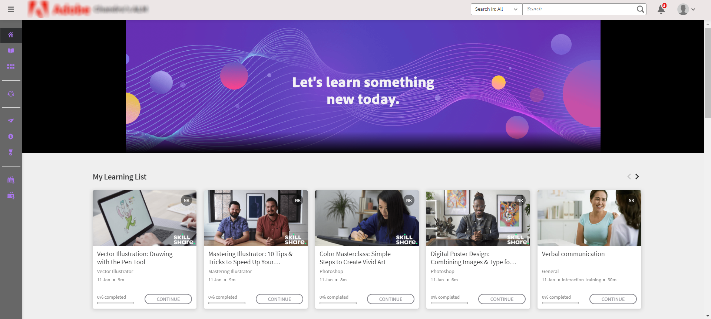
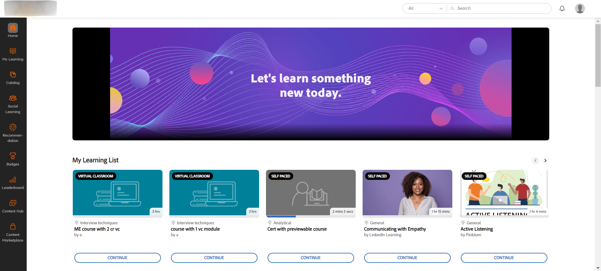

# 2024年7月新功能摘要 {#new-features-summary-july-2024}

了解 2024 年 7 月版本 Adobe Learning Manager 的新功能與增強功能。

>[!NOTE]
>
>請觀看這場 [線上研討會](https://nam04.safelinks.protection.outlook.com/?url=https%3A%2F%2Flearningmanager.adobe.com%2Fapp%2Flearner%3FaccountId%3D98632%23%2Fcourse%2F10078152&data=05%7C02%7Cchandrum%40adobe.com%7C90e588d31b994e6a5f4e08dcb87f26a8%7Cfa7b1b5a7b34438794aed2c178decee1%7C0%7C0%7C638588103494535076%7CUnknown%7CTWFpbGZsb3d8eyJWIjoiMC4wLjAwMDAiLCJQIjoiV2luMzIiLCJBTiI6Ik1haWwiLCJXVCI6Mn0%3D%7C0%7C%7C%7C&sdata=dNyxQl3IQjEtfGCMnhlfek4Piz%2BPGFfuUss53M8mFK8%3D&reserved=0) ，了解更多本版本的新功能。

## 合規儀表板的強化

### 什麼是合規儀表板？ {#whatiscompliancedashboard}

**[!UICONTROL Compliance Dashboard]** **Adobe 學習管理員**&#x200B;讓管理者能監控並監控學習者在學習目標上的進展。他們可以檢查團隊成員是否能遵守截止日期並持續學習進度，這有助於確保合規。 管理員可以設定合規儀表板並與經理分享。

若要在管理應用程式中存取合規儀表板，請選擇 **[!UICONTROL Reports]** > **[!UICONTROL Learning Summary]** > **[!UICONTROL Compliance Dashboard]**。

### 這次發布會有什麼變化

透過強化的合規儀表板，管理員與經理可查看與其特定類別相關的合規課程、學習路徑或認證（例如銷售、行銷與法律）。 管理員可以將客製化合規課程分類到特定類別。 客製化合規類別由目錄標籤驅動。  管理員可以建立課程儀表板並與經理分享。 管理者接著可以在各自的實例上查看相同的儀表板。 合規儀表板的使用者介面及合規電子郵件通知也進行了改進。


#### 工作流程

以下是使用強化版合規儀表板的步驟：

| 角色 | 任務 | 附加資訊 |
|---|---|---|
| 行政 | 建立客製化合規標籤 | 請參閱本文 [建立自訂合規標籤](/help/migrated/administrators/feature-summary/reports.md#compliance-dashboard) 以獲取更多資訊 |
| 作者 | 將這些標籤加入課程 | 詳情請參閱本文 [「為課程/學習路徑/認證](/help/migrated/authors/feature-summary/courses.md#add-compliance-labels-to-courselearning-pathcertification) 新增合規標籤」。 |
| 行政 | 建立包含合規課程的儀表板，並與主管分享 | 請參閱本文 [「建立並分享合規儀表板](/help/migrated/administrators/feature-summary/reports.md#create-and-share-a-compliance-dashboard) 」以獲得更多資訊。 |
| 經理 | 查看合規儀表板 | 更多資訊請參閱本文 [《合規狀態](/help/migrated/managers/feature-summary/manager-dashboard.md#compliance-status) 》 |

## 學習者使用者介面改造

>[!IMPORTANT]
>
>新的學習者介面將分階段發布。

**學習者介面**&#x200B;已更新，設計更優雅且現代化。**[!UICONTROL Learner Home]****[!UICONTROL My Learning]**、 、 **[!UICONTROL Catalog]**&#x200B;和 **[!UICONTROL Course Overview]** 著陸頁都煥然一新，變得現代化。課程卡也採用新設計，以現代化的方式呈現細節。 滑鼠移至課程卡片上即可顯示課程說明及出版日期。

>[!NOTE]
>
>重新設計的使用者介面僅適用於沉浸式版面。 這些變更目前尚未支援行動網頁或應用程式，未來版本會更新。


_舊的使用者介面_


_全新使用者介面_

### 這次發布中有哪些變動

**現代化外觀與氛圍**

這些全新更新的視覺元素與現代設計趨勢相呼應，使產品看起來直覺且吸引人。 這包括新的報頭、側面板以及現代感十足的小工具。

**提升使用者體驗**

學習者現在可在以下頁面查看類似的卡片檢視：首頁、目錄、我的學習及課程總覽頁面，提供統一的體驗。

欲了解更多資訊，請參閱 [學習者首頁](/help/migrated/learners/feature-summary/learner-home-page.md) 。

**課程出版日期變更**

透過這項強化，Adobe Learning Manager 匯入 LinkedIn 和 Go1 課程的發佈日期將與 LinkedIn 和 Go1 的實際發佈日期相同。 你也可以在使用者介面上查看 LinkedIn 和 Go1 課程的實際公布日期。 查看 [課程卡](/help/migrated/learners/feature-summary/learner-home-page.md#course-cards) 以獲取更多資訊。

## 未登入體驗更新

未登入體驗讓你能為未登入客戶打造即時體驗。 這作為行銷活動的登陸頁面，提供足夠資訊鼓勵註冊。

### 這次發布有什麼改變

客戶可以購買高級方案，打造這種高度可擴展的非登入體驗。 這項非記錄的體驗，由 [Training Data](/help/migrated/integration-admin/feature-summary/connectors.md#training-data-access) Access 提供即時名額限制、座位佔用數、候補名單限制及候補名單數值等資料，使用 Adobe Learning Manager API。 客戶可利用這些 API 提供未登入學習者的搜尋與篩選功能，以及完整的課程摘要。 請參閱本文 [《未登入的 API](/help/migrated/integration-admin/feature-summary/non-logged-in-apis.md) 》以獲得更多相關資訊。

>[!NOTE]
>
>請聯絡客服團隊或 CSAM 購買高級方案。

## 支援多個庫存單位（SKU）

學習者現在可以將多門課程、學習路徑或證照加入購物車，並一併購買。

### 這次發布會有什麼變化

過去，學習者一次只能購買一門課程。 在這次 Adobe Learning Manager **版本**&#x200B;中，他們可以用購物車一次性購買多門課程、學習路徑或證照。

此功能僅在學習者應用程式中提供（現有 UI、新學習者介面及行動沉浸式應用程式）。

在 ALM 中查看 [多項目購物車](/help/migrated/learners/feature-summary/multi-item-cart.md)

## Fluidic Player 中的 HTML5 內容支援

**Adobe Learning Manager** 現在支援將 HTML5 內容以.zip檔案形式上傳到內容庫。 上傳後，這些檔案可作為模組納入課程中。 此外，作者可定義自學 HTML5 模組的完成標準，允許學習者標記完成或啟動時自動完成。

### 這次發布有什麼改變

Adobe Learning Manager 現在支援自學課程中的 HTML5 支援內容。 作者可以將 HTML5 內容作為 .zip 檔案加入自我進度內容。 學習者可以在流體播放器中查看 HTML5 內容。 有了這項新功能，學習者現在可以直接在流體遊戲中標記課程已完成，適合自學課程。 欲了解更多資訊，請參閱 [內容庫](/help/migrated/authors/feature-summary/content-library.md#add-html5-file-type-in-the-content-library) 中新增 HTML5 檔案類型。

透過新強化，當網址被訪問時，帶有外部連結的課程將自動標記為完成，只要作者已將完成標準設定為新選項 **[!UICONTROL On Launching content]**。 活動模組頁面新增了這個選項 **[!UICONTROL Completion Criteria]** ，作者可以設定外部連結的完成標準。 欲了解更多資訊，請參閱 [活動模組](/help/migrated/authors/feature-summary/courses.md#add-html-link-in-the-activity-module) 中的新增 HTML 連結。


_完成標準選項-活動模組_

## 當然，手機應用程式上的推播通知也早該收到了

每當學員錯過課程截止日期時，都會收到推播通知。 有了這項新功能，學習者現在可以選擇將提醒暫停24小時，或在下週收到每一個逾期提醒時收到的提醒。 此規定僅適用於逾期通知。 查看 [排程推播通知](/help/migrated/learners/feature-summary/user-notifications.md#schedule-the-push-notification)

## 本版本的 API 變更

### 搜尋 API

搜尋 API 包含以下變更：

學習者可利用 ```GET /search``` API 在目錄篩選器中搜尋標籤。 學習者可透過選擇```tag``````filter.loTypes```參數值來搜尋標籤。

**樣本捲度**

```
curl -X GET --header 'Accept: application/vnd.api+json' --header 'Authorization: oauth <oauth_token>' 'https://example.com/primeapi/v2/search?page[limit]=10&query=Business&autoCompleteMode=true&filter.loTypes=tag&sort=relevance&filter.ignoreEnhancedLP=true&matchType=phrase&persistSearchHistory=true&stemmed=false&highlightResults=true'
```

新增的篩選條件、可用名額、候補名單及時間範圍篩選器已加入以下 API： ```GET /search``` 及 `GET /learningObjects`。

新增的篩選器 `filter.session.includeEnrollmentDeadline` 已加入以下 API ```GET /search```。

### 帳號 API

API 中新增```GET /account```了欄位 `custom_injections`、 `showComplianceLabel`和 `complianceLabelDefaultID` ，以取得使用者端點的帳號資料。

### 學習物件 API

以下是本次更新對學習物件 API 所做的變更：

新的回應、舊有作者 ID 以及 API 下`authorDetails``GET /learningObjects`新增的其他細節。此外，新增了一個篩選 `filter.authors`器 ，用來篩選舊有作者及其課程。

這個新屬性 `effectivenessIndex` 會幫助你取得課程效能數據。

**樣本捲度**

```
curl --location 'https://example.com/primeapi/v2/learningObjects/course%3A9790045?enforcedFields%5BlearningObject%5D=effectivenessData' \
--header 'Accept: application/vnd.api+json' \
--header 'Authorization: oauth <oauth_token>'
```

新的回應 `whoShouldTake`，說明了誰應該修讀此課程，並已加入以下 API： `POST /learningObjects/query`、 `GET /learningObjects/{id}`、 `GET /learningObjects`和 。

**樣本捲度**

```
curl -X GET --header 'Accept: application/vnd.api+json' --header 'Authorization: oauth <oauth_token>' 'https://example.com/primeapi/v2/learningObjects/course%3A1131255' 
```

新增的回應 `waitlistLimit`，說明了候補名單限制的細節，已加入 `GET /learningObjects` API。

新增的回應 `count` 顯示學習物件總數，已被加入 API `GET/ learningObjects` 和 `POST/ learningObjects/query`。

新的回應， `catalogFieldId` `fieldValueId`已經在 API 裡`catalogLabels``GET/ learningObjects`新增了。

學習者可以在 API `GET /preview/learningObjects`中取得目錄標籤值。

### 新增 API 以取得市場數量

在此版本中新增了一個 API `GET /search/marketplace/count` 。 這有助於你掌握內容市場上可用的學習資源數量。

**樣本捲度**

```
curl -X GET --header 'Accept: application/vnd.api+json' --header 'Authorization: oauth <oauth_token>' 'https://example.com/primeapi/v2/search/marketplace/count?query=course'
```

**樣本響應**

```
{
  "count": 54910
}
```

### 學習物件實例 API

以下是本次更新中對學習物件實例 API 所做的變更：

在此版本中，學習物件實例 API `GET /learningObjects/{loId}/instances/{loInstanceId}`新增了一個稱為 `gamificationEnabled` 的金鑰。

**樣本捲度**

```
curl --location 'http://example.com/acapapi/primeapi/v2/learningObjects/learningProgram:12756/instances/learningProgram:12756_15644' 
```

上述 API 的新 `gamificationSettings` 屬性，用來取得遊戲化設定的詳細資訊。 例如： `GET /learningObjects/{loId}/instances/{loInstanceId}/gamificationSettings`。

**樣本捲度**

```
curl --location 'http://example.com/acapapi/primeapi/v2/learningObjects/learningProgram:103852/instances/learningProgram:103852_103526/gamificationSettings'
```

上述 API 的新 `leaderboard` 屬性，用來取得遊戲化設定的詳細資訊。 例如： `GET /learningObjects/{loId}/instances/{loInstanceId}/leaderboard`。

**樣本捲度**

```
curl --location 'https://example.com/primeapi/v2/learningObjects/learningProgram:106339/instances/learningProgram:106339_105775/leaderboard' \
--header 'Accept: application/vnd.api+json' \
--header 'Authorization: oauth <oauth_token>'
```

### 日期與 -date 排序行為的變化

支援依日期和日期排序的 API 會根據所有學習物件的發佈日期顯示結果，唯獨學習路徑除外。 學習路徑仍會根據 **生效修改** 日期列出。 此變更將在以下 API 中呈現：

* 取得 /learningObjects
* 取得 /搜尋
* 發佈 /learningObjects/query
* 發佈 /搜尋/查詢

### 抵消限額的變更

為了提升系統效能並更有效管理資源利用率，Adobe 已棄用 GET /users 端點中 ADMIN 與 LEARNER 範圍的高偏移值。 我們建議使用 Jobs API 來取得帶有偏移值的紀錄。

### 轉速與爆發限制的變化

在此版本中，所有 API 都新增了 RPM（每分鐘請求數）和突發限制。 你可以在 Swagger 頁面查看每個 API 的最大轉速。

RPM 是你在一分鐘內能發送給 API 伺服器的請求數量。 突發限制允許在短時間內處理更多請求，超越一般速率限制。

### 已棄用的 API

在 Adobe Learning Manager](/help/migrated/api-deprecations-list.md) 中查看 [API 棄用列表，以累積所有產品中已棄用的 API。

## 報告變更

### 合規儀表板

在本版本中，合規儀表板報告新增了兩個欄位：

* 現況
* 合規類型

這是在現有欄位之外的補充：

* 使用者名稱
* 使用者電子郵件
* LP/認證/課程
* 類型
* 註冊日期（UTC時區）
* 截止時間（UTC時區）
* 完工日期（UTC時區）
* 進步百分比

### 訓練報告

Admin > Reports > Custom Reports **和** Jobs API **的**&#x200B;訓練報告過去都有稱為&#x200B;**技能（Skill**））和&#x200B;**標籤（Tag（s））**&#x200B;的欄位。 **** ****&#x200B;這些欄位現在已改名為 **技能** 與 **標籤**。

### 內容審核報告

在本版本中， **[!UICONTROL Content Audit Trail]** 報告新增了以下屬性於修改類型欄位：

* 使用者群組新增
* 使用者群組移除
* 自訂標籤新增
* 自訂標籤移除
* 共享目錄新增
* 共享目錄移除
* 共享目錄更新

## 這次更新修正了錯誤

**活動提交**

* 嘗試重新上傳檔案到活動提交模組時，網路呼叫中出現錯誤 500 失敗。

**API**

* 如果有多位講師使用相同的電子郵件地址，建立 Connect 風險投資會議會失敗。
* 註冊學習路徑後，MS Teams 虛擬客戶在概覽頁面顯示錯誤的網址。
* 作為工作 API 回應一部分提供的預先簽署的使用者報告 URL 會在六小時後失效。
* 在產生課程報名報告時，課程名稱欄位顯示的課程名稱錯誤。
* 遷移工作者在呼叫 Course 的 bulk API 時沒有傳送唯一的 LO ID，但 ID 會被移除。
* 當課程被包含在使用者可存取的特定目錄中（而預設目錄被停用），即使設定阻止未註冊學習者查看課程，你仍可透過 learningobject/id 端點取得課程的元資料。
* 當 GET /learningObject API 中技能名稱帶有逗號時，技能篩選器無法如預期運作。
* SFTP 的資料保留工作器中，檔案的時間戳中繼資料存在不一致。
* 如果任何連接器被移除並重新設定，專案遷移狀態就會顯示關閉。
* 訓練報告的欄位標題是「Tag（s）」，而不是「Tags」。
* 如果目錄被停用，且匯出的課程中的任何一門只是被停用目錄的一部分，商科連接器匯出就會失敗。

**認證**

* 有時候，重新註冊使用者到定期認證會失敗。

**自訂角色**

* 在某些情況下，當自訂管理員嘗試切換為講師角色時，錯誤 403 會顯示禁止。

**電子郵件範本與通知**

* 當課程取消後，當最後一組教師被移除時，電子郵件通知不會被發送給他們。
* 組織者在建立線上講師主導訓練後，不會收到 MS Teams 的電子郵件通知。 只有在課程發布且啟用電子郵件範本後，郵件才會被觸發。
* 有時候，電子郵件範本包含錯誤的日期格式和翻譯。

**學習者**

* 當學習者同時註冊多個課程，而你下載了出勤報告時，報告中包含錯誤資訊。
* 如果其他用戶的私人貼文被加入公開故事，使用者可以查看。
* 在某些情況下，你無法將學習者從認證中退役。 嘗試取消登記時會顯示錯誤訊息。
* 即使管理員只選了一門課程，認證仍會被標記為已完成。
* 如果會話結束時間改為先前日期，管理員無法將 VC 標記為完成。
* 等候名單上的學習者，課程出席報告顯示為「未出席」。

**學習器應用程式**

* 下載課程筆記後，筆記會隨機出現。 他們不服從命令。

**學習路徑**

* 在學習路徑中選擇技能後，選擇文字欄位時下拉選單不會如預期顯示。
* 在某些情況下，你無法從學習路徑中移除技能。

**學習計畫**

* 若彈性學習計畫包含多門課程，即使管理員標記為完成，學習計畫仍無法完成。
* 註冊報告中的last_modified_by欄位在學習者更換實例時不會更新。

**賽事報導**

* 在某些情況下，管理員無法匯出訓練報告。
* 當 SCORM 內容的題目或答案超過 32,767 字元時，您將無法下載 Excel 中的課程測驗報告。
* 選擇重置遊戲化後，等級達成日期不會重置。

**搜尋**

* 目前，匯出所有使用者群組後，刪除的使用者群組也會出現在輸出中。
* 由於搜尋時不時出現，你無法搜尋認證。

## 本版本已知問題

行動端離線播放器不會載入 HTML5 內容。

## 系統需求

查看 [Adobe Learning Manager 系統需求](/help/migrated/system-requirements.md)。

## Adobe Learning Manager 先前版本

* [2024年3月發行](/help/migrated/whats-new-march-2024.md)
* [2023年11月發行](/help/migrated/whats-new-november-2023.md)
