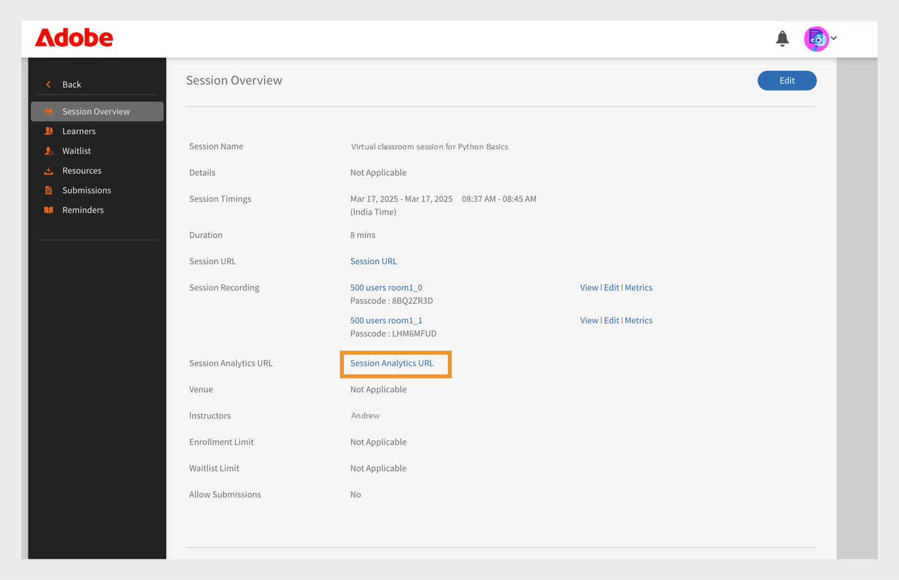
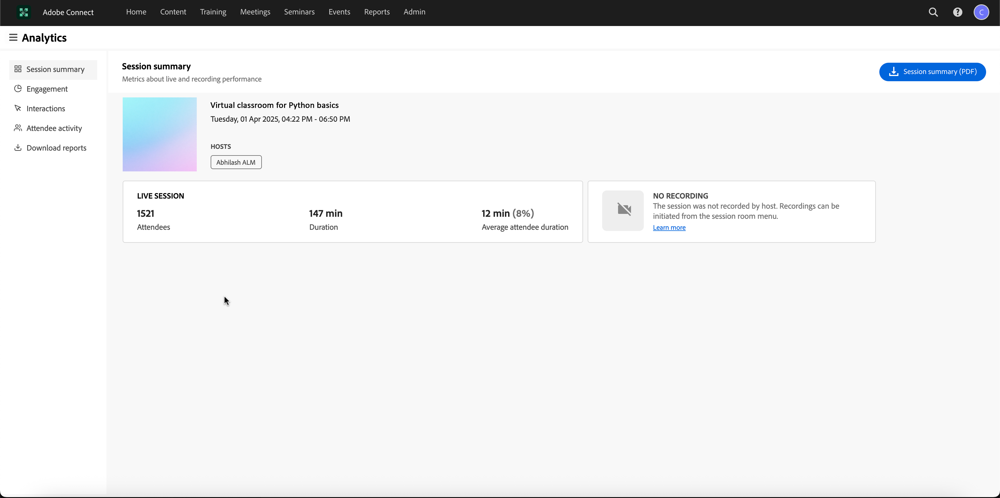

# 新功能摘要 2025 年 5 月

即將推出的 Adobe Learning Manager 將帶來多項新功能與強化，旨在簡化平台並提升其功能。

## 團體成功儀表板

Adobe Learning Manager 中的群組成功儀表板（GSD）讓管理員與經理能近乎即時地監控學員進度（從註冊、進度到完成到反映在儀表板上的延遲約 60 分鐘），跨部門或使用者群組。 它支援主動追蹤課程完成、註冊及待處理的行動，讓團隊的學習管理更為輕鬆。 群組成功儀表板透過以簡易操作的介面取代基於 Excel 的成績單，簡化進度追蹤，方便檢視學習者活動，以應對績效評估或合規檢查等情境。 這對於管理小型團隊（50人以下）的經理特別有幫助，例如店經理或內部團隊，能快速監控課程完成狀況並持續學習。

請參閱本文[](/help/migrated/administrators/feature-summary/group-success-dashboard.md)以了解更多關於團體成功儀表板的資訊。

## 自訂角色的增強

Adobe Learning Manager 現在允許使用者擁有多個自訂角色，滿足自訂管理員管理各種職責的需求。 每個角色最多可容納 500 名使用者，且每位使用者最多可擁有 50 個角色，提供任務委派的彈性。 使用者可透過個人資料中的新選項輕鬆切換分配角色，確保不同職責的無縫管理。 管理員可以透過使用者頁面中的新連結指派或修改角色，讓使用者能根據需要新增或移除角色。 這些改進簡化了多重責任的管理，尤其適用於資源有限的小型團隊。

請參閱本文[](/help/migrated/administrators/feature-summary/custom-role.md#assign-multiple-custom-roles-to-a-user)以了解更多關於自訂角色的資訊。

## 學員批量註冊、出席與完成 {#bulk-enrollment}

利用 Adobe Learning Manager 的批量註冊功能，管理員能透過上傳 CSV 檔案，有效為大量學習者註冊課程、證照或學習計畫。 此流程節省時間、確保一致性，並支持組織的可擴展性。 此外，管理員與講師可透過 CSV 上傳批量更新學習者資訊、出席狀況及完成紀錄，減少人工作業並確保資料準確性。

請參閱本文[](/help/migrated/administrators/feature-summary/courses.md#learner-bulk-enrollment-attendance-and-completion)以了解大量登記、出席及完成的更多資訊。

## 使用內容唯一識別碼和有效期限追蹤內容

內容唯一 ID 是 Adobe Learning Manager 中每個內容項目所賦予的獨特代碼。 它幫助管理員和作者輕鬆找到和管理內容，尤其是在更新或跨系統移動時。 此內容唯一識別碼也有助於將內容與其他工具（如人力資源或合規系統）連結。 所有語言版本都使用相同的內容唯一 ID，讓學習者保持一致。

到期日標示內容可能已過時或不再需要。 即使過了期限，內容仍可取得，但會提醒作者和管理員檢查並更新。 根據設定，過期內容可從新登記中移除或存檔。 與內容唯一識別碼相同，到期日對所有語言版本運作相同，有助於保持內容乾淨且最新。

此外，內容唯一識別碼支援與內容遷移流程整合，方便跨系統內容傳輸與管理。

* Content unique ID 讓外部系統與 Adobe Learning Manager 之間的連結變得更容易。
* 到期日幫助作者追蹤可能需要審查或更新的過時內容。

請參閱本文[](/help/migrated/authors/feature-summary/content-library.md#add-content-unique-id-and-expiry-date)以了解更多關於內容、獨特識別碼及有效期限的資訊。

## 管理員 AI 助理（測試版）

在複雜的學習環境中，管理員可能因選單複雜且工作流程分散而難以找到內容或完成任務。 例如，執行報告或存取特定資訊等任務，可能需要在多個畫面中切換。 行政 AI 助理（Beta）幫助您找到正確資訊，以有效理解並完成任務。

Adobe Learning Manager 中的 Admin AI 助理（測試版）幫助管理員快速找到常見問題的答案、探索系統功能，並了解如何完成關鍵任務，只需用淺顯的語言提問即可。 無論你是 Adobe Learning Manager 的新手，還是想更快的故障排除方法，Admin AI 助理（Beta）都能透過平台內直接提供情境感知協助，簡化你的工作流程。

它利用 Adobe 的 AI 能力，實現跨學習內容與系統工作流程的自然語言查詢。  管理員可以詢問「 **如何將使用者加入 Adobe Learning Manager** 或 **如何新增學習路徑**」等問題。 Adobe Learning Manager 管理 AI 助理（Beta）專門訓練於公開且由 Adobe 擁有的文件，例如託管於 **[!UICONTROL Experience League]**&#x200B;的資源。 它不會從客戶內容、內部培訓資料或使用者產生的數據中學習或存取。

請參閱本文[](/help/migrated/administrators/feature-summary/alm-ai-assistant.md)以了解更多關於 AI 助理（測試版）的資訊。

## 新內容語言

Adobe Learning Manager 以支援多種語言內容與介面聞名，這使其在眾多學習平台中脫穎而出。 每當達成里程碑，Adobe Learning Manager 都會擴展語言選項，以更好地支援全球且多元的使用者群。 在此版本中，我們將引入新的內容語言，進一步強化我們提供包容且易於取得學習體驗的承諾。

* 中繁香港（cn-HK）
* 挪威博克馬爾語（nb-NO）
* 泰米爾語（ta-IN）
* 泰盧固語（te-IN）
* 坎納達語（Kannada，稱 Kannada）
* 馬拉雅拉姆語（ml-IN）

請參閱本文[](/help/migrated/languages-supported.md)，了解 Adobe Learning Manager 中支援的語言清單。

## 內容市場的改進

Adobe Learning Manager 引入了新的購買模式，提供更多彈性與選項：Premium Essentials 與 Premium Essential Plus。 Essentials 提供具成本效益的解決方案以提升員工投入度，並包含 Skillshub、Thomson Reuters 和 Emtrain 等內容供應商。 Premium Essential Plus 提供來自 Blinkist、Pluralsight、Skillsoft、Traliant 和 Coursera 等優質供應商的額外內容。

請參閱本文[](/help/migrated/administrators/feature-summary/content-marketplace.md)以獲取更多關於新購屋計畫的資訊。

## FTP、自訂 FTP 和 Box 中的登入存取報告 {#log-in-access-report}

除了現有的工作 API 外，現在也支援 Box、FTP 及自訂 FTP 連接器的登入存取報告。 本報告提供使用者登入活動的詳細資訊，包括執行狀態、壓縮設定及排程選項。 報告可按需產生或排程，資料儲存在指定的連接器中，方便存取與分析。 此強化提升了監控與審核用戶登入活動的能力，確保更佳的安全性與合規追蹤。

報告現已在自訂的 FTP、FTP 與 Box 中提供，連同現有報告（如學習進度與課程完成度）一同提供。 此整合讓管理員能從單一來源存取所有必要報告，促進更佳的資料管理與分析。

該報告有助於自動化，讓登入與存取資料匯出至 FTP，並可與其他報告合併，建立完整的儀表板。 此功能對於依賴自動化流程進行資料分析與報告的組織特別有用。

請參閱本文[](/help/migrated/integration-admin/feature-summary/connectors.md)以了解更多關於 FTP、客製化 FTP 及 Box 連接器的資訊。

## 透過 SAML 登入時更新使用者語言偏好

Adobe Learning Manager 是一個多語言平台，透過介面語言、內容語言等多種方式，滿足學習者的語言偏好，課程及其模組與實例也同樣具備多語言功能。

對於 Adobe Learning Manager 原生平台的使用者，此強化解決了即時使用者配置的需求。 當使用者首次建立帳號並登入時，此功能能確保他們的語言偏好被準確捕捉並應用。

此功能確保使用者在透過 SAML 登入時，語言偏好會自動更新。 這有助於透過以使用者偏好的語言顯示介面，提供個人化的體驗。使用者透過 SAML 登入時，會根據登入過程中提供的資訊檢查並更新其語言偏好（介面與內容語言）。

此功能整合於 SAML 登入流程，無縫捕捉並更新使用者的語言偏好。

欲了解更多資訊，請參閱本文[](/help/migrated/administrators/feature-summary/set-up-interface-language-through-saml.md)。

## 在清除前先過濾已刪除的使用者

清除使用者意味著永久刪除他們的資料。 依使用者刪除日期排序，方便查找和管理特定紀錄。 此外，新增一個篩選器，管理員可依刪除的年份和月份選擇使用者，將名單縮小至特定時間範圍。 這些變更簡化了使用者清理流程，使管理員能在限定期間內選擇多筆紀錄，有效清除使用者。

更多資訊請參閱本文[](/help/migrated/administrators/feature-summary/purge-users.md#filter-deleted-users-before-purging)。

## Adobe Connect 連接器的增強功能

### 支持大型聽眾研討會

Adobe Learning Manager 現在也支援在 Connect 中設定虛擬客戶會議時，從 Adobe Connect 選擇研討會教室。 過去，管理員只能選擇會議室類型。 此強化讓持有有效研討會授權的管理員能在 Adobe Learning Manager 中排程並管理一次性或大型活動（最多可容納 1,500 名參加者）。

請參閱本文[](https://helpx.adobe.com/adobe-connect/using/creating-seminars.html)以獲取更多關於研討會教室的資訊。

### 支援會話分析存取

Adobe Learning Manager 允許用戶透過一個網址存取會話分析，該網址會重新導向到 Connect 會話分析儀表板。 此儀表板提供場次長度、參加人數及錄影細節的詳細資訊，約在場次結束後20分鐘內提供。


_選擇會話網址_


_會話儀表板_

請參閱本文[](https://helpx.adobe.com/in/adobe-connect/using/session-dashboard.html)以了解更多關於 Connect 會話分析的資訊。

## 遷徙變動

### 遷移內容的成功標準

Adobe Learning Manager 中匯入模組的遷移流程現在支援新增定義成功標準的參數。現在透過在module_version.csv中新增三個可選欄位來支援此功能。 新增三個可選欄位為：`successCriteria`、、 `successQuizData``successViewPercent`和 。

這些欄位只接受特定值，若輸入無效值，連接器將無法處理該檔案。測驗模組可以使用三種類型的成功標準。 如果學習者啟動內容，根據百分比分數（如下 `successViewPercent`定義）可以標記通過，或是根據測驗模組的結果（定義如下 `successQuizData`）。 此數值需依以下指示填寫。 successCriteria 參數用於判斷此問題。

`successCriteria`：接受 `LAUNCH_CONTENT`、 `VIEW_PERCENT`、 `QUIZ`或 `VIEWPERCENT_OR_QUIZ`。

* 如果`LAUNCH_CONTENT`：留空`successQuizData`。`successViewPercent`若學習者啟動內容，該系統會標記該學習者通過。
* 若 `VIEW_PERCENT`：輸入一個值， `successViewPercent`留 `successQuizData` 空。 這會根據測驗中得分的百分比來計算學習者通過。
* 若 `QUIZ`：輸入一個值， `successQuizData`留 `successViewPercent` 空。 這會根據測驗模組的結果，將使學習者被標記為通過。
* 若`VIEWPERCENT_OR_QUIZ`：輸入 和 `successViewPercent`的值。`successQuizData`這會根據測驗模組的結果或得分百分比，將判定學習者通過。

此欄位僅當 為真時 `hasQuiz` 才有效。 此外，若僅 `completionCriteria` 通過 `successCriteria` ，則視為與互動內容相同 `completionCriteria` 。

`successQuizData`：接受 `QUIZ_ATTEMPTED`， `QUIZ_PASSED`或 `QUIZPASSED_OR_LIMITREACHED`。

* `QUIZ_ATTEMPTED` 這表示如果學習者已經嘗試測驗，該學員將被標記為通過測驗。
* `QUIZ_PASSED` 若學習者依照測驗內容中定義的標準通過，則該學員將被標記為通過測驗。 例如，Scorm 模組會定義這些標準並回報給 Adobe Learning Manager。
* `QUIZPASSED_OR_LIMITREACHED` 若學習者已通過或已用盡測驗限制，則該學員將被標記為通過測驗。

`successViewPercent`：接受0到100的整數值。

* 此標準接受學習者通過測驗所需得分的百分比值Webhook 變更。

### 使用遷移後新增內容唯一 ID 與有效期限

遷移期間現已支援內容唯一識別碼與到期日。 為了啟用此功能，module_version.csv檔案中新增了兩個欄位：expiryDate 和 uniqueContentId。 請參閱此 [範例 CSV](assets/module_version_content.csv) 及 [CSV 規格文件](assets/4-module_version_content.xlsx) 以獲得更多資訊。

請參閱本文[](/help/migrated/integration-admin/feature-summary/migration-manual.md)以獲取更多關於遷移過程的資訊。

## Webhook 的改進

Webhooks 現在支援學習路徑（LP）課程中的活動，並在註冊、退選或完成時提供認證。這包括LP或認證課程中每門課程的支援活動，以及家長LO活動。

請參閱本文[](/help/migrated/integration-admin/feature-summary/webhooks-usage-guide.md)以獲取更多關於 Webhooks 的資訊。

## API 變更

所有公開 API 現在都支援更佳的錯誤處理，當資料`POST``PATCH`無效或不完整且有請求時，會回傳明確且具體的錯誤訊息。此強化特別適用於請求有效載荷中的關係欄位。

當請求包含錯誤的資料型別或關聯區缺少必要資訊時，API 會回覆描述性訊息，指出問題所在。 這使得在積分或測試過程中能更快識別並解決錯誤。

以下範例回應說明了各種錯誤情境：

```
{
  "status": "BAD_REQUEST",
  "title": "Field Type incorrect",
  "source": {
    "info": "incorrect relation type - Andrew"
  }
}
```

```
{
  "status": "BAD_REQUEST",
  "title": "Missing Param",
  "source": {
    "info": "skills"
  }
}
```

## 本次更新修正的錯誤

* 修正了 GET learningObject API 回應中工作輔助工具中不準確的時間戳，當時 dateCompleted、dateEnrolled 和 dateStarted 與 dateModified 不符。
* 使用者 API 端點現在顯示的是特定的欄位層級錯誤訊息，而非一般錯誤訊息。
* 當 /learningObjects 端點對預設目錄呼叫時，回傳了空白回應。
* 更新了公開 API 回應，顯示先前因版本過時而被排除的工作輔助工具。
* 透過移除學習者課程推薦區中出現的無關技能，提升推薦準確度。
* 將資料夾名稱與搜尋結果同步，使重新命名的內容資料夾在平台上所有搜尋中反映更新後的名稱。
* 課程概覽頁面的文字不會溢出。 現在的體驗乾淨許多。
* 為使用自訂網域的帳號恢復自我註冊連結，以支援更順暢的用戶註冊流程。
* 訂閱報告可防止彈性學習路徑中意外註冊課程。
* 在多重SSO配置中，所有已設定的設定檔都已可見，超出先前的20個設定檔限制。
* 在未明確要求的情況下，將內容市場課程排除在定期認證報名之外。
* 啟用了在「我的課程」和「課程」分頁中編輯權限的使用者的課程複製功能。
* 後續課程如預期自動自動註冊，透過目錄分享的強化學習路徑課程。
* 透過正確處理系統日期變更並設置適當的錯誤提示，可以防止意外的玩家啟動。
* 在課程模組移除後穩定作者的場次，避免突然終止場次。
* 組織標誌會在登出畫面上以完整大小顯示。
* 在建立學習路徑時，即使多次拖曳後，刪除按鈕功能仍被恢復。
* 當學習者缺乏專屬經理時，店經理會收到電子郵件通知。
* 透過更新使用者介面參考從「虛擬課程」到「虛擬教室」來標準化術語。
* 刪除的徽章不再可見，學習者將不再看到或解鎖過時的成就。
* 透過解決課程描述欄位的問題，電子郵件通訊中課程描述會被正確填入。
* 帳號層級討論區的配置不會被課程層級的設定覆蓋。
* 已解決阻擋檢查清單模組中教師指派的網址長度限制。
* 當使用者上傳檔案中偵測到重複欄位時，錯誤訊息會更清晰。
* 完整資料以增強的學習路徑 API 呈現，確保兒童學習路徑正確顯示。
* 在行動應用程式中新增了課程描述的富文字格式，以提升使用者體驗。

## 系統需求

[Adobe Learning Manager 系統需求](/help/migrated/system-requirements.md)

## Adobe Learning Manager 先前版本

* [2024年11月上映](/help/migrated/whats-new-nov-24.md)
* [2024年7月發行](/help/migrated/whats-new-july-2024.md)
