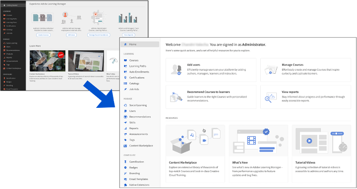
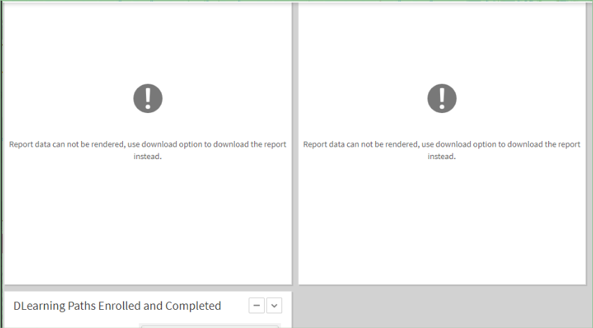

# 此版本的新增功能

## 改版的使用者介面

Adobe Learning Manager使用者介面已進行一些更新，以提供更乾淨且更現代的體驗。 管理員和作者角色的登陸頁面已改版，並且所有角色的UI主題已更新。 不過，選單、按鈕或連結的位置尚未變更，您將能夠準確地找到這些專案。

主題更新會自動套用至使用預設主題的帳戶。 UI主題更新不會影響已修改使用自訂主題的帳戶。 這類帳戶需要切換回預設主題，才能取得新的主題更新。

### 關於此變更

**此版本中有哪些變更？**

頁首有新的範本，可自動將標誌調整為固定大小與位置，同時維持標誌的外觀比例。 此次變更旨在提升學習者體驗的視覺吸引力。

學習者標題中的組織名稱也會自動調整為336 （最小） x 680 （最大） px。

**建議的標誌大小為何？**

標誌的最大寬度為210px。 寬度超過210px或高度超過42px的圖志會調整為42x210px。

如果標誌大小小於建議大小，則上傳標誌時不會做任何變更，且標誌會置中對齊。

**會有什麼影響？**

較長的公司名稱將會被修剪，而省略符號則會填滿空格。

**我們建議什麼？**

* 調整影像大小，保持外觀比例不變。 建議的標誌大小上限為42畫素（垂直） x 210畫素（水平）。
* 對於許多帳戶，這會自動套用；不需要變更。

## 原生擴充性

在Adobe Learning Manager的原生版本中設定自訂體驗，可讓您在不太複雜的案例中使用Headless。 您也可以建立自訂應用程式，並將其放置在學習者、經理、管理員、作者或講師工作流程的原生版本中的不同位置。

學習者可使用管理員已建立的自訂應用程式或擴充功能。

檢視[原生擴充性](/help/migrated/administrators/feature-summary/native-extensibility.md)以深入瞭解。

## 測驗建立工具

您現在可以使用內容庫頁面上新的測驗建立工具，在Learning Manager中建立評估。 建立的評估會成為內容庫的一部分，並可新增到「公用」資料夾以進行課程重複使用。

檢視[建立測驗](/help/migrated/authors/feature-summary/content-library.md)以瞭解更多資訊。

## 在此版本中報告變更

### 工作輔助註冊報表中的變更

在舊版Adobe Learning Manager中，工作輔助註冊報表沒有篩選器。 Adobe Learning Manager已下載帳戶的所有資料。

在此版本中，我們已在工作輔助報告對話方塊中新增下拉式清單。

### 通知宣告報告的變更

在舊版Adobe Learning Manager中，「通知公告」報告沒有任何篩選器。 Adobe Learning Manager已下載帳戶中的所有通知。

在此版本中，我們已新增日期篩選器，您可使用此篩選器在指定期間內下載通知。  不過，您只能下載過去六個月的報表。

### 註冊報表中的課程重新造訪資料變更

在這個版本中，您可以指定時間，下載註冊報表中的課程重新造訪資訊。 註冊超過500萬的帳戶的下載期將限製為六個月。 對於所有其他帳戶，期間將為15個月。

您可從&#x200B;**[!UICONTROL Reports]** > **[!UICONTROL Custom Reports]** > **[!UICONTROL Historic Reports]** > **[!UICONTROL Course Access Report]**&#x200B;下載報告。

### 學習者成績單中的變更

在舊版Adobe Learning Manager中，如果自訂管理員具有使用者範圍，則學習成績單會包含已刪除的使用者。 在此版本中，如果自訂管理員具有使用者範圍或所有使用者群組的存取權，則學習成績單將包含已刪除的使用者。

### 出席情況變更報告

「管理員」應用程式中「課程」出勤頁面及用來同步下載之「講師」應用程式中「工作階段學習者」頁面的「出勤率」報表。 在此版本中，此報表將透過通知非同步下載。

如需報告的詳細資訊，請參閱Adobe Learning Manager中的[報告](/help/migrated/administrators/feature-summary/reports.md)。

## 停止支援Content Marketplace

在匯入的內容市集目錄（企業培訓）中過期的課程一旦過期，就會自動刪除。 課程將設定為在內容標籤為停用時停用。 現有已註冊學習者可在限制的時間範圍內消費這些資料，之後這些資料將會被刪除。 這樣可保持目錄整潔，且不會向使用者顯示任何過期的課程。

## 以技能為基礎的新建議

Adobe Learning Manager改善了針對啟用客戶和合作夥伴的帳戶的建議。 隨著課程、學習路徑和認證的排名演演算法發生變更，建議演演算法的這項改善為內容探索提供了更好的使用者體驗。

演演算法將不再允許對等式建議。 此變更不會影響現有的使用者，但「產業調整」選項將繼續存在。 在「自訂」選項中，Adobe Learning Manager不再允許以自訂對等專案為基礎的選取。

對等群組現在會變成帳戶，而學習者會看到顯示群組中趨勢主題的字串。 所有建議都可解釋。 例如，如果您檢視的是主旨的某件事，分段上的卡片就會顯示課程的原因。

## 自訂管理工作流程增強功能

在存取報表方面，自訂管理員現在與管理員角色擁有更多同位權。 管理員將能夠設定報告存取權，並獲得更好的控制。

在Adobe Learning Manager中，自訂管理員只能使用學習成績單和Gamification成績單。 在此版本中，自訂管理員可以存取所有自訂報表，但xAPI和電子郵件報表除外，這些報表仍僅供管理員使用。 存取所有報告受限於自訂管理員擁有的目錄和使用者範圍。 只有完整範圍才有可用的報告很少。 它們是：

<table>
    <tbody>
        <tr>
            <td>
    
<b>報告</b>
</td>
   <td>
    
<b>可用</b>
</td>
   <td>
    
<b>範圍</b>
</td>
        </tr>
    <tr>
   <td>
    
內容稽核軌跡
</td>
   <td>
    
是
</td>
   <td>
    
完整目錄
</td>
  </tr>
  <tr>
   <td>
    
使用者稽核軌跡
</td>
   <td>
    
是
</td>
   <td>
    
完整使用者
</td>
  </tr>
  <tr>
   <td>
    
登入存取權
</td>
   <td>
    
是
</td>
   <td>
    
完整使用者
</td>
  </tr>
    </tbody>
</table>

**新的唯讀控制項**

在「自訂角色」頁面中，我們新增了下列「唯讀」選項，讓管理員能夠為「自訂管理員」提供更彈性的選項： 「自訂管理員」現在會為使用者、電子郵件範本和學習計畫提供額外的「唯讀」許可權。

**使用者**：

如果您選取「唯讀」，自訂管理員將能夠檢視所有使用者，但將無法編輯使用者資料，並為使用者建立自助註冊入口網站。

**學習方案**：

如果您選取「唯讀」，自訂管理員無法新增或編輯學習方案。 他們可以下載學習計畫報告並檢視其詳細資訊。 但他們無法變更課程詳細資料。

>[!NOTE]
>
>學習計畫將是額外的唯讀計畫，且具有完全控制權。

**電子郵件範本**

如果您選取「唯讀」，自訂管理員可以檢視電子郵件範本。 他們無法啟用或停用電子郵件範本設定，但可以下載電子郵件存取報告。

### 學習者成績單

如果選取了「使用者」許可權或「所有使用者群組」，且自訂管理員嘗試下載學習者成績單，則「包含已刪除的學習者」選項會在報表中傳回所有已刪除的學習者。

### 報表

自訂管理員可依據定義的範圍存取下列報表：

<table>
    <tbody>
        <tr>
            <td>
    
<b>報告</b>
</td>
   <td>
    
<b>可用</b>
</td>
   <td>
    
<b>範圍</b>
</td>
        </tr>
    <tr>
   <td>
    
內容稽核軌跡
</td>
   <td>
    
是
</td>
   <td>
    
完整目錄
</td>
  </tr>
  <tr>
   <td>
    
使用者稽核軌跡
</td>
   <td>
    
是
</td>
   <td>
    
完整使用者
</td>
  </tr>
  <tr>
   <td>
    
登入存取權
</td>
   <td>
    
是
</td>
   <td>
    
完整使用者
</td>
  </tr>
    </tbody>
</table>

<!--| Report | Available | Scope |
|--- |--- |
| Content Audit Trail | Yes | Full Catalog |
| User Audit Trail | Yes | Full User |
|Login Access | Yes | Full User |-->

## 增強型連線整合

講師可透過選取講師專屬的會議室，打造個人化的工作階段體驗。 在此版本中，我們已進行下列增強功能：

### 匯入成績單

您將能夠從Connect匯入工作階段成績單並分析這些成績單。 學習者會在錄製後收到成績單，以便稍後下載。

### 編輯影片

講師可編輯影片並增強學習者的觀看體驗。 講師將會在工作階段概觀頁面上看到連結，以將他們帶至Adobe Connect登入頁面。 登入後，講師會看到錄製連結。 按一下連結會將連結重新導向至影片，然後加以修剪。

## 將控制面板報告限製為具有管理員角色的使用者

管理員只能在控制面板報表中搜尋管理員。

## 限制舊版控制面板報表處理

當管理員嘗試繪製儀表板報告，而報告繪製時間過長（超過2.5分鐘）時，Adobe Learning Manager會顯示以下訊息：

*報告耗時過長時的錯誤訊息*

無法在使用者介面上顯示這種量值的報表，但管理員可以下載它們。

## 目錄標籤的移轉支援

移轉工作流程現在支援目錄標籤。 移轉CSV可用來匯入目錄標籤索引鍵和目錄標籤值，並將其附加至課程、學習路徑、認證和工作輔助。 如有需要，工作流程也可用來刪除不正確的值和索引鍵。

## 複雜課程篩選的API增強功能

現在可以透過Learning Manager API，依標籤和目錄標籤（使用「AND」和「OR」條件的組合）進階篩選課程。

## 此版本中的API變更

### 工作API中的驗證

在此版本中，如果工作輔助報表超過使用「工作API」產生的1,000萬份，回應將顯示訊息「請求的報表要產生的資料太多，請考慮套用工作輔助篩選器！」

### 已刪除貼文的通知

在舊版Adobe Learning Manager中，如果刪除了任何課程、認證或學習計畫並出現其通知，則您仍可透過其通知存取課程、認證或學習計畫。

在此版本中，我們將確保已刪除的貼文無法再存取。 如果您在/posts/{id} API中指定ID，而貼文的ID已無法使用，則API會顯示訊息「找不到指定資源的貼文」。

### 學習者API完成期限

在舊版中，Adobe Learning Manager會從登錄檔格中擷取截止日期。 在此版本中，Adobe Learning Manager會從課程例項表格計算截止日期。 如果截止日期無法取得，則會退回登錄檔格。

### 覆寫旗標

在2023年11月發行的Adobe Learning Manager中，我們將終止API的覆寫標幟。 覆寫旗標並非公用API規格的一部分，且旨在用於後端測試。 此標幟現已停止提供學習者API使用。 不過，標幟對管理員API仍然有效。

我們淘汰學習者API的標幟是因為覆寫標幟透過學習者API擷取大量資料。

下列學習者API日後將停止運作，因為有覆寫標幟。

`https://captivateprime.adobe.com/primeapi/v2/users?page[offset]=0&page[limit]=10&sort=id&override=TRUE`

### 反白顯示結果

在即將發行的Adobe Learning Manager版本中，例如在/search API中，我們將highlightResults的預設值變更為false。

此外，我們也會將snippetTypes的預設值變更為courseName。 如果highlightResults為True，則這樣做只會反白搜尋中的課程名稱。

### 測驗的新資源型別

`instances.loResources.resources`端點將傳回`ResourceContentType`並進行測驗。

## 淘汰通知

在2023年11月30日，LinkedIn學習將停止使用HTTP GET方法來取得OAuth權杖。 棄用後，您將只能使用HTTP POST方法產生OAuth權杖。
Adobe Learning Manager將於2024年2月終止BlueJeans服務。 2024年2月後新增的所有帳戶都不會包含BlueJeans聯結器。

## 發行說明

如需有關最新和舊版Learning Manager網頁應用程式和裝置應用程式的資訊，請參閱[發行說明](release-note/release-notes.md)。

## 此版本中修正的錯誤

* 當學習者開啟學習路徑或課程的預覽頁面時，學習路徑或其他課程的先決條件（課程縮圖）未顯示。
* 如果未選取「行事曆」、「Gamification」和「社交學習」選項，則學習者控制面板設定不會保留下一個設定。 您感興趣區域中的「建議」和「依目錄瀏覽」等選項不會顯示為已選取，但會顯示在預覽中。
* 即使學習者完成VC課程後，他們也會收到完成課程的提醒郵件。
* 若為同級帳戶，您無法下載儀表板報告。
* 刪除和新增課程中的檢查清單模組會產生內部錯誤。
* 如果是「工作階段邀請」範本，則寄件者的電子郵件ID會包含captivatePrime文字，而非AdobeLearningManager。
* 當您使用課程成效作為次要Y軸時，報告下載會因「Null指標例外」而失敗。
* 如果學習者被指派了自訂管理員角色，他們會依預設導覽至自訂管理員設定檔。 但是，當帳戶上設定了學習者重新導向URL時，會將「自訂管理員」帶往其他目的地，而不是「自訂管理員角色」設定檔。
* 如果disabled_sub_groups設定為大量數字，gamification範圍就無法如預期運作。
* 某些情況下，刪除的使用者會觸發移轉。
* 學習者無法在MS Teams應用程式上播放LinkedIn課程。
* 註冊API沒有如預期傳回Flex學習計畫或內嵌學習計畫的註冊。
* 在行動應用程式中，課程、認證或學習計畫的名稱會以小寫顯示。
* 在舊版Adobe Learning Manager中，如果刪除了任何課程、認證或學習計畫並出現其通知，則您仍可透過其通知存取課程、認證或學習計畫。 在此版本中，我們將確保已刪除的貼文無法再存取。 如果您在/posts/{id} API中指定ID，而貼文的ID已無法使用，則API會顯示訊息「找不到指定資源的貼文」。
* 在學習者API中，完成截止日期欄位不會顯示在註冊API的回應中。
* 在學習者的「取得註冊API」中，即使您指定的執行個體ID不正確，也會顯示註冊詳細資料。

## 此版本中的已知問題

* 當Flex學習計畫位於另一個Flex學習計畫內時，新註冊或更新註冊失敗。
* 成績單URL未顯示Adobe Connect工作階段中的工作階段錄製。
* 學習者可以在行動應用程式中參加離線測驗，即使測驗失敗也一樣。

## 系統需求

[Learning Manager系統需求](system-requirements.md)
