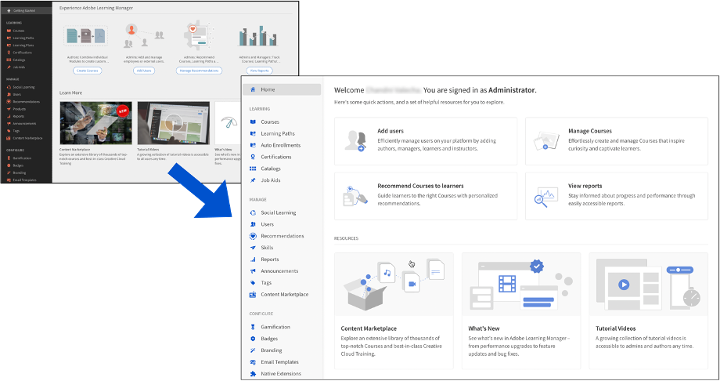
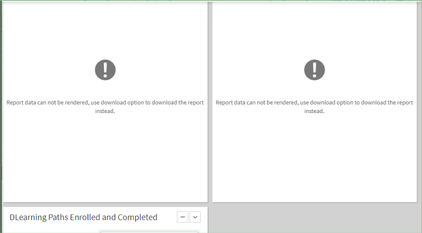

# 這次發布有什麼新意

## 全新設計的使用者介面

Adobe Learning Manager 使用者介面經過幾次更新，以提供更乾淨且更現代的使用體驗。 管理員和作者角色的登陸頁面已經重新設計，所有角色的 UI 主題也都已更新。 不過，選單、按鈕或連結的位置並未做任何更改，你仍能在原有位置找到它們。

主題更新會自動套用到使用預設主題的帳號。 UI 主題更新不會影響已修改以使用自訂主題的帳號。 這類帳號需要切回預設主題才能獲得新主題更新。

### 關於此變更

**這次釋出有什麼改變？**

標題中新增了一個模板，能自動調整標誌大小與位置，同時維持標誌的寬高比。 此變更旨在提升學習者體驗的視覺吸引力。

該組織名稱在標頭中也會自動調整為 336（最小）x 680（最大）的使用者，方便學習者使用。

**標誌建議的尺寸是多少？**

標誌的最大寬度為 210px。 寬度超過 210px 或高度超過 42px 的標誌會調整為 42x210px。

若標誌尺寸小於建議尺寸，則標誌上傳時不會有任何變動，且會置中排列。

**影響如何？**

較長的公司名稱會被修剪，空欄會用省略號填補。

**我們有什麼建議？**

* 調整畫面大小，保持畫面比例不變。 建議的最大標誌尺寸為 42 px（垂直）x 210 px（水平）。
* 對許多帳戶來說，這條規則會自動適用;不需要任何變更。

## 原生可擴充性

在原生版本的 Adobe Learning Manager 中設定自訂體驗，這樣你就不用在較簡單的案例中使用 headless。 你也可以建立自訂應用程式，並將它們放在學習者、管理者、管理員、作者或講師工作流程的原生版本中的不同位置。

學習者可以使用管理員自行開發的應用程式或擴充功能。

請參閱 [Native 擴充性](/help/migrated/administrators/feature-summary/native-extensibility.md) 以了解更多。

## 測驗製作工具

你現在可以在 Learning Manager 的內容庫頁面使用新的測驗製作工具來建立評量。 所建立的評量會成為內容庫的一部分，並可加入「公開」資料夾以方便課程重用。

查看 [，建立測驗](/help/migrated/authors/feature-summary/content-library.md) 以了解更多。

## 本新聞稿中的變更報告

### 就業援助登記報告變動

在早期版本的 Adobe Learning Manager 中，工作輔助報表沒有篩選功能。 Adobe Learning Manager 下載了帳號的所有資料。

在本版本中，我們在工作輔助工具報告對話框中新增了下拉選單。

### 通知公告報告變更

在早期的 Adobe Learning Manager 版本中，通知公告報告沒有任何篩選功能。 Adobe Learning Manager 下載了帳號內的所有通知。

在本版本中，我們新增了日期篩選器，您可以在此期間內下載通知。  不過，你只能下載過去六個月的報告。

### 課程變更：重新檢視招生報告中的資料

在此版本中，您可以透過指定時間下載報名報告中的課程重訪資訊。 對於註冊人數超過五百萬的帳號，下載期限將限制為六個月。 其他帳戶的期限為15個月。

你可以從 **[!UICONTROL Reports]** >> **[!UICONTROL Custom Reports]** **[!UICONTROL Historic Reports]** > **[!UICONTROL Course Access Report]**&#x200B;下載報告。

### 學習者成績單的變動

在早期的 Adobe Learning Manager 版本中，如果自訂管理員擁有使用者範圍，學習成績單會包含被刪除的使用者。 在此版本中，若自訂管理員擁有使用者範圍或所有使用者群組的存取權，學習逐字稿將包含被刪除的使用者。

### 出席人數變動報告

過去，Admin 應用程式中課程的出席頁面及 Instructor 應用程式的 Session Learners 頁面上的出席報告會同步下載。 在本版本中，該報告將透過通知非同步下載。

欲了解更多報表資訊，請參閱 [Adobe Learning Manager 中的報表](/help/migrated/administrators/feature-summary/reports.md) 。

## 內容市集的退役

匯入內容市場目錄（企業培訓）中已過期的課程，一旦過期將自動刪除。 當內容被標記為退役時，這些課程將被設定為退休。 現有註冊學習者可在有限時間內消費，之後將被刪除。 這樣可以保持課程目錄乾淨，不會顯示任何過期課程。

## 基於技能的新建議

Adobe Learning Manager 改善了客戶與合作夥伴啟用帳號的建議。 推薦演算法的改進，加上課程、學習路徑與認證排名演算法的改變，為使用者在內容發現上提供了更佳的體驗。

演算法將不再允許基於同儕的推薦。 此變更不會影響現有用戶，但產業整合選項仍將持續存在。 自訂選項中，Adobe Learning Manager 將不再允許自訂同儕選擇。

同儕群組現在變成一個帳號，學習者會看到一串顯示群組中熱門主題的串。 所有建議都是可以解釋的。 例如，如果你正在觀看某個主題的內容，條帶上的卡片會顯示該課程的理由。

## 自訂管理工作流程增強

自訂管理員現在在存取報告方面將與管理員角色更為平等。 管理員將能更有效地配置報告存取權限。

在 Adobe Learning Manager 中，只有學習成績單和遊戲化文字記錄對自訂管理員開放。 在此版本中，自訂管理員可存取所有自訂報告，唯獨 xAPI 與電子郵件報告仍僅供管理員使用。 所有報告的存取權取決於自訂管理員所擁有的目錄與使用者範圍。 少數報告僅提供完整範圍。 它們是：

<table>
    <tbody>
        <tr>
            <td>
    
<b>賽事報導</b>
</td>
   <td>
    
<b>可取得</b>
</td>
   <td>
    
<b>範圍</b>
</td>
        </tr>
    <tr>
   <td>
    
內容稽核追蹤
</td>
   <td>
    
是的
</td>
   <td>
    
完整目錄
</td>
  </tr>
  <tr>
   <td>
    
使用者稽核追蹤
</td>
   <td>
    
是的
</td>
   <td>
    
完整使用者
</td>
  </tr>
  <tr>
   <td>
    
登入存取
</td>
   <td>
    
是的
</td>
   <td>
    
完整使用者
</td>
  </tr>
    </tbody>
</table>

**全新唯讀控制**

在自訂角色頁面中，我們新增了以下唯讀選項，讓管理員能為自訂管理員提供更靈活的選項：自訂管理員現在將對使用者、電子郵件範本和學習計畫擁有額外的唯讀權限。

**使用者**：

如果你選擇只讀，自訂管理員將能查看所有使用者，但無法編輯使用者資料，並建立使用者自助註冊入口。

**學習計畫**：

如果你選擇只讀，自訂管理員就無法新增或編輯學習計畫。 他們可以下載學習計畫報告並查看詳細內容。 但他們不能更改課程細節。

>[!NOTE]
>
>學習計畫將額外為唯讀，並具備完全控制權。

**電子郵件範本**

如果你選擇只讀，自訂管理員可以查看電子郵件範本。 他們無法啟用或停用電子郵件範本設定，但可以下載電子郵件存取報告。

### 學習者成績單

若選擇使用者權限或全用戶群組，且自訂管理員嘗試下載學習者成績單，則「包含已刪除的學習者」選項將返回報告中所有已刪除的學習者。

### 報表

自訂管理員可依定義範圍存取以下報告：

<table>
    <tbody>
        <tr>
            <td>
    
<b>賽事報導</b>
</td>
   <td>
    
<b>可取得</b>
</td>
   <td>
    
<b>範圍</b>
</td>
        </tr>
    <tr>
   <td>
    
內容稽核追蹤
</td>
   <td>
    
是的
</td>
   <td>
    
完整目錄
</td>
  </tr>
  <tr>
   <td>
    
使用者稽核追蹤
</td>
   <td>
    
是的
</td>
   <td>
    
完整使用者
</td>
  </tr>
  <tr>
   <td>
    
登入存取
</td>
   <td>
    
是的
</td>
   <td>
    
完整使用者
</td>
  </tr>
    </tbody>
</table>

<!--
| Report | Available | Scope |
|--- |--- |
| Content Audit Trail | Yes | Full Catalog |
| User Audit Trail | Yes | Full User |
|Login Access | Yes | Full User |
-->

## 強化連結整合

講師可以選擇專屬的教室，個人化他們的課程體驗。 在本版本中，我們做了以下改進：

### 匯入逐字稿

你可以從 Connect 匯入會議記錄並分析這些內容。 學習者在錄製後會收到逐字稿，之後可下載。

### 剪輯影片

教師可以編輯影片，提升學習者的觀看體驗。 講師會在課程總覽頁面看到連結，前往 Adobe Connect 登入頁面。 登入後，講師會看到錄影連結。 點擊連結會讓他們跳到影片，並可剪輯影片。

## 限制儀表板報告僅限擁有管理員角色的使用者

管理員只能在儀表板報告中搜尋經理。

## 限制舊有儀表板報告處理

當管理員嘗試繪製儀表板報告，且報告繪製時間過長（超過 2.5 分鐘）時，Adobe Learning Manager 會顯示以下訊息：

*報告時間過長時出現錯誤訊息*

如此龐大的報告無法在使用者介面顯示，但管理員可以下載。

## 目錄標籤的遷移支援

遷移工作流程現在支援目錄標籤。 遷移 CSV 可用於匯入目錄標籤鍵與目錄標籤值，並將其附加到課程、學習路徑、認證及工作輔助資料上。 此工作流程也可用來刪除錯誤的值與鍵值。

## 複雜課程篩選的 API 增強功能

現在可以透過學習管理器 API 進行進階的標籤與目錄標籤篩選（結合「AND」與「OR」條件）。

## 本版本的 API 變更

### 工作 API 中的驗證

在此版本中，若工作輔助報告透過工作 API 產生超過 1,000 萬筆，回應將顯示「請求報告產生資料過多，請考慮套用工作輔助篩選器！」。

### 刪除貼文通知

在先前的 Adobe Learning Manager 版本中，如果任何課程、認證或學習計畫被刪除且有通知，你仍可透過通知存取該課程、認證或學習計畫。

在本版本中，我們將確保已刪除的貼文不再可存取。 如果你在 /posts/{id} API 中指定 ID，而該貼文的 ID 已無法取得，API 會顯示「指定資源找不到貼文」。

### 學習器 API 完成截止日期

在先前版本中，Adobe Learning Manager 會從註冊表中取得截止日期。 在此版本中，Adobe Learning Manager 將從課程實例表計算截止日期。 若截止日期無法使用，則將退回報名表。

### 覆寫旗標

在 2023 年 11 月的 Adobe Learning Manager 版本中，我們將停止對 API 的覆寫標記。 覆寫旗標並非公開 API 規範的一部分，主要用於後端測試。 該旗標現已停止用於學習者 API。 不過，該旗標對於管理 API 仍然有效。

我們之所以棄用 Learner API 的旗標，是因為覆蓋旗標透過 Learner API 取得大量資料。

未來，以下的 Learner API 將因覆蓋標誌而停止運作。

`https://captivateprime.adobe.com/primeapi/v2/users?page[offset]=0&page[limit]=10&sort=id&override=TRUE`

### 精華賽果

例如，在即將推出的 Adobe Learning Manager 版本中，在 /search API 中，我們將 highlightResults 的預設值改為 false。

此外，我們會將 snippetTypes 的預設改為 courseName。 只有當 highlightResults 為真時，才會在搜尋中標示課程名稱。

### 測驗的新資源類型

`instances.loResources.resources`終點會帶著測驗回來`ResourceContentType`。

## 退役通知

2023 年 11 月 30 日，LinkedIn Learning 將停止使用 HTTP GET 方法來取得 OAuth 令牌。 棄用結束後，你只能用 HTTP POST 方法產生 OAuth 代幣。
Adobe Learning Manager 將於 2024 年 2 月停產 BlueJeans。 2024 年 2 月後所有新帳號都不會包含 BlueJeans 連接件。

## 發行說明

有關 Learning Manager 網頁應用程式與裝置應用程式目前及先前版本的資訊，請參閱 [發佈說明](release-note/release-notes.md)。

## 本版本已修正錯誤

* 課程縮圖是學習路徑或其他課程的先決條件，當學習者打開學習路徑或課程的預覽頁面時，縮圖不會顯示。
* 若未選擇行事曆、遊戲化及社交學習選項，學習者儀表板設定將不會保留下一個設定。 像是「推薦」和「依目錄瀏覽」這類選項不會顯示為被選中，而是會顯示在預覽中。
* 即使學員完成VC課程後，仍會收到一封完成課程的提醒郵件。
* 對於同儕帳號，你無法下載儀表板報告。
* 在課程中刪除並新增檢查清單模組會產生內部錯誤。
* 以會議邀請範本為例，寄件人的電子郵件 ID 是 CaptivatePrime 而非 AdobeLearningManager。
* 當你使用課程效能作為次要 Y 軸時，報告下載會因 Null 指標例外而失敗。
* 若學習者被指派自訂管理員角色，預設會進入自訂管理員設定檔。 然而，當帳號設定了學習者重定向網址時，自訂管理員會被帶到不同的目的地，而不是自訂管理員角色設定檔。
* 如果disabled_sub_groups設為過多，遊戲化範圍就無法如預期運作。
* 在某些情況下，刪除的使用者會觸發遷移。
* 學習者無法在 MS Teams 應用程式中玩 LinkedIn 課程。
* 註冊 API 不會如預期回傳 Flex 學習計畫或嵌入式學習計畫的註冊資料。
* 在行動應用程式中，課程、認證或學習計畫的名稱會以小寫顯示。
* 在先前的 Adobe Learning Manager 版本中，如果任何課程、認證或學習計畫被刪除且有通知，你仍可透過通知存取該課程、認證或學習計畫。 在本版本中，我們將確保已刪除的貼文不再可存取。 如果你在 /posts/{id} API 中指定 ID，而該貼文的 ID 已無法取得，API 會顯示「指定資源找不到貼文」。
* 在學習者 API 中，完成截止日期欄位並未顯示在註冊 API 的回應中。
* 在「學習者取得註冊 API」中，即使你輸入錯誤的實例 ID，註冊細節仍會出現。

## 本版本已知問題

* 當一個彈性學習計畫屬於另一個彈性學習計畫時，新的註冊或更新註冊就會失敗。
* 逐字稿網址不會顯示 Adobe Connect 會話中的錄音。
* 即使學員不及格，也可以在手機應用程式中進行離線測驗。

## 系統需求

[學習管理器系統需求](system-requirements.md)
