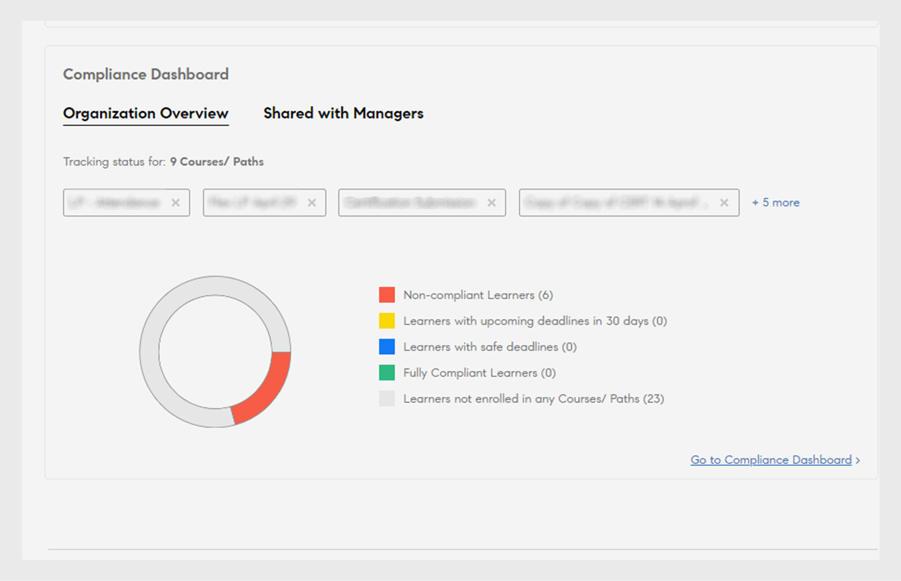
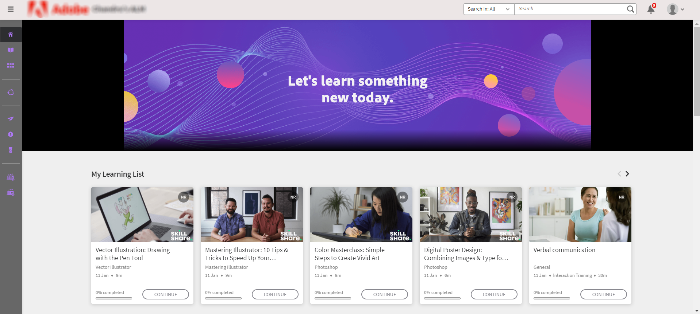
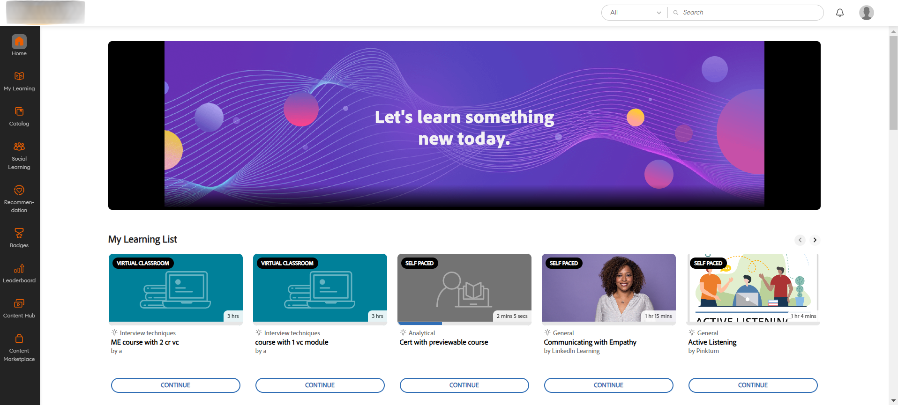

# 新功能摘要 {#new-features-summary}

瞭解 Adobe Systems 學習管理員 2024 年 7 月版中的新功能和增強功能。

## 合規性儀錶板中的增強功能

### 什麼是合規性儀錶板？ {#whatiscompliancedashboard}

**[!UICONTROL Compliance Dashboard]** In **Adobe Systems 學習管理員**&#x200B;允許管理人員監視和監視學習者實現學習目標的進度。他們可以檢查團隊成員是否滿足最後期限並跟上他們的學習過程，這有助於確保合規性。 管理員可以設置合規性儀錶板並與經理共用。

若要在「管理」應用中訪問合規性儀錶板，請選擇 **[!UICONTROL Reports]** “> **[!UICONTROL Learning Summary]** > **[!UICONTROL Compliance Dashboard]**”。

### 版本中的更改

借助增強的合規性儀錶板，管理員和經理可以視圖與其特定類別（例如，銷售、市場行銷和法律）相關的合規性類型課程、學習路徑或認證。 管理員可以將自定義合規性課程分類為特定類別。 自定義合規性類別由目錄標籤提供支援。  管理員可以創建課程儀錶板並與管理員共用。 然後，經理可以在各自的實例上視圖相同的儀錶板。 還增強了合規性儀錶板和合規性電子郵件通知的用戶介面。

#### 工作流程

以下是使用增強的合規性儀錶板的步驟：

| 角色 | 任務 | 其他資訊 |
|---|---|---|
| 管理 | 建立自定義合規性標籤 | 有關詳細資訊，請參閱本文[建立自定義合規性標籤](/help/migrated/administrators/feature-summary/reports.md#compliance-dashboard) |
| 作者 | 將這些標籤添加到課程中 | 有關詳細資訊，請參閱將合規性標籤添加到課程/學習路徑/認證](/help/migrated/authors/feature-summary/courses.md#add-compliance-labels-to-courselearning-pathcertification)一文[。 |
| 管理 | 建立包含合規性課程的儀錶板並與經理共用 | 有關詳細資訊，請參閱本文 [建立並共用合規性儀錶板](/help/migrated/administrators/feature-summary/reports.md#create-and-share-a-compliance-dashboard) 。 |
| 經理 | 檢視合規性儀錶板 | 有關詳細資訊，請參閱本文[合規性狀態](/help/migrated/managers/feature-summary/manager-dashboard.md#compliance-status) |

## 學習者用戶介面改造

>[!IMPORTANT]
>
>新的學習者UI將分階段發佈。

**學習者UI**&#x200B;已更新為更加優雅和現代的設計。、**[!UICONTROL My Learning]**、、**[!UICONTROL Catalog]**&#x200B;和&#x200B;**[!UICONTROL Course Overview]**&#x200B;著陸頁面煥&#x200B;**[!UICONTROL Learner Home]**&#x200B;然一新。課程卡還具有新設計，以現代方式顯示詳細資訊。 將滑鼠懸停在課程卡片上會顯示課程描述和發佈日期。

>[!NOTE]
>
>改進后的用戶介面僅適用於沉浸式佈局。 這些變更在行動網站或應用程式上尚不受支援，並將在未來的版本中更新。


_舊用戶介面_


_新 用戶介面_

### 此版本中的更改

**實現外觀現代化**

全新更新的視覺元素與現代設計趨勢保持一致，使產品看起來直觀而吸引人。 這包括新的刊頭、側面板和外觀現代的小部件。

**增強使用者體驗**

學習者現在將在以下页面上視圖類似的卡片 視圖：主页、目錄、我的學習和課程概述頁面，提供統一的體驗。

[檢視學習者首頁](/help/migrated/learners/feature-summary/learner-home-page.md)了解更多信息。

**課程發佈日期的更改**

通過此增強功能，導入學習管理器Adobe Systems LinkedIn 和 Go1 課程的發佈日期將是 LinkedIn 和 Go1 上的實際發佈日期。 您也可以在用戶介面上視圖 LinkedIn 和 Go1 課程的實際發佈日期。 [檢視 課程卡](/help/migrated/learners/feature-summary/learner-home-page.md#course-cards)了解更多信息。

## 非登入體驗的更新

非登入體驗可讓您為未登入的客户建立即時體驗。 這可以作為其行銷廣告系列的登陸頁面，提供足夠的信息來鼓勵註冊。

### 此版本中的變更

客戶可以購買高級計劃來版本編號這種高度可擴展的非登錄體驗。 這個非登錄體驗由培訓數據訪問](/help/migrated/integration-admin/feature-summary/connectors.md#training-data-access)提供支持[，使用Adobe Systems學習管理器 API 提供有關授權限制、佔用的座位、候補名單限制和候補名單計數的實時數據。客戶可以使用這些 API 優惠方案未登錄的學習者搜尋和篩選功能以及完整的課程摘要。 有關 API 的詳細資訊，請參閱本文 [非登錄 API](/help/migrated/integration-admin/feature-summary/non-logged-in-apis.md) 。

>[!NOTE]
>
>請聯繫支持團隊或CSAM購買高級計劃。

## 支援多個Stock保持單位 （SKU）

學習者現在可以向購物車添加多個課程、學習路徑或認證，並一起購買。

### 版本中的更改

以前，學習者一次只能購買一門課程。 在此版本的 **Adobe Systems 學習管理器**&#x200B;中，他們可以使用 購物車 一次購買多個課程、學習路徑或認證。

此功能僅在學習者應用（現有UI、新學習者UI和移動沉浸式應用）中可用。

[檢視 ALM 中的多專案購物車](/help/migrated/learners/feature-summary/multi-item-cart.md)

## Fluidic Player 支持 HTML5 內容

**Adobe Systems學習管理器** 現在支持將 HTML5 內容 作為.zip文件上傳到 內容 資料庫。 上傳后，這些檔可以作為模組包含在課程中。 此外，作者可以為自定進度的 HTML5 模組定義完成條件，允許學習者標記完成或在啟動時自動完成。

### 此版本中的變更

Adobe Systems 學習管理器現在在自定進度課程中支援 HTML5 的內容。 作者可以將 HTML5 內容以.zip檔案的形式新增至自定進度的內容。 學習者可以在 Fluidic Player 中視圖 HTML5 內容。 借助新功能，學習者現在可以直接在自定進度課程的 Fluidic Player 中將課程標記為已完成。 [檢視內容 資料庫](/help/migrated/authors/feature-summary/content-library.md#add-html5-file-type-in-the-content-library)中添加 HTML5 文件類型以獲取更多信息。

借助新的增強功能，只要作者已將完成條件設置為新選項 **[!UICONTROL On Launching content]**，在訪問URL時，具有外部連結的課程將自動標記為完成。 活動模組頁面中添加了新選項 **[!UICONTROL Completion Criteria]** ，作者可以在其中設置外部連結的完成條件。 [檢視在活動 模組](/help/migrated/authors/feature-summary/courses.md#add-html-link-in-the-activity-module)中添加 HTML 連結以獲取更多信息。


_完成條件選項-活動模組_

## 移動應用程式上的課程過期推送通知

每當學習者錯過課程截止日期時，他們都會收到推送通知。 借助此新的增強功能，學習者現在可以選擇將提醒暫停 24 小時，或者在下周收到每個過期提醒時收到提醒。 這僅適用於截止日期逾期通知。 [檢視 排程推送通知](/help/migrated/learners/feature-summary/user-notifications.md#schedule-the-push-notification)

## 此版本中的 API 變更

### Search API

Search API 包含下列變更：

學習者可以使用 API 搜尋 ```GET /search``` 目錄篩選器中的標籤。 學習者可以通過選擇 ```tag``` 參數值 ```filter.loTypes``` 來搜尋標籤。

**示例捲曲**

```
curl -X GET --header 'Accept: application/vnd.api+json' --header 'Authorization: oauth 5a858f23924f4feafa38ae8d6c4d97b6' 'https://example.com/primeapi/v2/search?page[limit]=10&query=Business&autoCompleteMode=true&filter.loTypes=tag&sort=relevance&filter.ignoreEnhancedLP=true&matchType=phrase&persistSearchHistory=true&stemmed=false&highlightResults=true'
```

新的篩選器、可用授權、可用候補名單和時間範圍篩選器已添加到以下 API： ```GET /search``` 和 `GET /learningObjects`。

新篩選器 `filter.session.includeEnrollmentDeadline` 已新增至下列 API ```GET /search```。

### 帳戶 API

已在 API 中添加```GET /account```了新列 `custom_injections`、 `showComplianceLabel`和`complianceLabelDefaultID`，以獲取用戶終結點帳戶數據。

### 學習物件 API

以下是此更新中對學習物件 API 所做的變更：

在 API 下方`authorDetails``GET /learningObjects`新增的新回應舊版作者 ID 和其他詳細數據。此外，還添加了新篩選器 ， `filter.authors`用於篩選舊作者及其課程。

調用 `effectivenessIndex` 的新屬性將幫助您獲取課程效果數據。

**示例捲曲**

```
curl --location 'https://example.com/primeapi/v2/learningObjects/course%3A9790045?enforcedFields%5BlearningObject%5D=effectivenessData' \
--header 'Accept: application/vnd.api+json' \
--header 'Authorization: oauth 598665ab5c8a99bea0e774d9faf7f3ca'
```

新的回應 `whoShouldTake`，提供了有關誰應該參加本課程的詳細資訊，已添加到以下 API： `POST /learningObjects/query`、 `GET /learningObjects/{id}`和 `GET /learningObjects`。

**示例捲曲**

```
curl -X GET --header 'Accept: application/vnd.api+json' --header 'Authorization: oauth 28a83fb8c87579af8ebc4434cc80f0c0' 'https://example.com/primeapi/v2/learningObjects/course%3A1131255' 
```

新的回應 `waitlistLimit`，提供有關候補名單限制的詳細資訊，已添加到 API 中 `GET /learningObjects` 。

提供學習物件總數的新回應 `count` 已新增到 API `GET/ learningObjects` 和 `POST/ learningObjects/query`.

新的回應， `catalogFieldId` `fieldValueId`並已新增到 API 中`catalogLabels``GET/ learningObjects`。

學習者可以在 API `GET /preview/learningObjects`中獲取目錄標籤值。

### 新 API 來獲取市場數量

在此版本中， `GET /search/marketplace/count` 添加了一個新的 API。 這有助於獲取內容市場中可用學習物件的計數。

**示例捲曲**

```
curl -X GET --header 'Accept: application/vnd.api+json' --header 'Authorization: oauth d8631c7b0e3b5d2ae00422ef30aaecfc' 'https://example.com/primeapi/v2/search/marketplace/count?query=course'
```

**範例回應**

```
{
  "count": 54910
}
```

### API 執行個體學習物件

以下是此更新中對學習物件執行個體 API 所做的更改：

在此版本中，名為 `gamificationEnabled` 的新密鑰已添加到學習物件 執行個體 API `GET /learningObjects/{loId}/instances/{loInstanceId}`中。

**示例捲曲**

```
curl --location 'http://example.com/acapapi/primeapi/v2/learningObjects/learningProgram:12756/instances/learningProgram:12756_15644' 
```

`gamificationSettings`上述 API 的新屬性，用於獲取遊戲化設置的詳細資訊。例如： `GET /learningObjects/{loId}/instances/{loInstanceId}/gamificationSettings`.

**示例捲曲**

```
curl --location 'http://example.com/acapapi/primeapi/v2/learningObjects/learningProgram:103852/instances/learningProgram:103852_103526/gamificationSettings'
```

`leaderboard`上述 API 的新屬性，用於獲取遊戲化設置的詳細資訊。例如： `GET /learningObjects/{loId}/instances/{loInstanceId}/leaderboard`.

**示例捲曲**

```
curl --location 'https://example.com/primeapi/v2/learningObjects/learningProgram:106339/instances/learningProgram:106339_105775/leaderboard' \
--header 'Accept: application/vnd.api+json' \
--header 'Authorization: oauth de4b5ee6efdd42375130db27ff503dd4'
```

### 偏移限制的變更

為了更有效地提高系統性能和管理資源利用率，Adobe Systems 已棄用 ADMIN 和 LEARNER 作用域的 GET/users 終結點中的高偏移值。 我們建議使用作業 API 檢索具有偏移值的記錄。

### 已棄用的 API

[Adobe Systems學習管理器](/help/migrated/api-deprecations-list.md)中檢視 API 已棄用，以累積清單產品中所有已棄用的 API。

## 報告的變更

### 合規性儀錶板

在此版本中，「合規性儀錶板」報告有兩個新列：

* 地位
* 合規性類型

這是對現有欄的補充：

* 使用者名
* 用戶電子郵件
* LP/認證/課程
* 類型
* 註冊日期（UTC 時區）
* 截止日期（UTC 時區）
* 完成日期 （UTC 時區）
* 進度 %

### 培訓報告

「管理員>報表」>**「自定義報表**」中的&#x200B;**「培訓報表」和**「作業 API **」過去具有稱為**「技能」**和**「標記&#x200B;**」的欄。** ****&#x200B;這些列現在已重命名為&#x200B;**「技能和****標記**」。。

### 內容稽核報表

在此版本中， **[!UICONTROL Content Audit Trail]** 報表現在在「修改類型」欄包含下列新屬性：

* 使用者群組新增
* 使用者群組移除
* 自定義加標籤新增
* 自定義加標籤 移除
* 共用目錄新增
* 共用目錄移除
* 共用目錄更新

## 此更新中的錯誤已修復

**活動提交**

* 嘗試將文件重新上傳到 活動 提交模組失敗，網路調用中出現 錯誤 500。

**應用程式介面**

* 如果多個講師具有相同的電子郵件位址，則創建 Connect VC 會議將失敗。
* 註冊到學習路徑后，MS Teams VC 在概述頁面上顯示不正確的URL。
* 作為作業 API 回應的一部分提供的預簽名URL用戶報告將在六小時後過期。
* 生成課程註冊報告時，課程名稱列顯示的課程名稱不正確。
* 當然，遷移工作者在調用批量 API 時無法發送唯一的lo id，但該 id 被刪除。
* 當課程包含在用戶可以訪問的特定目錄中時（同時禁用預設目錄），儘管設置阻止未註冊的學習者查看課程，您仍可以通過 learningobject/id 端點檢索課程的中繼資料。
* 當 skillname 在 GET /learningObject API 的名稱中包含逗號時，技能篩選器不會按預期工作。
* SFTP 的數據保留工作者中檔案的時間戳中繼資料不一致。
* 如果刪除並重新配置任何連接器，則專案遷移狀態顯示為已關閉。
* 培訓報表含有「標記」作為欄標題，而非「標記」。
* 如果目錄被禁用，並且任何導出的課程只是禁用目錄的一部分，則商務連接器匯出將失敗。

**認證**

* 有時，重新註冊定期認證的用戶會失敗。

**自訂角色**

* 在某些情況下，當自定義管理員嘗試切換到教師角色時，會顯示錯誤 403 禁止。

**電子郵件範本和通知**

* 取消課程后，當從課程中刪除講師時，電子郵件通知不會發送給最後一組講師。
* 創建虛擬講師指導培訓后，召集人不會收到 MS Teams 的電子郵件通知。 只有在發佈課程並啟用電子郵件範本後，才會觸發電子郵件。
* 有時，電子郵件範本包含不正確的日期格式和翻譯。

**學習者**

* 當學習者註冊了課程的多個實例，並且您下載出勤報告時，該報告包含不正確的資訊。
* 如果將用戶添加到公開故事中，則可以視圖其他用戶的私人帖子。
* 在某些情況下，您無法從認證中取消註冊學習者。 嘗試取消註冊時顯示錯誤消息。
* 認證在管理員僅在選擇一門課程后將其標記為已完成平均。
* 如果會話的結束時間更改為以前的日期，則管理員無法將 VC 標記為完成。
* 對於候補名單上的學習者，“會話出勤”報告顯示為“未參加”。

**學習者應用**

* 將課程筆記下載為 PDF 后，筆記會隨機顯示。 他們不追隨順序。

**學習路徑**

* 在學習路徑中選擇技能后，當您選擇文字欄位時，下拉清單不會按預期顯示。
* 在某些情況下，您無法移除學習路徑中的技能。

**學習計劃**

* 如果彈性學習計劃包含許多課程，則平均管理員將其標記為完成後，學習計劃不會完成。
* 當學習者更改實例時，註冊報告中的列last_modified_by不會更新。

**報告**

* 在某些情況下，管理員無法匯出培訓報表。
* 當 SCORM 內容包含超過 32,767 個字符的問題或答案時，您無法在 Excel 中下載課程測驗報告。
* 選擇重設遊戲化“後，不會重置達到等級的日期。

**搜索**

* 目前，匯出所有使用者組后，輸出中也會顯示已刪除的使用者組。
* 由於間歇性搜尋問題，無法搜尋認證。

## 此版本中的已知問題

行動離線播放器不會載入 HTML5 內容。

## 系統需求

[檢視Adobe Systems學習管理器系統要求](/help/migrated/system-requirements.md)。

## Adobe Systems 學習管理器的上一個版本

* [2024年3月版](/help/migrated/whats-new-march-2024.md)
* [2023 年 11 月版本：](/help/migrated/whats-new-november-2023.md)
